# 干货实操|ai视频+豆包制作独居少女漫画视频

> 来源：[https://parwc0x6nb.feishu.cn/docx/JqEDdjiPuoOD2qxxH7NcRnYNnIh](https://parwc0x6nb.feishu.cn/docx/JqEDdjiPuoOD2qxxH7NcRnYNnIh)

大家好，我是刘同学。今天我们制作的是漫画版的独居女孩治愈系 vlog。

最近治愈系独居女孩非常的火，出来的数据点赞收藏的数据都是很不错的，

变现方式可以是引流、收徒，卖橱窗智能体。

文生图95，图生视频70

【抖音爆款插图】【小红书插图】【成片视频展示】

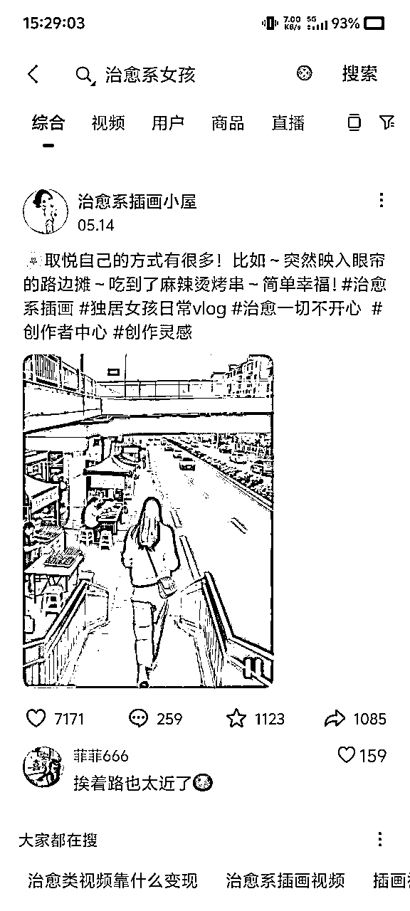

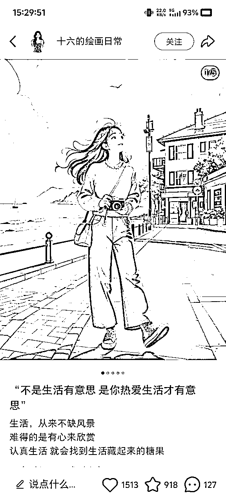

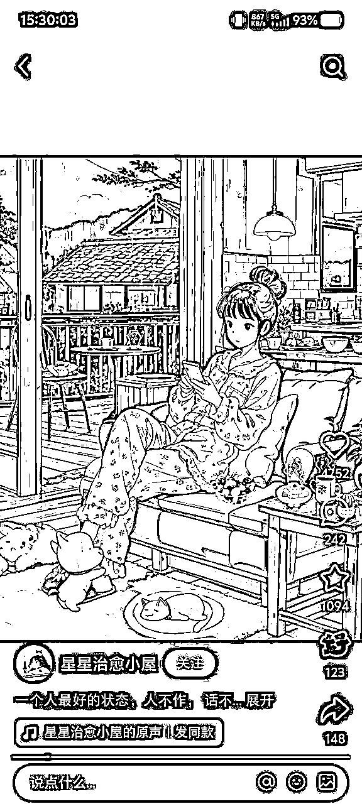

# 一、确定故事分镜，豆包生图

## 1.1一般可以采用直接找爆款故事，或者对标他人故事改编。

以下为我根据这个视频节选的七个片段

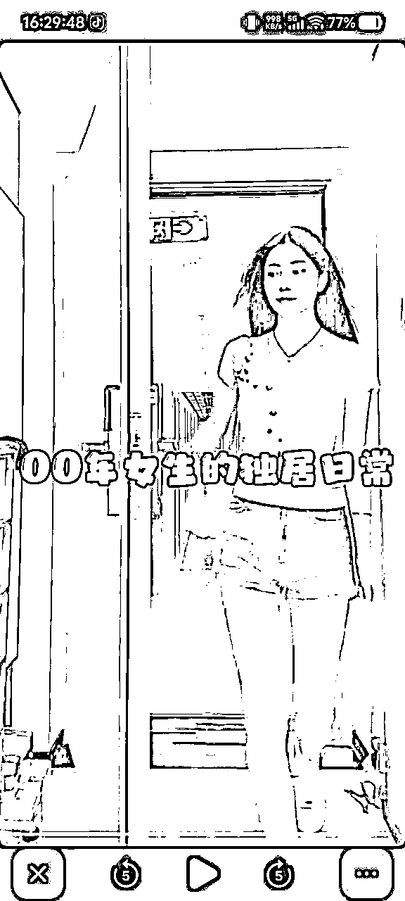

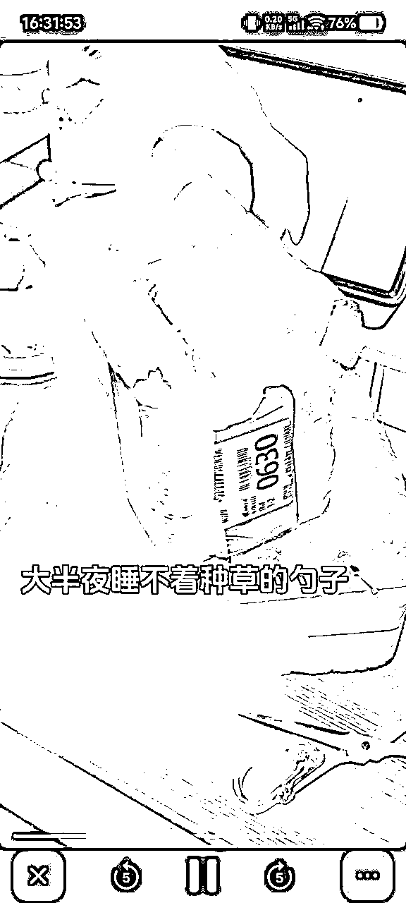

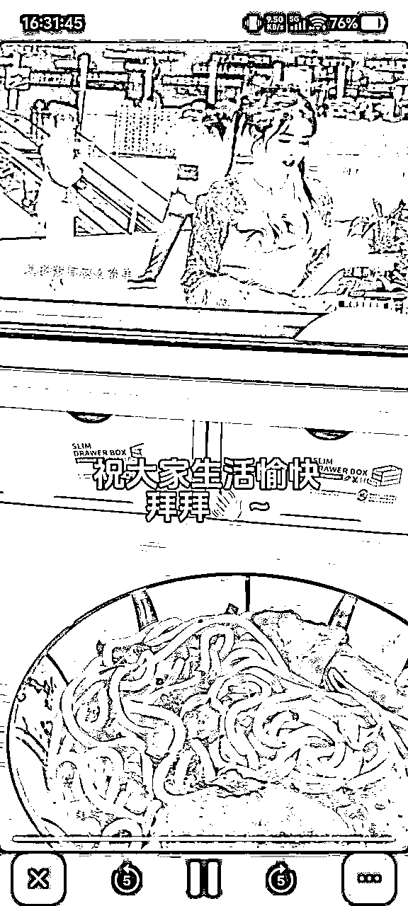

【提取视频包含的内容】识别图片内容，生成中文图片提示词

## 1.2根据豆包提出的提示词，修改内容，生成图片

## 1.3重复以上操作，继续生成画面

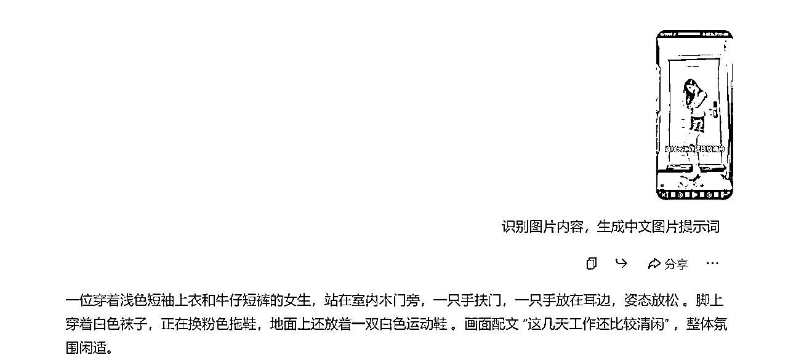

最后生成6张图片

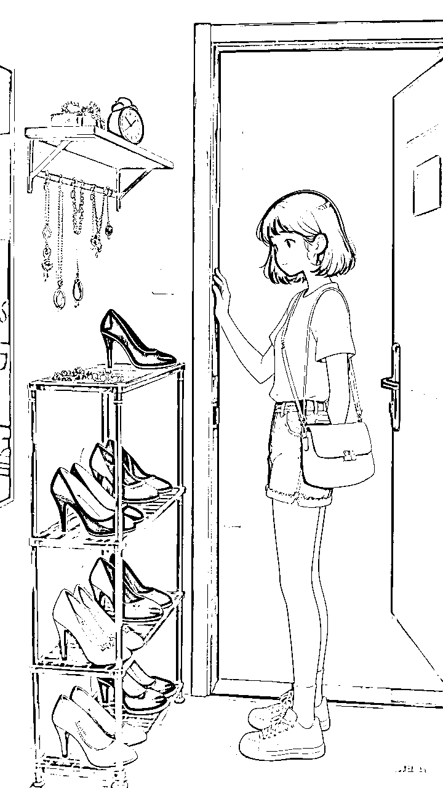

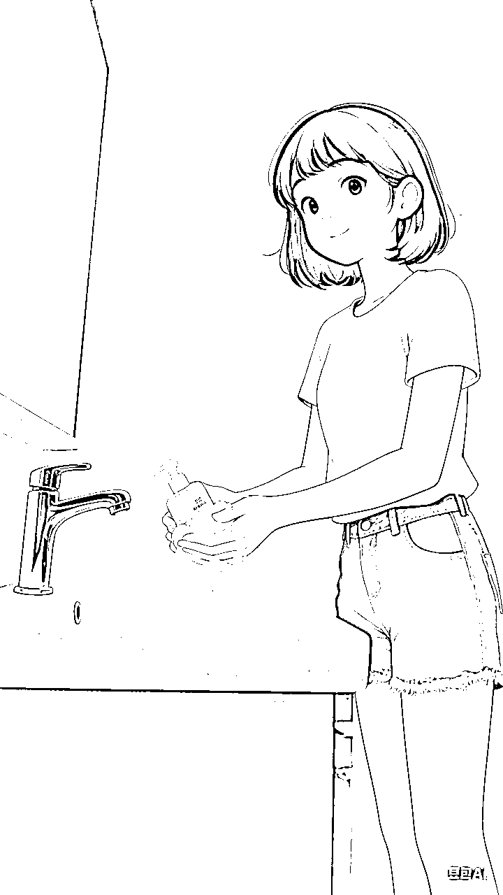

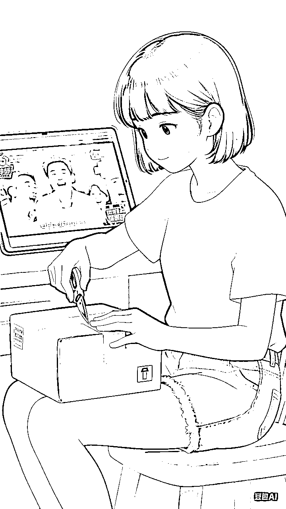

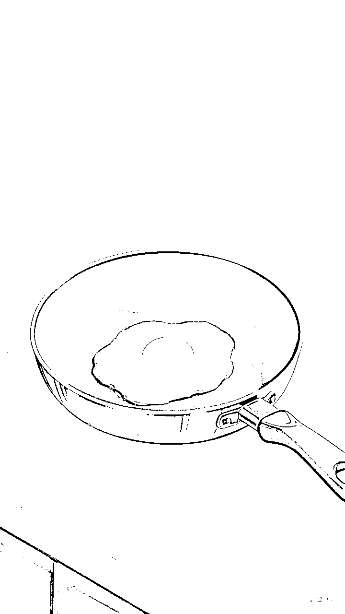

## 1.4人物一致性的保持

让人物衣服，裤子，包，头发，相对固定，比如我在提示词中一直在强调的浅黄色上衣，蓝色短裤，白色包包

## 1.5：注意事项

千万别去开门，千万别开门，现在六指很少见了，但是开门进门太难了

# 二、打开图片生成视频平台

https://jimeng.jianying.com/即梦官网链接

https://hailuoai.com/subscribe海螺视频

klingai.kuaishou.com可灵，这个质感高，就是有一点点慢

## 1.1使用图片生成视频

剪映剪辑视频，添加bgm合成视频

## 1.2来看看成片吧

剪辑要点

图片9：16换3：4这样就有了去水印空间，就不需要担心水印问题啦

或者3：4换9：16

音频直接改倍速来的最快

5.29

# 三、ai图片视频生成平台