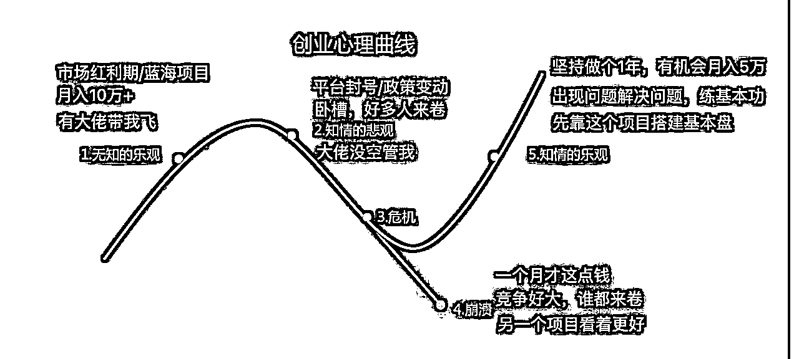
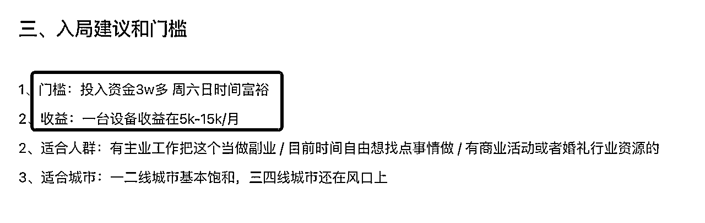
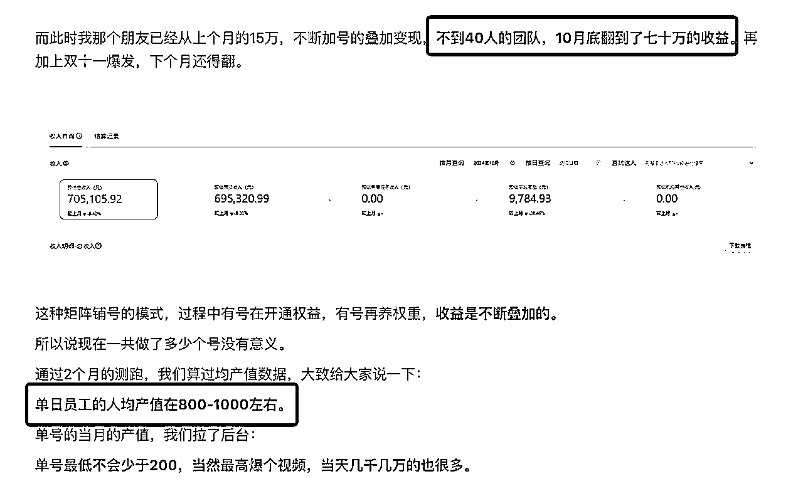
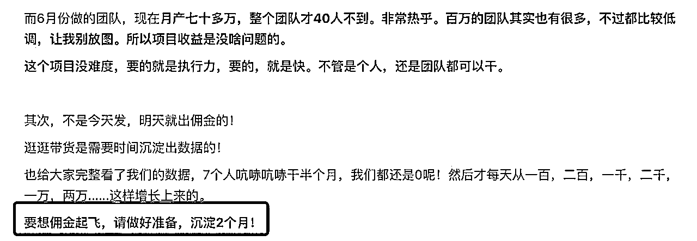
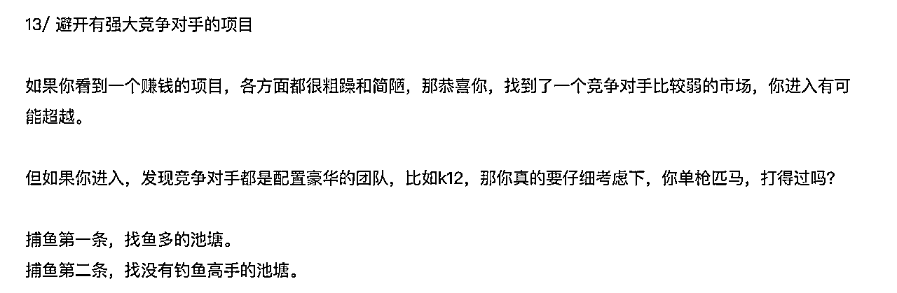

# 志愿者直播分享 —— 3步教你选出适合做的项目

> 来源：[https://wi1v74w740.feishu.cn/docx/LAgQdnq1QokmRsxtvYqcBE2hn3f](https://wi1v74w740.feishu.cn/docx/LAgQdnq1QokmRsxtvYqcBE2hn3f)

哈喽大家好，我是许老师，8年的教培模型和销转体系专家，24年7月份之后，开始在生财负责投资孵化业务和高阶航海合作，主要工作就是每天看项目，聊项目。周二晚上受邀给我们最可爱的生财志愿者们做了一场闭门直播分享《3步教你选出适合做的项目》，这个分享也适合一些还在看项目找项目的搞钱新手们，所以整理成文字稿分享给大家。

这个分享主要分成三部分，第一步，怎么定性地分析项目，面对生财里精华帖、风向标、航海项目这么多海量的信息，我们怎么通过一些维度快速初筛项目；第二步，怎么定量地做调研，去拿到一些真实数据，仔细地去算账，比如算营收，算人效，看项目逻辑通不通；第三步，如果项目判断下来没问题，那和我当前阶段是不是匹配。

## 一、定性分析项目

首先，面对一个项目时，我们需要一些基础的判断维度去初步评估。作为新手，尤其是刚入行的小白，往往对项目会抱有不切实际的期待。就像我们常常会调侃，我们想找的工作往往都是“钱多事少离家近，位高权重责任轻”一样（几乎不存在），小白选项目时，也有这种不切实际的期待，他通常希望这个项目收益又高，可以月入十万，年入百万；同时呢，又希望反馈很快，一干就正反馈，一干恨不得第二天就有流量，就变现，然后又希望他这个项目门槛又低，不用什么条件我就能干，而能同时满足这3个条件的，一般都是韭菜项目，只存在骗子的口中。在我看来，项目天花板高，正反馈快，投入低/门槛低，这三个维度就是“不可能三角”，不可能同时满足。

以我们之前举办的航海活动为例，比如，抖音的达人带货项目，虽然天花板较高，达人一个月的佣金可能达到几万甚至十万，但反馈却很慢，需要先练习表现力和熟练拍剪，能拍出80分的带货视频，至少得坚持三个月以上才能看到效果。类似的，YouTube视频创作、小红书IP、出海工具站都属于这个类型，虽然项目跑通后天花板比较高，但正反馈周期通常都得3个月以上。

相对地，反馈快的航海项目也不少，不过天花板往往不高。比如，同城夜校项目，发布视频后能很快获得流量，第二天就进粉，私域里做好销转也很快变现，但月收入通常在一两万之间，很难达到5万以上。之前的虚拟资料，最近的mini航海红包封面都属于这个类型，让你很快地看到正反馈，不过指望它赚大钱是 不可能的。感兴趣的可以用这3个维度去套一下之前的航海，基本都是这个规律。

接下来我们挨个说一下这 3 个维度。

### 首先，什么样的项目天花板高一点？

好项目是一目了然的，我们先做几道很傻瓜的选择题。

选择题1：现在有个A项目客单价卖一万，跟一个B项目客单价卖100，这两个项目你选哪个？

肯定优先选高客单的项目。它有几个好处：

1）高客单的项目对流量需求相对小，同样流量下营收高；卖1单1万的产品，相当于卖100单100的产品，而卖出的难度肯定不会是100倍，甚至有时候成交高客单比低客单更容易，因为客户更加的优质；

2）高客单的项目员工人效高，便于招人，团队化扩张；一个月只要卖10单1万的产品，员工产出10万，你可以付出不错的薪资去招人；

3）高客单项目契合了现在的趋势：“要赚有钱人的零花钱，不要赚穷人的生活费”；

举一些我们圈友做的项目做对比，大家就一目了然了，包括生财本身也是高客单的知识付费产品，现在市面上为什么这么多10年合伙人产品，就是为了在一开始把客单价提上去，1年的势能不够，想收几千块很难，那就改成10年。

| 高客单项目 | 生财有术 |
| 低客单项目 | 陪伴群 / 低客单小报童（难以变成独立项目，一般是引流品） |

一般来说，高客单的项目，通常也具备高毛利的属性，比如知识付费，毛利很高，百分之八九十。还有一些高端的消费品，茶叶、珠宝玉石、燕窝，毛利也很高。同时，能做高客单的一般都是非标品，非标品不容易被比价，不会陷入低价竞争中。所以，高客单，高毛利，非标，有这些特性的，是天花板高的项目很重要的属性。

选择题2：有复购的项目跟没有复购的项目，你选哪个？

大家都会选有复购的，有复购的项目优势太明显了。

1）有复购的产品，才容易有利润；由于规模化的扩张，通常第一单的引流品，利润都趋近于0，只有靠后续的续费、升单赚钱，才能产生利润，典型的像 k12的培训，各种知识付费产品，前端投放买量，大部分利润都交给平台了，只能靠复购赚钱；

2）有复购的产品，不容易有流量焦虑，可以稳扎稳打，做好自己的产品和交付，而不是天天被流量绑架；

不过复购这个属性不是所有项目都有的，就以上面的高客单项目例子来说，只有少数几个项目有复购属性。同样以10年合伙人产品举例，好处是客单价上去了，坏处是后面10年都没有复购，都是纯交付，只有源源不断地有新流量进来，才能不断支撑这个项目往下发展。

| 高客单项目 | 是否有复购 |
| 生财有术 | 有 |

高客单的项目，加上有复购，基本就是王炸了。如果是低客单的项目，加上复购属性，也都不错。我之前做过一个私域卖水果的项目，500人的老客户，就能支撑我1年100万的销售额，当时有生财圈友在底下评论，像卖水果这种生意就是个“年轮生意”，每过一年大一圈，你只要把手上的客户服务好，复购加上转介绍，每年就能稳定增长。类似的项目，还有 圈友老钱的云洗衣，一些私域卖水晶、卖化妆品的项目。

这里再补充说明两点：

1）有复购的项目，一定要加私域，做好私域的精细化运营，私域 = 资产，它能源源不断地给你贡献现金流；

2）有复购的项目，算清楚客户的LTV，可以配合付费投放买量做规模；

所以有复购也是天花板高的项目很重要的属性。

选择题3：能做IP跟不能做IP的项目你选哪个？

一定优先选择有IP属性的项目,大家都是生财圈友，朋友圈想必都有很多IP好友，这里就不赘述了，IP的好处太香了。

1）有IP加持，流量端和转化端的效率都会明显提升；

2）有IP的项目，容易有差异化，也容易做高客单；

亦仁之前有个公式，高客单+IP+私域+非标+投放=大机会，正好作为这一part的结尾，碰到这几个属性，大家就知道项目天花板是比较高的。

### 接下来，我们讨论第二个维度：反馈周期。

这一点尤其重要，特别是对于一些新手，要对反馈周期有正确的预期。

我之前看过一个有意思的“创业心理曲线”。每当你接触一个新项目时，通常会经历以下几个阶段：

1）无知的乐观：在这个阶段，你会感到非常兴奋，觉得自己找到了一个红利项目，恨不得原地起飞，马上月入十万。不过，这种情绪往往是不理性的，因为你对项目过分乐观了，对于项目会碰到什么坑完全不知情。

2）知情的悲观：随着你开始做项目，你会开始碰到很多具体的困难、负反馈。这时，你开始怀疑项目，怀疑带头人，怀疑自己，很多圈友在这个阶段因为前期过于乐观，加上对于反馈周期没有正确认识，很容易做着做着就轻易放弃了，去转向下一个“更好”的项目。

3）知情的乐观：经过一段时间的实战经验，当你开始解决一个个具体的困难，踩完一个个坑后还“活着”，还在坚持做项目，你就对这个项目到底能赚多少钱，需要多久有反馈，有了更全面的认识，也有了正确的预期，这个时候你的项目基本盘也慢慢搭建起来了，虽然你还是会嫌弃你的项目，向外看机会，但你已经不是那个轻易就放弃的人了。

看完上面这 3 个阶段，是不是深有感触。我也经历过这个完整的历程，现在再看项目，我会让自己尽快度过“无知的乐观”阶段，尽早去调研项目，进入“知情的悲观”阶段，评估后尽快开干。

当然了，对于新手来说，选择反馈周期快的项目很重要，得先建立起自己对于赚钱的信心。正反馈快的项目，一般就是只搞流量-转化-产品这当中的某一个环节，通常就是搞流量。所以如果不知道干什么，就找到一个产品，选择一个平台，开始去公域上搞流量。

### 最后再说一下第三个维度，投入。

这个最容易理解，生财已经为大家过滤掉了许多高投入的项目。一般来说，投入高的项目不会出现在航海、精华帖中。这里只提两点注意点：

1）尽量不要碰高投入的实体项目！实体项目通常需要较高的投入，且难以零成本验证。一旦亏损，翻身的难度很大。很多实体项目的天花板往往也不高，可能一年只能赚几十万。进了生财这样的项目机会比比皆是，就没必要冒这种风险了。

2）对自己要有时薪的概念，在追求收益的同时，了解自己的时间价值也很重要。除了说你赚第一块钱的时候，要尽快的拿到正反馈，可以暂时忽略时间投入之外，后面你再做其他项目时，就要大概知道自己的时薪是多少。比如：每天投入4小时，最后一个月赚一千，这个对你是不是划算的？要把你的时间投入也计入成本里面。

最后总结一下第一部分的内容。天花板高、反馈快、投入低，同时满足这3个条件的项目是不存在的，如果想做天花板高一点的项目，就多关注 高客单、有复购、有IP属性的项目，如果想正反馈快一点，那就直接去搞流量，同时普通人尽量从投入低的项目开始搞起。

通过这些定性分析，大家可以在筛选项目时更快速地做出判断。比如，在面对10个项目时，能够通过这些标准过滤掉8个不合适的项目，留下2个值得深入研究的项目，去仔细调研。

## 二、定量分析项目

接下来，我们讨论下怎么定量地做调研，去分析项目。

首先，亦仁老师说过，“默认数据是假的，默认项目是通的”。碰到任何人和你说的项目，先默认数据是假的，然后再去求证。这样做能帮助你获得更客观地答案。

接着我们要开始去调研项目的数据，怎么做呢？首先要找对标，你去小红书搜、抖音搜，公众号搜，把但凡能搜到的同行全加一遍，然后在微信里面，装作一个客户去走一遍客户流程，尽量拿到更多信息。

接着就要开始算账了。算账就是要拆数据，一定要拆到最细的维度，大家都看过那个新闻，美国那个做空公司去做空瑞幸的时候，找人去瑞幸门店蹲点，连着蹲了好多天，就是去数他每天进店有多少个人头，实际出了多少单。越细的数据，你算账就越准。

算账有两种方式，第一种是直接计算营收。

### 数据公式1 ：营收 = 客单价 X 单量 = 客单价 X 流量 X 转化率

我们拿一个实际的精华帖项目来举例：分享一个可复制的日入2000的副业：婚礼大头贴，更有利于大家理解这个过程。

一开始定性分析：高客单、没复购、没IP，满足“高客单”的属性。

开始定量去分析：

原帖数据：

初步算账：设备成本3万，每场活动2500，每个月4-8场，回本周期 1.5-3个月；看上去非常性感的项目；

仔细研究后：

问题1：客单价能不能保持2500？有多少利润？

结果：2500的价格开始卷了，2500不是设备租赁费用，包含 1-2个人的现场服务（设备调试、引导拍照等，估计 4小时），对于调试的人还有点要求，要么自己上，要么得培养熟练的人使用，人力成本按一场2个人200～500预估；

问题2：一个月能接多少单？成本怎么样？

答案：接单取决于当地有多少举办婚礼的人，和自己做流量的能力。成本来看，流量方提供单子抽成20%流量成本先按500算；自己做流量，转化率按 10%来看，每个月需要有 40条的精准加微，需要有人精细化的销转；

问题3：同时是不是有淡旺季

答案：一般跟着婚礼的淡旺季来，旺季都在节假日，平时会有淡季；

调研后，我们重新算下账：

乐观情况下：一场活动利润：2500（客单价）-200（人力成本）-500（流量成本）=1800（单场活动利润）；每个月平均接单3单 一个月收益 5400；回本周期约 6个月；

保守情况下：一场活动利润：2000（客单价）-500（人力成本）-400（流量成本）=1100（单场活动利润）；每个月平均接单 2单，一个月收益 2200；回本周期 14个月；

所以判断这个项目自己能不能做，核心看自己是否有小红书做流量的能力，如果有，迁移到这个项目正好利用上；或者看自己本地是否有婚庆相关资源，如果有的话，把这个当做增值服务也不错；

那如果你啥都没有，评估后又想做这个项目，我的建议就是不要一上来买机器，一定要先零成本验证，这个项目的核心问题是你能不能搞来流量。很简单，你直接小红书发几篇帖子，试着先卖卖，看看有没有流量和咨询，等你成交了，你再去买设备都来得及。

这篇帖子我尤其推荐这个圈友测试项目的思路，他从别人婚礼上看到了这个项目，然后他立马就去小红书做调研，做MVP，然后去跑项目。最后发现这个项目如果单纯只是做出租服务的话，天花板不高。然后他自己就升级了模式，变成了厂家去卖机器，招各地的分销商。每一步的节奏我觉得踩的都挺好。

第一种拆营收的算账方式就到这，我们再来看另外一种方式，拆人效。

### 数据公式2：营收 = 员工人效 X 员工人数 = 单账号产出 X 账号数 X 员工人数

公式很容易理解，我们同样举一个案例：淘宝逛逛带货玩法

原帖：https://t.zsxq.com/FxNSq

最新蓝海项目【逛逛带货】玩法教程：自营40人团队，亲测人均每月佣金3万+！

为什么举这个案例呢？因为这个帖子一出来，圈友们在评论区里面比较躁动，很多圈友直接就问能不能加入，比较符合我们刚才说的，一开始“不知情的乐观”阶段。

这个项目定性分析下来，其实是一般的。客单价很低，就带货赚佣金，一单佣金就很少，一个号佣金也没多少。复购跟IP属性就更没有了。项目逻辑是通过短视频给电商带流量，属于比较卷的，堆人效项目。好处可能是有一段平台的红利期。

我们直接根据帖子算人效数据；

原帖数据：单日员工产值800-1000，一个月可达3w；

看这个项目，门槛低，搬运视频就能赚钱，然后开号成本还低，一个人可以开几十个号，人效还能3w，看上去挺漂亮一个项目

实际上：

1）问题1：核心数据是员工人效，能不能到3万？数据是不是能稳定？

答案：我们默认“项目是通的，数据是假的”，常识上判断如果一个项目员工人效稳定3w，还无脑搬视频就行，谁来都能干，那找个小县城月薪3000招人就行了，完全没必要主动暴露出来，给自己带来更多的竞争对手；所以我们需要再仔细调研下

2）问题2：一个账号的产出是多少，一个员工要管理多少账号？

答案：一个账号产出 六七百，一个人做20号以上；

新员工人效 600*20=1.2w；老员工人效 600*50=3w。所以一个员工刚进来时，会有一段人效 1.2w的时候，这个时候公司扣掉场地、人员、设备成本，利润就一般了。什么时候员工能到3w人效，就取决于你的管理了。

3）多久才能到这个产出？

答案：反馈周期3个月左右，需要经过1-2个月的爬坡，人效数据才能提升上来；前期账号权重低，收益没那么高；

4）开号成本，需要营业执照才能开号，一个员工需要开50个号，额外多多少成本？

答案：评估下来，一个月可能多个100多元，还好。

5）有这个收益的前提是绑定MCN，那么和这个MCN合作，MCN分佣多少？

答案：合作的话，MCN抽佣 30%，扣除掉MCN分润部分，工作室的收益少了很多，人效3w，变成了 2w；

6）再结合我自己之前聊过的一些信息，我聊过常州另一个做类似项目的航海家，数据是员工人效 一个月1.5w，员工平均薪资 5000，前两个月亏本，到第三个月开始能赚钱，前期需要铺至少20个人，才能把平台流量规律测出来，初期投入场地人力设备各方面加起来小100w。

所以评估下来这个项目比较适合之前做人力密集型的工作室，已经有现成的人员、管理经验等，可以测一下数据判断要不要做，如果是新人小白要进去，只做一二十个号，大概率跑不出来，可能每个月赚个几百块就很好了。如果要做大，就要开工作室，那开工作室的投入成本，你测算一下，初期招个5个人以上去测试，先熬个两个月，然后第三个月开始赚钱，在你当地你需要投入多少去做这个测试，如果你带着这样的预期，提前算好账，入场也是没问题的。

最后总结下第二部分，我们通过定量分析的方式，去调研，算好账，把一个项目的收益情况，反馈周期要多久，我需要有多少投入，进行比较客观的测算，带着这样的预期去做项目，我们就比较容易度过“知情的悲观”的阶段，而不会一开始带着很高的预期进去，然后浅尝辄止，不断地重复这个过程。

经过前两步判断，最后我们再看这个项目适不适合你搞，好项目很多，能做的项目很多，但是要看这个项目适不适合当前阶段的你。

## 三、看项目是否匹配

这里面也是那三个维度的互相匹配，就是项目的收益天花板，然后反馈周期以及这个投入，就这三点要跟你匹配。

1）要有正确的预期，要定一个匹配自己当前阶段的赚钱目标，先赚到第一块钱，然后是第一个1w，10w，之前才想着100w，1000w；没有一步步进阶上去，大概率是无法实现的；毕竟，能赚1000w的项目，里面也都是有本事赚1000w的高手在竞争，你是很难打得过的；比如说如果你现在是个小白，你第1万块钱都没赚到，我觉得上来就要做年入100万的项目是不太现实的，这个时候去找一些可以月入1万以上的副业先把自己能力练上去更靠谱。

2）做项目时，逐渐积累自己做项目的核心能力，在选择下一个项目时，匹配自己的优势去找项目

通过项目来练能力，借假修真。

比如，你做了闲鱼虚拟资料，虽然卖9.9元的项目赚的不多，不过你逐步掌握了闲鱼做流量、闲鱼矩阵的能力，然后你切换到了AI代写的项目，搞定了AI代写的交付，从卖低客单的资料，到卖更高客单的代写，里面通用的能力都是从闲鱼获取流量的能力，项目天花板就变高了；又比如如果你之前在小红书搞过流量，看到婚礼大头贴的项目，你就可以立马测起来了。

3）对项目的反馈周期有个预估，根据自己的心力匹配自己能接受的反馈周期，同时随着做项目越多，逐渐增强自己的心力，接受更长的反馈周期

新手要建立信心，先做 一个月内就能出反馈的项目，即使天花板低一点也无所谓；比如虚拟资料，AI代写做写手，都是立马可以赚到第一块钱的项目；

已经赚到第一个10万了，就可以不用看很短期的项目，可以匹配做 3个月反馈周期的项目；比如YouTube项目，至少先做个3个月，前期研究赛道，怎么做内容，什么内容流量好，如果账号做起来了，后期的收益是比较高而长久的。

### 最后再说一些选项目的注意点：

1）多看少动 ，看到每一个项目时，如果想做，都要进行充分的调研；

调研就是解决问题，不要无脑地去做项目，每一个项目做之前，先按照一套方法去分析一下，然后在做项目的过程中去验证，慢慢地你选项目的手感就来了。

2）不要频繁的0-1，0-1阶段是付出收益严重不对等的，付出很多，收益很少，如果跑通了0-1，要尽可能去想怎么1-10，扩大战果；1-10阶段，就要利用杠杆，团队杠杆，资金杠杆（投流），矩阵 等等；

3）一定要做趋势向上的项目，做存量市场的项目，存活率太低

建议做：AI相关（AI产品、AI生成内容、AI培训、AI服务、AI+IP）、出海（YouTube、海外私域、出海电商）、同城（高客单服务、同城流量）、IP （尤其25年，做视频号IP）四个领域的项目

不建议做：电商、人效特别低的项目、投入大的实体（10w以上，如餐饮）

最后祝大家都能找到自己可以深耕的项目，如果有项目选择方面的问题，也欢迎找我交流。

关于我个人（20250612 更新）

之前：

深耕少儿编程教育8年，深度参与了两家创业公司的 0-1，熟悉教培的流量销转模型

现在：

生财的投资孵化业务负责人，包含高阶航海合作、生财联合办公空间、SCAI实验室

其他精华文章：

借鉴在线教育公司的扩张路径和组织模式，做一个生财商学院，会是个 10X战略吗？

摆脱小作坊状态，核桃编程从月营收50万到1000万的几点启发

怎么从零搭建和管理一个“正规军”的销售团队