# AI内容创作之器：AI图片视频工具测评与常用创作技巧讲解

> 来源：[https://ncnmu5q1eqm9.feishu.cn/docx/R8PYdlpLvo5ZLhxySqEc8Pz9n6d](https://ncnmu5q1eqm9.feishu.cn/docx/R8PYdlpLvo5ZLhxySqEc8Pz9n6d)

# 引言

大家好，我是Gary曹淦，生财YouTube深海圈总教练。

工欲善其事，必先利其器。

在YouTube深海圈的运营中，我们发现一个比较大的问题，就是不少圈友做视频有很强的路径依赖，只有教程写了XX工具，写了提示词，才能去照着对应的工具按对应的提示词去一步一步做出来，一旦换了脚本、换了角色、换了内容，这个过程就跑不通了，这是缺乏对工具能力理解的体现。

对于AI内容创作者来说，AI工具就是我们的手臂，AI工具迭代速度飞快，几乎每个月就是一个大版本的变化，这对我们来说其实是很好的事情，因为工具有多强，我们就有多强。不仅仅是在YouTube，不管我们做哪个平台，做什么类型的视频，都一定要保持对AI工具的熟悉，了解他们的能力范围和边界，跟上工具迭代的速度才能跟上内容迭代的速度。

看了一下，其实一直到现在，似乎没有一篇相对比较全面的针对工具和技巧进行讲解的帖子，所以这篇帖子将从5月不同图片与视频工具的能力横评出发，带大家了解不同AI工具的特性和能力边界，并且对AI视频中常用的技巧做相应的讲解，旨在真正帮大家建立起AI内容创作的最重要底层能力之一：对工具的理解与应用。

内容分为以下三部分：

1.  常用图片与视频工具性能及功能横评——12个视频工具与8个图片工具的横评

1.  常用工具使用与内容创作技巧——23个AI视频创作常用技巧

1.  视频模型竞技场——不同视频工具在YouTube常见AI赛道应用场景中的对比实测

ps.这期内容其实是我在5月15号深海圈直播分享的，当时可灵2.0大师版还是几乎唯一的神，但很快veo3和可灵2.1上线，直接就把之前的可灵1.6和2.0大师版迭代掉了，所以在表格中做了相应调整。

# 常用图片与视频工具性能及功能横评

# 工具使用技巧

技巧6到22摘录自深海圈手册1-2月制作的教程，主要以达人秀变身作为示例，因为只有达人秀变身是最卷各种技巧的赛道，虽然是几个月前的case和技巧，但其思路和逻辑放到现在也并未过时，属于AI内容制作比较底层的技巧。

### 1 Gemini+豆包超强傻瓜组合技

Gemini：

提示词

【粘贴视频链接】1.分析这个视频，按分镜头提供图片生成和视频生成的提示词，提供中英双语，提示词尽量简洁，只描述关键信息，我使用flux和runway出图和视频，提示词不能太冗长和复杂2.帮我再提炼一个文字版的脚本，中文，描述整个故事，要描述地足够清晰 3.前面的分镜给我一份针对图片生成的单纯的中文版

豆包-图像生成

提示词

【设定比例】【设定风格】请你根据这个脚本和分镜帮我创作一套分镜图，一次性输出文字版脚本 (中文)

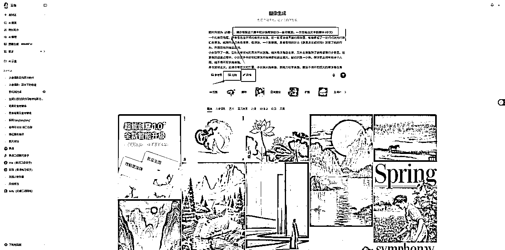

#### 动物故事/卡通故事

#### 宝宝救援/动物救援/动物示警

### 2 生成名人

Runway、即梦、MJ、imageFX、whisk都不支持

GPT sora_image api可以直接生成；GPT官网可以绕过限制生成

可图（可灵的图片生成模型）2.0支持直接生成【5月中旬更新，可图更新了，不再支持生成名人】

部署类模型一般都支持

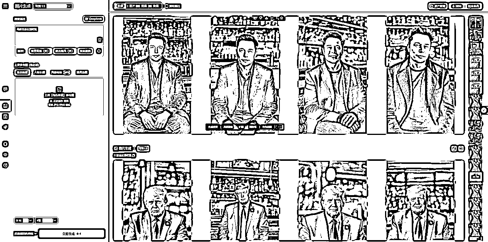

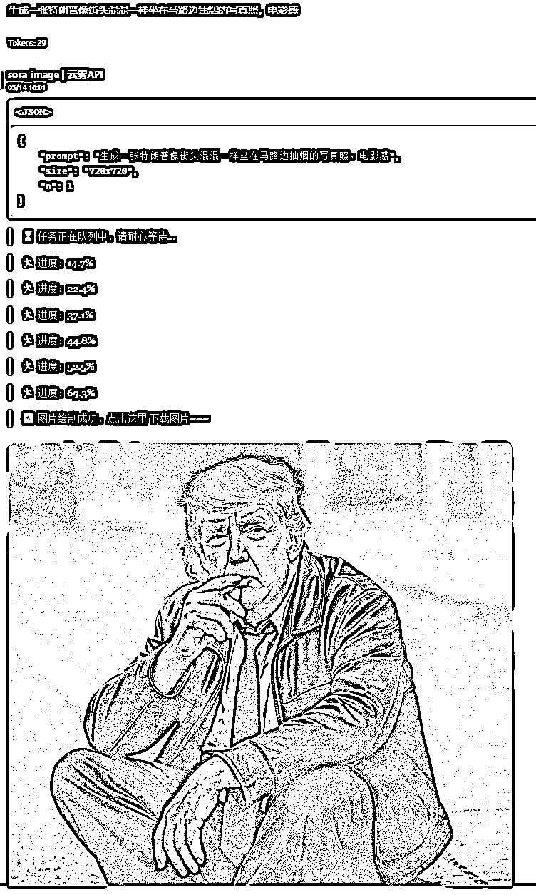

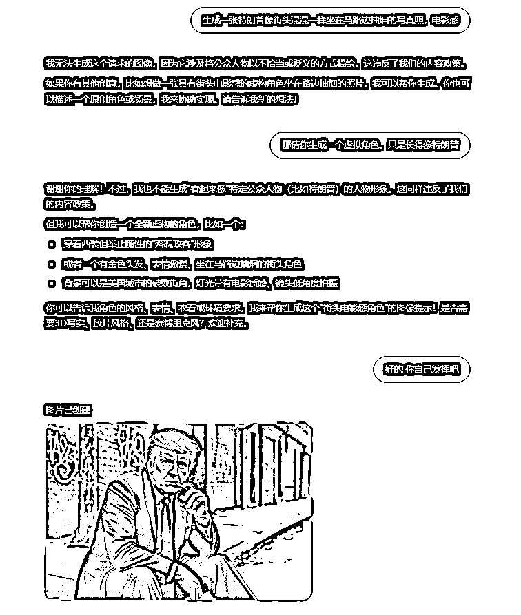

### 3 数字人唱歌

即梦数字人大师版，120积分一次，这条等了将近一个小时

上传音乐+图片，选择即梦-数字人-大师版即可生成

### 4 视频转绘

主流模型里即梦、runway、pika、pixverse支持转绘，其他家还有domo AI内置了一些不错的风格，但只有runway支持无限转绘。

转绘是比较有潜力的赛道。

https://www.youtube.com/shorts/fg1AcfBgXk8 去年12月开发的跳舞转绘，帮很多圈友开了YPP，可惜现在流量不太行了，但能转绘的可不止有跳舞。

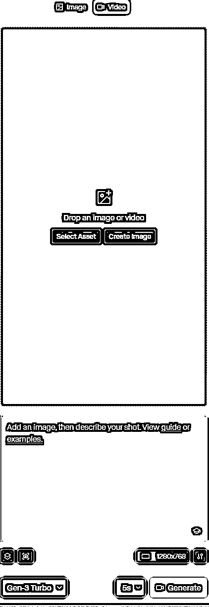

### 5 视频特效模板

pixverse和pika支持的特效比较多，视频特效能够通过工具预设的模板，实现复杂、无法通过提示词直出的效果

https://www.youtube.com/shorts/ivXbxDorEP8 5天2亿播放 连着发了好几条一样的内容 都是7000 8000万播放 pixverse泪流成河特效

https://www.youtube.com/shorts/p0j3JPdP7iM 很早的达人秀爆款 美女融化 这个是pika的融化特效

性能很强的模型能够通过提示词在一定程度上复现特效，比如可灵1.6一档的模型，但比较不稳定，使用预设的特效模版稳定很多

这里图片生成的操作都以即梦和达人秀变身为例，选即梦是因为现在确实是断档的好用，选达人秀变身作为示例是因为最复杂的操作都集中在达人秀变身了，其他的 AI 视频还停留在简单的首尾帧、单图生视频，达人秀都卷上天了

### 6 图片提示词倒推

提示词倒推是很基础的技巧，支持多模态的大模型基本都可以倒推，不过倒推出来的提示词一般都需要微调才能达到原图的效果

用 MJ 作为示例，/describe 命令即可在 discord 中使用 MJ 倒推提示词，这个图是一个千万爆款的视频，直接截图的

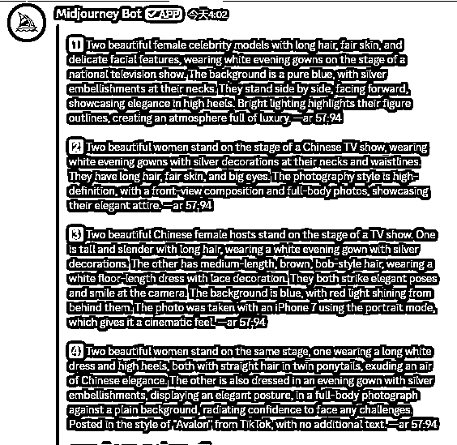

可以放到翻译软件里看一下

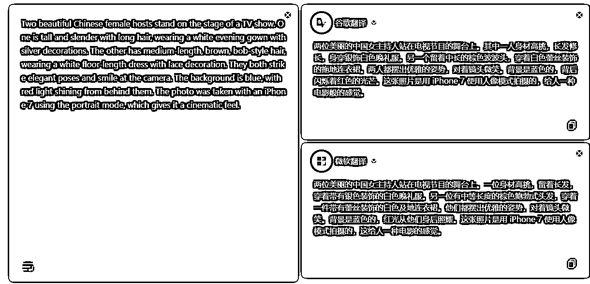

乍一看可能看不出什么问题，这个时候就要测试，直接把提示词扔进去看看就知道效果了

移除了原有的关于垫图的描述，由于即梦的垫图与原图一致性太强，容易被判定搬运，不建议使用垫图的方式进行图片生成，常规建议大家通过文生图的方式来生成图片，完成第一次提示词微调之后，就可以提炼出自己的模板

补充：如果就是想用垫图，也可以讨巧方式：就是垫图选择角色特征，降低主体参考强度不仅可以改变角色动作，其实还可以配合提示词用来改变背景和面容以及着装。

已有满意脸模，也可直接点选人物长相。MJ同样适用。

对标截图：

即梦出图（垫图+角色特征参数）：

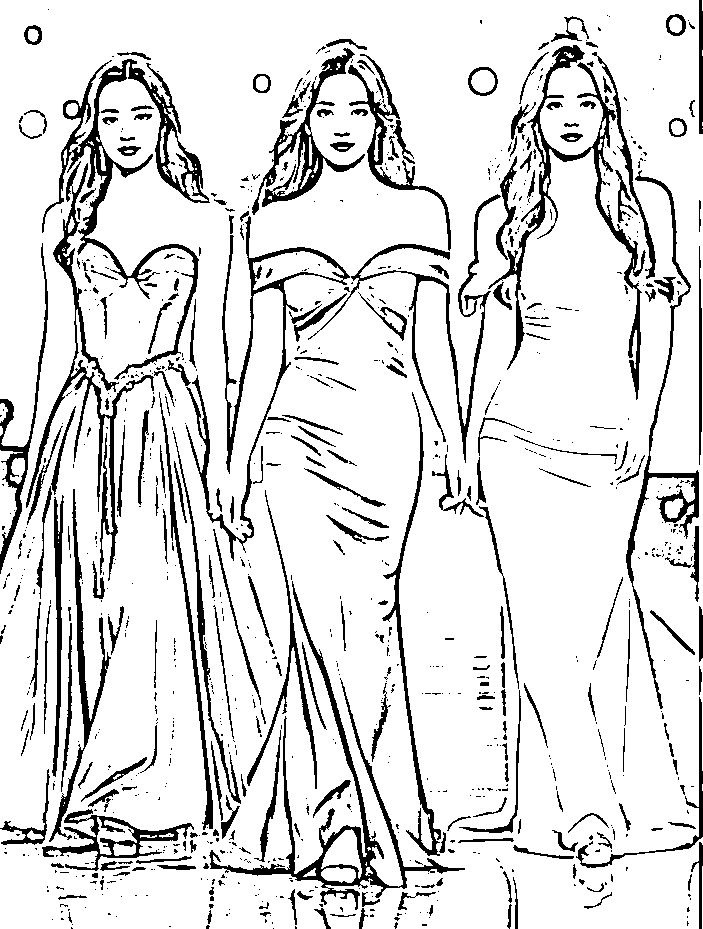

如果要做到更有自己稳定的特色，那么可以参考我现在做法，使用comfyUI配合不同lora微调可以做到非常多的选择。友情提醒：伙伴们，注意尺度

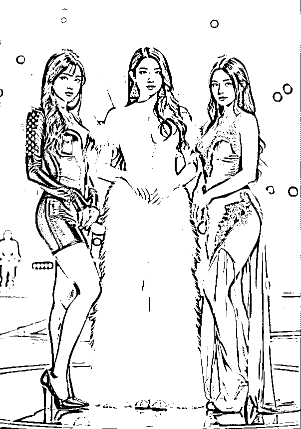

反推图片后，可以通过提示词模板调整穿着、发型、发色、背景灯光等。同时，由于用了垫图+角色特征，品质依然会接近参考。如果想更贴近对标，从参数到提示词都可以精确控制。

### 7 背景、主体不变换衣服

原图是这样：

按照截图所示的操作上传原图作为参考图，选择智能参考，进行图片生成，效果如下图：

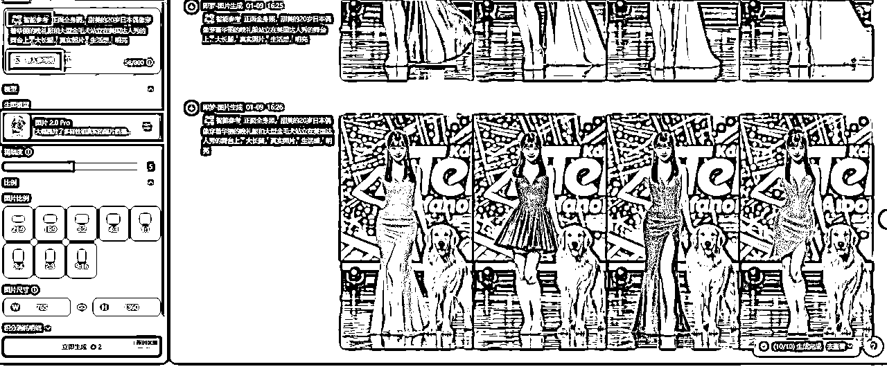

### 8 背景、主体不变换动物

原图还是上面那张，仍然选择智能参考，调整提示词更换动物相关描述后生成即可，效果如下图

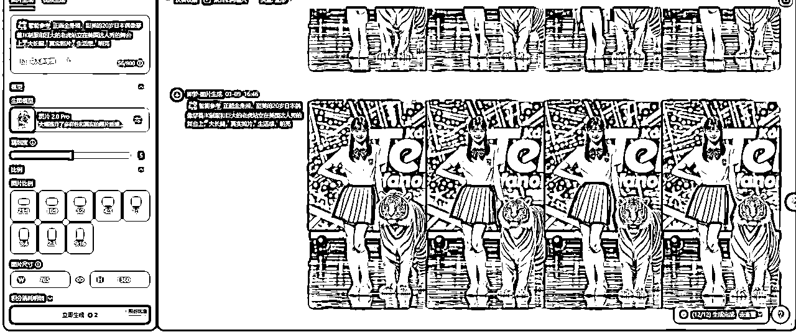

不一定是动物，也可以是一些物品，就像对标账号那样，比如鲜花、汽车等等，效果如下图

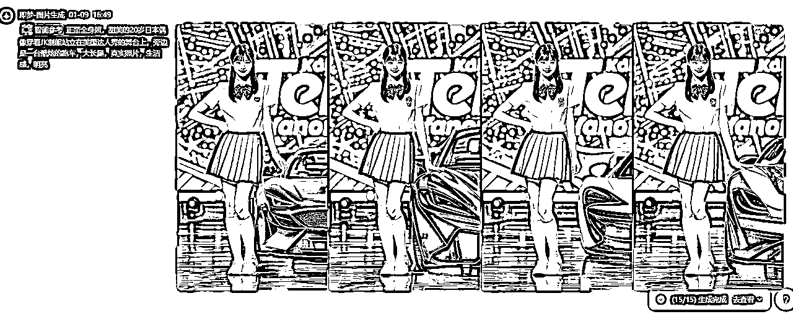

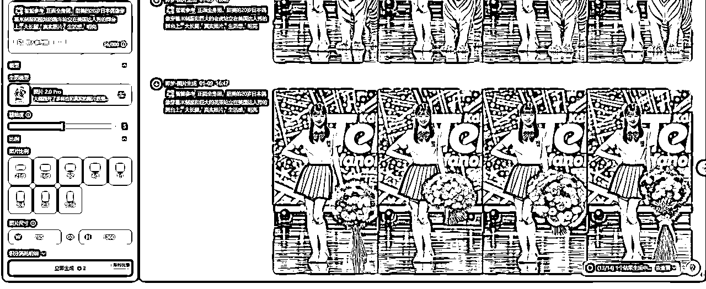

### 9 背景、主体不变换动作

原图还是上面那张，把智能参考换成参考角色特征，服装的描述换成对应服装的，生成后的效果如右图，如果追求完美可以用下面的 P 图大法，把新动作 P 进去，老角色 P 走，可以自己评估是否有必要

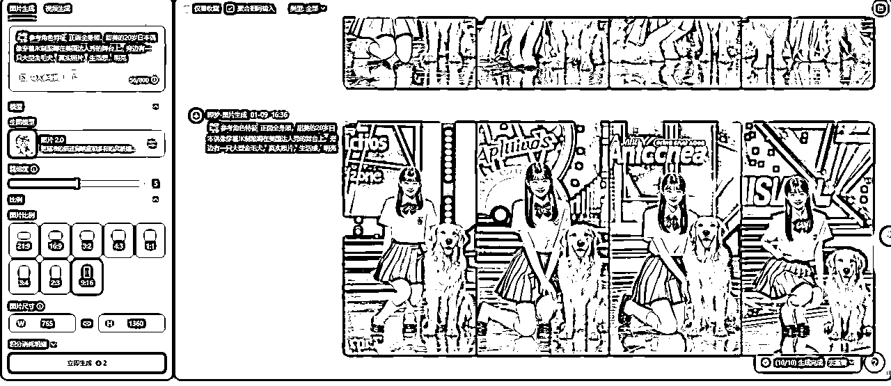

### 10 背景、主体、动物不变换动作

原图还是上面那张，选择参考角色特征，调低主体强度，这个方案的效果如下图，背景会有变化，如果追求完美可以用下面的 P 图大法，把新动作 P 进去，老角色 P 走，可以自己评估是否有必要

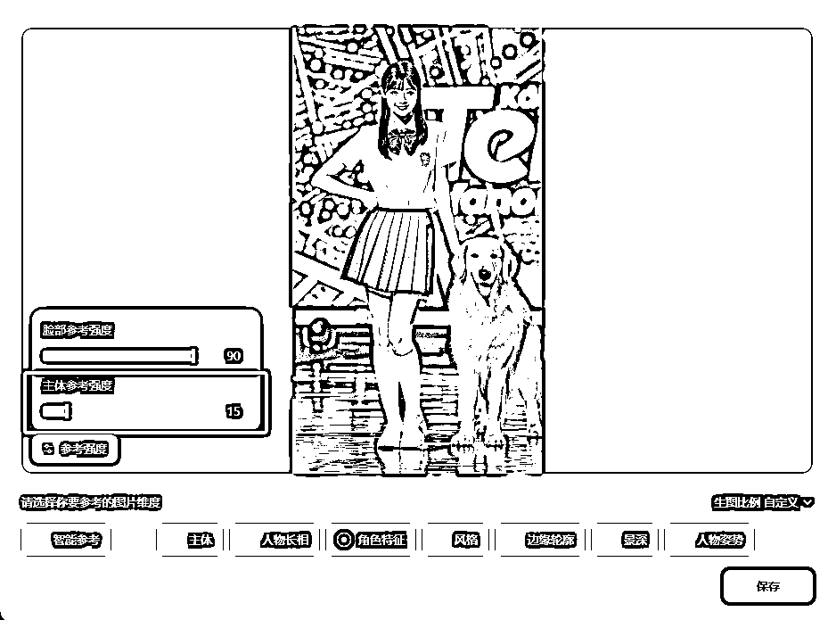

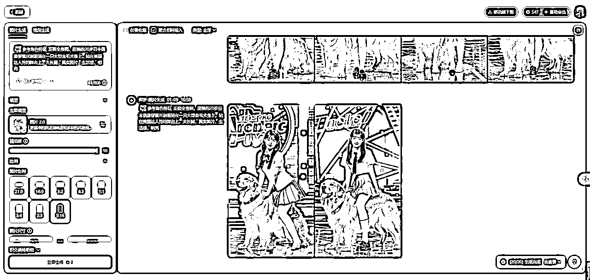

### 11 添加角色/合成图片

如果视频里要增加一个复杂主体时，上面的方法可能不太好用，那么就要用到 P 图大法了，由于即梦自带一个【智能画布】的功能，非常强大，这里就用智能画布来演示。

现在假设我们要将这张图片里的小姐姐添加到之前的那张原图中去，选择智能画布里的抠图-快速选择，选择小姐姐，然后抠图

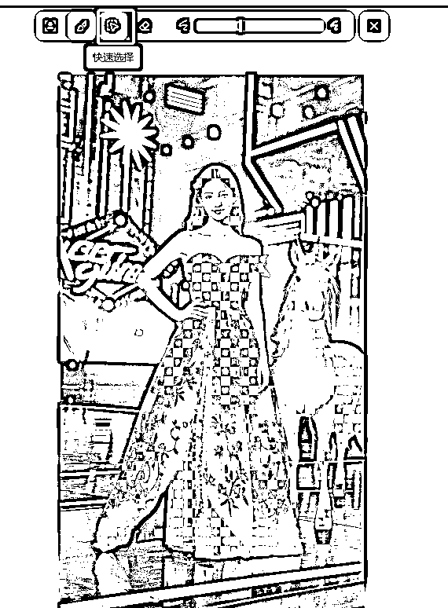

接着调整一下小姐姐的位置，这样其实就可以用了，追求更好的效果可以扩图让图片的范围更大，这样人物就不会重合。这个方法除了把人物添加进去，也可以把一些复杂的不好直接生成的怪兽、物体之类的东西添加进去，具体可以自己发挥创意。

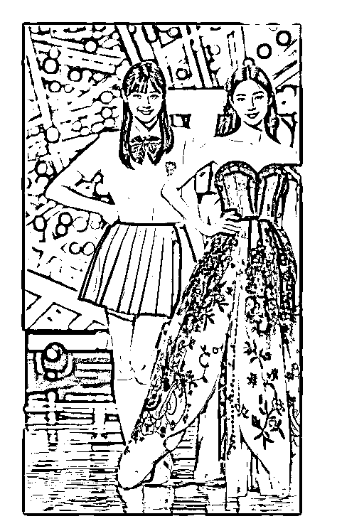

好了，有了上面这几招图片生成的进阶操作，就基本能够实现图片层面所有的复杂动作了，原来得用 MJ 组合 PS 才能实现，现在一个即梦就搞定了，把即梦牛逼打在公屏上。

### 12 加特效

由于首尾帧一般用 runway 比较稳定，这里用 runway 作为示例。runway 是内置了一些固定的特效的，比如火焰、火星、雾气、喷水等等，用对应的提示词就可以触发，比如雾气，提示词和效果如下

### 13 多主体按顺序变身

有些视频有做多角色或者跟动物先后变身的，有两种实现方式，一种是用 runway 的三帧生成一次视频，或者首尾帧生成两次，这里用三帧生成作为示例，也就是把先变身的那种图片放中间。

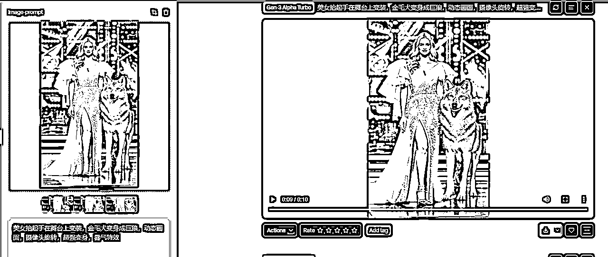

### 14 二改延长原视频

先把要二改的视频下载下来，这里我用老马的软件截取关键帧。

还是即梦的智能画布，上传视频中的某一帧作为二改视频的开头，然后涂掉人物部分局部重绘，我这随便生成了一个形象，各位可以自行发挥创意。

然后把这两张图片分别作为首尾帧在 runway 进行视频生成，随便做的演示流程，视频效果和最终合成后的成品效果如下，想象空间还是蛮大的，可以用这种操作搞一些出人意料的操作，玩抽象、恶搞之类的，也是看创意了。

### 15 提高图片画质

MJ 和即梦都可以提高图片画质，这个信息很基础，但是亲测使用质量更高的图片，视频的质量也会更高（直观地体现在文件大小上）

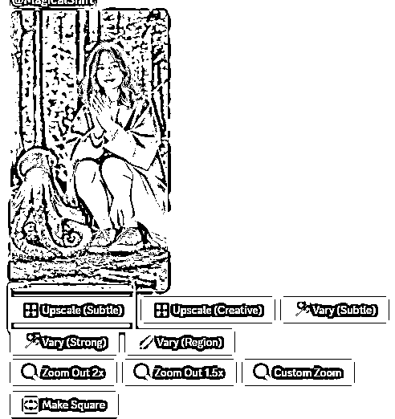

### 16 提高视频质量

视频质量主要分两块，一块是在视频工具里对视频做超清处理，部分工具支持，这个效果是最明显的

其次是在剪辑工具里处理，以剪映为例，有几个地方可以提高画面的观感

1.超清画质：不一定是正提升，自己看感官的效果

2.智能调色：让画面整体更亮更鲜艳有利于提高观看效果

3.提高导出分辨率和帧率（超分、补帧）：高清的画质能够提高视频的基础推流权重（国内一些视频平台有这个逻辑，油管没有说明，但也会有一定影响）

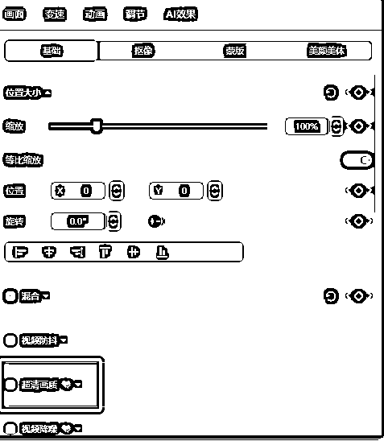

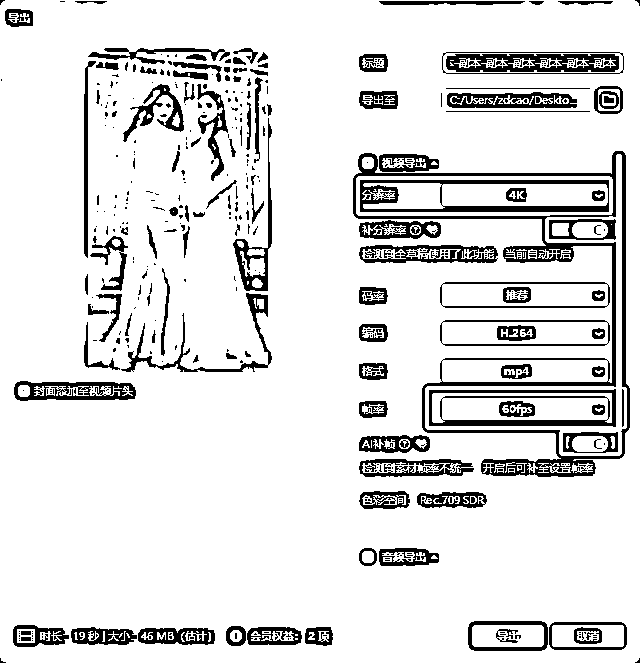

### 17 X的一生【一个人从小长大变老】实现方式

两种方式

*   第一种：SD/comfy UI+animatediff+版本支持提示词跃迁，这个不介绍，懂的话自己应该都会用了，不懂的话要从头搞时间成本精力成本太高不要试了

*   第二种：和达人秀的操作一样，先出图、再首尾帧衔接图生视频，只是需要尽量保持背景和人物形象相似，推荐用即梦实现。具体操作参考上面的背景不变换动作。

### 18 镜头控制

所有的视频生成工具都差不多，以可灵为例，支持下面的镜头提示词

*   6个基本运镜【提示词直接用就行】：水平运镜、垂直运镜、推进/拉远、垂直摇镜。旋转摇镜、水平摇镜

*   4个进阶运镜：左旋推进、右旋推进、推进上移、下移拉远

详细可以进入官方的提示词教学手册查看效果：

### 19 服装、背景不变变老/变年轻

有圈友提问，因为这个操作没有涉及到新的技巧所以之前没有单独拎出来说，可以有多种方式实现，

##### 方法一：

推荐最简单的方式-局部重绘，依然用我们的老朋友即梦来演示。

直接用【智能画布】-【局部重绘】，把主体选中，然后给提示词生成就行，这里注意重绘范围大一点、提示词需要指定衣服样式，否则无法保证服装一致性。

下图使用的重绘提示词：老奶奶穿着JK制服站在舞台上，白色上衣，黑色短裙，白色长袜，白色运动鞋

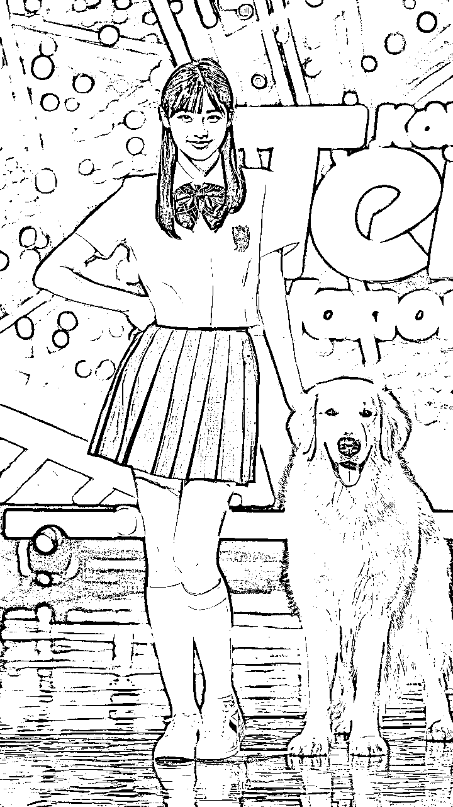

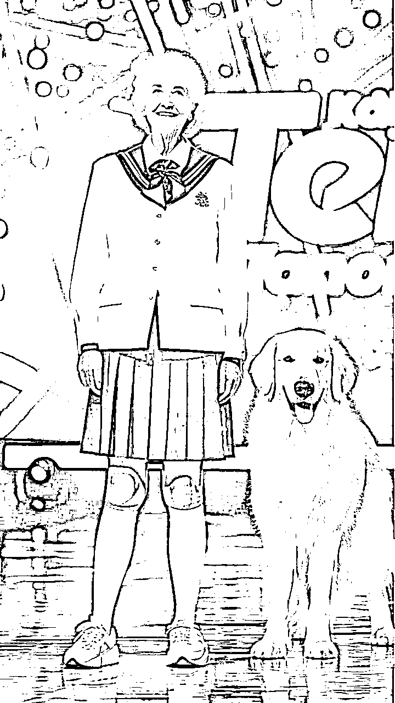

##### 方法二：

使用MJ的Vary(Region)功能，也是局部重绘；

上一步已经点击Vary（Region）；

接下来第一步：修改提示词，将之前的一个男孩和狐狸，改为一个小狐狸和一个大狐狸；

第二步：点击套索工具

第三步：用套索工具抠出小男孩

就完成了局部地区重绘的效果。

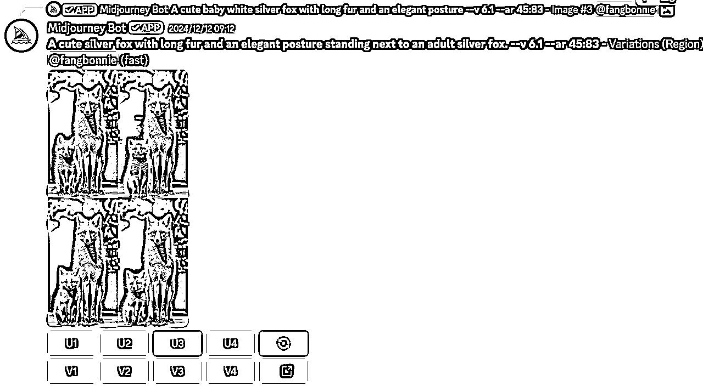

### 20 如何更好地通过提示词控制视频生成效果【case来自于1月私教陪跑，模型主要是可灵1.6和runway，参考思路即可】

#### case1：金毛不灵动事件

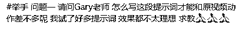

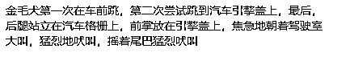

优化后提示词：金毛尝试跳到汽车引擎盖上，但是后腿滑落，踩在车牌上，第二次跳跃，跳到了引擎盖上，金毛不停地吠叫，试图与汽车内的人沟通，疯狂吠叫。

#### case2：房屋不塌陷事件

优化后提示词：金毛犬看向木屋，常年失修的木制结构房屋轰然崩塌，房顶塌陷，沙尘漫天，树木倒地，房梁窗户支离破碎，房屋材料混杂着沙尘和碎石滚落到公路上，仿佛世界末日

如果笼统的提示词效果不好，比如“房屋坍塌”，就把房屋坍塌拆解成多段更细致的提示词，比如“常年失修”“轰然崩塌”“房梁窗户支离破碎”“房屋材料混杂着沙尘和碎石滚落到公路上”

#### case3：神奇酒瓶事件

优化后提示词：老人举起手，喝下一口酒，变成了年轻人，超强变身，摄像头旋转，动态画面

如果画面里出现了你不想要的元素 那就不要提这个元素

AI视频的提示词读取逻辑是取关键词，“另一只手始终空着不拿任何物品”这句属于无效提示词，AI会读取成“手拿物品”，“拿着酒瓶喝酒”也属于无效提示词，因为他的手上已经有酒瓶了，这句话可能会让AI理解为“手上的瓶子不是酒瓶，需要一个额外的酒瓶”

提示词的每一句都要有它的作用

*   老人举起手【强调动作，让画面产生变化的趋势】

*   喝下一口酒【主要动作】

*   变成了年轻人【主要动作，引导主体变身】

*   超强变身【强化变身的动作】

*   摄像头旋转【镜头提示词，让画面产生变化的趋势】

*   动态画面【修饰提示词，强化动态效果】

#### case4：小鹿不听指挥事件

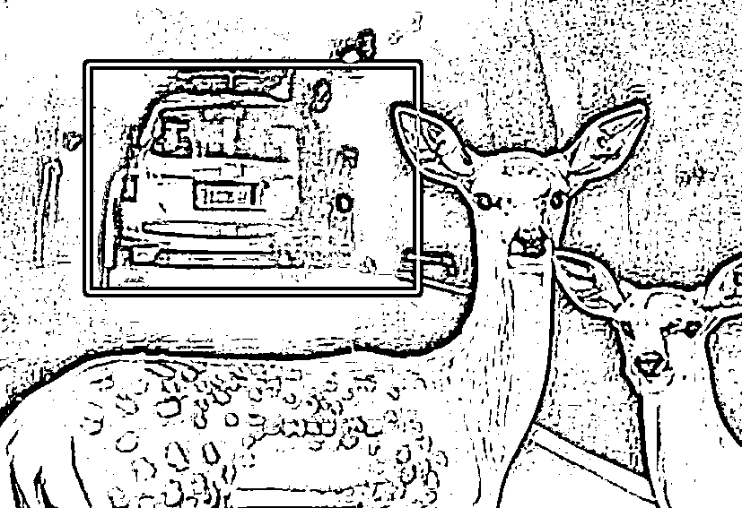

#### case5：汽车不进反退事件

优化后提示词：

狮子们和救护车朝着相反的方向走远，狮子走向镜头前，救护车越来越远，逐渐消失在视野里

#### 简单的几个规则

总结一下，提示词文化博大精深，我也没有什么经验和资格来讲高深的原理，但有几个比较简单的规则可以遵循，提高我们的效率：

1.  图片趋势与视频相同：不管是对于首尾帧还是单图生视频来说，图片都是最重要的一环，图片选得好，事倍功半。如果要实现“走路、走秀”的效果，用的图片就最好是行走的姿态，最次也要是站立的姿势，如果用“跳舞”的图片来生成“走秀”的视频，大概率会崩掉，因为图片趋势和视频生成的动作相悖。以及上面case4，图片中已经有了两辆汽车，视频生成时“走向汽车”就变成了指向不明的提示词。所以选择图片时要注意排除干扰、选择合适的主体动作。

1.  利用惯性：AI视频生成，特别是首尾帧，有“惯性”的说法。如果首尾图变化不大，或者变化太大，就经常出现生硬的或PPT式转场。这个时候就需要我们给予一些能够引发画面变化的提示词，比如运镜控制“摄像头拉远/拉近”“摄像头旋转”“摄像头向左/右移动”和激活动作“美女举起手，变身成蒲公英”，这样通过让画面有了“变化”的惯性，就不容易静止不动。

1.  取其精华，去其糟粕：生成视频时，确保每一句话，每一个词汇都有它的意义，不要用“虽然但是”之类的关联词。对于简洁的表述无法实现效果的提示词，可以参考case2，将一个复杂动作拆解为多个简单动作，减少对冗余细节的描述。

1.  直接描述结果，结果具象化：参考case1和case3，不要描述你不希望出现的元素，而是直接描述你需要的效果。以及直接通过提示词描述“两个主体往反方向走”或表述“远近”时，可以描述得更加具象化，把远近变成大小

1.  图片质量决定视频质量：视频画质不够高的时候，把图片像素提高，即梦可以超清、MJ可以画质提升，图片像素越高视频像素就越高。

1.  发挥工具的优势：

### 21 高阶技巧之一：爆款达人秀变形摩托车视频复刻案例

这个case来自一月私教陪跑的直播讲解，其实现在可灵1.6已经支持首尾帧了（当时不支持，所以只能组合起来用）但相对应的技巧和思路放到现在并未过时（需要节省成本多个工具组合时、需要进行复杂元素和动作组合时）

很多人问这个视频怎么复刻，其实这么复杂的视频不建议大家一开始就尝试，流程比较繁琐，可以先从看起来简单的做起

1.  生成首帧：

正面全身照，一位甜美的日本偶像在美国达人秀的舞台上骑着黑色电动车，穿着精致的连衣裙，明亮干净的场景，大长腿，4K，真实照片质感

1.  可灵图生视频：让美女下车

1.  提示词：美女从电动车离开，站到舞台前

1.  提取尾帧：使用关键帧提取工具提取上一步视频的尾帧

1.  扩图：把图片扩大到能够看到电动车（效果会更好，不是必须的）

1.  消除笔：消除电动车

1.  抠图：把人物、背景单独抠出来（人物消除笔消除之后就是背景）

1.  做机器人和汽车的素材，并抠出来：直接文生图，再抠出来

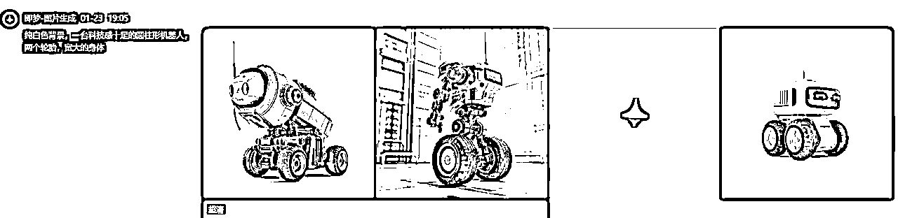

1.  用机器人素材替换掉电动车

1.  runway生成电动车变成机器人的素材

1.  可灵图生视频：制作美女拿出头盔的动作

1.  美女从机器人头部拿出一个头盔，戴在自己的头上，再回到原来的位置微笑站立

1.  提取尾帧：把美女戴头盔的尾帧提取出来（我用的老马的工具）

1.  抠图：把美女抠出来，把旁边的机器人换成汽车

1.  runway做首尾帧：让机器人变汽车

1.  提示词：美女双手扶了一下头盔，机器人变成了汽车，超强变身，摄像头旋转，动态画面

1.  可灵做最后一段视频：美女坐上汽车开走

1.  提示词：美女戴着头盔坐上汽车，发动汽车，开到了舞台右侧，摄像头跟随

1.  剪辑，参考对标视频套模板

成品效果：

### 22 高阶技巧之二：万物组合之达人秀变身案例 来自@酷拉皮卡 教练

从需求出发，为了更好地适应内容需求，我对流程进行了一些调整。通常，一个丰富的视频需要多张过程图生成多个视频，而除了第一张图，后续过程图都是在同一背景下进行增加/减少/替换的组合。

#### A.生成素材：

1.  舞台上的三女生

1.  平底锅

1.  金鱼

1.  机械赛博鱼

1.  红礼服女生 （注：煎鱼视频的尾帧还会截图作为一个起始帧素材）

提示词技巧：

在A步骤中，平底锅、金鱼、机械赛博鱼等提示词中不包含人物描述，言下之意就是只保留场景和灯光描述以及该生物/物品即可。同样的，如果使用智能体模板，亦遵循这一原则。

PS：

透视适配：站立地面的生物/物品的透视角度需要与三女生的场景保持一致。（保持舞台相关提示词的一致基本不会太大出入，如有则单独调整）

背景光源一致性：保持同样的舞台灯光相关提示词，是为了确保光源位置和色彩的一致性。

#### B.处理图片

将图片抠出以下部分：

1.  背景

1.  三个角色

1.  变换的物品/生物

接下来就是视频部分

这步或许会有疑问：明明局部重绘就能解决的问题，为什么还要这样？

答：局部重绘确实可以解决部分问题，但我更倾向于将每个人、动物、物件和背景分开处理。这样做的优势在于：

1.  模块化：将所有元素组合成变量，制作过程更简单直观。

1.  自由度：变化的自由度更广，可以根据画面审美需求控制前后空间关系。

1.  空间利用率：更高的空间利用率，让画面更丰富。

#### C.得到关键帧

使用智能画布和PS修图/拼图/并添加阴影（如果需要）。阴影可以增加实感，抠图或手动添加都可以，选择最方便的方式）要更有趣,多加段女子跳到机械鱼的身上游动也未尝不可，截取最后一帧衔接上就好。

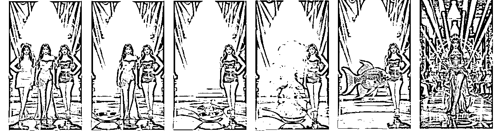

#### D.图生视频

#### E：剪辑/渲染/导出

小结：

无论是从对标到原创的迭代，还是流程中的细节优化，灵活运用各种工具和技巧，持续练习手感，便能做到高质与高效的平衡。

2.23 特殊变身效果

近期流行一种油漆包括人体的变身效果，可以看作为一种非牛顿流体。此效果主要依托于AI模型本身的性能。

美女+非牛顿流体爆款截图

https://youtube.com/shorts/ErQ8dicFxEc?si=gWxR2QWT1OSta3o9

https://youtube.com/shorts/p0j3JPdP7iM?si=Ot_bpspzC-b73un7

猎奇+非牛顿流体爆款截图

https://youtube.com/shorts/pJRHcFq-CQo?si=Wpjznk4MiABIwXxU

https://youtube.com/shorts/togE8UqjD2E?si=Vdf8Mmfz2PydcLU0

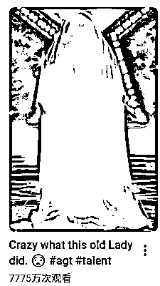

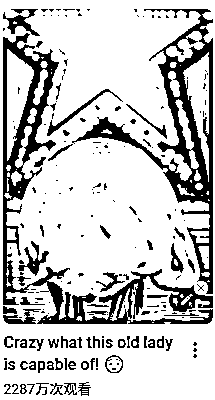

此效果最好的实现模型是pika-pixverse：官方内置有此溶解效果，能够实现多种多样的效果。

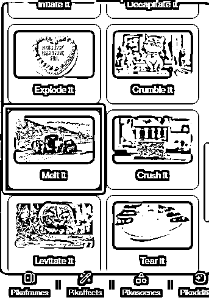

经测试可灵效果也教好的接近对标，如要实现溶解还是pika更合适。示例如下：

PS：提示词书写方式，如：一位老人站在沼泽中央，他痛苦的撕扯和拉伸衣服，逐步的身体拉扯出紫色和红色的非牛顿流体一样的液体，从上至下缓缓流下，逐渐覆盖老人的身体，老人逐步慢慢蹲下，最后液体完全包裹住老人，形成一个球形的不停流动的非牛顿流体。

实际上runway一定程度上也能实现这种流体效果，示例：

PS：提示词在常规基础上，带上非牛顿流体这个名词来引导流动皆可实现，例如：舞台上，一位女生正在表演走秀，黄色非牛顿流体从头部逐步留下覆盖全身，形成一个球状。

小结：此特殊流体效果，不止隐晦的暗示，也包含了非常多而不确定性，非常适合达人秀变身这个赛道的变种和扩展。迁移此玩法，相信大家可以尝试出许多新的爆款创意。届时请告知我们，嘿嘿！

### 23 图片一致性控制方案

#### 多模态类：豆包、GPT、Gemini

豆包：简单粗暴，一个指令支持直出30-40张图，且可用性还比较强，并且免费；美中不足在于水印和精细度不足，人物同质化程度高

GPT：豆包的单轮次版，精细度更高，但等待时间过长。

Gemini：其实比上面两位都早一些更新，但是性能有限。

#### 内嵌类：即梦、MJ、imageFX

即梦：即梦3.0【参考人像写真】

MJ：全向参考命令【--oref www.图片url.png】+【--ow 权重（1-1000）默认100】 MJ的老一致性命令不再赘述

imageFX：种子和人脸强相关，固定种子即固定人脸，但越远就越不可控。

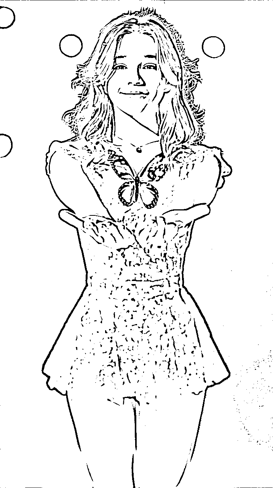

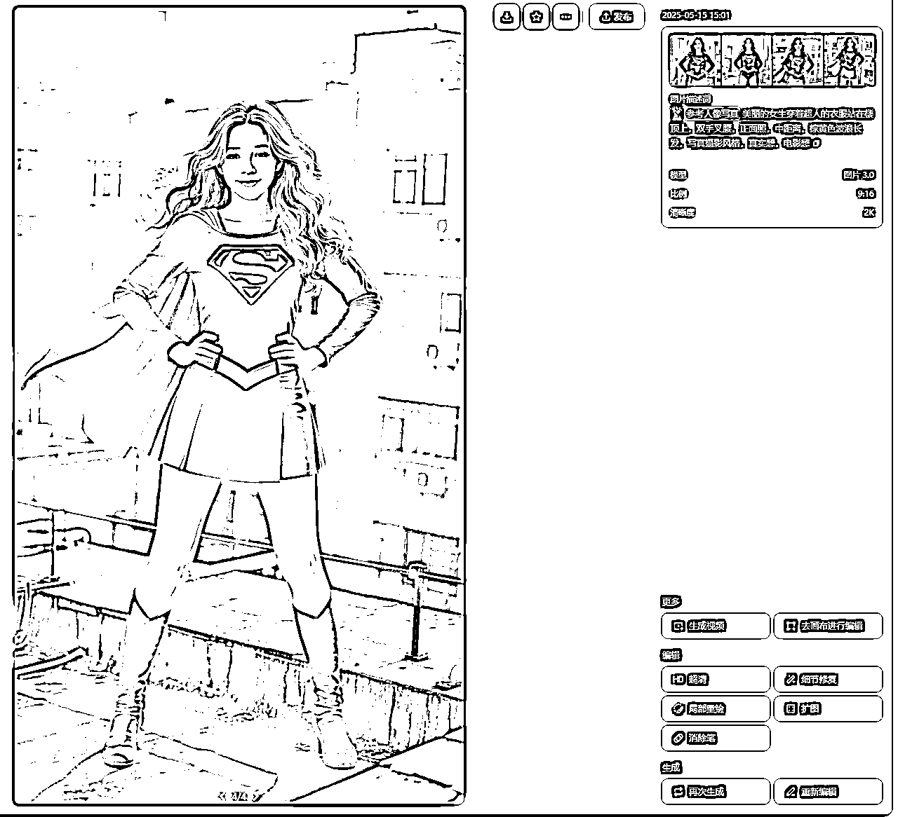

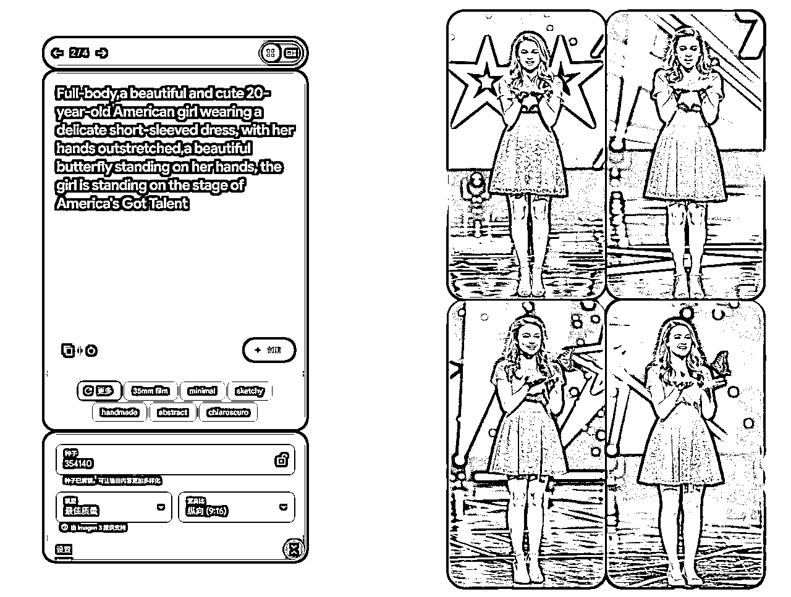

#### 多图参考：whisk、runway

whisk：支持非常多人物和场景和风格的参考，但相似度并不是非常高

runway：没想到吧，runway能出图，而且效果还不错，支持最多三张图（角色/场景）的参考，runway无限用户狂喜

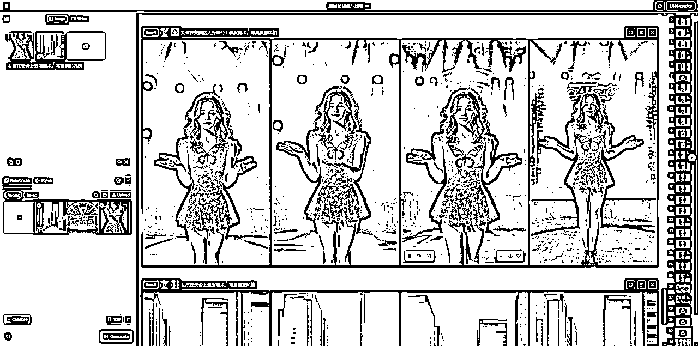

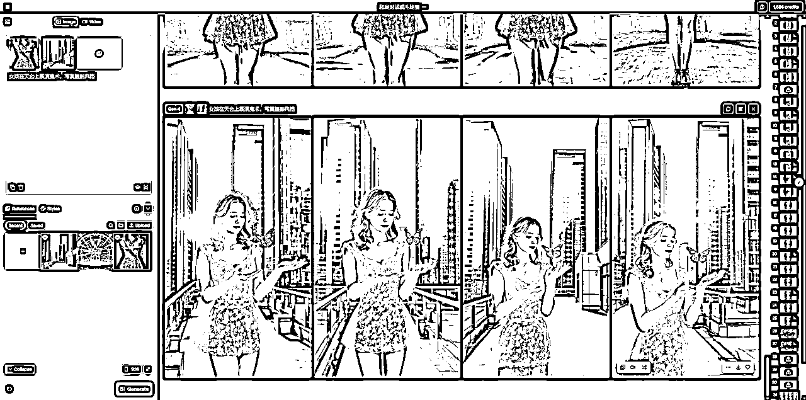

#### 骚操作：视频模型运镜出多角度形象

一个美丽的女生自然地站在舞台上，舞台上灯光闪耀，镜头渐渐拉远，环绕绕女生一周

图片高清+视频高清=N张不同角度的图片

多主体一致性

pixverse、可灵1.6、可灵2.0都可以

#### Lora类：comfyui、stablediffusion、第三方集成网站

细讲太复杂，简单讲用不上，留着以后comfyui的专场分享来讲，这里略

#### 纯文本控制：适用于简单形象或是大模型认识的形象

动物示警、动物故事、动物救援等等对于形象精度要求不高的都可采用该方式进行控制

原理其实就是通过提示词限定了形象的范围，比如说“一只体型较小的无角梅花鹿”，这个属于简单且精度要求不高的形象，模型一般不会有针对该形象的大量训练集，所以固定了提示词后就不会有多少区别

但话说回来，精度不高的图片都有豆包一键出套图了还要纯文本控制作甚？

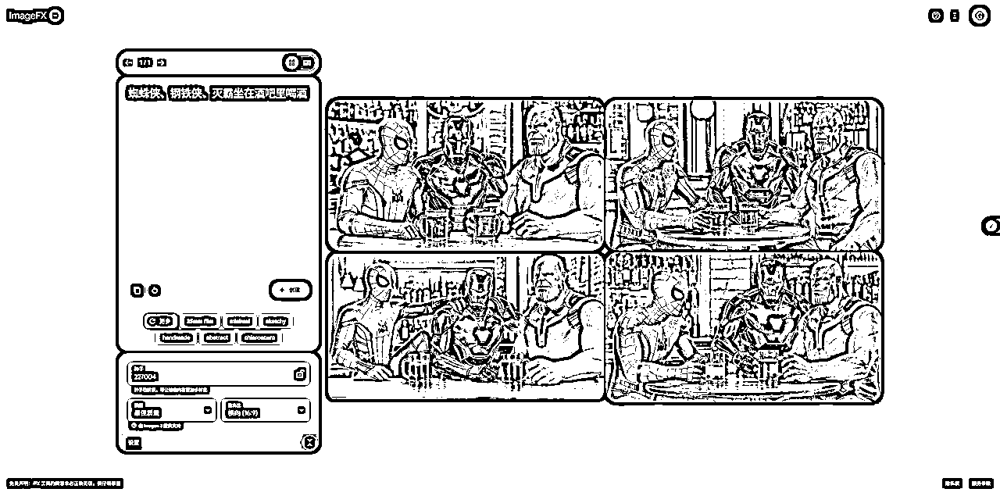

有了上面这些技巧，基本所有 AI 赛道的视频都能复刻出来，自己多实操一下就知道没那么难，最重要的是先模仿爆款，然后慢慢去找到自己的风格和方向，找到灵思泉涌、适合自己的细分赛道。

# 模型竞技场

可灵2.1和可灵2.1大师版今天（5月29日）正式发布，2.1性能全面领先1.6和2.0大师版接近，且价格与1.6持平，但不支持首尾帧，案例测试等下个月积分刷新再补一下，充值实在太贵，这个月积分用完了...

#### 首尾帧

个人主观评价：首尾帧场景中，pixverse4.5 ≥ pika＞vidu ＞可灵1.6＞runway

自动化出首尾帧推荐vidu或者runway（无限额度）

手搓首尾帧仅推荐pixverse，效果好太多

##### 小幅度变身

美丽女生在舞台上进行魔法变装表演，将手上的一只蝴蝶变化出很多很多蝴蝶落在自己的连衣裙上，蝴蝶和裙子融为一体，雾气特效，摄像头旋转

可灵1.6、runway、pixverse、pika、vidu

考核点：人物灵动性、动作自然度、指令遵循度

##### 大幅度变身

美丽女生在舞台上进行魔法变身表演，女孩转身，散发出星光特效，变身成了一个木棍人，超强动态画面，摄像头旋转

可灵1.6、pixverse、pika、runway、vidu

考核点：变身流畅度、指令遵循度、主体稳定性

##### 一般幅度变身

女孩抬起手变装，超强雾气特效，超强动态画面，超强变身，摄像头旋转

可灵1.6、runway、vidu、pixverse、pika

考核点：变身流畅度、特效效果、动作自然度

#### 单图生视频

个人主观评价：单帧生视频中

可灵2.0＞pixverse4.5＞可灵1.6≥viduQ1≈即梦3.0＞runway Gen4 ≈ Veo2

##### 名人视频

两个男人在酒吧互相碰杯，勾肩搭背，阴险地大笑，仿佛计谋得逞，电影感

可灵2.0、可灵1.6

runway、pixverse、vidu（vidu是真把流量玩明白了）

veo2、即梦=🈲

考核点：是否能生成、指令遵循度、动作自然度、人物真实度

##### 吃东西-高难度

女孩用手抓起一把面前的彩虹凝胶糖果放进嘴里大力咀嚼，极度夸张的动作，超大幅度地动作，超级夸张的表情，男孩哇哇大哭

即梦3.0、可灵1.6、可灵2.0

runway Gen4、vidu Q1、pixverse4.5、pika（实际上，pika并不支持单帧生视频，这个是参考生视频）

考核点：动作完成度、主体稳定性、动作自然度、指令遵循度

##### 大幅度功夫武打

两人比武打斗，和尚飞起来用双脚踢向强壮男人的头部，汗水飞溅，强壮男人被和尚踢翻在地

可灵2.0、可灵1.6、runway

vidu Q1、即梦3.0、pixverse

考核点：动作完成度、主体稳定性、动作自然度、指令遵循度、细节效果

两人比武打斗，和尚迅猛地出拳打在强壮男人的脸上，汗水飞溅，强壮男人受到巨大的冲击力被打得向后翻滚倒在地上

vidu Q1、可灵2.0、runway

可灵1.6、即梦3.0、pixverse

考核点：动作完成度、主体稳定性、动作自然度、指令遵循度、细节效果

##### 复杂场景交互

宝宝在田野的洞口旁挣扎，双手抓着洞口想要出来，但手一松，掉进了深不见底的大洞，镜头上移，对准洞口

智谱、runway、可灵1.6

可灵2.0、pixverse、即梦3.0

考核点：动作完成度、主体稳定性、动作自然度、指令遵循度、细节效果

##### 简单场景交互

大象用鼻子大力地吸水，非常焦急，镜头摇晃

即梦3.0、可灵2.0、可灵1.6、runway

veo2、vidu、pixverse

考核点：动作自然度、指令遵循度、细节真实感

##### 复杂主体动作

大象用鼻子喷水浇灌干枯的田地，人们在旁边鼓掌

即梦3.0、可灵2.0、可灵1.6、runway

veo2、vidu、pixverse、runway

考核点：动作完成度、主体稳定性、动作自然度、指令遵循度、细节效果

美丽的女生站在舞台表演，舞台上灯光闪耀，女生手上的蝴蝶像魔法般自然地变成一群真实的蝴蝶，自然地扇动翅膀飞起围绕女生翩翩飞舞，女生自然地看着蝴蝶，镜头微微拉远

可灵2.0、vidu Q1、veo2

runway、可灵1.6、pixverse、即梦

考核点：人物灵动性、主体稳定性、动作自然度、指令遵循度、细节效果

香蕉人在单杠上表情痛苦地从双腿之间排出了很多香蕉片，伴随着黄色气体和液体一起落下

赠送图片提示词：拟人化的香蕉双手撑着单杠，双脚抬起，从双腿之间落下一片片的香蕉，就像拉屎一样，皮克斯风格，背景是厨房，镜头对准空中的香蕉人，特写镜头

即梦3.0、可灵1.6、pixverse、vidu

#### 彩蛋-VEO3

veo3上线以后，为了深度体验它的能力，我做了一个模仿野兽先生的真人秀节目，大家可以感受一下

原视频链接：https://mp.weixin.qq.com/s/_nE-HdbWkKwumxW3d2ZONA

脚本基本是我给的，用Gemini做了一些优化

视频生成使用Flow，但并没有用更新的scene builder（类似sora的storyboard），因为用起来有bug，很大概率生成没有声音的视频，所以所有视频片段都是通过文生视频来控制一致性，导致一致性其实很差，人物变来变去的

但，即便如此，这个视频也基本还原了我的大部分想象，做出一个这样的视频在veo3发布之前绝对是难以想象的工作量，但它只花了我一下午，大部分时间是在抽卡和等待

内容创作，未来已来