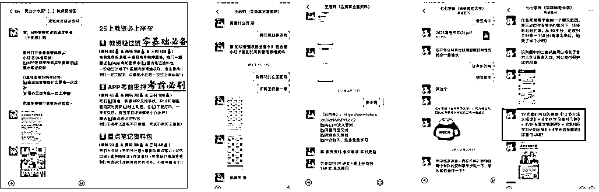

# 小红书虚拟产品 - 选品方法

> 来源：[https://zcnzawlx2ndr.feishu.cn/docx/MF37dM5X5o5gHVxzuiWcHbKXnSd](https://zcnzawlx2ndr.feishu.cn/docx/MF37dM5X5o5gHVxzuiWcHbKXnSd)

选品能成的关键点：多看、不纠结！！

并不是每个关键词看一篇笔记就可以，而是尽量沿着关键词看尽量多的内容，这样才能让我们选到合适的产品；也不是每个产品我们都要做，前期给自己定下时间，选到3个品就可以开始做，后面在不断做的过程中持续选品。

## 选品的核心3要素 （通用法则）

1.  确定一个用户有需求的内容 - 具体看笔记下面的点赞和评论数，是否有“求分享”，“求带” 等词

1.  确定这个需求是急需解决的 - 具体看评论区内，那些 “求分享” 评论的时间

1.  确定这个产品用户愿意付费购买

## 新手选品七步法

这个方法不仅适用于虚拟产品，也适合实物产品，只要是做小红书电商，这个选品方法都可以借鉴

### 新手选品7步法

第一步：搭建关键词库

第二步：通过关键词搜索笔记

第三步：研究笔记

第四步：确定产品详情

第五步：确定产品付费意愿

第六步：确定产品价格

第七步：确认版权问题

### 第一步：搭建关键词库

1.  有了关键词库方便我们在下一步去搜索笔记，挖掘需求

1.  准备一个excel表格

1.  找到一个初始关键词

1.  这个初始关键词可以是简单的词：比如表格，PPT, 家长会，早教，幼小衔接，四六级考试只要跟你赛道相关的就可以

1.  也可以是按照这个公式去组织：人群+需求+延伸关键词 ，如大学生+四六级考试+作文模板

1.  把这个初始关键词放到小红书搜索框，然后从下面这4个地方去收集更多的关键词

1.  这4个地方分别是：

1.  下拉框的长尾词

1.  话题下面的关键词延申

1.  热门笔记中的关键词

1.  搜索框下长尾词

1.  把收集到的这些更加具体的关键词收集到excel表格中，就做成了我们自己的关键词库

### 第二步：搜索笔记

不管是根据初级关键词搜索还是根据延伸关键词进行搜索，我们都要进一步去看搜索后的笔记数据。

前期建议大家搜索关键词后，按照综合排序/最多评论排序进行笔记查看，如果对于笔记发布时间有要求可以在发布时间里选择。

### 第三步：研究笔记

看笔记主要看3点：笔记发布时间及评论发布时间；评论内容；笔记是否有商品挂车；商品销量

1.  为什么要看笔记发布时间

因为时间点对于用户需求有很大影响，我们选品最好选择近期有热度的产品。

时间代表的是需求点，爆款笔记时间越近越好，如果拿不准笔记发布多近算是合适，可以反向看这个资料目前是否用户还有需求即可，只要还有需求就可以做。比如：最近1-2个月是否还有人问”怎么买”“怎么领取”等

如果是去年的爆款笔记，可以看看是去年几月份的，那此需求大概率今年同一时间还会爆发，可以写到选品表标注好时间，留着备用。

注意：很多时候发布时间并不是实际需求时间，比如3月份开学很多人1月底就开始布局发布相关内容，这时候可以同步观察评论区集中评论时间来确定真实需求时间。

1.  查看笔记发布时间的方法

1.  情况1：直接下拉到笔记底部查看

1.  如下图笔记发布时间是24年11月，同步我们去看评论区，1月份还有大量求分享的评论，代表这个品1月份也有需求，可以进一步根据这个课件的主体和内容，继续搜索相关主题的笔记，判断搜索的时间点是不是适合继续布局。

1.  情况2：点开笔记，正文下方的笔记发布时间如果显示编辑于，那我们就只能根据评论区最早互动时间判断笔记大概的发布时间。如下图笔记显示编辑于2月23日，评论区是去年11月开始有评论，推算这个品11月份发布笔记且有需求，同步最近3天还有人求分享，初步推测现在也有需求，可以进一步去搜更多相关主题的笔记判断现在的需求热度。

1.  看笔记下方是否有挂商品链接

1.  情况1：如果笔记没有挂车-看点赞&评论区

看 笔记 点赞量：点赞收藏一定程度反应【内容需求】。

多篇近期笔记点赞大于500，代表用户对于此类内容有需求。

看 评论区 内容：评论区一定程度反应用户的需求度

我们的目的是售卖资料，所以要找评论区都是【求资料】的笔记，来确定选品。

有的笔记点赞收藏很多，评论区几乎没有内容，证明这类笔记大概率是干货贴，大家收藏那一刻需求已经被满足。

如果评论区都是求资料的证明这个资料有需求可以进一步验证是否能进行售卖

特殊情况：如果这个笔记挂车了&放了群聊链接，很多人会直接购买&进群，评论区同样没有内容但是不代表没有需求。

下图2个笔记点赞都过1000，都是近期的笔记，但是笔记1评论区都是：已关求分享；笔记2评论区内容少且都是求搭子。

我们要找的就是评论区图1这种，都是求分享的笔记。

1.  情况2：如果笔记挂车-看商品销量

我们最终的目标是选品，如果一个笔记挂车了有销量，即使我们搜索到到的笔记没有点赞，也要重点记录这个选品。一个商品的销量大概率是由多篇笔记带来的、我们可以延伸再去这个账号的主页/更换关键词搜索爆款笔记，确定爆款笔记时间。注意：我们观察的时候同步可以根据笔记数据和商品销量数据观测这个产品的转化率，有一些产品笔记数据很好，但是产品未必好卖。

### 第四步：确定要上架的产品

如果是挂车笔记，那我们就可以模仿上架同款商品即可，挂车的链接就是售卖的产品；

如果是没有挂车的笔记，我们需要根据笔记内容来确定选品，或者直接添加同行引流的微信，锁定实际售卖的产品（看引流微信以后具体售卖的是什么）。

根据笔记内容判断选品方向

下方笔记内容主体就是：核心1500词、听力技巧，用户的需求点就在于考试重点知识整理。

根据笔记内容判断选品方向

下方笔记内容会更加明确，直接标注了可以获得的备考资料。

### 第五步：验证付费意愿

并不是笔记有点赞、评论区有求分享的内容，就一定是【用户愿意付费】的产品。

有的内容点赞量很大、需求看起来很大，但是添加微信后同行都是直接送了这个资料，售卖的是其他产品（比如试听课、会员合集等），这时候你单独售卖这个产品用户购买意愿就比较弱；

有一些产品点赞量很大、需求也很大，但是资料内容简单，客单价卖不上去（1.9 、2.9一份这种），有一些产品是资料挂车后用户的付费意愿低，导致有数据没有转化，这样的产品我们要把转化率考虑进去，确定自己是否能接受。

下图单篇笔记点赞就近200，但是销量是个位数，整体转化率就非常低

### 第六步：定价（虚拟产品的定价技巧）

虚拟资料的特点是几乎接近于0成本，也就是你卖1元一份就赚1元；卖5元一份就赚5元，能卖出去就是钱。

但是我们也不能过于破坏市场价格，不同的资料对应着不同的市场价值，我们需要在合理区间内给我们的产品定价，保证用户可以接受&我们也有钱赚&市场相对稳定。

##### 01-定价主要参考同行

优先参考小红书站内有销量的商品链接的价格，直接搜索商品关键词，查看小红书站内有销量的商品大概的价格区间是多少；如果没有参考同行私域成交价格。

###### 01.1 先看小红书站内同行

如果有同行上架这个商品且有销量，那我们可以参考同行的售卖情况&价格。

以四六级核心词汇为例子，可以看到小红书有同行售卖的价格是2.9元/份，销量1279份。

客单价虽然低，但是同步设置了多个SKU，有高客单价产品可以选择，那我们可以考虑参考这个产品作为我们的选品。

###### 01.2 看私域玩法的同行

如果搜索产品关键词并没有搜到小红书站内有相关产品，并不代表这个品一定不行。

相对于引流到微信售卖资料，直接开店售卖资料的人相对还是少的，这也是为什么现在小红书虚拟电商有机会，很多人都没有直接开店。

这时候我们要去研究引流微信的同行销售的产品以及定价。

不管做什么赛道，我都建议大家至少先添加20个以上同行的微信，看同行的后端是怎么售卖这个产品的以及定价是多少。

注意：开店相比引流到微信，因为缺少了一对一销售环节，在售卖产品有一定局限性，在小红书靠笔记售卖50元以上的产品相对来说有难度。

这时候我们未必一定要做更高客单价的后端，但是一定要了解清楚同行的玩法。后续跑通了店铺，如果有时间精力想要后端升单，可以把已经付费的用户囤到私域，这样会用户也会更加精准。

一般考试类:后端都还升单其他课程产品/题库APP

教学教务类:一般后端会升级赛道会员

k12家长赛道：一些培训机构会免费送资料售卖试听课

##### 02 定价技巧 — 低价截流起号

基于兴趣电商内容推流的逻辑，一个用户对某个内容/产品感兴趣的情况下大概率会重复刷到相关的内容，这时候如果我们价格略低于同行，就获得了更高成交的可能性。

当你售卖的产品是目前在平台上已经有销量/有热度的商品，这时候定价比同行便宜一些可以更加快速有效的获取流量。

##### 03 定价技巧-梯度价格设计拉升客单价

一般虚拟资料单份资料客单价不高，这时候根据产品设置一个高客单价SKU，一般设计逻辑是【打包更优惠】

比如，单份家长会PPT是9.9，30套的价格是19.9，全店会员39.9，很多人为了划算就会直接买打包会员，从而提升产品客单价。

这时候很多人因为想要多个款式的内容，就会直接购买套装价格/店铺会员。

### 第七步：确认版权问题

不要卖有版权的产品！赚钱的前提是安全，为了保证我们能够持续做这件事情

以下我整理了几个别人分享的，不要碰的高风险品类

## 围追堵截式选品法

小红书虚拟电商选品不要期待依赖一些工具产生很好的效果，更多的就是通过手动搜索、多看找到机会点。

最好的办法就是通过各种渠道想办法把同行的内容都围追堵截的掌握，

第一步-根据关键词搜索选品法，找到爆款笔记，再通过笔记延伸到账号，在账号里。

第二步-通过关键词-搜索相关商品，商品延伸到店铺，店铺里面收集爆款产品

第三步-小号关注30个以上同赛道的优秀账号 跟他们的内容和选品

虚拟项目很久就有人做了，有很多前辈对于用户在不同时间的需求把控比我们会更准确，这时候我们要做的就是找到足够多的前辈，吸取他们的经验。

找到一些爆文率高&做的时间久的账号关注后跟进他们的内容和选品。

第四步-找到15个以上做了1年以上的同行，挖去年选品和内容

每年随着12个月份的轮转，统一赛道的需求是会重复的，到期末的时候就需要期末资料、到考试的时候就需要考前冲击，而如果我们想提前布局，就要在需求来临之前就能精准的把握需求。

这时候同行去年同一时间发的什么内容、选择做什么产品就对我们非常有借鉴意义。

第五步-添加多个同行微信，观看同行朋友圈

第六步-加入同行的群聊，通过群聊消息感知用户需求

## 第三方平台选品法

除了小红书，淘宝/拼多多都有很多售卖虚拟产品的店铺，一般来说，在淘宝和拼多多有需求有销量的产品，我们都可以来验证是否能在小红书进行售卖。

整体分2步走：找到电商平台高销量的产品——验证产品是否在小红书有需求

#### 第一步：找到电商平台高销量的产品

如果你已经确定了人群和赛道，在第三方平台通过搜索关键词定位到一些高销量的产品、店铺。

如果你没有目标赛道和人群，可以搜索电子资料、PPT模版等大词，多看、多刷、多收藏，慢慢的淘宝/拼多多就会给你推送更多相关的产品，我们就可以通过手刷找到可能的爆品。

#### 第二步：验证产品是否在小红书有需求

有意向的产品以后，直接在小红书搜索产品名字/产品内容关键词，进行相关内容查看

看笔记数据

先看笔记表现，小红书电商虽然没有发展很久，但是小红书已经存在很多年了，很难出现一个产品或者内容是小红书的用户需求非常大但是在小红书没有人发帖子、发帖子了没有热度的情况。

就要通过相关笔记的数据（点赞、评论）来判断这个需求是否是小红书平台用户的需求。

看产品销量

如果我们搜索的商品在小红书上有销量则可以非常确定这个产品是有需求的，进行下一步时间验证，来最终确定这个产品是不是适合现在做。

看需求时间

需求随着每个月是会不同的，比如考研资料的需求是要根据学生备考的进度来决定的，我们不能开学的时候卖期末复习资料，也不能期中的时候开始售卖新学期预习资料。

需求时间就可以通过爆文笔记的发布时间&评论区集中求资料的时间来确定，然后也可以根据需求（如考试）的具体时间线来确定。

## 100+个小红书虚拟资料/产品