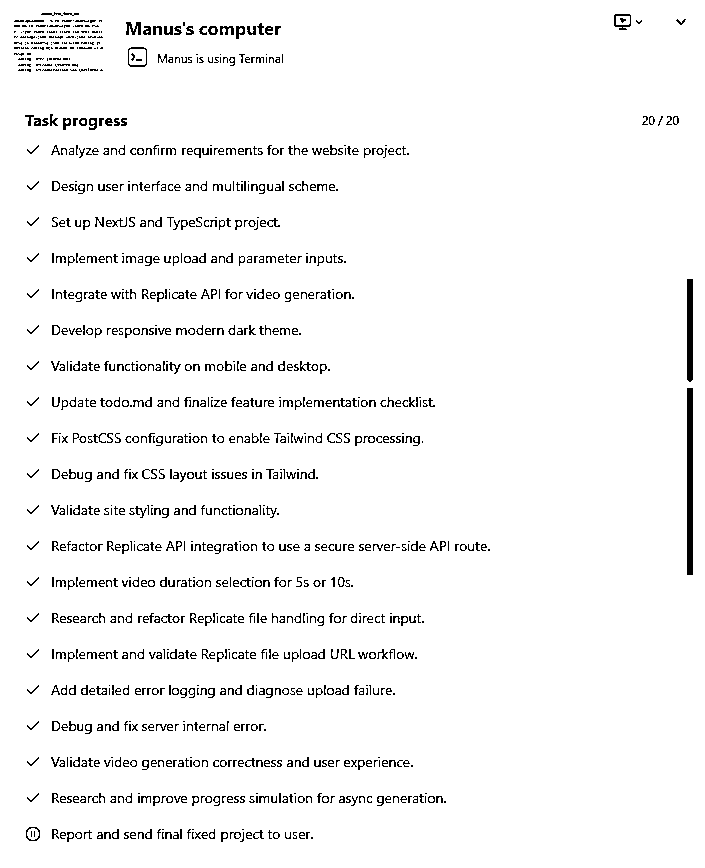

# 怎样用Manus和Cursor的Agent编程，以及一些思考

> 来源：[https://kxgiimtbac.feishu.cn/docx/NpT7dH3iuoJnryxClgxcy3QInxd](https://kxgiimtbac.feishu.cn/docx/NpT7dH3iuoJnryxClgxcy3QInxd)

如果，你一直想尝试AI编程做点什么，但是你和我一样只懂一点编程的皮毛，或者纯粹就是一名编程小白，那你一定要试试Agent编程。

最近我一直想写一篇Agent编程的文章，谈谈我在实践中的一些心得和遇到的问题，以及一些浅薄的思考。在谈Agent编程之前，我们先看看Manus帮我们干了些什么：

编写一个信息图生成网站的酷炫界面（一位编程小白朋友的网站：通过Claude实现一个多Agent协作，通过Agent对输出结果审查和打分的生成信息图的Python应用，并通过Manus完善前端）：


编写一个生成信息图和结构化网页的WordPress插件（含后台设置），并在后来通过Cursor Agent优化成GPT-4o生成图片的网站：


编写一个AI生成视频的NextJS多语言网站，对接Replicate的kling-v1.6-standard API，实现多种设置的视频生成：


改版良辰美教练的工具站开源程序的UI：


帮我儿子生成一份网页版的简历：


# 缘由

事情缘起于Manus诞生之后。

作为一名懂一点编程，仅仅能看懂代码皮毛的所谓技术人员，过去我一直不愿意使用Agent编程，包括Cursor的Agent模式、Bolt.new、V0.dev，总担心对项目的代码缺乏掌控感，喜欢在Cursor输出代码后看看它修改了什么，担心它会修改预期之外的功能导致代码混乱。事实上，在使用Cursor的Ask模式或Manual模式编程的时候，随着代码量的增大和逻辑复杂度的增加，虽然貌似对代码有那么一点所谓的掌控感，但我确实还是遇到了不少困难和挑战。

Manus出现之前，我还在和我的朋友韬哥说自己不愿意使用Agent，还让他谨慎使用Agent编程。然而我的朋友是编程小白，即使他不使用Agent，看着AI输出的代码也是无感的。在对Manus进行一些常规的内容分析，数据分析，方案策划的测试后，他惊叹于Manus这种完全自动化并且高质量的结果输出，于是，有了一个大胆的想法：能否把自己的一个想法通过Manus做成工具产品！而且，他一上来就搞大的，想搞一个多Agent协作，通过思考打分的机制生成高质量信息图的工具。


结果，大出我的意料之外，他真搞成了！虽然后面Python对接到网站的时候他遇到许多困难，但最终他还是成功上线了一个多Agent的信息图生成网站。

不过，据我后来了解，他使用Manus生成的版本在生成信息图的时候结果并不尽人意，后来是改为使用Claude才实现多Agent协作生成信息图的功能。后面他通过Manus调查现在最热门的技术网站风格，并直接帮他生成一个效果酷炫的前端代码。


效果十分酷炫，生成结果质量极高。


但是，最大的缺点就是生成时间太长，生成一次几乎需要十分钟，可能是由于多个Agent协作需要更长时间的缘故。大家有兴趣可以试试：https://salesgrow.ai/

# 思考

## AI编程过程中我究竟在做什么？

虽然韬哥没有使用Manus编写出整个项目的代码，过程中甚至好几次因为不懂代码被Manus带进了坑，但他的这次尝试仍然给我带来很大的震撼，让我不禁开始思考Agent编程的可行性。我回顾了一下自己在用Cursor编程的过程，在使用Ask和Manual模式编程时，我貌似看了一下Cursor输出的代码，但是，我究竟还做了什么？

*   修改代码？几乎没有！

*   调整代码架构？更加不可能！

*   提供方案建议？偶尔为之。

*   发现代码错误？很少很少！

在提需求之外，我做得最多的似乎是给Cursor反馈测试结果，包括反馈产品视觉上的测试结果，反馈产品直接呈现的报错，反馈跟踪日志中的记录和报错。大多数情况下，我几乎都是根据测试结果来决定是否全盘接受Cursor编写的代码，或者拒绝回退代码。如果说我想通过看Cursor输出的代码来对代码做更多的掌控，那我未免太高看自己的编程水平了！

在使用Cursor的Ask和Manual模式编程时，如果我这样以AI的输出结果作为依据，而不关注AI实现的过程，那和Agent编程又有什么差别呢？

## AI编程和程序员编程有哪些差别？

我于是开始思考AI编程和我们程序员编程究竟存在哪些差别？

程序员编程真的比AI更靠谱吗？

前段时间的一个测试结果表明：OpenAI o3模型在Codeforces上的得分超过了99.8%的竞争编码者，得分为2727，相当于全球排名第175位的最佳人类竞争编码者。


但凡接触过实际编程和项目开发的朋友都会知道，程序员编程一样会出错，而且是经常出错，他们有大量的时间都花在调试代码和修改报错上。这个过程有点像我们把测试结果和跟踪日志反馈给AI一样，所不同的是，人类程序员有双眼的视觉（对应某些硬件类或其它产品形态，人类还因为有双手的触觉，双耳的听觉，鼻子的嗅觉，舌头的味觉），可以直接看到测试过程中的结果和日志，进而根据结果和日志尤其是报错信息来调整优化代码，而AI往往需要我们配合提供。

但是，在AI的发展过程中，一些AI或Agent已经开始具备一些这方面的能力。从早期的code interpreter通过虚拟环境自运行它自己编写的Python代码并在出现报错后修复代码，再到后来的Cursor偶尔请求查看跟踪日志，再到现在Manus的完全自动化，AI已经越来越具备本该人类程序员才能做到的能力。

今天刚好看到圈友李澹归的精华文章：

进入深海区：0编程基础小白两周的经验和成长全复盘

“大模型加MCP=脑子+手脚，就可以自己去浏览器测试，自己找bug，自己规划任务，自己配工具执行。后面如果学了更多MCP工具，应该能做出更多好玩的工具，减少编程中的麻烦。”他在AI编程和海外网站的实践经验尤其是MCP的用法给我打开了许多思路，收获颇丰。

不久的未来，如果AI通过MCP或者其它能力加持，能自运行自己编写的所有程序，包括Python应用，网站，小程序甚至APP，并且能自行识别运行结果，查看跟踪日志，那它很可能有能力自动地交付更好的结果，而我们给他反馈测试结果的时候有可能反而存在表述不清楚或不全面的情况。

基于上面的一些思考，我们可以通过Agent怎样编程呢？如果你和我一样只懂一点代码，甚至是编程小白，那么，你就大胆尝试Agent编程吧！可能你会遇到错误，甚至失败，但是，你真以为招一名程序员就不会把项目搞砸？你需要做的就是表述清楚你的需求，多与AI沟通交流，反馈测试结果，必要的时候回退甚至放弃，然后调整优化你的需求表述，重新开始。。。

# 案例

接下来，我以几个具体的案例，给大家看看Agent可以帮助我们做了些什么？

## Code Interpreter编程和应用

首先是我们的老朋友Code Interpreter，他具备在虚拟环境运行Python代码，出现报错后重新运行的能力。这本身就是一个智能体，你不需要关心他写了什么代码，只需要关心最终的结果交付。在我看来，Code Interpreter可以称得上是OpenAI在Agent发展历程中做的一次有划时代意义的探索。我在之前发布的文章中也写过一些Code Interpreter编程的相关文章：

如何通过ChatGPTCode Interpreter生成视频特效和编写代码实现Chrome插件

怎样通过ChatGPT编程开发价值百万的亚马逊选品分析工具？

## Bolt.new打造你的产品雏形

接下来是小排老师深海圈航海中提到的Bolt.new或V0.dev，我尝试做了一个单词助记网站，想解决我和小孩学英语时的需求。

按小排老师提供Prompt模板整理好这个需求的Prompt：

```
我想做一个「单词助记」，它是一个网站。

# 单词助记网站规划文档

## 🛠 技术栈

- 使用 **NextJS**
- 使用 **TypeScript**
- 不使用数据库，如需存储使用 `localStorage`

---

## 📱 界面设计要求

- 优先考虑手机用户体验，确保移动端与桌面端显示一致且美观。
- 配色风格参考 **微信配色方案**，保持清爽、简洁、亲切。

---

## 🔧 功能需求

### 1\. 用户输入
- 支持用户输入 **英文单词** 或 **英文语句**

### 2\. 难易程度选择器
- 提供一个滑动选择器，支持以下五个阶段：
  - 小学
  - 初中
  - 高中
  - 大学
  - 专业

### 3\. “帮帮我”功能
点击后根据用户输入内容和选择的难度返回定制化信息：

#### 🔤 输入为单词时：
输出内容包含：
- 词性和常见含义
- 拆分分析（前缀、词根、后缀、形象联想、谐音等）
- 最适合当前难度的**助记方法**（如口头禅短句或有趣故事）
- 难度对应的例句：
  - 小学 → 2 个小学生能理解的例句
  - 初中 → 2 个常见初中例句
  - 高中 → 2 个高考级别例句
  - 大学 → 2 个 CET-4/6 常考句
  - 专业 → 2 个托福/GRE 水平句

#### 📝 输入为英文语句时：
根据所选难度，返回最适合：
- 小学生
- 初中生
- 高中生
- 大学生
- 专业人士
的**易懂翻译**

---

## 💡 记忆方法示例

- **fiend**：朋友（friend）失去人性（r）就会变成魔鬼（fiend）。
- **preview**：复习（review）和预习（preview）有个屁（p）的区别。
- **doom**：心情（mood）不好，反过来就是厄运（doom）。
- **comedy**：来（come）抖音（dy）刷喜剧（comedy）。
- **aftermath**：数学（math）考试之后（after）心灵受到创伤（aftermath）。
- **bank**：将单词拆分为“ban”（办）和“k”（卡），办卡的地方就是银行。
- **important**：拆分为“im-”（里面）、“port”（港口）、“ant”（蚂蚁）——想象一件重要的事情必须通过一只蚂蚁在港口内完成。

---

## 🤖 大模型接口使用（DeepSeek Chat V3）

- 模型平台：**openrouter.ai**
- 模型名称：`deepseek/deepseek-chat`
- API 文档地址：[https://openrouter.ai/deepseek/deepseek-chat/api](https://openrouter.ai/deepseek/deepseek-chat/api)
- API Key：sk-or-v1-xxxxxxxxxxxxxxxxxxxxxxxxxxxxxxffba8ed4c08f82736477adcc8ec02740d9
- 示例调用代码（Python）

from openai import OpenAI

client = OpenAI(
  base_url="https://openrouter.ai/api/v1",
  api_key="",
)

completion = client.chat.completions.create(
  extra_headers={
    "HTTP-Referer": "<your_site_url>", # Optional. Site URL for rankings on openrouter.ai.
    "X-Title": "<your_site_name>", # Optional. Site title for rankings on openrouter.ai.
  },
  extra_body={},
  model="deepseek/deepseek-chat",
  messages=[
    {
      "role": "user",
      "content": "What is the meaning of life?"
    }
  ]
)
print(completion.choices[0].message.content)</your_site_name></your_site_url>
```

使用的是openrouter.ai的deepseek/deepseek-chat模型，示例代码来源该网站的API示例。把Prompt粘贴到Bolt.new中执行，很快就能得到这个网站的初始版本，再和它简单沟通修改一下，就能得到一个简单的单词助记网站：


功能比较简单，但是我们看看圈友们的作品：


@杨昌 从抱怨中找需求

https://no404.vercel.app/


@冬七 【放青松】谐音 放轻松~

https://for-rest.dev/


@猫嘉 AI管理碎片化笔记

https://clipbot-prototype.vercel.app/


@银河星游 AI RPG文字冒险游戏

https://www.aistoryengine.app/

这些都是深海圈的优秀作品，还有其它优秀作品在此不一一列举。我不确定这几位圈友的网站是通过什么AI编程工具开发的，但是，按深海圈的航海手册中的内容，这几个网站大概率是按小排老师所授的方法：先通过Bolt.new或V0.dev或lovable.dev这些擅长开发产品原型的Agent编写产品雏形或页面原型，然后再通过Cursor做更加精细的功能修改和界面优化。

## Manus和Cursor的Agent帮我实现的产品

### 编写生成信息图和4o生成图片的WordPress插件

接下来是我受韬哥影响后，尝试用Manus编写一个简化版的信息图生成的WordPress插件。我参考韬哥发给Manus的Prompt，根据我的需求做了一些修改：

```
请作为一个经验丰富的软件开发团队，熟悉PHP开发和WordPress框架以及Claude、DeepSeek和ChatGPT的API，帮我编写一个WordPress插件。

产品需求：
1、插件实现根据用户输入的文章或内容，根据插件后台设置的Prompt和API接口，自动分析文章或内容，生成这篇文章内容的信息图、结构化网页或者卡片信息总结，要求表达清晰文章或内容所有的意思；
2、信息图、结构化网页或者卡片信息总结要求能够清晰地可视化表达原文章或内容的含义，符合美观和信息图或结构化网页的设计标准。

技术要求：
1、插件支持通过Shortcode添加到WordPress的Page页或Post页中；
2、插件后台支持添加多个不同命名的Shortcode，以支持不同的业务需求；
3、插件后台支持在每个添加的Shortcode中设置API来源（含Claude、DeepSeek和ChatGPT等模型）、API密钥和生成这篇文章内容的信息图、结构化网页、卡片信息总结的Prompt；
4、信息图、结构化网页或者卡片信息总结使用HTML输出预览，提供HTML和SVG两种格式供用户下载；
5、项目应该有清晰的结构和文档说明。

请你们团队经过测试成功以后，再把整个项目文件输出给我。
请开始！
```

Manus开始帮我执行任务，它把项目拆分成多个步骤，并按步骤一个一个地执行，而且整个过程它还做了录屏，方便我们回顾它执行任务的过程。等了好一会，它给我提供了一个打包成zip的WordPress插件代码压缩包。

我把这个WordPress插件放进我本地电脑的WordPress网站，结果令人欣喜，Manus直接帮我编出一个简单的信息图生成插件。接着，我继续尝试让完善优化这个插件，过程中不乏出现各种错误，我于是按以往通过ChatGPT和Cursor编程的思路，直接把报错信息提供给它。就这样几轮对话，Manus很快给我提供了一个功能基本上符合我预期的WordPress插件，不仅实现了生成信息图、结构化网页的功能，还实现了后台设置API和Prompt的功能。


前端页面Shortcode


后端设置Shortcode

可能有圈友觉得Manus帮我编写的产品太丑了！但是，这不是Manus的问题，而是我的问题，因为我并没有在Prompt中明确对UI的要求。

那时候刚好Manus改成收费，而且订阅价格不低。


我算了一下：按当时每月39.99美元的套餐有3900积分，可能只能让我在一天内跑一个项目；按每月199美元的套餐有19900积分，如果执行力拉满一天干十个钟编程的话，有可能两三天就能用完。我于是望而却步，转而使用Cursor的Agent编程。（ 现在Manus的收费政策已经做了调整，订阅费用已经下降了很多；对于免费用户也有更加友好的政策，注册账号有初始积分，每天登录使用还会赠送积分，邀请用户会赠送500积分，被邀请的用户会直接获得1800积分。我试了在同一个IP下邀请注册了几个账号，目前没有遇到问题，只要你有邮箱和手机号即可。欢迎大家给我赠送积分：https://manus.im/invitation/TKYQWP2J9TF5S ）

那时候刚好圈友超级峰写了一篇文章，讲到怎样把Cursor配置出Manus的任务规划式智能体的效果：

【全网首发】复刻Manus！保姆级AI编程教程


我试了把这个方案运用在编程中，感觉效果还不错，于是一直使用这种Agent的方式编程并沿用至今。


期间，我把Manus编写的生成信息图的插件进一步完善和迭代，不仅增加了更多后台设置和记录功能，还实现了一个GPT4o生成图片的功能并上线。


### 编写AI生成视频的NextJS网站

接下来这个项目，我们尝试一下在提需求时增加网站UI要求和多语言要求，看看Manus能否帮我们编写出一个UI质量更高的AI生成视频的网站？我们仍然参考小排老师在深海圈航海手册中的Prompt：

```
我想做一个图片生成视频的网站：

#网站名称
- AI Video

#技术栈
- NextJS
- Typescript
- 不需要使用数据库，如果需要存储，先存到 localStorage 里

#界面
- 考虑到用户主要是手机用户，请保证手机访问和电脑访问，都一样美观
- 界面应该要有现代感和科技感，简洁大气，深色调
- 用户是全球用户，因此网站采用多语言，默认语言为英文

#功能
- 用户上传一张start_image图片
- 用户可选上传1到4张reference_images参考图片
- 用户输入prompt提示词
- 用户输入negative_prompt的否定提示词
- 用户选择aspect_ratio长宽比，有16:9、9:16、1:1三种选择
- 用户在滑动条上设置cfg_scale，Flexibility in video generation; The higher the value, the lower the model's degree of flexibility, and the stronger the relevance to the user's prompt.
- 用户点击“Generate Video“，调用API生成一个视频。
- 生成视频你需要使用视频生成大模型。我们使用 replicate 上面的 kling-v1.6-standard 模型。
这是它的 API 文档 https://replicate.com/kwaivgi/kling-v1.6-standard/api
这个 API 的 Key 是：r8_xxxxxxxxxxxxxxxxxxxxXMe4kBqP0gL3hAnog
这个 API 的示例代码如下：

Import and set up the client:
import Replicate from "replicate";
import fs from "node:fs";

const replicate = new Replicate({
  auth: process.env.REPLICATE_API_TOKEN,
});

Run kwaivgi/kling-v1.6-standard using Replicate’s API. Check out the model's schema for an overview of inputs and outputs：

const input = {
  prompt: "Teenager skateboarding through city rain, motion blur, cinematic shot, hyperrealistic photo, 8K, Canon EOS R5",
  duration: 5,
  cfg_scale: 0.5,
  aspect_ratio: "1:1",
  negative_prompt: ""
};

const output = await replicate.run("kwaivgi/kling-v1.6-standard", { input });

// To access the file URL:
console.log(output.url()); //=> "http://example.com"

// To write the file to disk:
fs.writeFile("my-image.png", output);
```

网站语言要求使用NextJS，API使用的是对接Replicate的kling-v1.6-standard API，网站功能和示例代码来源该网站的API示例。

结果，十分顺利！三轮对话已经实现一个AI生成视频的双语网站，并且网站UI看起来还不错。


但后面用了8轮对话让它解决首帧图片和参考图片的上传问题以及生成过程中的进度提示问题。

上传首帧图片并输出Prompt：


完成视频生成：


下载生成的视频：

生成的效果还算不错，如果用同样的方式对接谷歌voe3的API，生成视频的效果大概率会更加好，但是voe3的API费用实在太高了！

这个案例的Manus对话记录和Manus的虚拟计算机工作流程如下：


Manus的虚拟计算机工作流程：



查看执行任务的录屏：


在让Manus修改Bug的时候，我发现Manus不一定会在最近一次修改的结果版本中做修改，而是智能的分析导致问题的原因，并回溯到最前面的结果版本中查看代码，再做修改。这一点和我们使用Cursor编程不太一样，Manus似乎更像一个人！

### 改版良辰美教练的网站UI

我们再来测试一个案例，良辰美教练发布开源了一个涵盖登录支付等完整流程的图片生成网站：


Github链接：https://github.com/CharlieLZ/flux-kontext-template

我们试一下Manus能否帮我们改版这个开源程序。先准备一下发送给Manus的Prompt：

```
我想做一个AI图片生成网站，我已经在Github上找了附件这个完整的开源代码，请在这个开源代码的基础上修改完善：

#网站名称
- AI Image Generator

#技术栈
- NextJS
- Typescript
- 不需要使用数据库，如果需要存储，先存到 localStorage 里

#界面
- 考虑到用户主要是手机用户，请保证手机访问和电脑访问，都一样美观
- 界面应该要有现代感和科技感，简洁大气，深色调
- 用户是全球用户，因此网站采用多语言，默认语言为英文

#功能
- 保持附件开源代码的图片生成逻辑不变
- 保持附件开源代码的登录和订阅支付功能逻辑不变
- 优化上述 #界面 中的要求修改网站的UI
- 鼠标移动时的撒花特效去除
- 尽可能保留附件开源代码中的所有功能逻辑不变
```

指令中要求Manus把界面修改成“有现代感和科技感，简洁大气，深色调”风格，并且强调保留原来的代码逻辑不变。Manus帮我修改出了一个版本（如下图版本1所示），这个版本有些板块细节的风格存在问题。由于使用的账号积分刚好用完，我只好用另一个账号重新让它对UI做进一步修改，Prompt调整如下：

```
我想做一个AI图片生成网站，我已经在Github上找了附件这个完整的开源代码，请在这个开源代码的基础上修改完善：

#网站名称
- AI Image Generator

#技术栈
- NextJS
- Typescript
- 不需要使用数据库，如果需要存储，先存到 localStorage 里

#界面
- 考虑到用户主要是手机用户，请保证手机访问和电脑访问，都一样美观
- 界面应该要有现代感和科技感，简洁大气，深色调，注意生成图片页面和价格展示页面的细节样式也要符合这个要求
- 用户是全球用户，因此网站采用多语言，默认语言为英文

#功能
- 保持附件开源代码的图片生成逻辑不变
- 保持附件开源代码的登录和订阅支付功能逻辑不变
- 优化多语言架构，使得后续方便直接添加更多过语言的版本
- 优化网站代码架构，使得层次更加清晰，后续可以轻松增加更多API功能和后台功能
- 尽可能保留附件开源代码中的所有功能逻辑不变
```

这一次和它强调“注意生成图片页面和价格展示页面的细节样式也要符合这个要求”，最终Manus帮我调整出一个新版的UI风格（如下图版本2所示）。


版本1


版本2

# 问题

在使用Manus编程的时候，他是否能帮我们实现任何想法和需求呢？未来也许！但目前仍然是否定的。如果你让它完成某个特定需求，比如策划一个网站增长方案，再比如完善我儿子的简历等等，你可以让它以可视化或者网站的形式输出，效果还是相当惊艳的。但在Manus编程实践中我们遇到过以下一些问题：

1.  和其它AI编程一样，Manus一样会出现迟迟无法解决某个问题，甚至把代码越改越乱的情况，韬哥当时也因此多次被带到坑里；

1.  Manus每个会话都有一个容量上限，因此多次对话之后，会触及容量上限导致无法继续在当前窗口中继续沟通和协作；

1.  虽然Manus修改代码的时候会智能的回退到更前面的任务代码进行查看和修改，但是，我们无法回退到前面的对话进行编辑并重置会话流程；

1.  Manus在执行编程任务的过程中，积分消耗大，即使你订阅它每月166美元的Pro版本，19900加上每日赠送的积分，执行力拉满的话，大概率不够你使用一周时间。

# 思路

最后，我讲一下我在用Cursor和Manus的Agent编程时的一些思路。

## 明确AI编程的目的

我们首先要先想明白我们使用AI编程的目的是什么？仅仅是完成一个特定的任务，比如爬取某个网页数据，切分图片，图片转成PDF，批量处理文件名称？还是说想开发一个工具让海外用户使用？还是说想开发一个解决特定需求的APP？还是说想把产品卖到全球？还是说想开发银行的网银系统或者民航订座系统？

不同的目的决定了你可以采用的方案的不同和风险的不同。如果你在银行系统工作，想通过AI编程开发银行网银系统，那可行性大概率会很低，你需要考虑合规问题，还需要考虑AI万一编写了存在漏洞的代码可能造成的风险和损失。如果你是想做一个独立站卖货，那即使你不懂编程，你一样可以通过Shopify建站，也可以通过购买自带WordPress系统的服务器达成目的。如果你只是想解决自己的一个特定任务，那你完全可以大胆让AI或Agent直接帮你编程，不需要关注代码，只需要关注它给你交付的结果，而且，成本很低。

## 表述清楚你的需求

在让AI编写代码之前，可以先通过和o3一起沟通，梳理清楚你的需求，你也可以套用一些Prompt模板。比如深海圈航海中小排老师提供的模板：

```
我想做一个「吵架包赢」，它是一个网站。

#技术栈
NextJS
Typescript
不需要使用数据库，如果需要存储，先存到 localStorage 里

#界面
考虑到用户主要是手机用户，请保证手机访问和电脑访问，都一样美观
考虑到我们到用户是微信用户，你的配色可以参考微信的配色
#功能
用户输入“对方的话”
用户选择“语气强烈程度”，是一个从 1 到 10 可以拖动的小玩意儿
用户点击“开始吵架“，回复 3 条牛逼的吵架内容。
回复内容你需要使用大模型。我们使用 openrouter 上面的 DeepSeek V3 模型吧。这是它的 API 文档 https://openrouter.ai/deepseek/deepseek-chat/API
这个 API 我的 Key 是：（改成你的 key）sk-or-v1-XXXXXXXXXXXXXXb296cbbd7b54ea70dd89f72a634fca8
这个 API 的示例代码如下：

from openai import OpenAI

  client = OpenAI(
    base_url="  https://openrouter.ai/API/v1  ",
    API_key="",
  )

  completion = client.chat.completions.create(
    extra_headers={
      "HTTP-Referer": "<your_site_url>", # Optional. Site URL for rankings on openrouter.ai.
      "X-Title": "<your_site_name>", # Optional. Site title for rankings on openrouter.ai.
    },
    extra_body={},
    model="deepseek/deepseek-chat",
    messages=[
      {
        "role": "user",
        "content": "What is the meaning of life?"
      }
    ]
  )
  print(completion.choices[0].message.content)</your_site_name></your_site_url>
```

你的需求表述越清晰，越有利于AI帮你编写出更符合预期的结果。

## 让AI拆分任务步骤

让AI对项目或某个功能拆分任务步骤，再按步骤开发。以Manus为代表的Agent已经具备这样的能力，从某种意义上来说，Manus就是一个加强版的Code Interpreter，它不仅具备拆分任务步骤的能力，还具备运行一些任务的能力。如果你使用的是Cursor，可以尝试上面我们提到的圈友超级峰的思路，把Cursor配置出Manus的任务规划式智能体的效果：

【全网首发】复刻Manus！保姆级AI编程教程

## 像程序员一样排查错误

1.  帮AI装上双眼，把测试中看到的结果，包括产品直接呈现的报错，发送给AI。如果结果没有达到你的预期，你应该在提供结果或报错的同时，告知AI你的想法。

1.  送AI一把手术刀，遇到问题难以解决时，可以让AI在代码中添加必要的跟踪日志，你再把程序运行后的日志提供给它。这些跟踪日志和代码逻辑和执行流程十分紧密，就像一把手术刀一样深入代码的内部，帮助AI串起程序的逻辑和识别过程中可能存在的错误，这样更有利于AI定位问题和解决问题。

## 适时地回退甚至放弃

在你做好版本控制或代码备份的情况下，如果AI编写的代码的运行结果与你的预期相去甚远，或者迟迟无法解决某个问题，可以考虑回退代码到前面正确的位置重新开发。如果你使用的是Cursor的Agent，每次它修改代码之后会自动保存文件，你可以选择接受修改或拒绝修改。

我在用Cursor编程时有个习惯，每解决一个问题的时候，先不要着急点击Accept All，而是先做测试，有问题先让它解决好，有时连续好几轮对话仍然没有Accept All，直到问题解决测试无误后再Accept All，如果万一Cursor就一个问题迟迟无法解决，那我可以决定是否拒绝所有修改，回退到原来的位置，调整一下指令和要求，重新开发。

## 给AI提供方案建议

如果你有一些编程基础，可以尝试看看AI编写的代码，并对其中的代码或方案提出你的质疑或建议，AI有可能会因为你提出的某个方案一举攻克他之前一直没有解决的问题。

## 把AI当做你的Partner而不仅仅是工具

随着大语言模型的发展，Agent的能力一定会随之突飞猛进。但就目前而言，如果要让AI或Agent开发复杂度较高的项目时，仍然存在不少挑战。你可以通过Manus、Bolt.new、V0等Agent开发产品的页面原型、初始版本或特定任务需求，但要把产品或项目进一步推进的时候，最好还是按照小排老师的建议，通过Cursor这些更加专业的编程工具进行产品打磨。如果可以的话，你最好还要熟悉一些代码逻辑，不一定需要亲自编写，但能看懂AI给出的代码的逻辑和原因，这样将更有利于你与AI协作，从而开发出更好的产品。

从使用ChatGPT编程，再到后来的Cursor编程，再到现在的Manus编程，我都遇到过不少的问题和挑战，但是，请调整好心态，把AI当做你的Partner而不仅仅是工具！和AI好好沟通，好好交流，许多问题往往就在你们的协作过程中一一解决。

文末，祝大家生财有术！