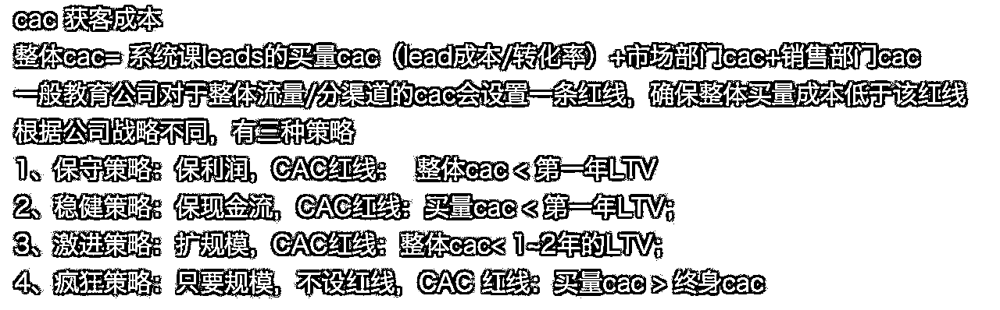

# 先胜而后战，创业先算账 —— 写给出了新手村的圈友们

> 来源：[https://wi1v74w740.feishu.cn/docx/O3Exd5gUJoKOqWxuc1Lc6vO5nPh](https://wi1v74w740.feishu.cn/docx/O3Exd5gUJoKOqWxuc1Lc6vO5nPh)

## 一、为什么要算账？——“多算胜，少算不胜”

分享之前，再啰嗦两句，为什么要算账？尤其是在没有做项目之前，就要把账算清楚再干。这里涉及到大家认知的一个切换。

《孙子兵法》里面讲了很多战术上的东西，但在开篇《计篇》里面非常旗帜鲜明地说了 “夫未战而庙算胜者，得算多也；未战而庙算不胜者，得算少也。多算胜，少算不胜，而况于无算乎！”这段话非常直白，会算的，打赢 不会算的—— 在战争开始之前，通过充分的庙堂推演计算，就已经能预知胜负了。所以战胜国常常是战争前算好了会赢，才发动战争，而不是靠打着打着打赢的。

做项目也是同理。真正的高手，在决定投入一个项目之前，就已经通过充分的调研和大致的计算，八九不离十地知道这个项目能否成功，大概能赚多少钱，可能亏多少。他们是算好了能赢才去做，动手之后只是把计算的结果实现出来而已。而新手常常相反，做之前没有充分论证，靠自己肉搏，花了很多时间去跑一个项目，最终用自己的血泪教训，摸到了很多项目的数据，然后失败了，而这些数据就成为了高手调研数据时的重要参考来源。这种情况在生财是屡见不鲜的 ，大家应该也有一些体感。所以《孙子兵法》后面又说了 “胜兵先胜而后战，败兵先战而后求胜”，高手就是“胜兵”，追求先胜后战，算清了才出手，新手就是“败兵”，不是说一定会失败，而是胜利的结局是靠博概率的，不管不顾先做了，然后去“求胜”，大概率是求不来的，所以这也是本文标题的来源，只要你会算账，算好账，那你就有机会做到先胜而后战，提高你做项目的成功率，慢慢变成高手。

## 二、认知切换 —— 先干再说 VS 多看少动

前面提到这篇文章讲的东西涉及到大家认知的一个切换，为什么呢？因为大家在生财听多了“干就完了，想都是问题，干才有答案”，“躬身入局，把手弄脏”，这两者是不是有矛盾呢？

这里特别说明一下，这篇文章是写给出了新手村的圈友的。在我的定义下，是指这样的人：已经成功跑通过项目的0-1，赚过1万块钱，执行力完全不是问题，下一个目标是年赚百万。我非常粗糙地把大家赚钱的阶段分成 3 个阶段，这篇文章特指针对第二阶段的人。

1.  新手阶段：指还没从工资之外赚到过第一万块钱的圈友，大多数还处在副业探索阶段。这个阶段我的建议是少想多做，先干起来，把手弄脏。这个阶段的圈友，对于项目没有真实体感，对于产品流量转化的闭环也没有完整的感知，甚至对于项目有很多不切实际的幻想，对于自己的执行力也没有证明过，很多人可能“晚上想想千条路，早上醒来走老路”，一个有完整sop非常确定性的项目都不一定能跑通，更别提去选出好项目了，所以干起来是第一位的，先让自己去接触真实的市场，去赚到第一万块钱。我自己也经历过这个阶段，在21年做了一个批发市场水果团购的项目，感兴趣的可以看这个帖子 https://t.zsxq.com/wZaRb，虽然我最终放弃了这个项目，但它对我的意义非凡。

1.  出了新手村（熟手阶段）：指已经具备跑通项目0-1的能力的圈友，下一个目标是年赚百万。这个阶段我的建议就是多看少动，选好项目，先胜后战。到这个阶段，就要切换认知了。由于在新手阶段，你是通过“先干再说”拿到了正反馈，所以你很容易沿用之前的做事习惯，就是干了再说，一个项目不行，我换一个项目继续干，希望能碰到一个好项目。联合办公空间就有很多这样的人。事实上，好项目不是干出来的，是选出来的。很多个体之所以还有赚钱的机会，是因为这些机会 高手看不上，所以个体才能靠它赚钱先起盘。等你自己能力上来了，你就要慢慢切换去做一些更好的项目。而这就要求你有选项目的能力。在这个阶段，你自己的执行力已经不用证明了，反而要抑制住自己做事的冲动，多看少动。这里的“多看”指的是花更多时间去研究项目，调研市场，提高自己的项目判断能力。“少动”则是指不要盲目开新项目，要提高自己的出手胜率，避免在低效试错中浪费宝贵的时间和资源。

1.  高手阶段：指已经有了自己基本盘，从稳定年赚百万，再去追求千万规模的圈友。这个阶段大家常提的就是组织能力、战略、找人 这些词了。 能到这个阶段的人，算账早已内化成了基本功，和这个阶段的人交流，你会发现他们一上来就问各种数据，先把账算清，才看要不要继续投入更多精力去判断，比如这个业务能不能发挥我的组织优势，能不能沉淀下什么能力，是趋势向上的还是趋势向下的。我自己也还不能称为高手，就不班门弄斧了。

## 三、算账前先调研 —— “调查就是解决问题”

前面已经把算账的重要性和大家说了，这个时候问题来了，算账，得有数据才能算啊，如果我不去做项目，数据从哪来，靠瞎猜吗。答案是 调研，充分地调研。很多人对调研有误解，以为 看个精华帖，然后去小红书/抖音 搜索下项目关键词，最多看一下同行怎么干的，就是调研了，然后就凭着 “我觉得这个项目空间大” “我感觉这个项目好” 这样的判断，就开干了。大错特错！你在调研时省下的每一分钟，在做项目时都会十倍百倍地偿还回来。《毛选》里说：“调查就像十月怀胎，解决问题就像一朝分娩，调查就是解决问题。” 前期充分的调研，有时候能直接帮你pass掉一个“不该做”的项目，省下你好几个月的试错时间，同时如果你决定去做这个项目，在碰到一些难题的时候，你对此是有充分的心理预期的，不会轻易放弃。对于出了新手村的熟手来说，我觉得「调研项目的时间」和「做项目的时间」甚至可以五五开。那怎么去做调研呢？

### 做好调研 —— 公开信息建立框架，私密信息仔细算账

首先大原则是 默认公开信息都是错的，多去寻找私密信息，市面上所有的公开信息，默认都可能存在一定程度的误导性，它们更多是帮你建立对一个项目的初步框架。真正有价值的决策，需要基于你能获取到的私密信息（如和同行交流得到的数据）进行仔细算账，并且这些数据一定要经过交叉验证其真实性。

1.  研究至少10个对标，装作客户走完流程

这是最基本最简单的调研方法。找到你的对标，加入他们的私域，以一个真实客户的身份完整体验他们的产品购买和转化流程。这里至少要深度观察10个以上同行的话术、流程、朋友圈动态、转化策略和客户反馈。我们以前做教培行业的时候，跟进竞品sop，经常是一个部门几个人，每个人扮作不同身份的家长，拿着不同的需求，有不同的行为习惯，对于产品有不同的异议，去测试对方销售的不同话术怎么应对，都快搞成角色扮演了。联合办公有个圈友之前不做调研，听完分享后找了个号去调研自己的客户，发现自己卖给客户的100块的服务，对方直接以300块卖给其他人，不查不知道，一查吓一跳，原来自己的定价这么偏低。很多营销咨询公司，强调“一线有神明”也是一样的道理，到一线去，大量地去接触真实的客户和竞品。

1.  付费咨询获取核心信息

要有“信息本身就是要钱的”这个认知。市面上有一些咨询公司，专门帮公司去打探竞品信息的，经常以一对一访谈的形式约对方公司的中高层人员，一个小时几千块，就是为了获取一些具体的数据（当然，不接受这种访谈，在任何公司都是红线行为）。同理，如果你想做一个项目，而恰巧你又找到了这个项目的一些从业者，花一点小钱（相比你付出的时间精力），获得这个项目一些非常真实的数据（比如转化率、复购率）是很值得的。在生财就更容易了，找到做这个项目的圈友，付一点咨询费、或者发个红包，就能让你拿到帮助判断这个项目的很多有价值信息。

1.  巧用招聘“套取”信息

对于有团队的伙伴，这个方法值得一试。如果你想了解一个新行业，可以直接发布一个招聘岗位，标高一点的title和薪资，然后尽可能吸引对标公司的一些中层员工过来面试。一般你聊几个公司的十来个人，对这个行业的一些数据就非常清楚了。尤其地，如果你想获取一些销售链路上的数据，发布个销售岗，然后聊几个销售，对于对标公司的一些sku设计、客单价、转化率、提点这些数据就一清二楚了。当然了，如果你是个体，那这个方法不太适用，不过你可以反过来，去一些对标公司的项目去应聘，也能拿到一些信息。

1.  快速MVP验证，先卖再干

最后的大招，如果通过上面这些方法仍然没办法判断项目要不要干，那就应该快速制作一个最小可行产品（MVP）进行市场验证。记住一个核心原则：所有产品一定是先卖再干，验证能卖出去再投入资源开发，不要盲干！ 如果MVP验证下来，发现这是个好业务，那恭喜你；如果跑不通，你也能在极低的成本下快速放弃，这远比你投入大量时间精力后再发现方向错误要明智得多。如果一个事情注定要失败，那就让它快速失败。比如，所有的知识付费项目第一个动作都应该是 卖海报，来验证这个产品的需求，而不是反过来，做好产品了再开卖。这里举两个案例。

### 案例一：包子老师的“AI+IP提效线下课”

在3.30号的航海家AI大会上，包子老师作为高报头部IP，分享了自己用AI一个人完成调研、文案、拍摄、剪辑、直播、产品、交付等等一个IP需要几个人团队才能完成的工作量，现场有不少人对于包子老师的这套AI工作方法感兴趣，而恰巧我们之前就在关注AI能实际落地的一些场景，包子这套“AI赋能IP”很契合我们看到的机会点。不过，我们也没办法100%知道，大家对于AI落地的线下课是感兴趣的。所以现场亦仁老师拍板说，我们借这个机会做一次预售，大家交500元定金，我们就和包子老师一起开发这套“AI+IP提效”的线下课，只有大家真正交钱了，才能验证这是个真需求。就这样，我们现场做了包子老师线下课的预售，反响很好，有130多位老板交了定金（感谢大家信任🙏），这才有了后面的两期包子老师的AI+IP的线下课落地，也让我们看到了 “AI落地之术” 这个方向上的一些项目机会。

### 案例二：核桃编程课程出海业务

再举个我前司的例子，“双减”之后，教育公司纷纷开始了海外业务的探索，核桃编程也开始验证自己的课程在海外能不能有市场。如果是一般的做法，那就是先花几个月，投入人力物力，把自己的课程都做了海外的适配之后再推出，不过万一在海外卖不动，这些投入的教研成本就打水漂了。所以，核桃编程做了一个很简单的MVP动作，一开始只是先把3节体验课做了海外的适配，然后开始投放买量，获得一些客户来上体验课，测试转化率，如果转化率能达到预期目标，再继续做系统课（50节课）的适配，最后测了几期，体验课转化率只有 3%，从模型上走不通，核桃就放弃了这个项目。那之前付费的用户怎么办？发通知和大家说，课程不能如期上线，安排全额退款。虽然这个项目失败了，但我认为是一次非常成功的“失败”，只花了一点点的成本，就验证了这个项目不值得做，反而节省了几百万的研发成本。

举了两个案例，作为公司，资源比个体丰富很多，都这么珍惜自己的资源和投入，在开始一个项目时做充分的MVP验证，作为资源很少的个体创业者来说，就更应该在做项目之前慎之又慎了。

## 四、算账的核心 —— 关键指标 CAC、LTV 和人效

前面花了挺长篇幅，重点强调了算账的重要性，以及算账之前的准备工作 —— 做好调研，下面就是要具体算账了，具体要算什么指标呢？在我看来，就是算清楚营收、利润空间、CAC、LTV 和人效这几个指标。

我先列举一些我认为老板需要知道的一些基本的财务指标，如果有不懂的，可以直接问 AI，AI会给出很好的解释和例子帮助你理解。

*   基础财务概念

### 算账的核心指标：营收和利润区间

*   营收，是判断项目天花板的一个非常重要的参考，拆分来看，营收🟰 客单价 × 单量，客单价越高项目越好，也就是我们说的要赚有钱人的零花钱，单量，一来和交付能力息息相关，有些项目的交付是有上限的，比如很多实体项目，承接能力是有限的，流量再多了也没用，二来和做流量的能力成正比，再拆分一下，营收🟰客单价✖️单量🟰客单价✖️线索数✖️转化率，你要去判断自己是否具备规模化获取流量的能力。很多人说自己年入百万，月入十万的时候，大家只需要简单拆分，问清楚产品客单价多少，流量来源渠道，大概推算一下每个月能获取多少流量，转化率简单按10%预估，就能够知道他是不是吹牛了。

*   高客单价远远好于低客单价。 同样的100万营收，100万=1万 ✖️ 100个 = 100元 ✖️ 1万个，卖出100个1万元客单价的产品 的难度，要远远小于卖出1万个100元客单价的产品，毕竟在流量层级上就差了两个数量级。卖出1万个产品，流量的要求是 10万量级的。而且低客单价的产品，能够给出的 CAC 也很低，很容易就亏损了。

*   利润的推算相比营收要难很多，因为成本结构相差很多，这时候大家可以按照同行业的毛利率简单预估下，比如知识付费行业的毛利一般有80%以上，而电商有 20-30%就很高了。这块如果想算清楚，拿到一些从业人员的数据很关键。

*   思考题1：生财有术的年营收有多少？ 这个问题我在联合办公空间现场互动的时候问了，出乎意料的是，没一个答对的，看来大家的算账能力还需要锻炼。你可以试试看。

*   为了能把这道题答对，首先脑子里面得有公式 营收🟰 客单价 × 单量 = sku1的客单价 ✖️单量1 + sku2 的客单价 ✖️ 单量2，其次你要去想办法收集这里面的相关数据（不同sku的客单价，单量），这就需要用到我们上面说的调研了。

### 算账的核心指标：CAC 与 LTV

*   CAC (Customer Acquisition Cost - 客户获取成本)： 获取一个付费客户所需投入的全部成本，包括买量成本、销售提成、市场活动费用等。 买量成本很容易理解，比如，你花了20元获得一条销售线索（Leads），这条线索最终转化为付费客户的转化率是10%，那么买量成本就是 20元 / 10% = 200元/客户。我们常说的 ROI，就是 产品客单价/买量成本，比如你花了200元成交了一个客户，客单价是 2000，那么 ROI 就是 10。

*   CAC不仅仅包括买量成本，还有销售成本，市场成本，完整的计算公式是：CAC 🟰 买量cac + 销售cac +市场cac 🟰 线索成本/转化率 + 销售部门成本/成交客户数 + 市场部门成本/成交客户数。销售成本和市场成本 并不低，所以大家有时候说 抖音导致很多商家的投放 ROI 趋近于1 的时候，其实公司整体是亏的，团队成本都亏进去了。

*   不同渠道的CAC 有时候会差很多，比如你从 抖音、小红书、视频号这些平台获取的线索，成本有时候会差好几倍，所以计算CAC的时候我们还会拆分成不同渠道，如果你在某一个平台比较擅长，那你在这个平台的CAC就会比较低，可以从这个平台切入进去做。

*   和CAC息息相关的另一个指标是 LTV (Lifetime Value - 客户终身价值)： 一个客户在其整个生命周期内能为企业贡献的总收入，包括首次购买、所有续费、所有增购等。 计算公式：LTV = 首次购买金额 + 历次续费收入 + 历次增购收入。

*   有复购/续费/升单 的生意远远好于 一次性买卖。一次性买卖每年都要获取新流量，而流量成本是不断上升的，越做到后面利润越薄。有复购的生意，只要做好交付，相对来说能做得更久。典型的就是生财，近悦远来，把圈友们服务好了，就能得到对应的商业价值，现在已经第九年了，依然生机勃勃。

*   思考题2：生财有术一个会员的 LTV 大概是多少？ 给大家一个计算思路 LTV 🟰 第一年会员费 ➕ 第二年会员费 ✖️续费率 ➕（第二年会员费 ✖️续费率）✖️续费率 ➕。。。（以此类推，后面每年的续费）➕ 新sku客单价✖️拓科转化率（买了新sku的会员/总会员 的比例）。能把这个数算出来的，你的算账能力已经很不错了，同时在算的过程中，你也能理解，为什么生财对会员交付这么看重，投入这么多精力。

*   CAC与LTV是很多商业决策的核心，战略上的很多动作，都是为了降低 CAC，增加 LTV。 CAC告诉你花多少钱买一个客户，LTV告诉你这个客户能为你赚多少钱。

*   只有当 LTV > CAC 时，项目才有可能盈利。

*   当 LTV远大于CAC 时，项目才有较高的盈利空间和扩张潜力。

*   LTV/CAC的比值越高，通常意味着业务越健康，或者项目正处在红利期。

*   思考题3：算一算你自己项目的 CAC 和 LTV 数据

### 算账的核心指标：人效

*   人效产出： 这是评估团队扩张和管理效率的关键指标，指每个员工平均能创造的收入或利润，大白话就是每个员工能给你赚多少钱。一个公司的平均人效很好算，就是 总营收/员工总人数。一般我们会按照部门来拆分算人效，像市场、销售团队的人效就很好算，研发、hr行政这种中台部门就难一点。

*   好在大多数圈友也不是大公司，所以能把市场、销售的人效算好，就能帮助做很多决策。比如，一个销售每月能卖出20单，客单价5000元，那他的人效就是10万元。在这种人效下，你完全可以花 1万的成本去招到市面上很好的销售，进行团队扩张。相反地，很多项目之所以采用阿米巴的方式，其实是因为人效不足以支撑招聘直营团队，比如虚拟资料项目，每天从小红书引流100人，转化率 20%，客单价 19.9元，一天的产值 400元，一个月的人效 1万出头，这种就很难去雇人来放大业务。

*   所以要不要招人，花多少成本招什么样的人，和业务的人效是息息相关的。

## 五、如何基于算账做决策

好了，枯燥的财务小课堂结束，对于算账来说，知道多少财务指标并不关键，最核心的是，我怎么基于这些拿到的数据做决策。如果你算清楚了 客单价、利润空间、CAC、LTV，人效，很多决策难题（比如要不要买量、要不要招人扩张）真的迎刃而解。

### 5.1、极限思维：一个项目赚钱的上限、下限

对于选择项目来说，项目天花板可以说是最重要的一个维度，所以需要用上面的营收公式，提前预估项目的营收情况。那么怎么测算项目天花板呢？我一般习惯用极限思维去思考。一种是极限好的情况，假设上帝在帮你，天时地利人和，这个项目最多能赚多少钱？ 客单价能卖多少，再给一个很乐观的单量数 看看总共赚多少；一种是极限差的情况，喝水都塞牙缝，流量进不来，销售转不动，交付各种问题，这种情况下项目会亏多少。

在这种推演下，你就会发现有四种不同情况的项目。

*   情况1、上限高，下限也高（好项目）： 做得好能赚很多，天花板很高，初始投入低，亏损风险也小。比如 海外AI产品 属于这种，上限很高，只要你搞来源源不断的流量，那么营收无限高，所以在这个领域，一个人月入几十万美金的案例比比皆是，下限也很高，不会亏，顶多亏自己的时间成本。知识付费产品某种程度上也属于这种，做好一套课程后，剩下的就是买量，不断地卖。

*   情况2、上限低，下限也低（差项目）： 天花板不高，总共能赚多少钱被锁死了，赚钱有限；但投入大，亏损还亏不少。有人说，这种项目会有人做吗？付出收益这么不对等的项目 。别说，生财的圈友不会做，但很多人没有那么多赚钱信息，只能去做这种项目。典型的就是很多实体项目，比如 开餐饮单店。一家单店能赚多少钱是被座位数锁死了，如果亏的话，租金、装修、人工 算下来几十万打水漂了。

*   上限高，下限低（高风险项目）： 可能大赚，也可能血本无归。如大型风险投资、高度创新的前沿领域，需要极强的风险承受能力。这种项目一般和圈友们无关。

*   上限低，下限高（练手项目）： 赚钱天花板不高，但亏损也相对可控。如一些门槛较低的套利项目（搬运混剪、IP切片），或高度依赖创始人时间的个人咨询服务，这种项目生财的精华帖里很多，项目方因为项目的上限不高，人效不高，需要阿米巴扩张，所以需要招更多的人一起搞。

*   当然了，很多圈友的情况，如果一上来要做一个上限很高的项目，也是不现实的，毕竟这种好项目，竞争对手也强，所以我建议在挑项目的时候，可以先从“上限低、下限高”的项目入手，先锻炼自己的能力，搭好盘子，然后切换到“上限高、下限也高”的项目。当你在做项目之前，算好一个项目的变现上限的时候，你就会带着合理的预期，踏实的心态 去做这个项目了，而不是中途一旦碰到一点点问题，就嫌弃这个项目这不好那不好，然后随意切换了。

### 5.2、自然流量（免费流量）和付费流量怎么选

新手一般做自然流量的能力都很强，不然也不会跑通项目了，到了某一个阶段后，一定要积极地拥抱付费流量。从CAC的角度来看，就很容易理解这个逻辑了。

首先，我这里特意把免费流量这几个词给划掉了，就是为了强调，没有免费流量，即使是自然流量，也是要钱的，首先，你为了获取自然流量，需要投入 设备、人力这些成本，你可以把自己用来搞流量的人力折算一下，比如一个月5000元，然后看看一个月搞来多少条自然流线索，比如 500条线索，那你的线索成本是 10元一条，而不是 0，你可以小规模去试一试投放，也许投放成本还不到10元一条。

其次，上面 CAC 的公式 CAC = 获客总成本 ÷ 成交客户数 🟰 买量cac + 销售cac +市场cac 🟰 线索成本/转化率 + 销售部门成本/成交客户数 + 市场部门成本/成交客户数。CAC 包含了销售CAC和市场CAC，当你开始有团队后，你的私域/销售团队是要不断吃线索的，如果线索供应不够，那相当于销售的人效就被浪费了，这个时候虽然你不买量，买量cac是低的，但是销售cac会被抬高，总的cac不一定就更低。所以项目做大的尽头，一定会做付费流量，那还不如早点做。

所以，当你的项目跑通之后，一定要积极地去尝试付费流量，看看投流成本是多少。付费流量相比自然流，好处太多了，更稳定，可控，量还大。理论上，只要ROI为正，想要多少流量就能买到多少流量。 另外，付费流量和平台商业化方向一致，随着平台商业化，付费流量比重增加，自然流量减少，除非你内容能一直做得很好，不然流量肯定越来越少。

当然这里的付费流量，不一定就是从平台买流量，也可以从合作伙伴那里买流量。听完我的分享后，我们联合办公有一个项目，立马转变了思路，以前他自己做流量，招兼职的大学生去推广，想尽办法让大家去裂变，流量一直不多，后来他直接和有现成大学生私域的团队去合作，从这个团队里导流量，按照成交结算，成本也很低，相比自己做，不仅省力而且量大。

### 5.3、怎么知道自己的项目是不是在红利期？

想知道自己的项目是不是红利期，我一般通过一个很简单的指标来判断，就是 CAC 占 第一年的LTV 的比重。我之前写文章提到，很多人自己的项目是 手握金矿不自知，从算账角度来说好的不得了，但却被一堆杂事牵着，没有充分抓住红利期。

我自己之前经历过在线教育的完整阶段，所以对这方面感知很深。在 2018-2019年的时候，获客成本很低，客单价两三千的产品，获客成本只要几百块钱，那会来一单赚一单，每个月就是投放、扩张；然后流量成本逐步抬升，到了 2021年最疯狂的时候，那会抖音上一个9.9的小课包，线索成本500元，转化率10%，相当于CAC 就达到了 5000元！！！，流量成本相比两三年前，抬升了 10倍。然后“双减”之后，资本撤退，流量成本有所降低，到现在稳定在 CAC 和第一年的LTV 持平，CAC/ 第一年LTV 比值是 100%，也就是教培公司把第一年的营收全部拿来买量，赚后续复购的钱，不过这种玩法只有大公司才能承受了。所以，大家把 CAC/第一年LTV 简单除一下，看看占比多少。

*   CAC/首年LTV <20% (极佳)： 绝佳的红利期！应该全力扩大投放，快速抢占市场。很多人在这种情况下依然保守，白白错失扩张良机。记住：当你发现金矿时，应该带着挖掘机而不是小铲子去。

*   20%-35% (健康)： 持续加大买量的力度，找平台买，找合作伙伴买。当获客成本占比在35%以下时，甚至可以容忍一定的投放浪费，核心目标是快速扩大规模，而不是极致的“精细化运营”。

*   35%-50% (合理)： 正常投放，密切关注ROI变化，优化投放效率。

*   50%-70% (临界)： 需要高度关注优化，想办法降低获客成本，或提升LTV。

*   >70% (不健康)： 基本是在给平台打工，需要重新评估商业模式或获客策略。除非你有复购，否则基本没有利润了。

### 5.4、什么情况下要通投拉满 ？

上面那个问题如果能理解，那这个问题也很好决策了。除了看 CAC和LTV 的比值，还看当前阶段的选择，是要规模还是要利润。这两者结合来综合决策。由于我对教培公司比较熟悉，这里以教培的决策逻辑来举例。

*   前面提到，教培公司现在稳定在 买量cac=第一年LTV 的水平，这个时候公司是亏损的，会亏掉团队成本，然后通过复购的钱赚回来。如果这个时候公司决定要更多的利润，那我们就会降低 CAC，要求 整体CAC要小于 第一年的LTV，让第一年不亏损，不过这时候能买量的钱变少了，规模就会下降一些；如果这个时候公司要扩张扩规模，那第一年就可以接受更多的亏损，我们就可以提升 CAC，比如整体CAC只要小于2年的LTV就行，前面两年亏损换规模，第三年赚复购的钱。

*   所以有两种情况可以通投拉满，一种就是项目红利期，CAC/LTV 的比值很健康的时候，要抓住红利期；第二种就是随着CAC 逐步抬升，公司的CAC/LTV 来到了稳定的比值，公司决定要继续扩张做规模的时候，也可以承担一些短期亏损，当然现在越来越多的公司不求规模了，踏踏实实做利润。

### 5.5、怎么提高 LTV ？

前面提到 CAC/LTV 是算账很重要的参考，为了降低这个比值，除了降低CAC之外，还可以提高LTV。当你的LTV越高，CAC/LTV 的比值越健康，你就能够拿出更多的钱来买量。

提升LTV，主要有以下四种方式：

1、提价： 这是最直接也常被忽视的方法。提价增加的部分，几乎全部会转化为你的净利润。如果原产品成本300元，售价500元，毛利200元；提价到700元后，毛利直接变成400元，翻了一倍！ 其实提价之后，转化率不一定会降低很低，但提价的部分，都会变成净利润。利润越高，就可以拿出更多钱来做好交付，或者拿出更多的钱去买量，形成良性循环，所以当你产品价值够的时候，要大胆提价。

对于提价，这里举一个非常真实且反直觉的案例，这个教训值几千万。

案例三：我一开始在核桃编程，后来去了火花编程，火花编程做出了和核桃差不多品质的产品，然后核桃编程的定价是 2499元，火花编程的定价是 999元，希望通过优质低价的极高性价比的产品打穿市场。大家觉得，哪个定价的产品会胜出呢？大家可以花几秒钟思考一下。

结论是：999元的火花编程的产品，根本影响不到 2499元的核桃编程的产品。除了让自己产品没有利润，产生极大亏损之外，这个产品在市面上没有什么影响力。为什么呢？

核心原因是，你以为消费者是在 2499元的产品A 和 999元的 品质差不多的产品B之间对比，那明眼人都会选择 产品B，而残酷的事实是，消费者根本看不见 999元的产品，消费者只能看到 2499元的产品A。因为 2499元能拿出更多的钱来买量，所以市面上几乎所有的教育kol，推广的都是核桃编程（佣金可以拿2000元一单），而如果999元的产品要占领这些渠道，就会巨亏，所以火花编程的产品只有在自己的家长私域池里面触达到了几十万的家长，而其他的潜在客户，火花编程根本没有机会把自己曝光在他们面前。听上去很残酷吧，这就是真实的商业。所以最终火花编程花了2年的时间，把自己的产品一步步地从 999元涨价到了 2999元（比核桃还贵了），但最佳的扩张时机已经错过了。

举这个案例，核心是让大家有感知，当你的产品LTV很低的时候，你能够承受的CAC就很低，就很难去做买量的动作，所以低价竞争到最后，只是卷死自己而已，大家应该想办法的是，我怎么不断提高产品价值，不断地提价，这才能进入良性循环。

2、续费： 能续费就做续费，不要做一次性买断的生意，这样客户第二年，第三年，还能不断给你贡献LTV。这个很好理解。当你有续费的时候，对于流量焦虑就会减少很多。对于客户那端也是双赢，当有续费的时候，你为了让他续费，就会把自己的服务做好，客户也有了更好的体验。

3、转介绍： 激励现有满意客户为你带来新客户，这是成本极低且转化率通常较高的获客方式。成功转介绍系统的前提是：

*   优质的产品/服务体验： 这是客户愿意主动分享的基础。

*   合理的奖励机制： 有足够的动力激发客户的分享意愿。

*   简单的分享流程： 降低推荐门槛，让分享更容易发生。

转介绍能增加一定的LTV，不过转介绍是很慢的一个渠道，同时要做到让客户愿意转介绍的程度也很难，所以转介绍对于增加LTV的幅度不会很高。

4、拓展SKU（产品线）： 向同一批已经建立信任的客户销售更多不同类型但相关的产品或服务。简单来说，就是给同一批客户卖出更多的产品，可以是升单，也可以是同一类人群需要的另一种产品。这个相信大家见过很多了，比如几十/几百块的体验产品，升单到几千块的社群产品；几千块的线下课，升单到 几万元的陪跑；或者 今天卖你一个“抖音红利项目”，明天卖你另一个“小红书红利项目”，这些动作从商业上来说都是为了增加LTV。当然了，为了达到能拓SKU的程度，基本上你得有自己的私域池，也得具备一定的个人IP，这样你才能反复触达到你的客户，大家也才愿意跟着你买一个个产品，不然转化率就会很低。

案例四：在提升LTV这方面，生财就做得很好，几个动作都融入进来了。1、会员价格逐年适度上涨（提价），从2465到2765到3365，以后肯定也越来越贵；2、续费做得很好，65%以上的续费率；3、由于产品做得好，会员之间的转介绍也很多，成本也不高（25%的佣金）；4、也有一些拓展的产品，比如针对高阶会员的航海家、聚焦垂直领域的YouTube深海圈，海外AI产品深海圈等等。

### 5.6、什么情况下要搭团队 ？各部门的成本占比？

在项目放大的时候，团队杠杆是非常重要的一个杠杆，如果你无法组团队，那这个项目顶多做成夫妻店，几乎不可能做大了。衡量能不能组团队的核心指标，就是人效，所以在调研一个项目的时候，就要把人效大概算出来，知道0-1跑通后，能不能通过组建团队，把任务进行分工，组建流量、销售、交付部门，进一步放大项目。在我和很多个体创业者沟通的时候，大家不组团队的原因，一方面是算不清账，项目人效低，有可能招人来做就亏了，另外一方面是项目本身人效没问题，但自己经验不多，不会管人，不知道组完团队之后怎么管理怎么分钱，心里有恐惧，对于这种情况，我只能说，团队管理是创业里面非常重要的一块拼图，这里是会踩很多坑，但是如果你不迈出这一步，那你永远也学不会。只要你招够10个人，再开掉10个人，自然就会管人了。

这里也给大家一个各部门占比的一个参考标准，让你能基于这个去算自己的人效能不能支撑扩团队。

部门成本占比的健康参考标准（占营收比例）：

*   交付部门： 一般不超过20%（负责产品/服务的实际交付）。我们假设有个课一年卖5000元，一个助教一个月能服务 100个客户，那么他的人效就是 5000/12 ✖️100🟰 4.2万左右，那就可以拿出 4.2w✖️ 20%🟰 8400 元的月薪去招聘这个助教。

*   销售部门： 成本一般不超过10%，产品客单价越高，产值越高的情况下，这个占比还会下降。比如一个产品客单价5000元，销售一个月可以卖出 20单，那么他的人效就是 10万，10%就可以拿出1万元的月薪去招聘销售，这个在一些二三线城市可以招到很好的销售了。如果产值提升到 20万一个月，同样的 1万元月薪的销售，他的成本占比就降低到 5%了。

*   流量/市场部门： 波动较大，通常在20%-50%左右，流量成本基本是每个公司最大的成本了，流量成本决定了你的利润空间，如果你流量成本控制在 20%，那去掉销售、交付成本，还有50%的利润空间，如果流量成本占了50%，那就剩20%的利润空间了，基本就是给平台打工。

*   管理成本（行政、财务、人力等）： 尽量控制在10%以内，每个行业都不一样。

## 写在最后

这篇文章看上去挺枯燥的，全篇文章就是在 算账，各种数字，看得人头大。线下分享完之后，我问联合办公的一些圈友，听完之后感觉怎么样，他们的反馈是“很干货”、“很系统”、“之前在很多地方的文章里看到，做项目要先算账，但都没写怎么算账，搜索生财也没看到什么内容，这次是第一次知道要算哪些账，怎么算”，听到这样的反馈很开心，希望你看完这篇文章之后也有一样的感觉，或者在你脑海里能留下一点钩子，当你下次选项目做项目的时候，不要只凭感觉去判断，而是扎扎实实地去做调研，拿到一些真实的数据，然后算好营收、利润、大概的CAC、LTV，算清人效，能不能够去组团队，然后再做决定，要不要做这个项目。

最后呼应一下标题，希望大家都能按照一定的方法论去创业，追求胜兵先胜后战，不做炮灰。

如果你在项目选择、团队搭建、业务放大等方面有具体的困惑，也欢迎和我交流。

关于我个人（20250612 更新）

之前：

深耕少儿编程教育8年，深度参与了两家创业公司的 0-1，熟悉教培的流量销转模型

现在：

生财的投资孵化业务负责人，包含高阶航海合作、生财联合办公空间、SCAI实验室

其他精华文章：

借鉴在线教育公司的扩张路径和组织模式，做一个生财商学院，会是个 10X战略吗？

摆脱小作坊状态，核桃编程从月营收50万到1000万的几点启发

怎么从零搭建和管理一个“正规军”的销售团队