# 10分钟搞定！教你用coze快速搭建数字人智能体

> 来源：[https://ix88cm00jst.feishu.cn/docx/ODdidJvYToObdLx5uoKcExUynmG](https://ix88cm00jst.feishu.cn/docx/ODdidJvYToObdLx5uoKcExUynmG)

# 🚀10分钟搞定｜教你用 Coze 快速搭建数字人智能体

🌟 适合零基础、想实操落地的星球成员

🎯 项目目标：输入文案 → 输出视频 → 可复制卖服务/卖教程

💰 可变现方向：短视频起号、定制服务、SOP训练营、卖社群

* * *

# 一、这个智能体能做什么？

你输入一句口播文案，Coze 就能帮你：

*   获取多个数字人可选角色

*   自动提交合成任务

*   循环查询进度

*   最终返回一个高清视频链接

适合场景：

*   短视频快速起号（不露脸、不配音）

*   商家宣传视频生成

*   教育口播讲解类视频

*   情感陪伴类虚拟人设

* * *

# 二、变现玩法拆解

* * *

# 三、 全流程实操步骤精华版

# 下面我教大家10分钟用coze搭建一个数字人智能体

## 📲 如何开始使用 Coze？

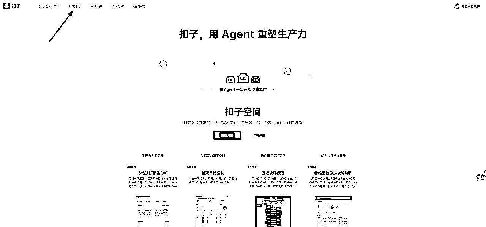

1.  打开官网：www.coze.cn 点击开发平台

1.  用手机号或抖音账号注册登录

1.  登录后进入主界面，左侧菜单包括：

*   首页：查看项目概况

*   工作空间：创建/管理你的智能体

*   模板中心：官方&用户共享项目参考

*   商店：发现好用的智能体工具

*   扣子 API：可对接到其他平台或系统

* * *

## 🧩 工作流是什么？为什么它很重要？

举个例子——做饭是不是要先洗菜、再切菜、再炒？

工作流就是帮 AI 把复杂的任务，拆成一个个小动作，然后按顺序自动完成。

在 Coze 中，每一个工作流都可以让你的 AI 做出“连贯性决策”，比如：

用户提问 → 先查资料 → 然后总结 → 最后生成图文回复

你不需要写代码，只要拉一拉、点一点击，就能搭出自己的智能体。

* * *

# 数字人搭建视频教程有字幕：

# 数字人搭建图文教程：

# 四、创建工作流

## 整体工作流流程

1.  输入口播文案

1.  获取数字人列表

1.  从数字人列表中获取10个选项

1.  用户选择单个数字人

1.  输出这个数字人的所有信息

1.  提交合成数字人任务

1.  循环获取数字人视频生成进度

1.  输出数字人视频链接

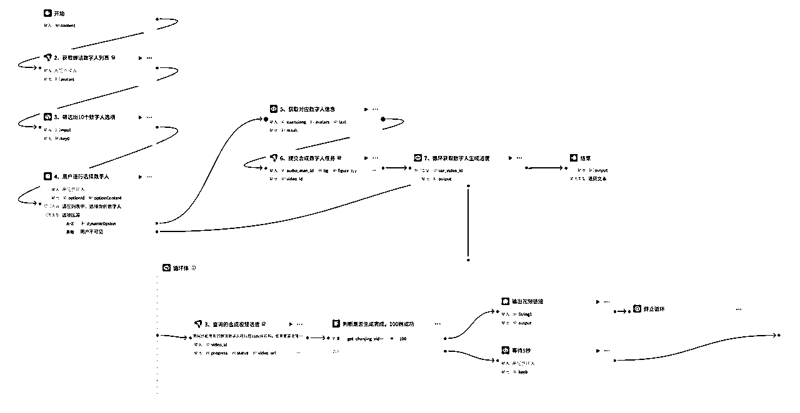

* * *

## 首先新建一个工作流。

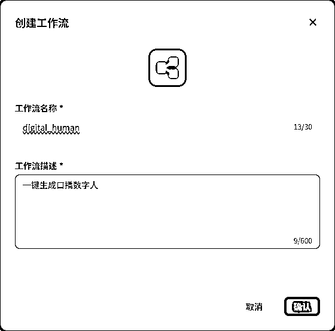

## 前期准备——蝉镜数字人插件

插件商店搜索蝉镜→选择以下红框的三个工具

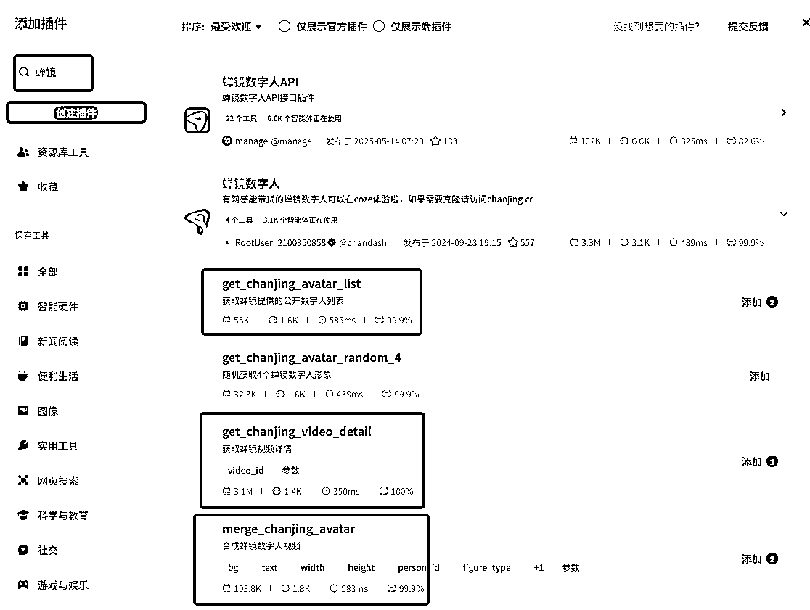

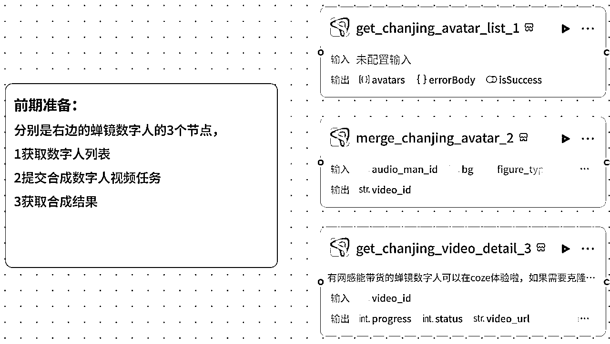

* * *

正式开始：

## 开始节点

开始节点设置一个变量，用来输入数字人的口播文案。

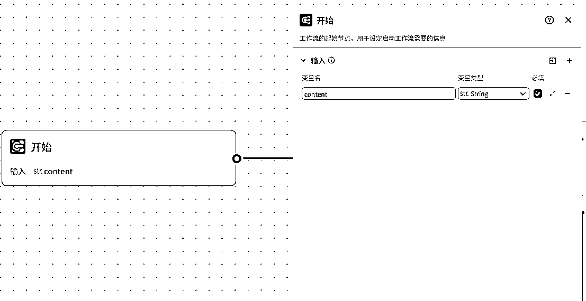

## 数字人节点1——获取数字人列表节点

直接运行就会获取142个数字人信息

结果：142个数字人

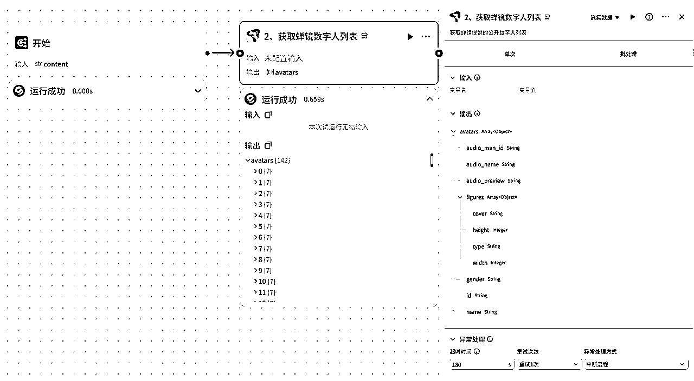

* * *

## 代码节点——筛选出10个数字人选项

提供给用户进行选择使用，可自定义调整

结果：10个数字人选项


代码内容（Python）：

```
async def main(args: Args) -> Output:
    data = args.params["input"]
    # 构建输出对象
    # result = [{"name": item["name"], "audio_name": item["audio_name"], "gender": item["gender"]} for item in data]
    result = [f'{item["name"]}, {item["audio_name"]}, {item["gender"]}' for item in data[:10]]

    ret: Output = {
        "key0": result
    }
    return ret
```

* * *

## 问答节点——用户根据提供的选项选择数字人

此问答节点，提供了上一节点输出的10个选项，需要用户手动选择其中一个

结果：单个数字人选项

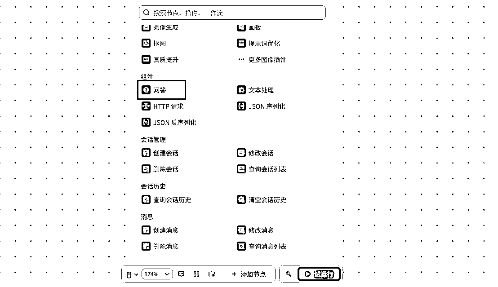

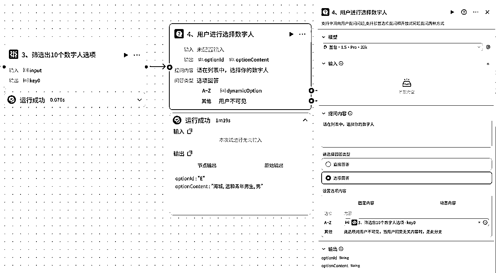

输出结果：

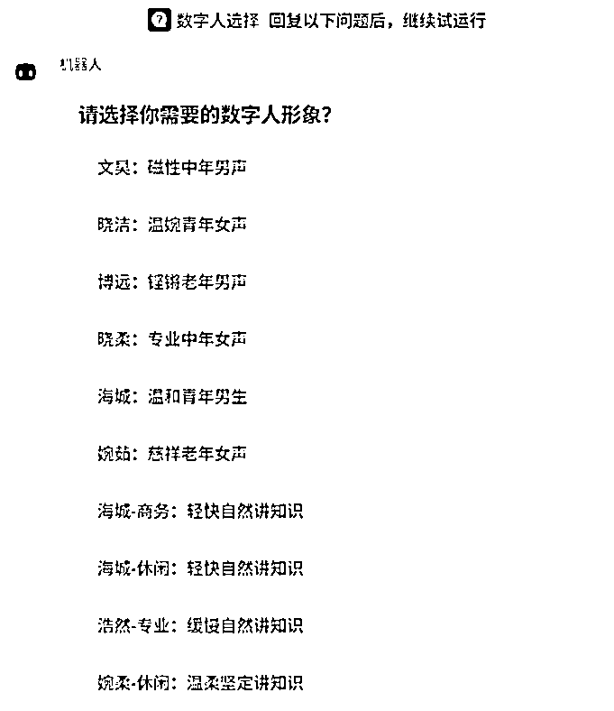

* * *

## 代码节点——获取用户选择的数字人信息

获取根据用户在上一个问答节点中选择的数字人的具体信息

结果：单个数字人全部信息

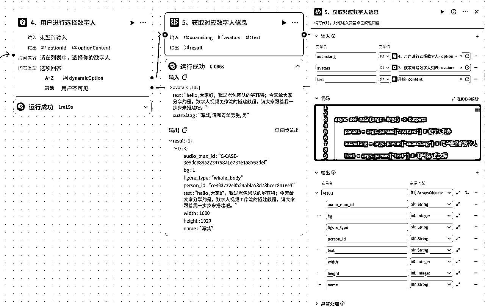

代码内容（Python）：

```
async def main(args: Args) -> Output:

    params = args.params["avatars"] # 数字人列表

    xuanxiang = args.params["xuanxiang"] # 用户选择的数字人

    text = args.params["text"] # 用户输入的文案

    optionName  = xuanxiang.split(',')[0].strip() # 提取出选项中的数字人名称 （浩然-专业, 缓慢自然讲知识, 男）

    formatted_results = [] # 创建一个空列表，用于存储格式化后的结果

    # 遍历 params 列表
    for i, item in enumerate(params):
        # 检查当前 item项目 中是否存在 "name" 是否等于 optionName
        if item.get("name") == optionName:

            # 构建一个结构化字典，进行赋值
            result_item = {

                "audio_man_id": item.get("audio_man_id"),
                "bg": 1,
                "figure_type": item.get("figures")[0]["type"] ,
                "person_id": item.get("id"),
                "text": text, 
                "width": 1080,
                "height": 1920,
                "name": item.get("name")
            }
            # 将构建好的结构化字典添加到结果列表中
            formatted_results.append(result_item)

    ret: Output = {

        "result": formatted_results # 将格式化后的结果列表赋值给 "result" 键
    }

    return ret
```

* * *

## 数字人节点2——提交合成数字人任务

代码节点用来组装接下来的「合成数字人」节点需要的数据格式。

结果：数字人合成任务id

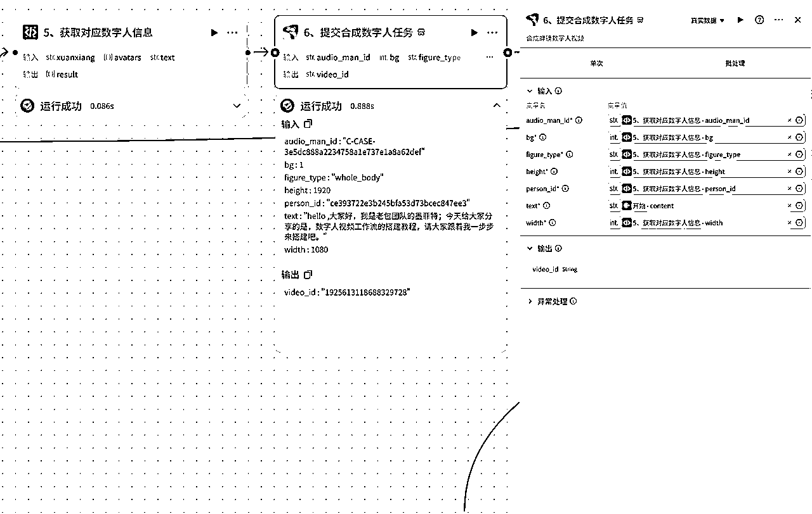

* * *

## 循环节点——获取数字人生成进度

📢 注意，这个循环节点是为了获取这个数字人合成的任务进度，直到有视频链接后，即刻停止循环

结果： 视频链接

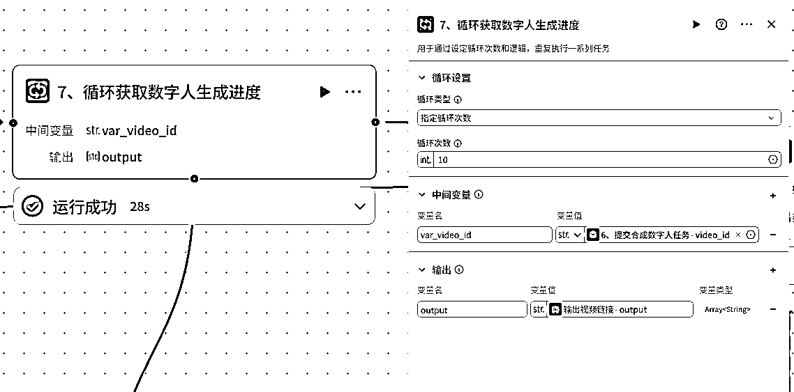

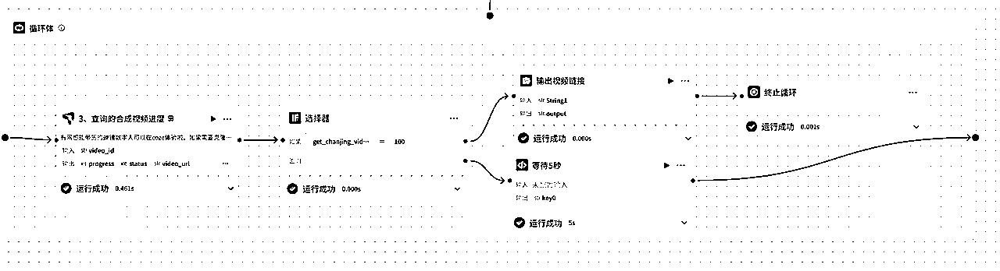

注: 循环类型是指定循环次数 10次，可以自定义调整。

* * *

### 数字人节点——查询的合成视频进度

此节点根据数字人合成任务id进行查询视频的合成进度

输出进度百分比

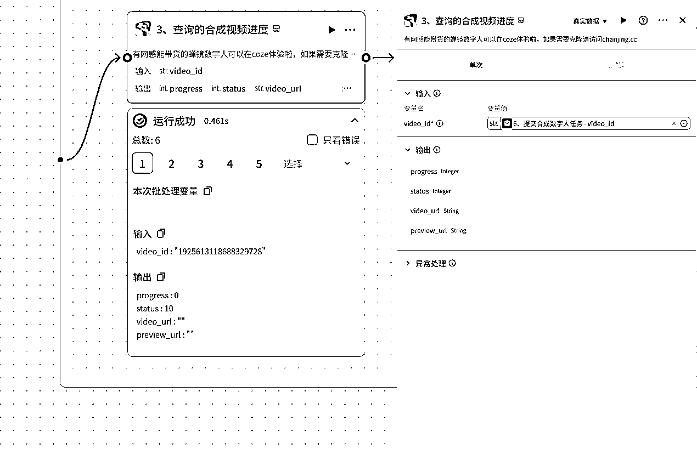

注：这个输出结果的progress是视频生成进度，100就是生成完成

* * *

### IF节点——判断是否生成视频成功

根据progress==100 为判断标准

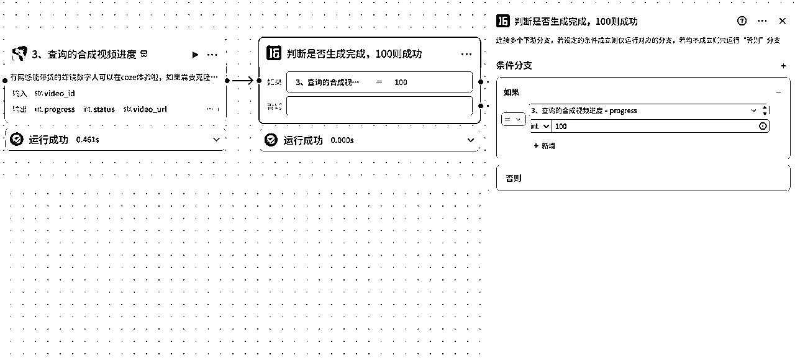

* * *

### 7.2.1 文本处理节点&终止循环节点——输出视频链接并终止循环

当progress进度是100，则输出视频链接，然后进入终止循环节点

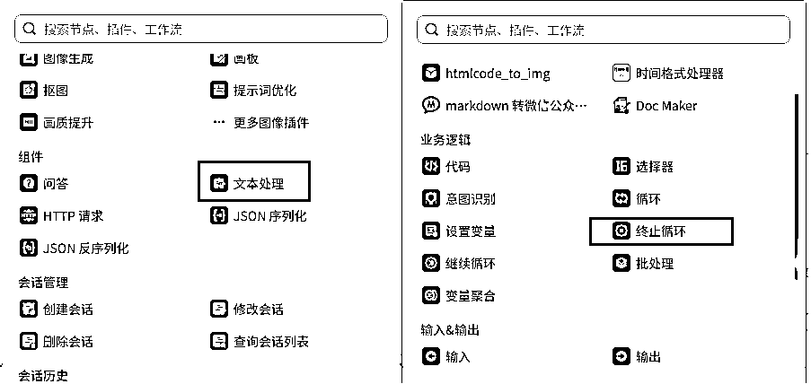

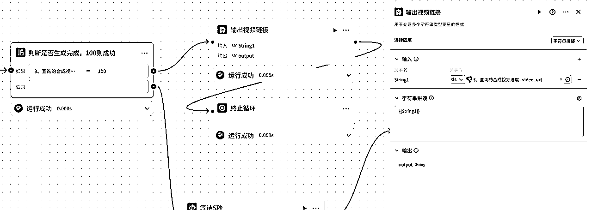

输出结果

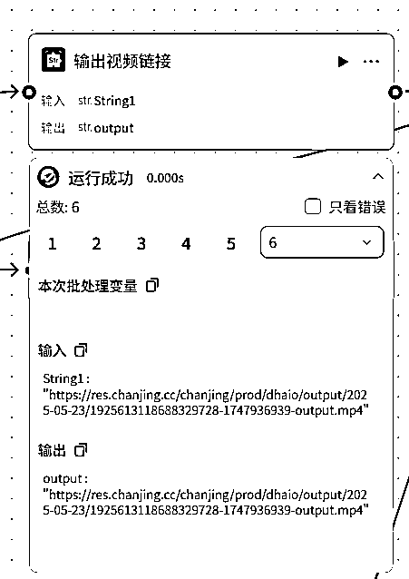

* * *

### 7.2.2 代码节点——进行等待5秒

因为循环是很快执行的，如果不等待，一下子就循环结束了，所以我们加了个代码节点进行等待5秒，每5秒进行一个循环，执行查询合成视频进度

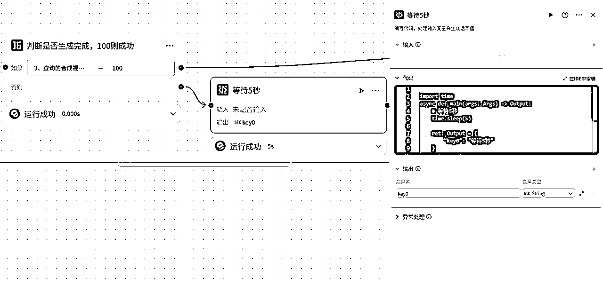

代码内容（Python）：

```
import time
async def main(args: Args) -> Output:
    # 等待5秒
    time.sleep(5)

    ret: Output = {
        "key0": "等待5秒"
    }
    return ret
```

* * *

## 最终输出数字人视频链接

使用返回文本，回答内容用：{{output[0]}}

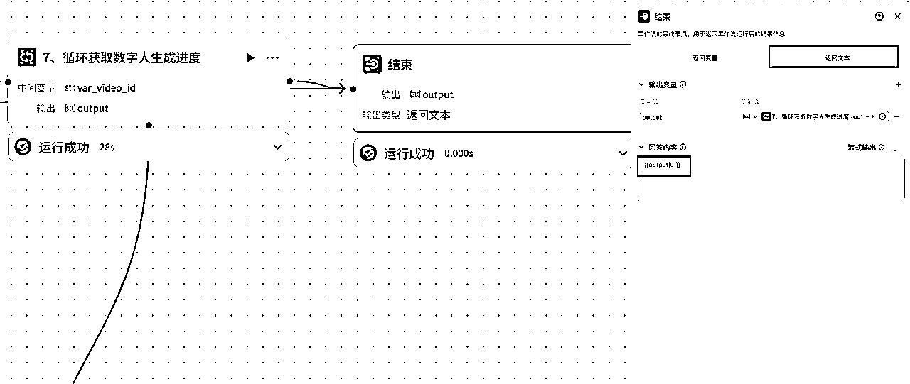

* * *

# 五、创建智能体

## 新建智能体

点击「创建」按钮，选择左侧的创建智能体。

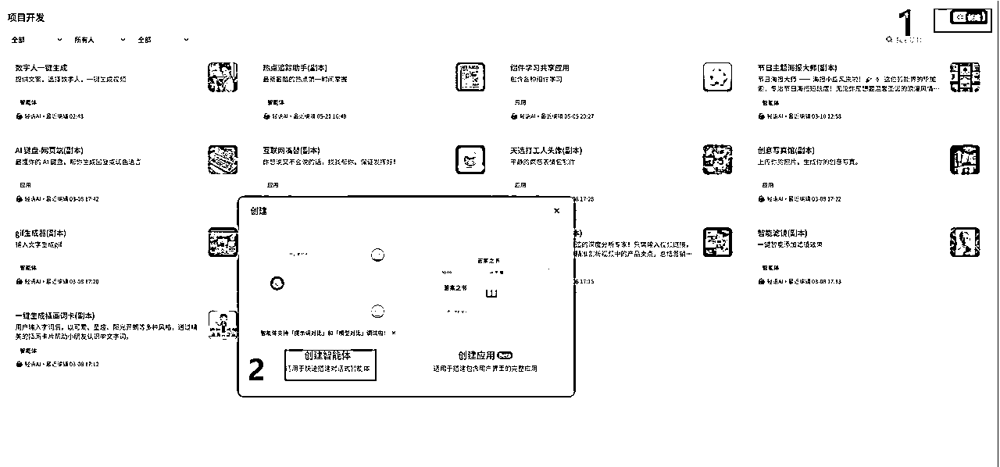

* * *

## 填写标题和描述信息

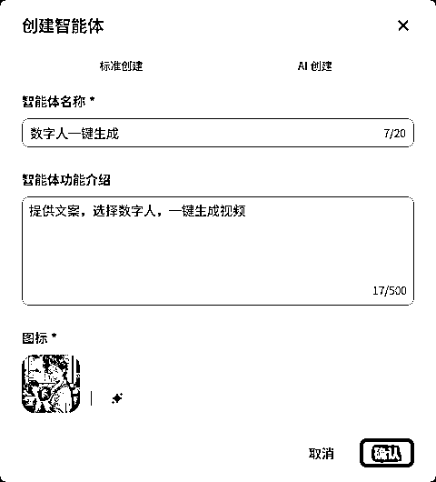

* * *

## 配置人设、引入工作流

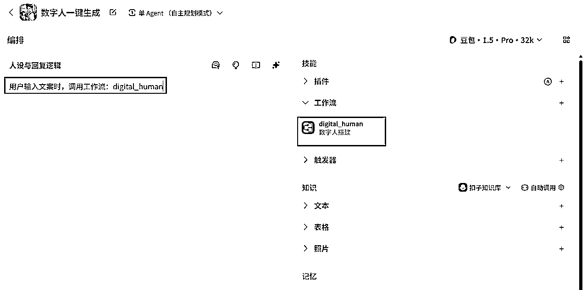

* * *

## 测试智能体

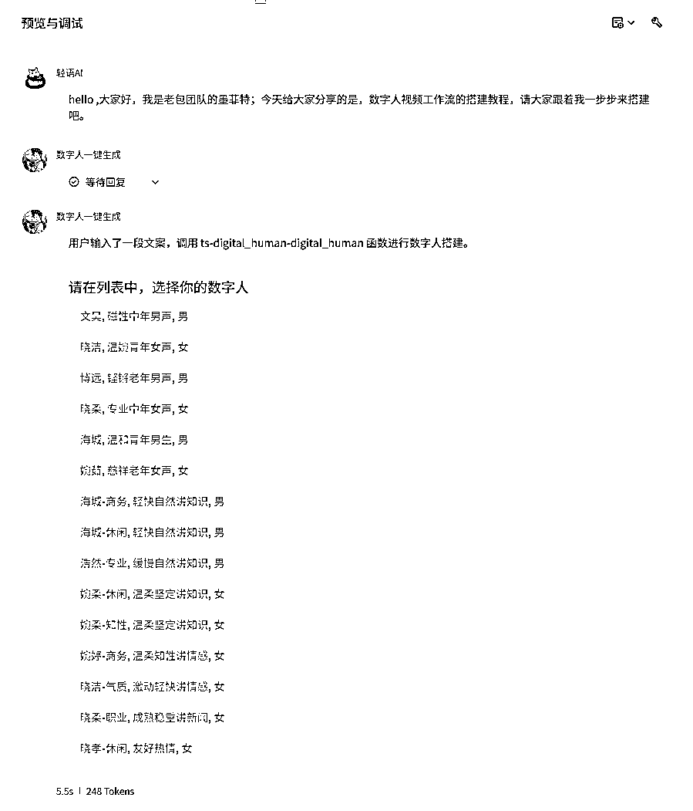

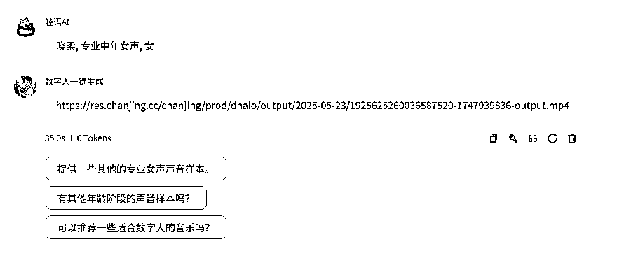

能正常输出视频链接后，说明已经成功啦🎉

以上就是全部内容啦，恭喜你完成数字人工作流的搭建🎊 ，为自己鼓个掌吧🌈

* * *

# 六、你可以复制做的事

🎯 起一个视频号，每天发 3 条数字人口播视频

🎯 制作模板教程，放到星球、文档平台售卖

🎯 在朋友圈/群/短视频带流量，引导“免费试用+付费解锁”

🎯 服务中小商家/抖音新手，提供定制口播/宣传视频

* * *

## 🔚 小结

这是一个：

*   上手简单

*   场景真实

*   闭环完整

*   复用价值极高的实操型AI变现项目。

老包建议每个星球成员都能实操一遍，你会对“AI变现”这件事的理解，彻底不一样。

有不懂的可以找鱼丸要老包微信，远程解决！