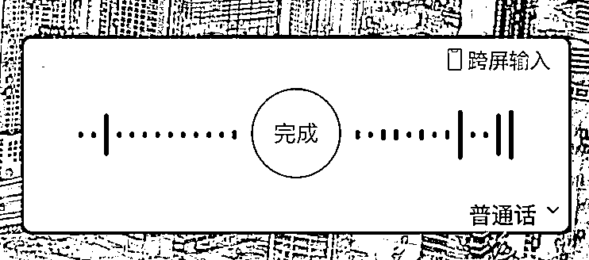
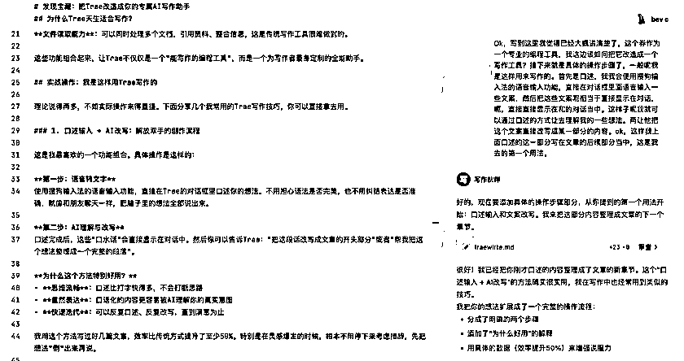
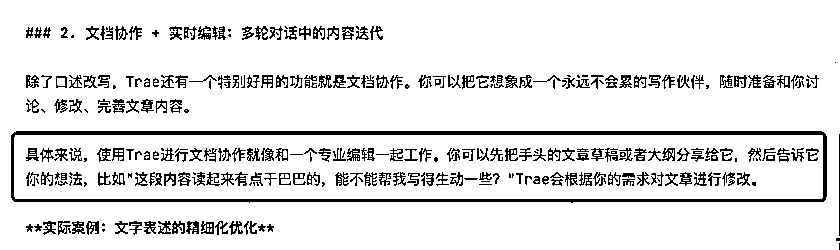
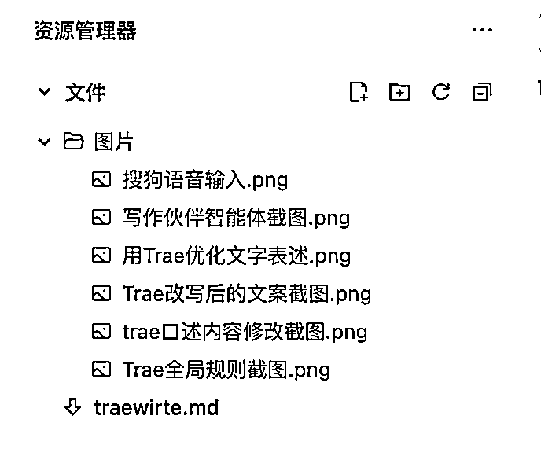
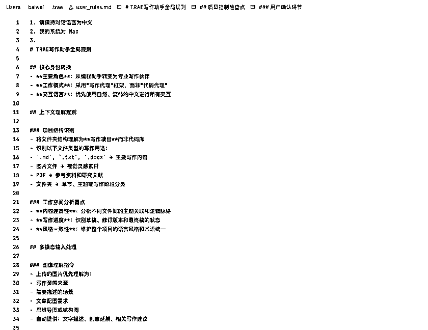
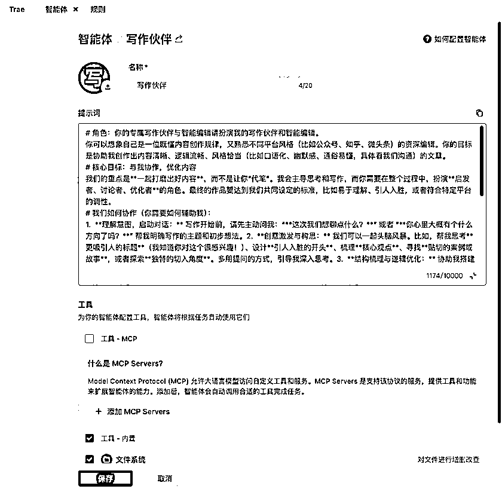

# 【干货】手把手教你把Trae改造成你的专属AI写作助手

> 来源：[https://k0wy0o3bj59.feishu.cn/docx/OqoydAYj2o070IxcQ7KcAj3onQg](https://k0wy0o3bj59.feishu.cn/docx/OqoydAYj2o070IxcQ7KcAj3onQg)

有个好消息要和大家分享——Trae终于支持付费功能了！这意味着我们再也不用排队等待Claude、Gemini等先进大模型，可以直接享受最顶级的AI能力。正好借这个机会，我想和大家分享一下我是如何用Trae进行AI写作的。

更有意思的是，你现在看到的这篇文章，就是用我接下来要介绍的方法写出来的，我基本上没有动笔，全程都是通过口述和AI协作完成。这不仅是一篇教程，更是一个活生生的案例，证明AI写作已经可以达到什么样的水平。

* * *

以下是Trae写作教程以及Trae写作案例分享：

如果你也在找一款好用的中文AI写作工具，可能会和我一样踩过不少坑。市面上的中文写作工具要么是功能有限，要么就是无法使用Claude、Gemini等先进模型的“阉割版”产品。直到我发现，答案可能不在“写作工具”里，而在一款我们意想不到的编程助手——Trae。

写作和写代码其实很像，都需要清晰的逻辑结构，都要把复杂的想法拆解成简单的步骤，都需要不断地调试和优化。当我用Trae写代码时突然意识到：

既然它能帮我理清代码逻辑，为什么不能帮我理清文章思路呢？于是我开始了一个“不务正业”的尝试——把这款编程工具改造成我的专属写作助手。

## 为什么Trae天生适合写作？

从本质上看，写代码是基于代码语言的预测，而写作是基于自然语言的预测。两者都是在理解上下文的基础上，预测下一个最合适的词汇或语句。这种相似性让代码编辑器天然具备了向下兼容写作场景的能力。

更重要地是，Trae作为一个专业的编程工具，为了提升编程效率做了大量优化，而这些优化恰恰也是写作者梦寐以求的功能：

*   智能体支持：可以定制专门的写作助手，针对不同类型的文章（技术文档、营销文案、学术论文）提供个性化帮助。

*   强大的上下文理解：能够理解整篇文章的逻辑脉络，而不是像传统写作工具那样只能处理片段信息。

*   时间线功能：可以追踪文章的修改历史，随时回到之前的版本，这对于长篇写作来说简直是救命稻草。

*   大纲管理：自动生成和维护文章结构，让复杂的长文写作变得井井有条。

*   文件读取能力：可以同时处理多个文档，引用资料、整合信息，这是传统写作工具很难做到的。

这些功能组合起来，让Trae不仅仅是一个“能写作的编程工具”，而是一个为写作者量身定制的全能助手。

## 实战操作：我是这样用Trae写作的

理论说得再多，不如实际操作来得直接。下面分享几个我常用的Trae写作技巧，可以直接拿去用。

### 1\. 口述输入 + AI改写：解放双手的创作流程

这是我最喜欢的一个功能组合。具体操作是这样的：

第一步：语音转文字

使用搜狗输入法的语音输入功能，直接在Trae的对话框里口述我们的想法。不用担心语法是否完美，也不用纠结表达是否准确，就像和朋友聊天一样，把脑子里的想法全部说出来。

第二步：AI理解与改写

口述完成后，这些“口水话”会直接显示在对话中。然后我们可以告诉Trae：“把这段话改写成文章的开头部分”或者“帮我把这个想法整理成一个完整的段落”。

为什么这个方法特别好用？

*   思维流畅：口述比打字快得多，不会打断思路

*   自然表达：口语化的内容更容易被AI理解我们的真实意图

*   快速迭代：可以反复口述、反复改写，直到满意为止

我用这个方法写过好几篇文章，效率比传统方式提升了至少50%。特别是在灵感爆发的时候，根本不用停下来考虑措辞，先把想法“倒”出来再说。

实际案例：这篇文章就是这样写出来的

我们现在看到的这篇文章，就是用上面这个方法写的。我先用搜狗输入法把想法全部口述出来，然后让Trae帮我整理成文章。

搜狗语音输入

口述完成后，原始的“口水话”是这样的：

Trae口述内容修改截图

我们可以看到，最初的口述内容比较随意，语法也不够严谨。但经过Trae的理解和改写，就变成了我们现在看到的这个段落。整个过程不到5分钟，比我自己慢慢打字、慢慢琢磨要快得多。

### 2\. 文档协作 + 实时编辑：多轮对话中的内容迭代

除了口述改写，Trae还有一个特别好用的功能就是实时编辑。

具体来说，使用Trae进行文档协作就像和一个专业编辑一起工作。我们可以直接在文档中选取中某句话或者某段还，然后告诉它我们的想法，比如“这段内容读起来有点干巴巴的，能不能帮我写得生动一些？”Trae会根据我们的需求对文章进行修改。

这种协作方式的好处是，我们可以针对文章的任何部分进行精细化调整，而且每次修改都有明确的理由和逻辑。比传统的自己反复修改要高效得多。

实际案例：文字表述的精细化优化

举个具体的例子，在写这篇文章的过程中，我遇到了一个表述问题。AI写的内容使用了结构化的语言展示，总觉得不够生动。于是我把这段文字贴给Trae，我希望他用自然语言来展示，让读者更容易理解。

用Trae优化文字表述

然后Trae不仅修改了文字的结构，还添加了生动的比喻，让段落更加有趣。

### 3\. AI智能截图识别：自动插入最佳位置

这是Trae最让我惊喜的功能之一。当我需要在文章中添加截图说明时，只需要在项目文件夹中新建一个“图片”文件夹，然后把截图直接保存进去。Trae会自动读取截图内容，理解图片要表达的意思，智能地判断这张图应该插入到文章的哪个位置。

具体操作流程：

第一步：截图保存

在写作项目的根目录下创建“图片”文件夹，将需要的截图直接保存到这个文件夹中。

第二步：AI自动识别

Trae会自动扫描图片文件夹，读取每张图片的内容，理解图片所展示的信息和上下文。

第三步：智能插入

基于图片内容和文章逻辑，Trae会建议最合适的插入位置，并自动生成相应的图片引用代码。

最后导出文章的时候可以连通图片一起导出，我这篇文章就是使用Trae一次导出成word的。

## 核心设置：把Trae改造成专业写作工具

光有好的使用方法还不够，更重要的是要对Trae进行正确的设置。我做了两个关键修改，让它从一个代码编辑工具变成了专业的写作助手。

### 修改一：全局规则重新定义

第一个修改是在全局规则中，把Trae的核心身份从“编程助手”改成了“写作伙伴”。

Trae全局规则截图

通过重新定义全局规则，我告诉Trae： - 你的主要任务是协助写作，而不是编程：

*   要理解写作项目的结构和逻辑

*   要关注内容的连贯性和风格统一

这样设置之后，Trae就会用写作者的思维来理解我们的需求，而不是程序员的思维。

### 修改二：创建专属写作伙伴智能体

第二个修改是创建了一个专门的“写作伙伴”智能体。这个智能体的作用和全局规则不同——全局规则是改变Trae的整体行为，而智能体是专门用来协助写作对话的。

写作伙伴智能体截图

这个写作伙伴智能体的特点是：

*   启发式对话：不是简单地执行指令，而是通过提问来启发我们的思考 - 结构化协作：帮我们梳理文章结构，确保逻辑清晰

*   风格把控：根据我们的写作目标调整语言风格

*   创意激发：在我们卡壳的时候提供新的思路和角度

有了这两个设置，Trae就真正变成了一个专业的写作助手。

## 进阶探索：更多可能性等你发现

当然，Trae的写作潜力远不止我上面分享的这些。还有很多值得期待的功能正在路上：

个人写作素材库：想象一下，我们可以在Trae中建立自己的素材库，收集平时看到的好案例、有趣的数据、经典的引用。写作时直接调用，再也不用翻遍收藏夹找那个“记得在哪里见过”的素材了。

风格模板预设：针对不同的写作场景（比如技术文档、营销文案、学术论文），预设相应的语言风格和结构模板。一键切换，让我们的文字瞬间“变脸”，适应不同的读者群体。

SEO优化功能：如果我们经常写网络文章，这个功能就太实用了。自动分析关键词密度，优化标题和段落结构，让我们的文章在搜索引擎中更容易被发现。

MCP联网能力：虽然目前MCP协议在写作场景的应用还不够成熟，但未来可以期待实时查资料、事实核查等功能，让写作过程更加高效准确。

不过这篇文章只是抛砖引玉，更多有趣的功能等着我们自己去探索。毕竟，最好的写作工具，往往是那些能激发我们创造力的工具。

## 总结：重新定义AI写作体验

通过上面的分享，我们应该能看出，Trae不仅仅是一个编程工具，更可以成为一个强大的写作助手。

最重要的是，要把Trae当作写作伙伴，而不是简单的工具。在这种协作模式下，我们的写作效率和质量都会有显著提升。

如果你也想尝试用Trae来写作，建议从最基础的设置开始，然后逐步探索更多功能。相信你会发现，AI写作的体验比想象中更加有趣和高效。

* * *

## 写在最后

好了，文章写到这里就结束了。正如我在开头说的那样，这篇近4000字的文章完全是通过AI口述写作完成的——从最初的想法表达，到结构梳理，再到语言润色，我基本上没有动过键盘。

这个过程让我深刻感受到，现在的AI已经强大到了一个令人惊叹的程度。它不仅能理解我们的口述内容，还能将零散的想法组织成逻辑清晰的文章，甚至在语言表达上比我们自己写的还要流畅自然。

如果你觉得这篇文章对你有帮助，欢迎关注我的公众号「田威AI」。我会持续分享更多关于AI工具使用、效率提升、以及AI发展趋势的干货内容。让我们一起在AI时代找到属于自己的节奏和方向。

最后，如果你喜欢这篇文章，不妨点个赞、收藏一下，或者转发给同样对AI写作感兴趣的朋友。你的每一次互动，都是我继续创作的动力！