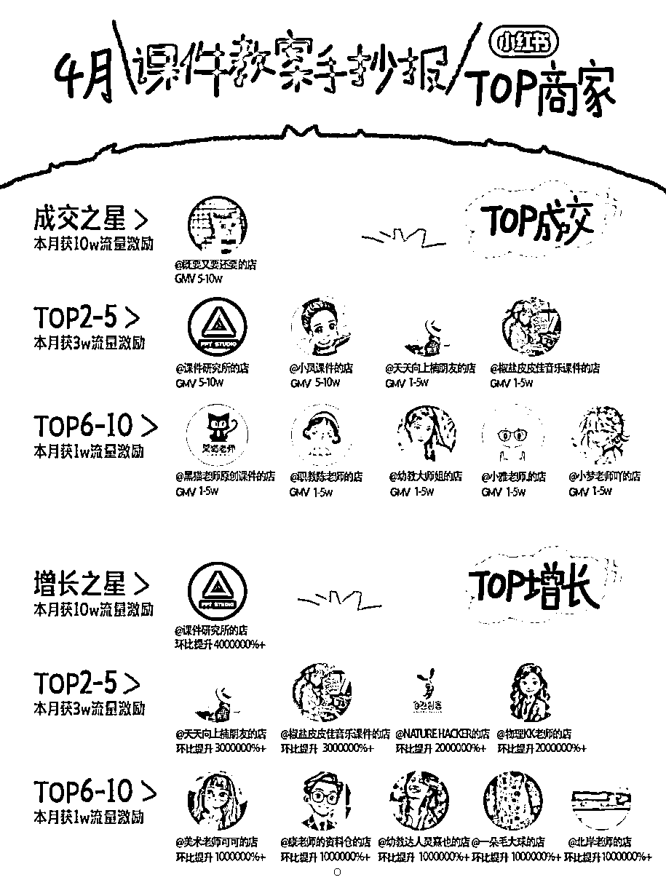
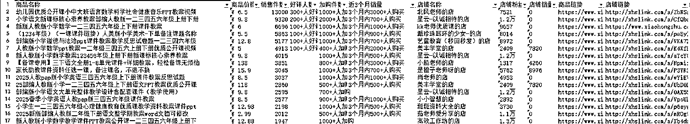
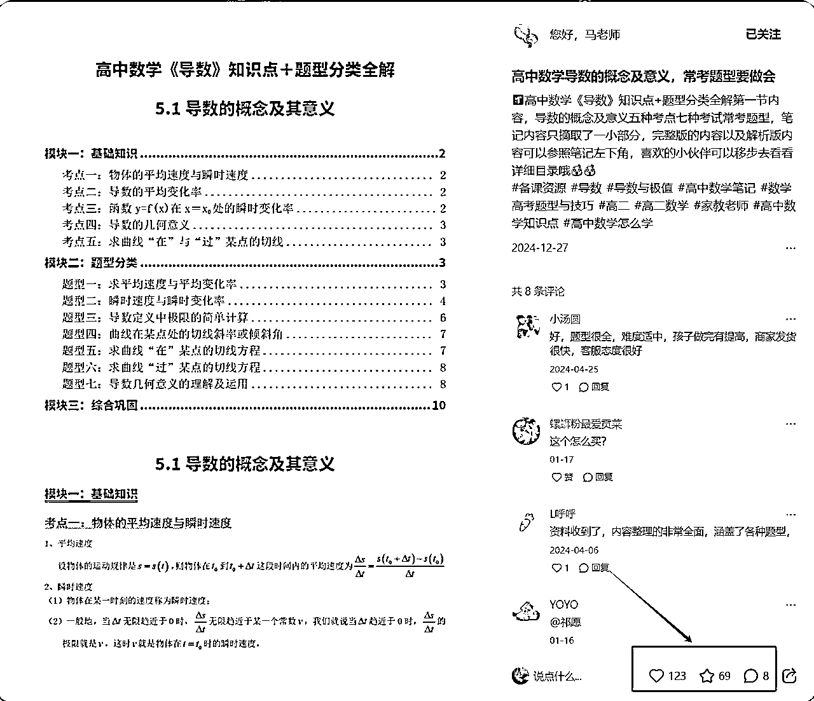

# 【适合新手】小红书虚拟电商从0到1全流程拆解！无保留分享

> 来源：[https://o7nsrridj4.feishu.cn/docx/OrEhdYvTgoLlO8xDXeRcwJ3CnGc](https://o7nsrridj4.feishu.cn/docx/OrEhdYvTgoLlO8xDXeRcwJ3CnGc)

hello，各位圈友大家好！我是星河。想跟大家分享我们团队在小红书虚拟资料店铺的一些探索

我是今年2月底开始起小红书虚拟资料店铺的，到5月份就做到了单店2w+/月收益，差不多3个月时间，中间很长时间也没发笔记内容，都是在吃一些长尾搜索流量

接下来我会完整的把这个店铺的每个月的销售数据，流量数据，都毫无保留地拆解给圈友们，大家可以带入上帝视角来看这个店铺是怎么从0到1的，希望能够帮助到这次航海想要入局小红书虚拟的朋友们！

# 我的一些经历

我是23年从互联网大厂产品经理离职后，想要做新消费领域，误打误撞进入了电商，探索做了抖音短视频带货、抖音的电商直播，但是切入的时间点不对，还有供应链薄弱，虽然通过投放拿到过百万GMV，但是一算也没啥利润。当时新人入局抖音门槛已经很高了，相反在小红书上有不少红利，也因此拿到一些小结果。

23年初我就在小红书做了一个爆款模板《每天认识一款茶》，单周涨粉1w+，单月涨粉3w+，但是考虑到这种图文商业变现价值比较弱，做了1多月，后续就没继续深入做这个内容，账号转型去做真人口播了。后面也引起了很多同行的模仿借鉴，甚至跨界到其他领域去，大都涨粉了好几万，到现在这个模板也都持续有流量。

因为当时也没啥好的机会，就想继续在茶叶领域深耕，我就独自一人跑到武夷山去了，一开始在抖音电商吃过亏的供应链，到了源产地一下全部解决了。

23年7月左右我就开始投小红书聚光，可以说是第一批投聚光的选手了，当时客资是真的便宜，一个加微成本只要几块钱，也算是吃到一波红利，现在聚光成本也上升到二三十一个了。

我们通过一个爆款笔记模板+多个账号矩阵怼笔记+聚光投放一年时间下来拉到私域4w客资，后面因为很多客户一直在问哪有链接购买，所以我们也顺着需求开通了小红书店铺，到现在兼着卖了2万多单，店铺接近200w的GMV，因此也积累了小红书电商的能力（但主要还是在私域渠道售卖，因为茶叶复购相对比较高）

这条爆款商品笔记从100点赞投放到3000+点赞，到现在还有很多商家在模仿

茶叶项目请看更绪的这篇文章，写了我们的完整版复盘：https://scys.com/articleDetail/xq_topic/4848282444454558

24年我一直在武夷山沉淀自己的供应链能力，在深入参与生产制造、产品设计、产品销售、用户运营各个环节后，我逐渐意识到实体供应链面临的系统性挑战：生产周期长、库存风险高、品控难度大、资金占用重。我没有几年时间很难沉淀下系统供应链的能力

这也促使我将目光转向了线上轻资产项目，选择了成本较低的小红书虚拟电商，相对来说边际成本低、可快速迭代、风险可控...也更适合我过往的互联网经历。

另外我也是更绪的合伙人，他在小红书虚拟店铺这块的探索比较深入！我过去主要集中精力在茶叶项目上，虽然这个也是从0开始起步，但是他给了我很多深入指导！少走了很多弯路。

之所以在前面想说这么多，是想告诉大家！我在做这个店铺之前就有很多小红书的从业经验，也都是一步一个台阶积累过来的。另外还有大佬的指导，所以我的起店速度还是比较快的

好嘞！废话说完，进入文章正题！！！

# 店铺起盘过程分享

### 赛道选择

说到小红书虚拟电商这个赛道，真的什么都有：考研资料、公务员题库、K12教辅资料、PS/PPT模板、职场技能课程、头像壁纸、知识服务、课件教案、甚至各种指令、AI工具、coze插件...你能想到的，基本都有人在卖。

刚开始我也懵，这么多选择，到底做哪个好？试过几个方向，发现一个问题：不是所有赛道都适合普通人入场的。

有些看起来很火，但门槛也很高。比如参考答案阅览室，虽然只是整理一些公开商业或名人文章，但是背后的整理工作量也大到吓人

想来想去，我最终选择了中高考这个赛道。为什么？

第一，我真的懂。中高考这条路相信大家都走过。那种熬夜刷题的痛苦，那种分数差一点就上不了理想学校的焦虑，我都经历过。正因为经历过，所以我知道学生和家长真正需要什么，痛点在哪里。

第二，这是真正的刚需。什么叫刚需？就是不买不行的那种需求。你可以不学PS，可以不考证书，但你能不参加中高考吗？每年光是高考生就有1000多万，中考生更多。这些孩子和他们的家长，为了那几分的提升，愿意尝试任何可能有用的资料和方法。

第三，市场够大，竞争相对友好。中高考涉及的科目多，知识点多，每年题型还在变化。这意味着市场永远有新的需求空间，不会因为某个资料火了，整个赛道就饱和了。而且这个领域的用户，大部分还是比较单纯的学生和家长，不像有些大学生资料赛道，买的比卖的精

找对了赛道，后面的路就会顺很多。如果你不知道怎么选赛道，可以基于这三个点进行参考。

### 如何选品

说白了，选品就是找蓝海品，找供需不平衡的品。也就是小排老师说到的找到软柿子捏。总结下来就是需求大或热度高、竞争不太激烈、自己产品不错的产品。

我主要是去找小红书站内那些低粉但销量不错的产品或者近期有热度的品，以及去淘宝找那些销量特别高的虚拟资料，然后看看小红书上有没有人在做。

淘宝的销量数据不会骗人。一个资料包能在淘宝卖出几万单，说明市场需求是真实的、稳定的。但很多淘宝卖家不懂小红书的玩法，或者懒得来小红书布局。这就给了我们机会。

我发现了一个惊人的事实：淘宝上那些月销千单的虚拟产品，在小红书上竟然几乎没人做！测试的过程中，我发现了一个规律：淘宝验证过的需求，搬到小红书基本都有流量。

这些产品大部分都是我从淘宝买过来，自己稍微做了下文件整理的弱版权资料（不碰机构的资料）

比如高考真题、中考真题这些都是有现成整理好的，也不会有任何的侵权，有侵权风险的资料我们一般是不碰的

结果怎么样？我给大家看下近1个月的数据

好几个品通过长尾关键词搜索获得了不错的流量，销量数据也很不错。最关键的是，这些产品在我开始做的时候小红书上几乎没有竞争对手。

当然也有没成功的品，高中答题模板我发了100篇笔记，也就出了几十单，数据远远不及预期

做了一段时间高考产品后，我突然意识到一个问题：既然高考的逻辑跑通了，中考为什么不行？

中考和高考本质上是一样的，都是升学考试，家长和学生的焦虑程度甚至更高。而且中考的市场更大，每年参加中考的学生比高考生还多。

想通了这一点，我立马开始布局中考赛道。用同样的方法，把中考的品也铺了起来。果然，数据也慢慢起来了。

### 如何发笔记

很多人做小红书就是大量铺内容，一上来直接先发个几十篇，做完一轮下来发了几百篇，甚至上千篇

我不是这样的，做的会更精细化，会认真筛选对标笔记，认真拆解商品卖点

在小红书的逻辑里，不管你卖什么，封面和标题没做好，后面说什么都白搭。用户刷到你的笔记，只有不到1秒钟的时间决定要不要点进去。所以每篇笔记模板我都会找到对标爆款笔记封面进行模仿

每个商品，我前期先发5-10条笔记。为什么是5-10条？

因为小红书的算法有随机性，同样的内容，不同时间发布，数据可能完全不一样。如果某个笔记的数据不错，能持续出单，我就知道这个方向对了，会继续围绕这个角度多发一些。

那些数据好的产品，我都发了几十篇笔记，有些甚至发了上百篇。

当然这些笔记不是一个账号发的，而是一拖三，一个店铺账号关联了3个主理人账号，4个账号发下来的总共笔记数

我做了几百篇笔记，说实话，其实一篇笔记都没爆，最高的那篇笔记也才200多点赞

没有一篇千赞的内容，但是并不影响我出单，好几篇笔记都卖了了上千元。只要布局好关键词，布局好搜索流量，都会有持续出单。

一看笔记的流量来源，其实大部分，甚至80%以上都是来自搜索流量，一直有不断地长尾流量在出单，而且转化率都很高，大概有20%，因为匹配的是精准搜索需求

其实这个店铺的笔记数量相对很多同行而言，数量并不多，大概就三四百篇笔记，其中还有100多篇是无效笔记

更多是基于我过往做笔记的经验，做得更加精细化，所以相对而言，单条笔记能获得不错的搜索排名数据。

### 店铺完整数据

2月底开始起店

过去参加小航海，跟着做了一段时间，因为主业忙，没坚持下去，但是一直都有持续的长尾搜索流量，2月底左右才开始正式起店运营

3月

进入正式运营，总共上了3个品，有个品花了很多时间做笔记，可能方向没找对，没起来，但是另外两个品起来了

4月

把对应的中考资料上了，并且做了一些笔记，但是出单的主要还是高考相关的资料，因为前面上的品长尾搜索流量起来了。

5月

开始铺一些初高中专项训练以及期末复习的品了，现在出单的品主要还是前面布局的中高考品，再加上中高考的热度大，所以店铺销量继续上升。

后面店铺的运营，也对接一些中高客单的品，比如接下来一段时间会很有热度的高考志愿，会考虑通过店铺卖AI志愿卡，拉到私域去转高客单的产品。目前也有不错的效果

好嘞！关于这个店铺如何起盘就分享到这！（tips:现在就不用去跟中高考的品，因为接下来热度肯定过啦！）

接下来还会继续跟大家讲讲如何布局小红书虚拟店铺从0-1的方法论，都是我们实打实沉淀下来的经验分享。

# 关于选品

选品，真的是让大家最头疼的问题。选对了就是躺赚，选错了就是血亏。

我遇到很多新人朋友，一上来就问我："什么产品好卖？什么赛道火？"

说实话，这样问的人，基本都没选到啥好品

## 第一个方向：从你熟悉的领域下手

很多人看到别人卖什么火就跟着做什么，结果呢？客户问个专业问题就懵了，售后问题一堆

任何领域都有做得好的人，关键不是选什么赛道，而是谁在操盘。

熟悉是你的起点，你有什么工作经验？有什么兴趣爱好？有什么考试经历？一开始可以考虑先从自己熟悉的领域下手，因为你懂用户，懂痛点，也就更能选对产品。

如果不熟悉也没事，我做的时候很多产品也都不熟悉，可以打开deepseek挖掘这个产品的人群、痛点、需求场景等等，它能给你回答很详细，再上小红书搜下这个领域的帖子，看看用户的评论，慢慢就变得半个专业用户了

## 第二个方向：从痛点刚需的产品下手

真正的需求是什么？是用户愿意为了解决这个问题掏钱。

真正的痛点是什么？是用户自己都在主动搜索解决方案的。

小红书天然自带搜索属性，用户遇到问题第一反应就是上来搜答案。这种主动搜索的需求，转化率天然就高。

什么产品匹配刚需+痛点呢？

比如各种考试，中国人对考试的执念有多深？看看每年的考试日历就知道了

从年头到年尾，几乎每个月都有大考：公务员考试、教师资格证、建造师、会计师、医师资格、法考、考研...生财航海那张考试图谱一摆出来，密密麻麻全是考试，每一个背后都是千军万马过独木桥。

图源：生财虚拟航海

还有各种PPT模板、简历模板、表格工具、设计素材...这些为什么好卖？因为用户有明确的使用场景，有迫切的时间需求。甚至我前段时间看到一个品“高校求职信息差”，在小红书上都卖了上万份了

## 第三个方向：从有热度的产品下手

另外还有个选品方向，跟着热度产品走。热度产品的好处是什么？需求激增，自带流量

ChatGPT刚出来时，AI提示词教程瞬间成爆款，1月底DeepSeek火了，马上就有人开始卖DeepSeek使用教程，6月份高考季一到，高考志愿填报服务立马成了热门。

这个过程关键是要快，热度来了你要第一时间跟上。等大家都反应过来了，红利期就过了。

但记住，蹭热度不是无脑跟风。DeepSeek可能只火一阵子，但AI应用技能会长期有需求。高考志愿只在6月火爆，但学习方法和考试技巧全年都有市场。最聪明的做法是：用热点做流量入口，用价值做长期生意。

## 选品参考

当然还有很多比较实用的选品方向，比如找小红书站内那些低粉高销量的产品，以及去淘宝找那些销量特别高在小红书上竞争不激烈的产品

我们团队开发了一个插件，可以批量爬取小红书站内的爆款商品

这里分享小红书站内几个领域的爆款虚拟商品，能看到好多销售万单的产品，给不知道怎么选品的同学做参考，如果你能知道小红书站内什么产品好卖，什么产品有热度，想不做起来都难。

小学领域：

初高中领域：

大学生及成人考试领域：

老师教案备考领域：

模板素材教程领域：

有个点需要大家额外注意，我们需要提前1个月左右开始布局下一个时间节点的资料。我观察到，很多店铺就是因为没掌握这个节奏，提前或错过了时间节点，丢掉了最佳销售窗口。

# 关于如何做笔记

## 选择对标

不管是选品，还是做笔记，都要找好对标选手。聪明人都知道，先学会模仿，再谈创新。

很多人做小红书电商都有个误区，会过于关注“低粉高赞”的数据，一看到某个笔记几千赞，粉丝数只有几百，就兴奋得不行，而忽略了背后的转化情况。很多笔记往往只是为了涨粉，转化率可能低得可怜。

高点赞、高收藏，转化极低的内容

真正赚钱的笔记，往往是那些看起来"不起眼"的。我们要找的是低投入高转化的对标笔记。

*   制作成本低：做好一个好看封面，后面放几页资料图

*   数据适中：点赞几十到几百，不用非得是爆款（爆款会被大量的模仿抄袭）

*   评论区活跃：大家都在问价格、问链接

找这样的笔记，有个小技巧：

看评论区，不看点赞数。评论区里都是"多少钱"、"怎么买"、"链接发一下"，这种笔记就对了。

这里给大家推荐两种类型的对标笔记模板：

1.  高转化规模模板：

1.  也就是我们日常看见的爆款内容，一般在上千点赞，还都是近期发布的内容。

1.  主要是吃推荐流量，笔记流量大、笔记变现多，不容易爆，不容易出现

1.  高转化效率模板：

1.  我们在搜索渠道才会看见，一般在30-300个点赞，有些甚至更高。发布时间甚至好几个月前了

1.  主要吃搜索流量，笔记流量一般、笔记变现不错，确定性更大（推荐）

## 做好封面与标题

说句扎心的话：在小红书，颜值即正义。你的内容再好，封面不行，用户连点都不会点！

无论你卖什么虚拟资料，做好封面与标题都是前提条件，这是你能不能获得流量的生死线。

通常封面就是越简单越好，越直接越好，最重要的信息放在封面最显眼位置，用最简单的词汇表达核心价值。、

大字号、高对比度、整体布局简洁、信息密度合理就是一个好的封面

### 封面制作的三种类型：

1.  高信息密度

1.  什么叫高信息密度？就是用户一眼看到你的封面很丰富，很饱满，就愿意停留点击

1.  强情绪刺激

1.  人都是情绪动物，尤其是在刷手机的时候。你要做的就是在1秒内勾起用户的情绪，让他们产生"我也想要"的冲动。

1.  直戳用户痛点，精准筛选

1.  好的封面不仅要吸引目标用户，还要筛选掉不相关的人。因为小红书的算法会根据用户行为判断你的内容质量。如果来的都是不精准的用户，跳出率高，算法就会认为你的内容不好。

1.  让对的人进来，让错的人划走，这是封面的双重使命。

### 标题公式：

用户搜索关键词（产品/资料）+ 数字具象化 / 情绪语言

这种标题结构为什么效果好？因为它同时满足了搜索和情感两大需求：

*   前半部分：这是你的SEO基础，决定了你能不能被搜到，让目标用户能精准找到是我们的第一要义

*   后半部分：做价值承诺，触发情感共鸣，激发点击欲望

这种结构不仅可以放在标题上，同样也可以放在封面的内容上！坚持使用这个公式，会让你的内容更容易被目标用户发现。

## SEO优化的四维模型

### 先搞清楚用户到底在搜什么

做关键词优化，最难判断的就是用户会搜什么。你觉得的，往往不是用户真正搜的。

我现在找关键词，主要用三个办法：

第一个最简单，直接去小红书搜索框输入你的商品，看下拉词提示。

比如你输入"小学六年级作文"，下面会自动出现"小学六年级作文范文"、"小学六年级优秀作文"这些词，这就是用户真实搜索最多的。

第二个是用小红书自己的聚光关键词工具，这个要开通企业专业号才可以使用，但数据最准确。

毕竟是官方工具，知道哪些词搜索量大，哪些词转化好。

第三个就是凭经验判断

你卖了一段时间，用户私信你最多问什么，评论区出现频率最高的词是什么，这些都是核心关键词

不过找到关键词还不够，还得会筛选。我一般看三个标准：

*   搜索量：不能太热也不能太冷，太热的词大号都在抢，你根本排不上去；太冷的词虽然好排，但没几个人搜也没用。

*   商业价值：用户搜这个词是不是真的想买东西

*   产品匹配度：要看和你的卖的产品匹配不匹配，不要硬关联

举个例子，"初中作文素材"就是个好词，搜索的人多，而且都是想要现成素材的家长，转化率特别高。

但"学习方法"这种词就算了，太宽泛，搜这个的人不一定要买你的资料。

### 四维SEO优化实操指南

找到好的关键词，接下来就是怎么用了。我的经验是，不能只在一个地方放关键词，要在封面、标题、正文、话题四个地方都布局，形成多维布局。

封面：很多人觉得封面就是好看就行，其实不对。小红书的搜索机制会识别封面上的文字，所以你的核心关键词一定要在封面上出现。比如你卖中考数学资料，封面上就要大大方方写上"中考数学"四个字，别藏着掖着。

标题：因为用户搜索的时候，标题是最直接的匹配对象。我有个小技巧，就是把最重要的关键词放在标题前10个字里。比如"中考数学必背公式，90%的孩子都在用"，一眼就能看出来是讲中考数学的。

正文：要自然一些。我一般在开头用提问的方式引入关键词，中间部分就按照产品特点来写，该出现关键词的地方自然出现，不要硬塞。结尾再强化一遍关键词，分布均匀，读起来也不别扭。

话题标签：就更简单了，直接选包含关键词的话题就行，比如#小学作文素材、#中考数学复习这种。

参考案例

# 资料的收集与整理

## 资料收集

①微信搜一搜

很多人找资料，第一时间想到的是百度、知乎这些，但其实微信搜一搜是个被严重低估的宝库。做网盘拉新的同学在微信公众号上分享了太多的免费资料，一般的资料包都在微信搜一搜就能直接找到

②淘宝/拼多多/私域同行购买

如果说微信搜一搜是免费挖宝，那同行购买就是花钱省时间。淘宝和拼多多是我最常用的两个平台。我一般会选择销量中等偏上、评价较好的店铺购买，这样买到的资料往往都是整理比较精华的资料包

没有一份资料可以一招鲜吃遍天，我们要经常观察同行，看看他们有没有哪些资料更吸引人，转化率更高，及时的将他们的资料化为己用。

## 资料的整理

另外资料的整理是虚拟资料的核心价值，我们一定要花时间、花功夫去做：

①资料内部结构：层次感决定使用体验

很多资料包之所以差评频出，就是因为结构混乱。好的资料包应该这样组织：

*   第一种：按年级/难度分类

*   第二种：按具体知识点分类

*   第三种：知识讲解+例题+练习+答案

举个例子，"五2年级数学"文件夹下应该按"知识考点"、"期中期末专项"、"课课练"等具体知识点细分，而不是一堆杂乱的PDF。

②笔记内容展示

同时在笔记展示时，不要只强调"包含多少G资料"，而要展示具体内容示例，精选几页高价值内容页面详细展示

要展示的实用一点、丰富一点、清楚一点，把资料目录、知识点密密麻麻放上去，让用户一看就想收藏。用户下单意愿才会更强

## 避免违规与侵权

侵权风险是卖虚拟资料必须重视的问题。

选品时避开那些有明确版权方的热门资料，比如知名出版社的电子书、大型教育机构的网课等。也比如知识星球内的各种付费课程。

我们主攻弱版权的电子版资料，很多都是公开资料，我们做的收集与整理

要是不确定资料版权，可以去裁决文书网查询版权方是否有过起诉以及赔偿金额，评估风险后再决定是否上架。

此外，在商品描述中明确资料来源和版权情况，让买家清楚知晓，避免版权纠纷。

# 发笔记前要做好的店铺运营

### 第一个：店铺类目选什么

🔺数字商品这一类目包含了多种虚拟商品类型，大部分虚拟商品都可以挂在数字商品这个类目下

包括：设计素材/滤镜/插件/AI工具、课件/教案/手抄报、电子资料包、PPT/简历/其他模板、头像/壁纸

如果上面全部开通之后，还是提示类目错放，出现下架的问题，则也可以用我们之前说到的卡bug的方式来解决（就是不断提交审核，不断重新上架，多了就会审核通过）

### 第二个：支付方式开通

🔺开通所有支付方式，避免因支付问题影响成交。

具体操作：进入店铺后台，在支付设置中勾选所有可用的支付渠道即可。

### 第三个：店铺物流选择

🔺关于发货设置，建议填写一个虚拟地址（如"XX市XX区"），因为我们是"无物流配送"方式，不需要实体发货。

运费模板可以设置全国包邮，有时候会选成“非偏远地区包邮”，导致“新疆”、“西藏”不能发货

### 第四个：自动发货

🔺推荐用"阿奇索"工具设置自动发货，出单后会自动发网盘链接给客户。电脑要一直开着，或者挂在云服务器上跑。新用户能免费用7天，可以先试试看效果。

### 第五个：自动回复

🔺建议在千帆后台的"客服-接待工具"里提前设置好常用话术模板，把常见问题和标准回复都关联好。另外选择机器人优先接待（平台会考核3分钟回复率，机器人回复也会算在考核指标里）

🔺另外也可以配置上一些要好评话术，赠送一些免费资料包

### 第六个：商品定价及上架说明

🔺可以对比淘宝同款资料的价格，在小红书建议定价2-5倍。比如淘宝卖9.9元的资料，在小红书可以标价19.9-49.9元。

🔺详情页必填：资料内容截图、使用说明、免责声明（例：“虚拟产品不退不换，无实物发货”）

### 第七个：账号关联

1个店铺可以绑定4个小红书账号(1个店铺账号+3个主理人账号)

这4个小红书账号发笔记的时候，可以同时在挂这个店铺内的商品，我们把这1个店铺和4个账号称为”一组号“。

店铺的矩阵化，其实就是去多开店铺，多去配置几组这样的账号。

关联路径：目前只能在千帆app里，通过“账号关联”进行关联（账号不用实名，目前门槛已经降到非常低了）

# 线上兼职 + RPA自动发布，超低成本的运营方式

### 兼职批量生产

刚开始我们团队也是AI的忠实粉丝，想着用AI批量生产内容，解放双手。AI文案可以一下生产出几十上百篇的文案，稍微改改就能用，极大程度降低我们写文案的花费时间

但是AI图片一直没找到合适的解决方案，各种工具轮番上阵，但是总是出现幻觉，莫名其妙的生成一些不该有的东西，想修改个细节，比手工重做还麻烦。有些时候生成的内容虽然看起来不错，但总感觉缺点什么，就是不够"人味"

这里就多生成一个语文作文！改也不能改，要被气笑了

折腾来折腾去，都没找到比较好的AI图片生产方案，AI生成艺术照片还是很强的！但是我们的封面图出现的文字太多了，目前大量生产文字的效果还不是很好，且排版能力也不太行。

后来我们转换思路，开始用线上兼职来生产内容。我们招募了一批大学生帮我们兼职做内容

现在的价格大概是这样：

*   一篇图文笔记：3-5块钱

*   包含文案+配图+简单排版

*   质量比AI生成的要稳定很多

每篇笔记我们都会按照要求审核，所以兼职也不会偷懒乱写，保证了每篇质量过关。

关键是什么？人工生产的内容有温度，有细节，用户看得出来这是真人在用心做的。

有些朋友可能会说，这样成本会不会很高？

算笔账就知道了：

*   一天发30篇笔记

*   每篇5块钱，总共150块

*   一篇笔记如果只能带来1个成交，30篇就是30个，单个资料定价9.9元，也都能成交300元

*   这个投入产出比，比花钱投广告都划算多了。

刚开始找兼职，我以为价格越低越好，结果收到的都是些什么玩意儿：

*   图片模糊得像素马赛克

*   风格完全不统一

后来我们总结出一套筛选标准： 宁可多花1-2块钱，也要找靠谱的人。

现在我们的兼职团队是这样管理的：

*   设置质量审核标准，不达标直接换人

*   建立长期合作关系，稳定的兼职会越做越好

有个点很有意思：我们现在大部分内容都是由5个固定兼职完成的，这些人已经完全理解我们的风格了。

### RPA自动化

有了内容，下一步就是发布。手动发布太累了，每天30篇笔记，光是复制粘贴都能把人搞疯。

所以我们开发了RPA插件，自动化处理发布流程，把兼职做的内容表格从飞书下载下来，用rpa就能自动运行发布，支持多账号定时发布。

最神奇的是，很多代码指令居然是用影刀的AI工具"魔法指令"写出来的。

影刀魔法指令解决不了的问题，我就丢给cladue帮我改，改上几次程序就没问题，全程也都是自然语言的交互

这真的颠覆了我的认知，AI写代码比做图片靠谱多了。

### 组合拳的威力

现在我们的流程是这样的：

1.  数据采集插件帮我们抓取站内的爆款商品，定期追踪数据

1.  兼职团队负责内容生产（5块/篇）

1.  RPA工具自动发布和互动

1.  我们只需要把控选品方向和内容质量

一个人能管理的账号数量，从原来的4个（一组号），提升到了10个以上（3-5组号），因此我们的人效也能大大提高。

这个过程不是什么高深的技术，不是什么复杂的策略，只要：

*   找到靠谱的兼职团队（这是核心，宁缺毋滥）

*   学会使用RPA工具（现在的工具都很傻瓜式，半天就能学会）

*   建立标准化的操作流程（模板化、流程化）

# 遇到的一些常见问题

另外分享两个我们在做虚拟资料，问得最多的问题，以及分享一下我们的实操下来的经验

## 小眼睛数不过百

这太正常不过了！

说句实话，我们大量笔记发布出去，一天下来也就二三十个小眼睛。

刚开始我们也慌，以为是被限流了，是不是账号有问题，是不是内容不行。

各种分析，各种调整，搞得团队都很焦虑。

但实操下来我们发现，基础浏览量不是重点，搜索流量才是王道。

你想想，用户在小红书搜什么？

*   "高考数学真题"

*   "初中物理专题训练"

*   "Excel表格模板"

*   "求职简历怎么写"

如果你的品选对了，笔记模板没问题，就能精准吃到这部分搜索流量。我们这个店铺出单的整体笔记阅读数都不高，也都只有上百点赞，80%的出单都是搜索流量

当你的笔记能稳定出现在用户的搜索结果里，哪怕前期浏览量不高，生意也不会差。

## 要不要投流

如果你的客单价低于20元，我建议不用投流。

为什么？很简单的道理。

你想想，小红书作为平台，也要完成GMV的目标预期（GMV=客单价×转化率×流量）。他们更愿意把流量给到那些能带来更高商业价值的内容。

一个9.9块钱的虚拟资料包，就算转化率30%，对平台的价值贡献也有限。

但一个100元的实体产品，200块钱的课程，商业流量肯定更乐意推。

对于平台来说，低客单价商品的商业转化效率太低了。我们实测下来低客单的虚拟产品也很难通过投放放出太多量。

所以我们现在的策略是：

*   低客单价产品：专注自然流量，同时做好SEO优化

*   高客单价产品：适量投流，加速起量

这样既节省了推广成本，又能把钱花在刀刃上。

别什么都想着投流解决，有时候免费的自然流量反而更精准。

* * *

好啦！以上就是我这次的分享，都是自己手敲的

如果你耐心看到最后，可以在星球里给我点个赞哟！！非常感谢