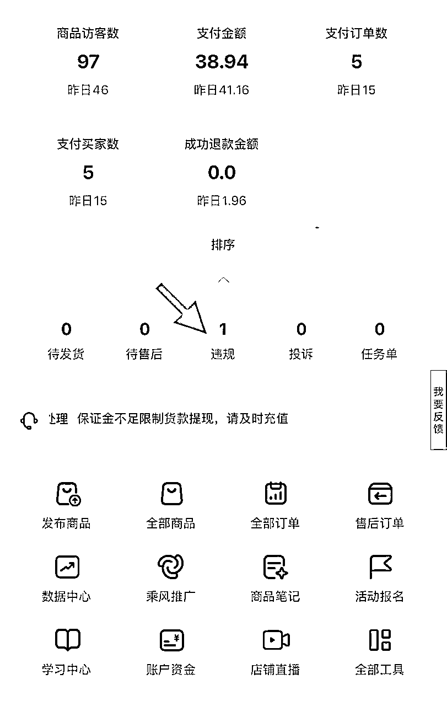

# 从纯小白到选爆品出单

> 来源：[https://kcndi6nr56uo.feishu.cn/docx/I0MSdgUaXo23C5xbt11cuiEJnIh](https://kcndi6nr56uo.feishu.cn/docx/I0MSdgUaXo23C5xbt11cuiEJnIh)

## 一、初入航海：探索未知，拓宽认知边界

大家好，我叫刘雄飞，我以前是做传统建材行业，这几年行业这几年行业萎缩，互联网电商冲击，一直在找新兴行业未果。在直播中的一次偶然了解到生财有术，关注了有一段时间后。

去年双十一，生财有术的航海项目，怀揣着对新知识的渴望，我毅然报名，正式开启了这场充满挑战与惊喜的旅程。首次航海，我选择了最最 ComfyUI文生图项目，面对 AI 文生图这一陌生领域，内心满是迷茫与忐忑。但 “下场去干就是了” 的信念，驱使着我紧跟航海节奏和志愿者的指引。在这 21 天里，我每天坚持打卡学习。从最初对 AI 概念的一知半解，到逐渐掌握文生图的基础操作，再到今年的航海从0到1的转变，再到有3位数的收入，每一步都走得艰辛却又充实。下面我就来说说的项目历程等

## 二、从摸索到突破，收获成长与成绩

加入生财有术以来，我先后参与了两次航海，每一次都让我收获颇丰。

第一次参加的ComfyUI文生图项目航海，更像是一场对项目运作模式的探索，它让我明白了在信息繁杂的社群中，找准适合自己的项目才是关键，就如同捕鱼要去有鱼的地方，还得学会使用合适的工具。

而第二次参加的小红书电商航海，成为了我实现突破的重要转折点。

我同时报名了海外 AI 网站和小红书电商两个项目，其中小红书电商项目更是我在生财有术从 0 到 1 跑通的首个项目。前期选品阶段，我遭遇了重重困难，尝试了多个品类，投入了大量时间和精力，却始终不见成效，流量也寥寥无几。就在我感到迷茫之际，生财贴中关于扣子邀请码的分享，成为了改变局面的关键。

我在多个平台发现有不少人在求邀请码，凭借着第一次航海积累的敏锐度，我意识到这可能是一个商机。于是，我迅速在小红书发布相关笔记，并精心添加了多个长尾词，比如：“点#号，再加上商品名字，后面也会有很多搜索词，找用的最的多都加上，还可以在搜索词里找排名靠前的，使用追的多”。让我惊喜的是，笔记发布当晚就迎来了第一个订单。然而，由于毫无虚拟发货经验，面对客户急切的催促，我一时慌了手脚，只能无奈让客户退货。但我没有气馁，而是立刻着手研究无货源发货的设置方法，反复挑选商品属性，不断修改商品信息。，在第三个订单时，我终于熟练掌握了复制邀请码发货的流程。

尽管我的小红书号曾因违规存在不推流的历史，但这次笔记却意外获得了推流，点赞量不断攀升，评论区也热闹起来，单日最高下单量达到了 20 多单。即便评论区有人免费分享邀请码，依然有不少客户选择下单购买。这让我深刻认识到，精准的长尾词能够有效吸引目标客户，只要能满足用户的需求，及时发货，售后问题自然就少。在这个过程中，我收获了三位数收益，更重要的是，从一个对电商运营一无所知的小白，成长为能够独立运作项目的实践者。

## 三、感悟

通过这两次航海项目的实操，我积累了许多宝贵的经验和深刻的感悟。

首先，选择项目一定要结合自身实际情况，不能盲目跟风。要深入了解市场需求，找到真正适合自己的领域，只有这样，才能在后续的运营过程中保持热情和动力，持续投入精力。

此外，针对项目本身，长尾词的运用是获取精准流量的关键。它能够帮助我们的内容更精准地触达目标客户，提高转化率。客户也会通过长尾词精准的找到他想要的商品，通过长尾词找你的基本上是准客户了。所以长尾词的设置十分重要。

同时，在面对困难和问题时，保持积极的学习态度和解决问题的决心必不可少。从最初的发货慌乱，到后来的从容应对，每一次挑战都是一次成长的机会。只要我们不畏惧困难，勇于尝试和学习，就能不断提升自己的能力。

## 最后想说

生财有术的航海之旅，是我从互联网小白逐渐成长为项目实战者的见证。在这里，我不仅收获了知识和财富，更重要的是，学会了如何在瞬息万变的互联网环境中发现机会、把握机会。今天是6月航海报名的最后一天，有好多新圈友还有些踌躇，可以站在一个实战并获得成绩的实战者的角度，给出一些建议，鼓励大家参与6月航海呀！未来，我将带着这些宝贵的经验，继续在生财有术的平台上探索更多可能，也希望我的分享能够给同样处于成长路上的伙伴们带来一些启发和帮助。

#航海好事