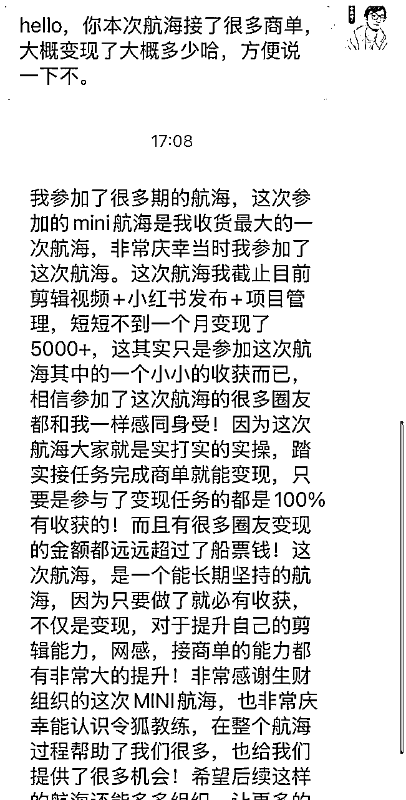
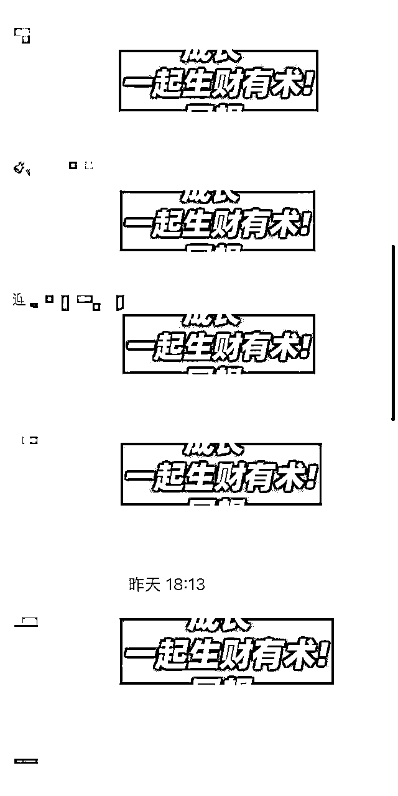

# AI自媒体Mini航海复盘：100多位同学接到商单

> 来源：[https://bchje44bsl.feishu.cn/docx/RJd7d5wbLoixN0xhQS5cWVSWnsf](https://bchje44bsl.feishu.cn/docx/RJd7d5wbLoixN0xhQS5cWVSWnsf)

大家好，我是令狐峰，大家叫我令狐就好，很荣幸作为本次航海的主教练，带领360人下场真的做AI自媒体，副教练是@hawli和@杨辉，我们团队在小红书接过数千条商单笔记。

# 一、小有成就，但路漫漫其修远兮

这次航海，21天的时间，我们带量100多位同学成功接到了商单，50多位同学能长期稳定接到商单，最高变现收益5000；有同学仅凭一条视频就在小红书2天就涨粉5000，后续涨到10000，内容同步发到视频号，涨粉3万。

但是道路且长，目前大家接到的大部分商单价格还在百元级别，

但要知道，目前AI自媒体的行业头部，1条内容制作+全平台同步的报价，最高的的报价20万，也有很多报价10万左右，但是他们团队大部分不超过10人，但年入千万。

我们和他们的本质到底差在哪里？我抛砖引玉一下，欢迎大家在评论区讨论

1.  制作优质内容的能力

1.  1条优质内容可以涨粉10万，变现千万，但是如何做出1条这样优质内容，大家其实缺乏可以实操的路径、

1.  也缺乏勇气、缺乏心态，认为自己做不出来，也不愿意花时间去琢磨，甚至连如何做出1条涨粉1万内容的念头都不敢产生，被视野局限住了

1.  把握机会的能力

1.  AI是百年未有之大变局，他们知道AI的影响会有多深远，从拉长到30年的维度来看AI自媒体这件事情，现在才刚刚开始。

# 二、何以生财，唯有实干

很多人懂得了太多大道理，却依然过不好这一生；在我看来是因为缺乏「干」中学，开始行动，其实是赚钱最好良药。

在确认执行方向已经正确的情况下，比如已经有成立1年左右的AI自媒体团队，能够年入千万；而且大家能够低成本去模仿，甚至投入不超过1万块钱。这种高利润低投入的事情，接下来应该「上下而求索」，毫无保留的实干。

## 1、如何从"想"转向"干"？

很多同学问我，如何迈出第一步？

我的建议是：降低行动门槛，提高行动频率。

降低行动门槛，就是把大目标拆解成小任务。先从发布第一条视频开始；不要想着一开始就月入过万，先从接到第一个100元的商单开始。

提高行动频率，就是增加试错的机会。做AI自媒体，最大的成本不是时间和精力，而是机会成本。每一天的延迟，都意味着错过了一次可能爆火的机会。

做好复盘

可以给自己定一个规则：每天必须进步一些，只要保持进步就是好的开始。对于普通人来说，确实会遇到很多困难。

破局最好的方法就是保持进步，提升自己的能力，之后遇到很多困难就可以轻易的解决。人生没有白走的路。

## 2、「上下而求索」的三个层次

第一层：症状解式的实干

这是最基础的实干，就是"头痛医头，脚痛医脚"。看到别人做AI自媒体赚钱了，我也要做；看到某个视频火了，我也要模仿。这种实干虽然简单粗暴，但往往是新手入门的必经之路。

在我们这次航海中，很多同学就是从这个层次开始的。他们看到教练分享的案例，立刻就去模仿制作。虽然一开始效果不好，但这种"先动起来"的心态是非常宝贵的。

比如1条视频涨粉1万的方法，也是按照这个思路去做。

第二层：杠杆解式的实干

这是更高级的实干，懂得借力打力。不是盲目地重复劳动，而是找到能够放大效果的杠杆点。

比如一条内容爆发了之后，可以思考，思考一下到底是什么原因爆的，能不能打磨出一种内容形式，持续复用这种形式，持续出爆款；也可以思考一下，能不能多起几个号，发把这条内容微调一下，再发一遍。这样一来，同样的1条爆款，可能就多起了几个小号作为备用。也可以。

还有同学学会了利用AI工具的杠杆。他们不是简单地用AI生成内容，而是用AI来优化自己的创作流程：用AI来做选题分析、用AI来优化文案、用AI来生成多个版本进行A/B测试。这样的实干，效率提升了10倍不止。

第三层：系统解式的实干

这是最高级的实干，让事情自然而然地发生。不再是被动地执行任务，而是主动地设计系统，让整个流程变得自动化、标准化。

我们团队就是这样的例子。我们不是简单地接商单、做内容，而是建立了一套完整的AI自媒体运营体系：从选题策划、内容制作、数据分析到商务合作，每个环节都有标准化的流程和工具。很多事情就会快速推进。

## 3、实干的复利效应

很多人以为做AI自媒体就是简单的重复劳动，但实际上，每一次的实干都在为你积累三种资产：

技能资产：每一次的制作过程，都在提升你的内容创作能力。从选题、脚本、制作到发布，每个环节的熟练度都在提升。这种技能的积累，是任何人都拿不走的财富。

内容资产：每一条发布的视频，都是你的数字资产。不用你解释，别人就可以了解你，认识你。

关系资产：每一次的互动，都在为你建立人脉网络。粉丝、同行、品牌方，这些关系在未来都可能成为你的商业机会。

正如亦仁说的："利他，长期主义，做对别人有价值的事情。"当你持续地为用户创造价值时，商业回报自然会跟随而来。

# 三、给新手小白一些航海建议

作为这次航海的教练，我深深感受到新手小白的困惑和焦虑。在这个看似门槛很低，但实际竞争激烈的领域，新手往往不知道从何开始，也不知道如何避免常见的陷阱。基于我在这个行业的观察和经验，我想给所有新手小白一些实用的建议。

## 1、95%的问题AI都有答案，试试多问问AI

如果你想实时获得答案，可以试着多问问AI，无需等待。

当你发现无需等待的时候，你会逐渐进入心流状态。

当你进入心流状态，你就发现做事情的效率提高了5倍~10倍。

## 2、从模仿开始，但要理解背后的逻辑

对于新手来说，最快的学习方式就是模仿。但这里的模仿不是简单的复制粘贴，而是深度的学习和理解。

首先，你需要选择合适的模仿对象。不要盲目追求大V，而要选择近期爆过的内容，要相信，近期爆过的内容一定会再爆。观察他们的内容结构爆点、表达方式、视觉呈现，思考为什么他们这样做。

其次，要理解模仿的边界。你可以学习对标达人框架和套路，但内容必须是你自己的。你可以参考他们的表达方式，但观点必须是你自己的思考。模仿是手段，不是目的。

最后，要在模仿中寻找自己的特色。每个人的经历、性格、观点都是独特的，这些独特性就是你区别于其他创作者的核心竞争力。在模仿的过程中，要逐渐加入自己的元素，形成自己的风格。

## 3、工具是放大器，不是万能药

AI工具的出现，大大降低了内容创作的门槛。但很多新手对AI工具有两种极端的态度：要么过度依赖，认为有了AI就能轻松赚钱；要么完全排斥，认为用AI就是作弊。

这两种态度都是错误的。AI工具的本质是效率工具，它能帮你快速生成内容框架，提供创意灵感，优化表达方式。但它不能替代你的思考，不能替代你的经验，更不能替代你的个人特色。

正确使用AI工具的方式是：用AI来辅助你的创作，而不是替代你的创作。用AI来提高你的效率，而不是降低你的标准。用AI来扩展你的可能性，而不是限制你的创意。

记住，AI工具只是工具，真正的价值还是在于你的思考和洞察。那些能够深度思考、有独特见解的创作者，无论用不用AI，都能创作出有价值的内容。

## 4、内容为王，但要理解什么是好内容

"内容为王"这个概念大家都知道，但什么是好内容，很多新手并不清楚。他们往往以为好内容就是制作精美、信息丰富的内容，但实际上，好内容的标准要复杂得多。

从用户的角度看，好内容应该能够解决他们的问题，满足他们的需求，或者给他们带来价值。这个价值可能是知识，可能是娱乐，也可能是情感共鸣。

从平台的角度看，好内容应该能够吸引用户的注意力，促进用户的互动，提高用户的留存。这就要求内容不仅要有价值，还要有吸引力。

从创作者的角度看，好内容应该能够体现你的专业性，建立你的个人品牌，实现你的商业目标。这就要求内容要有一致性和持续性。

所以，好内容是一个多维度的概念，需要在用户价值、平台规则、个人目标之间找到平衡。

## 5、平台选择要务实，不要贪多

很多新手在选择平台时会陷入选择困难症：小红书、抖音、视频号、B站、知乎...每个平台都有自己的特色和机会，到底应该选择哪个？

我的建议是：不要贪多，专注一个主平台。选择平台的标准很简单：哪个平台你最熟悉，就选哪个。熟悉意味着你了解用户喜好，了解平台规则，这样你的成功概率会更高。

当你在主平台站稳脚跟之后，再考虑拓展到其他平台。但即使拓展，也要采用"一主多辅"的策略，主平台投入80%的精力，辅助平台投入20%的精力。

记住，与其在十个平台都做得平庸，不如在一个平台做到优秀。深度比广度更重要，专业比全面更有价值。

## 6、数据很重要，但不要被数据绑架

数据是内容创作的重要反馈，但很多新手会被数据绑架。看到播放量低就沮丧，看到点赞少就怀疑自己，换衣账号，看到别人的数据好就焦虑。

这种心态是不健康的。数据只是结果，不是目的。你的目的是通过内容创作实现价值，无论是经济价值还是个人价值。数据只是帮你了解用户反馈，优化内容方向的工具。

而且，数据有滞后性和偶然性。一个新账号，前期数据肯定不会太好，这是正常的。一条内容表现不好，也不代表你的方向有问题。要用发展的眼光看数据，用系统的思维分析数据。

正确的数据观应该是：短期看趋势，不看绝对值；长期看积累，不看单次表现；对比看相对值，不看绝对值。

## 7、社群的力量不可忽视

做内容创作是一个相对孤独的过程，特别是对新手来说，很容易在困难面前放弃。这时候，社群的力量就显得尤为重要。

一个好的社群，不仅能提供技术支持和经验分享，更重要的是能提供情感支持和精神鼓励。当你遇到困难时，有人能给你建议；当你取得进步时，有人能为你庆祝。

但要注意，不是所有的社群都是有价值的。有些社群充斥着无效信息和负面情绪，不仅不能帮助你，反而会拖累你。选择社群时，要看重质量而不是数量，要看重氛围而不是规模。

在社群中，要做一个积极的参与者，而不是被动的接受者。主动分享你的经验，积极回应别人的问题，这样你才能真正从社群中获得价值。

## 8、耐心是最稀缺的品质

在这个快节奏的时代，耐心变成了最稀缺的品质。很多人做了一个月没有起色就放弃了，做了三个月没有爆款就转行了。但内容创作是一个需要时间积累的过程，急功近利往往适得其反。

成功的创作者都明白一个道理：今天的努力，可能要在很久以后才能看到结果。但这不意味着努力是无效的，而是说效果有滞后性。你的每一条内容，都是在为你的个人品牌添砖加瓦。

巴菲特有句名言："别人贪婪时我恐惧，别人恐惧时我贪婪。"在内容创作领域也是如此，当大多数人因为没有立即看到效果而放弃的时候，正是你坚持下去的最佳时机。

给自己设定一个合理的时间期限，比如6个月或者1年，在这个期限内专心做内容，不要急于求成。相信时间的力量，相信积累的价值。

## 9、保持学习，但要有选择

AI自媒体是一个快速发展的领域，新的工具、新的方法、新的机会不断涌现。保持学习是必要的，但学习也要有选择性。

不要什么都学，要学会筛选。优先学习那些能够直接提升你内容质量的技能，比如写作技巧、视觉设计、数据分析等。其次学习那些能够提高你工作效率的工具，比如AI写作助手、视频剪辑软件、数据分析工具等。

不要什么都信，要学会判断。网上的信息良莠不齐，有些是真正的干货，有些是过时的方法，还有些是纯粹的营销。要培养自己的判断能力，多实践，多验证。

不要什么都追，要学会专注。新的热点、新的工具、新的机会层出不穷，但你的时间和精力是有限的。要学会说不，专注于那些真正重要的事情。

## 10、相信自己，但要保持谦逊

最后，我想说的是心态问题。做AI自媒体，既要相信自己，也要保持谦逊。

相信自己，是因为每个人都有自己的独特价值。你的经历、你的观点、你的思考，都是独一无二的。不要因为自己是新手就妄自菲薄，也不要因为别人的成功就怀疑自己。

保持谦逊，是因为这个行业变化太快，没有人能够永远站在顶峰。今天的成功不代表明天的成功，今天的方法不代表明天的方法。要时刻保持学习的心态，保持开放的思维。

记住，成功不是一蹴而就的，而是日积月累的结果。每一个现在看起来成功的创作者，都有过默默无闻的时光。他们和你的区别，不是天赋，而是坚持。

给所有新手小白一句话：相信时间的力量，相信积累的价值，相信自己的潜力。只要你开始了，你就已经超越了90%还在观望的人。路虽远，行则将至；事虽难，做则必成。

# 四、最后的总结

写到这里，我想起了《道德经》中的一句话："千里之行，始于足下。"AI自媒体这条路，看起来很长，但只要你迈出第一步，就已经在路上了。

这次航海，我们带领360人下场真的做AI，虽然成果喜人，但我知道这只是开始，十万里长征迈出了第一步。真正的考验在后面，在于每个人能否坚持下去，能否在这条路上走得更远，走得更好。

我相信，每一位参与航海的同学，都有成为优秀创作者的潜力。差别只在于，你是否愿意为这个潜力付出足够的努力和时间，你是否能够在困难面前坚持下去，你是否能够在成功面前保持清醒。

最后，我想用马云的一句话来结束这篇复盘："今天很残酷，明天更残酷，后天很美好，但绝大部分人死在明天晚上，看不到后天的太阳。"

在AI自媒体这个赛道上，今天的竞争很激烈，明天的挑战会更大，但后天的机会也会更多。关键是，你能否坚持到后天，能否看到后天的太阳。

最后感谢生财有术的组局，感谢生财工作人员宝芙。