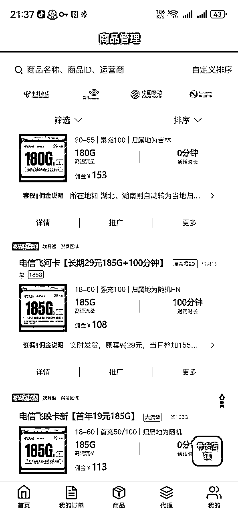
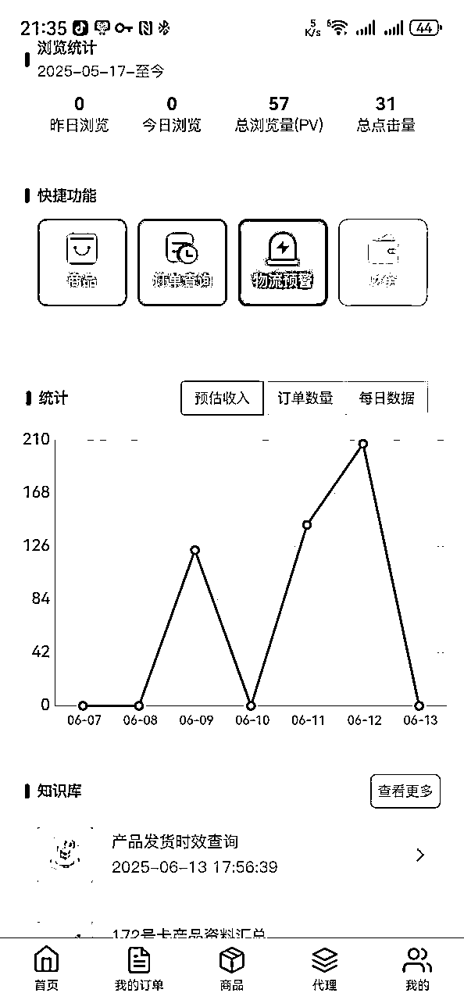
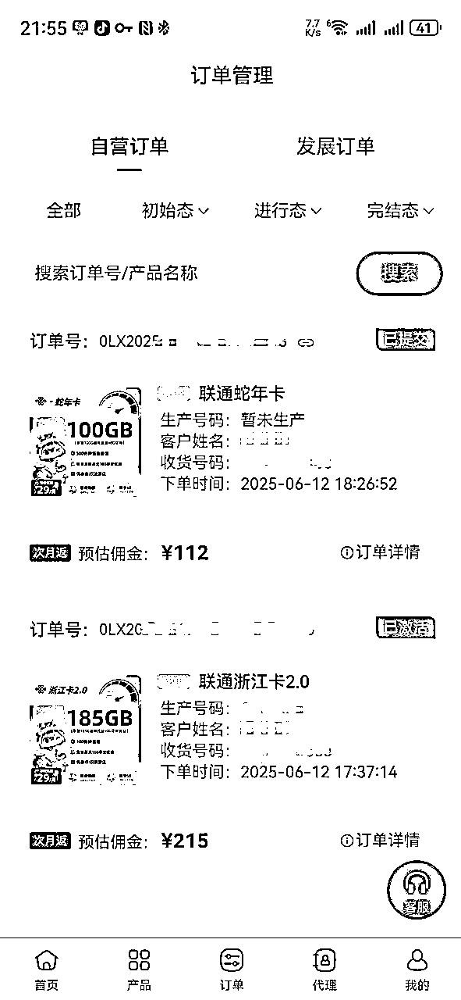
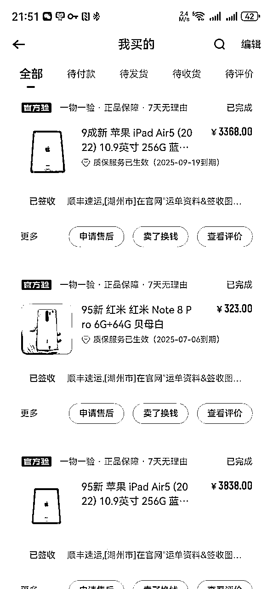

# 分享自用的低成本、低风险解决注册卡/流量卡/备用机的方案

> 来源：[https://awqj4zdv04n.feishu.cn/docx/RkModMO2LoFwafxUGkpcxonlnLh](https://awqj4zdv04n.feishu.cn/docx/RkModMO2LoFwafxUGkpcxonlnLh)

* * *

最近在参加小红书虚拟资料航海，发现其实很多人有在纠结手机卡、流量卡、备用机等的办理或选择。这种东西其实没啥好纠结的，不过总归还是有不少小伙伴想要尽可能的低成本、低风险、高效率的开始实操，而有些东西其实就是一些实操细节或者是小小的信息差，点破了/学会了，其实没啥好纠结的。

今天给大家分享一套低成本、甚至零成本解决注册卡/流量卡，低风险解决备用机的方案，这是我自用的方案之一，提供给大家参考，可以根据实际情况选择。

* * *

# 一、 关于注册卡/流量卡

### 普遍存在的困境

*   如果只办注册卡：一般推荐的都是电信无忧卡（5元月租），或者移动联通的8元套餐号卡，或者京东的5元号卡（用的联通网络，无流量无语音）。但关键问题是，这些卡虽然月租低，但是没有大流量。

*   如果需要大流量：同时办流量卡和注册卡，这无疑增加了号卡管理麻烦和成本。即使单独办流量卡，营业厅可办的流量套餐，费用可能较高，而且动不动就涉及合约或者是宽带融合套餐，环节变多，多了不必要的累赘。

### 更好的选择：互联网流量卡

有一个很好的办法能解决，有些小伙伴应该办过或听说过互联网卡/校园卡/政企卡等，这些卡套餐资费划算，流量大，甚至还包含免费语音通话时间。

但有的小伙伴会说了，这些卡有些资费也不低，甚至合约期也久，万一项目实操过程中被封或者收益不理想，还是想节省成本/降低风险怎么办？

### 核心技巧：

其实很简单，生财也有其他圈友分享过相关内容，首先需要知道：这些流量卡你办卡后，你的推荐人都是有相应佣金的。

那既然有佣金，何不自己办自己拿佣金呢？既解决项目号卡问题，又降低成本，一举两得。其实也就是一个小小的信息差，可能很多人已经知道了但是没想到，或者就是缺乏对一些细节的了解。

* * *

# 二、 具体操作和注意事项

### 号卡推广平台

圈内之前也有人分享过，这里放几个我目前在用的：

*   172号卡平台：老平台，名气比较大，时间也比较久的一个平台了，佣金相对较高，未含税。注册链接

*   号易平台：老平台，号卡套餐数量多，佣金未含税。注册链接

*   卡业联盟：产品多，佣金尚可且免税，且有校园卡政企卡资源。注册链接

*   林夕号卡：佣金相对还行且免税，提现较快。注册链接

*   卡多多平台：佣金未含税，有部分校园卡资源。注册链接

注意：号卡平台还有很多，大家选择的时候务必要综合判断，比如平台创建时间、号卡套餐数量、提现门槛、有无资质、公司实力等等。篇幅有限，这里就不过多赘述了，大多信息通过互联网以及相关平台都能检索到。

### 【重点】选卡时的注意事项

选择号卡的时候，务必要关注以下几个点（本篇面向的是办理号卡用来实操项目的小伙伴，所以注意事项要求是比较有针对性的，如果你有自己个性化的需求，就需要自行调整选卡标准）：

1.  合约期：尽量选择无合约期或者合约期较短的。

1.  禁发地区：不同卡有不同的禁发地区。

1.  发货地区：有的卡是仅发指定区域的。

1.  首充金额：尽量选择首次充值金额较少的，比如50/100元等。

1.  办卡年龄：有些卡是限制年龄段的，不够或者超龄都办不了。

1.  一证五户限制：同一运营商同时只能办5张卡（比如电信5张、联通5张、移动5张），超出办不了。

1.  激活方式：有的卡是快递激活（快递员上门），有的卡是自助激活（自己按说明书操作），后者更方便。

1.  套餐优惠：尽量选择可查优惠或者直接减免的，不要选优惠实现比较复杂的（比如每月月底店铺返现/充xx每月赠送xx等）。

1.  流量属性：大部分流量卡的流量组成是通用流量+定向流量，部分可能还有地区专属流量，尽量选择通用流量多的。

1.  佣金税率：有些平台号卡佣金显示的是税前佣金，在你提现的时候会要扣除2%~6%不等的税率。如果是追求极致性价比的圈友，要多平台对比佣金，这个务必要注意。

1.  成本计算举例

注意计算税后佣金与合约期的比例，尽量让佣金能够覆盖掉合约期内的所有开销。

*   比如：税后佣金120元，月租29元，合约期3个月。

*   合约期内总支出为：3×29=87 元。

*   收益为120元，最后还盈余 120−87=33 元。

*   那么你可以选择及时注销办理新卡，注册的账号换绑手机号即可。也可以根据实际情况选择长期持有。

*   再比如：税后佣金120元，月租29元，合约期6个月。

*   合约期内总支出为：6×29=174 元。

*   折算到每个月支出为：(174−120)÷6=9 元。

*   相当于9元/月，解决了注册卡和流量卡2大问题，保证平台账号注册+项目所需流量的双重用途。

### 办理实操讲解：

以我自己举例，比如我在浙江杭州，那么办理号卡时首先我会有以下标准：

*   收货地支持浙江、杭州

*   首充金额100以内

*   办卡年龄符合我这把岁数的（虽然还年轻，哈哈）

*   我几个运营商都没满5户，所以都选哪个运营商都没啥问题

*   一般我都在家里或者店里，激活方式对我无所谓（如果你上班不方便，那么可能自主激活的更适合你，或者跟快递员协商上门激活时间）

*   套餐我会选直接优惠的（别问，问就是懒，怕复杂了到时候记不住）

*   然后因为是项目前期测试，所以我会把合约期锁定在6个月以内，常见的即无合约、3个月、6个月。那么成本倒推，有以下几种情况：

*   无合约：那就无所谓佣金多少（当然越多越好），随便办

*   3个月合约：

A. 19元月租：那么3*19=57，只要佣金大于57的，我随便挑（越高越好）

B. 29元月租：那么3*29=87，佣金大于87的随便挑（越高越好）

*   6个月合约：

同理，都是小学数学，大家自行计算啦

总之，在各种注意事项下，选择最优的号卡即可。如果有特殊需求的，按你们自己实际情况来，但是办卡前务必查看清楚套餐详细资料，如有不确定的，可以联系平台客服进一步确认。

（以上案例金额仅供参考，实际以各位选择的平台和号卡套餐为准。）

* * *

# 三、 关于备用机

解决了号卡的问题，接下来是移动设备的问题。对于很多小伙伴而言，肯定是成本尽可能低，才符合大家的预期，那么二手机就是一个更合适的选择了。

这里有很多小伙伴比较纠结的一个点是：因为对于小红书平台，严重违规可能会封禁设备，即该设备登录任何账号都会秒封。那如果说买回来的二手机，已经被小红书平台封禁设备，那么影响就非常严重，相当于白买了。而类似于闲鱼等二手交易平台，大都是不支持退换的，那么损失惨重。而且很多小伙伴并不具备专业鉴别机器的能力，在二手机市场中尤其是iPhone二手市场的水又很深，所以更加会增加选择困难。

那么对于没那么懂行的小伙伴来说，转转这类官方平台，可能就更加合适一点了。

转转本身支持7天无理由退换，且退货包运费。虽然有些机器价格会比个人玩家的二手机价格略贵，但至少相对来讲更靠谱一点，对于小白朋友来说更加省事，风险更低。

如果发现设备已被小红书封禁，那么还能退回去，换其他机器，这样基本没有什么损失。

如果设备性能不符合预期，也能退回去，换机调整，比较灵活。

这里为避免纯广告嫌疑贴个我自己的订单截图，我自己很多机器就是转转买的，除此之外当然闲鱼/酷安等平台也会选择。以上经验建议仅供大家参考哦~

* * *

# 四、总结

以上，通过跨行业资源的整合利用，我们解决了小红书虚拟资料项目的注册号卡、流量卡问题，能够较低成本甚至零成本、微盈余的持有手机卡，同时也大大降低了二手机购买的门槛和风险。整体实现能够让小伙伴们更加低成本、高效率的进行项目实操，尽快实现从0到1的突破，进而在过程中小步快跑，快速迭代，而不是过多的纠结前期的投入、成本、风险等问题。希望能够给大家一些启发和帮助。