# 大火赛道Baby Podcast最全拆解

> 来源：[https://rcnceg0u9uzz.feishu.cn/docx/QYUSdAaw0oqRQvxlfswcmTJcnph](https://rcnceg0u9uzz.feishu.cn/docx/QYUSdAaw0oqRQvxlfswcmTJcnph)

# 1 Baby Podcast赛道概述

Baby Podcast顾名思义，是萌宝作为电台主持的听众节目。最初是在tk上爆火，以知名的成人电台音频+萌宝的画面，形成强烈的反差幽默。最近油管上也开始逐渐有类似的频道和视频出现，有流量增长趋势，比如图二的频道，近期发的baby podcast长视频属于流量异常值，明显比他其他长视频流量好。Trending Tot Pop这个频道近期shorts有千万、百万爆款，长视频看得出在测试baby podcast，也比他之前的视频流量好。

现在已经有用萌宝、名人宝宝重构知名播客、最新国际新闻、反差独白等各种内容创意，大家可以结合自己的赛道尝试组合爆款元素试试效果。今天这篇文章就是结合了我之前名人赛道的经验，把Baby Podcast完完整整拆解了，食用愉快。

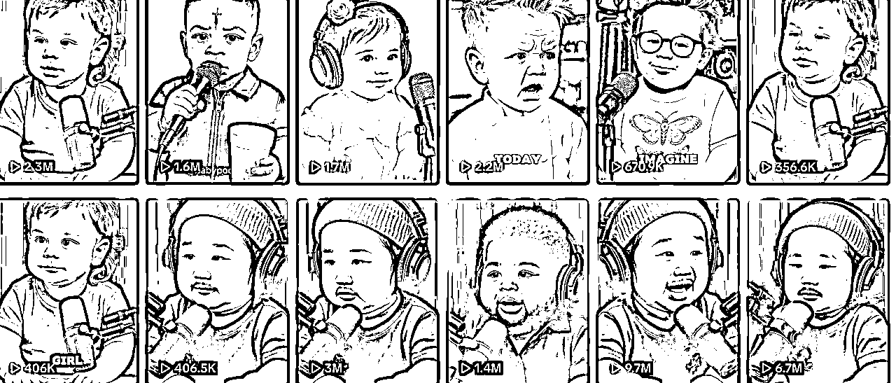

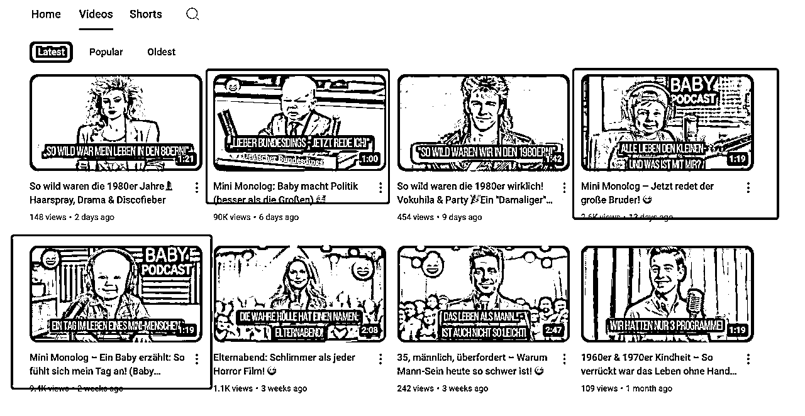

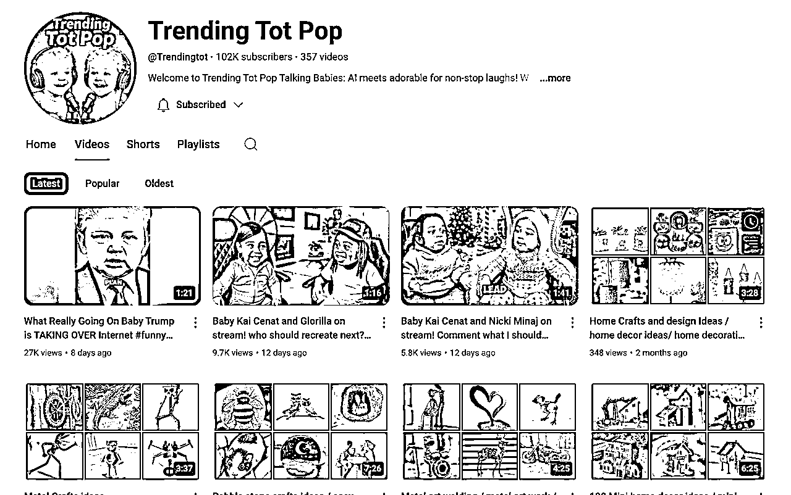

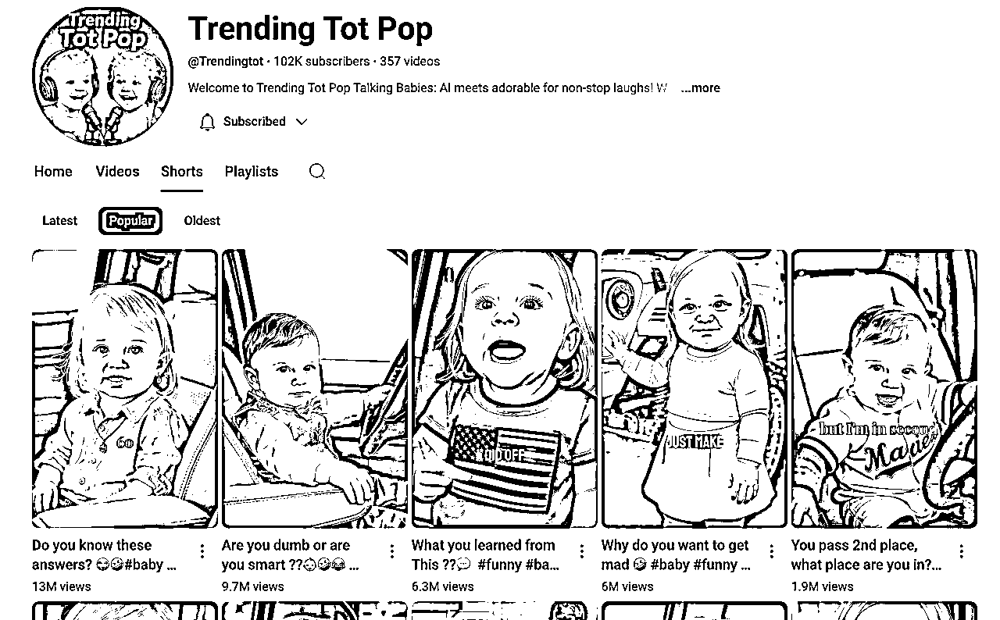

# 2 成品

说明：2个长视频使用hedra对口型，shorts使用即梦对口型，供大家对比平台参考

# 3 实操指南

## 3.1 音频来源

播客最重要的就是音频，音频决定了视频的内容，我以视频常见的三种创作方式来举例：

### 3.1.1 全网找素材

特朗普在美国时间5月24日发布了一个X，是他向陆军学院2025届毕业生发表讲话的视频。全程有1小时35分钟，我拖拽跟他有关的片段然后反复听了几遍，他果然没让我们失望，确实又给了一点没到“语出惊人”程度但也有意思的料。有兴趣可以去看，我就直接把我要的这个片段用obs录屏分离出音频给到gemini，以下是中文总结，在剪映里分离音频稍作剪辑达到可用即可。

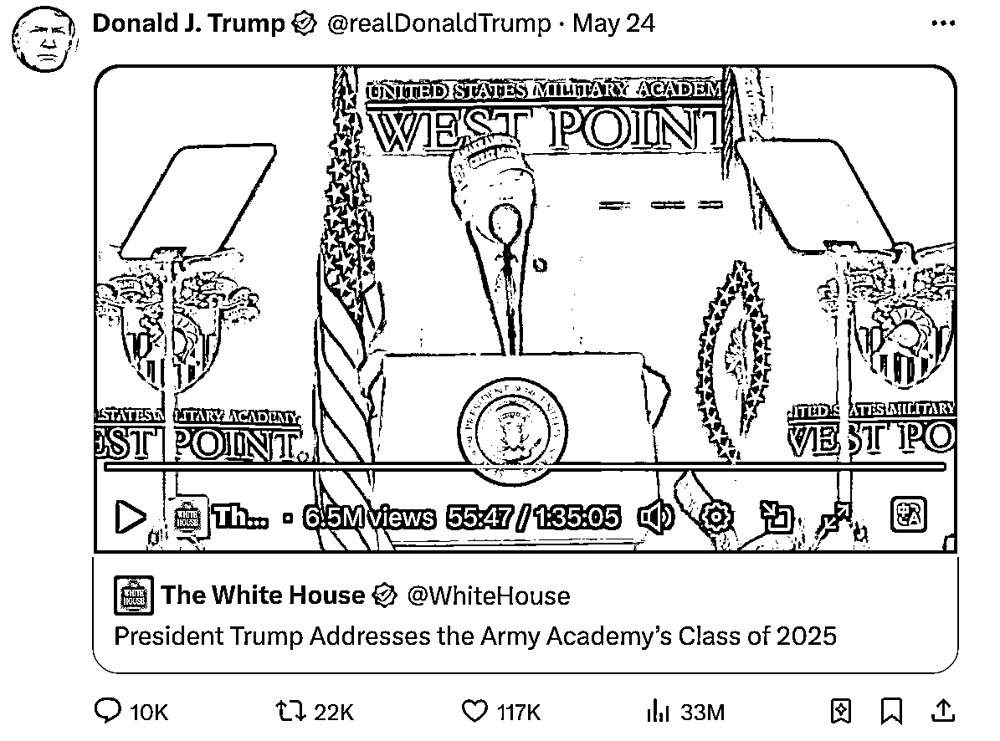

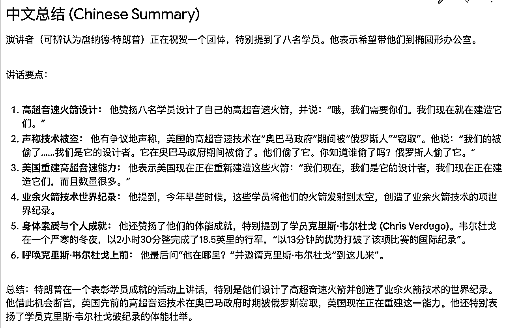

### 3.1.2 对标音频改角色

如果你有一个对标的shorts，想直接使用对标的音频，做画面和角色的二创，比如以下这个1300万的爆款，是女孩诱骗男孩说出“19”的一段对话，那么直接剪映分离音频即可。

### 3.1.3 对标音频二创

这是使用德国总理长相类似的宝宝在讲述人们应该释放压力、呼吁不要卷的德语长视频，6天9万还在跑量，性价比还是很高的。把原视频放到gemini里面，拿到音频原文，想好你要改的创意，比如我更改的是特朗普作为电台主持来呼吁不要卷，用英文，那么我们可以直接让gemini帮我们出一个特朗普口吻的英文改写版本。我们现在拿到的是文案，这里还要涉及生成音频的环节，如果直接使用其他人物的音频，我们常常用elevenlabs，如果使用名人比如特朗普，我们就需要使用Jammable这个工具，他内置了特朗普的声音。如果你使用了其他平台你会知道很多工具都无法克隆名人声音。这个我找了很久，也没找到第二个，有小伙伴发现了其他工具可以补充。

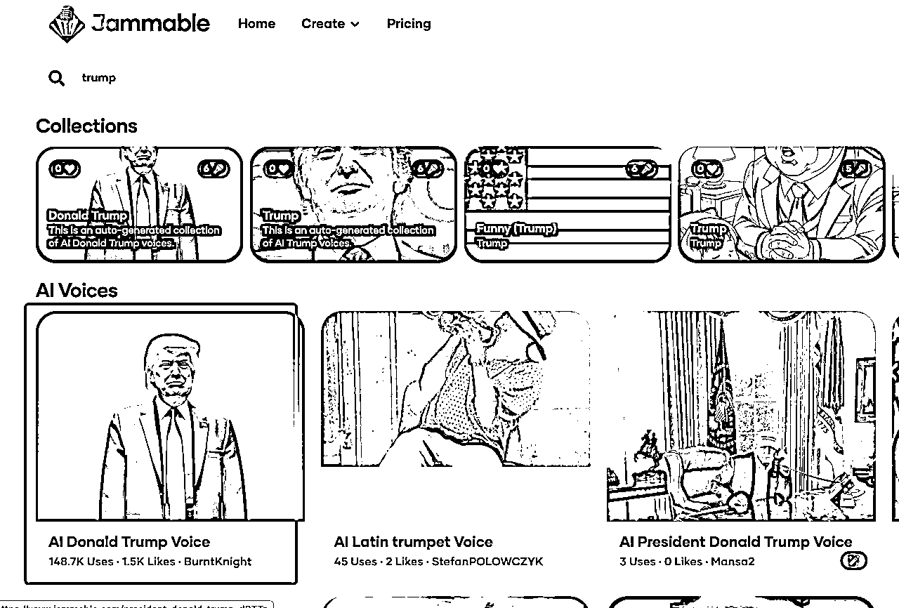

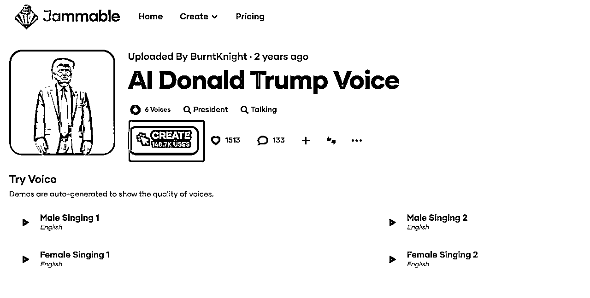

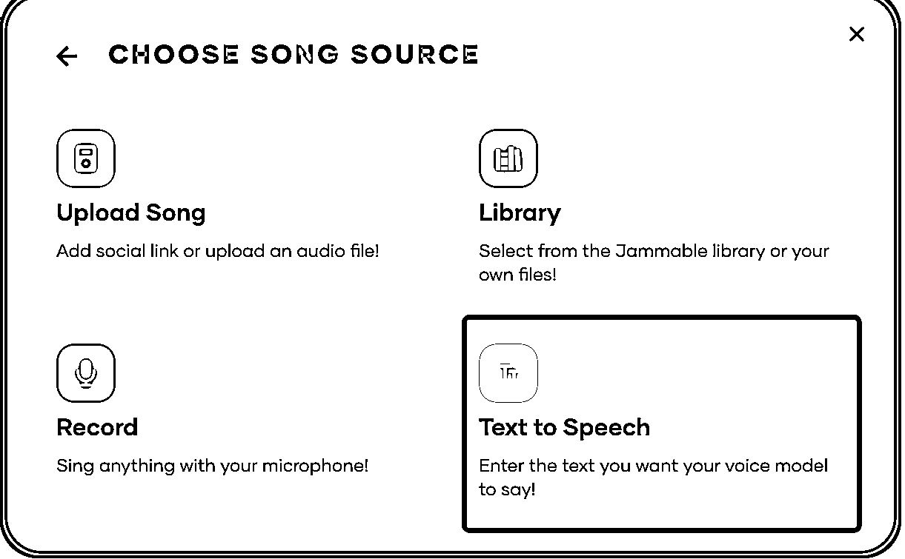

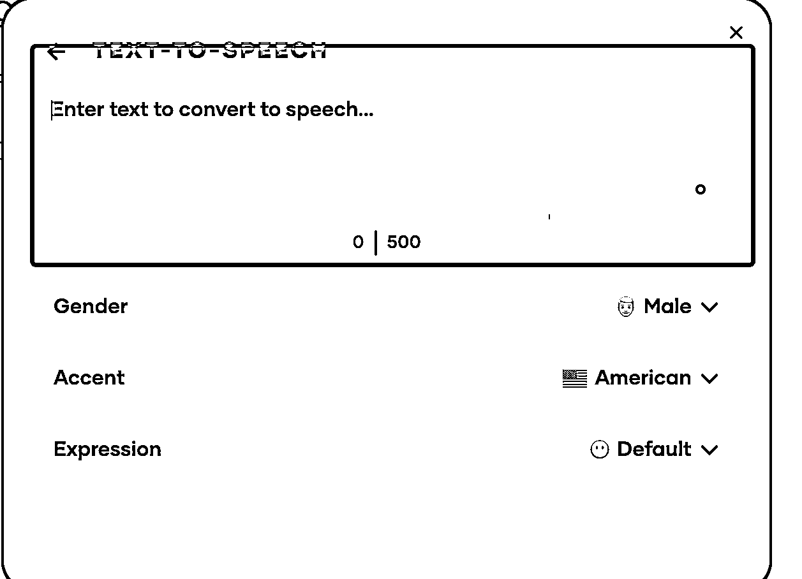

## 3.2 生成播客图片

### 3.2.1 文生图指令词

如果你要改编对标的图片，丢到Gemini或其他大模型，用这个指令词：

请你描述图片中的人物特征，包括外貌，服装，造型、年龄等，给出文生图的中英文指令词

如果你要原创一个新的图片，丢到Gemini或其他大模型，用这个指令词：

我需要你提供一個文生图的提示詞。提示詞中:一个婴儿坐在有麦克风的书桌前，他所在工作室中，墙上有写着“baby podcast”的霓虹灯，（婴儿的外貌特征、服装、年龄等，如果是模仿名人，比如模仿特朗普，就说长得像特朗普）

这个指令词很简单，建议与大模型直接对话丰富细节来完成你最终要的效果。

### 3.2.2 生成图片

这里只有一个细节需要注意，如果是生成名人类宝宝，我们在提示词里注重使用“长得像”、“神似”某某名人基本各大平台都能支持，成人则基本都实现不了。遇到你常用的平台都生成不了你要的图片效果，请记住直接使用sora，带完整名人名称都没有任何问题。

## 3.3 生成视频

### 2.3.1 音频素材

这一步是准备音频切割的片段，为什么要音频切割，两个原因：

1.  如果使用的是即梦对口型，只支持一次生成15s片段，如果使用的是免费版的hedra，只支持一次生成20s的片段，付费版的我目前最长一次行生成了1分24秒的片段

1.  有的视频的是两个角色甚至多个角色，不同角色使用不同图片来对口型，也需要准备不同的音频片段。

如果直接使用对标视频，那么我们可以直接使用智能分割来完成多角色的视频切割，然后我们点击分割后的视频片段一个个导出（有点繁琐，有更好的方式可以分享）。然后我们保存到文件夹，把.mp4的格式改成.mp3，就准备好了音频素材。其他素材就手段切割一下按照不同平台是使用要求来准备不同时长的片段。

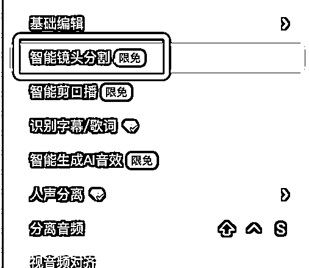

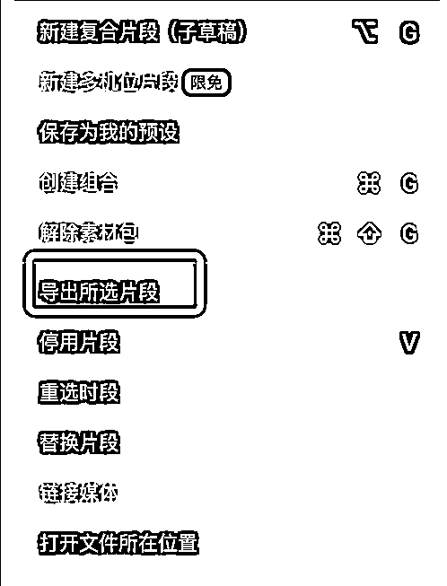

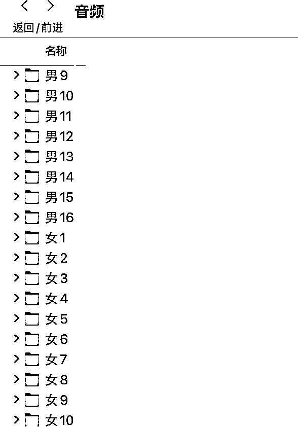

### 3.3.2 对口型

输入以下指令词完成对口型视频的生成：

A host with natural hand gestures while speaking, including open palm movements for explanations, subtle finger taps to emphasize points, and relaxed hands resting on the table between gestures. Ensure precise lip-sync with the audio, incorporating occasional head nods, slight eyebrow raises, and micro-expressions (e.g., soft smiles or furrowed brows) for added realism. Maintain fluid motion and natural pacing, with consistent eye contact and minimal stiffness.

主持人讲话时应保持自然的手势，包括解释时张开手掌的动作、强调要点时用手指轻敲的动作，以及在手势之间将手放松地放在桌子上。确保口型与音频精确同步，偶尔点头、微微扬眉以及微表情（例如，微笑或皱眉）以增强真实感。保持流畅的动作和自然的节奏，并保持眼神交流，尽量减少僵硬。

## 3.4 剪辑

剪辑就是注意一个点，因为生成的对口型视频都是带声音的：

1.  如果直接使用对标音频，则对口型视频都静音

1.  如果使用的是对口型视频的声音，则保留

剩下的剪辑就看大家平时习惯的花活了，比如要加什么样的字幕。

## 3.5 使用工具汇总

| 目的 | 平台 |
| 文案 | gemini/chatgpt |
| 图片 | 即梦/sora |
| 音频 | elevenlabs/jammable |
| 对口型视频 | 即梦/hedra |
| 剪辑 | 剪映/capcut |