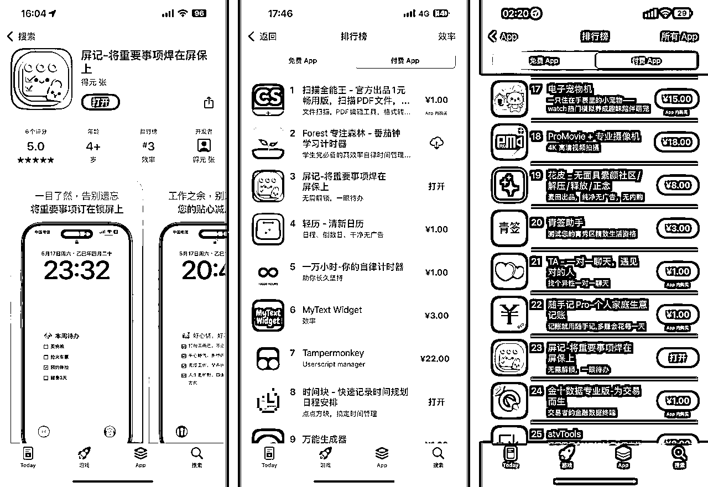
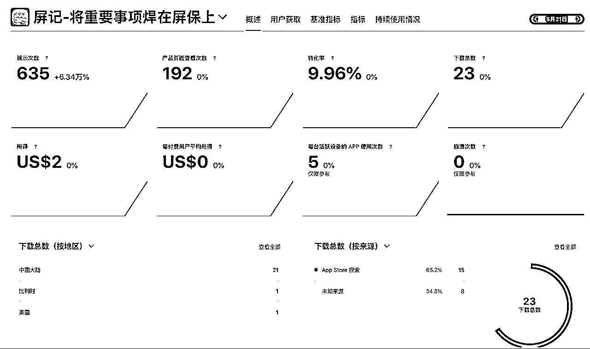
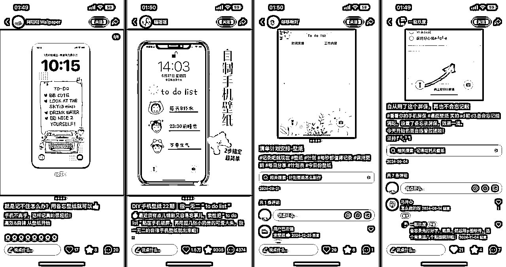
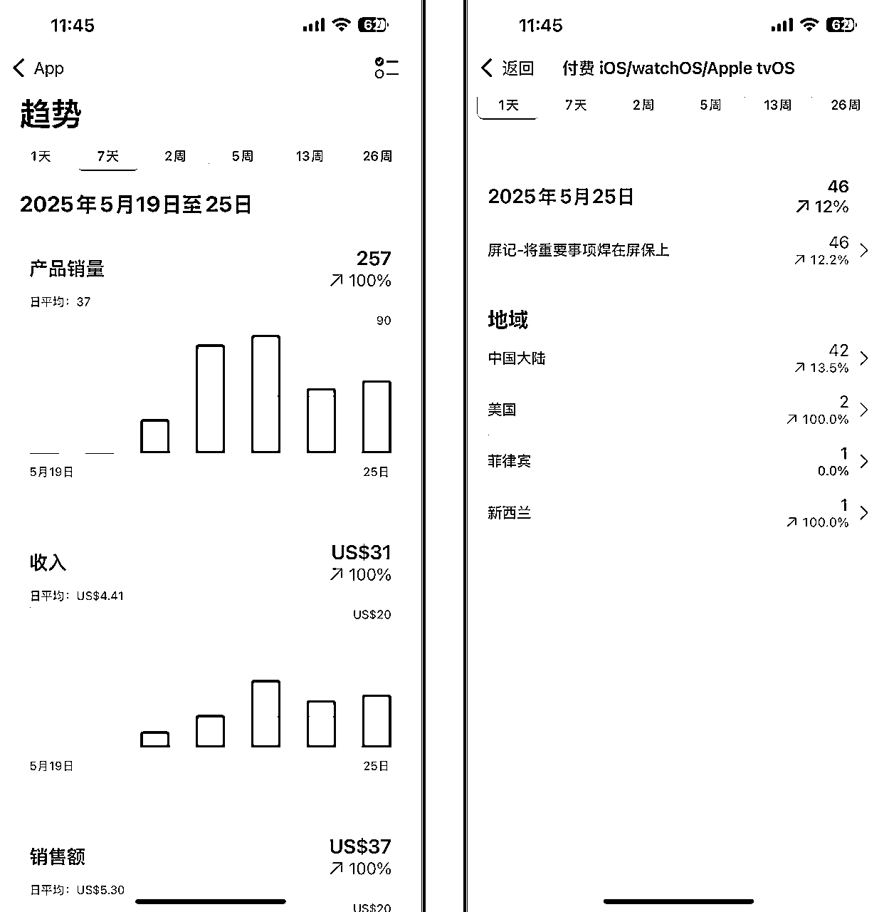
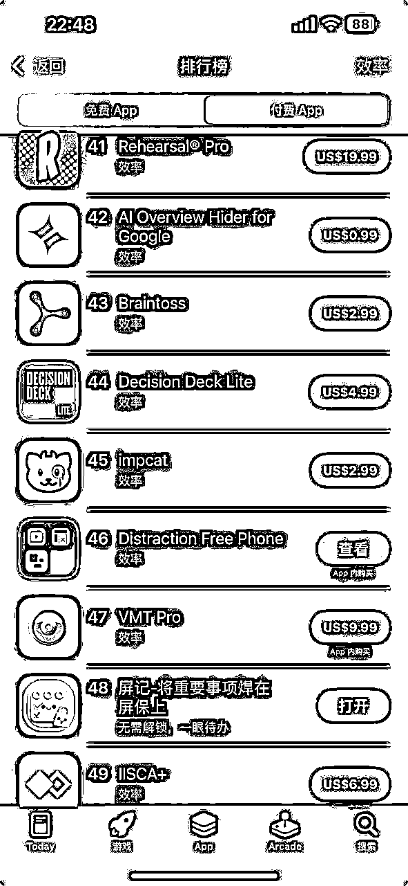

# 0代码上付费榜Top3无保留分享，及新人避坑建议

> 来源：[https://xcnux4clg18l.feishu.cn/docx/THbodDPenoJfcKx5YEkcL4pVnHg](https://xcnux4clg18l.feishu.cn/docx/THbodDPenoJfcKx5YEkcL4pVnHg)

## 一、写在前面

### 1.0 本文主要包括 4 大点

1.  新人如何上 AppStore 付费榜

1.  通过屏记 app 案例论证（包括具体数据下载量、收入等）

1.  新人cursor实操重点事项（技巧、避坑等）

1.  我的认知/成长。

### 1.1 屏记 app 的冲榜之旅

先给新人来一把激励！

1.  5 月 21 号，上架当天就到了 AppStore “效率”分类付费榜 25，22 号跑进了榜 4，从昨天开始就一直维持在第 3 名的位置，第一名是“扫描全能王”，第二名是“Forest 专注森林”，好家伙，都是大哥级别的存在😭。

1.  对于屏记来讲，好消息是它的排名仍在持续上升，这怎么看的？看付费总榜，屏记一路呈上升趋势，目前冲进了总榜 23。坏消息是，“扫描全能王”同时也是总榜第 1，“Forest 专注森林”是总榜第 6，这就相当于，你是班里的第 3 名，班里第 1 名刚好也是全校第 1 名。看样子，屏记的冲榜之旅大概止步于此了。

1.  细心的你，可能注意到了我上面写的是，“对于屏记来讲”，因为整个冲榜过程，你有种屏记似乎是自己的“孩子”的感觉，它初生牛犊不怕虎，在战场上奋力拼杀，在榜单上默默艰难爬升，再看一眼 logo，似乎它有自己的生命力，所以就从它的视角进行了表述。说起来，这种感受体验也算是一种意外的收获吧。



### 1.2 自我介绍

1.  坐标上海，8 年产品经理经验，没敲过 1 行代码，屏记是我的第一款 app。对国内语音直播、社交业务玩法商业化较为熟悉，做过 10w+粉丝的视频号、小红书（2 个 1k+粉丝账号）、抖音（1 个 1000 粉丝账号），AIGC 爱好者。

1.  加入生财差不多半年，全职互联网创业中（接下来聚焦出海 web），可以说，新人的坑基本都没落下。

1.  关于我一个 10 年社畜选择主动脱离职场，心路历程，我会放在末尾。

## 二、0 代码基础，0 推广基础也能上 AppStore 付费榜

### 2.1 真的是 0 代码？

1.  从创建文件到上架，凭借 cursor，确确实实是没写一行代码。

1.  我原以为，利用AI，0 代码写 app 在我圈子里应该不足为奇，但实际远远不及我的预期，不仅是小红书上被很多人质疑，甚至是以前的互联网老同事们，有的甚至在互联网行业扎根十多年，都会问上架苹果遇到不少麻烦吧，而实际上这一环节应该算是最为简单的环节了。

1.  我不由感叹信息茧房的严重性，也想起亦仁说过，新手最容易预设很多不存在的问题。还有，一些所谓过来人的经验，在快速发展的今天正在贬值。

### 2.2 建议 0 代码吗？

1.  新人怎样看待0代码这件事：

1.  如果你对开发产品有兴趣，比如就想体验下自己做一个网站，或者类似记事本、计算器那类APP，那完全可行。这会给你带来正反馈，你无需任何代码知识。但可能很多人和我一样，是下面第二种情况。

1.  因为碍于自己不会代码一直做不了产品，现在一听AI好厉害，一上来就做自己想做的APP，直接上难度，好嘛，那你多半会半路放弃，然后骂骂咧咧不屑道，“切也不过如此”，还不忘在一些大V下面留言AI写代码还不大实际。

1.  就拿我来说，大致过程如下，新手感兴趣可以参考，否则可以跳过：

1.  定计划：早有耳闻0代码开发APP，所以确定产品idea后，一拍大腿，必须一个礼拜拿下！👿

1.  新手第一道关卡：很快现实给了我第一道下马威，我在开通苹果开发者账号、基础配置、安装cursor、熟悉基础界面与展示等，就足足花了1-2天。

1.  学习cursor基础：因为要通过cursor去完成开发，我明白不懂代码可以，但必须会cursor基本操作，最好知道一些技巧，于是，除了航海手册，我把生财相关cursor的热门帖子过了一遍，什么各类rules，用cursor生成原型和prd，记忆银行实践，版本差异等等，好，又是1-2天。

1.  必经新手坑：我相信，很多新人一开始都没有付费习惯，刚好那阵子又流行什么续cursor无限杯，我也不例外，花了些时间在上面，后来，我看到“降智”这个关键词，做互联网出生的我，意识到这极有可能是IP或者设备被cursor拉黑了，另外，我是大概有付费省时间的意识的，得，速度开通会员，开干！

1.  还算顺利的前半场：这阶段的任务是让cursor做界面，我是因为已经事先自己做了个原型给到cursor然后再生成prd的，所以这个阶段整体没大问题。

1.  遇到的第一个绝望时刻：当我第一个APP完成了界面后，我发现我的iPhone13 promax安装完成首次启动巨慢，要经历10-20秒的白屏，好家伙，这还咋用，于是各种问AI找问题，甚至还用上了Debug View Hierarchy 查看视图层级结构，关键cursor还糊弄我说，层级结构太复杂，APP占用性能太高让我重构。总之吧，我后来放弃了这个APP，是的，我换了个新的产品项目。直到后来，我直接新开的APP，默认Hello World都出现这类问题时，我意识到不是代码或者视图层级问题。

1.  无法避免的难熬时刻：新人多半在这个环节放弃，我经历了很多次，持续大半天，cursor改了半天毫无进展的情况，可以说，不懂一点技术的小白，肯定都会经历的，这就是我为什么建议新手搞懂一些基础知识，至少知道AI大概在做哪些东西。我是通过对APP的信心来克服这一关的。

1.  通过一些cursor技巧大功告成：随着对cursor的熟练，以及运用了生财其他帖子学到的一些技巧（后文会展开），速度逐渐快了起来。另外我虽然不懂代码，但我可以深入思考逻辑和源头本质上的东西，比如运用抽象化的思维去思考形成自己的理解，而不是无脑接受cursor的每次请求。

1.  最终，我花了1周多的时间熟悉cursor开发第一个APP，2周的时间在新APP开发上。

1.  所以，单从结果来看，我 0 代码似乎拿到了还算不错的结果，但其实我是牺牲了更多时间。从这点来看，我是个反面教材，我奉劝你真想做自己的APP的话，务必先学点技术基础，不用复杂，就看最基础部分，b 站那种入门即可，用 Dia 浏览器拿 AI 当老师，1 天足矣，真所谓是磨刀不误砍柴工。

### 2.3 如何上 Appstore 付费榜？

1.  上面 2 点已经解决了小白的第一个疑问，即 0 基础能否做出 app，以及怎样看待0基础做APP。

1.  还有一个更为重要的问题，0 推广基础如何上 AppStore 付费榜。下图是屏记上线的第一天基本数据，一个红框内的数据就能回答这个问题，总下载量 23。



1.  还记得开头的屏记冲榜之旅么，“5 月 21 号，上架当天就到了 AppStore “效率”分类付费榜 25”，也就是说 23 个下载量就足以将你的 app 送到分类榜单 top25！（其他分类榜单根据竞争激烈程度，应该差不到哪去）。而我上架当天也就我的几个朋友知道这事，可忽略不计。最大原因就是，新 app 苹果官方应该会有流量倾斜。就这一点，就是纯纯的信息差，你去问问做互联网的朋友，没有几个能回答得上来。

1.  综上，“0 代码基础，0 推广基础也能上 AppStore 付费榜论证”完毕。如果你只是单纯地关心这个成不成立，我想你应该知道答案了，后续篇幅对你来说可看可不看。

1.  但如果你对下面抱有一丝好奇：

1.  如何做到让 app 持续爬升到 top3 且一直稳定了 2 天（今天是 5 月 25 日）？

1.  为何这个 app 引起很多用户 Aha moment（共鸣）？

1.  屏记最终给我带来了哪些除收入之外的其他收获？

1.  有没有一套用 AI 做付费榜 app 的流程？

1.  核心数据

1.  乃至新人如何克服迷茫、焦虑

1.  等等

那么，从下文中你将能找到每一个问题的答案。

## 三、屏记 app 案例复盘

屏记的登榜，有人说是运气使然，也有人调侃“todo，时钟，记账，果然是独立开发三宝”，但我自己深知这一路的坎坷，虽然我这样微小的成果，跟大佬的比起来根本谈不上成功，但对我个人意义重大，所以也值得用放大镜去端详。唯有具体，才见深刻，认知方可内化。

但我不会来一段流水账式的复盘，我将结合屏记案例，就一些核心环节，分享下自己的实操经验，虽然没有大佬级别的专业，但主打一个真实，很有信心对新人多少能带来帮助。

### 3.1 为何要做屏记

1.  我将这点视为首位，和很多事情一样，动机会直接影响到你后面的心态，如果你仅抱着试试看的想法（如你要做什么都还没想清楚，听说现在 AI 很牛逼也要试试），你八成会半途而废。每个人的动机不一样，但都要足够强。

1.  我做屏记的动机主要 2 点：

1.  第一点，我认为 AI 时代，使得现如今开发 app 成了一项生活技能，生活中仍有许多裂缝中的需求“异常值”需要被满足，我自己就攒了不少这类需求。我记得之前航海@泛函 说过类似观点，不久的将来，做一款产品如同今天做短视频一样简单（当然，也会遵循不是所有人做的视频都有人用一样的规律）。同样，乱翻书不久前的一篇公众号《独立开发者的黄金时代》（https://mp.weixin.qq.com/s/FYMe18-9CKwZsfsX6kfG0A）中也有专门报道，这里贴下原文核心要点：

1.  独立开发者是新时代的创作者，像早期地下摇滚乐手，追求自由表达和解决特定需求；

1.  AI 技术降低了编程门槛，使开发者能力被放大，但并非零门槛；

1.  小红书作为生活社区，成为独立开发者的重要分发平台，其用户真实反馈和社区氛围为产品迭代提供宝贵价值；

1.  独立开发者的成功不仅是商业回报，更追求“三种自由”：生存自由、生活自由和生命体验自由；

1.  在 AI 时代，“小而美”的产品有机会长成“大而美”，通过解决用户痛点获得更大发展。

1.  第二，我对屏记很有信心，它可能不会有太多人用，但它绝对能满足一部分人需求。而不是不确定，这一点毫不夸张地说，让我熬过了一些想要放弃的时刻。另外，我更想结合下面的“需求发掘”一起说说。

### 3.2 发掘真需求

1.  如果说，第 1 点决定了你能否最终完成产品开发、上架，那么这第 2 点就直接关系到你的产品发布后是否有人问津，能有多成功。

1.  说起需求发掘，必须先献上来自于@刘小排老师的新手必读经典——《如何获得产品 idea》（https://scys.com/articleDetail/xq_topic/212485241245121），可谓是流传甚广，这里直接贴出新手抄作业式答案，新手遵从这 3 点足矣，听话照做，就可快速拿到结果。:

1.  第一就是能满足你自己的需求（可以自行搜索 eat your own dog food）。

1.  留意市场成熟产品，这个跟直接抄不一样，我们要问自己一个问题，既然有了，我要做出哪点不一样的出来，你是性价比更高，还是用户体验更好等等。

1.  同样排学万能公式：什么人，在什么场景下，愿意花多少钱，解决什么问题？

1.  就拿屏记举例子，事源一次看@涛哥直播（涛哥果然财神爷👍），有人问：“行动力差怎么办”，涛哥说这是内驱不够，于是掏出手机，说自己直接把待办放在手机锁屏上，一天解锁 200 次就能被迫看 200 次，利用“外驱”或者“它驱”来弥补内驱的不足。然后看了看小红书，的确有类似 app，但不是功能太复杂就是太贵，于是，我意识到机会来了。

1.  这里还有 2 个很重要的日常 tip，可以培养产品敏感度：

1.  养成记录需求池的习惯：这里我有个自制的模板，大家可参考：


1.  多看榜单，这个网站很方便：https://appfigures.com/top-apps/ios-app-store/united-states/iphone/top-overall

### 3.3 验证需求

#### 3.3.1 基本认知

我们需要有个基本认知，作为一个普通人，你所能想到的需求，多半已经存在于市面上了，如果市面上没，要么就是你还没发现，要么多半就是你靠想象出来的伪需求。

#### 3.3.2 大误区

很多人好不容易想到个很好的产品 idea，好嘛上网一搜，发现早就有人做出类似成熟产品了，然后大为失望黯然放弃了，还不忘骂骂咧咧道“哎现在根本没机会了”。而实际上，应该庆幸并夸夸自己，说明你洞察到了、判断对了，而且你已经成功了一半，原因如下：

1.  首先这是真需求，要知道，这一点就已经击败了大部分选手；

1.  竞品逆向洞察：一个成熟的竞品，能让你少走弯路，比如竞品用户群体是什么，用户对竞品的抱怨点有哪些，对于安卓 app 你甚至可以让 AI 扒一下安装包，了解关键技术和实现路径，然后让 AI 模仿实现；

1.  MVP-低价渗透策略：你完全可以做一个只有核心功能的 MVP 版本，然后定一个 1/10 的竞品价格，然后深入到对方用户群直接推广，就能快速拿到正反馈；

1.  所有的工具都可以通过 ai 重新做一遍：这句话不是我说的，是亦仁。这是你在做产品时，必须要过一遍脑子的思考锚点。

#### 3.3.3 低成本快速验证需求：

1.  通过应用市场、第三方工具，搜集关键词，快速寻找匹配相似产品，具体可以参考 ，来自生财的小仙女大佬@林悦己

1.  通过咸鱼（国内市场）或 FIvver（海外市场）快速低成本验证，比如这篇文章（https://fisherdaddy.com/posts/heygen-how-we-hit-1m-arr-in-7-months-202304/）就具体讨论了著名的 heygen 在一开始如何通过 FIvver 快速验证市场需求，再次感谢@泛函的理念传授。

1.  通过小红书，小红书作为覆盖各种兴趣爱好的生活社区，有很多方式可以验证，这里主要列举如下，其他大家可以举一反三：

1.  搜索关键词，再通过便签搜集更多关键词，基本思路和第一点（a）差不多。

1.  用户自制的“手工 app”，意思是，用户通过手动的方式实现，一般具备较为原始、笨拙、门槛高等特点，比如花叔的小猫补光灯，但一旦发现，其极具商业价值。又比如，屏记就是一开始找到了下面很多“手工 app”，它会跟你足够信心。



1.  如果上述 2 点还是没能验证，不急，那我们自己直接发布相关内容，比如围绕需求痛点发帖，比如“求一个锁屏待办 app 推荐，本人 10 级拖延症一个”，很可能有人直接在你的评论下回复，某某 app 不就是么。另外，如果你能做个高保真原型（可通过 Claude、lovable 实现）发布，打着产品预发布的由头，说不定你的第一批种子用户就来了，而且官方对新号有流量扶持。

1.  通过身边人：你的家人、朋友，甚至朋友圈都可以提前帮你验证，认真看过上面几点的你，相信已经知道大概怎么做了。（但要留意，熟人可能出于不想让你失望等因素，会迎合你，避免方式很多相信难不倒聪明的你）

1.  最后，如果是做海外市场，将上述小红书平台换成 X、Facebook、GitHub、reddit 即可。

### 3.4 Xcode 新手坑

我也是第一次使用 Xcode，非专业人士，分享不多，但有几个实战经验，我相信对新手尤其有用，其他问题通过航海教程 https://scys.com/view/docx/YP5odm6E9oZ356xv9e8cKVfmn9b 和 AI 老师都基本能解决：

#### 3.4.1 App 卡顿巨巨巨坑

1.  这是我开发过程中遇到的巨坑，没有之一，反反复复拖了我三四天（期间问 AI，问身边都没有得到很好的解答），甚至我还因此停掉了另外一款 demo 产品。

1.  具体表现：如果你发现，你的 app 还没做几个功能，但是安装后首次启动巨慢，导致黑屏或白屏长达十余秒，不要担心，这不是你的问题，这是机型性能导致的，比如我的 iPhone13promax，放心继续开发吧，最终用户从 AppStore 下载的安装包就没有这个问题了。

#### 3.4.2 打包问题

1.  打包是重要环节，直接影响效率。

1.  Xcode 打包有 2 种方式，USB 数据线和无线局域网，前者要求你必须买原装的，方法就是不要买便宜的，至少 100 元上下。后者很多人不清楚，直接将手机和 Mac 连接相同 Wi-Fi，但这里有个坑，第一次必须通过 USB 数据线连接，然后才能在 Manage Run Destinations...里面设置成功，无线局域网的确很方便。

### 3.5 cursor 新手坑/新手技巧（同样适用其他非 iOS app 项目）

同样，我也是第一次密集使用 cursor，整体下来的确掌握了一些实用性的东西

#### 3.5.1 新手坑

##### 坑 1:回退节点

cursor 有个“restore checkpoint”，但千万不要单纯依赖这个（我就遇到了 N 次回退成功了，但要么就是丢失文件，要么就是回退的不干净），尤其是你实现了阶段性进展后，要养成备份习惯，新手如果搞不懂 GitHub 备份，直接老老实实本地备份，直接一个复制、黏贴也不麻烦。

##### 坑 2:求快

很多新人，可能觉得 cursor 很智能，能一次性完成很多任务，是的，它一般不说 No，直接迎合你，但相信我，你驾驭不了。这样极其容易导致编译错误，然后反反复复修复错误，偏离主线。你可以让它先给你拆解任务，然后存在某个文件里，后续让它定期更新进度到这个文件里。

##### 坑 3:编译错误

新手会经常出现各类烦人的编译错误，其中有一类错误我遇到的最多

1.  最为典型的，那就是组件类问题，比如“Cannot find type ‘XXX’ in scope”、“Ambiguous use of ‘XXX’”、“No such module ‘XXX’”等等，因为新手对项目结构和依赖关系理解不清。这里我直接给出了相关 rules，我用下来，效果较为明显，如大家有更好办法，欢迎补充指正：

```
# iOS项目编译错误防范规则

## 1\. 项目结构规则

- **文件完整性检查**：每次引用新组件前，确保该组件文件已创建并添加到正确目录
- **模块化开发**：功能相关的组件和模型放在同一目录下，降低跨模块依赖复杂度
- **导入语句集中管理**：在每个文件顶部集中声明所有导入，避免散落在代码中
- **使用工作空间视图**：定期检查项目文件结构，确保物理文件结构与代码引用结构一致

## 2\. 依赖管理规则

- **条件编译规范化**：所有平台特定代码必须包含在`#if canImport(UIKit)`等条件块中
- **依赖前置声明**：当一个组件依赖另一个组件时，先确保被依赖组件已实现
- **避免循环引用**：设计时避免组件间形成循环依赖
- **统一导入次序**：先导入系统框架，再导入自定义模块

## 3\. 类型安全规则

- **类型前置定义**：先定义数据模型和接口，再实现使用它们的视图
- **扩展方法集中化**：所有扩展方法（如Color扩展）放在单独的`Extensions.swift`文件中
- **避免隐式类型推断**：显式声明变量类型，减少编译器推断错误
- **枚举类型完备性**：使用枚举时确保处理所有可能的case，避免运行时异常

## 4\. 开发流程规则

- **增量编译原则**：每添加一个新组件或修改关键功能后立即编译验证
- **组件独立测试**：新组件开发时使用SwiftUI预览功能独立测试
- **错误优先修复**：发现编译错误立即修复，不累积错误
- **引用前实现**：先实现被引用的组件，再实现引用它的组件

## 5\. 跨平台兼容规则

- **平台特定API隔离**：将iOS特定API隔离在条件编译块中
- **备用实现提供**：为平台特定功能提供通用备选实现
- **优雅降级机制**：设计功能时考虑在不同平台上如何降级实现
- **避免硬编码依赖**：不要假设特定平台API必定可用

## 6\. 代码审查规则

- **编译前检查清单**：大型更改提交前执行检查清单验证
- **依赖图审查**：定期审查组件依赖关系，简化过度复杂的依赖
- **代码重构优先级**：识别并重构高风险区域（多平台代码、条件编译复杂区域）
- **注释关键依赖**：在关键依赖处添加明确注释，说明依赖关系

遵循这些规则，可以显著减少编译错误，提高开发效率，让你的iOS开发过程更加顺畅。

```

1.  对于新手，经常会在局部小改动的时候引起编译错误，可以尝试下面的 rules，我自己使用起来，效果也很明显。

```
# 最小侵入原则
- 直接在主视图中添加功能，不创建新文件
- 不依赖现有的viewModel结构
- 将壁纸设置功能单独实现为独立的扩展

# 经验教训应用
1\. **先修复再添加**：在添加新功能前，确保项目基础结构完整、无编译错误
2\. **分步验证**：每个修改步骤后都要验证编译状态
3\. **最小可行路径**：寻找修改成本最低的实现路径
4\. **分离关注点**：新功能尽量独立，减少对现有代码的依赖
5\. **备份先行**：大型修改前先备份项目，以便快速回退

# 分阶段实现策略
- 第一阶段：只添加UI元素，不实现功能
- 第二阶段：在确认项目结构问题解决后再添加功能逻辑

# 独立功能管理
- 考虑创建简单的状态管理而非依赖复杂的ViewModel
- 使用UserDefaults而非Core Data来存储简单的状态标记
```

##### 坑 4:收费

新手使用快速请求次数会消耗的很快，如果你对费用比较敏感，记得取消勾选下面的按钮，否则用完快速请求后还会持续自动扣费。


#### 3.5.2 新手技巧

##### 技巧 1:做 app 的基本流程

1.  先实现基本原型和 prd，作为新手如果你觉得画原型比较麻烦，可以直接通过 cursor 实现，我自己画原型，速度更快，因人而异，这里推荐阅读：https://scys.com/articleDetail/xq_topic/1524252825882182，谢谢@沐之大佬的启发。

1.  让 cursor 根据原型和 prd，先搭建主页的框架和基本样式布局

1.  实现基本页面功能、跳转逻辑

1.  进一步完善页面 UI、交互

1.  测试、调优

##### 技巧 2:记忆银行

推荐新手可以使用记忆银行方法，这里直接奉上来自大佬@阿杰的

##### 技巧 3:提问格式

遇到反复解决不了的问题，我们直接按照下面的一次性编辑内容回复 cursor，这个被很多人推荐过，的确有效：

1.  将问题描述清楚

1.  我的期望是怎样的

1.  先说说你对问题/需求的理解和思考

1.  分析一般出现这类问题的原因有哪些？

1.  结合提供的已知信息，给我一些可选方案，并给出你最推荐的行之有效的可靠方案

##### 技巧 4:描述清楚

如果你没技术基础，那么你就得在语言组织上多花心思了，尽可能做到用最简洁的语言把话说清楚，就像小排老师说的，这是语文功底。

##### 技巧 5:善用回退

作为新手，因为无法判断 cursor 给出的不同方案最终效果，我们可以按照推荐优先级，使用 restore checkpoint 逐个尝试，类似 AI 画图抽卡逻辑。

##### 技巧 6:配合测试

虽然 cursor 也有一定程度的自测功能，比如通过运行终端来完成编译测试等。但遇到一些顽固问题时，可以这样问 cursor：

*   “你需要我提供哪些具体的测试步骤或输入，以便更好地定位问题？”

*   “我可以给你哪些日志、错误信息或者操作流程，协助你分析？”

*   “你建议我怎么配合测试，能更快找到 bug 的原因？”

*   “如果要复现这个问题，你需要我做哪些具体操作？”

##### 技巧 6:模型选择

新手不用试来试去，直接无脑最新 Claude4.0，开启 thinking 模式，除非是你能遇见的简单需求/问题。

##### 技巧 7:学会思考

我们代码是短板，但不代表我们直接无脑接受 cursor 建议，自己学会深入思考，抽象化思维很重要。（比如做屏记时，有个问题时创建待办事项时，每一条的文字很难和前面的复选框（可打勾）完全对齐，cursor 改了很多次，我就跟 cursor 这样表达：“你可以将文字区域想象成一个独立的透明容器，这个容器的上下垂直中心和复选框中心对齐即可”，于是 cursor 一次搞定）

### 3.6 新人如何定 MVP？

1.  认知

MVP 几乎可以说是做产品乃至做项目最为重要的原则了（另外一个就是 PMF 了），现在已经传播为做一件事的认知了。但这里有个微妙的地方，比如同样一个产品 idea，小排老师绝对能比新人更快更熟练地完成 MVP 产品并上线，所以，就引出了下面新人如何定 MVP 的问题。


1.  定 MVP 核心原则：允许产品带有瑕疵，快速上线验证需求，下面是实际操作中的注意事项：

1.  功能能砍就砍，不能砍就简化，不能简化就融合：比如，屏记完全可以再做个根据待办清单自动提醒的功能，这个能使得其功能更为实用，但我深知，这个将会增加至少 1 倍的开发量。

1.  视觉让位于功能：如果你做过互联网就知道，很多著名 app 第一个版本有多“丑陋”，包括我们经常会看到一些很粗糙的产品/网站，但不影响用户日常使用它。

1.  忍住优化的冲动： 列出"必须有"vs"最好有"的功能清单，我知道很多人像我一样，有完美心理，尤其是 J 人😂，时刻提醒自己，我们的目标是早上线。

### 3.7 冷启动/推广

产品冷启动和推广这块，我完全是个新手，但我这次似乎做的也还行（截至目前 5 月 26 日，小红书涨粉 600，即刻涨粉 150），可能跟我之前做过小红书、视频号有关。

#### 3.7.1 多渠道发布：

善用几个平台：优先级：小红书、即刻、朋友圈、视频号、抖音

1.  小红书：重点做小红书，你可以拿家人手机多账号多身份进行发布（实测下来，女友和男闺蜜身份流量还行），小红书对新人帖有流量倾斜。这里有个稍微留意点，小红书发帖时，不要用较为明显的推广 app 用语，否则会限流，当然会有通知的。

1.  即刻：即刻在年轻人群体中的使用率近一两年又上来了，平台甚至有专门的“产品发布会”主题板块。

1.  朋友圈：除了发你自己的朋友圈，你如果能让一些具有互联网朋友圈的朋友帮忙发发效果会更好。

1.  视频号、抖音，有精力就多发发，没精力不用管

#### 3.7.2 冷启动关键流量点：

1.  如果只是因为产品看上去好用、想用，还不够，我们需要再加一把火，有个很好用的流量点，那就是 app 促销码，无论是付费 app，还是订阅制 app，都有相关促销码。促销码，不仅可以满足用户占便宜心理，同时，还有微妙的饥饿营销效果。

1.  可以说，我的冷启动两大杀手锏，一个是上榜宣传点，一个就是促销码。新手这 2 点足矣让你流量不会差到哪去。

1.  屏记的 100 个免费兑换码，我在第二天就全部发出去了，因为 app 也就 1 元钱，而 iOS 抽成 30%，相当于我花 70 元完成了我的产品冷启动。

#### 3.7.3 重要节点：

1.  App 预热：在 app 正式上线之前，就可以在小红书上开始进行产品预热了，利用好产品效果图等素材，围绕相关需求痛点，多主题多账号进行发布，然后记得拉小红书群组，收集冷启动种子用户。

1.  App 上线当天：看过上面“0 推广基础也能上付费榜”的朋友，应该还记得当天 app 自然状态就已经冲到了 25 名（订阅产品不属于这个套路范畴）。如果你发现没上榜，可以让朋友帮忙下载，发发红包分分钟能解决。

1.  第一阶段：发上榜帖，只要你上榜付费榜，就会进入以下流程：

1.  在各大平台发布第一篇上榜宣传帖，这种榜单排名截图很容易上流量。

1.  于是，就会带来第一批用户下载

1.  于是，进一步带来排名第爬升

1.  在各大平台同步发布新的排名宣传帖

1.  以此类推

1.  第二阶段：发干货帖，真正对别人有价值的内容，当排名相对稳定时，就应该发发心得、经验分享等干货内容了，这会给产品带来第二次传播。

1.  第三阶段：晒收益帖，这会满足很多围观群众的好奇心，进一步带来传播

1.  付费推广：小红书你总有一两篇笔记流量会明显比较好，如果你对产品很有信心，直接上个薯条推广，对于个来讲，似乎没有更为方便有效的选择了。

### 3.8 屏记数据

1.  这个数据让大家见笑了，但整体的确和我预期一致，单价 1 元的产品就不是奔着赚钱去的，但我自己相当满意，因为是跟着航海做的第一个 app，纯粹为了学经验、跑流程，可以说，能有这个结果也算是一个意外的惊喜了。

1.  核心数据如下，还有 100 个促销码的销售量没算进去，供大家参考。



### 3.9 如果重来一次，我会怎么做

#### 我会做多语言：

*   有 2 点，一方面苹果对于新上架产品有流量扶持，另一方面，小红书在海外的华人圈很流行，所以间接地你在小红书的帖子，也会带动海外华人圈所在国家榜单的爬升，比如美国最低价格就是 1 美元，付费率还高。

*   比如，屏记在美国的分类付费榜自然排名如下：



#### 我会做华人圈国家的 ASO：

想想看，在没有语言适配，没有 ASO 的情况下，我在美国榜单的排行榜都能进前 50 名，那做好 ASO，排名前 10 我都有信心，另外，新人不要一听到 ASO 就有点怕，其实就是堆关键词，核心在关键词。具体可以参考@黑帽子教练最近发布的一篇帖子：https://scys.com/articleDetail/xq_topic/4845511422822828

#### 学点基本 iOS 开发基础知识：

*   是的，我高估了 AI，原定 1 周完成的目标，硬是拖到了 2 周多，期间会经历搞了半天一点进展都没有，这都是很常见的，为什么？因为你连 AI 在干啥都不知道，连最起码的东南西北都分不清楚，而且 AI 的确会偷懒的。

*   而如果哪怕只花一两天的时间，我相信效率会大大提升，真的磨刀不误砍柴工。

#### 我会预热产品：

如果你不想像我一样，错过一波流量，你要在在产品开发的第一天，就同步各平台发帖，怎么发，前文有提及。

#### 我会将屏记改为订阅制，只做海外

理由很简单，做更靠近赚钱的事情。就拿这次屏记的成绩来讲，平均一天也就在 100 元上下。虽然说，也没打算靠这个挣多少钱，但从做项目角度上讲，既然同样的注意力都花出去了，就更应该围绕在赚钱上。

#### 可以先不进行备案：

如果你像我一样，不是主业做 iOS app，只是业余时间探索下，那么，你完全可以先不用备案。理论上，虽然有被下架的风险，但是概率不大，而且真的遇到被下架，联系苹果写个保证书即可。真所谓，省钱省力省时间。

#### 多问问过来人：

很多新人，可能和我一样，就是怕给别人添麻烦，就是想自己硬熬。

我开发期间就有遇到很多问题，AI 的确没能及时解决，耽误了很多时间，因为不懂技术，也问不出个啥好问题，但是，如果你有认识的做过 iOS 的朋友，咱生财就有很多，你完全可以通过鱼丸取得联系。当然，问问题要带脑子，我们将自己遇到的问题，尝试过的方法，期望得到怎样的解决等想清楚，再发发红包开开路，长期来看，这就真正是双赢。

记住，时间最为宝贵。

## 四、心路历程

在我工作刚好满 10 年的时间点，我选择主动脱离职场，这时间点纯属巧合，并非“蓄谋已久”。我深刻体会到了，职场使人变得麻木，麻木到安于现状。在职期间我就了解到生财，我渐渐看到了另外一种可能性，就像那句“我已经看过大海，就不能假装没有看过”

我加入生财半年有余，一路趟过来，深知小白挣扎着脱离原有舒适区、进入正循环的不易，故写下这第四部分，希望能给同路人带来一丝参考价值。

### 我后悔退出职场吗？

不后悔，这半年多的时间，不怕大家笑话，几乎 0 收入，但心里却有巨大的收获感，我甚至感觉到过去的 10 年，自己活在另一个封闭被人设计过的维度里。

在这里，我很负责地极其建议每一个职场人，除非是条件真不允许，都要想办法给自己放假半年到 1 年，留给自己足够长的时间，去大胆尝试、去用心体验、去认真思考，或许，你的人生拐点就此发生。

因为很多职场人，在多年三点一线、按月被投喂的惯性中，早已失去了质疑、独立思考的能力，在我看来，真的毫不夸张。

### 我如何破除迷茫困境

在最开始的前面几个月，我经历了刻苦铭心的“断奶期”，急功近利找项目，经常迷茫焦虑得晚上站在阳台上和自己对话，三四点睡觉仍然失眠，甚至差点回归职场。

我也有咨询过生财大佬，但我心里清楚，有些事，自己要彻底想清楚，任何人都帮不了。

最终，我靠做 2 件事不知不觉熬过去了：

第一件：靠写的方式，真诚地和自己对话，搞懂自己到底想要什么，我能做什么，先做什么后做什么，这 3 个看似简单的问题，我却回答了很久。那一两个月，我 flomo 笔记动不动就是几万字。


但有件事我大概是能意识到的，如果每天我所经历的、所做过的事情，都是一个普通人典型的一天，那凭什么我就能有不一样的思想，做出不一样的决定？

脑海中似乎有一个声音告诉我，无论我如何缜密分析，我的现有信息不足以支撑我做个准确判断。

于是，第二件事，我决定用笨方法，恶补生财认知类文章和有类似经历的圈友文章，我站着看，坐着看，遛娃看，各种看，那段时间，我能感觉到，我的眼界、认知的确以肉眼可见的方式在发生变化。虽然，同样还是没有现金流，但我开始变得没那么焦虑了。

### 我的心境逐渐发生变化

我在不断的输入和自我探索中，逐渐拨开迷雾，明确了方向，胸口有一种从未有过的踏实与信心。

我开始变得不那么着急了，因为我计划用 10 年、20 年甚至更久的时间耐心地去做。

虽然还是没有稳定现金流，但我的脚步开始变得沉稳而轻盈，心境开始从容了起来。而成长就是由内而外的，先是内心有了变化，于是有了好的心态，进而影响到行为。

比如，如果在半年前，让我接触到 iOS app 开发，我肯定做不出来结果。

### 人类目前为止最好的时代

每个时代都有其挑战，但如果你是一个敢于拥抱变化的人，那么恭喜你！此刻无疑就是人类这个物种，自诞生起遇到的最好时代。我们拥有前所未有的互联网，又在迈入 AI 变革时代的浪潮，可以说，一个普通个体的影响力可以被放大到从未有过的强度。

几日前，看了巴菲特在 25 年股东大会上被一个小伙问及“如何走出低谷”，老爷子大意是：你所谓的低谷真的不算什么，你生在了一个好的时代，不要为难自己，更不要给自己添堵，顺其自然，做好眼前事，时间会给你答案。

是的，当以前圈子的那些人感叹世道艰难时，我却看到了完全不一样的景象。

感谢，半年前敢于挣扎着跳出舒适区的自己！

否则，就错过了这些，来自可爱人们温暖心间的美好。


这是我在生财的第一篇长文，我相信还有第二篇、第三篇...如果你能有耐心看到这，由衷感谢，相信你肯定能生财不断！

感谢生财，一起生财有术！✌️