# TOG业务经验分享：沟通的艺术

> 来源：[https://z1wm8o8luj6.feishu.cn/docx/LctAdyl7boSpAoxmob4cPQw0ngc](https://z1wm8o8luj6.feishu.cn/docx/LctAdyl7boSpAoxmob4cPQw0ngc)

大家好，我是Luke林，真名叫林俊杰（不会唱歌），小挣青年主理人，希望帮助千位青年挣到人生的第一桶小金~

我个人从事过一个非常传统的行业，广告策划，大部分时间面向政府单位，之前在新人社群的时候简单分享过自己的一些过去，很多人对TOG项目有一些兴趣，索性今天就开一篇内容给大家详细说说真实的TOG业务的一些经验。

先附一些曾经主导过的案例：

深圳罗湖区迎新花市

深圳莲塘口岸警示宣传栏

深圳龙华区教育系统应急消防演练

深圳光明区文化凤凰刊物设计制作

深圳红色文化研究会：文博会+巡礼

深圳福田区八卦岭上步绿廊商业化方案

深圳宝安区保安服务有限公司内部活动

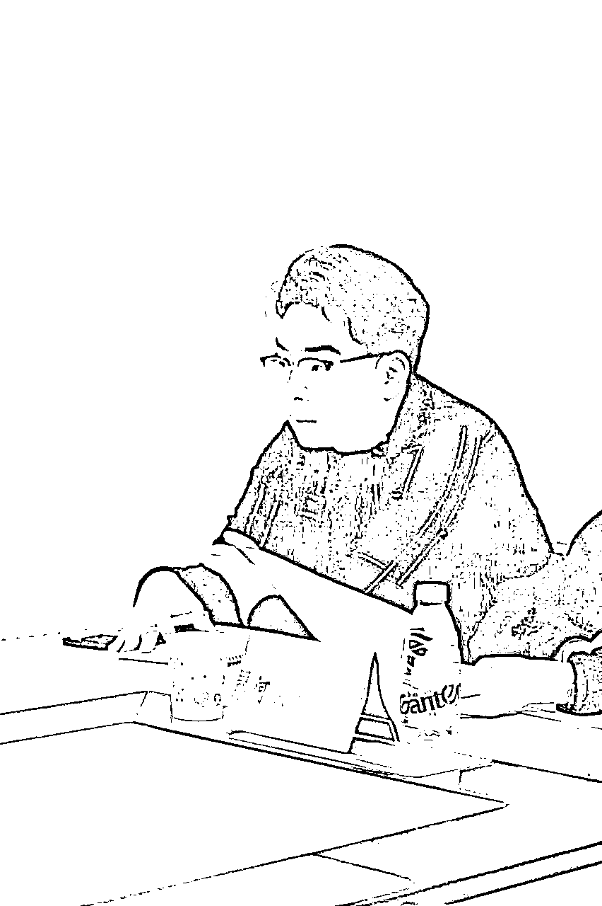

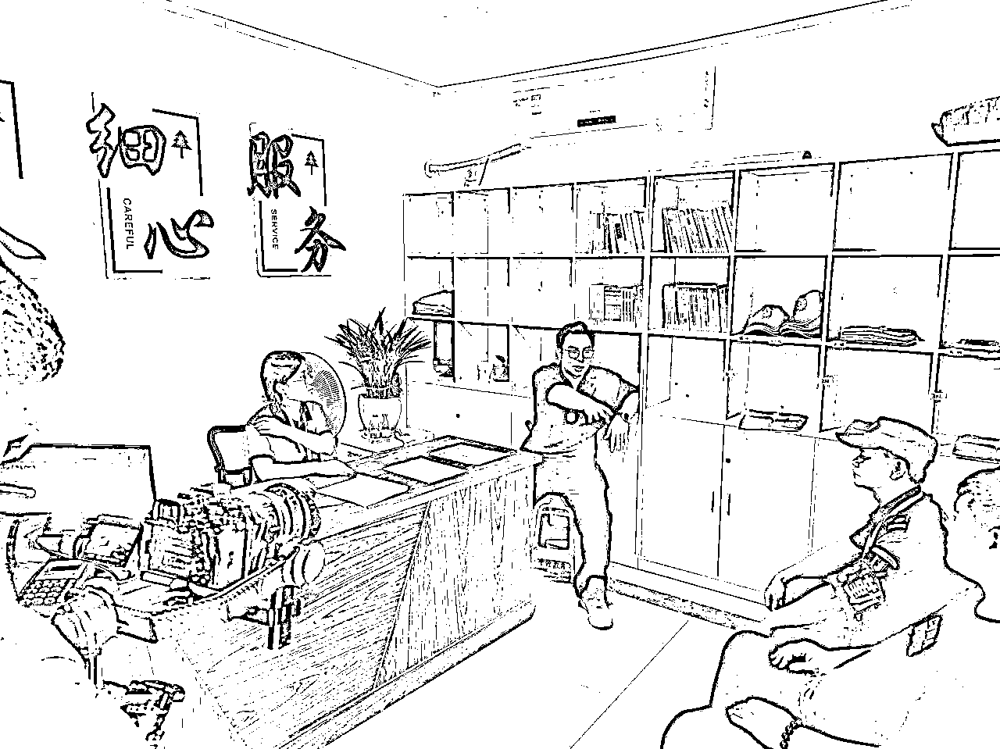

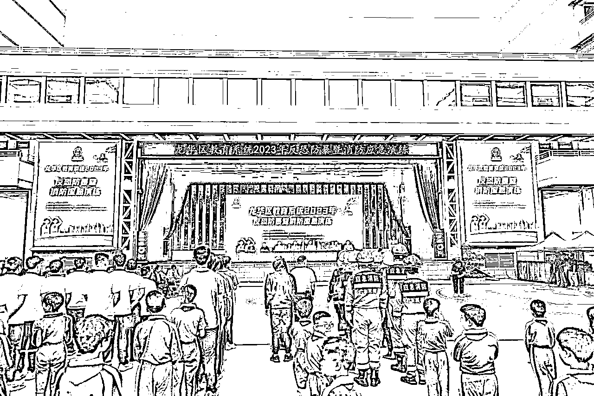

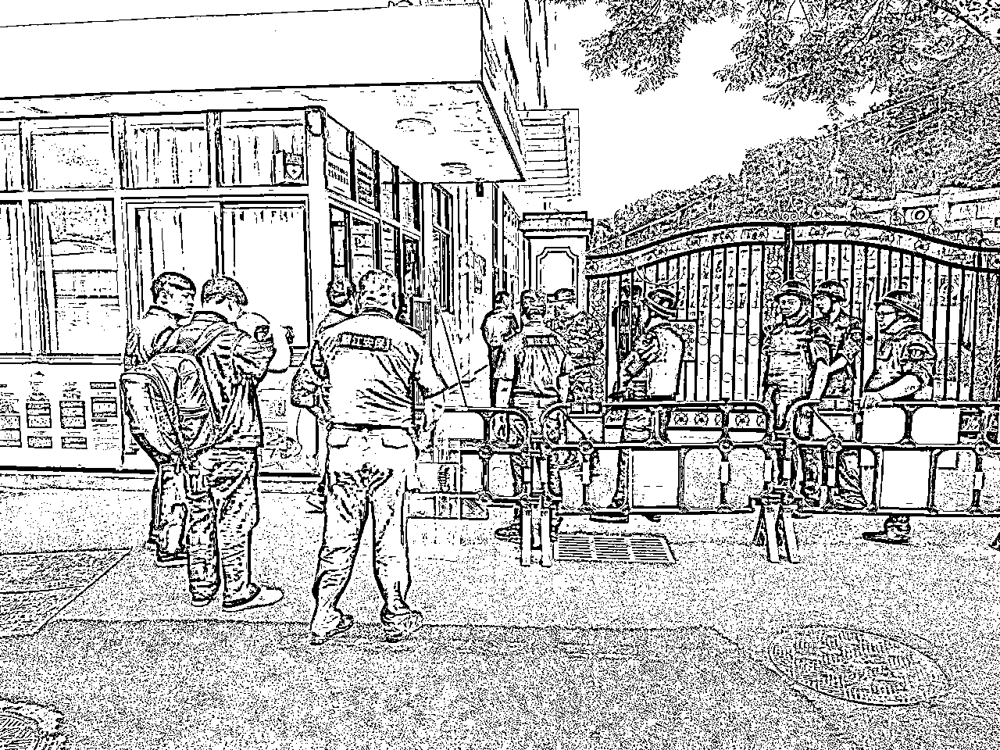

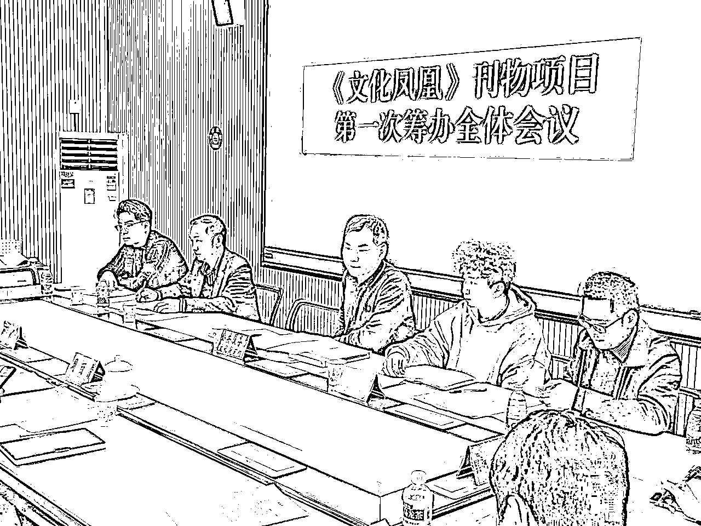

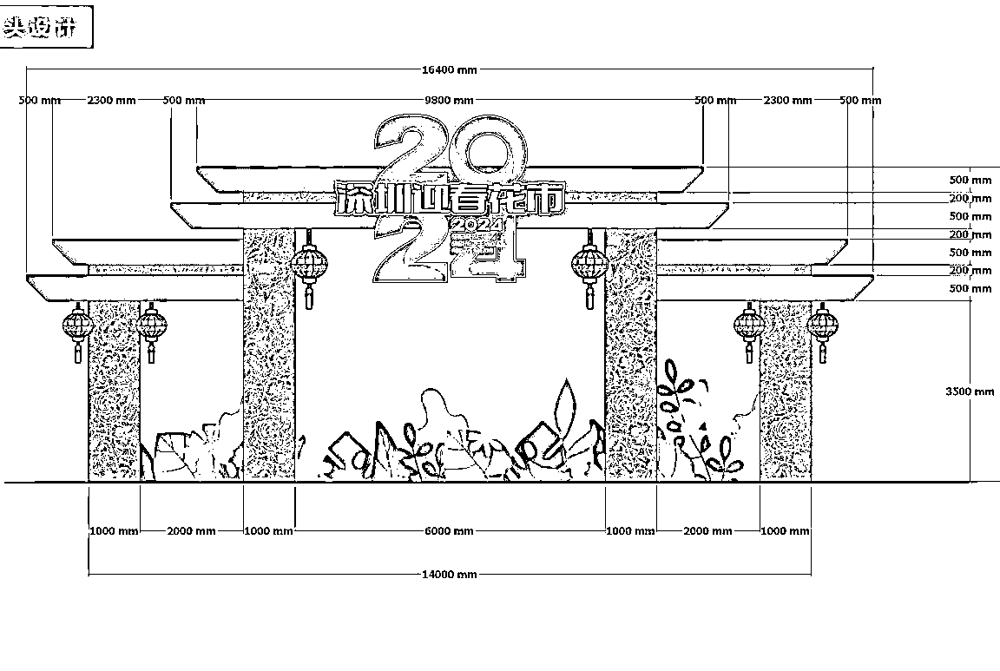

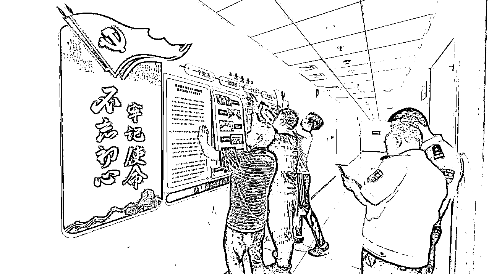

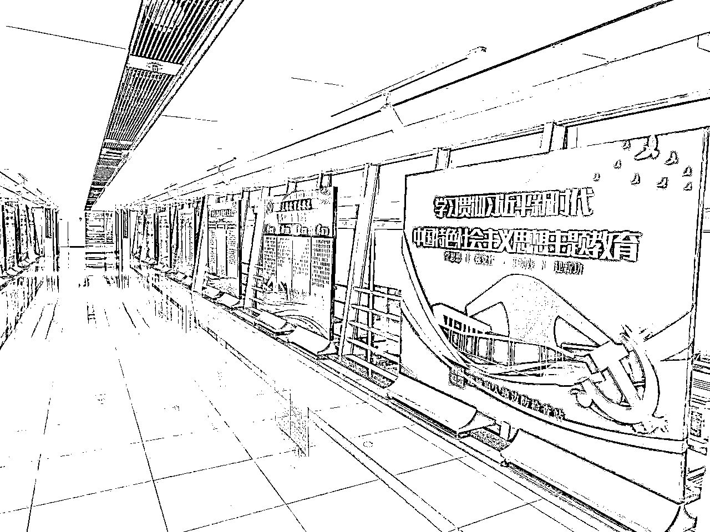

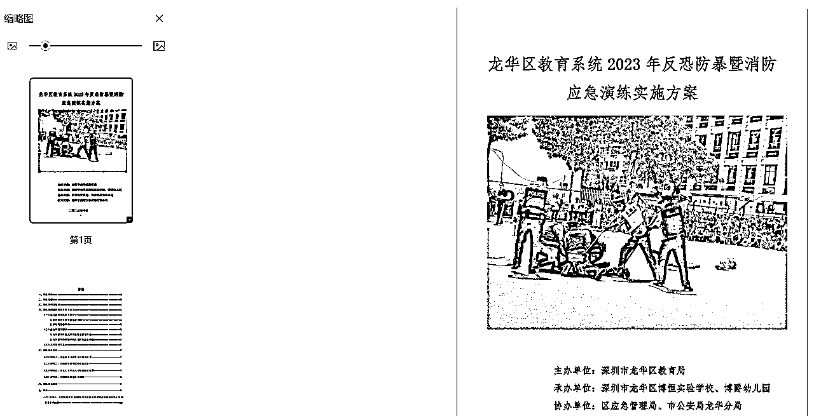

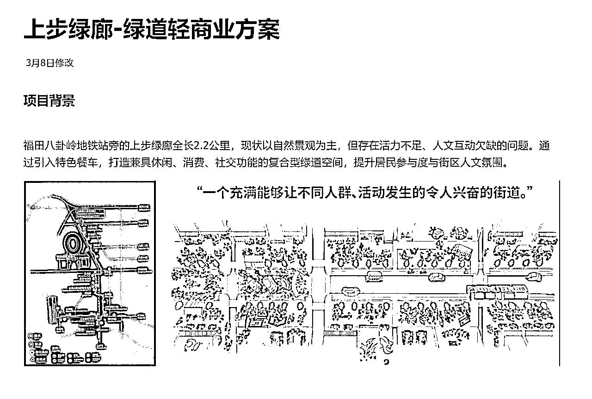

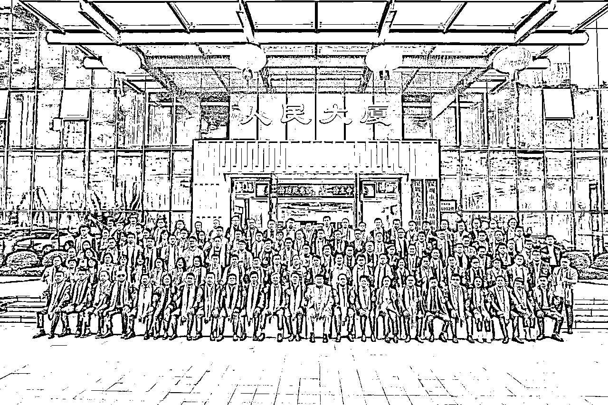

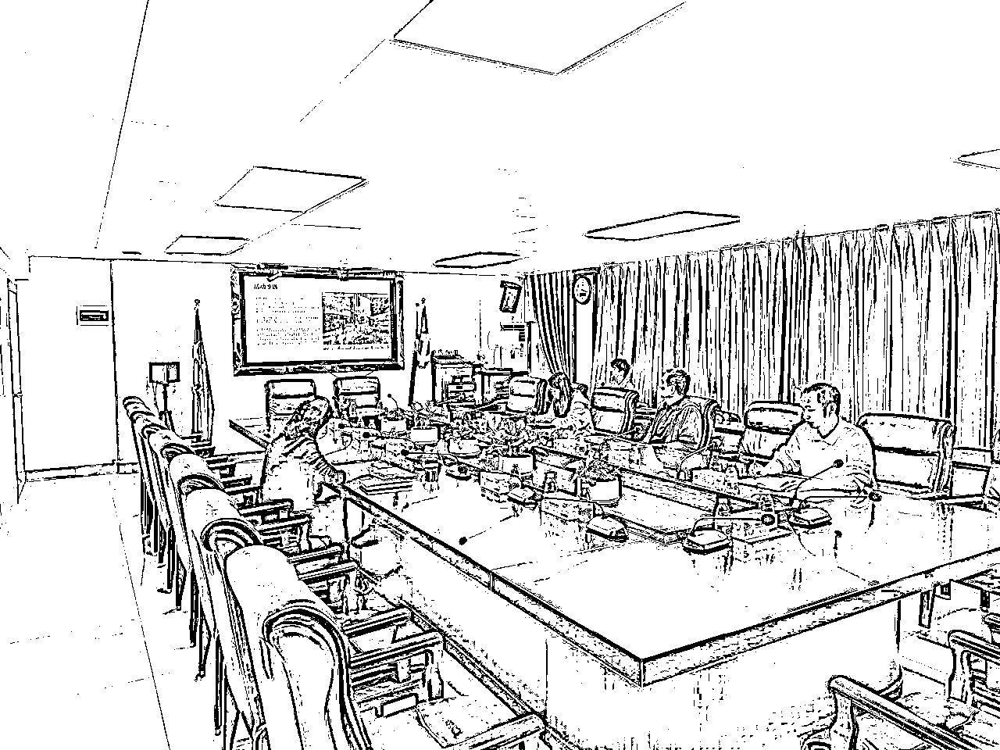

### 一、什么是TOG业务

很多小伙伴熟悉TOB和TOC业务，对TOG可能不太熟悉，TOG是（To Government）的缩写，常译为“面向政府”的业务模式。

通常情况下的TOG业务会划分成不同的类型，按照层级和市场结构，已经有了非常系统的三种路径：

1、顶层服务厂商（如BAT、华为等大厂）

通常是拥有核心技术的大厂进行主导，比如云计算、AI算法、大数据平台等，主导着大部分高附加值的大型项目，像常见的政务云系统，健康码系统等；这部分厂商的策略大部分聚焦在核心技术和平台服务上，保证核心技术的同时开放能力给下游合作，（避免过度竞争）。像政务钉钉和健康码这种标准化的产品就是由大厂来进行主导开发的。

2、中层解决方案供应商

基于顶层技术开发行业标准化解决方案的供应商，比如智慧城市、电子政务系统等程序开发公司。大部分这类公司的背景不太一般，也是三个路径中大部分人难以接触到的业务路径。

3、基层集成商

深圳把这个叫做【民生微实事】俗称【民微】，也就是大部分负责本地化的落地和服务内容；这种项目大部分时间需要依靠招投标进行获取，其本地化的复杂程度和政府主导的政策有非常大的关系，以深圳为例，每个区都有每个区的“潜在规则”，比如各个地区的花市，city walk，马拉松活动等。其中涉及到大量的含有设计、宣发、执行、安保、物料、衣物、食品等不同的板块，不同区政府单位的解决形式和供应商数量也不同，有部分是全包，有部分是全部拆分外包，有部分是招投标；但换言之，这也是普通人最直接接触TOG业务的核心机会点。

TOG业务的核心特点：

强需求主导性

和传统商业逻辑一样，TOG业务的出发点也是基于最基本的【需求】，但又和我们传统做B端C端的业务领域有所不同，他们的需求出发点，通常是【自上而下】的；由顶层领导或者政策决定后进行推动。对于基层集成商来说，我们解决的TOG核心诉求，往往匹配着【政绩】

三长一短项目制

和政府打交道最被人诟病的一点就是周期问题，核心的问题点在【沟通周期长】【调整周期长】【回款周期长】

【执行周期短】三长一短项目制，以最简单的一个街道办活动为例，通常情况下沟通时间会提前1-2个月，调整周期也会持续1-2个月，执行却只给3-5天时间，回款最长能拖到半年以上。

当然，三长一短这个说法，也要看当地的单位情况，以深圳为例，每个区的主导管理模式不同，结算款项的模式也不同，以当前我接触的最复杂的举例：深圳市光明区的审计制度，文本刊例需要准确到按字数付费，审计周期中审计专员会逐个字数审核，确保达到数量，没有达到是不结款或者扣款的，非常非常变态。

极高稳定性

上面说了非常多单位项目的复杂点，但为什么仍然有那么多人愿意从事或者抢着从事TOG业务？核心的地方就在【稳定性】上，和我们B端C端业务领域不同的地方在于，政府客户的资金相对稳定，但决策流程非常复杂，非必要情况下不会轻易更换服务供应商；这也就意味着，一旦你接触到某个方面的业务并且切实服务落地完毕，结算也没有出现问题的情况下，这个活就有可能长期被你包揽。

### 二、TOG业务的沟通要点

想做好TOG业务，离不开一张妙嘴

大部分TOG业务的难点，不在执行，也不在审计，而在于前期没有办法满足领导的需求而导致废案和换项目承接方

所以核心的关键点，就是在项目前期主导项目的沟通方向

以最常见的几种项目为例，通常情况下TOG业务都是要面谈第一次需求的，这次面谈基本就能确认你们是否能够继续合作的关键点，你需要把握好几个地方：

1、这个项目核心的需求（政绩点）在哪里？

2、领导心理预期的价位是多少，能不能拿到以往的价格案例？

3、这个项目的衍生问题有哪些，执行风险点是什么？

我们一个个来说，首先是政绩点

举个例子，领导现在想拍一部街道宣传片，现在备选有10个团队，你该怎么谈让领导选你？

很多人觉得政府单位的工作就一定要吹高大上，吹牛逼，一进来就和领导开始我们要怎么去实现提升社区自治力和居民幸福感，实际上这样的空话领导听了反而会对你的评价更不好。

要知道，这个需求不管你多能满足多匹配，项目的始终出发点始终【自上而下】的，所以不是你的案例很牛逼，是领导的决策很牛逼，领导在成为领导之前，也是一个人，所以要在还没有做事之前，就把明确的领导需求【政绩点】和领导高度绑定，这个活说白了你不来做有的是人做，那给谁做，无非就是谁更能明白甲方的需求

正确的沟通做法是：

领导的这个决策非常不错，如果执行到位，可以提高社区的自治力和居民的幸福感，以往我们做过的一些相关案例和经验是XXX，我们收集的数据反馈是XXX，我们的调查问卷反馈是XXXX

所以正如标题所言，不管领导多么不爱听马屁，你这个也要拍，因为你是否能做好这个事情和你是否明白这个事情是两码事，明白比做好更重要。

第二个问题，心理预期价位，这个很多人搞不明白，所谓的心理价位在领导的眼里看来就是越低越好，但这笔钱实际上你省不省和领导没有直观的关系，那越低越好的逻辑，就还是回到了第一个事项上【需求点】，同样的活，我曾经花了5万，这次花了4万，性价比提升了，对领导来说就是一个明确的政绩，所以大部分前期沟通的时候，百分百会遇到压预算的情况，这个时候就需要我们进行话术上面的主导，策略可以是【增项】以及【质量】；比如我曾经一个文本刊物的项目从4万谈到28万，这里面的逻辑使用的就是增项+质量。

举个例子，领导现在想拍一部街道宣传片，去年曾经请团队花了10万，今年他想只花8万来做，你该怎么谈？

你当然不能傻乎乎的上来就贬低对方拍的多烂，或者你团队有多少大牛工资要开多高，你应该的沟通策略还是回到需求点上，

还是以街道宣传片为例，宣传片的目的大致可以分为几种

如果是针对商圈的拍摄（商场，CBD等），那么有可能是近期商户入驻的情况不理想，商圈人流不理想，从而导致了街道的购买消费力下滑，这个需求点明确的就是【我要我的商圈有更活跃的人流→能带动消费→能吸引更多商户加入】

如果是针对人文的拍摄（美食，公园，学校，文化，景点），那么有可能就是近期有部分居民的投诉意见较多，可能是基础设施没有满足或者人群没有地方进行文娱活动，这个需求点明确的就是【我要居民投诉少→能提升居民在社区的居住体验→能消耗居民时间】

如果是针对主题的拍摄（花市，企业，论坛，展会），那么有可能是近期有相关的活动需要做预热，需要满足的就是官方层面的宣传需求，让整个社区或者活动有“氛围感”，这个需求点明确的就是【我要做好预热→最好人人都知道→能被其他区也关注到】

那么我们的沟通策略，增项就可以是：

领导这个想法非常契合我们曾经做过的诸多案例，我们曾经也给XX区做过类似的宣传推广，但是最后的效果其实不尽人意，大部分的宣传只停留到了内部流转，没有到社区上面，后面我们给另外一个XX区的领导做的时候，领导让我们加印了一部分的宣传手册，而且把视频截成了四部曲，其中有2部都被广泛转发，如果领导你感兴趣的话，我回头找下当时的方案给您看下能否对我们的项目做一些参考和借鉴。

其中的关键点我划了两条线，一开始我们先说其他区也做过，但是项目不理想，是为了侧面突出后面这句话，第一段划线我们的提到的是【给另外一个区领导做】这里为什么要突出领导，因为如果单纯从项目层面对比是不具备任何可比性的，你需要对比的是领导的决策能力，侧面告诉他有另外一个领导和你一样，但做的比你更好，以此去把下面这句话铺垫出来，就是【参考和借鉴】，绝对不要傻到否定领导的决策，不要觉得自己是牌桌上最聪明的，始终要保持着客观和分享的角度来谈论项目。你是来帮助领导更好的去执行和完成项目的，而不是来占领绝对话语权的，所以我们的沟通时刻要以：引导为主。

第二种策略，质量

大部分时间，质量其实是下下策，因为不管你做的多好，实际上在甲方眼里都会存在更好的方案；就和TOB运营业务一样，每个人来都希望出爆款，都希望花更低的代价，所以在使用质量策略的时候，尤其要注意当时的氛围和情况。

领导，这个公司制作的视频素材很多使用的来自于XX视频素材网，对体现街道的文化感其实不太强，缺少代入感，如果要突出我们本次街道的宣传重点，我们团队会更倾向使用稳定器和无人机来把整个的感觉突出出来，我这里有两段对比的视频，您可以看下是否要采用这种拍摄手法。

质量很多时候需要主体的对比，和第一个增项的方法有点类似，但区别在于质量要更注重你曾经这个项目过去的对比，也就是非区之间的对比，单独从这个项目上说事，找前面项目的漏洞，用自己的专业能力和技术能力去进行漏洞的放大和对比，从而达成质量这一策略的沟通引导。

小结一下：

TOG业务其实非常考验人情，尤其如果这个业务并不是项目负责人指名让你做的，就更需要维护好人情和自己形象，通常情况下，政府单位内部的严谨程度和决策复杂程度会让人难以想象，很多人觉得一段话两段话而已，为什么要搞那么夸张。

这个事情也就在这篇文档中和大家分享下，纯个人观点：

大部分时间，政府单位实际上非常缺乏实际性的【政绩反馈】也就是需求点其实非常不明确，很多时候只有一个主观的政策概念，比如提升居民幸福度和社区自治力，大部分时间是非常主观的看法，提升方式也有很多。可能你觉得拍宣传片好，他觉得马拉松好，他觉得社区咖啡屋好，每个人都有每个人的观点，而这种主观性的观点，在政府单位中又是相对绝对的客观观点，因为大家都不敢为了表述观点而承担后果。

如果领导采用了你的观点，举办了马拉松，但实际效果并没有达到，这个【负面政绩】是非常有可能被挂到自己的头上从而影响自己的仕途的，所以大部分时间在政府单位中的决策，几乎都会以领导最开始的观点为起点，很难变化。如果你身为外人，去表述了自己的观点和自己的想法从而导致了这个项目按照你的决策和执行，那么承担后果的就会是你和你的整个项目团队，其中只要有任何一点错漏几乎都是非常要命的。轻则丢失尾款，重则这个行业都很难继续做下去。

所以这也是为什么TOG业务被很多人诟病以及当做茶余饭后的讨论点，本质原因在于体制内的决策逻辑就决定了其决策的成本和权威性，这个是组织形式决定的，所以我们身为服务方，就要顺着这个决策路径，去摸到最初的出发点，从而契合项目的出发点，用自己的经验再去提出可行性方案和建议，一切的本质都是做好【为人民服务】这件事。

那么以上，一些TOG业务的沟通方面的相关经验，希望能给大家带来一定的灵感或者帮助~