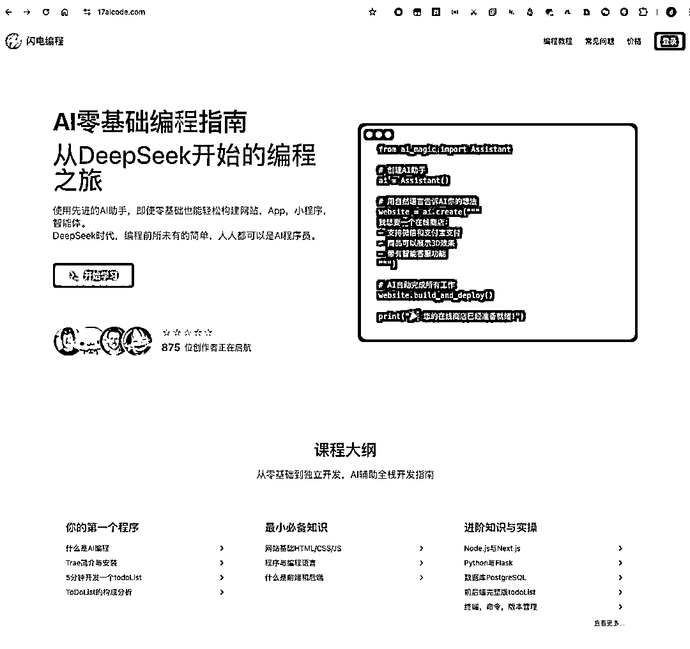
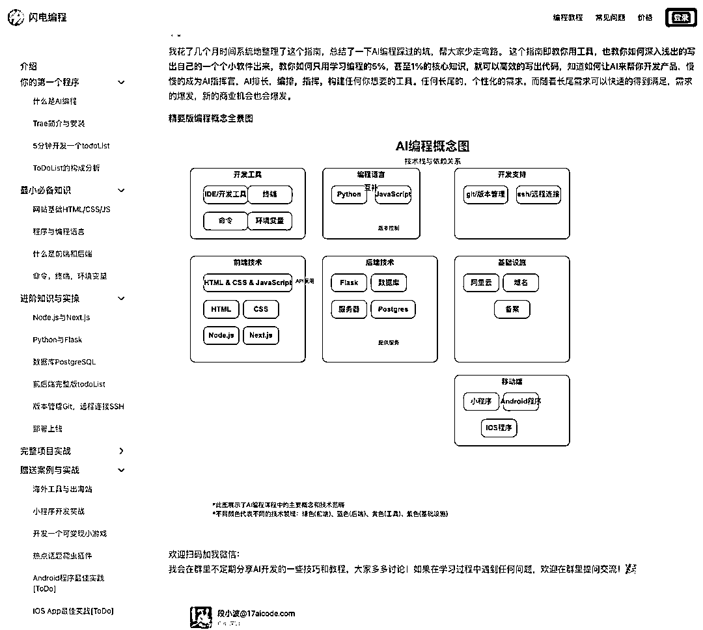

# “AI开发100个应用”挑战，首战复盘

> 来源：[https://jkq1wag4vg.feishu.cn/docx/ND4nd6Cepo3YyWxs01ecutbdnvc](https://jkq1wag4vg.feishu.cn/docx/ND4nd6Cepo3YyWxs01ecutbdnvc)

大家好，我是段小波。由于感受到AI编程的强大和便捷，我最近立项说要搞个大事——“挑战用AI开发100个应用”，主攻自动化方向，特别是自媒体和电商自动化。实现方式聚焦在“智能体-0代码”和“AI编程-轻代码/指挥AI”。

今天，就是我们系列的第一篇，复盘我的第一个AI应用：从零前端经验到上线一个功能完善、设计感不错的AI编程课程网站，并成功售出60多份课程！

是的，你没看错，这一切的核心开发，AI帮我在10天内基本搞定。

### 一、缘起：AI编程课，但我不会前端啊！

三月初，我决定开设一门AI编程课程。想法很丰满，现实却有点骨感——我压根没有前端开发经验！传统的学习路径太慢，外包又不符合我“用AI提效”的初衷。怎么办？当然是求助于我的老伙计：AI！

我的目标很明确：快速搭建一个专业的课程网站，不仅要好看，还要能承载课程内容、用户管理、在线支付等功能。

### 二、我的AI“神兵利器”们

工欲善其事，必先利其器。这次挑大梁的AI编程工具主要是：

*   Cursor IDE：我的主力开发环境。包月20美元，包含500次GPT-4级别的高级模型调用（比如Claude 3 Opus/Sonnet，当时我用的是Claude 3.7这类强大的版本）。对于大需求，比如“搭建整个前后端框架”，它只算1次调用，后续修改几次就能完成基础网站。500次对我来说绰绰有余。

*   Trae：国产AI工具，优势是不用VPN，国际版能排队用上Claude 3、Gemini等新模型。

*   Same.new：网站复刻神器！后面会细说它的神奇之处。

*   其他辅助：还试用了Cline（按量付费，烧钱快，但灵活）、Roocode等。

核心感受： Cursor的性价比和整合度目前最高，AI理解需求和生成代码的质量也相当给力。

### 三、指挥AI的“咒语”：我的高效Prompt秘籍

光有工具不行，你得会“指挥”。我总结了几个高效的Prompt模式：

1.  战略规划先行：

1.  “我要做一个AI编程课程的网站，前端使用Next.js，后端使用Python Flask，数据库使用PostgreSQL。请基于此帮我出详细的设计方案，并存到plan.md，以及具体的执行清单（包含前端页面、后端API、数据库表结构等），存到todolist.md。”

1.  AI生成后，我会仔细检查方案，和AI讨论修改，直到满意。然后，严格按照todolist.md执行，每完成一项，就让AI在清单上打钩。

1.  代码反向解读：

1.  “请把[某段AI生成的代码/某个文件]的核心逻辑、每个函数的功能，以及注意事项给我做下解释。”

1.  这能帮我快速理解AI的“思路”，也方便后续维护和迭代。

1.  任务拆解，从宏观到微观：

*   第一步：整体实现。 直接跟AI说：“帮我写一个课程网站。” AI可能先用JavaScript一把梭，快速给你一个能跑起来的Demo。

*   第二步：模块化重构。 等基本样子能看了，再让AI进行拆解：“好了，现在我们把这个网站拆分成前端项目、后端API项目、数据库独立管理，课程内容用CMS（比如Strapi）管理。”

### 四、零前端经验？AI带我“抄作业”！

设计感？布局？一开始我完全是懵的。我的策略是：先模仿，再优化，全程AI辅助。

1.  寻找“榜样”： 找到几个我喜欢的课程网站作为参考。

1.  AI像素级复刻： 最开始试了Copyweb.ai、V0.dev，效果一言难尽。直到我发现了 Same.new，简直是神器！它能相对精准地复刻目标网站的布局和样式。

1.  学习与理解： 虽然AI能复刻，但我不能只当个“传话筒”。我开始主动学习网站的基本组成：导航栏 (Navbar)、页脚 (Footer)、行为召唤按钮 (CTA)、英雄区域 (Hero Section) 等。了解了常见的布局方式，比如水平网格 (Horizontal Grid)、垂直网格 (Vertical Grid)。

1.  “乾坤大挪移”： 用浏览器开发者工具，定位到参考网站上某个好看的局部布局或组件，复制对应的HTML/CSS（或者截图给AI看），然后告诉AI：“把这个布局/样式应用到我网站的[某个位置/某个模块]，并确保响应式兼容。”

就这么边学边用边指挥AI，网站的“颜值”很快就上来了。

### 网站首页

### 五、AI虽好，也有“坑”：我的避坑指南

AI不是万能的，它也会“过度发挥”，导致项目崩掉。Cursor自带的Checkpoint有时也不太可靠。我的解决方案：

1.  版本控制是生命线： 每次AI有较大改动或功能模块完成后，立刻 git commit！这是最重要的保险。

1.  任务清单勤更新： 每次执行完一个操作，都让AI同步更新todolist.md，确保进展清晰。

1.  选择“稳重型”AI选手： 感觉Gemini相对Claude更不容易“自由发挥过头”（具体模型表现可能因版本和任务而异）。

1.  明确指令边界： 告诉AI：“请先用最少的改动来实现这个功能。功能验证通过后，我们再考虑代码优化和模块拆分。”

### 六、成果展示：一个“五脏俱全”的课程网站

经过一番折腾，我的AI编程课程网站终于上线了！

*   核心功能： 大量介绍性静态页面，动态数据管理（课程列表、用户注册登录、订单管理、微信支付）。

*   课程内容管理： 使用Strapi作为CMS，方便课程文档的增删改查和版本管理。

*   微信生态打通： 微信登录和微信支付这两个棘手的功能，AI竟然基本一次性就帮我写好了核心代码，效率出乎意料！当然，腾讯那边的备案、申请商户号等流程还是挺费劲的，各种认证费（一次300元）也花了一些。

### 课程页

### 网址：17aicode.com

### 欢迎访问

### 七、10天V1.0开发历程回顾

*   Day 1-3：AI复刻工具大比拼。 疯狂调研市面上的网站复刻AI，从Copyweb.ai到V0.dev，效果都不理想，直到偶然发现Same.new，眼前一亮！

*   Day 4-5：像素级复刻与架构拆分。 用Same.new成功复刻出基础页面后，立刻让Cursor结合Claude 3（当时可能是3.7版本）进行前后端分离、CMS集成、数据库设计。当AI把这个骨架搭起来时，我知道这事儿成了！

*   Day 6-10：细节打磨与CMS熟悉。 完善各个页面的细节，对接Strapi CMS，处理Markdown解析等。因为我之前也没用过Strapi，熟悉它也花了一两天。

整体算下来，核心的网站1.0版本（前后端完整跑通），AI主力开发时间就在10天左右。 后续的课程内容填充、微信登录支付的细节联调，虽然也花了不少时间，但纯粹的开发编码工作量已经大大降低。

### 八、从怀疑到确信：AI真的行！

说实话，一开始我心里也打鼓：AI真能从头写一个完整的、可商用的网站吗？虽然听说不少产品经理用AI写了App，也试用了一些复刻工具，但初期的效果确实不理想。

转折点，就是Same.new的成功复刻，以及后续Cursor + Claude 3 顺利完成整个网站的架构拆分。 看到AI能理解我的复杂指令，并生成结构清晰、逻辑合理的代码时，那种掌控感一下子就来了！因为网站的骨架一旦搭起来，剩下的细节填充，对于有后端、数据、架构经验的我来说，配合AI查漏补缺，就没那么担心了（毕竟我只是前端小白）。

### 九、降本增效：AI让开发效率飙升！

这次经历最直观的感受就是：AI极大地压缩了开发时间！ 估算下来，AI辅助下的开发时间可能只有传统方式的10%，甚至更少！ 这还是指完整项目的开发和问题排查。

更重要的是，它让我这个前端“小白”也能快速实现自己的想法，这种赋能感太强了。

### 十、上线反馈：60+份信任与积极评价

课程网站上线后，陆陆续续已经有60多位用户付费购买。大家的普遍反馈是课程的学习路径设计得很合理，内容深入浅出，让他们没想到编程入门可以这么快。这给了我极大的信心！

### 十一、我的AI编程感悟：“干中学”就对了！

通过这次实战，我深刻体会到：AI编程，真的跟我们当年学PPT、Excel的难度差不多！

核心秘诀就是 “干中学”：

1.  直接让AI干： 有想法，直接清晰地告诉AI。

1.  干完让AI解释： AI生成的代码，让它自己解释给你听，帮助你理解。

1.  不懂就问，继续干： 遇到问题，描述给AI，让它帮你分析解决，然后继续推进。

当然，如果能有一条深入浅出的学习路径会更好，避免一开始就被海量编程概念淹没。先掌握5个核心概念就能用AI做出一个小应用，再学5个又能搞定一个新功能……不知不觉可能就掌握了三五十个关键点，那时，你就能指挥AI写出任何你想要的程序了！

* * *

好了，这就是我“AI开发100个应用”挑战的第一个复盘故事。希望我的经历能给你带来一些启发。用AI搞开发、搞自动化，真的没那么难，关键是迈出第一步，动手去尝试！

关于我

• 前百度资深工程师 | 京东，阿里工程师

• 10年技术实战经验，擅长简化复杂系统

• 现专注AI应用落地，主攻自媒体AI自动化和电商AI自动化