# 5000字保姆级测评手册：搭建个人AI知识库，它是我最佳的第二大脑

> 来源：[https://jid6vvjfdm.feishu.cn/docx/UZ8Pdt6uXoKEndx9bghct2o4nhd](https://jid6vvjfdm.feishu.cn/docx/UZ8Pdt6uXoKEndx9bghct2o4nhd)

我是河林， 98 年出生，INFJ，base杭州。

3年生财有术星球星友，生财有术3月视频号航海带教教练。

主业：3 年视频号头部达人直播运营经验。

目前的主要业务：视频号直播运营操盘、视频号达人孵化。

哈喽，生财星友们好，最近星友们关注AI的非常多，我自己最近在探索的是打造个人「AI知识库」，这一篇里分享一些我自己选择AI知识库工具的经验，希望对大家有帮助。

## 本篇框架

1.对「知识库」这一品的需求缘起

2.回顾自己的需求，自己对一个「AI知识库」产品有什么需求？

3.市面上这么多款「AI知识库」产品，选择哪个？

4.测评比较多款产品后：我选择的主力知识库是……

5.「AI知识库」产品的价值是什么

6.搭建AI知识库的建议

市面上出现了很多AI知识库产品，我们到底是否需要？该选择用哪一款？该怎么用？

这一篇里就是我对这几个问题的探索，和最终的解决方法，完全从我个人主观角度、从自己解决问题的实用角度出发，如果你对这些问题也有想法，希望能给你参考。

文章较长，有 5000+ 字，可能要花不少时间阅读， 建议先转发、收藏，避免下次找不到。

## 知识库工具产品的需求缘起

在知识管理上，最开始遇到的问题是，大家在各种各样的群里每天都会收到各种研报、资料、行业分析等文件；

很多资料都属于，看到的时候第一眼觉得很有用，但是总是来不及看完，最后“收藏从未停止，但阅读从未开始”。

而一旦想用起来，找参考资料的时候，之前看过的文件又早就不知道放在哪儿了。

所以在两三年前，我开始用飞书知识库搭建我的运营资料空间。

两个目的：一是要让我自己整理框架，知道这些资料到底属于哪些类型、用来解决我什么问题；二是方便我及时检索、查找。

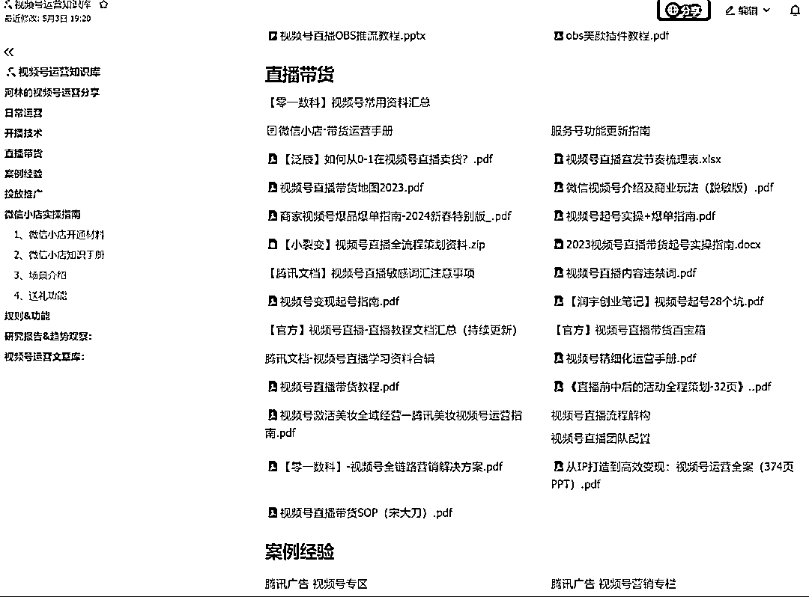

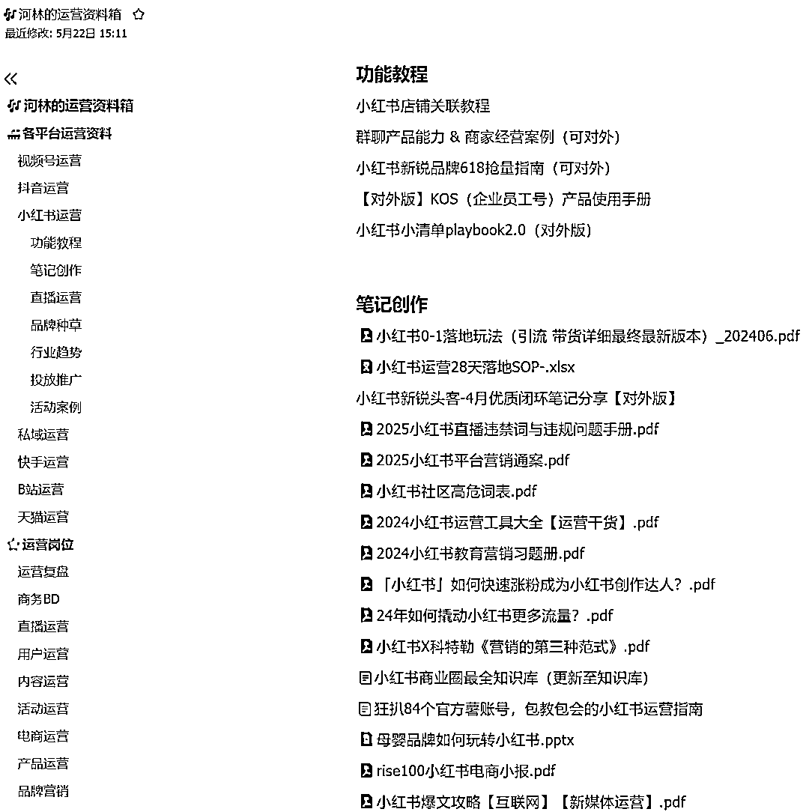

现在各家开始推出了自家的AI知识库工具，那么市面上多家AI知识库产品，选择哪个？ 就成了我最近在探索的问题。

## 我对「AI知识库」有什么需求？

回顾自己的需求，我需要解决什么问题？哪些功能是我需要的“真需求”？

⭐核心需求： 根据我的信息检索和提问，能够分析资料，对我的问题给出回答，总结输出、逻辑推理能力要强。

⭐最好能管理多种信息源，如果只有PDF那未免太单调了，自己常用的输入源：PDF资料、微信公众号文章等等，最好都能纳入进来。

⭐多端同步管理：电脑端和手机端都可以使用，尤其是电脑端的体验要尽量丝滑、流畅。

⭐可共享、公开分享。

⭐使用成本和门槛尽量低：更多的免费空间、更低的付费成本、更简化的打开路径。

好的，明确了自己的需求标的，那么开始物色自己需要的产品。

市面上目前出现的几款主流知识库工具： 飞书问答、纳米AI、秘塔知识库、腾讯的ima.copilot、得到的get笔记……

这里先直接上结论，最终 我决定作为主力AI知识库，留下来的是这两款——get笔记、秘塔AI知识库。

## AI知识库测评&使用体验：

我的测评方法：

从我的视频号运营知识库里下载了 40 份筛选过的、质量比较高的资料文件，把同样的资料上传到几款不同的知识库里，然后提问同一个问题，比较不同知识库的效果、功能。

按照我自己的测评排名，依次介绍我的测评结果和体验：

### top1：秘塔AI知识库：

坦白讲，秘塔AI知识库 本来已经被放到我的淘汰名单里 了，但是最后连带着测试之后，它的效果确实出乎意料的惊艳。

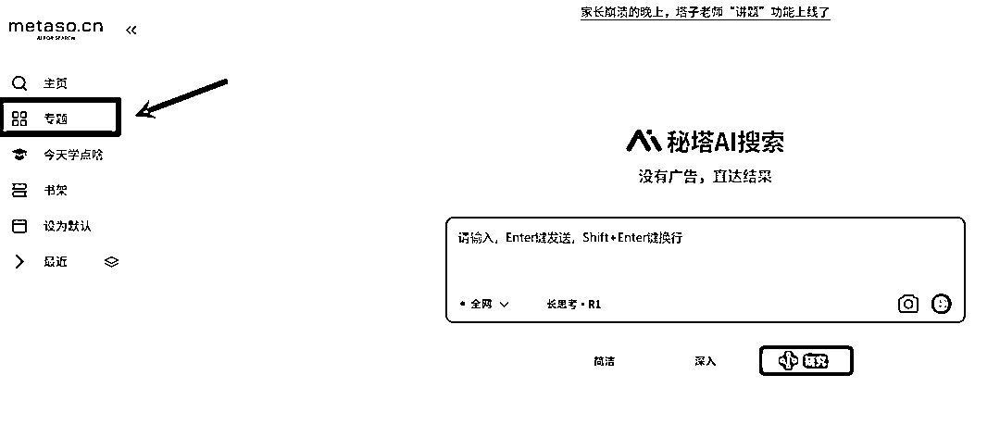

对比ima知识库和get笔记的回答， 秘塔AI在回答结果上就已经很优秀了。

我在我的视频号运营知识库里提问“视频号直播间的流量推送逻辑是什么”，这是它给我的回答结果：

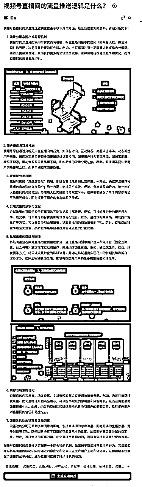

其次，它还主动提供了很多惊喜服务，给出的附加体验可谓是“图文并茂”。

比如：

⚡自动生成大纲⚡

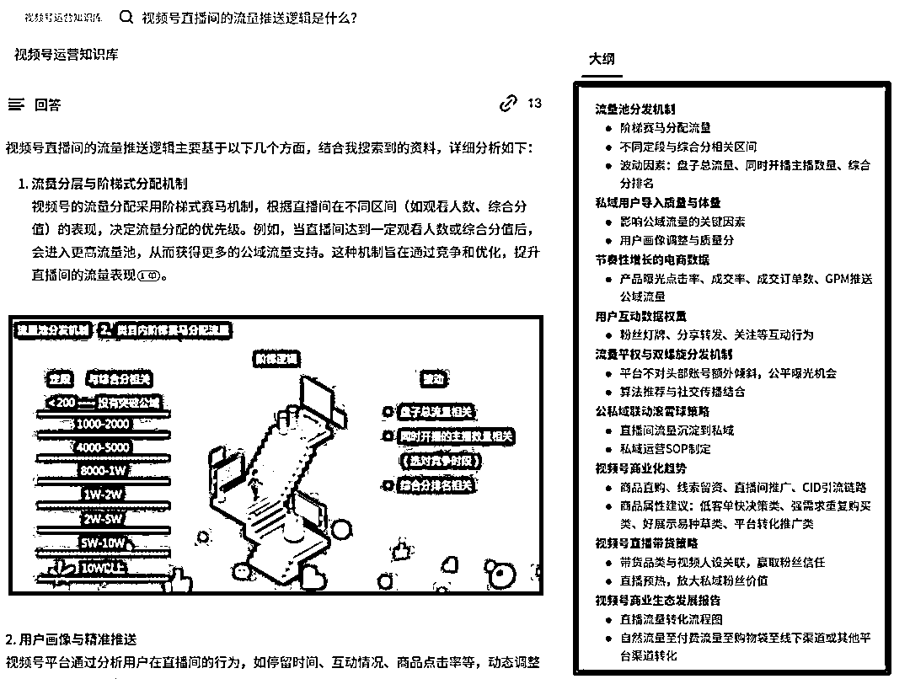

⚡自动生成PPT⚡

根据我的这个问题，它直接帮我生成了 12 张PPT；很专业，比我自己做要好看得多。

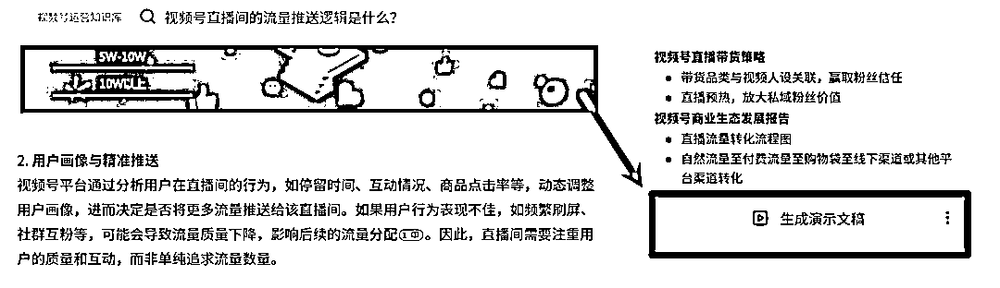

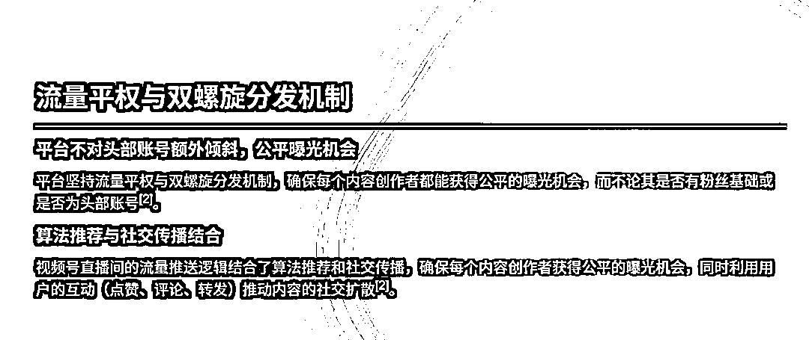

⚡生成脑图⚡

⚡生成互动网页⚡

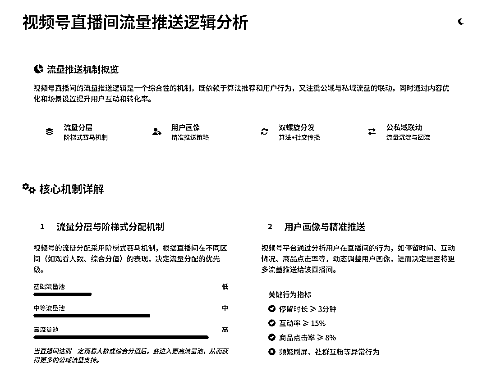

这些 都属于让人惊喜的附加服务，我没让它做，但是它一并帮我做了。

就好像你让实习生去登记一下这个月的数据，它不光帮你登记好了，还 附上了自己做的数据趋势图和分析结论，然后一起做成报告给到了你。

所以在我对知识库的核心需求 ——从知识库里检索我需要的信息上 ，秘塔知识库可以 让人满意 。

然后是缺点，首先是我使用秘塔AI搜索的频次本身比较低，会影响到我对这个产品的打开率。

其次，知识库的空间额度需要付费，免费额度是500M空间，我上传了2个知识库之后，空间就已经满了，增加空间的话要100M=3.5元。

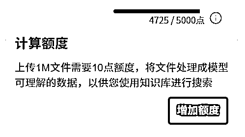

分享联动功能一般，知识库只能以分享链接和图片的形式分享，没法在微信里直接以小程序的形式打开。

而且整个知识库广场没有公开，看不到别人公开了哪些知识库。

但是 瑕不掩瑜 ，这些缺点不影响我的核心功能的使用，产品足够好的话我也有付费意愿；总体来说， 秘塔AI的知识库还是有很多亮点。

### top2：得到出品的get笔记

get笔记 是今年为数不多的 惊艳到我的一个产品。

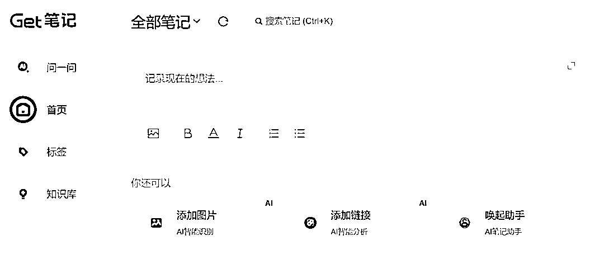

它的很多功能都很实用、我有很大需求、之前没人做， 但是它很优雅、便捷地实现了。

比如，get笔记最牛的一点，就是能自动订阅抖音、得到、视频号博主的短视频和直播，然后自动生成文稿和解读，并且收录到知识库里。

这是我订阅的几场直播——

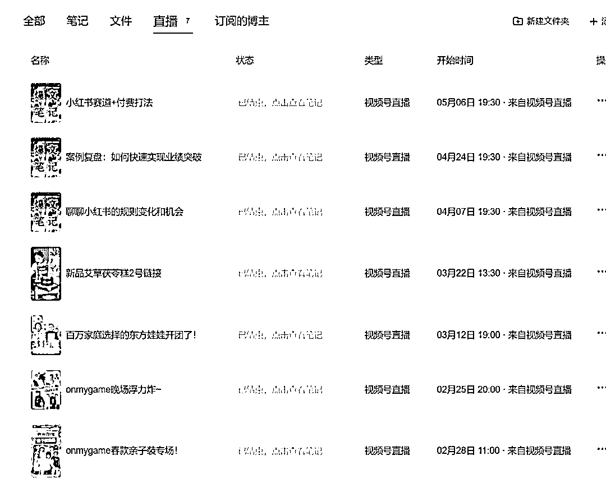

订阅的直播结束后，会自动生成该场直播的文稿+AI解读到知识库里。

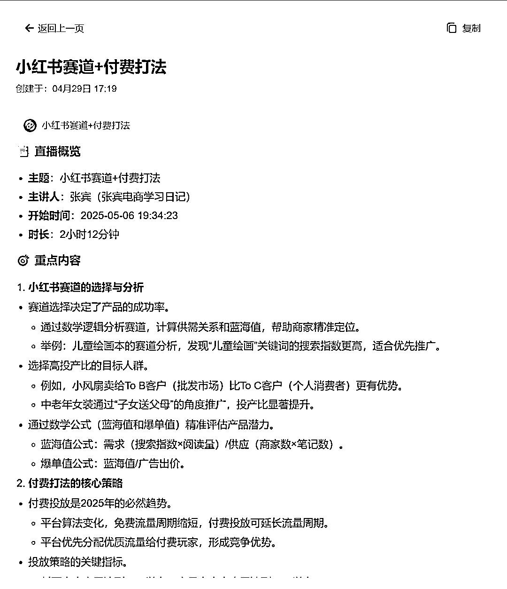

还可以订阅短视频博主的短视频内容， 自动生成每一篇短视频的文稿+总结。

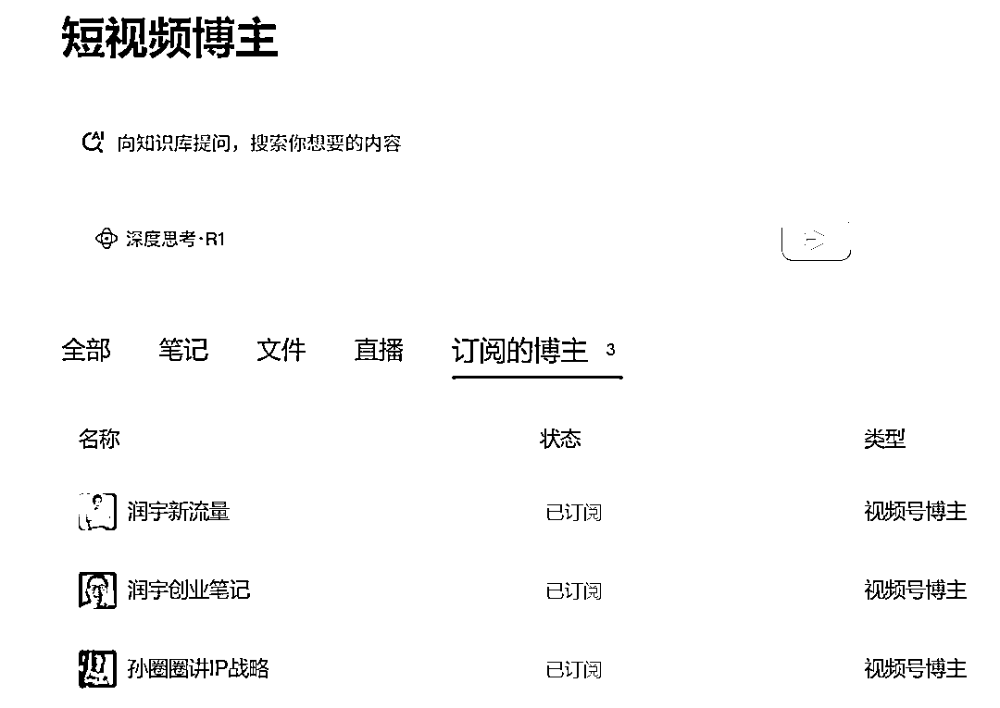

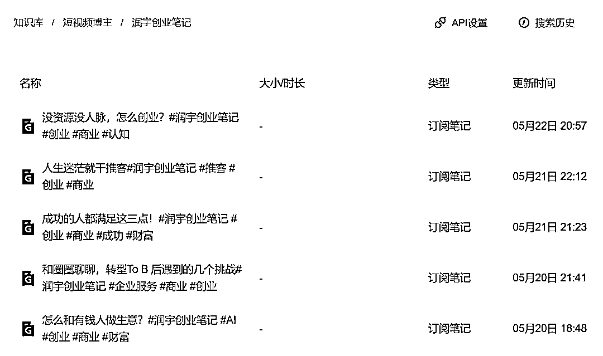

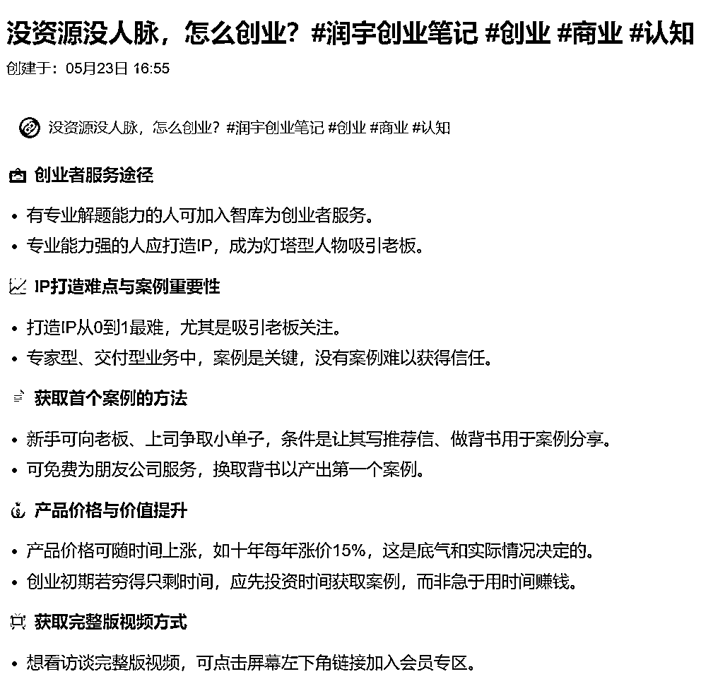

这是 市面上任何别的知识库产品、AI产品、笔记工具、SAAS工具都实现不了的。

get笔记有很多实用的用法，后面有时间我再单独写一篇介绍一下，今天这篇就先讲讲如何用好它的 AI知识库功能。

### top3 ima.copilot

ima.copilot是腾讯的产品， 从产品角度讲，ima知识库延续了腾讯系产品一直以来的优点。

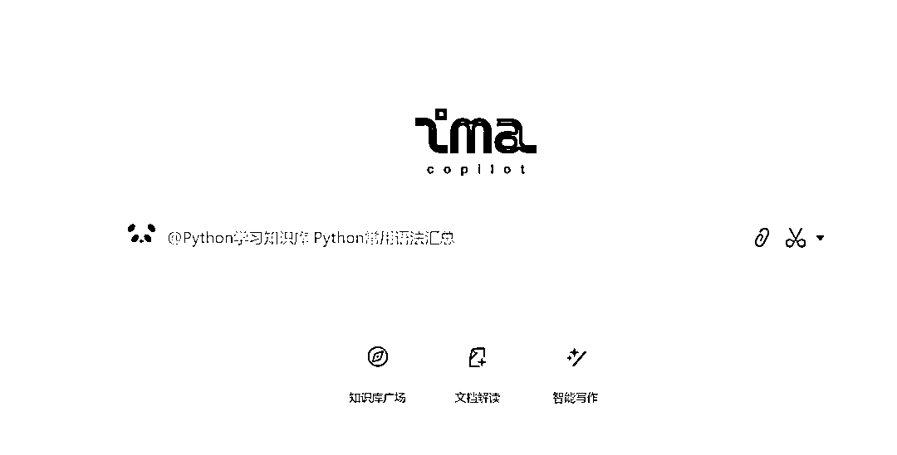

在它自带的 ima 知识库使用指南里有介绍，下载之后可以查看学习它的自带功能。

主要包括：

⚡知识库整合：把本地文档、浏览的公开链接整合到知识库。

⚡当成搜索引擎直接提问：可以直接在首页提问，它会检索信息，生成AI回答，生成的AI回答也可以加入知识库。

⚡记录笔记：阅读文件、网页时，唤起ima就可以记录笔记，而记录的笔记也可以整合到知识库。

ima知识库有几个亮点：

⭐整合性好： 能把各种来源的信息（本地文档+公开链接+AI回答+原生笔记等等）整合到知识库里。

⭐和微信端联动做得比较好： 在微信端打开文章，可以很轻松地分享输出到ima知识库，整合公众号文章很方便。

而且因为本身是腾讯的产品，所以它检索微信生态内的公众号内容，效果很好；

而且我还注意到，它在回答我的一般提问的时候，还会 检索ima知识库平台上其他用户已公开的知识库 ，这就很妙了，应该是几个知识库产品里唯一做到这一点的。

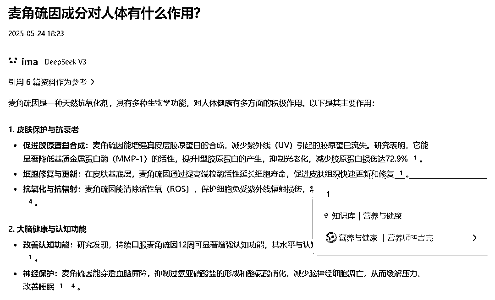

但是到具体的知识库信息检索、提取、整合方面，我也测试了一下， 与秘塔知识库和 get 笔记相比，ima知识库的回答也就中规中矩。

所以从综合角度而言，在我这里评价不高，只能放在第三位当个备胎。

### 知识库提问测试

回到核心的，针对知识库里专业问题的提问测试方面。

我把有同样内容的「视频号运营知识库」上传到这 3 个AI知识库之后，拿同样的问题“视频号直播间的流量逻辑是怎么样的”？，得到了 3 种不同的回答。

🌟秘塔知识库：

就像我上面提到的，秘塔知识库的结果是最好的： 言之有物+输出结论丰富+图文并茂。

🌟get笔记：

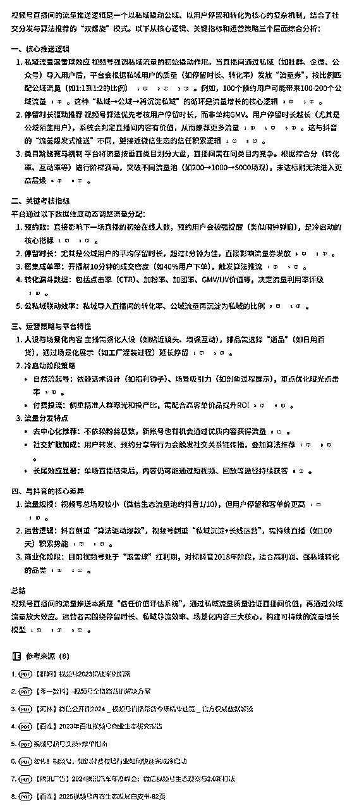

🌟ima.copilot：

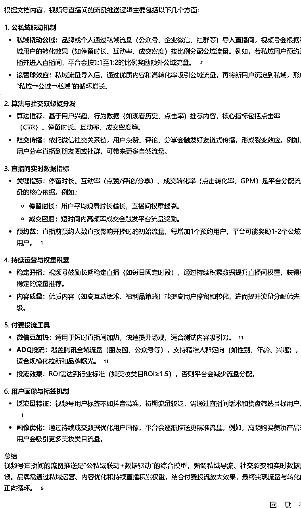

就观感而言，get 笔记和 ima.copilot 的结果都确实有帮助，get 笔记要比 ima.copilot 好一些， 但是两个工具提炼出来的信息有些简洁，而且都以文字为主。

我用另一个小红书运营知识库测试之后，得到的结果也类似。

# 测评结论：3个知识库软件的异同总结

⭐都支持pdf、ppt、word等 通用格式的本地文件 整合到知识库； 都支持公开网页链接 整合到知识库。

⭐ 在提问结果的丰富度、实用性上，秘塔搜索有绝对优势 ，而这也是我的核心需求。

⭐在和微信生态的联动上，ima知识库表现更好，主要体现在对公众号内容的检索方面。

⭐在 文献来源的对照展示 上，ima不如get笔记和秘塔搜索。

ima标注对应信息的文献来源的时候，只能告诉我这段信息是从哪个文件来的。

但是get笔记和秘塔，能直接跳转到具体这段信息出自哪个文件的哪一段话。

get 笔记👇

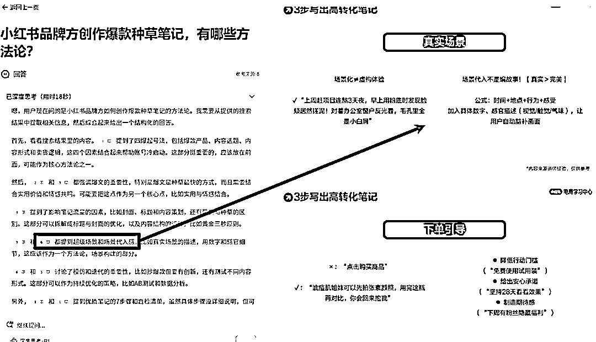

秘塔AI👇

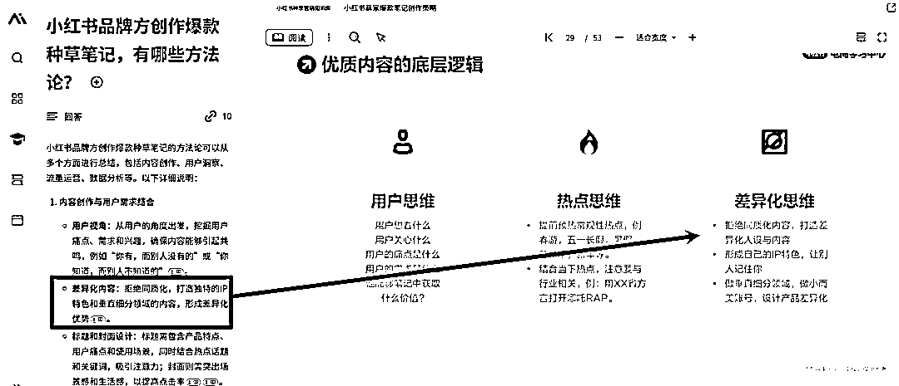

⭐ 在对外公开分享的展示 上：get笔记和ima知识库都很好；都可以在产品主页浏览各种公开知识库；

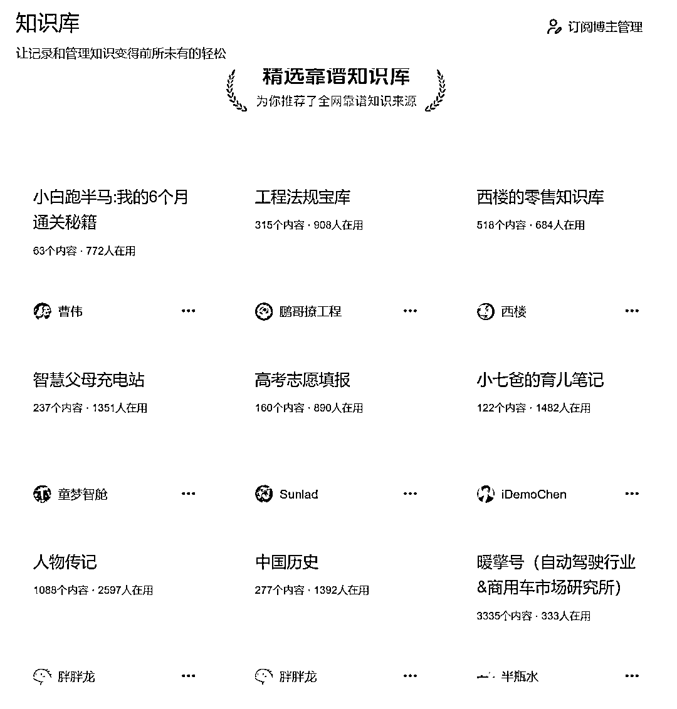

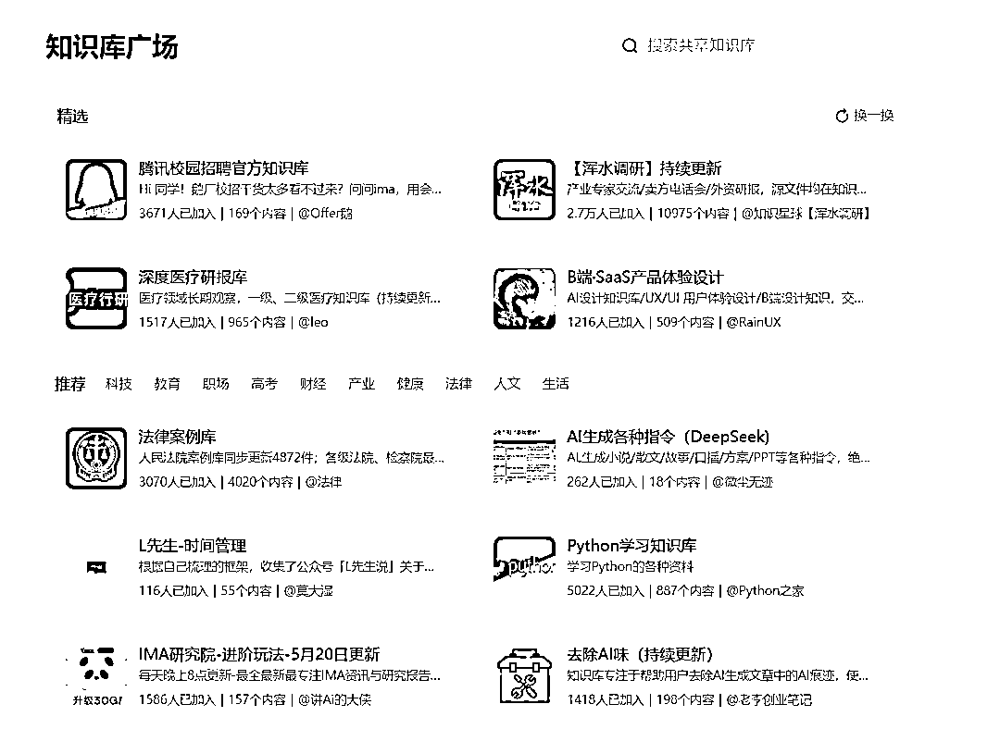

都可以 以小程序的形式 分享到微信群，而秘塔搜索 只能分享知识库的链接和图片。

⭐ 在订阅来源的多样性上，get笔记有绝对的优势。

get笔记支持订阅 抖音、得到和视频号的博主短视频、直播间 ，可以自动生成文稿和AI解读，整合到对应的知识库里，这是它绝对的优势。

但是，get笔记有个很大的问题是：在我对知识库提问的时候， 纳入到知识库里的订阅的博主和直播的信息，是不在知识库检索范围内的。

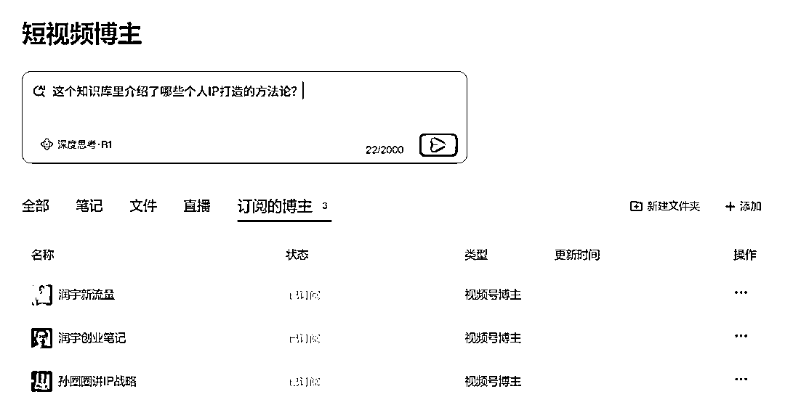

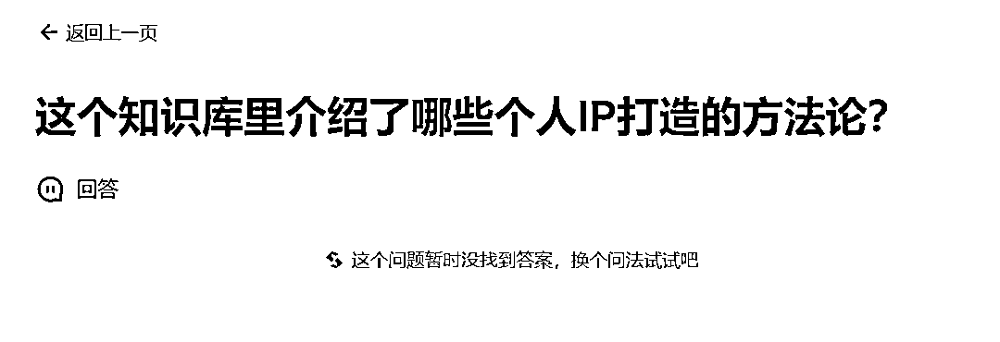

我觉得这一点 又很莫名其妙，浪费了自己很大的优势，所以在get笔记的问题检索能力上，我又会减分。

# 个人主观向终极结论

👑 综合能力最强的是秘塔搜索 ，如果要做深度检索，或者说，如果我只想一次搜索解决我的问题，那用秘塔；它唯一的短板是公开分享的效果一般。

👑get笔记和ima知识库，我也依然会同步建立知识库， 主要用来公开分享展示，作为一个对外曝光的窗口渠道 ，测试下是否有引流效果。

👑持续高频使用get笔记，用来整 理自己订阅的博主的短视频和直播内容 。

👑ima知识库相比之下比较平庸，对它的主要用法就是收藏特定主题的公众号文章，也作为一个检索工具偶尔搭配使用，毕竟公众号还是有很多优质的内容。

排除其他工具的原因：

❌纳米AI：

看到了很多AI博主KOL在发这个产品的通稿，但是对我来说，360&周鸿祎做的产品一律拉黑，不打算用。

❌飞书知识问答：

实际上，我的知识库长期以来一直都 最先搭建在飞书上 ，包括我过去三年份的工作周报，我自己整理的运营知识库等等……

按理来说，如果飞书推出了针对个人用户的AI知识库问答，那我绝对是最受益的用户。

但是可惜，飞书的知识库产品推出得太晚了，在前天才刚刚推出飞书知识问答，而且首先面向的用户显然是企业，目前处在内测中， 只有部分企业和那些AI知识库的KOL有使用权限；我提交了内测申请，还没通过。

OK，fine…… 我既然用不了，那我也不需要测评了，老老实实排队等飞书给我权限吧。

顺便吐槽一句，飞书作为主要靠to B销售来营收的公司，首先推出针对企业用户的飞书问答，无可厚非。

但是，仍然不理解为什么飞书在知识库领域如此领先，在AI领域领先推出来多维表格结合Deepseek的情况下， AI知识库产品却推出来的这么慢，甚至其他几家小公司的产品我已经成熟化，飞书才姗姗来迟。

如果飞书的 唯一理由就是为了更好地直接推出服务企业的知识问答工具 ，那我也没什么好说的了。

所以，这段时间，我在使用AI知识库的过程中，都是把我在飞书上整理的文件，下载、上传、迁移到别的AI知识库软件做测评。

等到飞书知识库结束内测，我什么时候有了权限，再用用看，如果好用、有价值，也许我再单独发一篇拿出来介绍。

其他 目前没看到别的好用的产品；未出现在我视野里的产品，也不打算再专门花时间去主动淘了。

Flowith 听上去很酷的样子，但是我还没深入系统了解，而且产品本身应该也不是单独作为一个知识库产品使用的，作为一个备选选题，有时间了我再单独用用，如果有价值，我再单独开一篇。

# 建立个人AI知识库的价值

最后，聊一聊建立AI知识库的作用、价值。

💡公开分享、链接交流

排在前面的公开知识库，有几万人订阅。

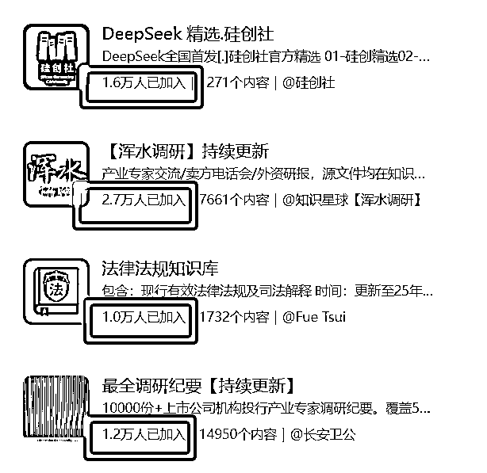

所以建立一个好的知识库，也是 一个在公开渠道建立自己的影响力、增加曝光的方法。

我相信，越分享，越幸运。

💡针对一个行业或一个领域做主题学习

引用luke老师这段话，要想在某一个领域有所进步或者快速学习。

那么针对这个领域的优质信息和知识，在一段时间内集中地、沉浸式地做专题学习，就是很好的方法。

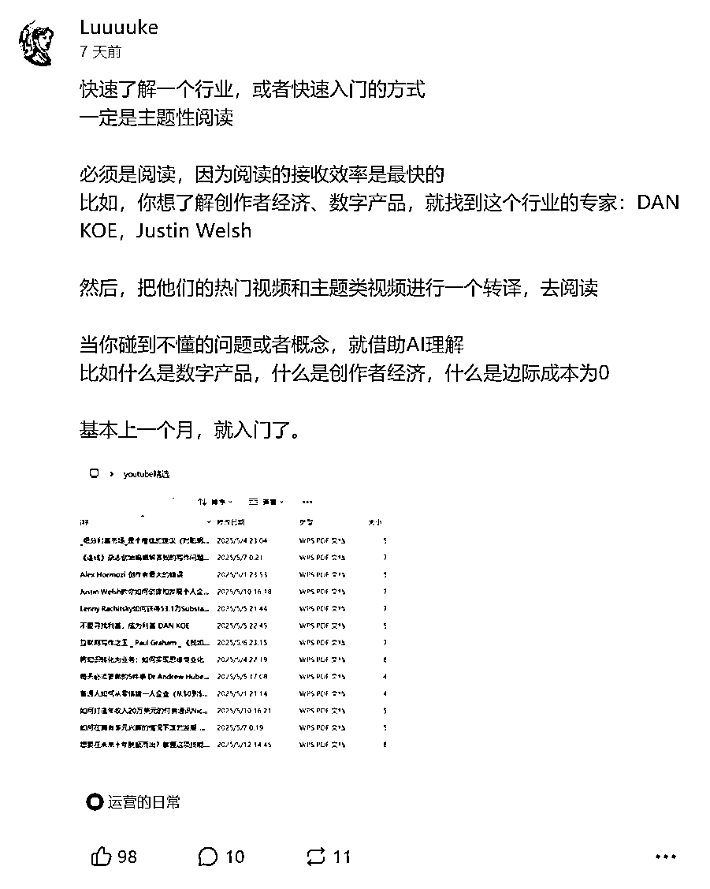

一个特定领域的知识库， 就像是自己的外接大脑 ，可以帮助自己沉淀相关信息，快速掌握某个领域的框架、常识、逻辑、方法。

如果用得好，它就是一个 无需付费、但价值千金的教练、顾问、咨询师。

再比如， 对一个你非常喜欢的作者，可以把它的所有文章收集起来 ，直接收集成一个知识库，来去专门了解、回顾这个作者的一些观点和想法；通过提问去互动、交流。

等等等等，AI知识库肯定还有很多可以开发的新用法。

今天这一篇已经有些长了， 后面如果我能在「AI知识库」领域开发出 10 个新的玩法，我就再单独写一篇具体的实操用法。

想看的朋友们欢迎催更~

# 搭建个人AI知识库的建议

1️⃣知识库的 主题要收束，不要无限丢进去 ，扩大成一个无底洞，比方说“市场营销”、“互联网运营”、“电商”，这样过于泛的主题。

一旦主题太大，资料太多，一个知识库往往就会失效。

2️⃣放入知识库的资料品质要经过筛选， 尽可能选择高品质的资料， 不要一股脑啥都丢进去；

同时，整合到知识库里的资料 来源要尽可能多样 ，不要只丢一种类型、一种媒介、一种来源的信息。

除了直接放别人的资料以外， 最好的情况下，要丢入一些自己加工过的、用自己的语言整理过的思考。

3️⃣ 整理不是目的，关键是要用，要输出，要帮助自己的工作和生活。

不要 沉浸在搭建知识库的自我满足之中 ，而忘了自己最初的目的——输出、做事、提升、提效……

4️⃣工具本身并没有那么重要，不要陷入选择困难症，没必要在多个知识库之间纠结。

如果不怕麻烦，也有一种大力出奇迹的海王方法： 每次都把同一个知识库，同步到多个知识库产品里；

遇到问题的时候，同时拿出来，同一个问题同时提问多个知识库，就像现在大家也习惯于同一个问题问多个AI产品，交叉验证回答一样。

但是我总觉得这样 信息过于嘈杂了~ 有的时候给的选择越多，反而越不知道怎么判断。

应用AI产品， 要有弱水三千只取一瓢的心态，举重若轻，像瑞士军刀一样去使用，而不要有贪婪感，始终想要索取更多。

好的，今天这一篇的分享就到这里了，希望对你有帮助。如果你觉得有收获，欢迎评论、分享。