# 2 年志愿者复盘：那些藏在细节里的服务心法与提效技巧

> 来源：[https://akm6yioxpn.feishu.cn/docx/VDGwdQZyJoXtFyxX92EcSmIQnbf](https://akm6yioxpn.feishu.cn/docx/VDGwdQZyJoXtFyxX92EcSmIQnbf)

哈喽，大家好，我是赫连雨彤。2年+生财圈友。

祝贺生财9岁生日快乐，我为自己的第八期志愿者做个复盘，欢迎大家一起交流学习。

之前也写过一次志愿者复盘，有兴趣的伙伴也可以跳转查看～

2025，期待更优秀的自己～

# 历程回顾

我的「双重身份」成长图谱

在志愿服务历程中，我以志愿者与领队的双重身份，完成了从新人到“细节控”的蜕变。

## 领队经历（6次A级）

*   第八期：金牌领队

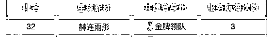

*   累计7次领队，6次A级领队

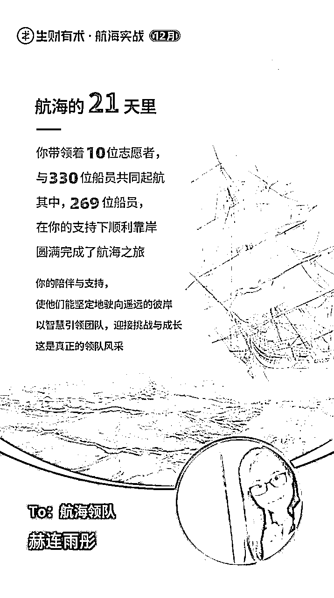

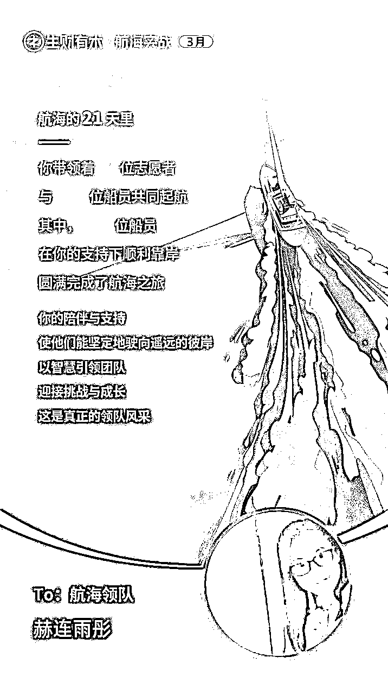

## 志愿者经历（3次A级）

*   累计4次志愿者：2次A+级，1次A级，1次不评级

*   3次航海，上岸率100%；4次航海，小组上岸率>航海平均上岸率

*   小组排名1-4都有了～

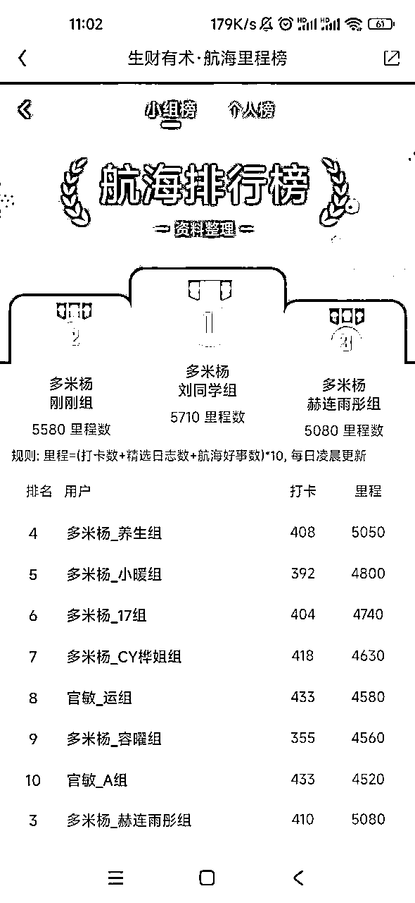

排名：3

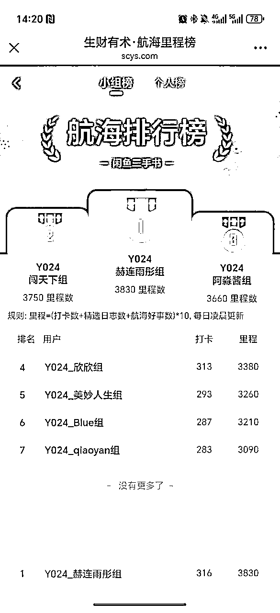

排名：1

排名：2

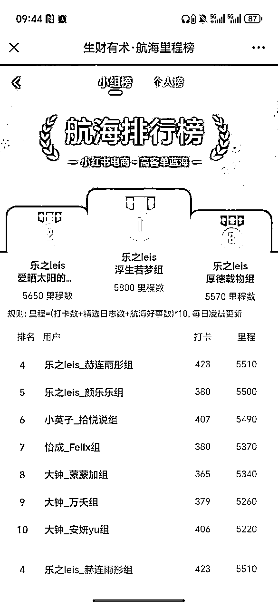

排名：4

## 第八期，船员评分：9.77

第八期，3月航海志愿者的评级查询入口

*   领队评价查询：https://scys.com/form/z27VzvXl

*   志愿者评价查询：https://scys.com/form/z27Vzvhl

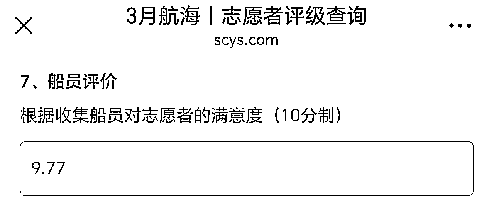

## 小灯塔荣誉记录（5次）

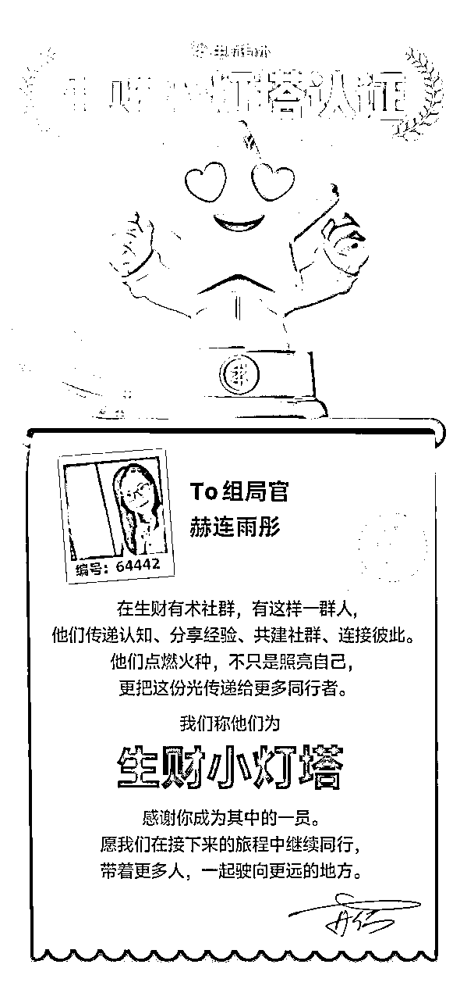

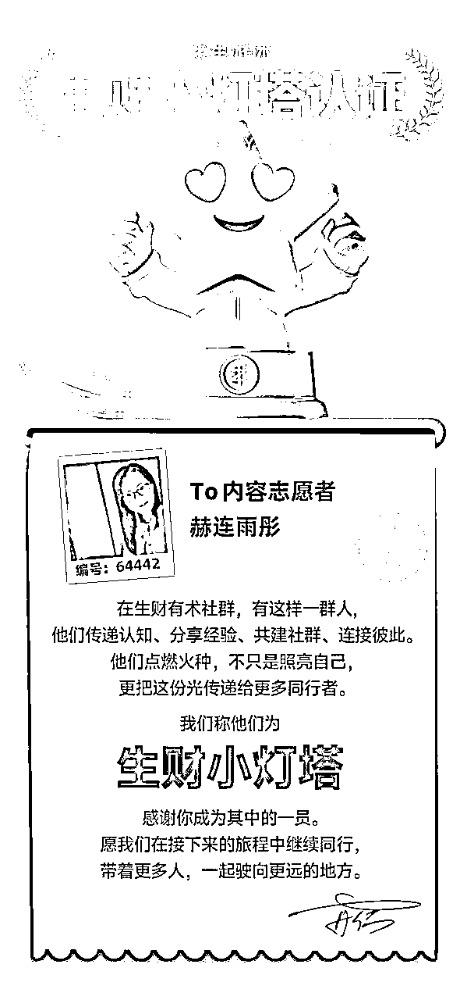

# 报名与筹备

从0到1：志愿者报名与筹备的「主动法则」

## 志愿者报名：开启成长的关键一步

踏入生财的志愿服务领域，报名环节是不容小觑的关键节点，它就像一把钥匙，能为你打开充满挑战与机遇的成长之门。

### 三大核心注意事项

#### 信息捕捉阵地：紧盯知识星球与微信航海群

生财的【知识星球】和【微信航海群】是发布志愿者招募信息的核心阵地，这里就像是信息的“宝藏库”。

我之前看到了知识星球的招募动态，以为自己报名已经够快了，实际上其他志愿者报名的手速更快，导致自己与心仪的志愿服务项目失之交臂。

这也给我敲响了警钟，下次一定要眼疾手快，养成时刻关注的习惯，不错过任何一条重要信息。

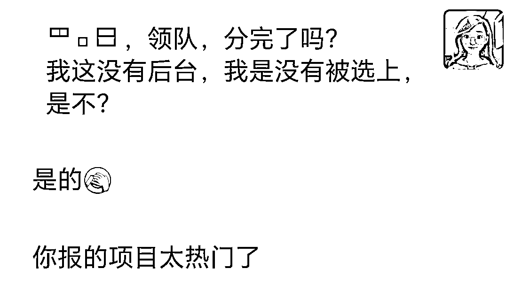

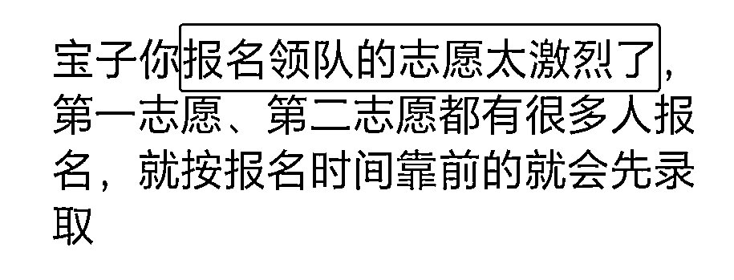

#### 报名时效法则：发现招募立即提交资料

一旦在知识星球或航海群发现招募信息，“快”就是制胜关键。这就如同一场紧张刺激的限时抢购，名额有限，先到先得。拖延只会让机会从指缝中溜走。

有的圈友，看到招募信息后，思考选择，甚至二次修改提交志愿表，实际上我们犹豫的时间，别人已经把报名名额占满了。

所以，当招募通道开启，不要犹豫，第一时间提交报名资料，抢占先机。

建议：

提前查看航海选题，把自己想要报名的第一志愿者和第二志愿提前想好。等志愿者招募链接一发布，先报名为敬。

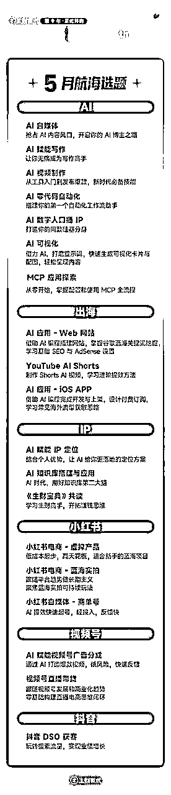

#### 准备加分策略：梳理经验+展示案例+表达服务理解

对于第一次报名志愿者的萌新来说，积极的准备能为你的报名增添厚重的砝码。

咱们可以提前梳理过往的社群经验、沟通技巧等相关经历，清晰地呈现自己的能力。

在报名资料中，描述一些自己曾经做过哪些和志愿者相关的案例，真诚地表达对志愿服务的理解，比如你希望通过志愿服务实现怎样的价值，能为团队和参与者带来什么。这些额外的用心，会让运营人员看到你的诚意与潜力，大大提高入选几率。

教练报名准备

实习志愿者，报名准备

往期志愿者报名准备

### 录取规则与时间优势

#### 吃透规则本质：为什么「报名时间」是核心变量？

不论报名志愿者还是领队，咱们都需要：

*   及时关注生财的【知识星球】和【微信航海群】消息

*   及时提交志愿者报名信息

*   积极准备，主动争取，没毛病。

#### 志愿者录取规则（仅目前所知，一切以生财最新规定为准）

*   往期志愿者，评级不是CD的，按报名时间靠前的录取

*   本质是「历史表现」与「积极性」的双重筛选

*   历史表现（非CD评级）：官方通过过往服务质量过滤掉配合度低、执行能力差的志愿者，确保团队基线水平。

*   报名时间（靠前优先）：反映对航海项目的重视程度，同等条件下“早行动者”更易获得信任。

*   评级维护：把每次志愿者服务当作“信用积累”，认真对待每一次评级。

*   规则弹性：若当期因特殊原因评级下滑（如C级），可主动向运营说明情况，争取“破格补录”机会（适用于长期表现稳定的老志愿者）。

#### 时间优势的「抢跑策略」

1.  信息抢跑：建立「航海信息监测系统」

置顶「生财有术知识星球」和微信航海群，关注运营艾特所有人的消息。

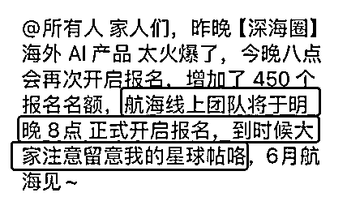

1.  行动抢跑：打造「极速报名」标准化流程

收到运营的志愿者招募预告后，提前设置“报名闹钟”。如：确定某日20:00点发布招募星球贴，提前设19:58的闹钟提醒

### 候补逆袭指南

#### 落选应对策略：及时私聊运营争取候补

如果报名的航海项目，录取的领队/志愿者人数少，或者在报名时间上落后一步，导致报名的【领队】或【志愿者】落选。

建议：及时向运营私聊报备，申请候补志愿者。

*   主动报备：志愿者名单公布后24小时内，及时向运营发送候补申请（例：“本期报名稍晚，若有志愿者退出，可随时替补”）。

*   展示价值：附上前期服务亮点（如曾带小组上岸率100%），证明“候补即战力”。

*   保持活跃：在候补期间参与航海群互动（如解答新人问题），让运营感知你的积极性。

#### 候补心态：保持关注，积极等待机会

进入候补名单后，保持耐心和积极的心态。时刻关注项目动态，做好随时上岗的准备。不要因为一时的等待而松懈，因为机会随时可能降临。

在等待过程中，也可以完善自己的志愿者服务SOP，提升相关技能，以更好的状态迎接可能到来的机会。

以下生财的手册，可复习，整理属于自己的SOP。实际航海：以运营发布的最新手册为准。多和领队确认。

📚航海实战-志愿者手册：

📚航海实战-志愿者SOP及话术：https://scys.com/t/BOA7rh3H

## 开船前必做的「提效三件套」

通过工具标准化、话术模块化、认知清晰化，在开船前完成90%的基础服务框架搭建，避免航行期手忙脚乱。

### 工具层：飞书表格「船员信息看板」

打开链接后，可复制到新页面，二次编辑

*   核心字段（必填）：

*   微信昵称（用于精准搜索）

*   星球昵称（绑定会员身份）

*   标签（新/老/围观船员）

*   提醒频率（每日/不足3日需提醒/不提醒）

*   打卡目标（12/15/21次）

*   状态字段（动态更新）：

*   是否进2个群（避免重复邀请）

*   是否改备注（快速核验群规执行情况）

*   开船是否同步（确保重要信息到位）。

*   备注字段：

*   记录特殊需求（如“海外时差党”）

*   用 emoji 分类（⚠️紧急/💡建议/✅已解决）提升辨识度。

### 话术层：易歪歪（PC端）&快捷短语（手机端）

#### 易歪歪

官网-可下载Windows / Android / iphone / macOS版本

http://www.eyy250.com/index.html

作用：提前把模版话术准备好，打开微信后，直接点击复用。

#### 快捷短语

了解手机键盘，巧用【快捷短语】

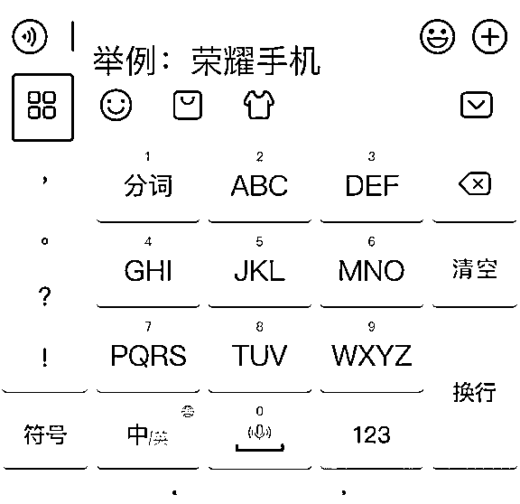

### 认知层：提前拆解「服务边界」

制定《提醒频率确认表》避免越界

#### 边界清单设计

| 维度 | 允许行为 | 禁止行为 | 决策逻辑 |
| 提醒频率 | 按约定频次提醒（每日/不足3日），最后1天23:00可柔性补提醒 | 未约定情况下每日多次轰炸，凌晨提醒 | 尊重船员作息，避免触发微信投诉机制 |
| 隐私介入 | 微信私信通知，必要时短信补充 | 拨打微信电话/手机号（除非船员快掉海了，提前发微信告知情况） | 海外船员案例：有时差，需要提前确认国内的00:00点在对方所在地区的时间。按需提醒 |
| 问题处理 | 记录问题→群内@领队→24小时未回复则@运营 | 擅自承诺解决方案（如“押金一定能退”） | 避免因政策变动引发信任危机 |
| 情绪管理 | 用幽默文案化解抵触（如“打卡=赚时薪100元”类比） | 与船员争论、宣泄个人情绪 | 保持服务者中立视角，聚焦解决问题 |

#### 避坑指南

*   警惕“老好人心态”：避免船员未打卡，不按约定多次提醒，导致对方反感。可用“您之前选择不提醒，若需调整可随时告知”重新建立边界。

*   用“数据”替代“感觉”：通过飞书表格的提醒记录（如“已发送3次未回复”）判断是否需要升级沟通层级，比如：咱们没进群，无法观看教练的直播，可能会影响学习，进而影响打卡，打卡不足12次无法退回押金。

# 实战细节

航海实战：21天服务的「细节攻坚」

## 船员协助：从「事务执行」到「价值共创」

### 「好事日志」筛选指南：从 S 级爆单到 A 级突破

👀S 类好事：

*   融到资啦

*   赚到大钱，比如大于等于 1000 块以上的钱，大于等于100单以上的订单

*   达成粉丝超过10000以上

*   视频播放超过100000以上

*   直播场观超过100000以上

*   有商家来谈成合作

S 类好事，特指直接赚到大钱和开了很多单，或者达成了某类对赚大钱有重大影响的成就。

👀A 类好事：

*   有商家来谈成合作

*   赚到钱

*   有利润了

*   我赚到1000了

*   我视频播放破千了

*   我视频播放破万了

*   我直播场观破万了

*   我有询单了

*   我有小爆款了

*   我有大爆款了

*   我有粉丝了

*   我粉丝破千了

*   我链接到了圈友

*   和圈友达成了商业合作

*   圈友成为我的事业伙伴

*   我成为了教练

*   我的生活质量变好了

*   我养成了锻炼、读书等好习惯

*   带家人/朋友一起实战

*   我用生财记录下来某一件很重要的事的过程

A 类好事，特指有一定小成绩，在现在的基础上取得了一定突破的成就。

👀新奇特类好事：

*   我在工作中应用某种技能，获得了提升

*   我运用了某个学到的技能，在工作中得到领导赏识

*   我在一些非互联网生意里，如传统行业等，用学到的技能取得了突破

*   我在线下实体店引流了用户

新奇特类好事，特指在非互联网生意里取得的成绩或突破。

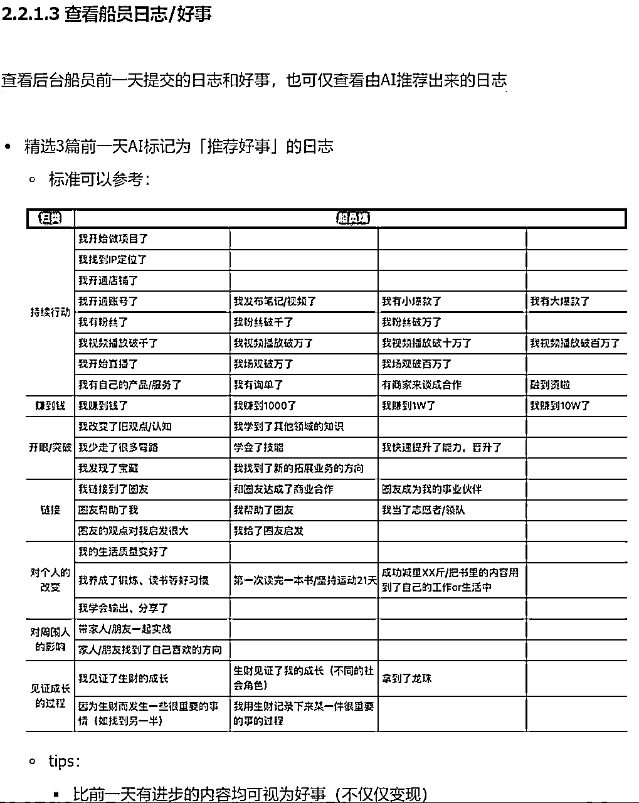

### 区分船员需求

根据提醒打卡的需求，我将船员分成了3类，每个类型做不同的特殊备注

1.  每天提醒

给对方的备注：名字 + (x月xx项目船员)

1.  不足3日需提醒

给对方的备注：③ + 名字 + (x月xx项目船员)

1.  不提醒

给对方的备注：名字-不提醒 + (x月xx项目船员)

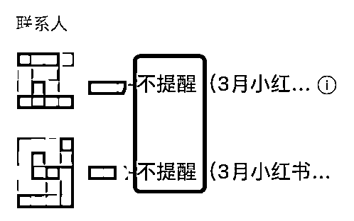

### 按需提醒打卡

*   根据和船员的约定，进行按需提醒。

*   之前给船员说的提醒打卡是：22:00-23:59。但是，有时候周六日忍不住会提前提醒。这点需要改进。

*   个人感觉，最佳的打卡提醒时间：21:00-23:50（提醒太早，船员也会忽视）

主动询问

多次提醒打卡，没有打卡的船员，可以主动询问一下对方是否遇到什么问题

积极的船员：

对方上岸后，可引导冲刺15天王者 / 21天巨人

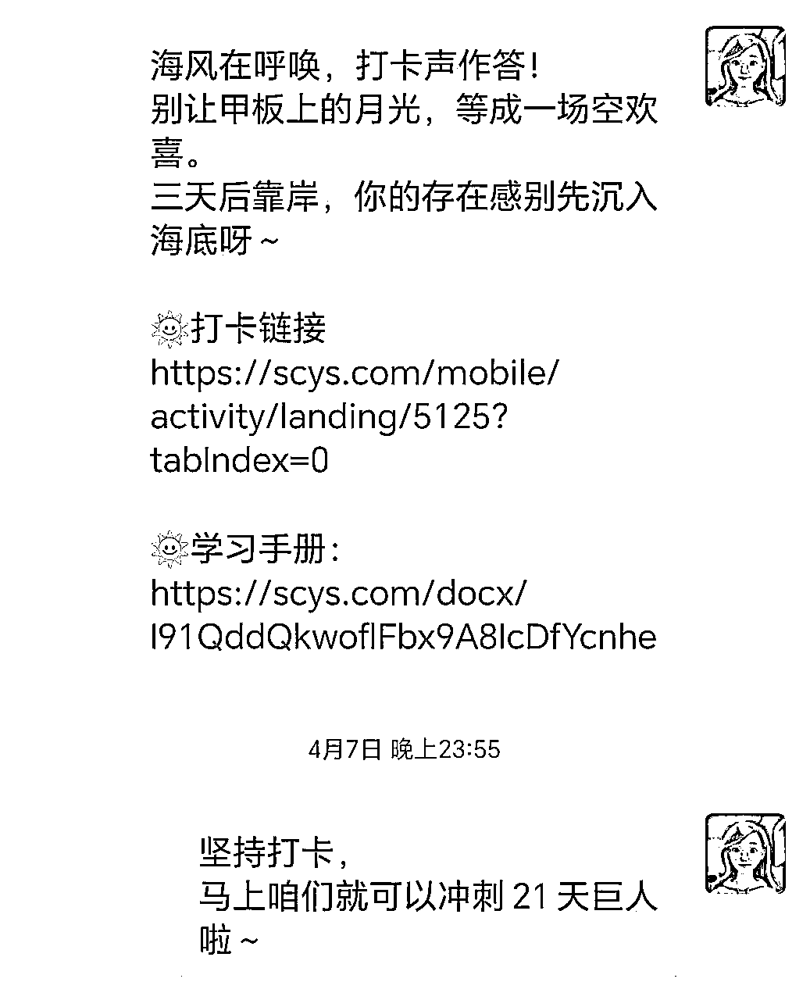

约定不提醒的船员：

*   不提醒（对方自律，不掉海）

*   少提醒（快掉海的话，个人建议提醒，同时和对方解释一下提醒的原因）

*   如果对方快掉海了，对方仍然回复不要提醒，则：放下助人情节，尊重他人命运

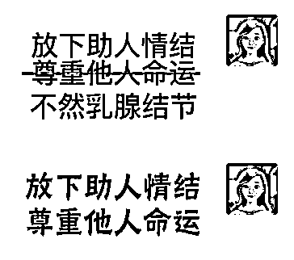

### 打卡方向解析

[太阳]明天开始打卡，打卡内容可参考：

*   项目思考

*   学习收获

*   项目变现过程（如有变现，一定要写变现金额，可入选好事日志，提升个人排名）

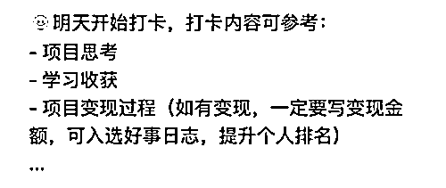

### 好事技巧分享

再小的进步，也值得被记录

比如：变现了 / 出单了 / 完成了项目中的比较难的某个卡点等

好事日志，小技巧分享

1.  小红书如有发布笔记，浏览量，不论多少，一定要写

1.  小红书如有变现，变现金额，不论多少，一定要写

1.  实操中解决了哪些难点，一定要写

不要害羞，也不要不好意思，加油~

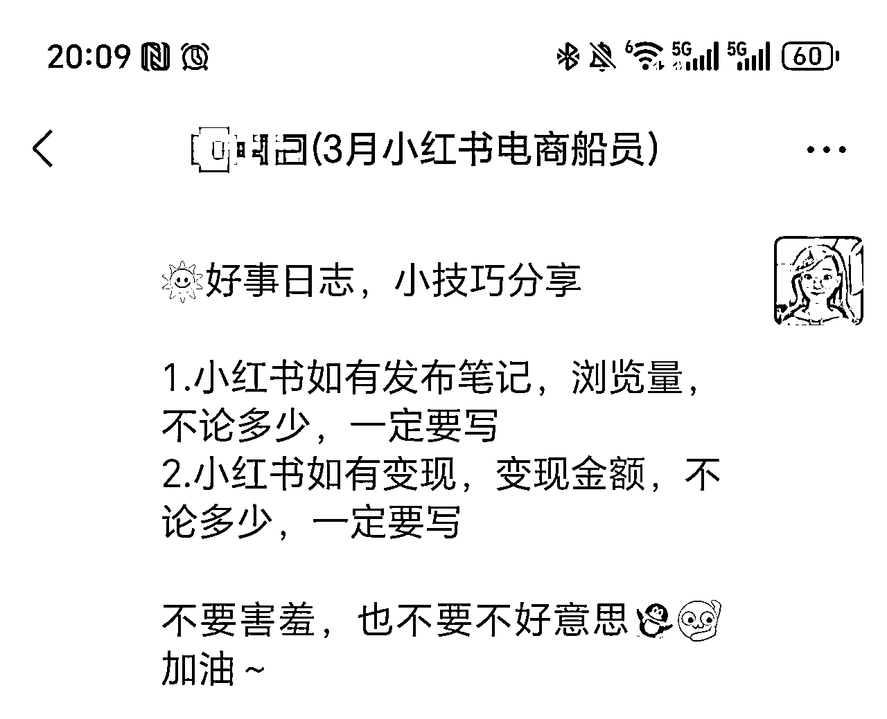

[太阳]作业批改：chatGPT

[机智]特点：对数据很敏感

[咖啡]建议：日志打卡，收获里面，视频多少播放量，涨粉多少，点赞收藏多少，数据都可以写上去～

### 提醒水日志的行为

水日志的行为，包含但不限于：

1、重复文案，凑字数

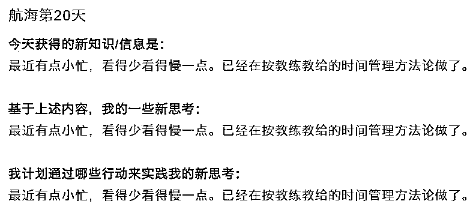

xxx，温馨提示一下

打卡的时候，3个模块尽量不要写一样的内容，容易被判水日志，也就是无效打卡。

还有可能会被运营截图，拿去做负面教材！

ps：已打卡日志，可修改内容～

2、打卡内容，全是乱七八糟随便凑出来的文案

水日志，文案举例：

收到款就会饿我好日u文化iu如何为借口的身份挥洒的回复我和四u热舞i会让发动机是开放式的空间放寒假啊水淀粉绝对是分开的时间发卡迪哦呜呃日哦我去热饭忘记哦i，hdoiqwioskmlew.r，为认监委考虑弱iu432894为UI的回复的时间付款即可

3、一模一样抄袭别人的作业

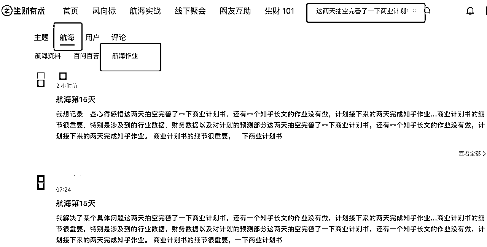

4、同一人连续几天提交相同的日志；

......

### 日志评论互动

*   查看所有船员的日志，点赞每个日志。

*   根据船员的日志内容，适当进行评论互动。

### 点评日志转发船员

教练给船员点评的日志，单独整理，打包私聊船员，方便船员快速回顾。

### 挑选好事日志

关注船员日志，如果有系统落选的【好事日志】，整理后发送领队，让领队协助修改。

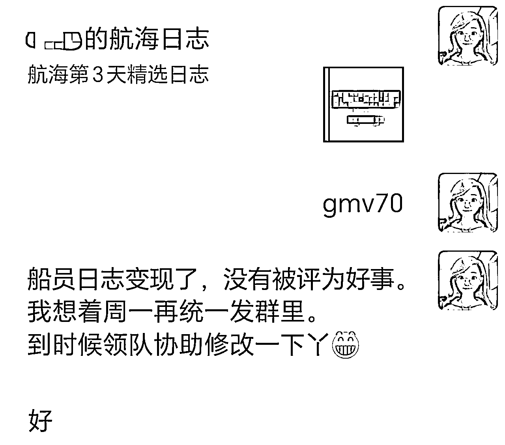

### 转发船员问题，协助提问

船员的问题发布到交流群后，若长时间未得到教练的回复。

咱们可协助转发问题到志愿者小群，请领队发到教练群，让教练关注问题和解答。

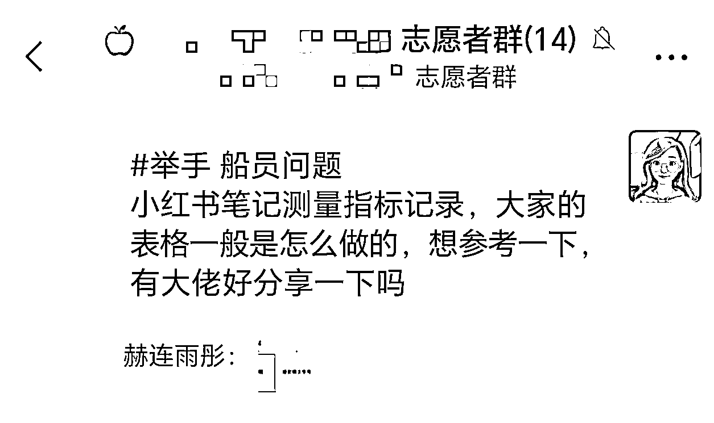

### 引导船员 #举手 提问

交流群里，如果发现船员提问没有带 #举手 标签，可私聊提醒对方，用正确的格式提问

### 项目交流，给出建议

*   船员做项目遇到问题，给船员提一些优化建议，鼓励对方，多尝试

*   坚持就是胜利

### 整理精华分享

教练分享的精华内容，批量转发船员学习，让船员快速获取重要信息

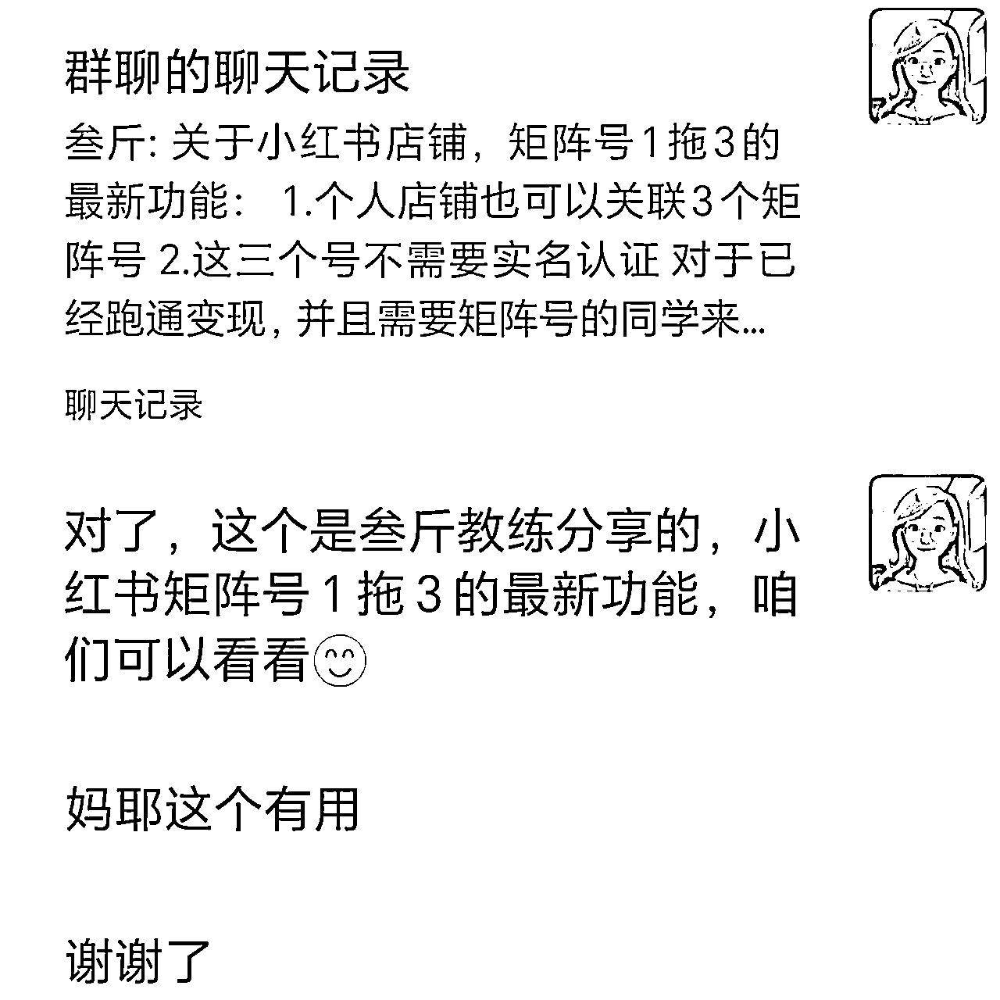

### 提醒船员打卡的方式

#### 微信文字提醒

船员不回消息，尝试的几种文案

宝子，你是不是被绑架了，如果不方便的话先回个1

每天花10分钟打个卡，12天一共120分钟，就能拿回199押金，相当于时薪100块。

按照正常工作，一天工作8小时，一个月22天，相当于月薪= 100*8*22=17600元。

动动手指打个卡，瞬间就在做着月薪将近两万的工作，你说这个打卡是不是超值？

今天顾客投诉我了，说我炒的菜很咸，厨师长把我的锅打翻了，问我盐是不是不要钱。我不敢反驳，我没有多放盐，只是炒菜时想到你还没有在【小红书电商-高客单蓝海】航海打卡，眼泪掉进了锅里。好了，不说了，我相信你肯定会打卡的~

[船员名字]，咱们打卡方面有遇到什么问题吗？

如有问题，可以随时和我说哈[愉快]

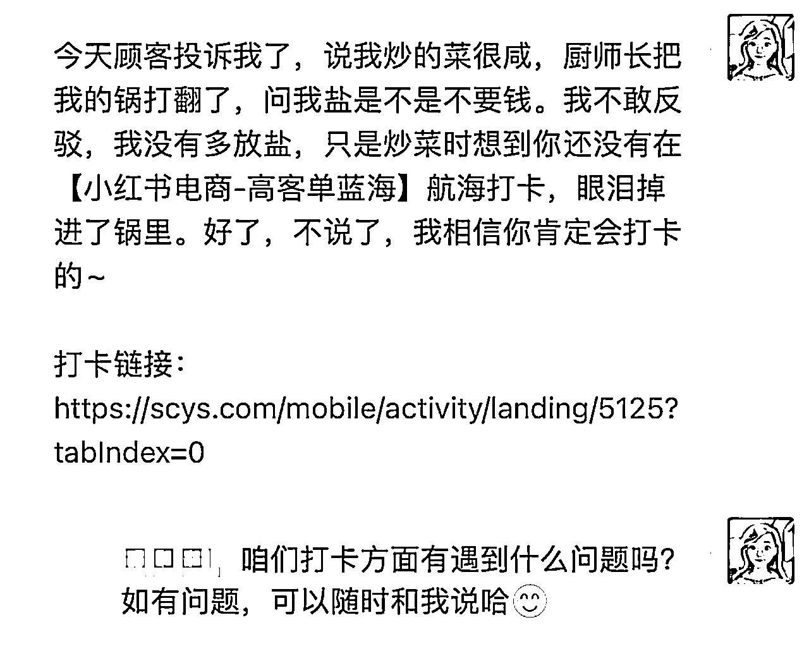

#### 微信电话提醒

*   文案+微信电话

*   可和对方提醒说明，电话只是一种提醒，无需接通

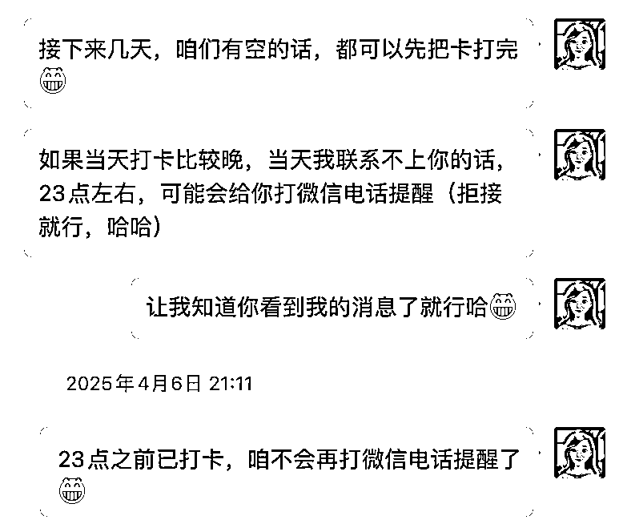

#### 手机短信提醒

*   手机发短信，需要和对方说明自己的身份，以免当成垃圾信息直接忽略。

*   当然，微信不回消息的话，手机短信作用也不一定大。

*   咱能做的就是尽力提醒，到位即可，问心无愧。

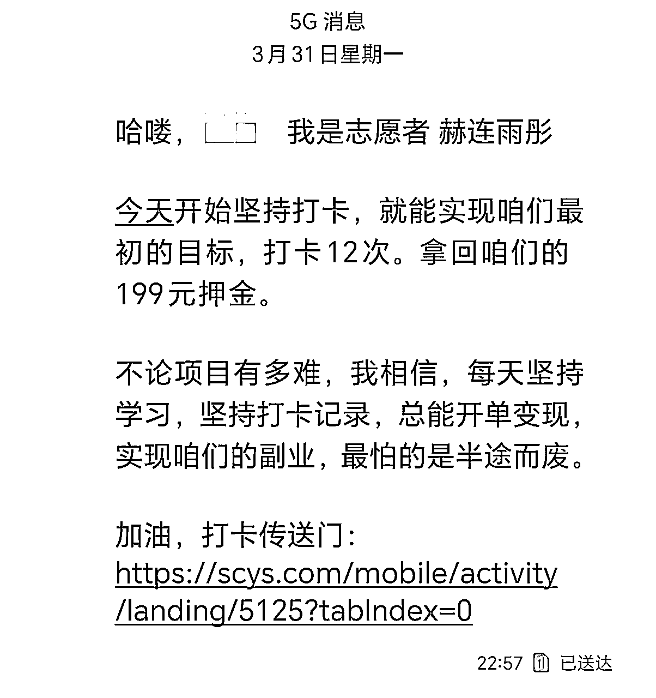

#### 手机电话提醒

*   船员快掉船的情况参考，平时不要这么激烈的提醒（骚扰）

*   还是那句话：尽力提醒，到位即可，问心无愧。

#### 协助传递bug

*   对于船员提供的bug问题，可以自己先尝试还原一下。

*   如果确实有问题，咱得和运营反馈。

*   同时和船员说明咱们已反馈，等待即可，无需担心。

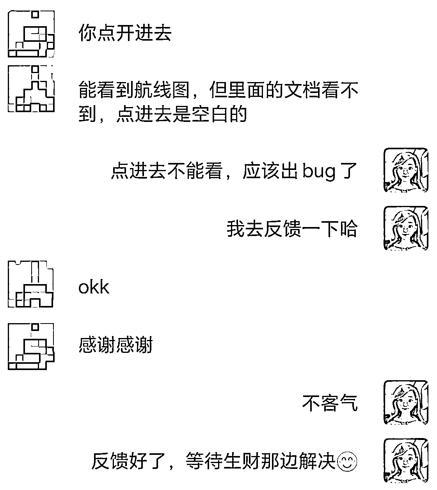

### 邀请船员发言

#### 个人建议

*   如果希望邀请更多船员发言，不要特意强调【优秀船员发言】，而是邀请大家对自己的航海进行一个复盘总结，以便下次更好的迭代或者改进。

*   因为很多船员没有赚到大钱（几百/几千）的时候，大家会认为自己还不够优秀，从而拒绝发言。

*   但是，复盘自己的项目流程，不论是否大家赚到钱，都可以自己进行一个总结。

*   不要因为一个【优秀的发言】，拒绝了更多船员的【复盘发言】。

*   个人总结：平时愿意回复志愿者，有在做项目的船员，一般都愿意给自己做复盘回顾。

嗨，【船员名字】

明天（周x）晚上20:00靠岸仪式，有个船员复盘的环节，你要不要也来写个航海复盘呀？

做的好的地方，做的不好的地方，以后改进的地方…

复盘参考：

在航海的 21 天中，你的收获是什么？有哪一个瞬间让你印象最深刻，帮助最大的呢？

（本次的项目跑通了没有？获得了哪些成果？有没有认识新朋友？是否学到了新技能……）

200字以内即可~

这个复盘参考也可以看下

咱们写好了，可以发我看看哦～

晚上到咱们发言环节的时候，提醒你呀[愉快]

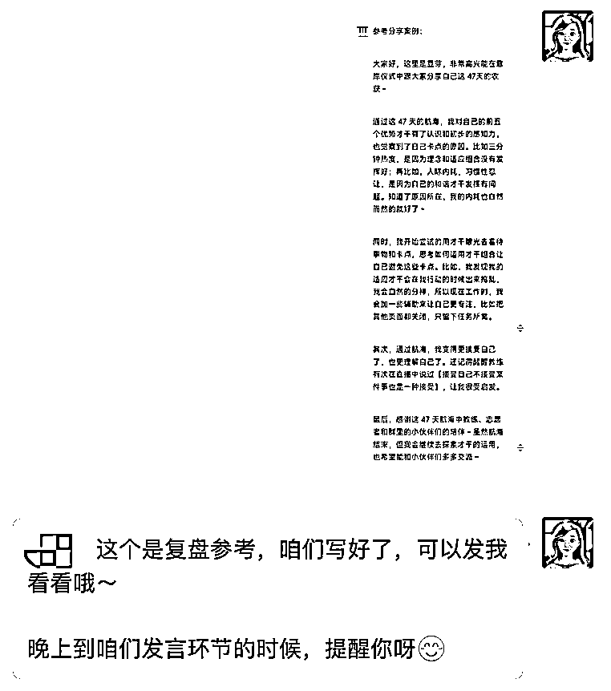

#### 优秀志愿者-S.妮 的话术展示

1.邀约话术

*   看到你在某某方面做的不错，你可以把这个过程分享给大家吗？

*   看到你对某某有很多想法，你能写出来分享给大家吗？

*   看到你在这个方面操作了很多天，你有什么避坑经验要分享给大家吗？

2.关怀话术

*   最近打卡有点少，是不是遇到什么困难了？ 需要帮忙吗？

*   你的学习进度如何？有没有什么我可以协助的地方？

*   好几天没打卡了，是不是遇到难题，一个人有点发愁？

*   最近有点掉队啦，是学习上遇到瓶颈，还是有其他原因？

### 协助优化复盘

*   让船员把自己写好的内容发给自己，咱们可以帮他们优化内容。包括段落，排版等。

*   帮船员添加缺失部分，比如自我介绍部分的内容。

### 退还保证金提醒

恭喜成功上岸[庆祝][庆祝][庆祝]，咱们记得在索引站的实战页，自助申请退保证金哟～

[太阳]退款周期：今天或者明天（常规是马上，哈哈）

[咖啡]如有问题，及时反馈哈[玫瑰]

退保证金链接：https://scys.com/mobile/home/activity

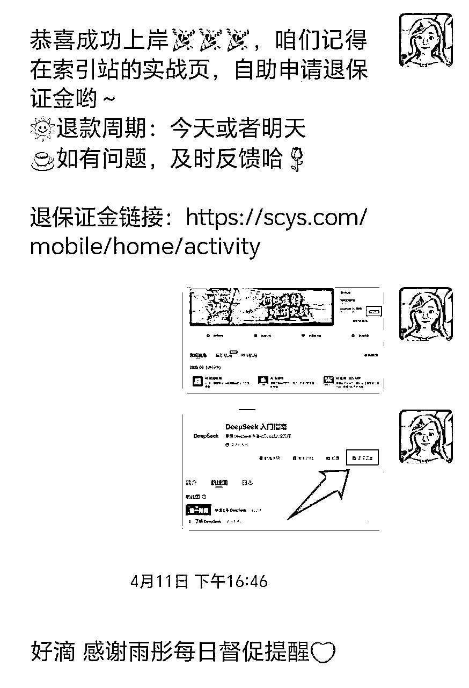

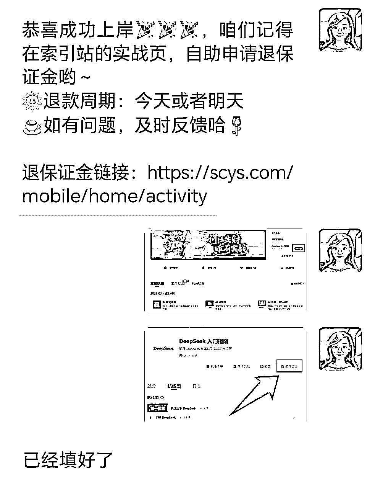

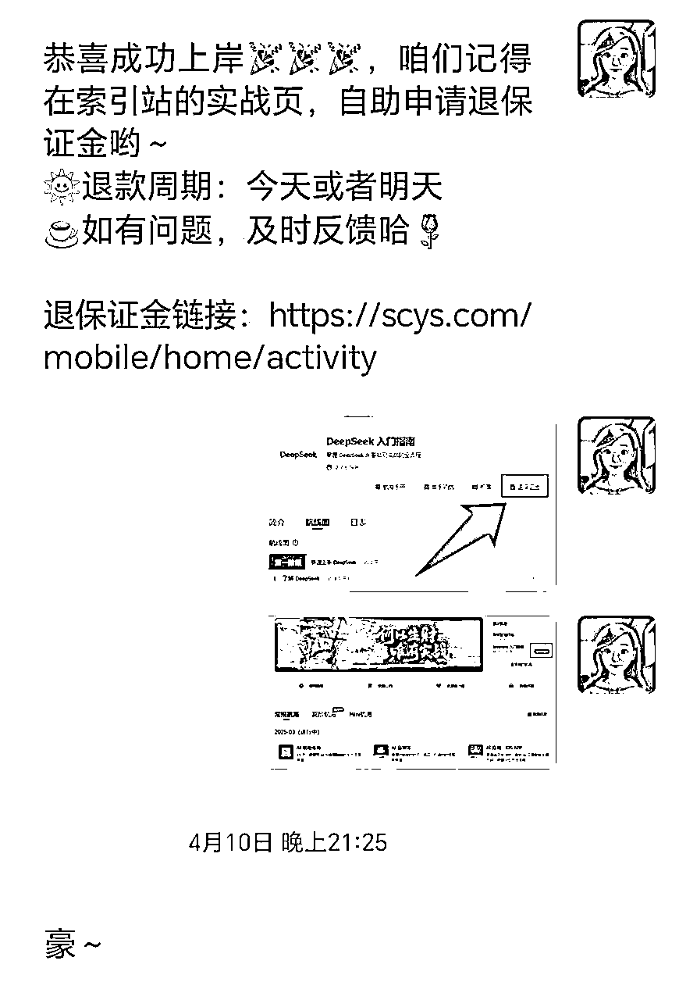

很幸运能碰到这么多很好的交流伙伴，未来的岁月，希望我们都能持续的学习成长，成功解锁更多副业。

## 团队协作：向上向下的「沟通铁律」

### 协助领队

#### 协助打包消息

交流群重要信息分享完毕后，如果一段时间后，领队有事，仍然未打包消息，咱们可以主动协助领队整理群里的大型分享，打包整理到志愿者小群，方便领队转发到禁言群。

#### 精华转发分享

志愿者大群看到好用的工具或者经验，可以转发精华内容到志愿者小群，方便其他志愿者学习，减少爬楼。

#### 积极响应领队

*   可以拍拍领队，让领队知晓咱们已查看信息

*   群里及时接龙，让领队知晓我们的最新进度

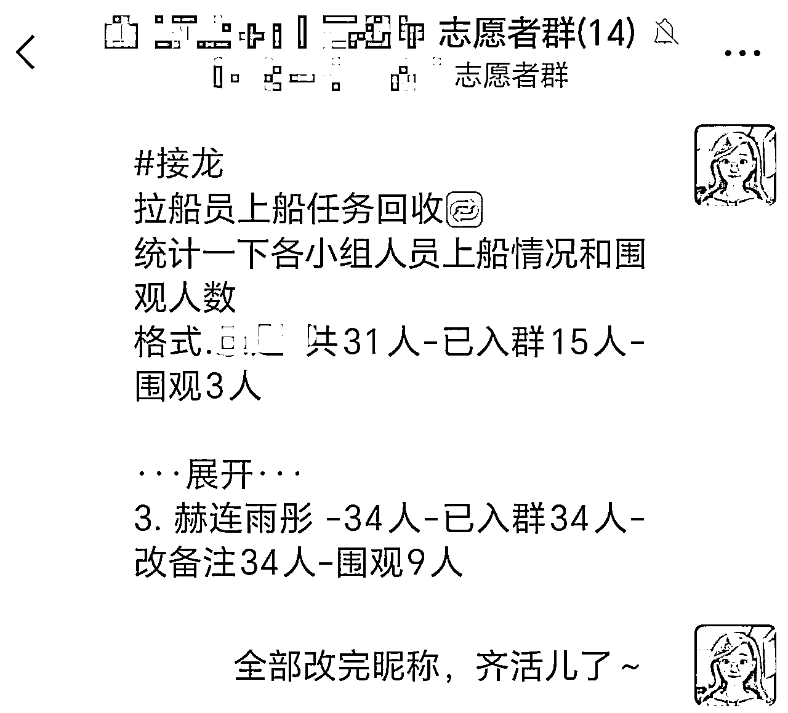

*   及时整理自己的志愿者分享，发送群里，让领队知晓，安心。

#### 推荐点评日志

*   尽量早些（建议上午推荐），给领队推荐点评日志，减少领队的焦虑感。

*   因为领队还需要筛选日志后，下午发送给教练点评。

*   点评日志的推荐数量，建议说明一下，做事有始有终，推荐完毕了也让领队知晓一下。

*   推荐好事，有则说明，没有建议也报备一下。毕竟系统落选的好事是需要领队去修改的。

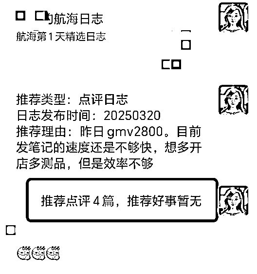

#### 区分推荐的日志

推荐类型：用于区分【推荐点评日志】还是【推荐好事日志】

日志发布时间：方便领队从后台对应日期，查找和修改落选的好事

推荐理由：让领队知晓志愿者为什么推荐该日志

日志链接：方便教练和领队查看日志详情

##### 推荐点评日志

推荐类型：点评日志

日志发布时间：20250320

推荐理由：-

日志卡片

*   打包的日志卡片，无法单独转发给到教练；

*   由于推荐点评的日志是需要发送给教练点评的，所以日志卡片需要单独发送；

*   推荐日志发在群里，也可以鼓励其他志愿者多推荐。

##### 推荐好事日志

推荐类型：好事日志

日志发布时间：20250320

推荐理由：-

日志链接：-

*   推荐好事，可打包发送；

*   日志是发给领队看的，就不需要在乎是否卡片了；

*   需要修改的好事，统一打包好之后发志愿者群里即可，这样也可以鼓励其他志愿者多推荐落选的好事，而不是默默的内部消化了；

*   每个好事对船员来说都是一份鼓励。

#### 生成日志卡片的教程

1.  微信关注 #生财有术服务号

1.  志愿者后台-找到对应日志详情（本志愿者小组），复制日志链接（网址）

1.  发链接给 #生财有术服务号，生成日志卡片

##### PC端演示

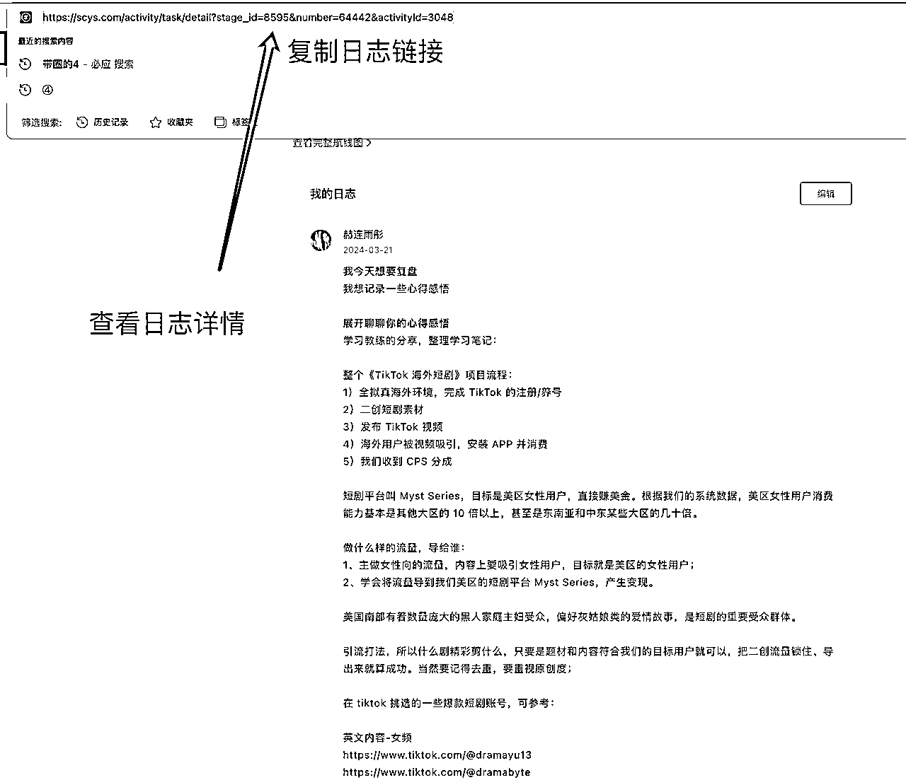

##### 手机端演示

手机端日志详情，进入的页面，顶部标题一定得是【生财有术・会员航海日志】才可以，否则页面不对。

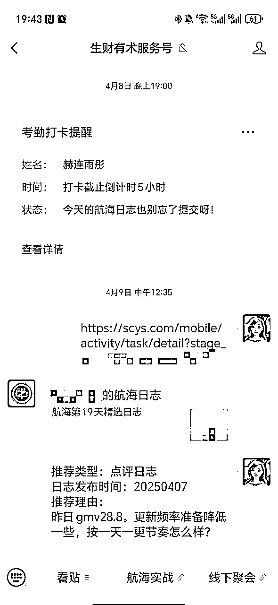

#### 系统评级标准（仅目前所知，以官方最新为准）

*   系统评级，是整个航海的所有志愿者一起，取前10%评分高的为A+级别，以此往后推

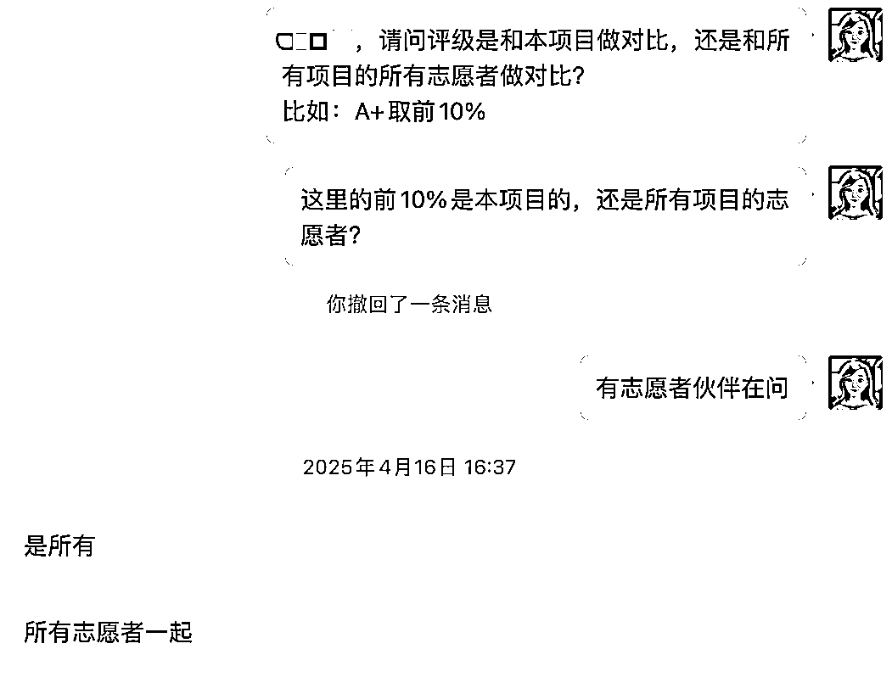

#### 了解领队

*   可以关心一下领队，和领队交流志愿者经验。

*   问一下领队关于志愿者评分怎么看，领队觉得志愿者可以得10分吗？如果不能，那志愿者应该可以多关注哪些？

*   防止一些误伤，哈哈

*   其实领队很认可咱们的，只是领队对于打分没有经验，把自己局限住了而已，如果提前交流就不会这样啦～

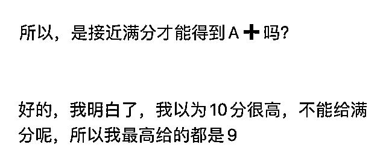

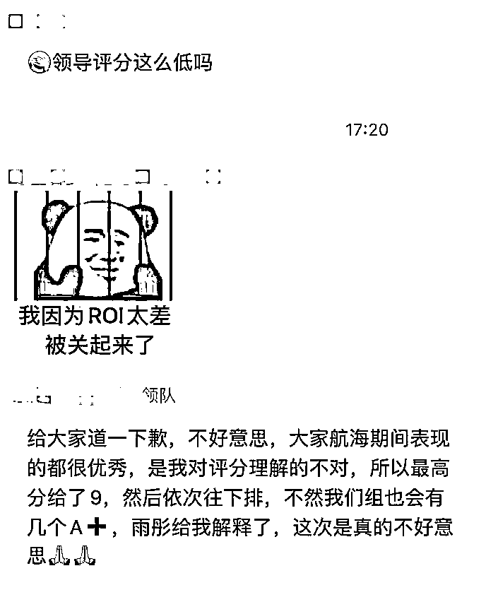

### 协同志愿者

#### 分享志愿者经验

把自己的志愿者小技巧发在群里和大家一起交流，提高志愿者协助效率

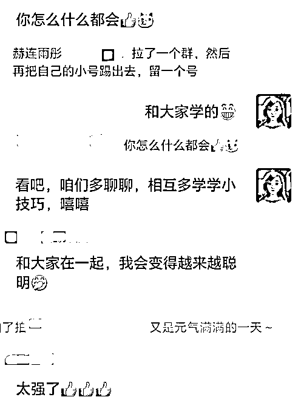

#### 分享催打卡文案

*   分享21天的提醒打卡文案，减少志愿者小伙伴没有文案发送的焦虑

*   也感谢志愿者小伙伴的认可

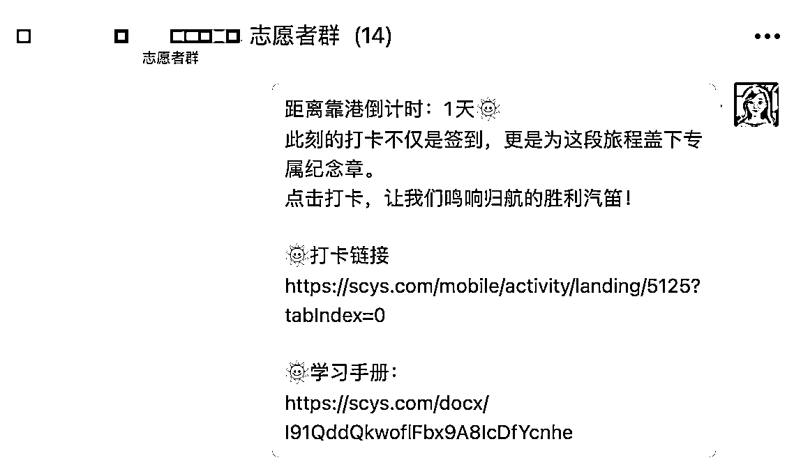

#### 分享常见问答

结合其他志愿者的分享问答，整理分享给到自己组的小伙伴

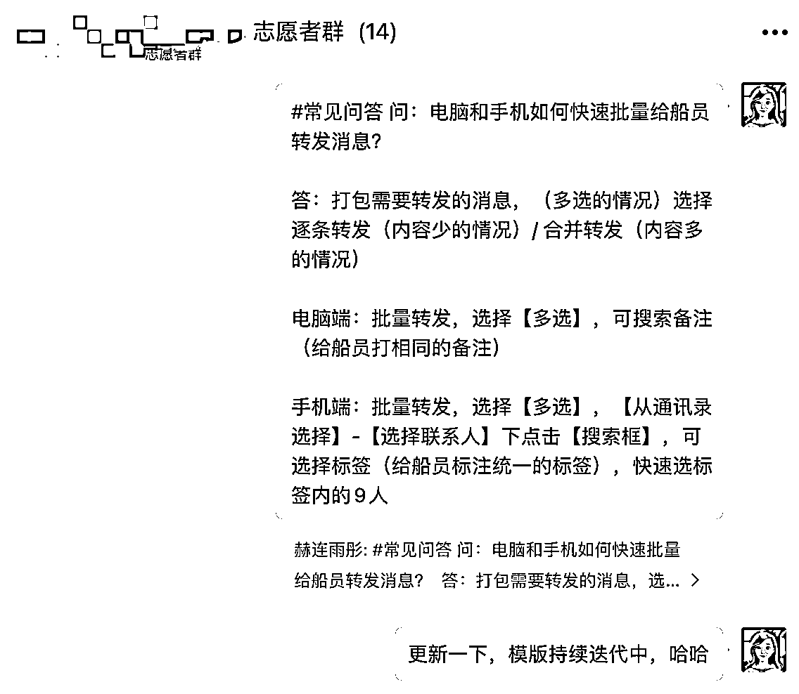

### 给教练响应

*   教练直播分享后，及时群里表达感谢，让对方知道我们一直在关注，教练不是一个人。

*   教练在群里图文分享的时候，不发消息打断对方节奏，但是咱们可以多拍拍对方。

### 协助运营

*   反馈pc端和手机端的网页bug

*   图文反馈，最好录制视频演示

## 避坑指南：3个成长启示

#### ❶ 注意好心提醒：用“为你好”提醒船员，给对方造成困扰

故事现场：

航海的最后一天，我违反了和其中一个不提醒打卡船员的约定，因为担心对方忘记打卡，而进行了一次提醒打卡。对方没有回复我。后面想起，挺不好意思的。

启示：

*   边界感比好心更重要：船员本就有选择权，我的“拯救欲”可能让他觉得被打扰。或许，应该再等等，等23:30 / 23:45左右再视情况决定是否提醒。可能自己还是着急了。下次注意。

故事现场：

船员在国外，剩下时间都不能忘记打卡，才能上岸的那种。

我打船员的微信电话，本意是想给对方来个强提醒（看到拒接的那种），防止对方掉海，没想到我竟然打通了。

这让我感觉自己侵入了对方的私人空间。怪不好意思的。

启示：

心态问题，乐观一些，船员愿意接电话，说明对方可能也是不介意的。

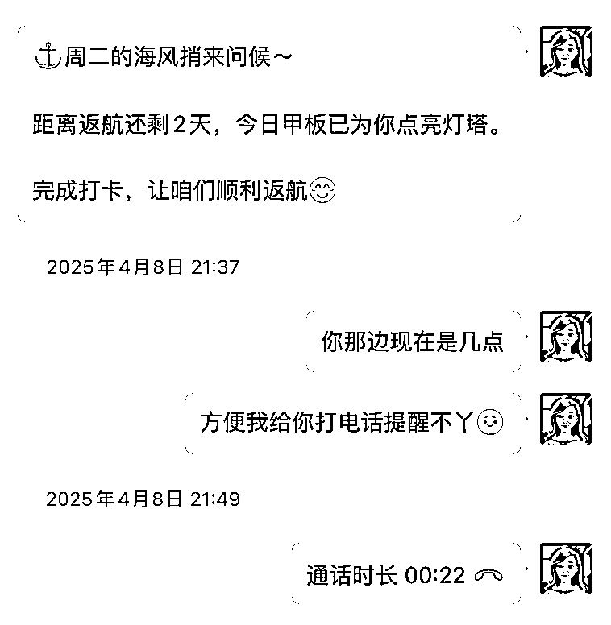

#### ❷ 保护自己的微信账号

故事现场：

不少志愿者在群里晒图，说自己的微信账号被提示有问题。

启示：

*   微信添加好友，不要短时间内，批量快速添加船员（容易被封账号）

*   建议：正常账号，慢慢的添加，添加5个左右休息会儿，再继续添加。

#### ❸ 警惕工具陷阱

故事现场：

电脑端发起的好友申请，电脑关闭后，切换到手机端微信时，船员才通过好友，咱们之前添加的备注和标签会不起作用，导致需要重新添加备注和标签

启示：

*   微信电脑端申请的好友，需要电脑端微信使用时，好友通过了，之前添加的备注和标签才会起作用。

*   工具是「双刃剑」，便利背后藏着「隐性风险」。曾以为「手机操作更快捷」，却因系统差异导致失误。现在养成「重要操作三核对」习惯：邀请前核对标签人数→邀请中观察是否卡顿→邀请后检查成员列表。

# 我的模板

我的「效率军火库」：从手忙脚乱到游刃有余

志愿者工作的本质是「用系统对抗混乱」——通过工具分层管理信息、用流程固化重复动作、以数据驱动决策，把80%的精力聚焦在20%的核心价值（如船员赋能、资源链接）上。

以下是我通过实战打磨出的效率体系，可直接复用至各类项目管理场景。

## 三大核心工具的「场景化应用」

### 管理类

1、飞书表格「动态备注系统」

痛点：30+船员的需求跟踪易遗漏，传统表格无法实时标记状态变化。

解决方案：

*   符号标记法：

*   ①日催：需每日提醒打卡的船员（如自律性较弱的新人），行标可用🔴红色符号。

*   ②3天预警：约定「不足3天提醒」的船员，行标可用🟡黄色符号。

*   ③不打扰：围观船员或明确拒绝提醒者，行标可用⚪灰色符号。

2、微信群「表情符号备注」

针对不同的微信群聊，可以在群聊信息的【备注】里面，添加上不同的表情符号

主要目的：区分航海交流群和航海禁言群。

防止看错群名字，发错消息。

### 沟通类

*   易歪歪/手机短语「三层话术架构」（邀请上船 / 日常提醒 / 突发状况对应模板）

痛点：新人参加航海，不了解规则易慌乱，重复沟通消耗时间。

解决方案：

#### 第一层：邀请船员上船模板（加好友至开船前）

*   话术分类逻辑：

| 场景 | 模板数量 | 核心目标 | 示例话术（已验证高响应率） |
| 新船员破冰 | 3条 | 建立信任+清晰规则+降低焦虑 | “在上船前，有三件事情需要我们一起协助完成，预计会花费你 5 分钟左右的时间～” |
| 老船员唤醒 | 1条 | 快速确认+轻量化互动+激活参与感 | “看到你之前也参加过航海，算是老航海人啦，具体的航海规则咱们就不说了，来，上船！” |
| 围观船员确认 | 1条 | 明确提醒边界+传递关怀 | “打卡不足12次会丢押金，不足3天提醒，平时不打扰～” |
| 通用场景 | 7条 | 覆盖航海介绍、邀请进群、改备注提醒、航海目标、提醒频率、航海日历等 | “两个群都已经邀请你啦，进群后可以拍一拍我~” |

*   避坑指南：

*   拒绝“话术依赖”：对情绪型问题（如船员焦虑打卡难度），需结合个性化安抚，而非机械发送模板。

*   定期清理无效话术：每航次结束后删除过时内容（如旧项目名称），保持话术库简洁。

📚航海实战-志愿者手册：

📚航海实战-志愿者SOP及话术：https://scys.com/t/BOA7rh3H

##### 加好友

我是生财有术【xxx】航海的志愿者-xxx，你的报名审核通过了，我来邀请你进群~

##### 加标签

*   生财有术

*   xx项目-年-月，如：小红书电商-25年3月

##### 新船员-打招呼01

哈喽，你好呀，我是【xx项目】志愿者-xxx，可以叫我xx，现在来邀请你上船~

了解到你是第一次参加航海，我大概讲一下航海的相关内容哈。

航海以自助实战为主，生财提供项目手册，如果你有不懂的可以在航海群 #举手 提问，会有专业的教练进行答疑。

##### 新船员-打招呼02

在上船前，有三件事情需要我们一起协助完成，预计会花费你 5 分钟左右的时间～

1.  确认生财有术航海公约（请逐一阅读公约信息，不要遗漏了哈）

1.  邀请你进入航海群

1.  关注 #公众号：生财有术服务号

（记得打开通知哦，主要用于提醒打卡）

发送最新的航海公约图（找领队或者运营要）

举例：2025年6月的航海公约

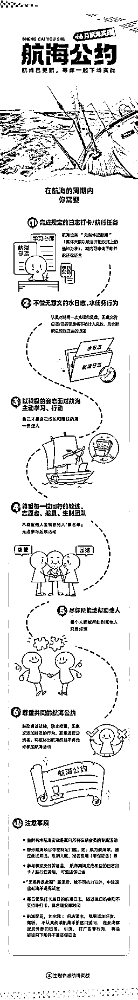

我来【划重点】总结一下航海公约：

1.  使用生财有术星球绑定的微信参与打卡；

1.  航海 21 天需要打卡至少 12 次，每周建议完成 4 次打卡；

1.  每天 1 次打卡机会，错过不能补卡，不满 12 次不予退还保证金；

1.  每天会有【精选日志】可以来“抄作业”，学习实战思路；

1.  每周二、四有【高手分享】，提供问答和群聊精华；

1.  在群内提问时，具体描述问题，加上 #举手 标签，方便教练定位并解答问题。

##### 新船员-打招呼03

在此之前，需要你关注一下 #公众号：生财有术服务号

后续的提醒打卡、日志加精、好事推荐，都会通过服务号传达给你，通知要打开才可以收到消息哈。

##### 老船员-打招呼

哈喽，你好呀，我是【xxx项目】志愿者-xxx，可以叫我xx，现在来邀请你上船~

看到你之前也参加过航海，算是老航海人啦，具体的航海规则咱们就不说了[呲牙]

这次由我来为你保驾护航啦，一起成功上岸哇，来，上船！

##### 通用打招呼01

接下来，我会邀请你进入2个航海群：

【航海交流群】✅是航海的主要阵地，是大家交流、答疑、分享、链接的地方

【禁言通知群】🈲️这个群是咱们这个项目的通知群，主要用于重要信息同步，关注禁言群，重要信息不错过

##### 通用打招呼02

两个群都已经邀请你啦，进群后可以拍一拍我~

为了大家交流、链接更方便，需要你在【航海交流群】按照格式：昵称-地区-总参与航海期数，更新你的群备注～

这样有任何问题的话生财官方也可以快速判断，并帮咱们处理的哈[玫瑰]

你的备注是：

从志愿者后台，复制船员的备注，单独一行发送给船员，方便船员复制粘贴

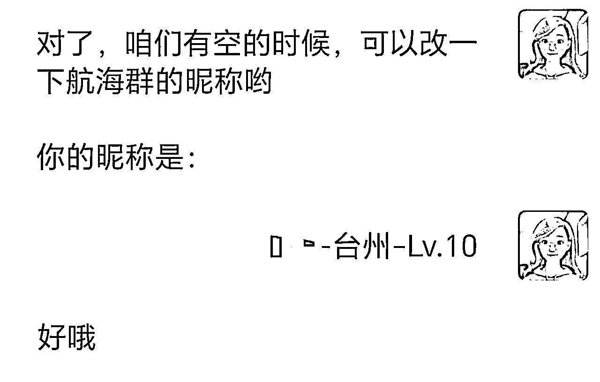

##### 通用打招呼03——航海目标

咱们这次的航海目标是什么呢[机智]

12次打卡/15次打卡/21次打卡？

12/15/21次打卡的航海证书，分别如下：

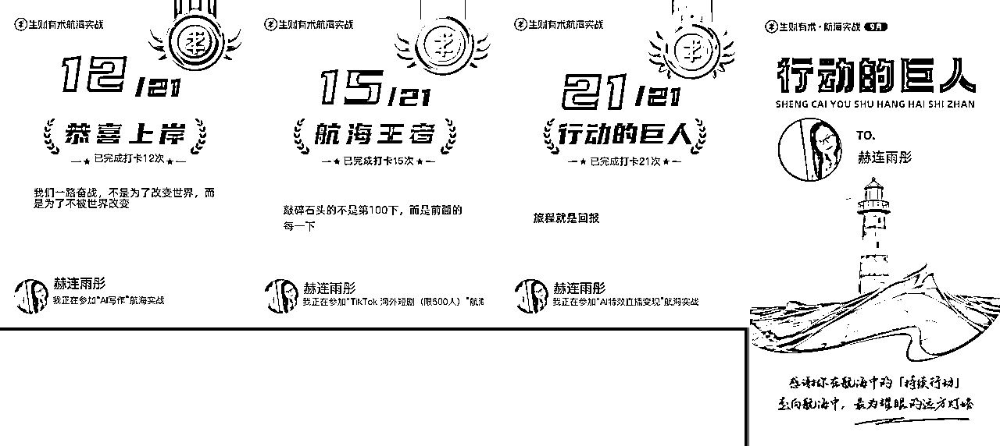

##### 通用打招呼04——提醒频率

咱们希望志愿者提醒打卡，频率是怎么样呢？（无回复，默认1哦）

1、每天提醒

2、休息不足3天开始提醒

ps：21:00-23:59之间提醒，志愿者提醒之前已打卡，则不提醒

##### 围观船员——打卡提醒

对了，后台显示咱们是【围观船员】，不需要咱们志愿者提醒打卡的是吧？

接下来的航海，正常情况下，我将不再对你进行打卡提醒哦～

当然，如果咱们打卡的休息时间不足3天了，我将进行提醒打卡，这样可行不？

以防万一，咱们忘记打卡而丢失押金丫～

*   如果船员同意，那么按照约定提醒

*   如果船员坚持不希望提醒，最好是不打扰对方

*   出于人道主义：如果围观船员快掉海了-无法打卡12次。比如：航海最后1天，围观船员只剩1天就可以上岸了，23:00以后，如果对方还未打卡，个人建议是提醒一下。（目前我算是违反约定，最后一天航海，晚上的时候，提醒过1次该类船员。对方上岸了）

*   当然，违反约定去提醒，可能会引起船员心理不满。这个看志愿者和船员沟通是否良好，灵活变通处理。

*   另外，围观船员是否上岸，不占小组的上岸率。

##### 通用打招呼05——同步航海消息

[船员名字]，x月开船时间是x月x号（下周x）晚上8点，视频号直播形式，咱们记得预留时间哦～

发送对应的航海日历，让船员了解航海的全貌。

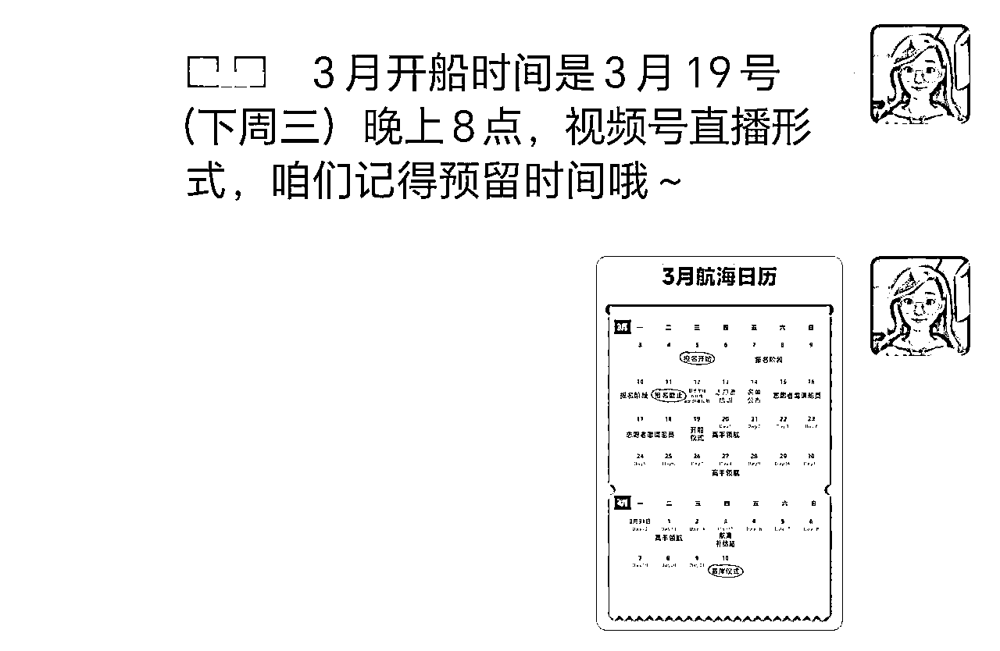

#### 添加船员

区分船员的类型：

根据准备好的话术，提前整理到【易歪歪】工具 / 快捷短语（手机键盘）上，根据船员的身份，发送不同的文案。

##### 新船员：额外介绍航海规则

新船员-打招呼01

新船员-打招呼02

新船员-打招呼03

通用打招呼01

通用打招呼02

通用打招呼03——航海目标

通用打招呼04——提醒频率（非围观船员的情况发送）

通用打招呼05——同步航海消息

##### 老船员：邀请进群即可

老船员-打招呼

通用打招呼01

通用打招呼02

通用打招呼03——航海目标

通用打招呼04——提醒频率（非围观船员的情况发送）

通用打招呼05——同步航海消息

##### 围观船员：额外确认打卡提醒

围观船员——打卡提醒

#### 第二层：日常提醒模板（航行期）

*   用自己的语气，修改相关信息文案，及时批量转发提醒所有的船员

*   很多船员常问的一个问题“直播有回放吗？”，“有，一定有”。

*   我们在提醒船员的时候，可以备注说明“直播结束后，等主播生成回放，再次点击分享链接，可查看录播”

*   晚上同步信息的时候，顺手可以给船员附带一个打卡链接，方便船员打卡

##### 开船仪式

*   预热&转发直播间

哈喽，圈友下午好[咖啡]

[太阳]今天下午xx点破冰仪式结束，记得及时发自我介绍哦～（已发忽略）

[太阳]今晚开船仪式在20:00点的直播间，大家记得预约，不要错过～[庆祝]

[太阳]航海手册，预计明天中午开放～

[太阳]明天开始打卡，打卡内容可参考：

*   项目思考

*   学习收获

*   项目变现过程（如有变现，一定要写变现金额，可入选好事日志，提升个人排名）

...

2025大家一起生财有术～

已预约开船仪式，可拍拍我[爱心]

圈友晚上好，

20:00的开船仪式开始了，记得观看哦~

直播结束后，再次点击分享链接，可查看录播~

##### 高手领航

*   预热&到点转发直播间

直播开始啦，咱们记得学习哦~

查看回放，再次点击分享链接即可

附带打卡传送门：

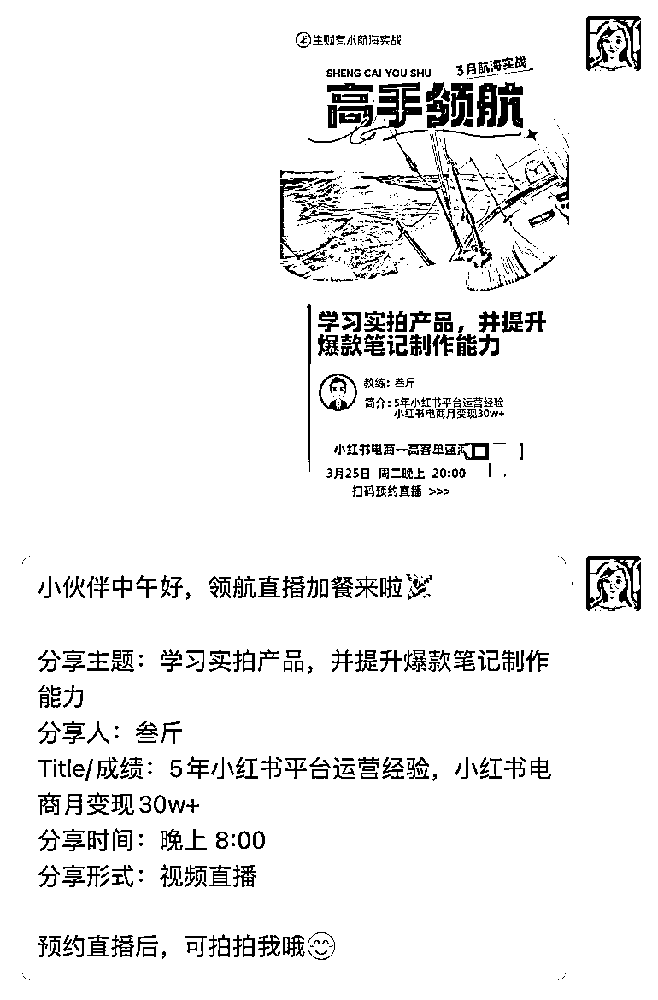

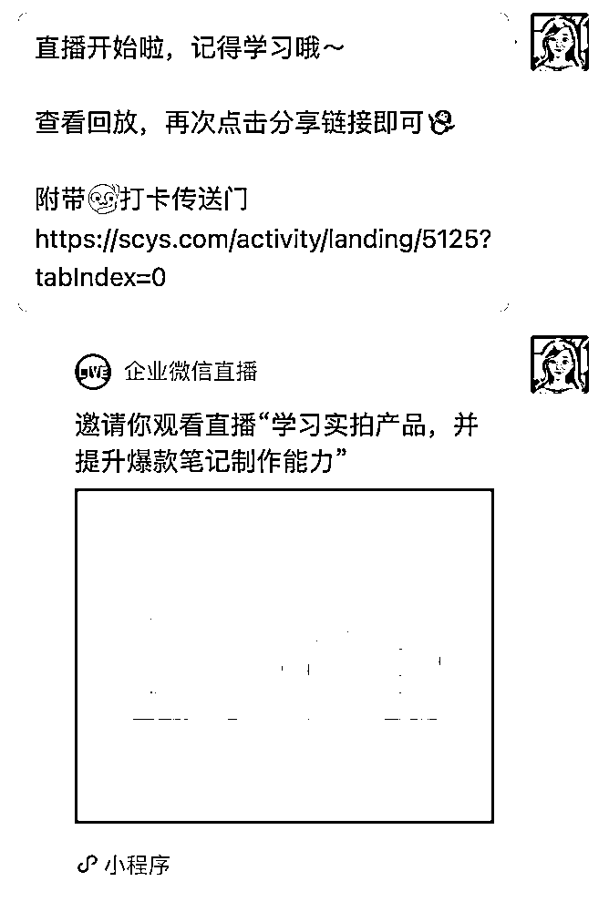

##### 教练的干货分享

教练分享的重要信息和资料，可私聊给到船员，有以下作用：

*   减少交流群刷屏导致的信息差

*   和船员增加聊天互动的可能性

*   为提醒船员打卡做一个铺垫

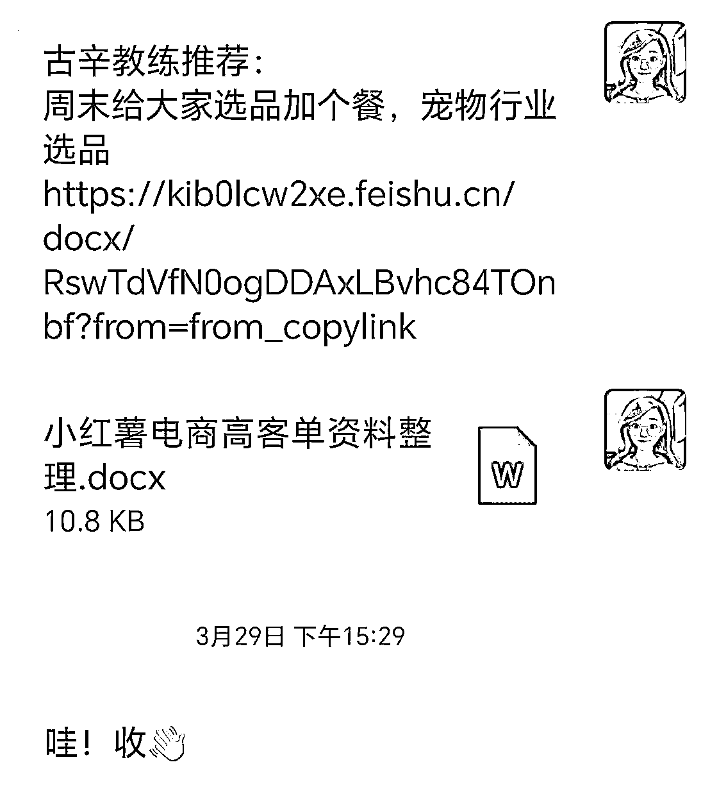

##### 优秀船员分享

*   预热&到点提醒

*   如果航海里面有【优秀船员分享】，那么这也是一个重要的信息，需要同步到船员

##### 日志打卡提醒

借助AI（deepseek、豆包、通义千问、KIMI等等），可生成系列的21天提醒打卡文案。

*   用AI生成初稿后，手动替换「航海项目名称」「船员昵称」「具体数据」，避免生硬

*   每天21:00-23:00之间，按「船员标签」发送打卡提醒

你是一位志愿者，需要提醒船员打卡，今天是周三，距离航海结束只剩1天，现在需要给未打卡的船员发提醒打卡的文案，要求积极向上，5条不同的文案

你是一位志愿者，需要提醒船员打卡，今天是周六，现在需要给船员发提醒打卡的文案，要求幽默有趣押韵， 5条不同的文案

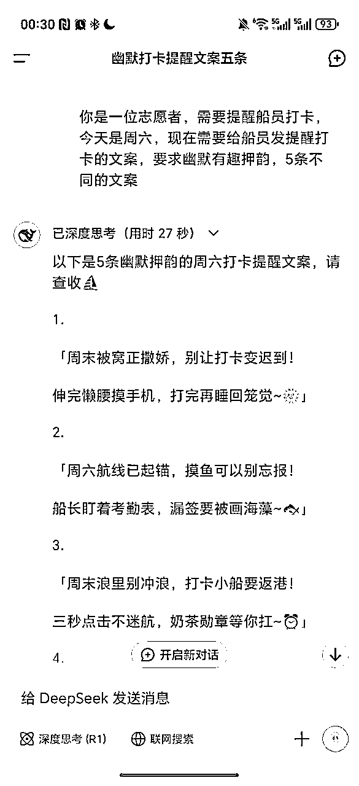

你是一位志愿者，现需要一份催打卡文案，参考以下文案来21天不同的催打卡文案

参考文案：

今天顾客投诉我了，说我炒的菜很咸，厨师长把我的锅打翻了，问我盐是不是不要钱。我不敢反驳，我没有多放盐，只是炒菜时想到你还没有在【小红书电商-高客单蓝海】航海打卡，眼泪掉进了锅里。好了，不说了，我相信你肯定会打卡的~

以下是21天不同版本的催打卡创意文案，延续了原版幽默风格和场景化设计：

Day 1（外卖员版）

刚才送餐超时被平台扣钱，客户说餐盒里都是水渍。其实是我骑车时想着你还没在【小红书电商-高客单蓝海】航海打卡，汗水顺着下巴滴到袋子里。不过没关系，我知道你今天肯定会打卡的~

Day 2（理发师版）

给客人剪发时手抖剪缺一块，他说像被狗啃的。都怪我分心想着你还没在航海日志打卡，现在正跪着给客人办会员卡赔罪呢...你肯定不忍心看我这样对吧？

Day 3（园丁版）

刚被物业投诉浇花淹了电梯井，其实水枪失控是因为想到你还没打卡。现在整栋楼都在找"水漫金山"的凶手，救救孩子吧~

Day 4（程序员版）

代码写错把用户头像全变成可达鸭，老板让我今晚住公司。如果你现在完成【小红书高客单】航海打卡，这些鸭子说不定就变回原样了？

Day 5（宠物美容师版）

给柴犬修毛时剃出个地中海造型，狗主人说要送我上热搜。还不是因为惦记着你没打卡手抖了！汪星人的尊严就靠你拯救了~

Day 6（健身教练版）

带学员深蹲时走神数错数，现在被罚做100个波比跳。每跳一下都在默念"XX该打卡了"，地板快被我砸出坑了...

Day 7（摄影师版）

拍婚纱照把新人拍成表情包，新娘说要去消协投诉。镜头里全是"还没打卡"的弹幕，这单黄了的话...你懂我意思吧？

Day 8（快递员版）

分拣快递时把生鲜包裹扔进了服装堆，监控显示我当时在碎碎念"XX怎么还没打卡"。现在大闸蟹正在拆你的羊毛大衣，急！

Day 9（主播版）

直播时把"家人们"说成"打卡人们"，老板说我被航海计划搞魔怔了。如果你现在完成打卡，明天我就不用戴兔耳朵谢罪了QAQ

Day 10（咖啡师版）

给客人做了杯"航海特调"，浓缩咖啡+酱油+芥末。都怪想着打卡走神了，现在顾客说要送我上奇葩料理大赛...

Day 11（插画师版）

画商稿时把甲方爸爸LOGO写成"小红书打卡"，现在正在会议室表演土下座。救救画手，孩子不想改第27稿了！

Day 12（空乘版）

发餐时把"鸡肉饭"说成"打卡饭"，整个机组都在学我说话。机长说再完不成KPI就要让我去擦舷窗了TAT

Day 13（图书管理员版）

整理书库时把《百年孤独》归到菜谱区，满脑子都是"高客单蓝海"。现在学生们在美食区找马尔克斯，场面逐渐失控...

Day 14（婚礼司仪版）

把"交换戒指"说成"交换打卡"，新娘笑场口红粘牙上了。这将成为我职业生涯的滑铁卢，除非...（疯狂暗示）

Day 15（动物园饲养版）

喂食时把香蕉塞给了企鹅，北极熊在啃芒果。满脑子都是航海日志打卡的事，现在动物们集体绝食抗议了！

Day 16（钢琴老师版）

教小星星弹成航海进行曲，家长说孩子参加了邪教组织。如果你现在打卡，我还能狡辩这是最新教学法...

Day 17（超市理货版）

把TT摆在婴儿奶粉旁边，经理说要送我上社会新闻。还不是因为想着"蓝海""高客单"走神了！速来打卡救我狗命！

Day 18（游泳教练版）

教换气时自己沉底了，学员拍了我扑腾的糗照。水底最后吐的泡泡都是"快打卡"，现在整个泳池都在传阅表情包...

Day 19（算命先生版）

昨天把客人姻缘签写成"速去小红书打卡"，现在道观被举报搞网络诈骗。这位施主，你与我道门有缘啊~

Day 20（幼儿园版）

教小朋友唱"拔萝卜"变成"快打卡"，现在整个班都在问老师是不是要改行。园长说再这样就去后勤削土豆...

Day 21（最终冲刺版）

航海最后一天在监控室值班，把"注意安全"广播成"立即打卡"。现在全公司都知道我在追星了，不过这次真的是最后一次催你啦！

每天更换不同职业场景，保持意外感和新鲜度。结尾保留温柔催促+信任感，符合互联网语境的同时，通过夸张的职场糗事引发会心一笑，提升打卡动力。

#### 第三层：常见问答——突发应对模板（此处整合了很多优秀志愿者的答复，致敬）

##### 问：船员添加失败怎么办？

答：听说，这么加船员，就没有找不到的

1.  搜微信号

1.  搜电话号

1.  电话联系或者短信联系

1.  志愿者群互相捞人

1.  志愿者后台备注并反馈领队

1.  领队也找不到的话就会反馈鱼丸，鱼丸帮忙联系

##### 问：船员不改昵称怎么办？

答：提醒到位了就行，不强求。

卖可怜的方法，比如：

因为咱们小组的昵称没有改全

你们志愿者在别的志愿者面前都好自卑

##### 问：船员一直不进群怎么办？

答：提醒一下船员，举例：

哈喽，小伙伴，咱们记得进群哦，航海直播都是发在群里的，非群成员不可查看直播。如果有问题，在群里 #举手 ，教练看到了才能协助解答哦

##### 问：手机上如何快速邀请所有船员进群？

答：添加好友之前，就可以做的事

1.给船员打标签

2.群里邀请的时候，点击标签，可以快速选择标签里面的所有人，进行群聊邀请

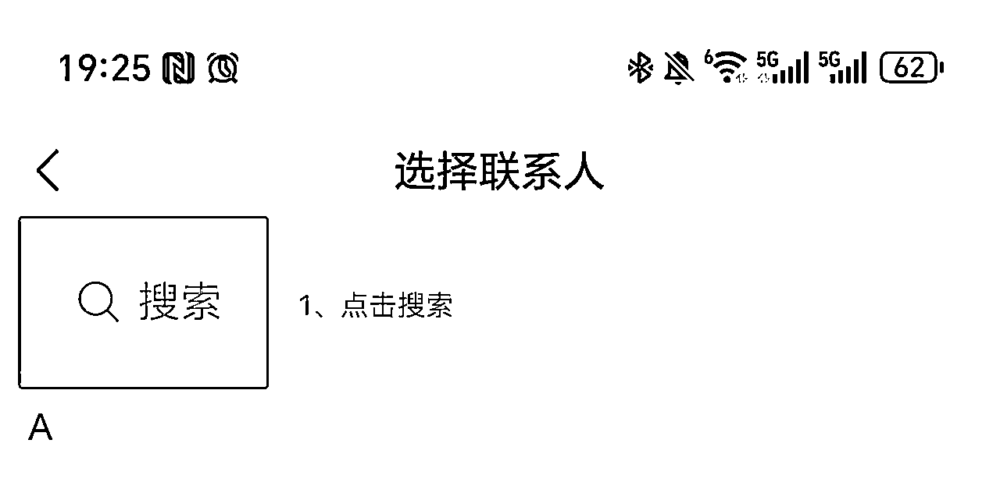

##### 问：如何检查船员是否改群昵称？

答：

PC端：

进入航海交流/禁言群→[搜索群成员]→[输入给所有船员打的相同备注]→[船员头像]→[查看群昵称]

手机端：

点击微信底部[通讯录]→[标签]→[船员标签]→[船员头像]→[朋友资料]→[更多信息]→[我和他的共同群聊]→如果设置了群昵称，会在群聊名称下方显示

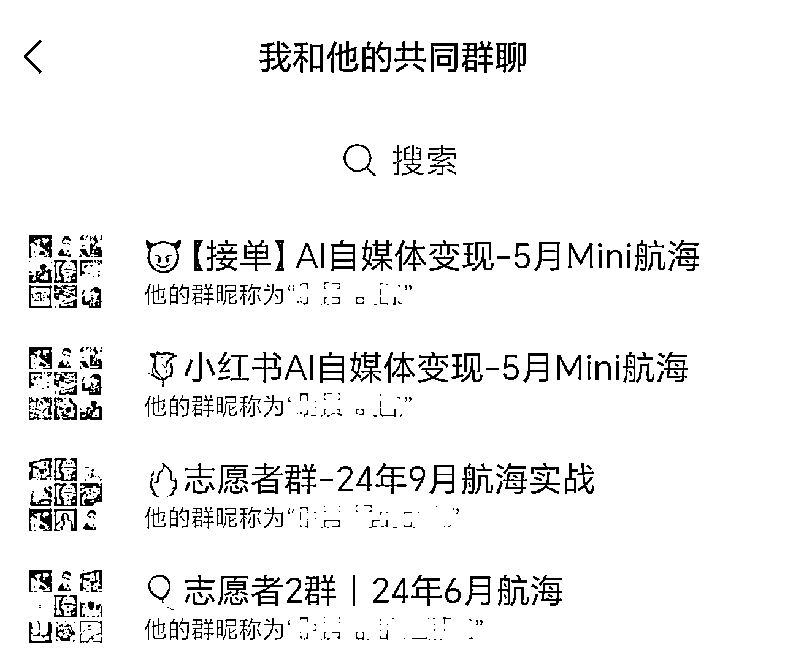

##### 问：志愿者后台开放时间啥时候？

答：官方给志愿者培训完之后（志愿者培训，以官方通知时间为准）

##### 问：船员说自己在国外，和国内有时差，一般每天打卡作业时间是几点至几点？打卡时间有什么建议？

答：航海期间只要打卡12次就能退押金

考虑到你在国外有时差，我的建议是，在航海21天期间打卡13次

这样你按照所在国家的时间去操作就行了，就可以不考虑时差

比如：固定一个时间段打卡，但是这个时间段在国内的时间不要是22:00-2:00这个区间

这样可以避免同一天打卡

##### 问：船员让志愿者加另外的微信，拉进群后，发现船员的2个微信转账的名字不一样，如何回复？

答：官方需要保证圈友们的会员权益。

你两个号的实名不一致，不太确认是一个人。

建议用你本人号进去哈。

##### 问：航海在什么情况下，允许换号进群？

答：夫妻、亲子关系或本人的其他微信都可以～

如果圈友不方便提供自己比较隐私的结婚证明或者户口证明，以下的方式都可以验证邀请进群

1.  用两个手机各自打开两个微信的某个界面，拍照或者拍视频；

1.  或者请圈友录屏切换自己的微信账号；同一时间视频通话的方式证明是自己的号等方式都可以进群

1.  添加圈友的另一个微信，微信转账的最后一个字相同，也是同一个人

##### 问：chatGPT没有识别出来的，我认为是好事的日志，怎么改？

答：

1、自己先在志愿者后台修改日志为【推荐好事】，让chatGPT复查；

2、推荐时间长了（2小时及以上），chatGPT还是没修改【好事】，则发群里推荐好事，让领队协助修改

##### 问：怎么看日志是否好事？

答：带【好事】标识的就是选上了好事

##### 围观＆保证金相关

1、上船后，还能改成【围观】不？

答：不能

2、上船后跳船，是不是就直接退船不退保证金？ 还是必须要在船上待着不用管打卡了？

答：跳船后，不退还保证金，最后不行动，就是没上岸

3、志愿者会知道哪几个是围观的船员吗？

答：会的。志愿者后台对于围观船员有专门的标签显示。

4、围观船员不打卡，可以退保证金吗？

答：如果围观船员打卡不足12次，不退保证金。

5、志愿者如果已经有报名的实战航海，需要主动退吗？

答：不用主动退，志愿者小群等领队发起接龙统计，等官方来退就行。主动退可能会导致志愿者后台异常。

##### 航行期：常见问题汇总（此处原始作者【吴佳文】，根据个人理解适当修改）

### 【打卡篇】

1、志愿者要打卡么？

答：建议如果是准备真的学些东西，还是参与打卡；是否打卡，对小组的考勤都无影响

2、志愿者打卡记里程不？

答：不记小组里程，只记个人里程和个人排名

3、排名有什么用？

答：用来鼓励船员，增强团队凝聚力用

### 【点评篇】

1、什么样的日志值得点评？

答：有想法、有突破、有问题、有卡点。总之就是需要教练进行讲解/鼓励的都可以

2、要推荐多少点评日志给到领队？

答：建议每个点评日1-3篇，可包含前一天（工作日）或前三天（周日-上周五）的日志，领队会进行二次筛选发给教练

3、船员日志被筛选后点评，要不要告知船员？

答：教练在群里对船员的日志进行后，可以私聊转发给船员，告知船员，你的日志被教练点评啦~

4、要如何发送点评日志？

答：将船员日志链接发给 #公众号：生财有术服务号 ，生成的日志卡片和推荐理由，一起发给志愿者小群

### 【直播篇】

1、直播有回放么？

答：都有，一定有

2、怎么直播完还没看到回放？

答：会晚一点，需要导出再上传到后台，回放好了，领队会在群里通知

3、和另一个航海冲突了，怎么办？

答：冲突是正常的，选一个直播先听，根据现有卡点听直播效果最好，直播可以现场提问，回放只能看别人的提问

4、直播要通知船员么？

答：要的，每次直播都需要大家对船员进行批量转发预告，提前提醒，八点开播时也要批量的私聊转发直播链接给船员，保证大家尽量都听到直播

### 【互动篇】

1、船员的日志我要看么？

答：都要看，尽量本组的船员都点赞，让船员知道你与他同在。

如果有好事日志没有选上，可以把船员的日志链接+推荐好事理由，一起发到志愿者小群，领队看到了会协助修改。

### 【提醒打卡篇】

1、每个船员都要提醒打卡么？

答：不是的，开船前，和船员约定打卡频率，后面根据约定来提醒即可。

即将上岸，很晚未打卡的船员，适当提醒一下即可。

2、提醒在什么时间比较合适？

答：建议提醒时间在 20:00-23:00

3、有的船员一直不回我消息，我还要提醒他么？

答：不用非要等待回复，咱们提醒到位了即可。

他不理咱们，就说明他错过了和志愿者有交流的机会，是他的损失。咱们做好提醒记录就好了，把更多的精力放在更多值得的人上。

4、有的船员口头上说要打卡，但是到了行动完全不动咋办？

答：卖个萌，卖个惨，都行，或者把锅甩给领队，领队可以替大家背卖惨的锅。比如：

完不成任务领队要XXXXX处罚我了。

### 检查类

痛点：船员改群昵称不规范，人工逐一检查耗时费力。

操作步骤：

#### PC端「昵称核查」

答：

PC端：

进入航海交流/禁言群→[搜索群成员]→[输入给所有船员打的相同备注]→[船员头像]→[查看群昵称]

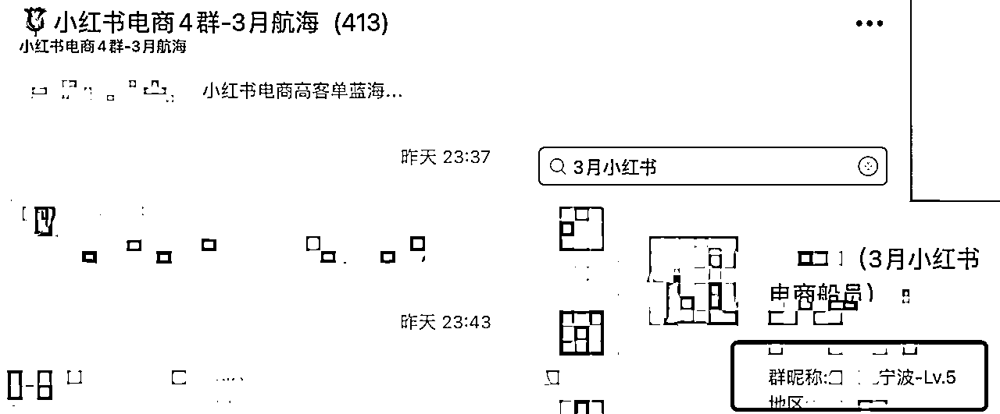

#### 手机端「昵称核查」

手机端：

点击微信底部[通讯录]→[标签]→[船员标签]→[船员头像]→[朋友资料]→[更多信息]→[我和他的共同群聊]→如果设置了群昵称，会在群聊名称下方显示

效率对比：传统逐个检查需30分钟/组，此方法常规5分钟内完成，准确率100%。

## 流程优化：把重复动作变成「肌肉记忆」

批量操作

*   电脑端「备注搜索批量转发」+手机端「标签分组一键邀请」（效率×3）

打包需要转发的消息，选择批量转发（内容多的情况）／逐条转发（内容少的情况）

### 电脑端「批量转发」

*   选择【多选】，可搜索备注（给船员打的相同的备注）

### 手机端「批量转发」

*   批量转发，选择【多选】，点击【搜索框】，可选择标签（给船员标注统一的标签），快速选标签内的9人

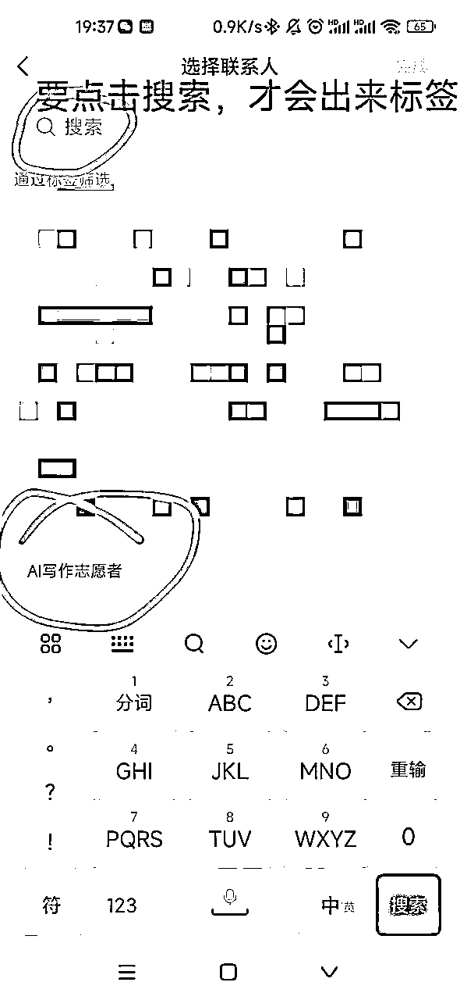

## 📌 工具之外的「效率心法」

1.  二八法则：80%精力给「高响应船员」（积极打卡+主动提问），20%精力用「标准化工具」覆盖「低响应人群」，拒绝「用战术勤奋掩盖战略懒惰」。

1.  最小可行性系统：先搭建「飞书表格+微信标签+易歪歪」的基础三件套，跑通1期后再迭代（如加入AI生成文案），避免过度追求完美导致启动延迟。

1.  借势团队力量：发现高效工具或话术时，及时同步志愿者小群（如「易歪歪的「话术共享」功能可跨组复制模板」），用「利他」思维构建效率共同体。

* * *

# 我的成长

荣誉之外：那些「看不见的成长复利」

生财航海的志愿者之旅，就像一场「能力定投」——你在服务中打磨的思维、积累的关系、沉淀的认知，会在未来某个时刻形成「成长奇点」。以下是我用2年时间验证的「非对称收益」，比A级评级更珍贵。

## 🌟 能力迁移

### 1\. 用户思维

给船员划重点的习惯，延伸到日常沟通。

比如，给家人讲「今晚加班」时会说：「20:00前要改3版方案（What），老板盯着（Who），可能要到22:00（When），先不用等我吃饭啦～」信息传递效率提升50%。

### 2\. 效率思维

清单结构（附职场/生活双场景示例）：

| 维度 | 航海场景 | 本职工作场景 |
| What | 今日3件事： | ①跟进A客户方案修改 |
| Who | 船员XX/领队XX/教练XX | 客户xx/部门同事xx/设计xx |
| When | 23:00前完成催打卡 | 14:00前确认方案初稿 |
| 延伸价值： | 完成目标 | 提高工作效率 |

*   用「轻重缓急四象限」给清单排序，航海期间同时兼顾全职工作，减少加班情况。

## 🌿 关系资产：比术值更值钱的隐形财富

### 1\. 同频链接

有幸链接到不少和自己同一个职业的伙伴，我们也曾相互分享设计的教学课程。

### 2\. 技能互补

*   自己本身是设计，链接到圈友后，时有需要设计的伙伴寻求协助做图。

*   当然，我也认识了很多优秀的大佬，比如阿寻，我发现她是一个语言组织能力很强的人。我在公司组织活动，不知道如何组织语言，也曾寻求她的帮助。大家真的很好呀～

### 3\. 官方认可

*   将自己的收获到的东西，整理复盘，分享给到更多圈友，为咱们的知识共享奉献自己的一份努力。

*   将自己的对生财官网的每个体验，尤其是bug反馈给官方后，收到了“种子体验官”的称号～

## 📍 给新人的「非功利性成长指南」

### 1\. 允许不完美

*   曾因领队对打分规则不熟悉，没有拿到A+级，一度焦虑。后来发现：不同领队风格不同（有的重数据，有的重温度），而我在服务中学会的「志愿者沟通技巧」才是真正属于自己的能力；

*   建议：收到评分后，重点问领队「您觉得我哪件事可以做得更好？」，把「评级焦虑」转化为「具体行动清单」。

### 2\. 记录颗粒度

*   对比两组数据：

*   「广撒网型」：本期提醒38人打卡，仅15人上岸，记录「完成每日提醒」；

*   「深耕型」：聚焦3名潜力船员，定制「数据复盘+难点拆解」，全部冲刺21天打卡，记录「帮XX从0到1做出xx项目闭环」。

*   后者看似「服务人数少」，但积累的案例深度，能让你在任何需要「说服力」的场景（如求职、合作谈判）中脱颖而出。

*   当然，按照约定，对船员完成打卡提醒是必须完成滴～

### 3\. 享受过程

*   最难忘的瞬间：【闲鱼二手书】航海结束时，有个船员私信说：「成功上岸有雨彤师傅的功劳，请你恰奶茶～」

*   这种「被需要感」，比任何评级都更有力量。它让我明白：真正的成长，藏在你为别人创造的「情绪价值」和「确定性」里。

## 🔍 成长复利的本质：做「时间的朋友」

当你用「能力迁移」的视角做志愿者，会发现每一次沟通都是「沟通能力」的刻意练习，每一次问题解决都是「项目管理」的沙盘推演，每一次链接都是「人脉资产」的零存整取。这些「看不见的积累」，终会在某个节点形成「认知跃迁」——或许是你突然看懂一个商业模型，或许是你轻松化解一次客户冲突，又或许是你遇到一个一拍即合的创业伙伴。

成长复利的关键，从来不是追求某个瞬间的爆发，而是像志愿者每天坚持「精准提醒」一样，把「正确的小事」做到极致，然后等待时间的回报。✨

# 结语：在细节里，看见服务的另一种可能

## 【两年时光的「显微镜与望远镜」】

当我在生财网址的【我的航海】看到「参与10期航海」的记录时，突然想起第一次做志愿者时的手忙脚乱——凌晨两点还在核对船员名单，生怕漏过一个人；

为了一句提醒话术，用AI生成无数文案。那时的我不会想到，这些「多做一点点」的小事，会在时光里长成一片森林。

## 🌟 10期航海×N个「多做一点点」：细节的复利效应

每期航海，都能碰到新手志愿者，我把常见的问答都整理后分享，加上标签 #常见问答，每日再碰到类似的问题，我就搜索记录标签，快速定位搜索已有答案。

这些「多做的一点点」，起初只是出于「怕麻烦别人」的本能，后来却发现：当你把别人眼中的「分外事」做成「份内的标准」，细节就会变成你的「差异化标签」。

## 🌱 成长的镜像原理：服务他人即照见自己

做志愿者的第500天，我突然意识到一个真相：每个船员的问题，都是你认知的一面镜子。

*   当船员说「不知道怎么写日志」，其实是在提醒我：「是否把流程拆解到足够简单？」于是有了后来的「开船仪式的温馨提示模板」；

*   当船员抱怨「提醒太频繁」，其实是在拷问我：「你是否真正理解了对方的需求？」于是学会了用「打卡频率问卷」替代「一刀切」提醒；

*   当领队称赞「你的数据复盘很清晰」，其实是在告诉我：「你在混乱中建立秩序的能力，已经超出了预期」。

这些「照见」让我发现：服务不是单向的付出，而是通过解决他人的问题，不断迭代自己的思维精度和情感粒度。就像打磨一块玉石，每一次与他人的互动，都是去掉杂质、露出光芒的过程。

## 🚀 服务的另一种可能：从「完成者」到「创造者」

传统意义上的志愿者，可能是「按流程做事的执行者」，但在生财航海的两年里，我看到了三种「超越期待」的可能：

1.  把细节变成「系统」：当你把「给船员写祝福」变成「航海情感账户」机制，就会发现这能提升30%的船员活跃度；

1.  把经验变成「资产」：当你把「处理过的100个问题」整理成《志愿者常见问答》，这些内容就会成为你求职时的「硬通货」；

1.  把关系变成「生态」：当你为船员链接到第10个合作机会时，会突然发现自己成了圈友口中的「靠谱枢纽」，这种信任比任何评级都更珍贵。

## 【写给未来的自己】

下一个两年，我依然会在夜晚23:50-23:55之前给快掉海的船员发最后一条提醒，会为了优化一个话术反复推敲，会在航海结束后，复盘自己的收获。因为我明白：成长从来不是某个耀眼时刻的爆发，而是无数个「多做一点点」的细节，在时光里慢慢发酵的结果。

就像生财航海的本质，从来不是「21天的打卡任务」，而是通过服务他人，学会在细节里扎根，在重复中创新，在付出中看见更辽阔的自己。

那些你认真对待的每个「小细节」，终会在未来的某天，连点成线，照亮你未曾想象的成长路径。✨

感谢一路走来，遇到的很多志愿者伙伴，教会我的成长。感谢顺序不分先后：多米杨LR、Y哥、文少、乐之、闯天下、骄阳、吴佳文、阿寻、辛拉面、Ajin等～