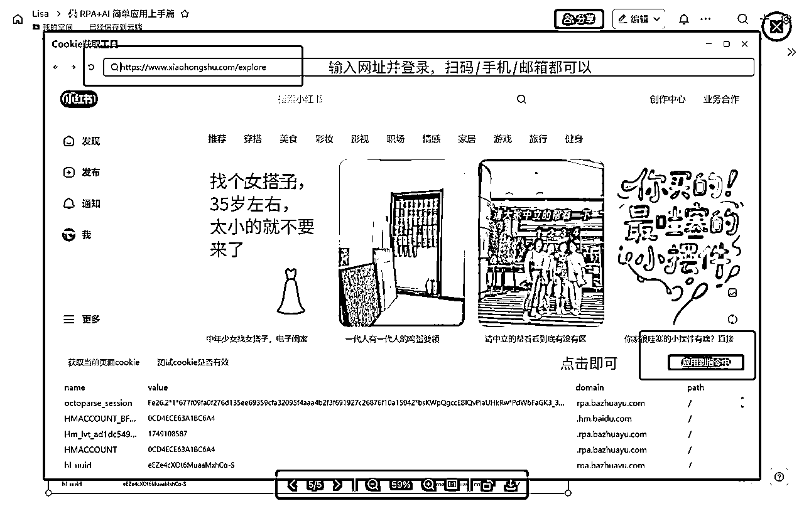
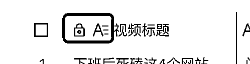

# 🙌 RPA+AI 简单应用上手篇（小红书-飞书多维表）

> 来源：[https://r0rel9lqdms.feishu.cn/docx/VSmedTYaLo6qdkxeVgVcO6R4nTg](https://r0rel9lqdms.feishu.cn/docx/VSmedTYaLo6qdkxeVgVcO6R4nTg)

因为好奇，解锁了一个认知：

## 【AI+RPA = 同时拥有大脑🧠和双手👐】

是不是即使可以用上AI帮助内容生产，还是有很多需要电脑鼠标🖱点点点、Ctrl+C和Ctrl+V的动作？公众号排版或电商商品上架也需要按照标准步骤每次都一步步来；批量处理图片的时候，不见得网站工具可以完成自己的特别需求......每次看到别人的视频，明明手没动，电脑💻/手机📱屏幕全自动的客服获取有效信息、回复评论好神奇！

原来这些都是通过RPA来实现的。原理上也不复杂，通过RPA的工具，像搭积木一样拖拉拽功能模块就可以实现了。想把自己上手RPA的例子分享给大家。做的简单应用是：

用📕小红书搜索🔍关键词将最热内容下载到飞书多维表🐦

### 视频

过程逻辑是：RPA获取内容——导入到飞书多维表——AI内容生产

操作方法：

方式一：RPA工具已上线平台，直接使用，试用3天

⏬RPA应用下载链接： 小红书-视频信息提取至飞书多维表-[Lisa]| 八爪鱼RPA（免费试用3天）

🎬视频教程：

准备三项参数：飞书App ID、App Secret、飞书多维表地址即可

飞书配置参数获取教程：

方式二：自行搭建，永久免费🆓，如下教程⬇️

### 准备工具

1️⃣八爪鱼RPA（暂仅有Windows版）https://partner.rpa.bazhuayu.com/R9Sc6Z

2️⃣飞书多维表

3️⃣飞书多维表插件（AI提取视频文案⚠️氪金提示，可选项）

### RPA设置逻辑

### RPA所有流程

#### ⚠️ 浏览器安装RPA插件

RPA工具窗口左上角——管理扩展——选择浏览器，点击安装——打开浏览器，开启RPA插件功能

#### 第一步：RPA设置数据提取

RPA-打开网页

RPA-设置Cookie

RPA-筛选数据

根据人工操作步骤选取RPA工具，如：填写网页输入框、点击网页元素、鼠标悬停等设置，以达到需要采集数据的页面。完全模拟人的动作步骤来调用工具就好了。

选取元素的步骤是：进入功能框，点击“捕获元素”的按钮，【Ctrl+鼠标左键】

案例内容是：进入小红书页面后，填写关键字AI，然后点击查找，筛选视频内容，筛选最多评论的排序，最终达到当日排名最靠前内容的列表（如下）

RPA-循环相似元素

因为需要根据以上列表逐一打开每一个内容，才能获取视频链接、博主名称、点赞数、收藏数、评论数，以及最后要点击左上角关闭窗口，所以设置了“循环相似元素”的指令。

⚠️Tips：在选择相似元素的时候，需要用【shift+🖱鼠标左键】选择一个组所有的元素内容（都有红框）。在循环内的指令就可以按照选择元素的顺序，点击打开——获取元素（视频链接、博主名称、点赞数、收藏数、评论数）——点击关闭。

如果需要选择同一页面更多贴，可以先设置滚动鼠标加载更多内容，再设置循环♻️。

#### 第二步：飞书多维表授权步骤

教程：https://rpa.bazhuayu.com/helpcenter/docs/vPhs0M

视频教程：

步骤Tips：

1.  在https://open.feishu.cn/app创建一个应用

1.  在应用中获取APP ID和APP SECRET

1.  为应用机器人开启飞书多维表授权

1.  飞书多维表“添加文档应用”（右上角——三点——更多——“添加文档应用”——输入以上创建的应用名称）

1.  飞书多维表——分享——授权所有人“可编辑”（⚠️我遇到了打开所有授权但是仍无法写入飞书多维表的情况，打开”可编辑”权限后🤖机器人才能写入，还想找官方解答这个问题）

（具体截图可参见： ）

#### 第三步：写入飞书多维表

RPA-获取飞书访问凭证

RPA-链接飞书多维表

⚠️飞书多维表点击“分享”后复制的表格地址不能使用

RPA-获取字段

⚠️打印日志是为验证运行过程中是否执行成功

RPA-新增记录

⚠️选择RPA对应变量时，请一定注意与飞书多维表内字段的格式需要一致。如：视频链接在表内是文本的格式，RPA工具内选择的格式要是“文本值”，否则无法写入表内。

RPA最后记得关上打开的浏览器窗口，不然就要手动了。

希望大家也能试试，好用的话多多点赞👍谢谢🌹