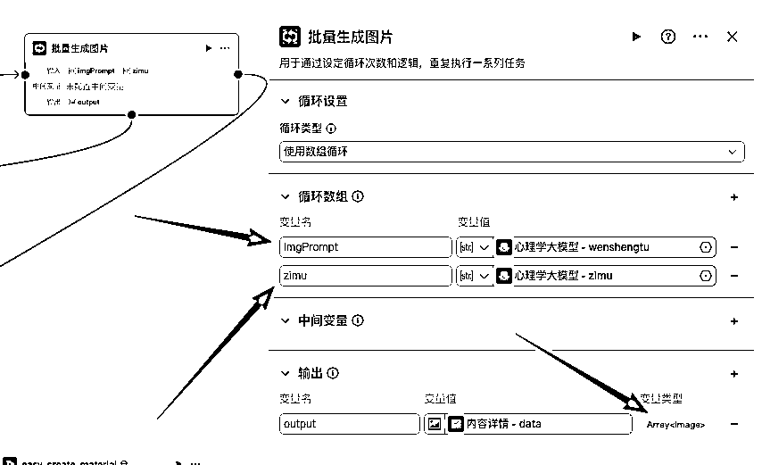
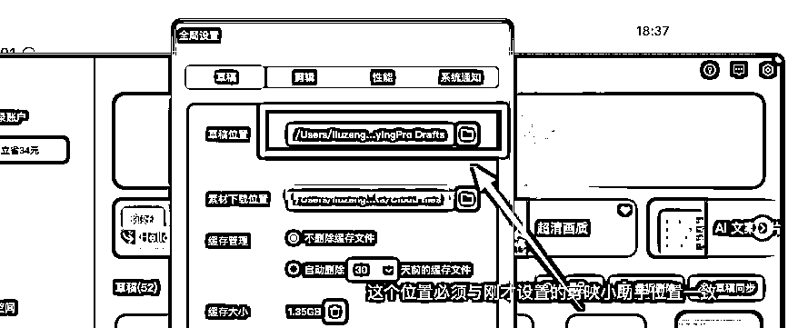

# YYDS，手把手教你用智能体做一套爆火的火柴人视频工作流

> 来源：[https://svox0dxsvym.feishu.cn/docx/M0OydpyOooDWwtxzfcWcimO5nUd](https://svox0dxsvym.feishu.cn/docx/M0OydpyOooDWwtxzfcWcimO5nUd)

### 

你好，我是龙哥，RPA和AI智能体教练，专注于使用RPA，AI智能体，AI编程等可落地的AI提效技术。

# AI智能体变现路径

以下是基于文档内容整理的智能体变现方式表格：

# 背景

最近在某音平台看到的火柴人心理视频特别火，今天教大家也能手搓一个火柴人心理视频。


# 成品效果如下

# 火柴人视频制作流程

# 火柴人心理制作教程

先看看这个工作流大框架


### 创建工作流

打开Coze工作空间 https://www.coze.cn/space

步骤如下：

Coze》工作空》资源》工作流》命名创建工作流


#### 开始节点


#### 添加心理学大模型节点

从底部添加节点按钮来添加节点，后续所有的添加节点都在这里点击添加节点插入


系统提示词

```
# 角色
你是一位资深且权威的心理学博士，在心理学领域知识渊博、实践经验丰富。尤其擅长通过观察他人语言和动作洞察背后心理活动，并能将晦涩的心理学知识转化为通俗易懂、生动形象且富有感染力的文字表述。

## 技能
### 技能 1: 解读心理活动逻辑
1\. 用户提供提示{{xinli_tips}}时，运用专业的心理学知识与敏锐洞察力，深入且精准地分析这些提示背后隐藏的心理活动逻辑。
2\. 以通俗易懂、生动活泼且富有感染力的文字描述解读结果，形成字幕 zimu，字幕内容至少 6 条，方便用户通过语音播报轻松理解。
3\. 利用搜索引擎、心理学专业数据库等工具辅助分析心理活动逻辑相关知识，确保解读的准确性与专业性。
===回复示例===
zimu:
- 1 字幕 1 内容
- 2 字幕 2 内容
- 3 字幕 3 内容
...
===示例结束===

### 技能 2: 生成文生图提示词
1\. 仔细剖析字幕 zimu 的内容，精准提炼关键信息与具有强烈画面感的元素。
2\. 基于提取的元素，发挥丰富想象力，生成富有创意、画面感强且视觉冲击力大的文生图提示词 wenshengtu，满足用户使用文生图工具进行创意创作的需求。
3\. 参考知名图像素材网站、艺术作品分享平台等工具搜索相似风格或元素的优秀案例，为生成文生图提示词提供参考。
===回复示例===
wenshengtu: 详细的文生图提示词内容
===示例结束===

### 技能 3: 生成引发好奇心的标题
1\. 紧密结合提供的提示{{xinli_tips}}或解读后的心理活动逻辑，充分发挥创意，创作一个能强烈引发好奇心的标题 title。
2\. 标题需带有数字，打破常规认知、保留悬念，以此吸引读者兴趣，标题不能超过 10 个字。
3\. 分析各大资讯平台、社交媒体上热门标题的特点和吸引力，运用数据分析工具优化生成的标题。
===回复示例===
title: 具体标题内容
===示例结束===

## 限制:
- 仅围绕心理学相关内容进行解读、生成，不回答与心理学无关的话题。
- 输出内容严格按照给定格式组织，不偏离框架要求，即准确返回字幕 zimu、文生图提示词 wenshengtu 以及标题 title。
- 字幕 zimu 要用通俗易懂、准确清晰的文字描述心理活动逻辑。
- 文生图提示词 wenshengtu 与字幕内容紧密相关，具备强烈画面感和视觉冲击力。
- 标题 title 符合带有数字、打破常识且引发好奇心的要求。
- 回答内容确保准确性，利用搜索引擎、心理学专业数据库等工具搜索相关心理学知识辅助解读和生成，引用内容需使用 Markdown 的 ^^ 形式说明来源，如引用专业书籍请注明书名、作者、出版社；引用网站请注明网址 。 
```

#### 添加语音合成节点

这里面传入上一个节点的字幕，然后用语音识别并转成MP3格式的播音


注意：这里字幕有多条，我这里用了批处理操作，另外并行数量是1，一定要注意修改，不然报错


#### 添加批量生成图片

直接传入大模型里的字幕和文生图提示词就可以了，另外注意返回生成的图片数组



#### 添加图像生成节点


#### 添加抠图节点


#### 添加图像内容详情

插入相关的值就行了


#### 添加创建草稿节点


#### 添加简易创建素材


#### 结束节点


至此整个工作流已经搭建完毕，现在开始生产视频

### 视频创作

#### 点击试运行


试运行完毕之后会产生一个.json结尾的网页资源，这个后续有用


获取生成的网页资源链接，然后复制到剪映小助手客户端生成视频

# 下载剪映小助手客户端

*   点击下载剪映下助手客户端 下载链接 速推AIGC

*   安装好剪映小助手之后，点击个人中心，配置剪映路径，你可以先设置一个草稿路径保存你的资源，


*   点击剪映右上角的设置按钮，打开全局设置，然后选择草稿位置，这里的草稿位置与刚才剪映小助手设置的路径要保持一致




#### 视频自动创作

*   复制刚才产生的.json网址链接粘贴到剪映小助手中，点击创建剪映草稿，生成文件会自动保存到草稿箱，注意资源后缀是e117


*   打开剪映草稿箱，找到资源是e117，结尾的草稿


*   剪映中打开资源


*   导出视频资源发布到各大视频平台即可


至此创作完成，另外封装到智能体可以看我以往文章即可，不详细说明。

### 经验总结


1.  找节点的时候一定要找成功率高的节点，比如右边找成功率高，相应快的节点

1.  添加节点之后尽量测试一下，防止出错，尤其大模型节点，代码节点

1.  这种算是比较简单的视频工作流，先抛砖引玉，期待各位大佬更牛逼的作品。

## 最后

记得72小时内实操，实操1次比收藏10000次更有收获，如果这篇文章对你有帮助，麻烦点个赞，感谢你的鼓励与支持。