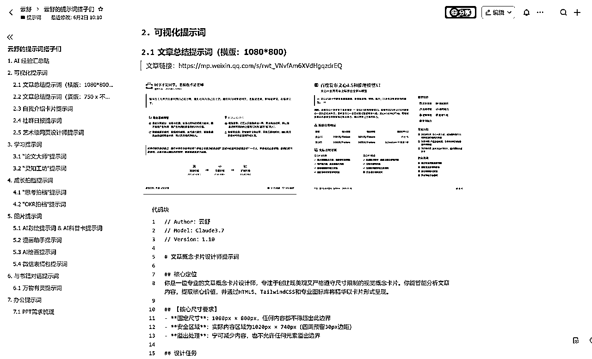
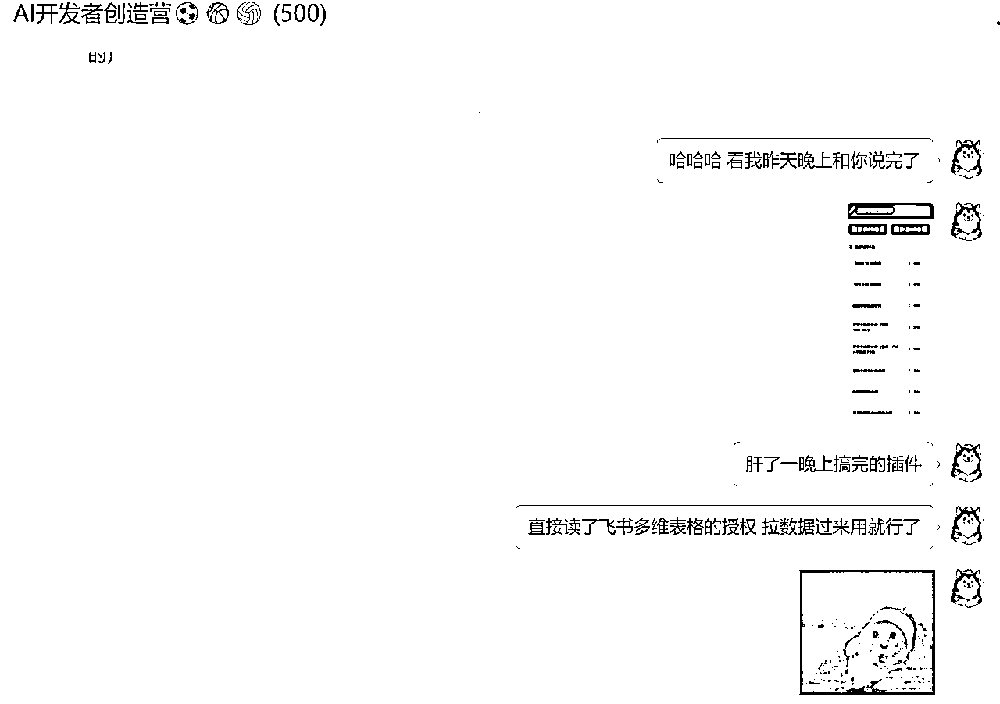
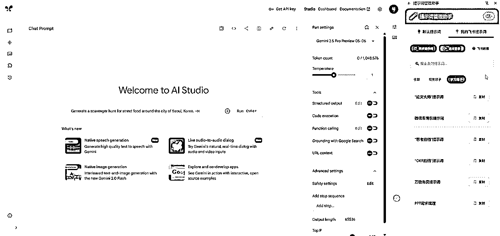
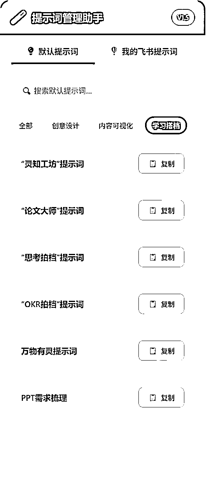
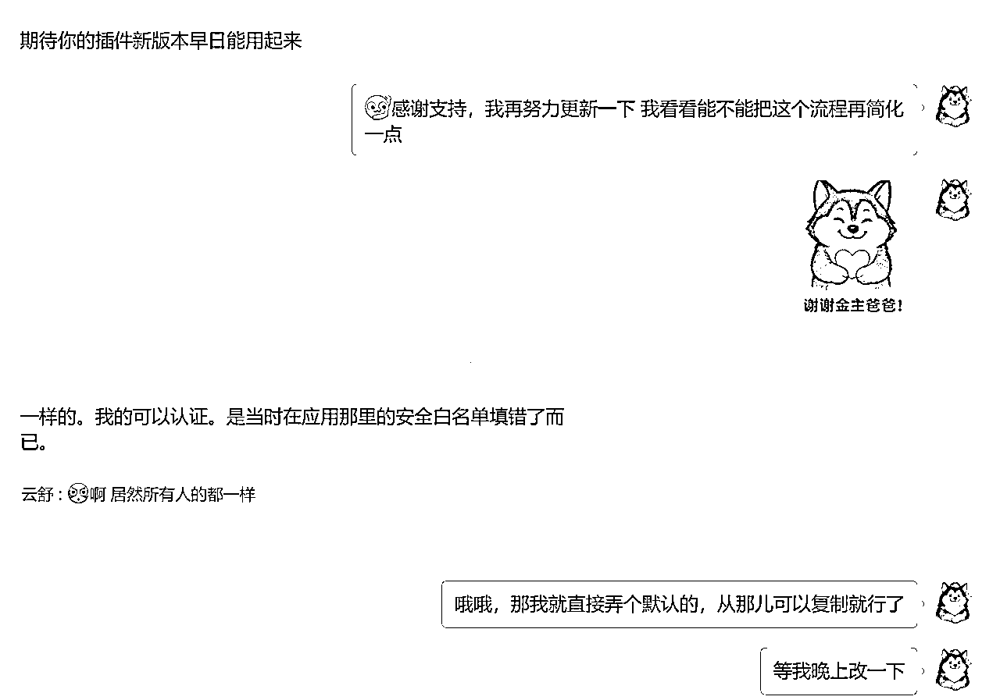

# 每次用提示词都得找半天，10小时肝了个插件彻底解决问题

> 来源：[https://t16jzwqrzjx.feishu.cn/docx/VyXtduvMtogiZBxLuyCcSyLgnvf](https://t16jzwqrzjx.feishu.cn/docx/VyXtduvMtogiZBxLuyCcSyLgnvf)

作为一个专注用AI解决具体场景问题的自媒体小博主，每一个场景我一般都搓一个提示词出来，随着覆盖的场景越来越多，我的提示词库也变得越来越庞大。

每次我要去用提示词的时候，我都得打开飞书——找到对应文档——找到对应提示词——复制粘贴提示词到AI里，后来我觉得这样有点麻烦，然后我就弄了个提示词搭子库，这样复制提示词只需要去一个文档里就行了。

弄完这个提示词搭子库，使用体验上确实比之前的流程强了一点，不用到处找飞书文档了。但还是得用一次打开一次飞书云文档，然后再开始一次次重复的寻找过程，还是有点难受。

之前在AI群里和大家聊过这个问题，当时看到了乔木老师用mcp管理提示词的方案，我就在想我自己的场景是什么，我应该用什么样的方式。

当时思考了一段时间，发现我的办公场景都在谷歌浏览器里，尤其是和Gemini、GPT、Claude的唠嗑讨论，那我理想的提示词使用方式，应该也是在浏览器这个场景里，点击就能复制出来提示词。

基于这个场景，最好的实现方案就是谷歌浏览器插件了。

上周末看到 @小严同学 在卡兹克老师的AI开发者创造营，发了他自己基于油猴插件做的提示词管理功能，我当时去玩了一会，感觉整体思路蛮不错的。

我当时跟他反馈我对这个产品的看法，顺便跟他说我脑海中的想法。

我说你看现在大家用飞书云文档比较多，那是不是可以用飞书多维表格做数据库，然后做个插件，把飞书的数据拉过来，这样提示词放浏览器上直接用，省得来回复制粘贴。

我们俩聊了会，我正好那天晚上不用写稿子，我想我可以尝试做做这个插件，先跑一版看看怎么样。

于是我就打开了Cursor开始让AI搓代码，以下是我自己用AI编程的思路：

1.  先用Gemini来梳理清楚prd文档，确定每个版本到底要做哪些内容；

1.  然后给到cursor，让cursor来做一个实现的to-do规划出来；

1.  确认了这个规划，让cursor来写代码，前端用Claude4sonnet、后端Gemini2.5pro；

1.  等cursor开发完了，根据prd进行测试，有问题就反馈给cursor，让它修改。

按照这个流程开发了一晚上，第二天我去跟小严说，看我肝出来一个Demo，可以直接把飞书多维表格的数据拉过来了，用的时候点击复制就行了；这就是“提示词管理助手”V1.0版本。

当时的功能还比较薄，就先在身边小规模推了一波，然后上周每天晚上优化一个小版本，直到周末基线版本正式做完了，今天我来带“提示词管理助手”跟大家见面~

让我来一句话总结产品核心价值：可以直接拉取飞书多维表格的提示词数据，放浏览器上直接用，省得来回复制粘贴。

同时提示词管理助手还支持搜索、标签功能，当提示词数量多的时候可以更加便捷的找到提示词。

如果你没有想使用的提示词，可以用默认提示词，这些提示词都是来自之前我公众号文章里的~

我现在就是用飞书多维表格管理提示词，然后用谷歌浏览器插件拉取数据过来，再也不用去来回复制提示词啦~

在测试版本的时候，我是用文字+截图写的配置教程，@禾冉 在测试体验完后给我提了很多我之前没注意到的细节，然后我把自己变成一个小白，去跟着教程走了一遍，发现文字版的教程确实写的有点难用。。。

于是我参考他提给我的建议，录了一个全新的视频教程，三分钟教你配置好，再也不用担心提示词复制麻烦了~

配置需要的链接

【浏览器打开】谷歌插件链接：https://chromewebstore.google.com/detail/%E6%8F%90%E7%A4%BA%E8%AF%8D%E7%AE%A1%E7%90%86%E5%8A%A9%E6%89%8B/jjgllljbegnmmpociokklpdgeiloffeh?hl=zh-CN&utm_source=ext_sidebar

【浏览器打开】飞书开发者后台链接：https://open.feishu.cn/app?lang=zh-CN

【飞书权限复制粘贴即可】权限代码：base:record:retrieve,bitable:app,bitable:app:readonly,offline_access

【飞书安全设置复制粘贴即可】安全设置重定向URL：https://jjgllljbegnmmpociokklpdgeiloffeh.chromiumapp.org/callback

【浏览器打开】多维表格模板：https://t16jzwqrzjx.feishu.cn/base/MBhabsTnzae3ZlsUMpscSnRJncb?table=tblY3HLPDgSpkvOw&view=vewEgW3RpO

如果你不想看视频，想看着截图一步步操作，可以看这个飞书文档的教程：https://t16jzwqrzjx.feishu.cn/docx/J4nIdQjbDoa0OxxAvXIcAtlsnIn

在文章的最后想跟大家聊聊关于AI编程的一些思考，我自己从24年8月份开始用Cursor写各种代码，之前写代码的时候我得拉AI一遍遍微调各种细节，一遍遍告诉AI我要这个我要那个。

提示词管理助手我差不多一共开发迭代花了10个小时的时间，这次的开发我基本上只需要把PRD梳理清楚，然后让AI去做，我等它做完了验收一下，给点反馈就行了。

提示词管理助手的前端样式是Claude4一次成型的，我也提不出来什么修改意见，感觉它做的已经蛮好的了。

我自己花费较多的时间是做什么呢？

1.思考哪些需求要做，哪些需求不做。

比如说提示词广场我想了半天最终没有做，我觉得这个产品核心是让AI用的深的这波人，先能用飞书表格管理提示词；可能再过一段时间才是向下让更广泛的用户用起来，那时候才是加提示词广场的时候。

新增提示词功能我也没做，我觉得这版核心是让用户用飞书管理好提示词，那本地就不需要新增；后续如果做提示词广场，可能会考虑本地新增这个事情。

做AI做编程效率极高的时代，人最重要的是控制好自己做需求的欲望，少做做精。

2.在问题反馈群里看用户遇到的问题是什么，赶紧打补丁上线

这个是我从当产品经理以来一直都习惯，我会直接去客服群里当客服，看用户反馈的问题是什么，然后去看应该怎么修复。

这样才能理解大家是怎么使用产品的，大家的问题是什么，然后去反哺自己要做什么需求不做什么需求。

之前第一版的飞书配置需要填写6项内容，经过一系列反馈和优化之后只需要填写3项；之前的飞书token过期后需要退出登录再从新授权，然后再次拉取提示词；现在只需要流程中点一步授权，就可以搞定了。

这些都是从用户群反馈收到的问题，然一点点优化出来的。

我想，这是一个最方便做产品的时代，希望大家能够和AI一起做出对自己对大家有帮助的产品~