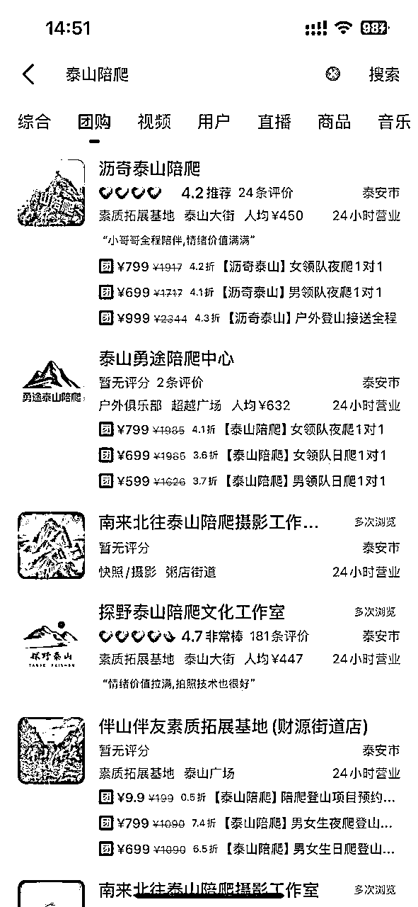
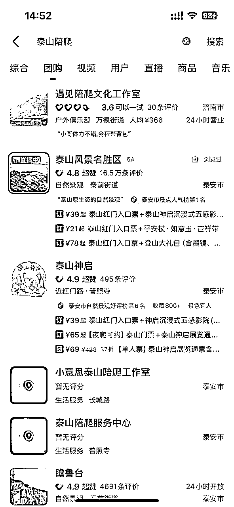

# 依山而兴，日接一单，利润可达二三百

> 来源：[https://gjlkutbtjk.feishu.cn/docx/XOfrdgGlvoLb9cxNx6wcRfJzn5f](https://gjlkutbtjk.feishu.cn/docx/XOfrdgGlvoLb9cxNx6wcRfJzn5f)

## 总览

近期，我与团队在泰山开展了“陪爬服务”项目，深刻体会到何谓“靠山吃山，靠海吃海”。这一项目的核心逻辑在于“陪伴经济”的兴起——当代消费者，尤其是高净值人群，对非核心事务的付费意愿显著提升，追求省时省力的体验。此模式具备普适性，若结合旅游城市的地域特色，更易落地成金。

值得一提的是，团队成员并非外貌出众者，却凭借扎实的服务与策略，在零推广的情况下实现了稳定接单，甚至可以接到“三日陪玩三千元”的高额订单。

以下从实操细节、行业洞察到未来展望，全面拆解这一轻资产创业模式。

* * *

项目缘起：从灵感到实践的破局点

“生财有术”社群中早有“马拉松陪跑”案例，单笔收费数千元。这一模式的核心在于：高净值人群愿意为“情绪价值”和“时间节省”支付溢价。

在越难挣钱的时候，去挣有钱人的钱。而不是挣没钱人的一块钱两块钱。

恰逢女友为泰安本地人，持有导游证并计划返乡创业，我们顺势锁定“泰山陪爬”。选择泰山的原因有三：

1.  文化符号：五岳之首，年游客量超500万，旺季（5-10月）日均登山人数破万；

1.  需求痛点：夜爬看日出、路线规划、安全顾虑等，需本地向导介入；

1.  竞争洼地：市场仅存3-5家小型工作室，服务同质化严重，缺乏品牌化运营。

1.  情感需求：这个说起来就不是那么好说了，男的找个女陪爬，女的找个男陪爬。赏心悦目吧。

* * *

### 深度调研：伪装者游戏与信息差掘金

第一步：以顾客身份“套话”

*   注册新微信号，批量添加竞品客服，咨询“日爬VS夜爬性价比”“女性陪爬员是否提供安全保障”等问题；

*   同步保存对方发来的装备清单、路线图、报价表（日爬400-600元/人，夜爬加价100左右），整理成标准化文档；

*   关键发现：客户更在意“全程陪同”而非专业讲解 ，需强化“暖心陪伴”人设。

*   总结话术，为后期回答客户打基础。后期加了客户，别人怎么回复我们，我们适当修改，回复别人就可以了。

第二步：以应聘者身份“偷师”

*   虚构简历应聘陪爬员，摸清招聘流程：

*   基础门槛：无学历要求，需熟悉泰山路线，体力达标；

*   培训内容：客户沟通话术、基础摄影技巧；

*   分成模式：平台抽成50%，陪爬员日薪差不多300--400之间 。

*   结论：人力成本可控，可招募大学生兼职对冲旺季需求 。 且泰山脚下大学相对还可以，兼职大学生比较好招聘。

*   后期兼职人员，就是对半分就ok ，当然，如果自己能提供更多服务，比如自己去接送站，那就可以把这块费用自己留着就🆗的。

* * *

### 落地执行：从资质到流量的破冰术

1\. 合规化：营业执照的迂回战

*   问题：抖音团购要求“素质拓展”类目需关联实体场地，而陪爬属虚拟服务；

*   在实际操作的时候，抖音团购对于这一块要求其实比较严格，建了好几个地址都不成功，最后只能加抖音的销售经理，让他们帮忙提交的。抖音建新地址，以及营业执照是否对应这一块，其实还是可以做做文章的，要求都是人定的，通过官方经理帮助提交，就可以规避掉。

像上图的几个，生活服务，都是不成功的，目前抖音还暂时无法认领这种地址。

*   破局：直接招人代办营业执照；代办营业执照（1200元），定位“个性化旅行解决方案”。

*   山东这边办理营业执照，还是要求有点高。必须是什么商业性质，然后又必须得有房产证，租赁合同。感觉是稍微有点小难度，然后电商的那一套也不大好用。就直接网上搜索了一个办证的。花了 1200 大洋。（当然，这也是一个挣钱的点，其实代办营业执照，就是提交一下，如果有地址，有真实的办公环境，合同等，自己去提交也可以。这个代办业务，通过抖音等获客，也是可以的。）

2\. 平台运营：流量密码与规则博弈

*   抖音：擦边艺术

*   内容策略：抖音对视频来说，发布陪爬等内容，并不会过多反感，但是对于挂了团购的视频，再发布陪伴等相关内容，可能就会触发审核机制。只能规避一下，通过发布“夜爬避坑指南”“泰山日出延时摄影”等实用内容，弱化广告属性；

*   团购上架：与平台经理合作，以“素质拓展基地”名义过审，设置阶梯价（日爬，夜爬，女陪爬等多种价格，抖音上搜索，还是有很多的。当然，抖音对于陪伴类的，要求还是比较高，不好过审，抖音会不定时抽风，下架地址团购之类的）；

*   直播：抖音直播的效果还是有的，当然，目前团队人员还都有其他事情再做，所以直播做的相对来说少一些。 直播三要素：人货场。人只要够帅，够漂亮，就没问题。货其实都是一样的，再就是场，直播的话，尽量选择真实场景，即红门，效果感觉会更好一点。如果赶上下雨，大家可能看雨中爬泰山，可能会更感兴趣一些，观看量其实挺多。

*   小红书：情绪营销

*   笔记标题：目前根据生财里面的帖子，去尝试批量发文，如果能把这一步跑通，估计引流会更简单一点。

3\. 服务升级：从陪爬到“体验设计”

*   增值服务：

*   摄影跟拍：加价100元，提供全程跟拍及精修9图；

*   VIP私享团：定制路线（如避开人流看日出）+接送站等其他服务，客单价加100-300元；

*   泰安三日游：定制旅游路线，从岱庙开始逛起，深度了解泰山文化。客单价可达每天千元。

*   客户反馈：> “原本担心安全，结果陪爬员一路帮忙背行李、找机位，像朋友一样聊天，体验远超预期！”

* * *

### 行业纵深：陪伴经济的三大底层逻辑

1.  懒人经济：62%的游客愿为“省心服务”支付额外费用（来源：《2023国内旅游消费趋势报告》）；

1.  孤独经济：一线城市单身群体占比超40%，线下陪伴服务需求激增；

1.  情绪溢价：社交媒体时代，“仪式感体验”成为社交货币，客户自发传播反哺流量。

* * *

### 风险与挑战：暗礁下的生存法则

*   平台风险：抖音类目审核日益严格，需储备多个账号矩阵，并引导客户转向私域；

*   安全兜底：为陪爬员签订免责协议；

*   季节性波动：旅游淡季，目前刚开始做，到时候再考虑延申。

* * *

### 未来展望：从泰山到千山万水的复制路径

1.  横向拓展：黄山、华山等名山复制同一模式，输出标准化运营手册； 有其他地方的圈友如果想上架抖音团购，可以借鉴一下我们的模式。

当然，目前，其他地方陪爬相对来说还比较少，客户说黄山那边搜索到的结果就没有泰山多。

可见，这个方向大有可为。

1.  纵向深耕：开发“亲子登山营”“银发陪伴团”等细分产品线；

1.  生态联动：与户外装备品牌、民宿合作分佣，打造“登山服务生态圈”。

* * *

结语

“靠山吃山”的本质，是将地域资源转化为情感化、场景化的服务体验。无论是陪爬、陪跑，还是未来可能涌现的“陪钓”“陪逛”，商业的终局始终指向人性最深层的需求——孤独时渴望联结，疲惫时追求托付。山川湖海不言语，却永远等待有心人将其变为黄金。

* * *