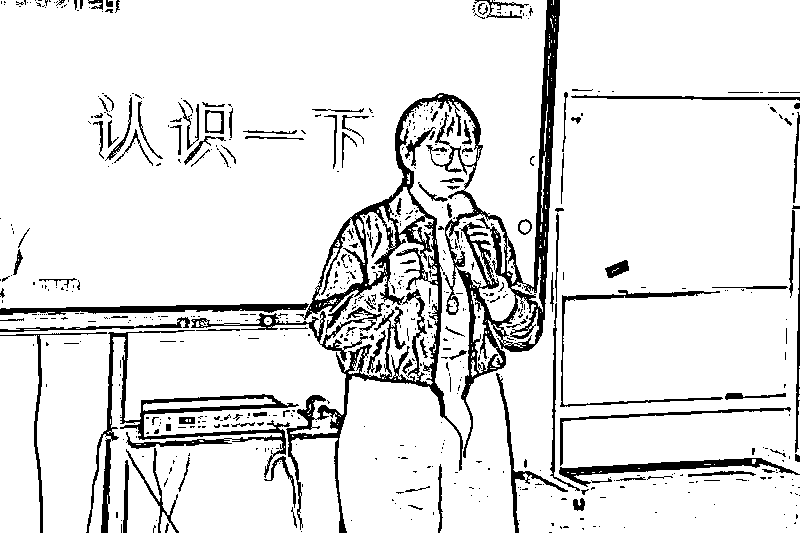
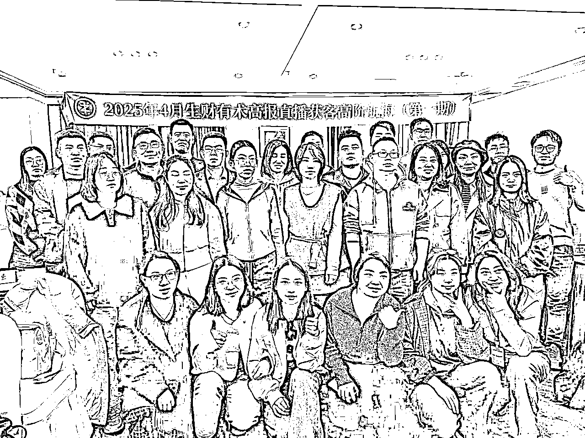
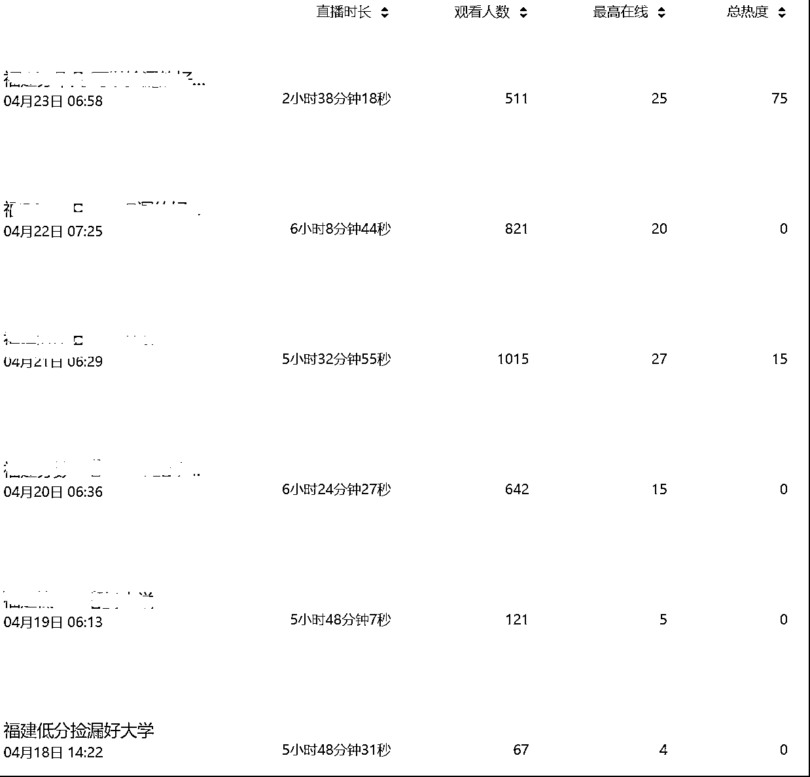
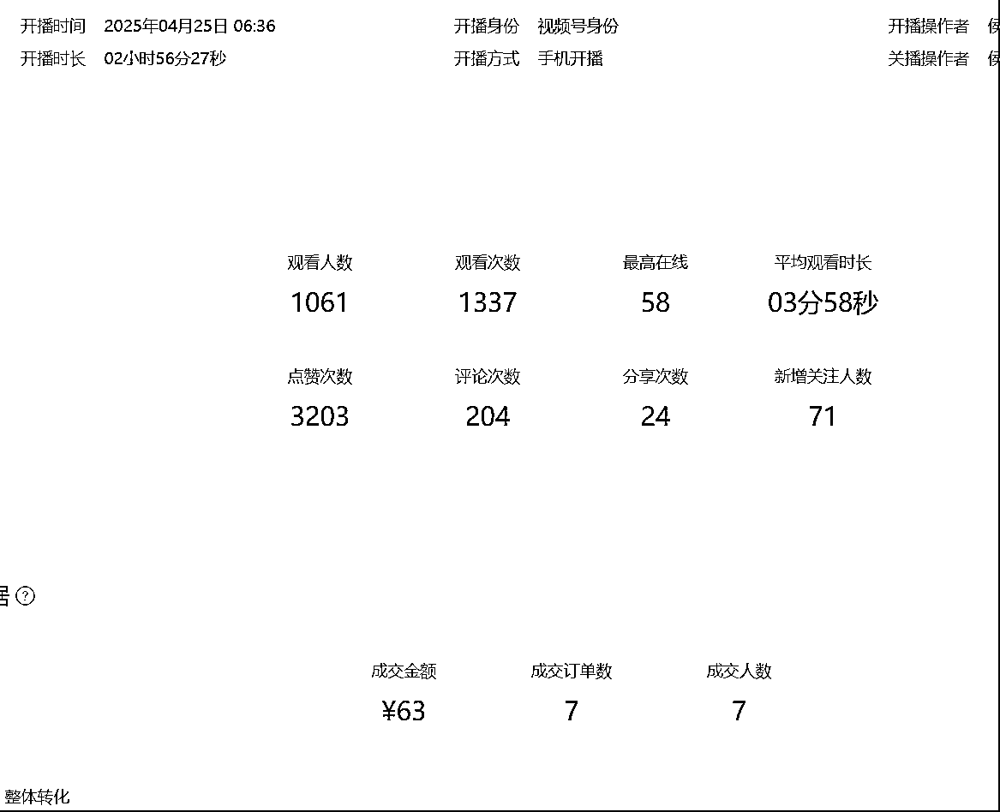
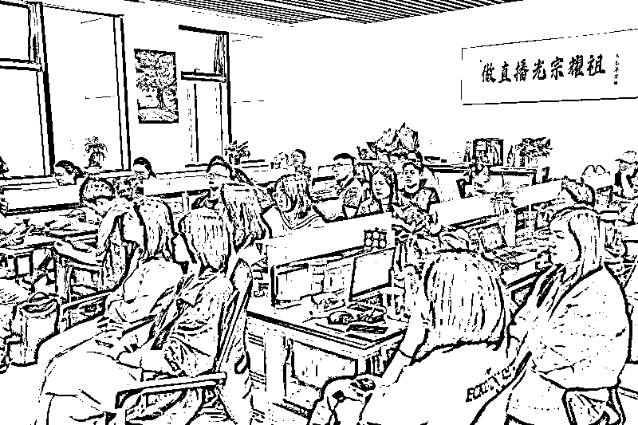
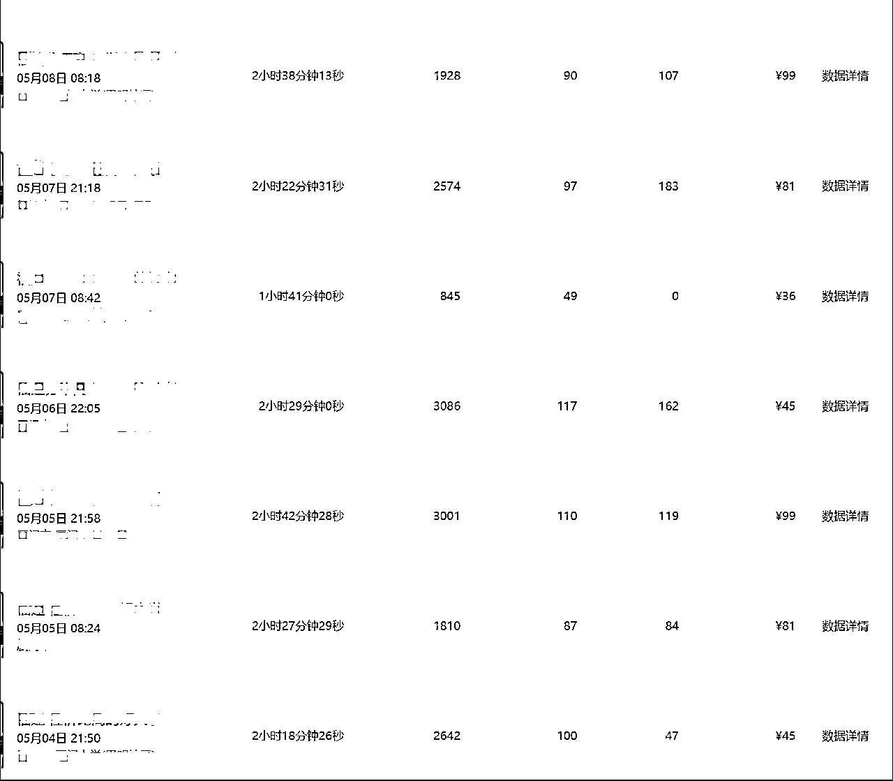

# 17天入门【高报直播获客】航海，月入1万只是开始。

> 来源：[https://k0inph13lqs.feishu.cn/docx/YNKcdNwaioKn7NxpQrvcqp9inzc](https://k0inph13lqs.feishu.cn/docx/YNKcdNwaioKn7NxpQrvcqp9inzc)

# 个人介绍（比较啰嗦可跳过）

生财的圈友们，大家好，我是侯哥，一个加入生财三年的小透明。

从23年7月加入生财，航海等级已经是lv.7了，在群里面看了一下，参加这么多次航海 ，还没上岸真的是有点拖生财后腿的感觉，刚加入生财的时候因为有自己的主业，参加航海只是想了解一下项目，并没有认真去参与，给生财贡献了不少保证金。

直到24年4月开始更认真的参与了生财的航海，也一直在找适合自己的项目，小红书虚拟店铺，小红书教育资料引流，都拿到过0-1，却没能跑到1-100，自己本身是个i人，不太喜欢和人交流，总怕麻烦别人。一个人真的很难坚持下来。直到看到生财推出了长航海，这个真的是为我这种心力不足的人准备的。

过年那几个月没怎么关注生财航海，错过了Shein带货和同城直播发售，看到Lemon老师发的 高报直播获客 字里行间都能感受到Lemon的真诚，立马抓住机会，录视频，报名，80选30，我对自己还是非常有信心的，然后是漫长的等待，4月7日收到了鱼丸的通知，通过筛选，去到济南才知道，选中的圈友都有收到了Lemon老师的回访电话，唯独我没接到，可能是陌生电话被我忽略了，庆幸还是被选中，可见Lemon对待这个航海花了多少心思，话说回来，我这个人只是线上是i人，现实中还是非常喜欢聊天的。

本篇帖子我主要会通过以下几点跟大家分享交流：

1、航海介绍及项目的发展前景

2、17天的线下航海我获得了什么

3、离开老师和队友我独立带货

4、深耕「高报直播获客」这个项目

5、 在生财第三年我的个人心得

# 一、「高报直播获客」航海介绍及项目的发展前景

简单来说这个项目就是一个俗称的“打粉项目”，我们通过直播的方式销售小课包，然后根据小课包来拿佣金。有区别于普通的“打粉项目”，普通“打粉项目”一般都有两个痛点：

痛点一“废号”：普通“打粉项目”大部份都是以废号为代价的，而这个项目是符合平台规则的一个项目，因为我们是通过售卖小课包的形式来获取客户信息，所以帐号是非常安全的。在“打粉项目”的多种获客方式中，又属于直播是最高效了，只要帐号起号了，精准打上了标签，获客就不是什么难事了，并且直播帐号长期使用，几乎没有违规风险，所以28人的线下航海圈友们，全部跑通了0-1达到了全员上岸，这里面要感谢lemon老师、侯老师、高老师等各位老师的辛苦付出。

痛点二“没有靠谱的后端”：做过“打粉”这个项目圈友的，都知道“打粉”是件非常香的项目，因为你只要做前端引流动作就可以，按劳计酬拿到相应佣金，而很多的“打粉”项目是有风险的，有哪些风险呢：

1、一些高客单的粉你不知道后端拿过去干什么，是不是健康，如果不健康，是很容易被连带的。

2、扣量：很多行业都有淡旺季，旺季转换好，淡季转换不好，不同时期，甲方是会不同程度去扣量的，你给他100，可能他只给你算50个。

而这个高报直播获客项目就不存在这两种风险，我们直播的目标客户是每年高三的学生或家长，向他们销售规划课程，后端再承接志愿填报，是一个非常安全的项目。扣量也是不存在的，根据小课报的数量来计算佣金。也是正因为这些原因，我果断的报了这个项目。

航海期间lemon老师说过教育赛道有大钱 ，的确是，我们的家长都非常舍得给孩子花钱，更何况是高三的孩子，非常关键的一年，虽然淡旺季非常明显，但这个痛点足够的痛，所以旺季也足够的旺，也正是因为周期短，很多的机构并没有怎么进入高报赛道，而且每年都是可以重复去做的，每年的高三家长都是不同的，所以是非常值得深耕的一个项目。

我写得不太好，高报项目lemon老师的原文：

# 二、17天的线下航海我获得了什么。

理论课：

刚报这个项目的时候，我不认为这里面需要花多少时间，因为直播就是一两小时的事，所以我还带着我前面参加航海的小红书副业在做，现实真的是打脸了，Lemon老师给我们安排了满满的课程，12号13号在酒店上课，由Lemon老师讲行业规划及前景，侯老师讲高报相关知识，高老师跟我们讲怎么去直播，听了两天，云里雾里大概听懂了三分之一，果然隔行如隔山，连老师安排的作业也只做了几项。

首播：

14号开始，所有的船员必须全部完成首播，给我分配的是队友yoyo，一个内心非常强大的女孩子。说来也是非常的巧，我们同是在西湖区三墩的，距离相隔只有2.5公里。我们分配的是福建省，一天同时起两个号，每个号的直播时长要拉到6个小时，这也就是说，一天要播12小时。

我们掉队了：

因为拿到的逐字稿并不是很完善，需要我们去修改成自己能直播的内容，我和队友花了一上午的时间在修改逐字稿，起初是各改各的，因为各自习惯的语气不同，也是因为刚进入这个行业，对里面的哪些内容是要删除，哪些是错误的，都不知道，一直都读不太顺，我俩都觉得一定要改顺了才能去播，老师让当天要完成首播，为了完成这个作业，我们一直改到了晚上晚饭后才勉强可以使用，晚上8点22开始了第一场首播，首场我状态还不错，我播了四个小时，队友播了一个半小时，一共5个半小时，整场场观65，最高在线4人。14号当天也只是完成了一个帐号的首播。时长比较长，播完回去睡觉3点多了。导致第二天也起不来，所以前几天真的是累呀，因为首播掉队了，一直没能把时间调整起来时间，晚上播太晚，早上起不来，中午了才播第一个帐号，下午播第二个帐号。

追赶进度：

这样的节奏真的不行，每天赶不上大部队的进度，还累个半死，睡眠严重不足，所以就找解决方法，经过几天的直播，我们单人的直播时长也更长了，每个人播2小时，最后一场就队友播到最后，我直接就先回去休息，第二天一早在租的公寓里面一起床就6点半左右开播，终于追上了直播进度。

中途碰到的问题：

Lemon给我们安排了直播间，每个直播间都是单独网络，Lemon和侯老师每天都在陪伴着，真的是非常的用心，期间也是复盘不断，会议不断，线下航海就是不一样，你完全没有偷懒的可能性，团队氛围在那 ，你不可能撇下队友自己偷懒去，老师说起号是必然的，起号一定会起的，只是时间问题，起号之后有多少场观，还是要看主播的能力，老师一直在身边就是安心，播完最新鲜的数据立马拿去复盘。中途声音沙哑是正常的现象（黄氏响声丸吃掉两盒，金嗓子含片干掉一盒），我们只能坚持，群里面不断有小伙伴起号成功，自己的号一直没起来，心态逐渐有点崩不住了，Lemon又及时的出现了，发现了这个问题，把大伙叫到楼下请大家吃晚饭，讲自己的创业故事，给大家打气，信心瞬间又上来了，继续死磕到底。

终于起号了：

放平心态，终于在4月19号数据开始有些上涨，4月20号经过老师的指导，终于起号成功了。接下来是帮队友完成起号。我的队友yoyo也在坚持了两天后完成了起号。起号后就不用播这么长时间了。

起号只是开始：

没起号之前，以为起号了就万事大吉了，可以带货赚钱了，老师又丢了一个课程链接，呃，起号只是开始，接下来就是做数据，拉升帐号的互动率，这个真的是要考验个人能力的时候了，我们必须在直播过程中尽量的让直播间的家长给我们互动，才能提升在线人数，又磨了两天才算有些上升。

开始带货：

时间已经来到了24号了，因为正好碰到五一，济南的线下航海到28号就要结束了，所以老师下达最后的命令，所有起了号的圈友必须完成首次带货，虽然20号就起号了，我一直在做数据，不敢带货，因为在线不多，生怕卖不出去，于是决定25号开始带货，给老师报备后25号早上开始了首次带货，带货话术是老师已经给我们整理好的，只要插到相应的位置就可以了，非常的丝滑，带货过程中真的非常的紧张，但好在结果还不错，虽然最高在线就58人，竟然出了7单，十几天的努力终于见到“钱”了。每单25的佣金，这一场赚了175真的是太开心了。接下来的时间里，按照每天2场或3场的节奏持续的带货，优化数据。

线下结营

时间过程非常快，28号下午Lemon和大家聊了这个行业的一些发展前景，甚至把公里机密都给我们分享了，真的是非常真诚的一个人。感谢老师们放弃了自己的直播时间，这么多天的付出，圈友们组织请老师们吃了答谢晚餐，各自踏上回家的路。

总结：

17天的时间，完成了高报获客项目从0-1的整个过程，盗坤老师说过，我们要尊重过程，这个17天的过程，在各位老师的陪伴下，跑通0-1赚到佣金真的是非常快的一个过程了，但从1-100需要我们自己去努力了，师傅领进门，修行靠个人了，感谢生财提供的机会，感谢各位老师的辛苦付出。

# 三、线下结束后离开老师独立带货。

28号结束线下，29号回到家完成了在家的首播，数据还不错，一天两场，每场2小时左右，非常的稳定，因为回到家还一些其它事情，一天就只播了1-2场。就我这样三天打鱼两天晒网的，一个月赚个小一万是没悬念了。

线下结束了，但老师的课程并没有结束，群内的复盘不断，问题回复非常及时，Lemon团队的老师们非常的用心，我相信这也只是开始，这个项目决定持续深耕下去。在这一个月的直播里面，发现自己的知识储备远远不够，直播间很多家长的问题都 无法回答，只能选择不回答来处理，真要吃透这个行业真的需要一个过程。

# 四、深耕「高报直播获客」这个项目

之前一直是做电商，不管是淘系电商，还是后面的抖音直播电商，我都是带着几百平米的货在跑的，回到杭州后接触了生财才发现赚钱并不一定要有货，把我这个老电商人的思维彻底改变，就如高报这个项目来说，一台手机一个支架一个平板或一张纸就可以完成直播，我甚至可以暑假带我儿子回老家去让他体验一下农村生活，时间自由，收入也算稳定，常年都有内容可以带，Lemon老师说过教育里面有大钱，今年只是小试牛刀，明年才是真正开始，一个月时间，跑通1-10的过程，让我非常有信心持续的深耕这个行业，时间就是最大的壁垒，侯老师直播了5年，他的知识储备不输任何一个高报师，做时间的朋友，我也会努力。

# 五、 在生财第三年我的个人心得

加入生财第三年了，从去年开始深入去学习，参加了7次航海，经常刷各种风向标，看了不知道多少精华贴，看得是很爽的，收藏了一大堆，但是执行力真的达不到，去年在小红书赛道折腾了一年，迈出电商到互联网副业的第一步，从教育资料引流卖会员包，到小红书虚拟资料，跑通过0-1，却没有在里面跑通1-100，原因也是因为自己的心力不足，当正反馈来得太慢的时候，能坚持下来真的是少数人。感谢生财这个平台，让我们普通人能接触到更多的赚钱机会，生财里面的每个航海手册都是价值千金，都是众多教练的心血之作，即使是不参加航海也可以查阅，真的非常的友好，生财已经是我的一个副业搜索引擎了，也是在这么多社群中，唯一让我有理由持续续费的社群。