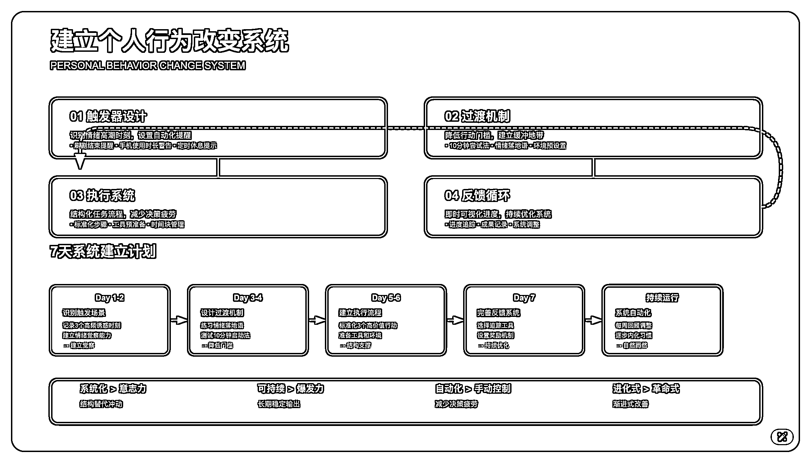

# (42 赞)一个简单的提示词，ChatGPT 帮我打破了 5 年的行为惯性

> 原文：[`www.yuque.com/for_lazy/zhoubao/rrdqhg6snv6u1g9a`](https://www.yuque.com/for_lazy/zhoubao/rrdqhg6snv6u1g9a)

## (42 赞)一个简单的提示词，ChatGPT 帮我打破了 5 年的行为惯性

作者： sky 陈天

日期：2025-07-14

各位生财圈友大家好，我是 sky 陈天，一名 AI 企业培训讲师、企业 AI 业务提效顾问。

最近我在减肥，发现减肥和知识管理还挺像的。

**一个是管理输入的食物，一个是管理输入的信息。**

**你吃的食物决定了你的身体，你输入的信息决定了你的思想。**

为了控制自己不陷入到时间黑洞中，最终把小红书、抖音、视频号、知乎、B 站的个性化推荐全关了。

作为算法的构建者和喂养者，之前在互联网公司负责个性化推荐和用户画像的工作。很了解人类抵抗不了算法， 因为算法是人性，逆人性太难了。

所以干脆来个物理隔离。

关掉后，刷两个视频就看不下去了，都是自己不感兴趣的。

小红书也是满屏的不感兴趣的内容，没刷一会就主动地就退出了这些 APP...，确实有点用。

但在执行过程中还是会存在一些问题，比如昨天看了《灵笼 2》第九集，剧情非常精彩，看完后又主动搜索刷了很多评价、解读，浪费了很多时间。

最近通过复盘和与 AI 的对话，我发现了一个我自己长期存在的问题：

**就是看完情绪浓烈、沉浸感强的剧集后，我总会忍不住刷知乎、看测评、找影评，结果常常一两个小时就过去了。**

本来只是想休息一下，结果又陷入了“刷完后自责、焦虑、再刷一会”的循环。这种模式，已经逐渐形成了我的“默认行为路径”。

起初我以为只是注意力不集中，但这次我尝试用 ChatGPT 深入剖析这个问题，没想到 AI 的反馈让我一下子看清了根本原因。

**我意识到，这可能不是我一个人的问题。**

所以今天这篇文章，我想跟你分享

我和 ChatGPT 的这场关于“情绪延迟满足与注意力陷阱”的深度对话，以及，我是如何开始逐步解决它的。

## 01｜这个问题的本质，不是拖延

首先我的提问很简单，更重要的是你要如实记录现实发生的情况，让 AI 扮演专家来帮你分析和提建议。

你是一位心理学和行为改变大师，为什么我会出现以下的问题，我应该如何解决呢？ ---
看完灵笼感觉很好看，然后又刷了几个测评和知乎，浪费了不少时间，这个已经形成了一个固定的模式了，怎么解？ ---

ChatGPT 给我的第一句话就是：

**“你不是在浪费时间，而是在补偿情绪能量。”**

这句话一下子让我安静下来。

很多时候，我们看完一个剧情高潮、情绪冲击强烈的内容后，**大脑的兴奋和快感其实并没有立刻结束** 。而是会希望“延长”这个爽感，这时候最容易点开的，就是各种测评、评论、知乎讨论。

你以为自己是在“顺手刷一下”，其实你是在试图延续前一个情绪体验。

而当这个“延续”不断重复，就成了一条潜意识里的行为路径：

**情绪高潮 → 情绪空窗 → 本能寻求刺激 → 刷知乎等平台 → 时间黑洞**

看上去是“分心”，本质是你的大脑没有被教会如何「过渡」。

## 02｜不是自律不够，而是路径没设计好

ChatGPT 提醒我：

**“你以为你需要更强的自律，实际上你需要更聪明的预设。”**

这个回答很打动我。

我过去总是在反思为什么自己“又浪费时间了”，但我从来没有想过

**是不是我从一开始，就没有给“剧后情绪”一个落地的通道？**

当大脑处于高情绪状态结束后，它其实是最迷茫的时刻。如果你不给它一条清晰的过渡路径，它就会自动走向你熟悉的“低成本刺激回路”——短视频、知乎、游戏、社交平台。

这不是意志力的问题，而是机制设计的问题。

## 03｜ChatGPT 给我的“三步反诱惑方案”

这次对话后，我尝试按它说的方式，去重构我的行为路径。

### 第一步：写一句“情绪落地语”

看完情绪强烈的剧、文章、播客后，不要立刻打开任何娱乐内容，而是：

写下一句话总结，刚才打动你的是什么。

比如：“这集让我看到技术时代下的恐惧，其实源于我们对自身命运的无力感。”

这一句话，不需要写得多好，但它会让你的大脑完成一个情绪闭环。

### 第二步：启动任务的“尝试窗口”

接着，不要强迫自己立刻进入正事，而是：

给自己一个“10 分钟尝试窗口”。

比如，“我只试着写 10 分钟文章，不成也没关系。”

这个策略极大降低了心理门槛。而绝大多数时候，一旦开始，你就会继续下去。

### 第三步：为任务建立即时反馈

ChatGPT 还建议我：

“为你的高价值任务设计一个正反馈机制。”

比如：

1.  写完一个模块就打一个 ✅

2.  用番茄钟完成 25 分钟后，允许自己刷 5 分钟知乎

3.  或者自己建立一个“任务完成计数板”，每天可视化记录进度

这不是控制，而是引导。是用结构替代意志力。

## 04｜我从这次经历中学到的关键洞见

很多时候，我们总以为问题在自己“太懒”“自控力差”，但其实：

**你只是没有设计好“从情绪高潮到高价值行动”的那一小步。**

人是无法永远靠意志力维持状态的。我们需要的是一套**有意识的系统** ，帮助我们顺势而为。

## 05｜如果你也有类似困扰，可以试试这样做：

1.  **每次看完情绪强烈内容后，先写一句感受落地语**

2.  **给自己一个 10 分钟尝试期，而不是“必须开始”**

3.  **为任务添加一个即时反馈机制，比如可视化进度**

你会惊讶于，行为的改变并不需要你变得“更强大”，

你只需要为自己设置更合适的“过渡结构”。

也非常推荐大家去尝试一下，当遇到问题，或者有固定行为模式的时候，不是想着更自律一点，而是先让 AI 扮演心理学专家，帮你分析为什么会存在这个问题。

再让 AI 帮你设计一个更平滑过渡的模式。

* * *

评论区：

邓瑜 : 哇塞！分析好到位！一毛一样的刷视频体验啊！感谢感谢，现在有办法爬出时间黑洞了[玫瑰][玫瑰][玫瑰]

马儒勊 : 推荐《复利效应》

sky 陈天 : 感谢推荐[爱心]

马儒勊 : [玫瑰]