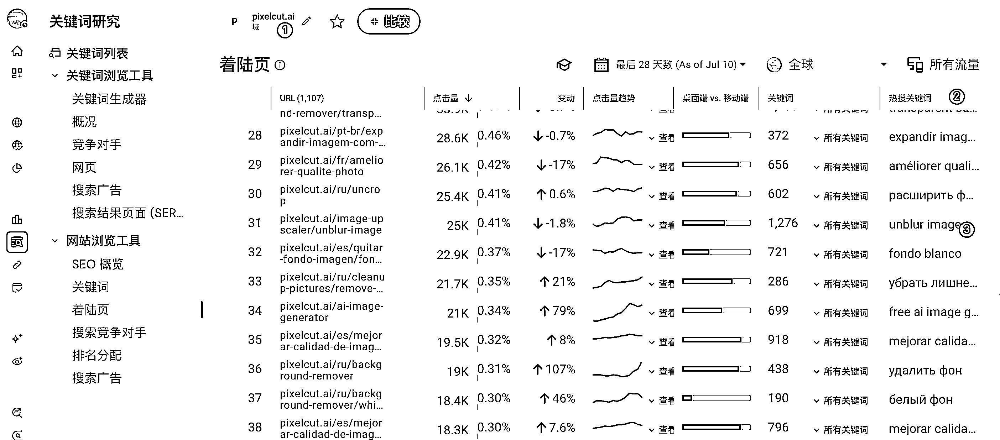
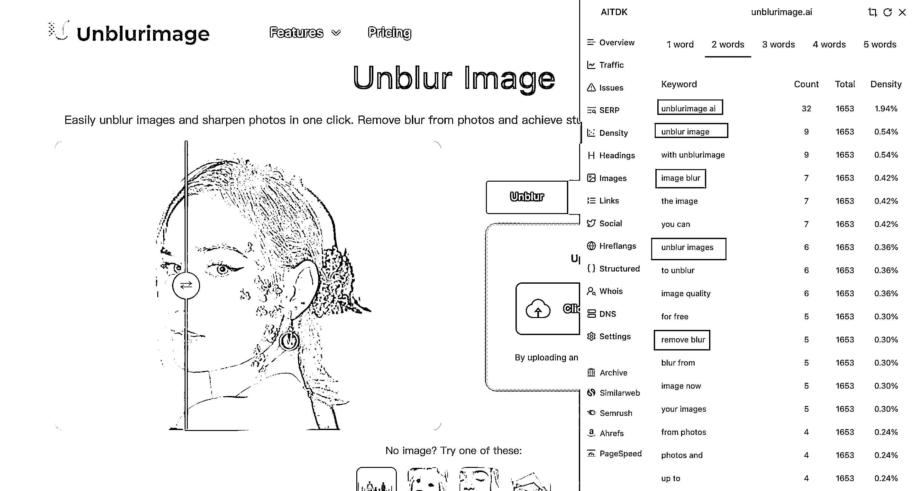

# (28 赞)AI 图像站：从找词、拆解对标到流量获取的实操体会

> 原文：[`www.yuque.com/for_lazy/zhoubao/pqado7xkxgsdic26`](https://www.yuque.com/for_lazy/zhoubao/pqado7xkxgsdic26)

## (28 赞)AI 图像站：从找词、拆解对标到流量获取的实操体会

作者： 老布

日期：2025-07-15

大家好，我是老布，最近几个月一直在学习如何做 Web 工具站，主要尝试的方向是 AI
图像，虽然还没有开单，但恰逢亦仁发布了龙珠悬赏，我就粗浅的谈谈我的一些经验，希望能给也在做 Web
工具站的圈友带来一点启发。文章写的有点啰嗦，大家可挑自己感兴趣的部分阅读。

# **一、从找词说起**

刚开始做 Web 工具站的人，遇到的第一个困难基本都是找词。对于这个问题，我的解决办法是**看榜单找关键词** 。

这里就以我最近找词的例子做个说明，打开 Toolify.ai 这个当前最火热的 AI 导航站，选择排行榜，AI 收入榜，找出和 AI
图像相关的网站。比如下图 pixelcut.ai 这个网站就是一个免费的 AI 照片编辑器，提供背景去除、修图、提升分辨率等功能。

找到具体的网站后，接着要做的就是通过 Similarweb 分析该网站都有哪些页面哪些关键词拿到了流量。进入网站，选择关键词研究，着陆页。

输入我们要研究的网站 pixelcut.ai，就可以看到该网站最近一个月各个页面的点击量，热搜关键词。

这里以 unblur image 这个关键词为例，如果想看更多关键词，点击所有关键词，就可以看到和 unblur image
相关的关键词，有什么用呢？一个作用是可以扩大我们找词的范围，一个作用是可以用来给网站增加内页，这一点后面再说。

对于找到的每一个关键词，我们可以通过 Google 趋势看下该关键词的流量大小，这里以 gpts 这个词为基准，可以看出 unblur image
每天的搜索量和 gpts 是差不多的，足以证明流量不小。

接着我们可以在 [`ahrefs.com/keyword-difficulty`](https://ahrefs.com/keyword-difficulty) 查看下关键词难度有多大，像 unblur image
这个关键词，当前难度是 37。值得注意的是搜索结果里，unblurimage.ai 这个网站排在了第一名，也就是说，已经有人发现了 unblur image
这个关键词，并且注册了相关域名上线了网站，拿到了排名。

那对于 Similarweb 着陆页找到的关键词，我们都可以花时间逐一按这种方式初步分析下，慢慢就可以找到一些其他关键词，以及一些正在赚钱的网站。

# **二、unblurimage.ai 网站拆解**

接下来尝试拆解下 unblurimage.ai 这个网站。

## **1、网站 Landing Page 拆解**

访问域名后页面如下，网站标题区域直接以 Unblur Image 这个关键词为标题，产品介绍也是包括了 unblur image，sharpen
photos，remove blur 等关键词。

同时提供了图片处理前后的对比图，让用户一进入网站就能看到网站核心功能——unblur image 最终能得到什么结果。

图片上传区域下方，提供了示例图片，这个做法在很多图片处理网站都有，我的理解是方便用户测试网站功能。

接下来是 Features 区域，围绕核心关键词 unblur image 分别介绍了 Image Sharpening，Noise
Reduction，Higher Resolutions 等功能，每个功能都有相应的对比图用来证明网站的强大，而且每个关键词都做了很好的 SEO
描述，如何处理图片的，处理后能得到什么效果，非常详细。

再接着是如何使用，为什么使用，用户证言，行动召唤，问题回答等区域了，看完这些区域的文案后，我最大的感受就是该网站的 SEO
做的足够好。从下面的截图可以看出，关键词 unblur image 在反复出现，同时相关的一些关键词 sharpening，high
resolution，remove image blur 也在反复出现，这么做的好处，是可以提高网站关键词的密度，让 Google
更好的识别到该网站，知道该网站满足了哪些需求。

通过 AIDTK 这个插件也可以证明这一点。

通过上述的拆解，可以借鉴的思路是，**做网站时，一定要确定好主关键词，然后整个页面不论标题区域，还是如何使用，为什么使用，用户证言，行动召唤，问题回答等区域，都应该围绕着主关键词进行，同时尽可能的去覆盖其他相关的关键词** 。

其他相关关键词从哪来？还记得我们前面提到的 Similarweb 可以查看更多关键词的功能吗？有了主关键词和其他相关关键词，就可以把这些关键词整理好，投喂给
AI 帮我们编写 SEO 文案了，当然最终结果我们要确认，要调整。

## **2、网站内页拆解**

一个网站当慢慢有了流量之后，必然要做的一件事情就是去增加更多内页，获取更多流量。像 unblurimage.ai 这个网站，出去 unblur image
这个主关键词的主页面，还有如下 10 个内页，基本都是和 unblur image 相关的关键词。

这里以 Blur Remover 这个内页为例，来看看这个网站的厉害之处。截几张图感受下，即使是个内页，Landing Page
该有的区域一个都没有少，完完全全是围绕着 blur remover 这个关键词重新写了 SEO 文案，Features 区域的介绍，甚至比主页 unblur
image 还要详细，具体可以打开网站感受下。

从该网站的 10
个内页可以看出，**做网站，内页要么不加，要加就要尽可能的专业，因为每一个内页都是一个关键词，都可能有用户搜索访问，做的不好，用户停留时间短，影响的不仅仅是内页的访问量，而是整个网站的访问量** 。

## **3、网站博客拆解**

网站博客还要拆解吗？在没看到该网站前，我也觉得没必要，但看了该网站的博客后，我认为十分必要。因为一篇博客也是一个内页，也是可以为网站带来流量，甚至影响网站流量的。

该网站的博客第一个值得关注的点就是配图，每篇博客的配图都是专门制作的，标题+对比图的形式，十分统一。第二个值得关注的点就是博客数量一直在增加，从下面截图可以看出，6
月 18、21、24 就增加了 3 篇博客。

除此之外呢？第三点是几乎每篇博客都很详细，结构分明，层次清晰。像《HD Photo Converter — Unblur Your Image with
Unblurimage》这篇发表于 6 月 21 日的博客，我复制到飞书文档后，总字数超过了 3000 个。

那具体写了哪些内容呢？ChatGPT 的总结如下，七个大模块，每个大模块又分了很多子模块，有图片，图表。最后还有常见问题区域，解答了网站相关的问题。

阅读完博客，就会发现这七个模块，每个模块都写的十分详细，像使用指南 How to use
这一部分，不仅有文字，还有配图，同时对于网站域名是做了链接跳转的，用户在阅读过程如果想体验相关功能，直接点击就可以跳转过去。真心建议去实际阅读感受下网站站长的用心。

此外当我们进入网站 blog 页面后，可以发现该网站对已经发表的 30 多篇博客，都打了 tag，做了分类，方便用户根据自己的兴趣去阅读。

拆解完这个网站的博客之后，我最大的感受就是，网站刚刚上线时可以粗糙，但等有了流量时，一定要把网站的每个页面做细致，哪怕是一篇博客，也要尽可能的完美。

## **4、网站 API 拆解**

前面拆解了 unblurimage.ai 这个网站的 Landing Page，内页，博客等页面，接下来谈谈网站的 API。页面做的好，SEO
文案写得好，可以为网站带来流量，但流量来了，用户体验如何，就是网站核心功能，也就是网站 API 的事了。

说实话，在刚找到该网站，初步拆解完网站的设计，主关键词，内页后，我觉得我也可以做一个类似的网站，毕竟 replicate.com 等第三方平台有很多
unblur image 相关的 API。

但实际测试后，我意识到即使我做了类似网站，也很难拿到排名，原因是在测试了十几个相关 API 后，我发现没有任何一个 API 对图片的处理效果能超越
unblurimage.ai 这个网站，甚至连持平的都很少，哪怕是 Google 搜索结果前几名的网站，对于图片的处理效果也不如
unblurimage.ai。

想必这也是 unblurimage.ai 在 2024 年 11 月 7 号注册域名，11 月 22 日上线，8 个月时间拿到 unblur image
这个关键词第一名的原因吧。

那我们如何才能找到和 unblurimage.ai 效果一样的 API 呢？对于这个问题，我尝试过问 ChatGPT，测试过其他一些
API，同等价格下，还是没有找到合适的 API，后来在深海圈群里提出了这个疑问，小排老师的回复是，replicate.com 上的 API
已经是最好的了，如果想要更好只能自己训练模型了。

通过对 unblurimage.ai 这个网站 API 的拆解，主要想分享的是，做 AI 图像站，如果不知道有哪些 API 可用，可以直接问
ChatGPT，其次我们也可以通过 API 来反推需求，比如在 replicate.com 点击 Explore，选择 View all
tasks，就可以看到好多官方整理好的 API 集合。

那对于每一个 API 集合，我们就可以点进去看看，在相关页面就可以看到具体关键词，当然我们也可以把这些 API 相关的信息丢给 ChatGPT，让其分析该
API 可以满足哪些需求，给出关键词，然后我们拿着关键词去 Google 搜索，找到相关网站，再到 Similarweb
查看更多关键词，慢慢地就可以找到一些自己能做的产品。

## **5、该网站是如何赚到钱的**

接着尝试拆解下该网站是如何赚到钱的，好的网站设计，好的 SEO 文案，足够优秀的 API 这几点前面已经说了，这里再简单谈谈流量获取。

在访问 unblurimage.ai 的网站页面时，右侧有个 X 的图标，点击进去之后，发现在网站上线当天，网站站长就在 X
发布了相关的帖子，流量虽然不多，但也是冷启动的一种方式。

通过 [`ahrefs.com/backlink-checker`](https://ahrefs.com/backlink-checker) 可以查看 unblurimage.ai 的外链情况，4.8k
的反向链接，很恐怖，要知道网站上线到现在只有短短 8 个月的时间。

仔细查看 ahrefs 的查询结果就会发现，unblurimage.ai 是花钱购买了一些 AI 导航站的外链的，比如
toolify.ai，同时也有其他网站在给 unblurimage.ai 导流，比如 unwatermark.ai。

这里多提一点，对于刚开始做 Web 工具站的圈友而言，很多时候我们是舍不得花钱购买外链的，因为对自己的产品不自信。

这时想要获得流量，搞免费外链就成了主要途径，那**如何找到可以搞免费外链的网站呢？一个方法就是只要你平时有在看一些网站，那就可以在<**[`ahrefs.com/backlink-`](https://ahrefs.com/backlink-) **checker> 搜索下该网站都有哪些外链，根据哥飞的说法，ahrefs
搜索出来的外链可都是该网站所有外链中价值最高的一些外链，那我们就可以把这些可以发外链的网站记录下来，去发外链去验证，慢慢地就能积累很多可以发外链的网址了。**

那 unblurimage.ai 这个网站有多少访问量呢？通过 AITDK 这个插件，可以看到 6 月份的访问量是 438.5k，43
万，很不错了，停留时长 52s，说明用户访问后是有去体验使用的。

分析到这里，对于 unblurimage.ai 如何赚到钱的这个问题，我的理解是：

**在网站功能完全够用，甚至远超竞品的前提下，网站的
SEO，包括内页，博客等页面都要做的足够好，在此基础上最主要的工作就是流量的获取了，花钱买外链，搞免费外链，在社交媒体平台宣传。像亦仁提醒的，每一个在做产品的圈友，都应该花
80% 的时间去思考和尝试如何获取流量，而不是反过来去打磨产品。**

**  **

# **三、做站 4 个月的经验分享**

到现在差不多 4 个月的时间，上线了 7 个站，一个开通了 Google
Ads，但由于入不敷出，现在基本没什么流量了，两个接入了支付，还未开单，其余的日访问个位数，所以还没有真正赚到钱的经验，但坑倒是踩了一些，所以接下来简单分享下踩坑的经验。

## **1、舍得花钱，才能验证产品，才能吸引用户**

4 月初，随着 ghibli 这个词的火热，ai barbie doll 也有了一定的流量，花了一个周末的时间，接入了
API，上线了网站，由于还未接入支付，也没做使用限制。

网站上线后，有用户访问使用，很快充值的几美元 API 费用就被消耗空了，担心用户增多成本太高，就没有再充值购买 API
额度，利用晚上下班的一个小时时间，花了四天接入了 creem 支付，但此时网站已经无人问津了。

现在想来，我这种前期舍不得投入资金，总想先赚钱的心态，其实就不适合做付费产品，因为用户付费的前提肯定是网站可用，好用才付费，像我为了省几十上百元，直接让网站不可用了，完全就是自断前途。

所以在产品有流量时，一定要舍得花钱。

## **2、做好成本估算，避免浪费时间**

做图片站见效慢，五一几天尝试做了个 Instagram
相关的网站，上线后在没有发外链的情况下，也有用户访问，看着流量起来，有了前面的舍不得花钱的经验，我花了 50 美元，在 rapidapi 购买了 10
万额度的 API 套餐，然后就申请了 Google Ads。

由于流量不错，Google Ads 一周多一点就通过了，此时之前购买的 API 套餐已经耗尽，于是又花了 15 美元，购买了 3
万额度的套餐，测试了三四天后，发现每天的 API 费用在 4 美元左右，而 Google Ads 的收入不到 1 美元。

找不到更加便宜的套餐，自己也没有办法采集 Instagram 的数据，网站就没有继续运营，后续流量也就归零了。

通过这个网站，我学到的一点就是对于需要花钱购买 API
来提供服务的网站，如果要做免费使用的，一定要事先估算好成本，不然很容易花费了时间和精力，却赚不到钱。其实更好的办法是增加付费入口，只是当时看竞品网站基本都是免费可用，我的网站没有什么特别的地方，就放弃了。

## **3、免费外链见效慢，但确实有效**

**  **

上站后如果不想付费购买外链，付费投流，那获取流量的方法就只能是发免费外链了。

6 月初上了一个 png 图片生成相关的网站，刚上线的两天，Google 排名 76 左右，无人问津。接下来的 10 天，我每天利用下班时间发 10
个左右的外链，然后到了 6 月中旬，再看 Google 排名已经到了 56 左右，每天的曝光次数和访问量虽然依旧很低，但一天比一天好起来了。

经过这个网站的验证，我意识到发外链虽然慢，但确实有效，网站做的不是太差的情况下，随着外链的增加，网站流量是会慢慢增加的，就看你有没有耐心和信心了。

## **4、不要自加难度，快速上站才是目的**

没上几个站或者刚开始上站的人，总会不自觉地给自己增加难度，比如：

明明是用 Nextjs 做的项目，且自己没有什么编程经验，但会考虑我该用 Vercel 部署呢？还是 Cloudflare 部署呢？听说 Vercel
部署网站流量起来后，成本比较大，那为了降低成本，我还是花时间研究研究怎么用 Cloudflare 部署吧；

明明没做几个站，看到对标网站上线了好多内页，写了好多博客，制定了好多价格体系，于是自己做网站时，总想着也多做几个内页，多写几篇博客，多制定几个价格体系；

明明没看过几个站，没找过多少词，没上过几个站，却总想着把看网站，找词，发外链自动化，搞着搞着都不知道自己的目的是上站了。

对于这些情况我的理解是，一切以快速上站验证需求为中心，怎么能够更快的部署项目就怎么来，没有内页不要紧，先发布 MVP
版本，搞不懂的订阅逻辑，就只做一个一次性付费，看站找词本就是积累经验，在自己没有上够足够多的站之前，先不要考虑自动化。

## **5、搞流量，搞流量，搞流量**

文章的最后，还是啰嗦一下，对于想通过 AI 产品赚钱的我们来说，最主要的还是搞流量，像哥飞说的我们应该花 40% 的时间挖掘需求，30%
的时间写代码，30% 的时间宣传推广。更激进一点，就是亦仁说的应该花 80% 的时间去思考和尝试获取流量，而不是闷头写代码优化产品。

这一点我深有体会，最近一个月总想着做出一个大而全像 unblurimage.ai 一样的网站，于是花了大量的时间找 API，验证
API，写代码，优化页面，优化内页，结果呢？找不到和是的 API，代码交给 AI 越写越乱，内页增加了几个，SEO
文案反复调整，还是不满意，搞得自己一度想要放弃 AI 产品这个赛道。更为致命的是，6 月份做的网站，也没有继续发外链，最近排名降了不少。

所以还是要快速上站，然后把时间和精力投入到流量的获取上，根据用户反馈去迭代产品，而不是闭门造车，给自己营造一个我的产品必然被很多人喜欢的白日梦。

* * *

评论区：

暂无评论