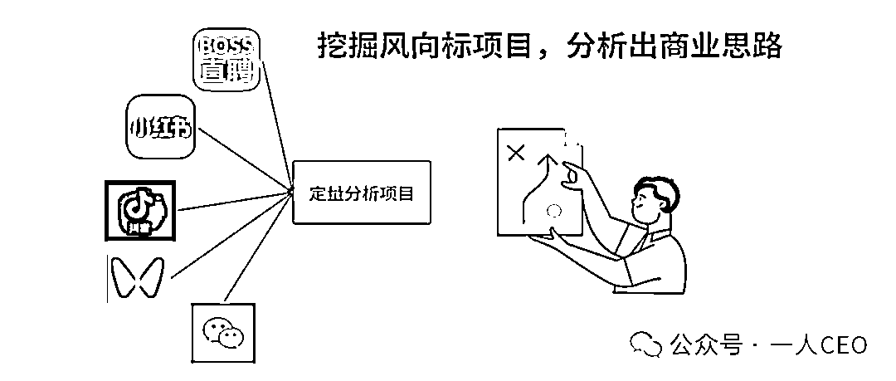
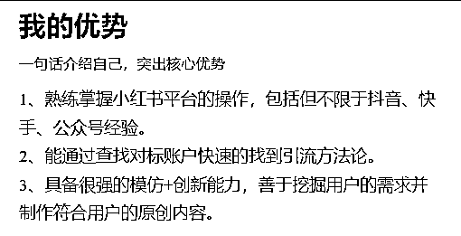
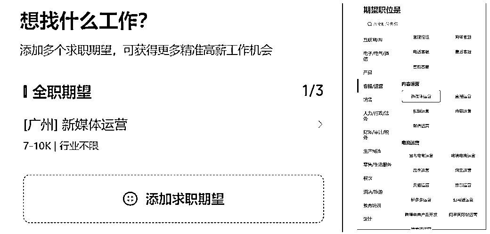
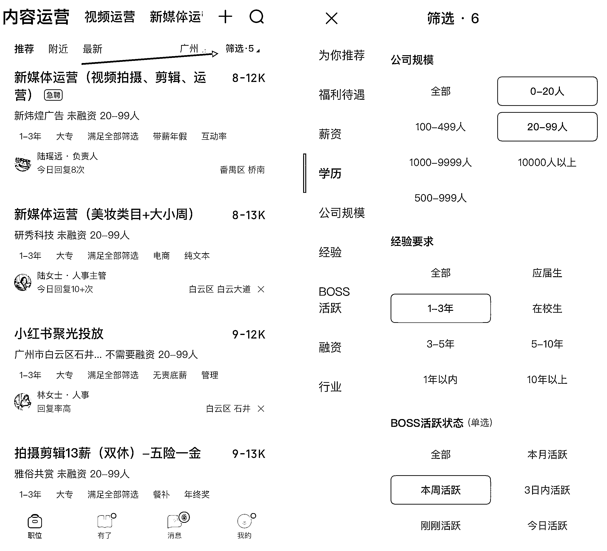
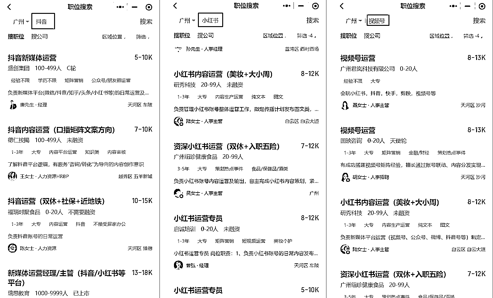
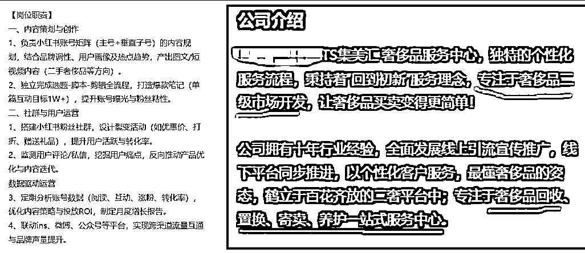
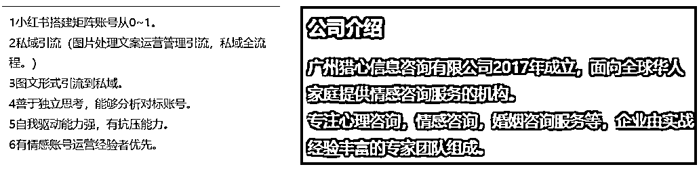
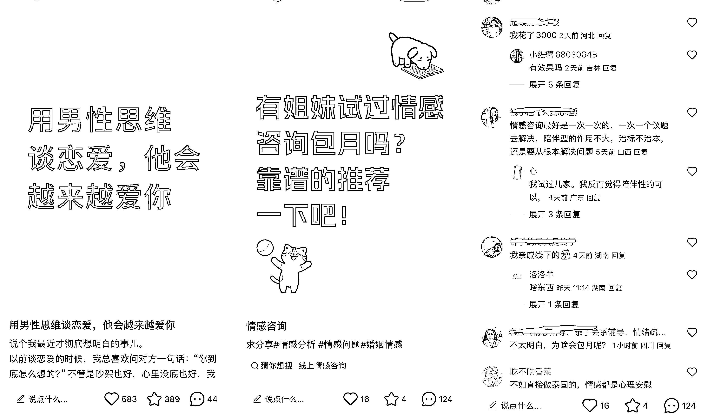

# (60 赞)如何在 Boss 某聘上挖掘项目，并分析出商业思路？

> 原文：[`www.yuque.com/for_lazy/zhoubao/rmhmc8pyzuczp0ts`](https://www.yuque.com/for_lazy/zhoubao/rmhmc8pyzuczp0ts)

## (60 赞)如何在 Boss 某聘上挖掘项目，并分析出商业思路？

作者： 馆主

日期：2025-07-18

生财的圈友们，晚上好，我是：馆主

给大家分享一下最近我在研究怎么在 boss 上通过招聘信息，去挖掘别人的项目，利用新媒体平台查找公司相关对标账号并学习引流细节，然后假装客户的身份进行加微信，假装咨询了解内幕信息（客单价/话术），使用定量分析来判断适不适合现阶段的自己。

1、boss：以求职者的身份去刷招聘信息，看招聘岗位和公司简介，并咨询招聘官获得更多价值信息

2、新媒体平台：确定好项目之后，就去新媒体平台去搜索（该公司的）相关对标账号，研究引流细节

3、微信：通过以客户的身份去加他们的微信，尽可能的抛出更多问题，然后挖掘更多的后端信息（客单价/转化话术）

4、定量分析项目：通过以上的步骤，我们已经有初步的 sop 流程，接下来就要判断这个项目适不适合做

思路路径：

## **一、Boss 某聘**

boss 我觉得是国内汇聚项目最多的平台之一，因为 boss 是招聘人力平台，不管是小团队还是大公司，项目要放大的规模时候，就要通过这个软件去找人来做事，而我们就可以通过这个信息切入到项目的整个流程中。

## **1、完善信息**

完善信息就是账号包装，boss 是一个招聘---求职的软件，对信息有严格的要求，也就是简历

有两种简历：在线简历和附件简历

1.  在线简历是在平台上使用的，你填写的信息系统会推送对应的岗位，如果你想找什么样的岗位/项目，就要把你的在线简历包装好

2.  附件简历是招聘官跟你在线聊天的时候他要看，和你面试的时候要打印出来给面试官看，其实在线和附件简历信息都差不多

打开 APP---【我的】界面，点击在线简历

个人信息：头像、姓名、性别、参加工作时间、手机号码、微信号、出生年月、邮箱，把这些基础信息填写好，这里有一个重点参加工作时间，我们选择两年经验，这个后面会用到

求职状态：离职-随时到岗，选择这个会优先推送优质岗位给你

个人优势：就是写你自己有什么优势，会什么技能会什么技术

工作经历：就是你的工作经历，如果你没有打过工，随便写吧！假的也可以，我们只是为了让系统推送更精准的岗位信息给我们而已，又不是真的去他家公司打工

教育经历：这个就写你自己的学历，毕业于那个大学，如果没读过大学的，也是随便写

## **2、求职期望**

不讲其他的，这里只讲新媒体内容运营，在首页，然后才岗位类目的右侧点击+

这里可以添加三个岗位类目，点击已有的或者点击下方【添加求职期望】进行修改，这里面有非常非常多的岗位类目，不过这里我们只专注内容运营这一块，其他的自行摸索

## **3、刷信息找项目**

为了更好的寻找优质岗位/项目，我们要先过滤掉一些没用的信息，在首页点击右上角【筛选】

这里有几项要筛选：

1.  薪资待遇：5-10k

2.  学历要求：大专

3.  公司规模：0-99 人

4.  经验要求：1-3 年

5.  boss 活跃状态：本周活跃

以上是筛选机制，我们还可以通过搜索去寻找更精准的岗位

看到这里很多小伙伴就会疑问，我们不是要通过 boss 找项目吗？怎么操作找工作了呢？

是的，我们就要找工作，而且还是优质的工作，因为我们就是以求职者的身份去找岗位，这个岗位能让我们切入到这家公司做的项目信息

接下来就要去刷招聘信息，这是一个很枯燥无味的过程，因为岗位太多和项目太多，这里我教大家怎么通过三步骤快速的判断一个岗位挖掘项目基本信息

ps：岗位职责---->公司介绍----->招聘官咨询

## **案例一**

比如以下：是做是在小红书 奢侈品回收 赛道引流，可以理解为在小红书上发布目标图文/视频进行引流，如果有哪里不懂，可以咨询招聘官了解更多细节信息

通过以上信息初步得知，该公司是在小红书发布奢侈品回收笔记进行引流，那么我们就去小红书搜索：广州奢侈品回收/奢侈品回收等关键字 images.zsxq.com/lu4oCJ37q7A2U2SdESxX_iIla1wn)

初步研究：这个项目是同城赛道，可只做流量端，引流给后端，有能力的可以前端和后端都一起做了

奢侈品的目标人群是女性，女性最活跃的平台是小红书，该公司是在小红书发布奢侈品回收笔记进行引流

项目变现的核心是：专门回收一些小姐姐没钱变现了，想把手里面的奢侈品包包等物品卖掉，我们就去上门回收回来，拿来修修，然后重新买卖，赚差价。吐槽：没良心，这个项目不能做！

## **案例二**

通过下图得知该公司做的项目是：心理咨询、情感咨询、婚姻咨询，主要是在小红书进行引流

那么我们就去小红书搜索：情感咨询/心理咨询等关键字，然后我发现这个赛道有两种玩法：

A 种 A 收：意思就是自己编写一段剧本【讲故事】引起共鸣，引导别人来咨询你

A 种 B 收：A 账号发布求推荐，B 账号在评论区，评论怎么怎么我看好了等结果性话术

然后我们假装客户去咨询他们，加微信了解更多后端信息

通过聊天，她们都是准备好统一的话术

加微信通过初步交流，得知这个赛道是个高客单价 2000----5000 images.zsxq.com/Fsu5AOrmHNJdFAtIGvzkEo2bOeXV)

这个赛道是这样子的，在小红书发布情感/心理引流笔记，然后倒流到微信，低价 9.9 初步筛选意向客户，然后进行高客单转化，而且我觉得这个赛道复购率很高，因为情感这种东西，会容易复发的

假如说我们研究到一个非常非常适合自己的赛道，通过以上的方法论，又无法获取到更多的信息，那么我们可以到该公司面试进去打一个月的工，可以彻底的摸透项目 sop 流程

案例就不写那么多了，抖音/视频号/知乎/youtube 等等都可以按照这种思路可以研究出很多很多项目（内容运营/电商运营.....），然后可以搭建一个项目雷达库

**如果是国外平台** ，我还是建议你们进该公司进行学习和研究一下项目流程

## **二、定量分析项目**

我们研究出很多很多项目，那怎么做筛选呢？怎么判断这个项目适不适合自己来做呢？

我们一开始要定性分析项目有没有具备三个条件：高客单、高复购、高增长，当然 boss 上的项目都是成功的，不然别人也不可能放大招人。

我们自己去做能不能赚到钱呢？

假如我们就一台手机和一台电脑开始....

我非常喜欢**亦仁老师** 说过一句话：**默认数据是假的，默认项目是通的** ，然后我就要按照以上的思路去调研更多同行，获取更多客观的数据。

我们拿到客观数据之后，就要开始算账：设备成本/账号成本/网络成本/时间成本/人工成本/场地成本，然后按照百分之 10 的成交概率，反推平均一天要引流多少个客资，多久才能回本，然后算一下放大后的流量客资成本是多少，利润是多少？

创业就是算账，算明白了，就是生意。

* * *

评论区：

昊东 : 招聘软件确实能反推当下正赚钱的项目

馆主 : 是的，就是通过结果去反推项目【逆向思维】

邓瑜 : 这个思路好！

程诗 : 哇，还可以这样玩