# (精华帖)(173 赞)如何使用 Gpt4o 赚钱 我的 2 个月的产品实操记录

> 原文：[`www.yuque.com/for_lazy/zhoubao/pdhy3gbbdmtc0asg`](https://www.yuque.com/for_lazy/zhoubao/pdhy3gbbdmtc0asg)

## (精华帖)(173 赞)如何使用 Gpt4o 赚钱 我的 2 个月的产品实操记录

作者： 江炜

日期：2025-07-09

大家好，我叫江炜，是生财有术的新人，4 月份有缘通过小排老师推荐加入生财大家庭。

加入后发现生财牛人太多了，也一直在搜索各位大佬的精华帖学习。今天刚好看到有龙珠悬赏，其中的 Gpt-4o 图像革命的主题也刚好和我最近开发的产品很契合，于是就有了这一篇分享贴，希望能给大家带来一些思路和借鉴。

以下为正文：

我在四月份上线了我的第一个 AI 图片站，**截止 7 月 9 日 3 个月时间拿到 3252 个付费订单，支付转化率做到了 5%。**

**  **

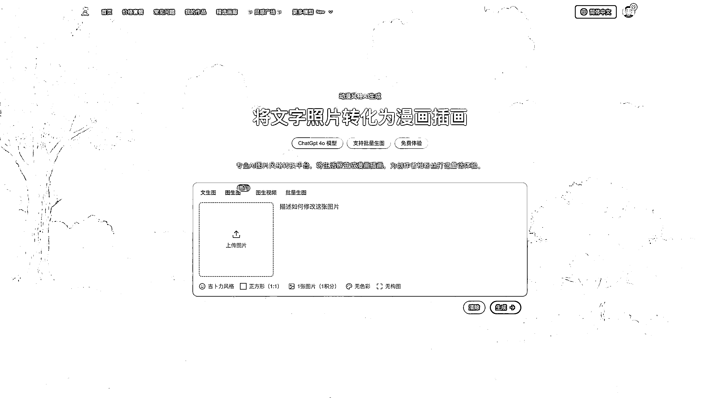

**  **

今天我将分享我开发这款产品的一些心得。

我将围绕这几点去分享：

1、做吉卜力生成站很多，为什么我能拿到这个成绩？

2、一个热词站，支付转化率如何做到 5%？

3、如何将一个垃圾站（热词站）变废为宝？

### **一、做吉卜力站那么多，为什么我能拿到这个成绩？**

首先强调一下，我做的时候起点并不是很好。因为我不擅长做热词站，这也是我尝试的第一个热词站。本来纯当练手。

那时候 ghibli 已经爆火了，很多人也已经拿到流量了。来看看 idoubi 群里 Lafe 大佬拿到的泼天流量，下面是 4 月 1 日发的截图，3 月 31 号日 UV52 万，4 月 1 号日 UV80 多万（因为当天还没过完，所以图中 4 月 1 日数据不完整，后来看是 80 多万）。注意这里说的是日 UV

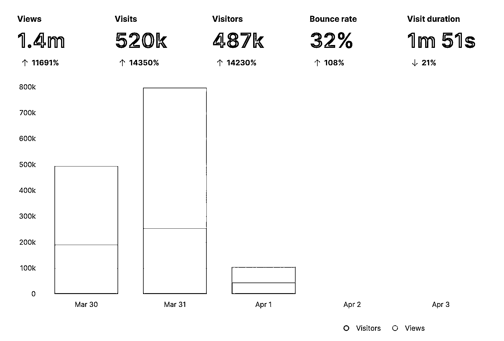

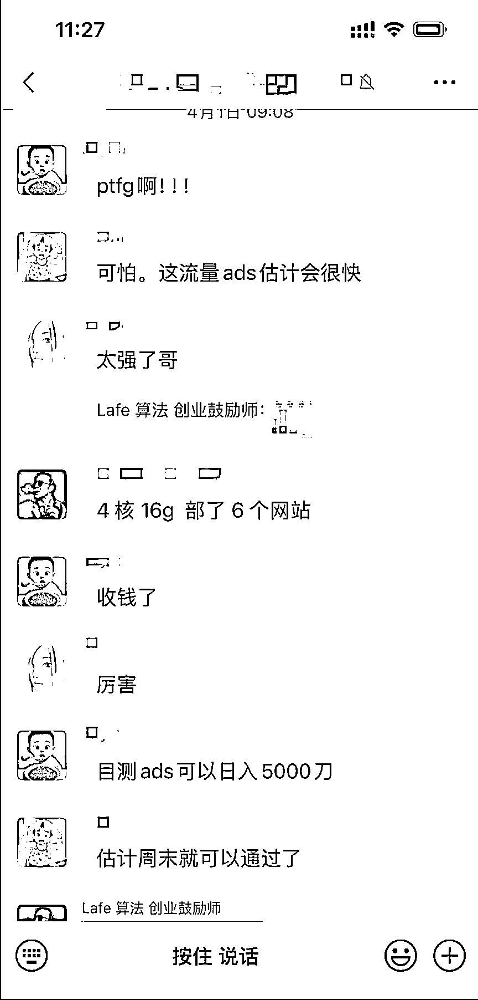

我也是看到这激动人心的数据才开始决定也追一把热度。猜到了热词是 ghibli，于是注册域名 ghiblio.art，花了 3 天时间开发完，但是上线完只追到流量尾巴了，SEO 也没做好，所以流量很少。也没找到 gpt
4o 稳定的接口提供商，只能临时用了其他备用图片模型。可以说当时即没拿到流量，产品也不行。也许这个时候很多人就放弃了。

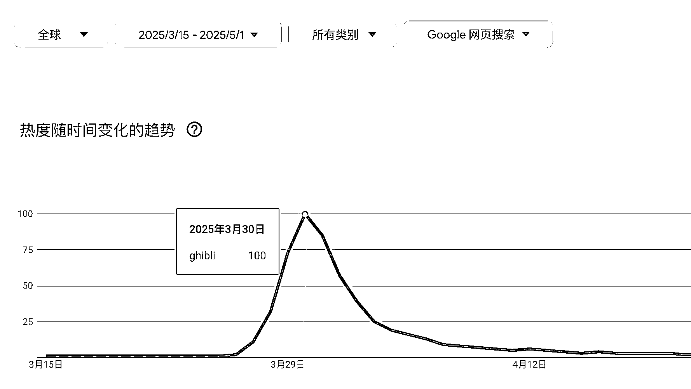

幸运的是在思想意识上我还是敏锐的洞察到 gpt 4o 这绝对是个机会。没有靠谱的 api 我就先接入 flux 模型占位。并使用官方的 gpt
4o 对话生图来优化我的网站 UI，这个我还单独写了一篇公众号文章：《如何利用 ChatGPT 4o 让网站设计大杀四方！》

对这篇感兴趣的也可以扫码查看原文：

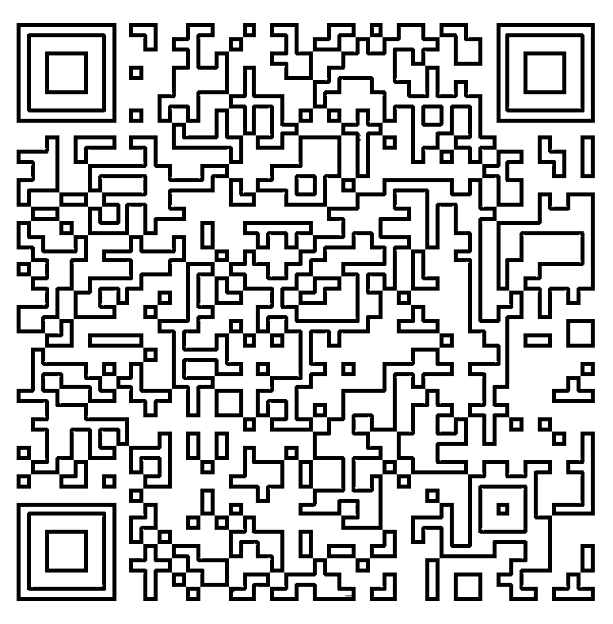

就这样我的网站在产品功能和 UI 设计层面都已准备好。万事俱备，只欠东风（gpt 4o api）。

几天后机会来了，哥飞老师在群里分享了 Damo 老板的接口。赶紧接入测试，效果非常好，接口比其他家稳定很多。

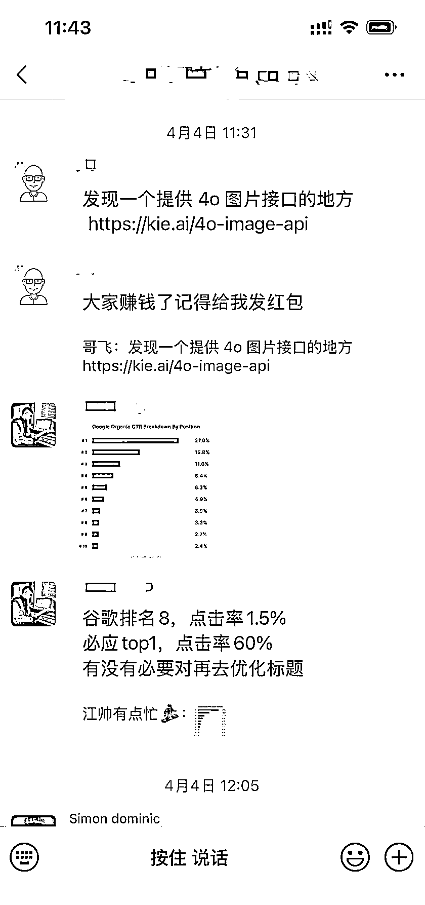

接入后第 2 天就在 V2ex 发帖推广了，完全出乎意料，好评如潮。当天就出了 100 多单。这也是我从去年 12 月份以来第一次拿到正反馈。

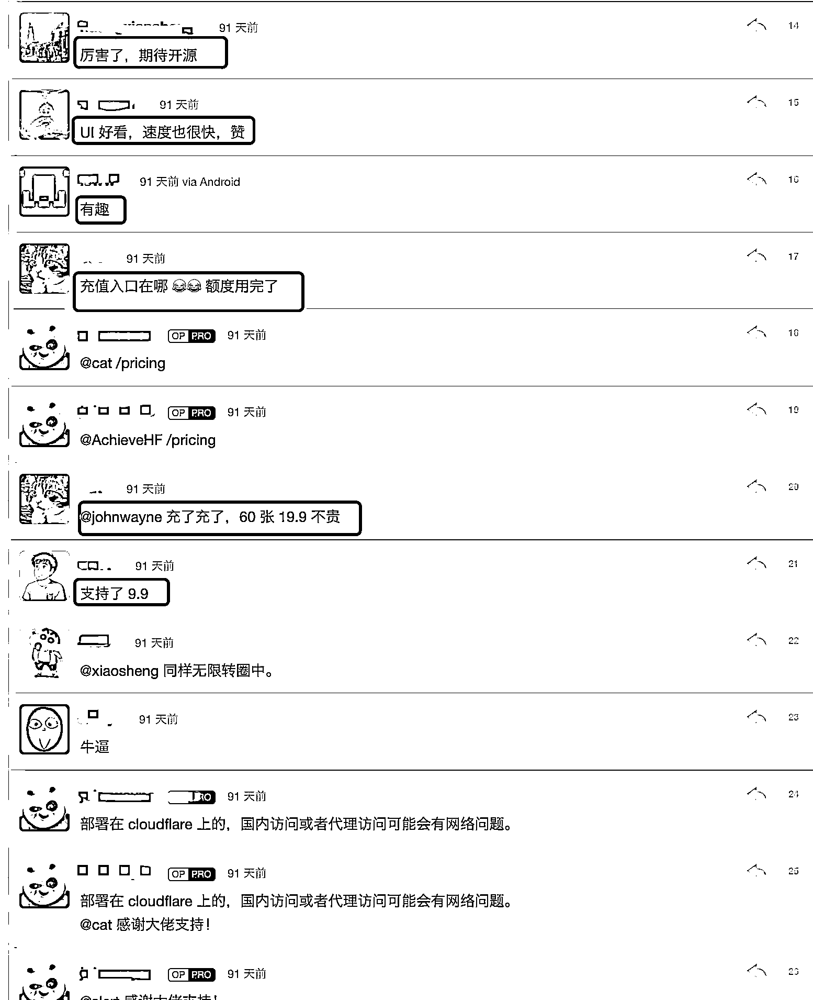

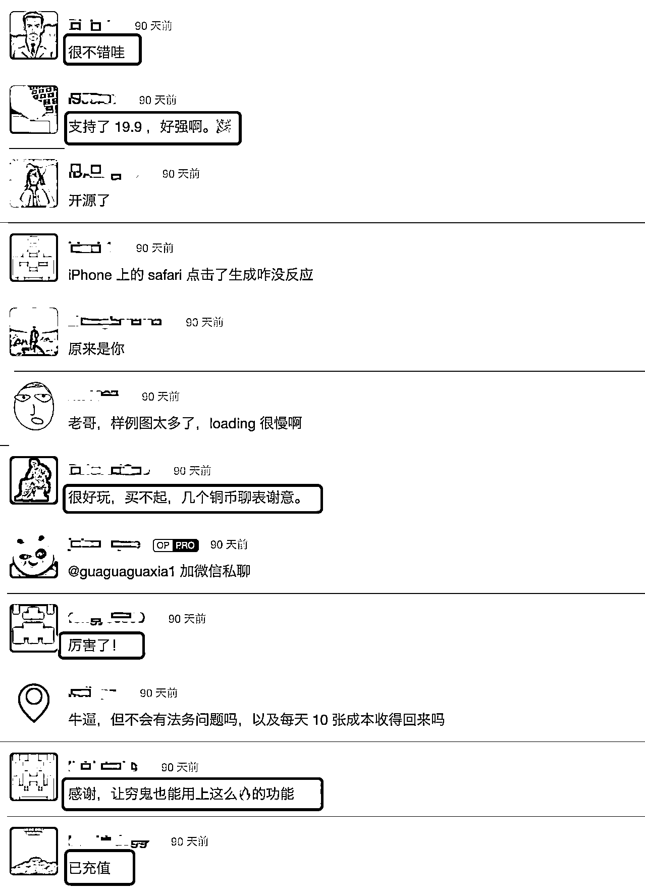

事后分析了下，能拿到一些成绩主要还是做对了这几点：

1、遇到困难没放弃，想办法继续完善等待机会。

2、占位意识很重要，**模型没开放或模型能力不足，产品先行** 。这种思路在未来相当长时间依然管用，因为现在的模型还处在你追我赶的阶段，有很多场景可以先做，然后等模型能力达到了再接入。

3、产品好用（模型出图效果好）和 UI 漂亮，从用户反馈来看这两个是用户付费的催化剂。

### **二：支付转化率如何做到 5%**

热词站一般支付转化率只有千分之几吧。我能做到这么高，做对了以下几点，这里是绝对的干货。

1、产品好用 + UI 好看

模型稳定很重要，这里是 Damo 老板的功劳，不过多述说。UI 好看也非常重要，我是前端出身，对 UI 比较敏感，这可能是我和其他吉卜力站差异化的地方。这两项做好了，对用户做出付费决策起到很大的帮助。

2、定价策略

很多做出海的独立开发者都有一个思想误区：我做得是出海 AI 站，我想賺的是美金。**在思想上他们已经排斥掉了国内用户。所以我看到了大量的吉卜力站只上了订阅。这对国内用户来说，支付转化率几乎为 0。** 所以我不仅上了订阅还上了丰富的次数包套餐，这是很关键的一步。我也是因为这个获得了很多国内付费用户。所以賺海外的美金确实香，但是能国内国外一起赚了岂不是更好。

3、试用策略

到底应该提供几次免费试用机会？

这是个人开发者做 AI 产品都会遇到的问题，试用次数太多成本 hold 不住，不提供怕用户跑了。

很多人选择是一次，也许从数据分析来看一次支付转化率可能最高。

我其实没有最佳答案，但我是这么考虑的：如果你做的是一次性薅流量的热词站，一次可能是合适的。如果产品打算长期做，除了考虑当下的转化率还要考虑续费率和用户体验，如果你对自己的产品足够自信，我觉得也可以多一点。我刚开始选择的是三次试用机会，最后改为了两次试用机会。

以上三点做好了，是我提升支付转化率的关键。

### **三、如何将一个垃圾站（热词站）变废为宝？**

热词站大部分的宿命是归于平静。随着热度过了慢慢又回归正常。我也逃脱不了这个厄运。随着吉卜力的热度过了，尝鲜的付费用户就不再续费了。流量也越来越少。热词站开始慢慢沦落为垃圾站。

只能再去寻找新的热词吗，来看看我是怎么变废为宝的。

**1、寻找新的流量渠道**

V2ex 一次性流量过去之后，我又发现小红书上有很多用户有生图需求，于是果断做了一个小红书官方账号 Ghiblio Art，认真经营，于是就有了稳定的流量来源。

**2、产品转型**

吉卜力热度过去之后，我发现小红书上每过一个阶段都有新的热门生图需求出来，比如微信表情包，日本小人风格，史努比风格，猫咪自拍风格，城市系列等等。于是我便对产品定位进行了调整。从吉卜力生成器转型为动漫风格图片生成。再后来又接了图生视频，变成了可以做漫画动画的网站。这就从一个热词站(ghiblio)成功转型为一个可以长期经营的漫画动画生成站。

小红书上热门的风格：

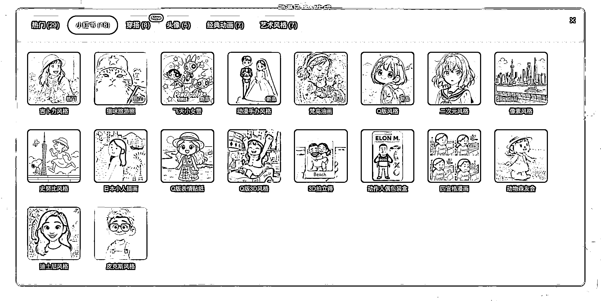

产生的爆款笔记：

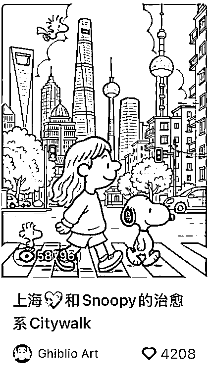

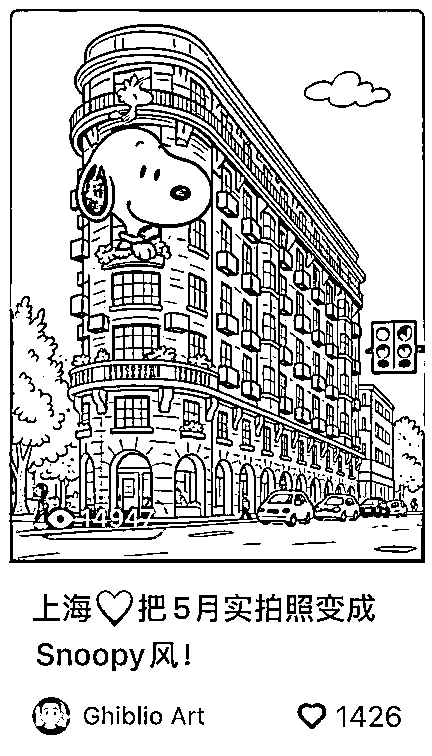

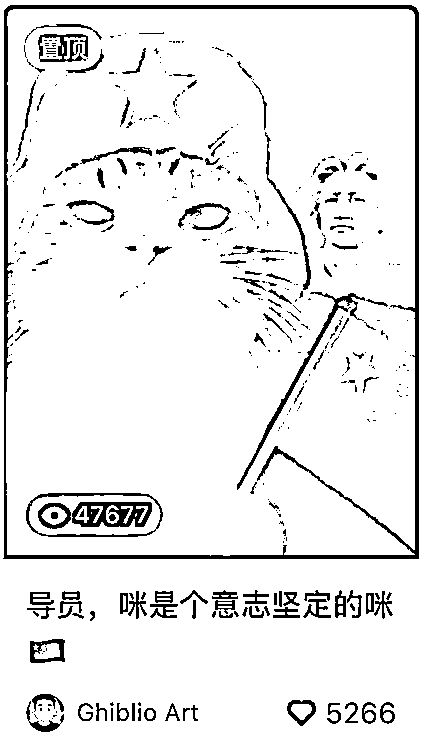

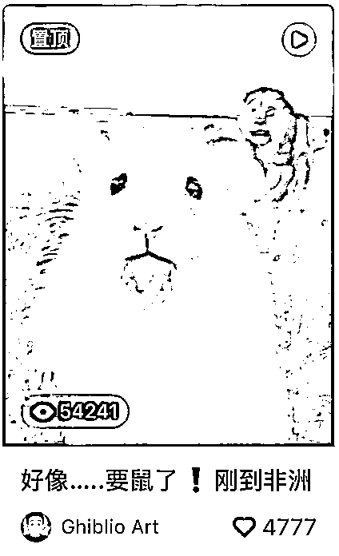

3、挖掘需求

有用户使用后，建立了付费会员群，找深度使用以及经常续费的会员了解他们的使用场景，发现在电商、短视频视频带货等场景是高频使用场景，于是针对这些场景优化产品。

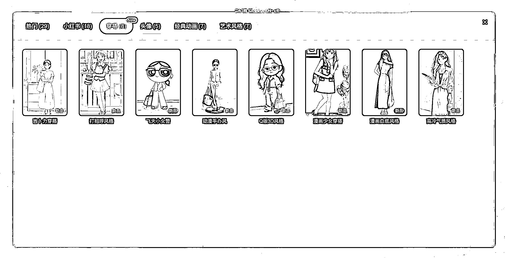

至此，一个热词站成功变废为宝，成为了一个可长期经营的站点。

到这里我的分享基本结束了，但是我还想补充一些思考：

吉卜力这个站，也许很多做 AI 产品的新人会觉得我很厉害，其实我只是取得了很小的成绩，因为我没有拿到很大流量。但是我觉得在文章最后还是有必要再升华一下，我们除了要关注**从 0 到 1 的突破** ，也要关注到从**1 到 100 的放大，** 这样我们在做下一个产品时就可以把**机会变现最大化** 。

打开视野，我们来看看真正的牛逼级产品：

Getimg.ai，3 月份凭借 ghibli 热度，流量环比上涨了 681.2%，从不足 200w 上涨到 1236w，拿下图片领域月增速第 1。

insMind，来自稿定科技，通过对吉卜力风格生图的快速反应，独立访客数量从细分赛道垫底，直冲第一，月独立访客 731w，拿下图片领域月增速第 2。

OpenArt，在翻倍增长后访问量过千万，成为第 3 款访问量超过细分赛道中位数（800w）的华人生图产品，拿下图片领域月增速第 3。

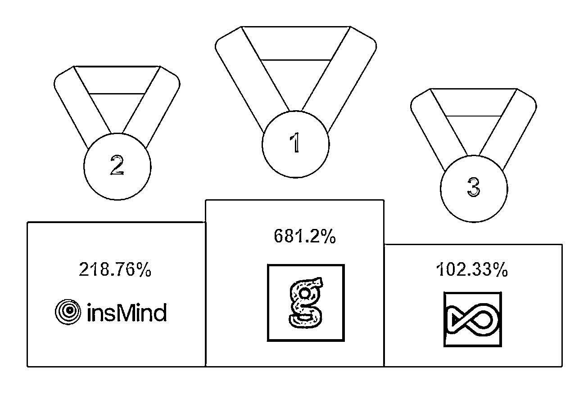

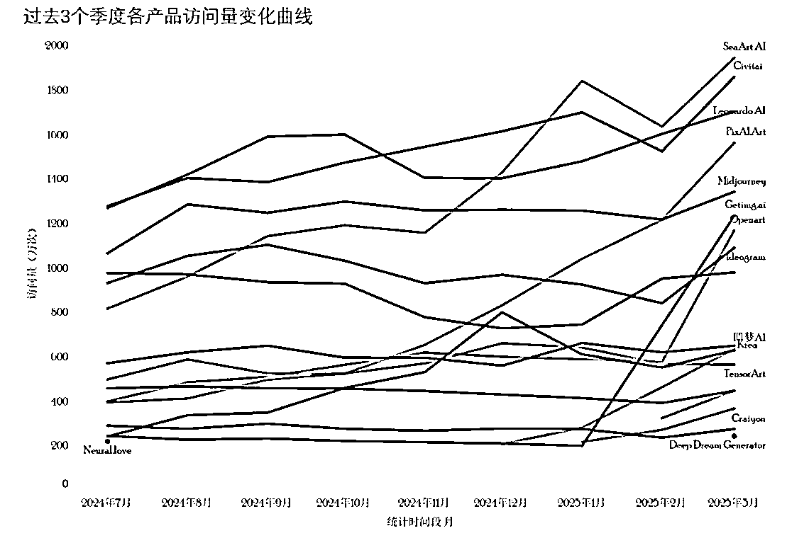

以上的超高增长全部靠 3 月份 ghibli 的热度获取到泼天流量，他们是怎么拿到的呢：

SEO，付费推广，红人营销，产品引流等等。

虽然以上也都是公司级的产品，但是对于个人也具备参考价值。而且个人也具备企业不具备的优势：灵活，决策快，行动快。

所以真正局限我取的成绩大小的是认知，是能力，是执行力。我也只是做到了从 0 到 1 的突破，所以抓住并放大这个机会很重要，作为个人开发者，我还有很多需要补的短板。

不过当前阶段的 AI 时代不缺机会，做好准备，希望下一波机会来时我们都在场。

* * *

评论区：

刘小排 : 厉害！推荐大家学习这一篇

新页 : 你的几个产品我都有关注，ui 是真的很漂亮，是很用心的在做产品。

江炜 : 谢谢！以前上班时没觉得设计也是生产力（也可能是以前做 tob 产品的原因），自己做网站有用户反馈后深有感触了。
当然仅仅设计好看也不行，比如我的前两个 AI 产品虽然也好看，但是是失败的。 AI 编程能力和设计能力越来越强后，反而用户需求的洞察变得更为重要了。

江炜 : 小排老师的精华帖我都看了，学到了很多，最大的收获是从程序员思维往产品思维的转变 [抱拳]

Freedom : 能改成小程序吗？我们有证件照小程序的用户流量

江炜 : 有小程序版，有合作意向可以联系鱼丸要我微信加我

酷乐猫 : 国内使用的话不备案，网站后面会打不开吗？

江炜 : 不会，走得是海外站的路径