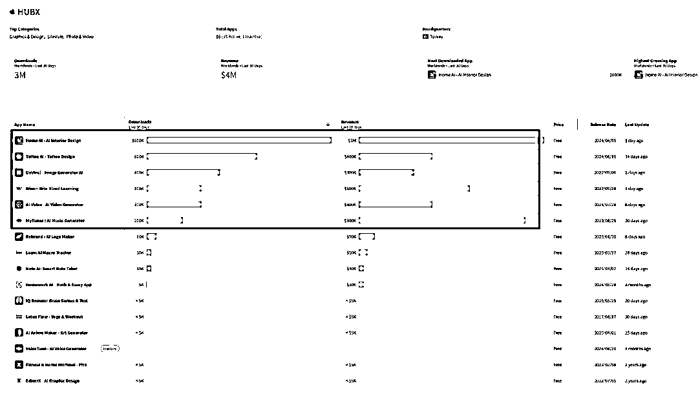

# (12 赞)拆解 HubX 公司架构模式亮点

> 原文：[`www.yuque.com/for_lazy/zhoubao/rqd4i2n92b5ch3gv`](https://www.yuque.com/for_lazy/zhoubao/rqd4i2n92b5ch3gv)

## (12 赞)拆解 HubX 公司架构模式亮点

作者： 特里莎的出海手记

日期：2025-07-10

今天继续拆解一家特别有意思的公司——**HubX** 。

非游戏领域，纯靠 App 工厂打法，HubX 这家公司，**月入已超千万美金** ，而且基本看不到外部融资，算得上是行业里比较有代表性的“自有资金 +
组织创新”案例。

如果你不熟悉 HubX，可以先看下面的这几个表，旗下有一批高下载高收入的热门产品，看看你知道几个？

收入高的公司很多，之所以重点讲 HubX：**因为我很喜欢它的公司架构、增长理念，以及以热爱驱动，知识共享的理念。** 事实上我也曾经推动和过打造类似的架构，所以我知道这个模式的确可行。

这是他们创始人提出的公司组织架构

**"独立互依工作室"模式：每个工作室专注特定垂直领域，同时共享 HubX 中央资源。**

也是他们的公司名 HubX 的意思，就是有 X 个独立的无限的可能，通过 Hub 连接，生长。后面我会来详细讲解这个模式。

**下面我们先来介绍一下这家公司**

## **一、背景：不是 2022 新公司，早在 2016 已经布局**

表面上看：

各三方平台公开资料里 HubX 旗下 App 大多从 **2022 年后才陆续上线** ；

甚至 Sensor Tower、Data.ai 也基本以 2022 作为节点；

但翻看创始人的自传，联合创始人**Kaan Ortabas & Cem Ortabaş是两兄弟**，早在**2016 年** 就以 HubX
名义启动了内部项目和早期投资；家族资金为主，早期探索，团队慢慢成型，直到 2021 年才正式系统化推出“HubX 模式”。

所以准确讲，HubX 的发展分两段：

**2016–2021** ：探索期、家族资金内部孵化；

**2022 起** ：蜂巢模式落地、App 工厂规模化、月入千万美金，公司目前应该是 150-200 人左右。

## **二、愿景、结构与理念：HubX 的架构和打法**

HubX 内部自有清晰的系统设计：

### **公司使命与愿景**

### **使命** ：用精心设计的技术产品，让生活更轻松有趣；

### **愿景：** 成为全球领先的多垂直移动应用工作室，服务数十亿用户；

### **阶段目标：**

土耳其下载量第一；

打造本地首个非游戏独角兽。

# **【HubX 公司架构模式】**

## **1.关于 HubX 公司架构表的官方原文：**

出自创始 Cem Ortabas 的直接表述：

"We are evolving to become a hub that contains interdependent studios under
one roof. A hub where each studio has its own team and products, accumulating
know-how about a specific vertical in the app categories."

"At the center of all these interdependent studios, HubX provides shared
resources with various central departments, office space, in-house data tools,
know-how, and funding."

## **2****.** **中文准确翻译：**

我们正在逐步发展为一个**枢纽平台（Hub）** ，在同一个体系下，容纳多个**独立互依工作室（Interdependent Studios）** 。

每个工作室拥有自己的团队和产品，专注于特定的应用垂类，积累针对该领域的经验与专业能力。

在所有这些互依工作室的中心位置，**HubX** 作为中枢，提供共享资源，包括：

✅ 各类中央职能部门；✅ 办公空间；✅ 内部数据工具；✅ 专业知识与经验库（know-how）；✅ 资金支持。

## **3****.** **核心结构解读：**

结合他们官方信息总结，HubX 架构本质上是：

**蜂巢式结构：**

**HubX 是中枢，集中提供技术、数据、设计、增长、财务、办公等通用能力；**

**各 Studio 像蜂巢单元一样，独立运营、专注产品，灵活应对市场；**

**独立互依工作室（Interdependent Studios）：**

每个 Studio 团队小、效率高，通常聚焦某一条产品线；

Studio 拥有自主决策权，但又能随时借助 HubX 的资源体系；

共享资源，避免**浪费与内耗** ：

技术平台、AI 能力、数据系统、增长策略统一管理；

各团队不需要重复造轮子，快速试错、快速上线。

## **4****.** **HubX 结构的优势：**

✅ Studio 独立自主，保持市场灵敏度；✅ Hub 提供强有力后端支持，确保效率与规模并重；✅ 构建长期积累的组织经验（know-
how），形成持续竞争壁垒。

## **5****.** **对标国内常见“中台”区别：**

HubX 的"Hub+Studio"模式，并非我们国内传统意义上的"大中台"概念。

国内中台常强调**资源整合与流程协同** ；但是作为数据和运营的中台，常常真的就象名字一样，不断被推到后方去，被其他所谓的前台推挤。

我们知道国内很多运营增长部门最后都会变成隶属于技术部，或者每个产品线自己招几个运营或者投放在工作，不同产品线之间的运营投放团队无法形成数据，资源和经验的共享。

国内的数据增长团队，很多时间甚至被放到了后台，远离市场和用户，结果他们出来的数据也变成了对市场毫无参考的一堆“数据”而已。

在 HubX 的设计团队也是共享的资源，不象国内很多公司，一个产品线配一个 UI 就算了。HubX 有独立的设计实验室（DesignLab），集结 UX 研究员与多领域产品设计师，公司认为这将成为未来成功的重要支柱。

HubX 对设计师的要求是：**我们不仅是设计师，更是用视觉叙事驱动增长的创意战略家！**

**HubX 的重点是工作室快速试错+中枢集中支持；**

**Studio 像创业团队，灵活、独立，Hub 像“资源母舰”，随需调用。**

他们更偏向硅谷式的“孵化+快速验证”思路，结构灵活，资源统一，适合多赛道 App 矩阵打法。

# **小结**

**官方关键词** ：

✔️ Hub（枢纽）✔️ Interdependent Studios（独立互依工作室）✔️ Know-how accumulation（经验知识积累）✔️ Shared resources（共享资源）

## **三、内部部门全景**

## **四、为什么值得参考？**

HubX 模式的亮点：

✅ 家族耐心资本，不靠外部融资；

✅ 蜂巢式组织，高效灵活；

✅ 技术、增长、设计体系闭环；

✅ 以 AI 为主线，多赛道同时推进；

✅ 数据与产品决策一体化。

**对于做增长、做产品的我们：**

你是否具备类似的组织结构优势？

技术、设计、增长是否形成协同效应？

是否有快速试错、灵活切换的机制？

HubX 不仅是“富二代故事”，更是系统性打法的成熟案例，值得结合自身业务思考。

* * *

评论区：

暂无评论