# (12 赞)YouTube 与网站结合玩法及 SEO 布局分享

> 原文：[`www.yuque.com/for_lazy/zhoubao/pevkhqo9pwxa8et7`](https://www.yuque.com/for_lazy/zhoubao/pevkhqo9pwxa8et7)

## (12 赞)YouTube 与网站结合玩法及 SEO 布局分享

作者： 书情小跟班

日期：2025-07-09

更好的阅读体验见 飞书文档

YouTube 玩法未来新趋势 [`rlwxa0zgke.feishu.cn/docx/JTAwdmGDAoxODdxAdgmc36lwnR6?from=from_copylink`](https://rlwxa0zgke.feishu.cn/docx/JTAwdmGDAoxODdxAdgmc36lwnR6?from=from_copylink)

今天这篇帖子对如下的帖子做一个补充 找 Shorts 爆款视频的好工具--google 插件 YouTube Shorts Crawler [`wx.zsxq.com/mweb/views/topicdetail/topicdetail.html?topic_id=5125488155524554&inviter_id=&inviter_sid=`](https://wx.zsxq.com/mweb/views/topicdetail/topicdetail.html?inviter_id=&inviter_sid=&topic_id=5125488155524554)

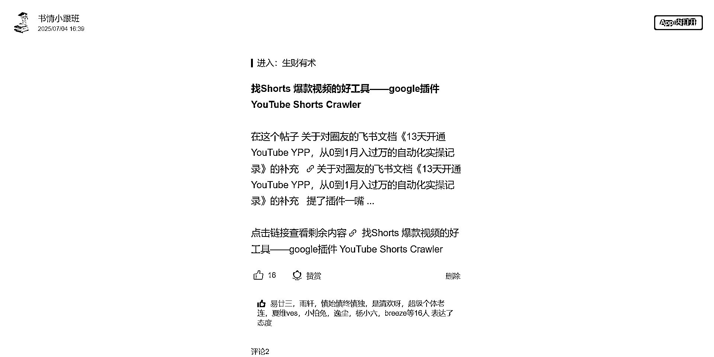

我在 2025 年 6 月 28 号 29 号参加圈友哥飞的活动结合自己的理解给出 YouTube 玩法未来新趋势

原理说出来就很简单，真传一句话，假传万卷书，

**那就是 google 搜索跟 YouTube 搜索是打通的，这里的新玩法便是，做网站跟做 YouTube 不是孤立的做，而是应该结合在一起做**

这里要说明一点，你自己去搜是不准的如下图，在搜索框搜 youtube shorts crawler 你会发现 [`shortscrawler.com/`](https://shortscrawler.com) 这个网址是在第一个，实际上不是的。（原因也非常简单，就是你浏览会有一个浏览记录，这个浏览记录会影响你看到的内容）

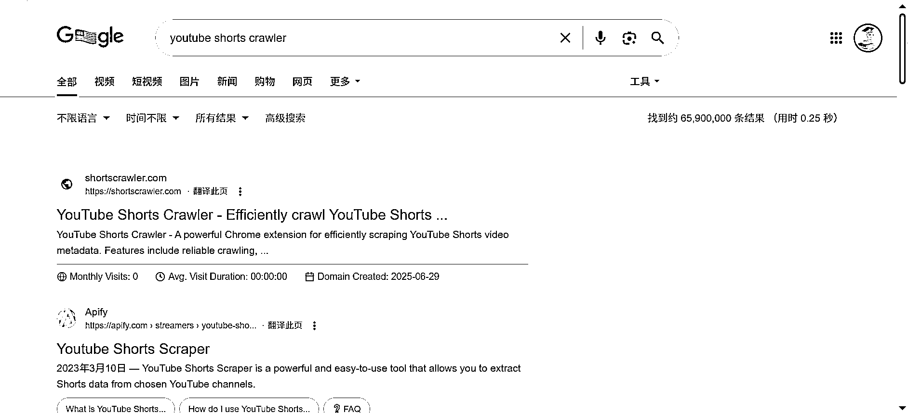

避开干扰打开无痕就会看到下图，我们很容易看到，除了第一个大站，也就是 <[`apify.com/streamers/youtube-`](https://apify.com/streamers/youtube-) shorts-scraper> 排在第二个就是视频

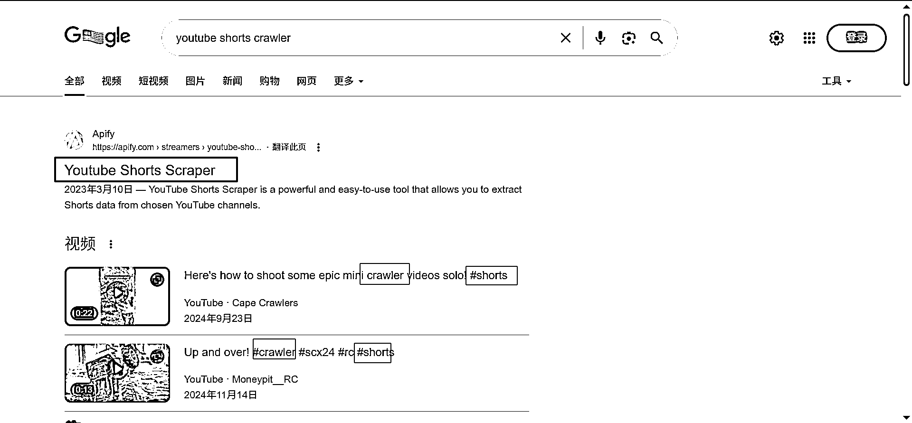

我们可以看到视频的第一个标题为 Here's how to shoot some epic mini **crawler** videos solo!
#shorts

第二个标题为 Up and over! **#crawler** #scx24 #rc #shorts

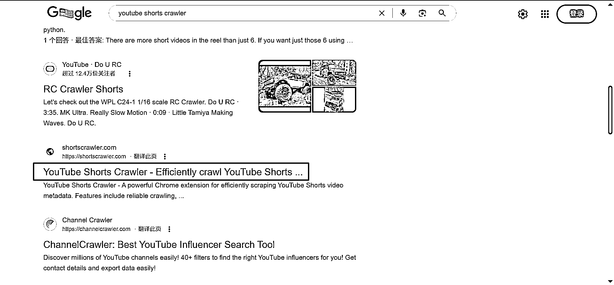

如果说要引流，那么做戏做全套，标题+视频的语言都要是英文才行，比如说如下图，在没有登录的时候，匹配的第一个是广告

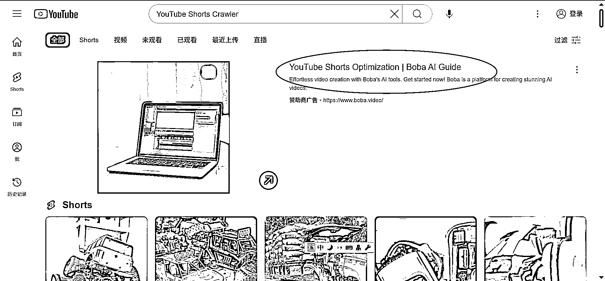

后面出来的是英文的视频

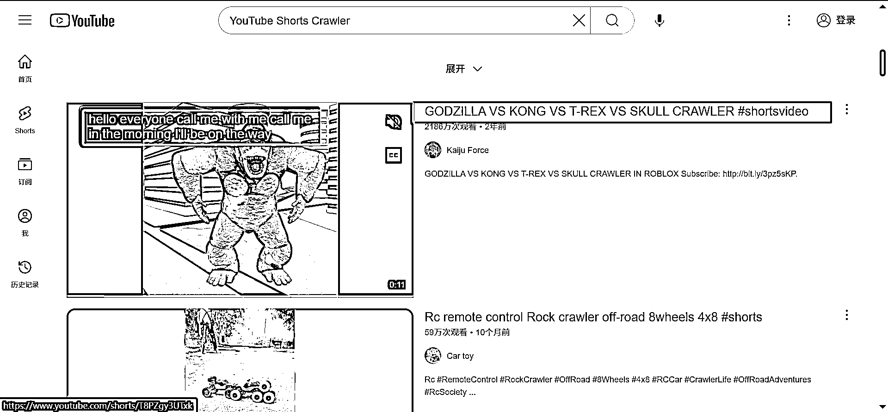

如果你的搜索有中文，那么默认是搜中文的，这里我用无痕模式来避免我的观看记录带来的影响

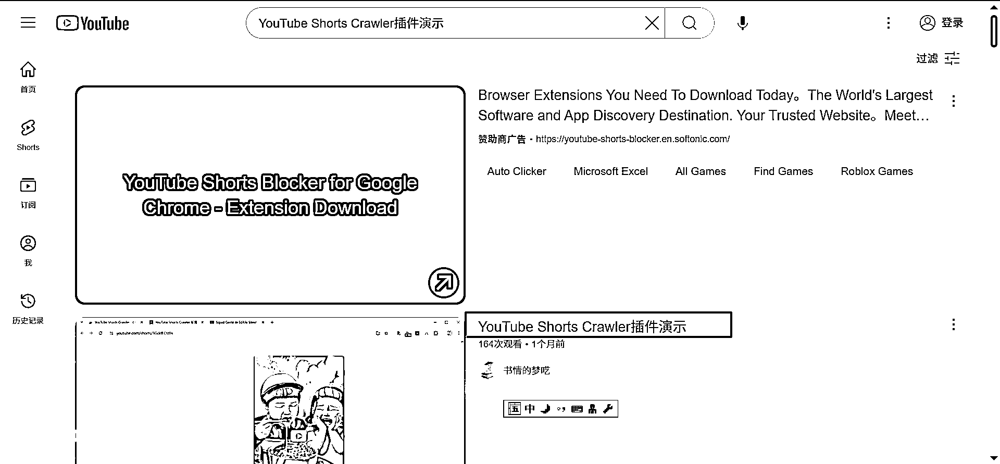

做一个小结：

我们做一个网站，或者说插件，完全可以通过在 YouTube 视频的标题进行布局，这里说一个公开的秘密，公开是指有些人早知道了，秘密当然是指有些人不知道这个信息差。

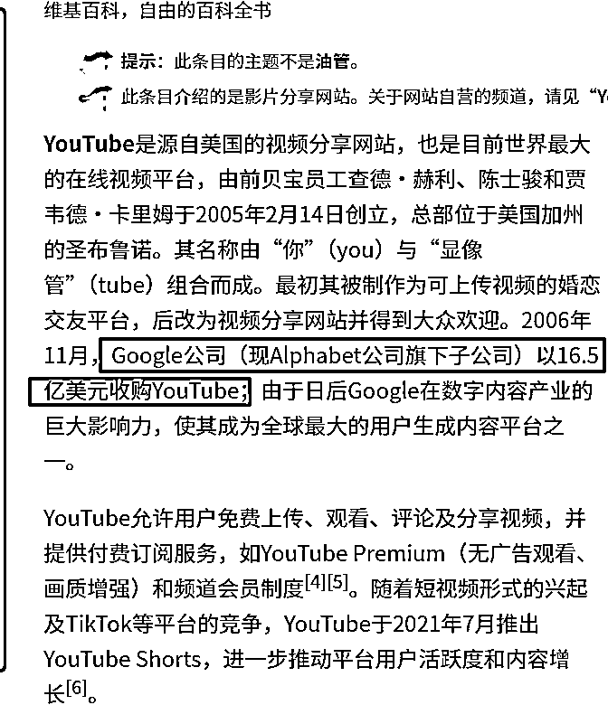

在这个信息下，如下图，第一名是 google，第二名就是 YouTube，也就是 google 的亲儿子，一般人只顾着做网站，可能没有意识到 YouTube，也没有想到网站跟 YouTube 结合来做。

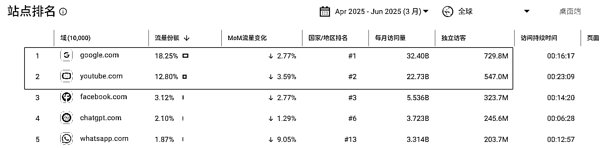

那么如何进行一个结合呢？答案也是非常简单，那就是在 YouTube 视频上铺关键词，当观众点开你的 YouTube 视频，就可以在视频的说明栏把你的网址贴上去。

以上就说完了，就是这么简单，之前在生财发的一个帖，关于无人直播的，通过无人直播可以快速过 YPP，找个最近尝试直播的小伙伴，如下图。

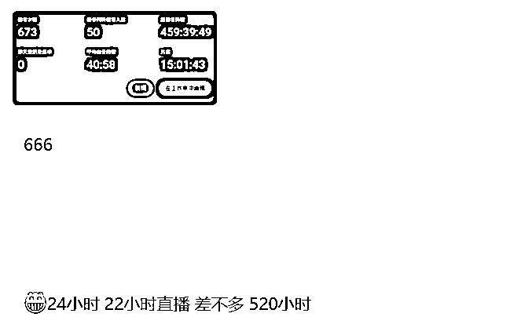

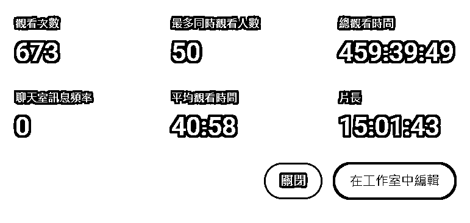

也有做得相对好的，如下图，一次直播，时长就直接够 YPP 了。

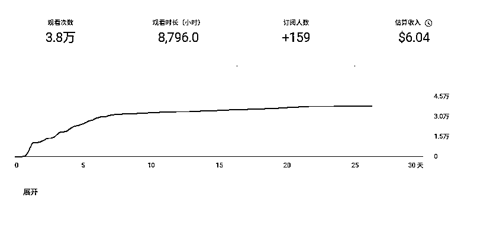

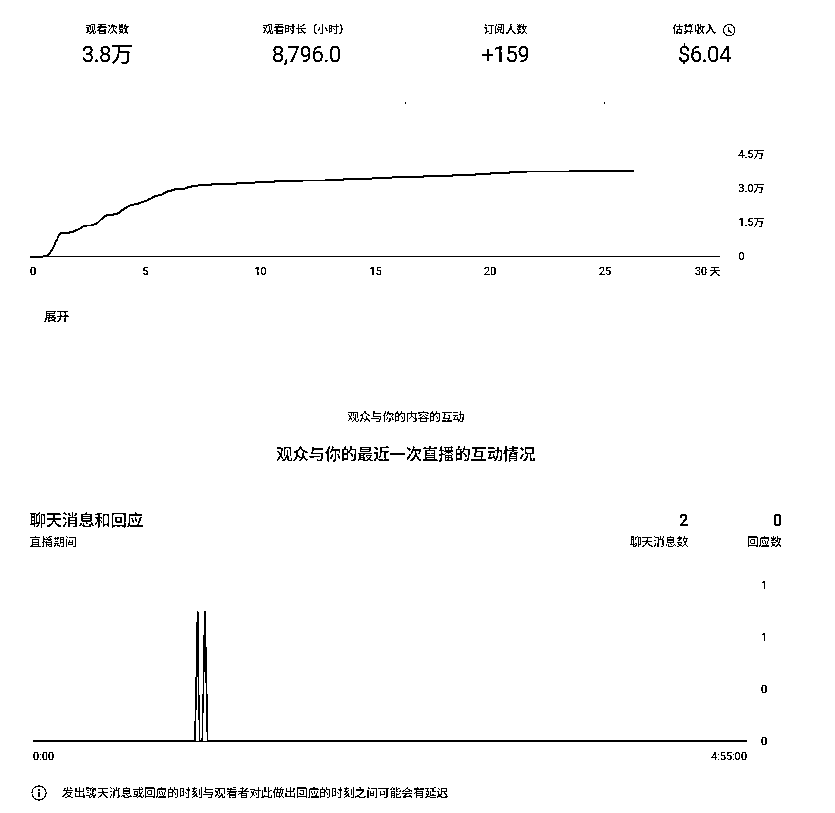

在 YouTube 上布局做 SEO，等流量来，下面就是一个案例，布局好关键词等风来，可以看到 YouTue 搜索有 133W 的观看量

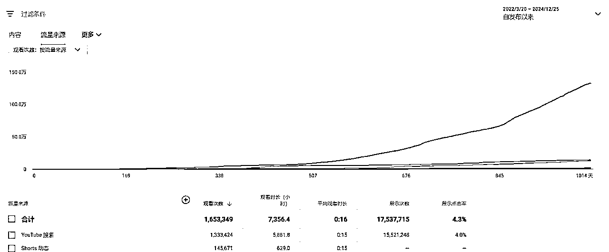

今天分享这个点，其实对于一些人来说是一个常识，但是有些人可能也确实没有想到可以这么玩，我算是抛砖引玉
，我相信接下来肯定有更厉害的圈友，把我分享这个点运用起来，我等你们的报喜。

* * *

评论区：

暂无评论