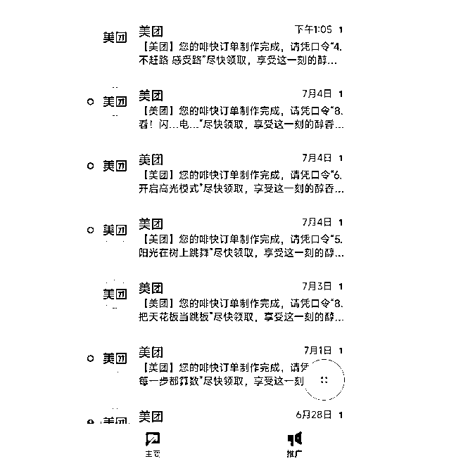

# (31 赞)创业、生活的踩坑反思与经验分享

> 原文：[`www.yuque.com/for_lazy/zhoubao/zf8ut1clgwqkk9bk`](https://www.yuque.com/for_lazy/zhoubao/zf8ut1clgwqkk9bk)

## (31 赞)创业、生活的踩坑反思与经验分享

作者： 侠狼¹主号

日期：2025-07-08

最近半年算是浪费了有半年多的时间，是踩了很大的一个坑，因为我上半年一直在搞自动化工具。

后面明白一件事情，**任何的工具都是应该要用在正确的场景里面，而工具的本质应该就是提效** ，而提效的背后，大部分还是撸平台的免费流量。

其实，这里也得到了另一个答案，**如果长期做免费流量的生意，不去追热点，做爆款，那么，你这个赚钱的盘子很可能就一直不会很大** ，基本只能赚一些小钱。

但，对于大多数的自由职业，或者少部分创业者来说，这个级别的收入基本足矣。

SEO 搜索，本质上就是薅平台流量，嗯，免费流量，**虽然你的内容可能足够优质，内容很好，但是资本才不管你这些** 。

不管是创业也好，做互联网也好，**一定要想办法让这一条链路的所有人都赚到钱** ，想办法去玩付费流量，付费流量，或者推荐流量才是做规模的，没有规模，后续的一切，都是空谈。

也许，你的免费流量能玩的很专业，但是，若平台改了规则，又要去研究规则，挺费劲的，当然，这也不是重点。

**重点在于，你能否给平台带来直接的利益，比如你玩投放，只要没有同行进来，那么你就一直可以精准的算出来，投入多少，回本多少** 。

而**免费流量，实际上员工都是成本** ，如果一个员工无法创造出来对应价值的流量费用，那其实也是亏本的，很多老板创业亏钱，其实就亏在了这里。

当然，还有一句话的方向是，**你若教会了一个员工玩免费流量，玩的还很厉害，后续这个员工要是跑路了，你这个小公司缺少了这个人才，那这里就很容易出现一个很大的断层** ，直接 G 了。

**高级的运营一定会跑路，一定会出来创业，只是时间长短问题** 。

很多时候，创业都是找到对的人，人对了，事才容易成。

**推荐流量可以做任何平台的 SEO，但是反过来，大部分的 SEO 无法拿来做推荐流量** ，当然，这句话** *并不完全正确***
，但是我期望的是大家都有一个能去做爆款逻辑的想法。

毕竟推荐流量的商业化已经很成熟了，平台能给你多少流量，平台也是很清楚的。

这篇文章，我将打破我所有过往以往的想法以及认知，包括近期我遇到的很多的事情，希望这篇详细的踩坑文章对你们，我们，都将有所帮助！

**一、有门槛的地方一定要多去看看**

实际上世界很大，非常大，就像不同的人的想法也是，有空可以多聊聊，多听一听听，他们是怎么做这件事情。

尽管也许你知道标准答案结果，但是每一次其他人的落实方案，都可能让你耳目一新！

如果你只要还想学习，成长，那就一定要多跑跑，多试试，多听听，多看看，保持开放。

若是有得选，有先来深圳呆一段时间，然后多去走走看看，我很后悔，来迟了，不然我很早就可以避开这些问题。

深圳房子好贵，租金挺贵的，同样的价格，我至少在非一线城市可以租到较为不错的房子，而深圳只能住城中村，城中村就算了，还小。。。

** *门槛，就是筛选，且，一定是筛选。***

说个接地气一些的，就是五星级酒店，星巴克，蛋糕店，鸭货卤味店等。

酒店有贵的有便宜的，贵的酒店服务态度居住体验都不会差，但是很多人没有思考过，**为什么他们能卖那么贵，我认为酒店本质上同样都是睡一晚** ，当然也许后面我会改变这个想法。

像星巴克，瑞幸，蜜雪冰城也是如此，很多人去星巴克，就会觉得贵，同样都是咖啡，为什么星巴克能卖那么贵（我是经常喝咖啡的，我是喝不出来那些风味）实际上，绝大部分人都是奔奔着环境去的，朋友喝茶聊天，我基本都是请客喝星巴克。

而那些经常喝蜜雪冰城、瑞幸的人，大概率是拿着喝的就走了，基本不会为这个环境买单，**也许有人说，群体不一样，赚的钱不一样，我只能说，神经。。。要是同样的东西，正常的第一印象肯定是选便宜好喝的** ，便宜的东西也许难喝踩雷了，但是也不会心疼的。

其实还有很多的案例，都是筛选，本质上就是为了过滤一波人。

比如，**只要是做社群的，做培训的，就一定会有人说割韭菜，但是他们根本没有站在那些愿意付这个费用的人的角度去思考这个问题** 。

最简单一些例子，比如，生财有术，这是我目前最喜欢的两个社群，但是只要是跟利益有关系的，就会有人吐槽，有人觉得值。

那些愿意为这个费用买单的人是傻子吗？很显然不是啊，只不过短期内站在的角度不一样，思考的问题就都是不一样的。

就像那些坐高铁二等座的人，不会理解坐高铁商务座的人，本质上都是要去到同一个目的地，为什么座位不同，价格会有那么多偏差？

人心中的成见就是一座大山，**你可能在当下无法理解这个问题，也许会在未来得到这个问题的答案，也许很快，也许很久** 。

但是如果自己都不接触不愿意听他人分享这个观点，那么在其他场合听到这件事情，就下意识拒绝就不会有后续的案例。

若有的选，**同样做一件事情，尽量多听听其他人的观点** 。

**答案，观点，想法都是不同的人多方碰撞得到新的结果** ，机会是聊出来的，不是自己想出来的。

**二、常见的一些偏见**

比如以做项目为例子，我以前是真的觉得做投放干啥，那么容易亏钱，实际上那时候就是我穷，tmd 认知也不够，就只想着免费流量做起来。

实际上，我免费流量我也做起来了，我还是有点本事的，而大部分人连最基本的从 0 到 1 都没有跑起来，也没法跑起来。

当然，**最好赚钱逻辑肯定是，先自己用最快，最小的成本跑通最小的 0 到 1 证明这件事情是可落地，可以做的，然后再去用少量的成本去试错放大** 。

免费流量也是成本，付费流量也是成本，都是成本，如果资金允许的情况下，最好是尝试付费流量的成本。

**很多人走着走着，就走偏了，比如，我要做矩阵，我要找大学生兼职来帮我发帖，来帮我做内容，等等** 。

**但这里有个非常严重的核心的问题，免费流量的模式你能跑通吗** ？

你会不会剪辑视频？会不会做黄金三秒？会不会做图文？会不会做 SEO？会不会招员工，会不会管理？

等等，其实难度是指数级别增加的，**事情越多，越杂，难度系数越高，而这些很多的动作距离钱都太远了** 。

**动作越多，距离钱越远，越是很难拿到一些结果，一定要做距离钱最近的事情，正反馈一定是首要，主要！**

其实赚钱有些时候就是跑错方向了，**本来应该是，要多做我会的内容，而不是去做我不会的内容** ，好学虽然是好事情，但是很容易跑偏主题。

当然如果是一些大而远，而门槛高的，并且自己也感兴趣的，那大概率这件事情就可以干。

比如 web 出海，大部分人会认为英语是个问题，编程是个问题，实际上这些都不是问题。

我现在接触到的一些朋友，听到是要做网站，就会下意识想到要写代码，学单词，看文档。

这里就把自己封死了，我现在是从零开始学 nextjs，拿来写代码，做 web 站，说实话，**我以前都是模板建站，没啥技术含量，以前做的 SEO 就是天天去知乎哔哩哔哩，发广告引流到自己网站** ，一样的做起来了，没啥技术含量。

绝大部分人就听到做网站就觉得，哎呀，我要是程序员多好呀，我要是会英语多好呀。

天天做白日梦，学都没去学，**没有强相关的场景需求，或者强烈的执行欲望，就很容易崩，无法坚持** ，实际上就没有从自己身边，身上找找原因。

**你身边的环境是什么样子，你注定也会被感染成为什么样子** ，基因环境在那边，想要改变基因的最快方法，就是融入一个全新的环境。

为什么很多公司淘汰员工很快，就是因为，**新来的员工，进入一家新的公司，会想要很快的了解到新的技术，想要不被裁员，只能奋力的学习，尽量多去拿正反馈** 。

相反一些公司的老员工，会很多的摸鱼技巧，甚至天天把法律挂在嘴边，罗翔老师说**法律是“对人最低的道德要求”** 。

生活上的偏见还有许多，再比如。

租房，最近我跑到惠州大亚湾来了，很多人听到惠州大亚湾，就会联想到什么鬼城、南方鹤岗，等等。

鹤岗差吗？他们不知道，大亚湾差吗？他们也不知道，只知道自媒体那边口嗨，不看具体数据，不看具体增量。

**很多的信息都是可以用具体的数据来说话的，比如 618 销售额，手机全国销量排行，iOS app 付费排行，下载排行，很多榜单都是透明的** 。

比如**一个行业好做不好做，在上升阶段，还是下行阶段，也没有具体数据，没具体调研，就说这个项目，或者行业做不了，不好做** ，有时候就是你不好做，或者你没有做起来而已，并不能代表这个行业不好做。

但绝大部分人的脑子已经被自媒体洗的很彻底了，一点常识也没有，数据也没有，一问三不知。

再比如，为什么我要跑到惠州来，为什么那些人会跑到惠州来买房？这些大部分人都是没有考虑过的。

惠阳，**坐高铁到深圳北就 25 分钟，若是未来西丽高铁开了，也许从惠阳直达深圳南山会比你从龙华到南山还要快** ！

这就是为什么当初很多人会跑到惠州来买房的其中一个原因，具体的深度关于惠州买房的原因这边就不讲了，只是一个生活偏见案例。

假设，我在深圳租着 2000 块钱的单间城中村或者 6 平米的小区合租房，但是同样的价位我在惠阳可以租到标准的新小区的三房两厅，乃至五房两厅，而且来深圳也很近，你会怎么思考？

如果你是跟我一样的自由职业，那么大概率会跑到惠阳来的，若是有圈友来惠阳玩，可以滴滴我，这边租房便宜，五公里左右还有一堆的商场。

假设你毕业后就一直呆在北上广深，这些城中村，或者合租房，那么你可能就从来不会思考过，自己独自租一间公寓，或者小区房，可能只会下意识的再去找下一个城中村居住，觉得自己的收入预算就是那么多，不能多，也不能少。

那也许你在未来的几年都不会去考虑租更好的公寓，或者小区房子。

**实际上，很多的小区房公寓，** ***跟正常的城中村的价格不会偏差很大*** **，但是百分之七八十的人听到这些数据的时候就不会去看了，不会有任何念想**。

但真实的情况往往是，**任何的商品都是可以砍价的，有很多人认为标价就是实际上的价格，实际上完全错** ，很多时候，价格就是给你挂着给你砍价用的。

你不去砍价，对于商家来说那肯定是最好的，但是**有些商家是巴不得有人来咨询一下，砍价也好啊，商品的属性是什么，就是以物换物，卖出去，租出去才是赚钱** ，只要卖不去就是亏钱的。

**三、找到在这个位置的人**

很多数据最好是去问具体的人，最好是在用，在这个线上的人。

这个是我租到的房子，在惠州大亚湾，附近有 5 公里内有 4 个超大型商业广场，距离深圳最近的地铁站 12 公里，惠阳站 7 公里，26 分钟到深圳北，110 平方的精装新小区，带四个空调三房两厅，附近 600 米有个很大的商业综合体而且星巴克海底捞也有。

你认为值多少钱一个月？

这个房子**房东一开始是挂 1600 的租金，但我试着给中介报价砍价呀，砍下去了啊，人生的意义在于尝试，不试试怎么知道** ？

这个房子的租金是 1300，不含物业费，加上物业费 1600。

很多人听到大亚湾就摇头，并不知道这边具体情况，发展的怎么样，而且也不知道**大亚湾还有很抗跌的 3 万多一平方的房子** 。

我有个朋友他比我租房早一些，一开始他找房子还是想着跟广州一样的预算，我说这边加点预算可以住三房两厅，并且很好的环境。

**但是预算他卡的比较死，更贵的房子就没去看了，但是我一开始就是打算都看看，然后看到个合适的然后找中介砍价了** ，我租到了更好一些的房。

同一个小区，不同的房东，不同的户型，也许有些房东就是愿意低价卖，低价租，有很多时候都是在于尝试，不试试，就没后续的。

**互联网的信息很多，人一定要学会分辨这个信息是从哪里来的，是真是假，这就是目前 AI 短期内还无法解决的问题，AI 幻觉** 。

**AI 的很多数据其实都是来自于互联网，而互联网很多数据都是别人的软文推广来的，甚至可能都是错的** ，目前的 Ai 基本还是只能整合数据，以及猜你需要这个东西，短期内还无法辨别数据的真实性。

**实际上很多的东西都有答案，找到在这个位置的人，去问具体的数据** ，我们没法做好所有的市场调查，但是若能找到自己心目中合适的产品，合适的价位，那就成交就行了。

而去**做调查最好的办法就是准备浪费 500 到 1000 块钱，多找几个正在做这个项目的人，给他们每个人转账 188，或者 88，反正这些钱一定要准备浪费掉，不管是收没收，但，极大的概率你们是可以成为朋友的** ，最多就是多花几百块钱而已。

每个人的阶段不一样，这个方式不一定适合所有人，但是保持开放学习，不要抗拒是很重要的，为什么长江后浪推前提，前浪死在沙滩上，就是因为不去主动学习啊，迟早会被干掉的。

**记得多去看看数据，偏见是很容易把一个人带到沟里面去的** 。

也记得**在合适的时间段，可以试试浪费一些小钱，体验一下一些不一样的快乐** 。

比如，深圳湾一号，可以花一百多去 72 楼的喝个酒，体验一下那些住在这边的花接近一个亿的房子的富豪们是什么样的生活，用小钱装大 B。

比如，广州塔，为什么那么多人都想上去玩玩。

比如，用一下 cursor 写一下代码，试试做一个 web 站。

比如，吃一下榴莲，尝一下菠萝蜜，折耳根。

比如，买一个苹果手机、几百块钱的跑鞋，上千块的自行车，更高配置的电脑。

等等等等，还有许许多多的东西，都是可以值得花钱尝试一下的，**以上的很多东西，大家都是有能力承担且享受的，只不过如果连最基础的想都不想一下，那基本就属于自己卡自己了** 。

**四、试试看呗**

来到深圳，我倒是很感谢小易，我曾经其实有一段时间很奇怪，就是只想着攒钱，攒钱。

**虽然攒钱是一定要做的事情，但是过度的攒钱，体验不到活着的意义就没有任何意思。**

反正我来深圳的那一段时间，看到小易经常去从龙华茜坑，打车去华侨城喝个咖啡，吃个日料，喝个粥，打车也老贵了，来回一个多少小时，车费也不便宜。

那时候很不能理解他的想法，直到...我换了一个城市，体验了这个爽感，发现真香，只不过我那时候花钱没有那么大胆罢了，惠州这边打车 7 公里左右，基本不会超 20 块钱。

具体的，自己去体验才会清楚，这里不多说了，对了若是去华侨城，记得下午去。

哦对，小易那时候说出来了一句很有深度的话，**“你赚那么多钱干啥，你大不了再赚回来就行了啊”** ，艹，这句话是真的牛的，一下子很多困惑都自动解开了。

是啊，**要是你每次都是做一些小项目，没看到更赚钱的具体项目案例，任何的想法消费都是不会被普及的，甚至不敢想的，想都不敢想，谈何后面的阶段** 。

所以**人一定要开眼，一定要去看看，那些老板们是怎么赚钱的，怎么去落实的，怎么一天赚几万，几十万，几百万的** ，不要听到别人一天赚几万，就觉得是假的。

应该拿具体数据，具体思考，**具体拆解这件事是怎么赚到这个钱的，先相信，再拆解，出门在外，** ***身份都是自己给的，别人的也是*** 。

我见过一些朋友，就算他们月入过万，乃至大几万，在花大钱学习投资的时候很舍得，大几千随手花出去了，但是花一些小钱提升自己生活品质的时候就根本舍不得，甚至很抠。

想要改变自己的想法这里是需要很长时间去说服自己的，因为我自己早期就是这样的人。

当然，** *这篇文章也有毒，不一定全对，因为，若是一个人手头上就几千块钱，让他们去这样消费是肯定不现实的，先手头自己囤一些资金，有个不错的项目，再多去体验这些感觉***
。

若可以，出海，试试看，或者**多看看案例，至少要让自己觉得，自己又有机会，又行了，无需担忧未来又没钱花，多看点具体的案例** ，最好是具体到，你也可以做的案例。

**赚钱，创业本就是以小博大** ，若是野心都没了，做个毛。

人总要为了一个目标去看看，有时候我自己折腾了那么多，我也问过自己，我到底需要什么，我期望的终极生活是什么？

**抛开房子车子，我现在其实很开心，很快乐** ，如果把自己的预期降低，需求降低，那将会很快乐。

每一个阶段的人，都有自己不同的活法，如果觉得生活没意义，不如多多思考，我要成为什么样的人，要怎么活成自己想要的活法。

这里很重要的一点就是，** *一定要重在参与，赚钱，花钱，体验，感受，都是需要的，而不是，我想要，我要*** 。

人想要的东西一定会很多，**贪念、欲望是无止境的，砍欲望，砍想法，砍掉很多不切实际的东西，或者不赚钱的事情，生活自然就会开心，轻松** 。

很多时候，都是自己给自己莫名其妙的加上了枷锁，任何的问题实际上都是具有答案的，只不过这个答案可能是你当下遇到的问题。

**五、利益关系**

再聊回收费这件事情，这个阶段国外的意识比我们要好很多。

比如你只要愿意去贝壳上面找房，租房大概率要掏中介费，如果没有利益在，租房中介小哥不会带你看那么多房源，不会帮你砍价，把你预算明确清楚，双方都谈好差不多事就能成。

但是**总有一些人会觉得，中介收中介费，很坑，坑吗？也许有，但是具体要看人** ，不能一棍子打死全部。

**只要有任何利益关系存在的事情，尽量多打个问号** ，这件事，对谁有利，还是双方有利。

**如果因为这个利益导致你很被动，或者很焦虑，那这件事情，想办法再找几个人咨询问问看看** 。

这件事跟你有关系吗？你能获取到多少利益，你风险有多少？

多问问多思考，**实在不行，就去找个懂的人，付费咨询，所有问题都有答案，大不了多问几个人** ，只不过很多人不愿意，不想，觉得被割韭菜，那就没办法了，死局。

最典型的例子，**很多人把一辈子买过最贵的商品“房子”，花了十几年存的钱，几天就下决定了，就是因为自己偏见，没有多去问问，然后就是一辈子被套住了** 。

这是我近些年学到的很多东西，这篇文章的上下限都很高，看你阶段，**多多鼓励他人，鼓励师，未来也是个好的职业** 。

**比如，你要自律天天打卡写作业，一个月打卡了 25 天，最后几天没有打卡了，那你会直接否认你之前已经坚持的 25 天的结果吗？**

**实际上你已经很厉害了，已经坚持了 25 天** ，同样的问题，换一个回答方案，那个感觉是完全不一样的。

好了就写到这里吧，期望这篇文章对你有帮助。

* * *

评论区：

冬丽传奇 : 其实我是觉得把能赚的钱先赚进口袋才是王道

侠狼¹主号 : 对，一定是赚钱，赚钱，所有的动作都是要以赚到钱为主要重点，其他的都没那么重要。

biubiu 六月 : 哇塞好划算！太适合自由职业了 5555

侠狼¹主号 : 想办法捞一些自由职业来惠阳[憨笑]

温柔虐 : 我觉得既然离繁华城市近，通勤时间短，生活水平又比繁华城市低，确实没有必要硬挤进去，可能等发展好了再进去。