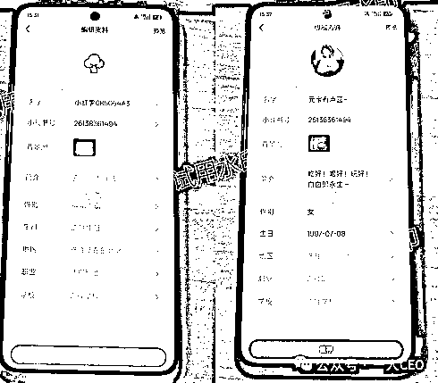
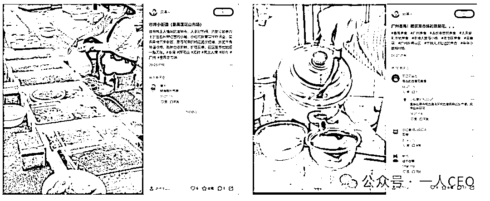
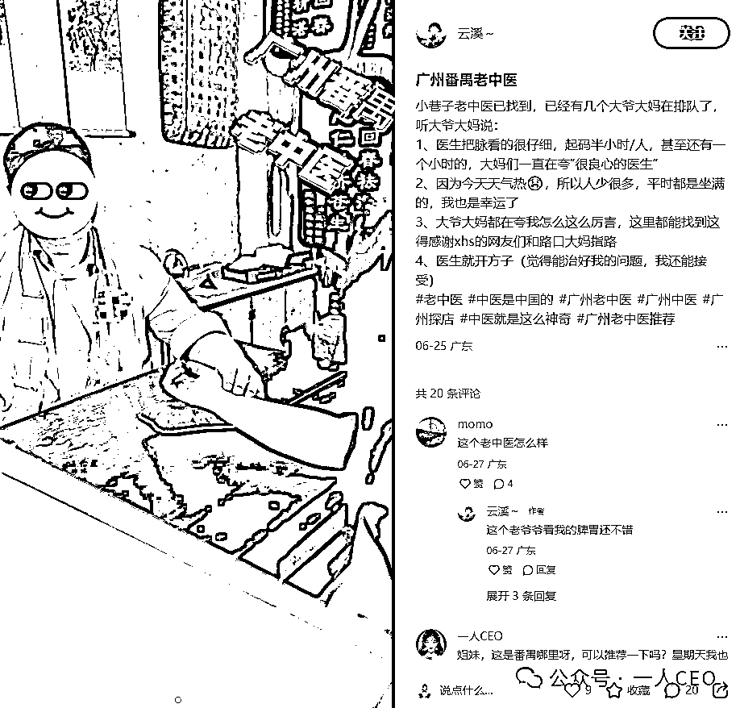
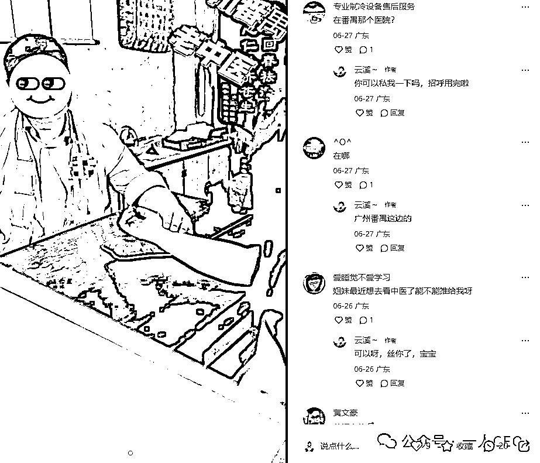
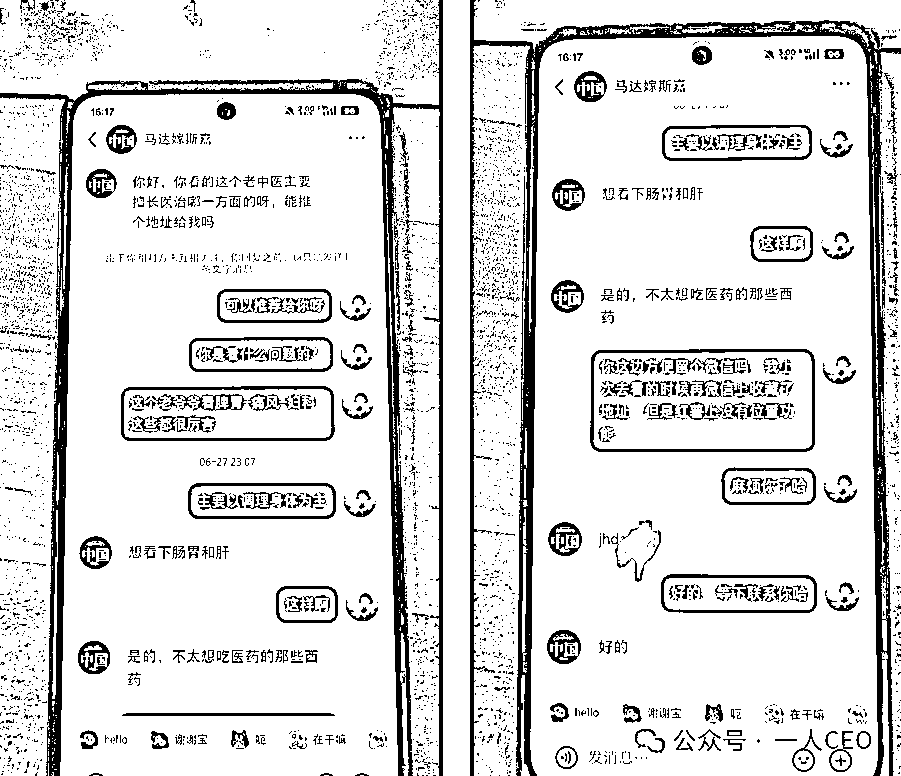

# (26 赞)小红书中医赛道引流全攻略分享

> 原文：[`www.yuque.com/for_lazy/zhoubao/vbtvg5xfcs4z0wr8`](https://www.yuque.com/for_lazy/zhoubao/vbtvg5xfcs4z0wr8)

## (26 赞)小红书中医赛道引流全攻略分享

作者： 馆主

日期：2025-07-08

生财的圈友们，晚上好，我是：馆主

生财里面目前还没有人写过这类型的文章，而我刚好是做这个项目的，前几天有几个圈友叫我到生财里面填充一下知识点，刚好今晚有时间，碎片化的复盘一下......

目前市场上小红书的中医帖子有三种形式：推荐医生（种草）、看病记录（故事片）、同行评论区截留，不管后面怎么变化，都是以这三种形式的基础扩展。

这里我使用的是素人看病经历《种草笔记》，进行引流

## **一、账号管理**

1、手机设备：刚拿到手的新机，先打开照相机，拍一下照片，10---20 张

2、网络：办理三大卡-移动-电信-联通

3、账号：三大卡注册的账号即可~

新人问题：

手机拍照需要拍什么照片吗？

答：随便拍就行了，上班的时候拍、下班的时候拍....

网络这个有什么讲究吗？

答：能使用三大卡就使用三大卡，优势比虚拟卡好很多

账号虚拟卡注册可以吗？

答：能用三大卡注册账号是最好的，虚拟卡注册的账号就是在浪费时间

一注册就是废号用专业术语来说就是：一机一号一 IP

如果我有十台手机，没有那么多三大卡呀？答：这就要使用到矩阵玩法啦！3 台手机同时连接一个移动 WiFi，效果还不错

根据我的对比大小是这样的：三大卡>移动 WiFi>虚拟流量卡

## **二、账号包装**

账号包装很关键，你是做什么不重要，但是你看起来像是做什么很重要！

好的包装可以给用户增加信任度，我观察小红书平台上，发现很多同行都懒得包装账号，就起个名字就开始做引流啦，真以为小红书的用户是傻子

这里我给大家讲解一下，不管是什么平台，账号包装永远是这三件套：头像、昵称、简介

头像：小红书是女性用户主导的平台，那么我们的头像尽量要偏向于她们，而不是随便找个抠脚大汉的头像直接贴上去，用户看见你都怕，猥琐，下头男，这是红薯平台的小仙女最喜欢聊的话题

昵称：偏向于生活类型的，不知道起什么就去抖音看看那些女孩子起什么名字，直接拿过来用即可~

简介：主要是描述你在这个平台的定位是什么，我们这里是素人推文，那么我们可以写 xxxx 日常分享，xxxx 日常记录......

官方流量卷：

小红书给每一个新用户，生日当天都默认送一张 1000 流量卷，我记得之前是直接送给我们自己使用的，现在不行了，是系统自配把这 1000 流量卷随机分配给我们的所有笔记

ps：所有我们刚拿到手的新号，把生日时间往后调 2 天，因为我们不可能当天就发引流是吧

看到这里有人会说，那这样是不是新号前几天的流量比一般的老号流量好，我说，这是肯定的

站在平台的角度出发，新用户进来平台，会有流量扶持的，如果一开始就让新用户的流量差，那这个平台就要倒闭啦，没人使用

## **三、养号**

新注册的账户三天之内，先不要轻举妄动，猥琐发育，刷笔记养号，如果不是很急，把战线拉到一个星期之后再发引流笔记

养号有两种方法：

第一种是刷同行的笔记，学习思路（适合新人）

第二种是刷日常笔记，腾出时间（适合老手）

## **四、日常笔记--地区标签**

中医赛道属于同城赛道，我们在小红书上发的引流笔记只适合附近人群，怎么说呢？

我们的门诊在广州番禺，有一个用户刷到我们的笔记，想来看，但是他在上海，而且他只是脾胃虚弱，想调理一下身体，你说，他会坐飞机从上海赶来广州番禺看病吗？而且这个脾胃虚弱随便找个中医都能治好，所以说，脱离门诊地区的人群都不是我们的用户，留联系方式跟你沟通也属于无效用户，超出正常人的范围

那么我们就要发日常笔记，带动我们的账号标签到当前门诊附近地区即可~

我们新注册的账号，属于无标签账号，我们一开始发的笔记，都是推荐分配给全国地区人群的，所以我们做垂直地区标签，围绕门诊地区附近发笔记，比如说：门诊是在广州番禺，那么我们可以发番禺这个地区的所有热点日常，然后带多一点地区话题即可

## **五、引流笔记**

目前这个赛道的引流笔记玩法有三种：A-->A，A-->B，A--->B--->C

但是目前我们还是使用最简单的第一种玩法：A--->A

就是自己发笔记自己去收客资

笔记的封面、标题、文案，这些去抄和改同行的就行了

## **六、评论区话术**

如果用户评论我们，说在哪里、在哪里，我们可以回：

你可以丝我一下吗，招呼用完啦

其实就是假装招呼用完，减少封号概率

## **七、私信套客资话术**

其实就一套公式：

1/先问问什么病

2/假装关心一下他们

3/说红薯上发不了地址，需要他们给个微信，我们加 v 然后发定位给他们

感谢大家耐心看完，本文可能对正在做中医赛道的人群合适看，但是不从业这个赛道的人，也可以了解一下，看看别人是怎么引流你的

目前这个赛道的客单价是：2000$，复购率：百分之 40

.

dg

* * *

评论区：

津渡 : 可以找小巷深处那种医术还可以，病人少的大夫 给他引流

馆主 : 我们是有自己的中医馆门诊的