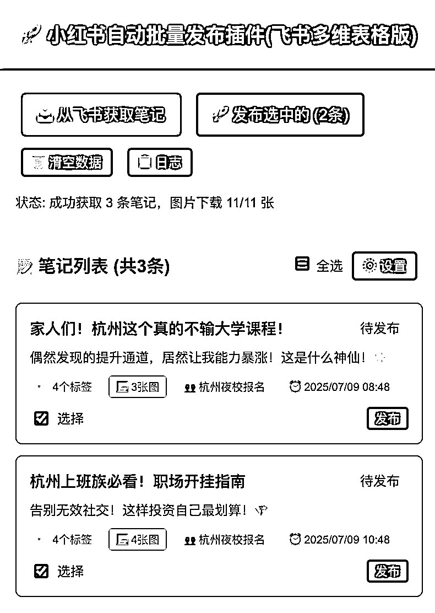

# (21 赞)小红书矩阵管理与素人分发工具方案

> 原文：[`www.yuque.com/for_lazy/zhoubao/vzge5nd72f6v8kbw`](https://www.yuque.com/for_lazy/zhoubao/vzge5nd72f6v8kbw)

## (21 赞)小红书矩阵管理与素人分发工具方案

作者： 燃烧青年

日期：2025-07-08

为了解决小红书矩阵管理+素人分发的带来的问题，我用 cursor 写了基于飞书多维表格的浏览器插件和网页
圈友们好，我在杭州做夜校，自从小红书上了矩阵，也就 15 个账号每日发布 3 条的工作量，虽然只是无脑复制粘贴（我们内容是在飞书多维表格里由兼职产出），但也觉得很辛苦...

如何分发到手机变成一个问题

调研了一波市面上的自动发布软件，基本都是基于图片文件和特定 txt 格式来实现批量导入，没有用飞书多维表格的。但飞书多维表格才是保存图文内容的神器呀！难道还要适应文件的方法？

索性自己动手！用 cursor 做了一个浏览器插件，配合比特浏览器和代理 ip 就可以在小红书网页端进行自动化发布，也集成了关联群聊和定时发布的功能，都在多维表格中设置就可以。

现在只要几分钟，每天打开比特浏览器，拉取 3 条笔记，然后批量发布就行。发布任务后，插件会自动将发布账号和发布任务时间回填到飞书多维表格中，并且标记为已发布。

上面的插件解决了自营账号自动发布的问题。
还有一部分是让素人做的分发，手机不在我们手边。如果每条笔记内容要微信转发也很麻烦。飞书可以设置发送卡片，但是就要求这些素人多下一个 app，信息回填也麻烦。就想着最好能够扫码跳转到小红书直接发布。

遗憾的是小红书没有提供自动发布的端口，所以做了一个移动端的网站，就是从飞书多维表格中拉取内容，手机端可以一键复制，发布完还可以回填发布链接到飞书多维表格。

60 岁的妈妈都学会了怎么发小红书笔记，每天开心地在我这赚点兼职钱。  images.zsxq.com/FiUvRAue_g_VIshfWeAPKxiS6joX) images.zsxq.com/FqmZeTc83cvM16m5X3oipvwo277T) images.zsxq.com/FkOIjZe-WQk45TQxjK_q3IA4tmqY)
逻辑是不难的，都是分为 3 步：根据条件筛选拉取笔记内容、图片下载+内容展示、回填信息。
用 cursor 编程 8 个月了，这是第一次做浏览器插件，克服了好多困难，也终于学会了怎么使用飞书 api，在解决问题中学果然是最快的！
有需要这两个工具的圈友可以找鱼丸链接我试用！ 不知道大家是怎么在完成这部分分发的，maybe 有更好的解决方案，也可以分享在评论区呀

* * *

评论区：

run : 小红书发布走的什么接口吗

燃烧青年 : 浏览器插件用的小红书创作平台网页端模拟点击。移动端网页没有接口，需要人工复制粘贴发布

biubiu 六月 : 牛

阿关 : 可惜比特发布流量风控了。没那么好了