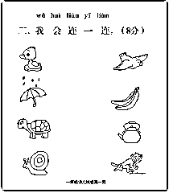
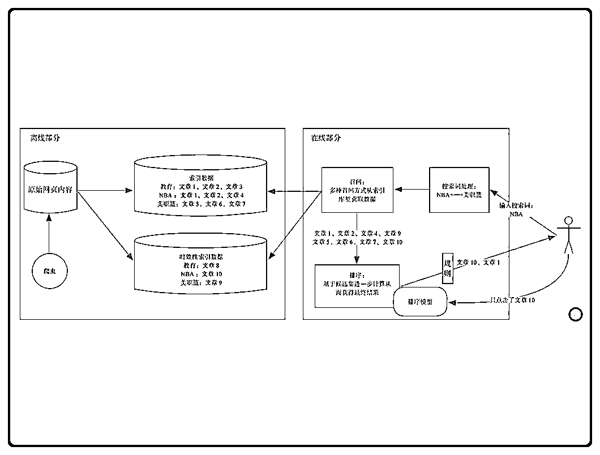

# (14 赞)公众号低质量内容破局与推荐系统解析

> 原文：[`www.yuque.com/for_lazy/zhoubao/zrsr5g8z33746xoi`](https://www.yuque.com/for_lazy/zhoubao/zrsr5g8z33746xoi)

## (14 赞)公众号低质量内容破局与推荐系统解析

作者： Aidan

日期：2025-07-07

最近在公众号中频繁遇到”文章低质量“的提示，希望找到破局方法进行的阅读和思考总结，希望能给到一些帮助。

圈友好，我是圈友 Aidan。

## 为什么会出现推荐系统

推荐系统核心是为了解决信息沟通的问题，提升信息的分发效率。

怎么理解？

纸媒时代，大部分的阅读来源于报纸、杂志、书籍。内容的分发掌握在这些纸媒渠道里，编辑觉得什么内容好，那我们就看什么内容，流行的话语权掌握在编辑手中。

进入互联网时代，内容的创作门槛大幅度降低，内容的创作不再是少数人的权利。

巨量内容的生成，带动内容分发形态的改变。

编辑无法也不能再去分发如此巨量的内容。

产生了一个新的问题。如何让合适的内容找到合适的人呢？或者说如何让用户看到他喜欢的内容呢？

推荐系统就是为了解决这些问题而出现的。

> 我们总是诟病系统推荐一些我们不喜欢的内容，事实就是系统比你更懂你。
> 
> 象与骑象人，你以为主导的是人，其实是象。

## 什么是推荐系统

推荐系统是对这个世界量化后的数据体现。

> 你站在一面镜子前面端详自己，却惊诧的发现自己的身体已被无数数据所组合：科技 10%、篮球 4%、历史 1%、自然 0.3%......

系统将用户信息数据化，用户：年龄、性别、阅读历史等等；

内容或者商品也被量化成了一组组的数据：价格、销售额、阅读量、完读率、转发量等等。

就像小学课本的连线题，题目的一端是用户，另一端是内容，推荐系统就是在两者之间连接的线。

那系统是怎么智能地将用户和内容连接起来的呢？

在解释这个问题之前，先了解下推荐系统的前身-搜索引擎。

### 搜索引擎的算法架构

推荐系统和搜索引擎在某种程度上是一样的，**没有用户数据的时候，推荐系统等于搜索算法。**

下面是一个典型的搜索引擎架构。

这个系统分为两部分：

离线部分：

离线部分专注于内容的搜集和处理。搜索引擎的爬虫系统会从海量网站上抓取原始内容，并针对搜索系统的不同要求建立不同的索引体系。

索引是一个基于关键词的序列，每一个关键词对应一长串提及该关键词的内容（倒排索引）。

比如，“教育”这个词命中内容 1、2、3，“NBA”命中了另外一批内容 1、2、4。

系统会有一系列的逻辑来给这些内容进行索引排序，假设以点击量来进行排序，”NBA“关键词下面的所有网站，点击量最高的网站索引就是 1。

在线部分

在线部分负责响应用户的搜索请求，完成内容的筛选和排序，并最终把结果返回给用户。

真实的系统架构要远比这个复杂，里面还会有很多其他的组织和模块，为了能够说明问题，我们这里就使用这个简单的系统架构来说明。

#### 经典的搜索引擎

对于经典的搜索引擎，如百度、谷歌，常见的交互流程是这样的：

搜索引擎的爬虫在整个互联网一直不停的工作，将这些搜索结果都整理到系统索引中去；

在用户输入一个搜索词后，系统会对搜索词进行分词、变换、扩充、纠错等处理，以便更好地理解用户搜索意图。

用户只输入了“NBA”一个关键词，系统发现“NBA”和“美职篮”是同义词，就会将其扩充，以便两个词都可以应用在索引的查询上。

又如，你输入了“NB2K”，系统认为你的输入有误，就会将其纠正为“NBA2K”，并首先返回相应结果。

基于用户的搜索内容，返回权重最高的几个索引结果。

根据最终用户的点击情况，系统也会修改网页的索引权重，调整结果顺序。

“红花会”这个关键词，在中国有嘻哈出来前，搜索结果最前面可能是金庸的小说；

在中国有嘻哈出来后，搜索结果最前面的几个就变成了 HIPHOP 的内容。

#### 推荐系统

回到推荐系统。

搜索引擎是极端情况下的推荐系统。

推荐系统也是由一个离线部分和在线部分组成。

所有在平台的内容，都会被平台的爬虫所收录，根据一些指标形成索引，如时间、观看量等。

在线部分，是搜索引擎和推荐系统的差异的核心部分。

使用推荐系统的程序和传统的搜索引擎存在一个本质的差异，即：不需要用户主动去搜索。

以前需要用户主动的搜索结果，现在不需要了，变成了系统自动推荐。

那用户怎么看到内容呢？

假设你是一个新的用户，新注册微博，因为系统缺少你的用户信息，它不知道你喜欢什么样的内容。

在微博的时间流阶段（没有推荐算法，所有的信息流都是以时间顺序进行展现），新注册完微博，微博会让你选择你感兴趣的领域、然后推荐一些头部的大 v 给你关注，因为这些大 v 是平台流量最好的，让你关注他们大概率能留下你。

如果你一个都不关注，那你的时间线上可能什么都没有，什么都没有的平台，怎么能留下用户呢？

于是微博决定进化，上线了一个推荐算法。

现在你注册微博，他们也会问你喜欢什么领域，来关注这些大 v，但是你不选也没事。

这个时候打开微博，你的时间线，会有一堆的内容出现，美女、军事。

手指滑动几下，根据你的停留时间、评论情况，微博猜测你可能喜欢什么内容，于是越来越多你喜欢的内容出现了。

第二天，你再打开微博的时候，整个 app 都是爱你的形状。

这——就是推荐算法的意义，一个比你更懂你的系统，一个高效的信息分发程序。

还记得前面举的例子吗？用户、内容、推荐系统就像是小学课本里的连线题，用来将内容和用户进行连接。一个好的推荐系统就是更好、更准确的连接用户和内容。

> 推荐是一个协作与进化的过程：
> 
> 对内容而言，每一个用户既是消费者又是决策者，被认可的内容得以进一步扩散，不被认可的内容则被系统纠偏，以免给更多人造成负面影响。
> 
> 对用户而言，每一次行为反馈都在不断地完善自己的数字躯体（用户画像），而系统的兴趣探索行为，也在进一步给这幅画像补充更多维度。

## 为什么你的内容总是没人看，因为你连系统这一关都过不了

回到标题，为什么你的内容总是没人看，因为你连系统这一关都过不了。

上面有介绍一个推荐系统是分为两部分，离线部分和在线部分。

你的内容想要呈现在用户面前——也就是出现在在线部分。那你的内容至少需要能过离线系统这一关，在离线系统索引中排到前列。

最近看到很多公众号提示文章低质量，有些是 ai 生成的，有些是手写的。

有些账号的文章甚至阅读量只有个位数也被提示低质量了。

就有人发出疑问，为什么我的内容全是我手搓的，也会被系统提示低质量呢？

说明在腾讯的公众号推荐系统中，离线部分加入文本的质量检测，如果你的内容在系统中判定为低质量，将无法进入到在线系统。

无关于 ai 写的还是手搓的内容。

#### 为什么乱码的内容也会获得 10 万➕的阅读

做公众号的朋友，一定看到这样的情况，一篇通篇 html 代码的内容，获得了系统的推荐，轻轻松松跑到 10 万加，而你辛辛苦苦手搓的内容，更新了一个月还是 0。

为什么呢？

在系统看来，这一篇有信息增量，值得推荐。

平台希望什么？

平台希望平台的内容更加多元化，差异化。

## 优化你的信息源

同样的工具，在提示词层面的微调，信息量并没有增加。

重复写 100 次、1000 次之后，所有的可能性都被遍历了，哪来的信息增量呢？

参考书籍：

*   内容算法：把内容变成价值的效率系统——闫泽华

* * *

评论区：

暂无评论