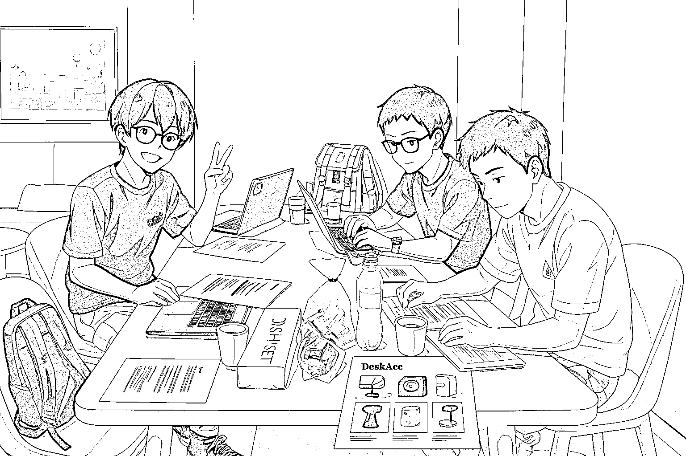

# (13 赞)共学 2.0 回顾、经验总结与 3.0 预告

> 原文：[`www.yuque.com/for_lazy/zhoubao/gbngydx2k490q1dx`](https://www.yuque.com/for_lazy/zhoubao/gbngydx2k490q1dx)

## (13 赞)共学 2.0 回顾、经验总结与 3.0 预告

作者： FanG

日期：2025-07-06

# 一、共学 2.0 回顾

继上次 7 小时组局顺利上线产品后，我们很快就安排了本次 2.0 版本的线下组局。这次活动同样设在广州，从上午 10:00 直接干到晚上 22:00，目的仍然是“何以生财，唯有实战”，迅速实操产品上线并验证需求。

这次到场一共有六人，分别是：

1 位产品经理

1 位交互设计师

3 位技术大佬

1 位流量运营

每个人都带着自己的 idea 参与现场讨论，我们希望借此方式快速敲定最终产品方向。经过沟通决定本次做一个针对之前找到的游戏站关键词（即冷门好游戏、游戏导航站等）的导航类产品

（不过，过程中发现，这样的方式可能会耗费较长时间，因此下次计划提前在群里投票决定产品，节约更多现场时间用来实操与开发。）

现场全体成员迅速装好了 Claude
code 并搭建好了开发环境。从购买域名、代码初始化，到使用 Vercel 部署上线，整个流程一气呵成，顺利完成了产品初版上线，沿用之前 1.0 版本的热词调研成果，通过 Google
Trends、Google Ads Keyword
Planner、SimilarWeb、Semrush 和 Ahrefs 等工具进一步精细化分析了目标关键词，快速验证了市场需求和用户兴趣。

为了最大程度节省时间，我们午餐和晚餐都快速地以面条和咖啡解决哈哈哈~

# 二、本次共学经验总结

提前线上确认产品方向，下次将提前在群内或飞书文档确认好产品 idea，避免线下花费太多时间讨论方向，更多的精力放在解决技术难题与现场实操上。快速搭建最小可行产品（MVP），迅速上线 MVP，立即验证市场反应，通过看数据数据来驱动进一步的产品迭代与运营推广，。

构建长期线下合作小组，逐步形成一个长期线下办公小组，彼此赋能成长，每次组局后都有清晰的复盘记录，持续提高团队的开发、设计、运营、产品调研等全方位能力。产品经理和运营成员获得了更多技术实现方面的见解和指导；而技术大佬也进一步了解了非技术因素（如市场调研与需求验证）对产品成功的决定性作用。

# 三、后续活动（3.0 预告）

我们已经规划了下一次线下组局的方向：

1.明确好主题和产品方向后，现场聚焦产品开发和功能迭代。

2.产品上线后即刻启动推广和运营，拿到真实用户反馈和市场正反馈。

3.根据新发现的问题，为 4.0 版本的组局进一步明确主题和需求。

下次组局的目标是更难更具挑战性的任务，并且会做更多的前期准备，进一步提高效率和成果质量！

**特别感谢此次的两位分享官 @加加林 和 @八两：**

**加加林的技术分享可前往飞书查阅实操记录：**

**飞书分享链接：**[`mhjvdevgc5.feishu.cn/minutes/obcnhr9sl3351222x7257hm3`](https://mhjvdevgc5.feishu.cn/minutes/obcnhr9sl3351222x7257hm3)

（此次分享只有后半段流程，前半段没保存好，看看有多少感兴趣的小伙伴反馈，再提供更加全面详细的版本。）

**此外，我们整理了一些高效工具推荐给大家：**

Google Trends

Google Ads Keyword Planner

SimilarWeb

Semrush

Ahrefs

**感谢此次线下活动，收获很大 ，很开心，好了继续搞产品，再见** images.zsxq.com/FtLtxpahNHWq6ASSIsLKJvDnW0d6)

**  **

* * *

评论区：

王珣 : 文档木有权限

FanG : 已开 已解决

叶落影 : 有趣

FanG : 可以看广州后续聚会海报，如果想提前联系也可以找鱼丸加我