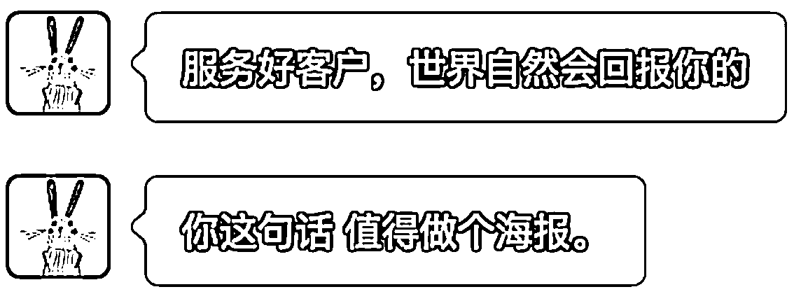

# (精华帖)(453 赞)ChatGPT-o3 画图能力及使用技巧揭秘

> 原文：[`www.yuque.com/for_lazy/zhoubao/gzvi5ydor42u6omh`](https://www.yuque.com/for_lazy/zhoubao/gzvi5ydor42u6omh)

## (精华帖)(453 赞)ChatGPT-o3 画图能力及使用技巧揭秘

作者： 刘小排

日期：2025-06-28

大家好，我是刘小排，好久不见。

在最近的一条超级标「[超级标 06 - ChatGPT-4o 带来的图像革命](https://t.zsxq.com/kqB5u)」中，我们见识到了 ChatGPT-4o 做图的威力。

可是你知道吗，ChatGPT-o3 是画图之王，ChatGPT-4o 并不是。

如果给 ChatGPT-4o 的画图能力打 90 分，那么 ChatGPT-o3 我们可以给到 95 分 —— 大部分情况下都一样，但还有一些场景，o3 能做更多。

实际上，ChatGPT-o3 和 ChatGPT-4o，画图的时候，背后调用的是同一个模型，叫做 GPT-image-1。

那为什么使用 ChatGPT-o3 和 ChatGPT-4o，画图能力会有不同呢？

因为 ChatGPT-o3 是一个 Agent，而 ChatGPT-4o(暂时）只是单模型。

ChatGPT-o3 作为一个 Agent，它可以调用很多工具，包括网络搜索、自己写代码并执行代码进行预处理、到网上去下载参考图片来预处理、到网上去下载合适的字体、直接使用你传给它的字体、不断进行自我反思……等等。

用 ChatGPT-o3 来画图，它的「施法前摇」很长。而当它「前摇」完成，会自动再去调用 GPT-image-1 来做图，出来的效果会非常惊艳。

**这篇文章我在我的公众号也发了，但是在生财，你看到的是加强版！** 我补充了更多的案例图，还会给出使用技巧、示例提示词。 让我们开始吧！

**使用 o3 画图的技巧**

**  **

要点如下。

**  **

1.**给到足够多的背景信息，不怕长** 。如果嫌麻烦，你就用语音输入。 如下面的案例一，请仔细看我的提示词 —— 不复杂，但是把背景交代得很清楚。再看在下文的案例二中，为了做我的公众号的视频封面，我把公众号全部信息都复制进去了。

2.  **给到需要融入的元素，用文字和图片形式均可** ！ 你可以注意到，下面每个案例，每个我都给了融入元素，要么是电影海报，让 o3 自己去找，要么我直接贴上朋友的微信头图。

3.  **提示 o3 到互联网上去搜索需要用到的中文字体** ，或，你上传字体让它使用。

4. 对于需要提前预处理的内容，**请大胆要求 o3 调用工具**  ，尤其是「上网搜索」和「写代码并执行一些预处理操作」这两个重要的工具。例如案例一，我让 o3 去找电影海报，处理后，进行做图。

5. 如果需要用到**人物照片** ，请务必提示 o3，要做**卡通化或其他风格化的预处理** ！否则出来的写实人物，不太容易像真人，不好看。

**示例提示词**

下文案例一

> 我要你画一个短视频头图海报。你到网上去搜林悦己的照片，搜索到以后可以找我确认。然后你找到花木兰和钢铁侠的电影海报，把林悦己的脸换上去。注意，给我的结果要做 ghibli 风格转化，让用户能看出来是钢铁侠和花木兰关联后要非常和谐和可爱。我需要你在同一张图上表现出来，图片的比例是 9:16。 文案是：我是钢铁侠还是花木兰？

下文案例三

> 帮我做一个非常厉害的 iPhone 锁屏壁纸。
> 
> 主题是：你今天拷问自己什么是 MVP 了吗？你可以上网搜索和下载非常好看的中文字体。
> 
> 下图是我朋友彩笺的微信头像，请结合它的风格。
> 
> 对了，请你一口气做 3 张，我选一选 【注意：上面只是文字，你还要记得把图发给 o3 喔】

接下来，我们展示几个案例

**案例一：林悦己的视频头图，林悦己到底是花木兰还是钢铁侠？**

背景：林悦己要做一个视频，需要一个视频封面。

这个图，我们同时需要融合以下元素：林悦己自己的形象、钢铁侠的形象元素、花木兰的形象元素。这就是一个非常适合 o3 的场景。

我可以让 o3 自己去网上找到林悦己的照片、钢铁侠电影的海报、花木兰电影的海报，然后自己写代码融合，最后再画图。

同时，我还建议 o3 自己去网上找一个漂亮的中文字体。如下图所示

成品如图

ChatGPT-o3 还给出了总结。如果我需要，我还可以继续让它打磨细节。

# **案例二：我的公众号配图**

# 如果我需要给我的公众号文章「你可能还不知道，ChatGPT 可以每天给你上奏折」配图，应该怎么办呢？

# 方案类似，只需要把文章全部复制给 ChatGPT-o3，给它足够多的信息，它可以自己决定要使用的标题、界面元素，然后自己卷自己。如下图所示

成品如图，每个都很好。 （最后我们选择的是第一个）

!

# **案例三：帮别人做海报、锁屏壁纸**

# 朋友突然在群里想做一个锁屏壁纸，提醒自己一些事情。我们可以用同样的方法。不同之处是：

我想要用上朋友的微信头像元素。那么，我们简简单单把他的微信头像发给 o3，就可以了。这是它的头像

这是我给 ChatGPT-o3 的 Prompt

下面是成品。可以看到，ChatGPT-o3 完美的学习和融入了朋友的微信头像元素！

注意看，它并没有在直接复制头像图片，里面的卡通角色的姿势是完全不同的。

用同样的方式，我还帮其他朋友做了锁屏壁纸和海报，

例如，有朋友聊天的时候，说有一句话值得做海报

那就做吧！带上她的头像图！（点击图片可放大查看！）

​

# **

**

# **

**

# **案例四：恶搞朋友**

# 有一位不愿意透露姓名的朋友，向我炫耀他刚刚拍的身份证证件照。

竟然还有这么好玩的事，那我们就让 o3 玩玩他吧！！ 🤭

# 常见问题

# **画图，ChatGPT-4o 也能做吧？**

答：大部分可以，但是 ChatGPT-4o 没有 ChatGPT-o3 做得好。文章开头已经讲过原理了，你可以试试同样的 Prompt，尤其是难度比较大的情况下，它们两者的表现。_

# **为什么我的 ChatGPT-4o/o3 出现的中文是乱码？**

# 答：你可以要求它自己去下载中文字体，甚至，你把你电脑上的字体文件上传给它，让它直接使用。_

# **ChatGPT-o3-pro 如果用来画图，是否能够做得更好？**

# 答：很奇怪，实测发现，o3-pro 竟然不能画图。目前是 o3 最好。_

# **小排哥，你可以帮我做图吗？**

# 答：看缘分。_

* * *

学会了吗？

你还想到哪些厉害的场景可以让 o3 去尝试呢？

欢迎在评论区晒出你的厉害图片！我们一起交流！

😄

* * *

评论区：

E4HH : 前排

醉妖 : 哇塞，好细啊，小排老师辛苦

陈伟杰 : 小排老师讲的通俗易懂，很细节！！

斯斯超 nice : 好厉害的老师

折腾 boy 程泽 : 前排

跑通小闭环✅ : 只能点赞啦，膜拜[强][强][强][强][强][强]

Claire : 前排

高超 : 学到了🤓熬夜党狂喜