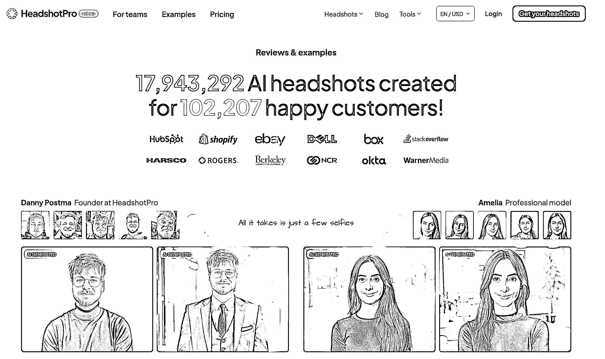
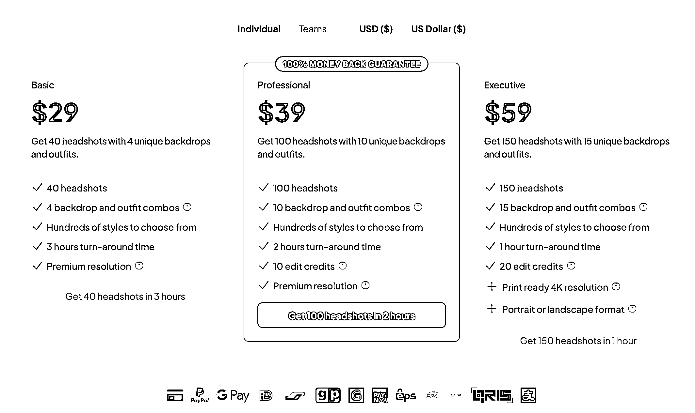
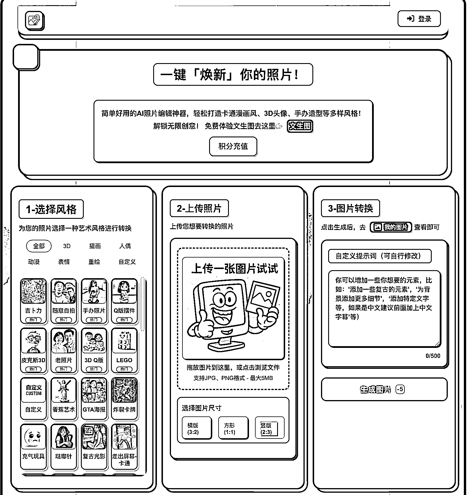
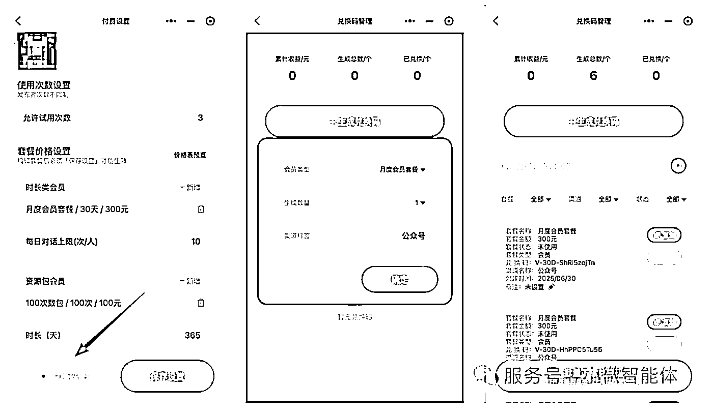

# (精华帖)(179 赞)普通人 AI 掘金的两种模式与路径

> 原文：[`www.yuque.com/for_lazy/zhoubao/regm9tgnzbbrysp7`](https://www.yuque.com/for_lazy/zhoubao/regm9tgnzbbrysp7)

## (精华帖)(179 赞)普通人 AI 掘金的两种模式与路径

作者： 小查

日期：2025-07-02

## **1.AI 图像生成，让普通人也能掌握创作主动权**

GPT-4o 发布后，我最大的感受是：AI 图像生成，这个曾经需要专业技能和昂贵软件才能玩转的领域，现在彻底成了咱们普通人的“免费午餐”。

过去，一张商业海报、一个产品 Logo，动辄几百上千。现在，你只需要对着手机说几句话，AI 就能在几分钟内“吐”出几十张风格各异的专业级作品。它把创作的门槛，几乎从珠穆朗玛峰降到了你家门口的台阶。

你还记得吗？二十年前，很多人看不懂淘宝，结果错过了电商时代；五年前，很多人看不上短视频，结果错过了流量红利。历史总是在重演。

AI 图像这波浪潮，不再是少数极客的自嗨，而是指名道姓给咱们这些“没背景、没资源，但有执行力”的普通人准备的新机会。
如果此刻你还在观望，错过的可能不是一个风口，而是一个能让你弯道超车的时代。

问题来了：风口就在眼前，我们怎么才能抓住？普通人真能靠 AI 搞到钱吗？

答案是肯定的。但关键在于，你不能只当一个刷图点赞的“消费者”，而要成为一个下场掘金的“淘金者”。

市面上的 AI 玩法很多，但经过我反复对比和拆解，最终锁定了这两条路。它们是目前看来，确定性最高、最适合咱们普通人快速上手的 AI 变现路径，手把手带你少走弯路，直接开干。

路线图很清晰：

*   **模型一：“卖铲人”模式。** 打造一台 7x24 小时帮你收钱的“AI 赚钱机器”（网站/小程序），做的是复利生意，天花板极高。

*   **模型二：“淘金者”模式。** 直接用 AI 做图、做内容卖钱，主打一个“零成本、见效快”，当天上手，当天就能看到收益。

接下来，我们把这两种模式掰开揉碎，配上全球爆款案例和国内落地玩法，保证你看完就能上手。

## **2.模型一：“卖铲人”——打造一台不下班的 AI 赚钱机器**

这条路，玩的是什么？

说白了，这条路就是不自己下场“淘金”，而是给所有“淘金者”提供最高效的“铲子”。

你不再是一张张地卖图，也不是靠信息差或体力赚钱。你的核心是打造一个产品（网站或小程序），把某个 AI 能力封装进去，让成千上万的用户付费自助使用。你需要解决的，只是一个非常具体、非常刚需的小问题，比如“AI 生成商务头像”、“AI 老照片修复”、“AI 智能证件照”等等。

这个模式最迷人的地方在于两点：**一是“规模化”，二是“极低的边际成本”** 。

前期你把产品打磨好，一旦上线，服务 10 个用户和服务 1000 个用户，你所需要投入的时间和精力几乎是一样的。它就像一台你亲手打造的印钞机，一旦开动，就能 7x24 小时为你工作，带来真正的复利增长。
门槛确实比直接卖图高一点，但它的想象空间和长期价值，绝对值得你下功夫深挖。

拆个案例给你看：HeadshotPro.com 如何年入百万美金

为了让你看得更明白，我带你拆一个全球最火的案例——HeadshotPro.com，一个专门用 AI 生成专业商务头像的网站。

*   **它解决了什么痛点？** 传统拍商务照，**贵、慢、还麻烦** 。去影楼动辄上千块，预约排期加修图得一两周，很多人还有镜头恐惧症。

*   **它的解决方案有多绝？** HeadshotPro 直接把价格打到传统摄影的 1/8，2 小时内交货，给你上百张备选。你只需要上传几张生活照，AI 自动搞定一切，效果跟影棚精修没区别。“又快、又好、又便宜”，完美击中用户爽点。

*   **它怎么赚钱？** 模式简单粗暴：29 美元买断 40 张头像，团队购买还有套餐优惠。对比几百美元的摄影费，这个价格让几乎所有人都没有决策压力。目前平台已经服务超 10 万用户，流水百万美金级别。

*   **流量从哪来？** 50%来自 Google 搜索（SEO），37%来自老客户口碑推荐。这说明什么？**只要你的产品真正解决了用户的痛点，流量会自己找上门。**

别光看，手把手教你在国内怎么干

看到这里，很多人可能会有一个现实的疑问：国外用户付费意愿高，这个模式在国内真的行得通吗？

这个问题问得很好。我们确实需要做一个**“本土化适配”** 。

国外案例的价值，在于向我们证明了这是一个真实存在的、能赚钱的市场。而国内市场虽然付费环境没有那么好，但不代表没有机会。已经有不少人开始尝试在做了，比如下面我找到的一个真实案例 photo.ideafactorys.com。

我们的打法，不是去追求做成一个像 HeadshotPro 那样大而全的平台，而是去寻找一个**“小而美”的切入口** 。

下面，我把在国内从 0 到 1 上手的路径给你重新梳理一遍，**第一步，也是最重要的一步，就是找需求。**

**（1）第一步：找到你的“流量密码”——去追逐市场已经验证的需求**

做 SaaS 工具，最忌讳的就是“我觉得用户会喜欢”。你要做的，是去找到那些已经被市场吼出来的需求，然后用 AI 把它产品化。

怎么找？答案是：**去流量最火爆的地方“偷”灵感。**

*   **案例一：蹭热点，做“吉卜力风”头像生成器。**

你还记得前段时间全网刷屏的“吉卜力风格”滤镜吗？小红书、抖音上很多人并不能第一时间用上国外大模型，都在求教程、找工具。这时候，如果你能迅速上线一个“一键生成吉卜力风头像”的小程序，哪怕只收费 1 块钱，靠着巨大的流量缺口，一天也能轻松赚几一笔。

*   **案例二：追潮流，做“Labubu 合影”生成器。**

最近潮玩圈的顶流是谁？Labubu。想象一下，如果你做一个工具，让用户上传自己的照片，就能生成一张和 Labubu 的亲密合影，发到社交平台去炫耀。这个需求有多大？你只需要去小红书搜一下，看看有多少人在求 P 图，就知道了。

**核心方法论就是：** 紧盯小红书、抖音、微博的热搜榜，看大家在为什么样的图片和视觉风格而疯狂。一旦发现苗头，你的产品方向就有了。**我们不是在创造需求，我们只是在用 AI，更高效地满足一个已经存在的需求。**

**（2）第二步：技术和成本？在 AI 时代，这些都不是门槛**

当你找到了一个明确的需求之后，我们再来谈技术和成本。

在今天，这俩已经是最不成问题的问题了。

*   **技术怎么解决？** 你根本不需要懂代码！Cursor、Trae 这些 AI 编程助手，就是你的“全天候技术合伙人”。你用大白话告诉它：“帮我做一个上传照片、生成图片的网站”，它就能把代码给你写好。

我在调研这个课题时就看到一个很好的例子，作者也是用 vibe coding 的方式，做了一个图片生成的网站，搭配了各种风格可以选择，采用积分制的方式变现。

*   **成本怎么算？** 你的生意，本质上就是一道数学题：“**用户单次付费金额 >单张图片 API 成本** ”。只要你把握住这条，项目才有真实的赚钱空间。

目前，市面上主流的 API 选型路径，主要有两种：

**方案 A——追成本极致的“游击战”打法**

*   第三方 API 平台：比如 api.tu-zi.com、kie.ai，圈友书虫的 apicore.ai 这些第三方服务，直接付费买他们的 API 调用额度。

*   优点： 接入方便，谁都能用，不用自己部署。

*   缺点： 稳定性依赖于第三方平台，要小心“跑路”风险。

**方案 B——要做长线就得走“正规军”路线**

*   官方 API：比如 Ideogram.ai 官方的 API 接口等。

*   优点： 稳定合规、长期项目可靠，适合规模化正规运营。

*   缺点： 成本比游击方案高，早期起量时压力会大些。

如果你还在项目验证期、想压低试错成本，建议可以先用“游击战”策略、灵活迭代。等生意跑通、日活上来以后，再考虑用“正规军”方案，确保业务长期稳定发展。这样既能快启动，也能留出后路，风险收益比最好。

**（3)终极打法：用 Coze+小微智能体在微信小程序里搭建“MVP”，跑通了再 Allin**

当你有了“吉卜力风头像”这个绝妙的想法，并且也选好了 API 之后，最容易犯的错误就是：**立刻找人开发网站或 APP。**

因为在你投入真金白银之前，那个所谓的“需求”还只是你的一个假设。虽然现在 vibe coding
开发网站的成本也不高，但我们能不能用更便捷的方式去验证一下需求是否真的有人付费？

这里介绍一个方法，**用 Coze 搭建“大脑”，用“小微智能体”搭建“身体”，用最低成本在微信生态里跑通一个完整的商业闭环。**

**第一阶段：花半小时，用 Coze 搭建一个可用的产品原型**

在 Coze 里，你不是在写代码，而是在搭乐高。通过拖拽不同的“节点”，你可以构建出强大的工作流。

比如你想做一个 labubu 合影的案例，你可以：

*   用**“开始节点”** 让用户上传图片。

*   用**“问答节点”** 给用户提供选项（比如不同的风格）。

*   用**“画板节点”** 把用户上传的图片和你的素材（比如头像框）合成在一起。

*   用**“输出节点”** 把最终的图片返还给用户。

通过这样一套工作流，你就在半小时内，把一个想法，变成了一个真实可用的产品。

**第二阶段：花十分钟，用“小微智能体”把原型变成小程序**

你的产品原型做好了，但它还在 Coze 里，用户怎么用？

这里就要用到关键的连接器——**“小微智能体”** 小程序。你只需要在 Coze 后台把你的智能体发布成 API，然后在“小微智能体”里进行一次授权，它就能**“秒变”成一个功能完整的小程序**
，自带分享、付费等功能。

**第三阶段：设置兑换码，跑通你的私域变现模式**

最关键的一步来了：怎么收钱？

“小微智能体”提供了一套天才的**“兑换码”变现机制** 。你可以在后台设置付费套餐（比如 9.9 元=100 次使用权），并上传你的个人微信二维码。

整个变现流程是这样的：

1. 用户在你的小程序里用完成免费试用次数。

2. 系统弹出付费提示，并展示你的微信二维码。

3. 用户添加你为好友，直接微信转账 9.9 元给你。

4. 你在后台生成一个兑换码，发给用户。

5. 用户在小程序里输入兑换码，获得 100 次使用权。

这个模式的精髓在于：

*   **零抽成：** 钱是实时、直接到你账上的，没有中间商赚差价。

*   **沉淀私域：** 每一个付费用户，都成了你微信里的好友，方便你后续进行二次触达和复购。

**第四阶段：精准投放，验证真实需求**

现在，你拥有了一个功能闭环、付费闭环的小程序。拿着这个小程序的二维码，去小红书、抖音、微信群里，找到那些求“吉卜力风 P 图”的人，把你的工具甩给他。

接下来，你需要验证的就是：

*   到底有没有人愿意用？

*   用完之后，到底有没有人愿意加你微信、付 9.9 元？

如果在几天内，有 10 个人加了你，付了钱。那么恭喜你，**你用几乎为零的成本，验证了一个真实存在的、能赚钱的市场需求。**

这时候，你再考虑投入更多资源，把这个小程序做成更独立的网站，或者开发更完善的功能。因为你后续的每一步，都踩在了坚实的地板上。

**总结一下这个套路：**

**用 Coze 工作流搭建产品原型- >用“小微智能体”生成小程序->用兑换码模式跑通私域变现->需求被验证后，再考虑放大投入。**

这才是普通人做 AI 项目，风险最低、成功率最高的路径。

## 模型二：“淘金者”——把你的创意变成即时收益

这条路，又玩的是什么？

如果说“卖铲人”模式是建一座自动化金矿，那“淘金者”模式就是**直接下场，用 AI 这把神兵利器，从河里捞金沙。**

这条路不碰任何复杂的技术。你的核心就是一件事：**让 AI 成为你的“创意生产力工具”，疯狂生成各种有市场需求的图片、设计稿、内容，然后直接上架到各大平台卖钱。**

它的优点极其诱人：

> *零门槛：*不需要任何代码知识。

> *   低成本：*只需要一个 AI 绘画工具的账号。

> *   见效快：*今天上手，最快今天就能出单。

这条路，特别适合想快速赚到第一桶金、或者想用副业试水 AI 领域的新人。

国外大神怎么玩？拆解 Etsy 两大爆款流派

想看这条路能玩多大，我们直接去全球最大的 AI 数字产品交易市场 Etsy 上取经。我帮你总结出了两个最主流、也最容易模仿的爆款流派：

**流派一：“大力出奇迹”的工厂型打法**

核心玩法是不追求单品爆款，而是用海量的 SKU（商品链接）淹没对手。今天流行黏土风，就上 500 个黏土风素材包；明天流行赛博朋克，再上 500 个赛博朋克素材包。靠极致的数量覆盖各种小众关键词，总有一款能被用户搜到。

定价策略是单品定价极低，比如 1-2 美元，然后用 9.9 美元的“大打包”套餐诱导冲动消费。

怎么找到它们？你现在就去 Etsy 搜索“AI art bundle”或“clipart mega
pack”这类关键词。你会立刻看到海量的店铺，它们的名字通常包含“Digital”、“Art”、“Factory”等词，主打的就是一个量大管饱。

**流派二：“小而美”的精品 IP 打法**

核心玩法是不追求数量，而是死磕一个垂直风格或场景，把自己打造成这个领域的专家 IP。比如，只做“北欧极简风的婴儿房装饰画”，把这个风格做到极致。

定价策略是单品定价高，5-15 美元一张。用户买的不仅是一张图，更是对你这个品牌审美和调性的认可。

怎么找到它们？你再去 Etsy 搜索“custom pet portrait”(定制宠物肖像)、“nursery wall art”(婴儿房墙画) 或“boho
digital print”(波西米亚风数字版画) 这类极其细分的关键词。你会看到很多店铺，它们通常只有几十个商品，但每个都风格统一、主图精美、好评如潮。

国内怎么落地？在红海中找到你的蓝海刀法

国外的玩法看明白了，我们回到国内。最适合新人快速上手的两个平台，就是闲鱼和小红书。

但我知道你肯定会问：**现在去闲鱼、小红书搜“AI 头像”，已经是一片红海，我一个新人进去，凭什么能卖得出去？**

你问到点子上了。

如果你现在还只是简单地做“黏土风”、“迪士尼风”头像，那基本就是炮灰。真正的机会，不在于下场去做和别人一模一样的事，而在于找到你的**“差异化优势”**
。AI 工具是公平的，它给了每个人同样的画笔，但你能画出什么样的画，卖给谁，这才是拉开差距的关键。

我给你提供三个在红海中杀出一条血路的刀法：

**刀法一：找准“需求交叉点”，不做大而全，只做一个小而精的场景。**

不要卖“AI 头像”，要卖“**为 XX 人群/场景定制的 AI 头像** ”。把两个或多个需求叠加，创造出一个全新的蓝海市场。

*   举例 1： “AI 头像”是红海，但“AI 情侣国风毕业季纪念头像**”就是蓝海。你服务的不再是所有人，而是“即将毕业的情侣”这个极其精准的人群，他们有极强的付费意愿。

*   举例 2： “AI 宠物画”是红海，但“把你的猫画成中世纪骑士的 AI 油画**”就是蓝海。你提供的不只是一张图，而是一个有趣、能引发社交炫耀的“梗”。

**怎么找？** 去小红书搜“求 P 图”、“求大神”，看大家都在为什么样的场景和组合而狂热，那里就是未经开发的金矿。

**刀法二：打造“风格信息差”，不做烂大街的，做第一个吃螃蟹的人。**

大部分人还在用国内别人玩剩下的风格，但你可以去**全球 AI 艺术家的前沿阵地“偷”灵感** 。

*   具体操作：*打开 Midjourney 的社区展示（Community Feed）或者 sora 的主页，按“Top”或“Rising”排序，去看全球顶尖的玩家在生成什么样的风格。当你看到一种画风，让你觉得“卧槽，牛逼”，但国内还没人做的时候，立刻把它“汉化”过来。

*   举例：* 也许是“复古蒸汽波”风格的城市夜景，也许是“暗黑哥特风”的婚礼照片。你只要比别人快半步，就能吃到最大的一波红利。**你做的不是产品，是信息差。**

**刀法三：提供“超预期服务”，产品可以被模仿，但体验无法复制。**

当产品同质化的时候，服务就是你最强的护城河。

*   举例 1： 别人都说 24 小时内交稿，你主图上直接打上“1 小时急速出图，超时退款**”。对于急性子的用户，这就是必杀技。

*   举例 2：* 别人只给一张头像，你多送一张配套的、同样风格的手机壁纸。这个小小的“赠品”，能让你的成交转化率高出一大截。

*   举例 3：*把客户的返图和好评，精心设计成一篇篇小红书笔记，并@客户。这既是你的内容素材，也给了客户极大的情绪价值，他会更乐意帮你宣传。

**总结一下：**

在闲鱼和小红书，不要再傻傻地跟风卖“AI 头像”了。用**“需求交叉”** 找到你的精准人群，用**“风格时差”**
打出你的独特性，再用**“超预期服务”** 构建你的口碑。这三把刀，任何一把都足以让你在红海中脱颖而出。

## 4.总结：你的 AI 掘金之路该如何选择？

下面用一张表格，帮你一目了然看清“AI 工具服务”与“AI 商品售卖”两种赛道的核心区别，让你能立刻找到最适合自己的模块：

| 维度 | AI 工具服务（卖铲人） | AI 商品/数字商品售卖（淘金者） |
| 投入成本 | 前期投入较高（开发/API/运营） | 几乎零成本（只需 AI 工具账号） |
| 技术门槛 | 有一定技术要求（部署/搭建） | 无需代码，操作简单 |
| 变现模式 | 自动化、规模化收款 | 单次交付，靠爆款/批量走量 |
| 收益潜力 | 上不封顶，收益可持续 | 收入见效快，但高度依赖平台流量 |
| 运维难度 | 需长期运维、升级、客服 | 后期几乎无维护 |
| 门槛适合人群 | 有基础/想高阶/团队协作 | 零基础个人/快速试水/副业首选 |
|  |  |  |
|  |  |  |

|  | 怎么选适合自己的路？这里有一份最实用的建议清单：

• 如果你有一定的技术基础（比如会 AI
编程或愿意折腾 AI 工具），想挑战高天花板、打造属于自己的自动赚钱产品，可以重点考虑“SaaS 工具服务”路径。即便是个人开发，也可以先用 Coze 等平台搞出简单 Demo，边学边做。

•
如果你手头预算有限、时间碎片、最想要立马进场尝鲜，就从“AI 商品售卖”入门。用平台流量带来第一批订单，几乎没有试错成本，边玩边赚，适合所有人——尤其适合有审美、有想法或者想做副业的朋友。

• 创作能力强的同学，可以主打精品高溢价路线，出口转内销，高溢价卖向全球。技术小白建议前期抱紧平台（小红书、闲鱼、Etsy），靠内容和用户反馈快速积累经验。

• 资金宽裕、愿意长期深耕，可以双线同时投入，前期做商品快速回本，后期发力 AI 工具打造护城河。

#### 结语：现在就上路，可能的赢家其实就是你！

不要等，不要观望，从 0 到 1 的门槛已经被 AI 彻底打碎。你只需要迈出第一步，不需要完美的计划，也不需要复杂的技术——试试，从用 AI 生成几张图片、发到闲鱼或小红书开始，感受第一张“躺赢”订单的快乐。

更进一步，借助 Coze、小微智能体等工具，试着做一个自己的 AI“卖铲人”产品，把你的想法扔进市场试一试，做一次需求变现的验证。

AI 图像革命的大门已经打开，机会属于敢于先行动的人。普通人也能利用新时代红利，开启属于自己的“无门槛掘金之路”。行动，就在此刻，预祝各位圈友都能把握住这次技术革命带来的红利。

* * *

评论区：

江野 : 我去！认知好高，讲的很透好有深度

小查 : 知识星球排版有点一言难尽，而且编辑功能体验很不好，尝试修改没能成功。
为方便阅读，大家也可以移步飞书查阅这个排版更好的版本：[`wosa79zedo.feishu.cn/wiki/Ry0jwCxlJiqliCksyOncoFwZnDc?fromScene=spaceOverview`](https://wosa79zedo.feishu.cn/wiki/Ry0jwCxlJiqliCksyOncoFwZnDc?fromScene=spaceOverview)

风益 : 我去！大神！

亦仁 : 写的很好 但下次不要用 ai 写了。

rampageJ : 醍醐灌顶

廖望 : 这个流程很实用：用 Coze 工作流搭建产品原型->用“小微智能体”生成小程序->用兑换码模式跑通私域变现->需求被验证后，再考虑放大投入。

哲学工作室 : 这都被识别出来了呀

小黄快跑 : 分隔符，“让 Ai 更好的理解结构”