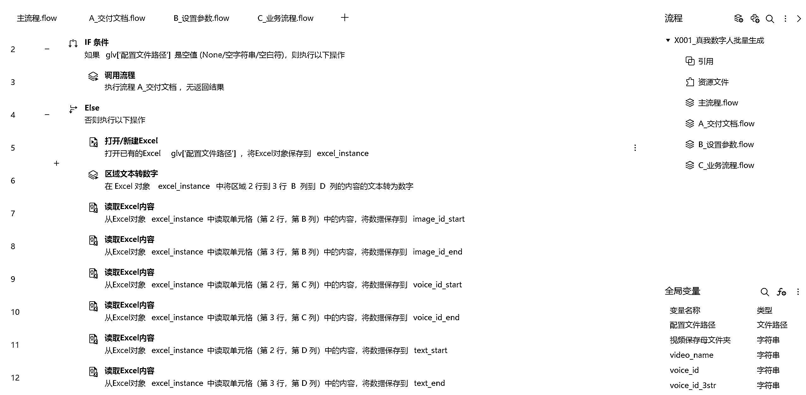
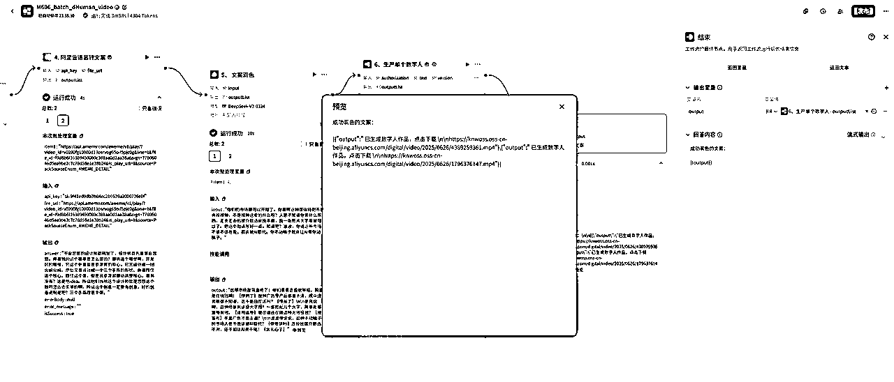

# (24 赞)一键批量生成专属口播数字人视频

> 原文：[`www.yuque.com/for_lazy/zhoubao/yhf8vrzzasil0zyd`](https://www.yuque.com/for_lazy/zhoubao/yhf8vrzzasil0zyd)

## (24 赞)一键批量生成专属口播数字人视频

作者： 新侠

日期：2025-07-04

短视频数字人工具相信大家都多多少少接触过，但缺点是你每次都需要繁琐的在网页或者软件上填入各种信息。

如下数字人合成界面，至少需要 7-8 步才能完成一个口播视频的生成，当然对于 99%的用户来讲已经足够方便，但对于我这种矩阵型选手，从来思考的都是：有没有一键批量的方式。

要实现一键批量，其实有两个选择

RPA，设置好相关参数，让影刀去帮你在网页操作

工作流，开发出相关接口，利用工作流批量执行

我首先尝试了 RPA 方案，效果也是 ok，但就是运行的时候电脑放在那里不能动，对于我这种常年在外出差只带一部笔记本的人来说还是太不方便了。

不得已我又要求技术把数字人的 API 接口开发出来。

利用 API 我制作了 coze 插件，并且用 coze 搭建一个一键生成自己形象的数字人智能体，最终实现一键批量生成 100 个自己专属形象和声音的数字人视频。

可实现功能

*   克隆自己的专属音色

*   文本转语言（使用克隆音色或公共音色）

*   克隆自己的形象，支持动态场景

*   生成对口型数字人（支持克隆形象和公共形象）

*   批量提取多条链接文案，二创后生成数字人

*   查询音色 id 和形象 id（7/2 新增）

> 目录
> 
> 零、搭建思路
> 
> 一、语音克隆工作流
> 
> 二、形象克隆工作流
> 
> 三、获取音色和形象 id 工作流
> 
> 四、数字人视频工作流
> 
> 五、一键批量工作流（案例）
> 
> 六、其他一键批量思路

本文较长，但入手难度不高，以下正文，enjoy~

[`jinhuaclub.feishu.cn/wiki/ZIChw1kntiOqIpkNH8Dc4j9SnpP?from=from_copylink`](https://jinhuaclub.feishu.cn/wiki/ZIChw1kntiOqIpkNH8Dc4j9SnpP?from=from_copylink)

* * *

评论区：

珊瑚虫 : 有做完之后生成出来的成果展示吗？效果如何？

叶凌尘 : 好物是可以用的么

新侠 : 什么？

叶凌尘 : B 站好物，可以用这套工作流么

新侠 : 要看你的具体业务流程