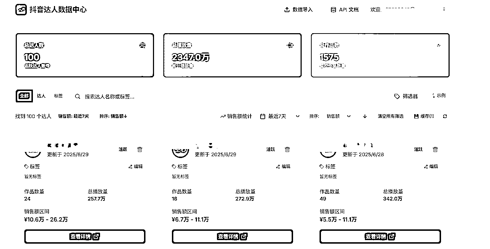
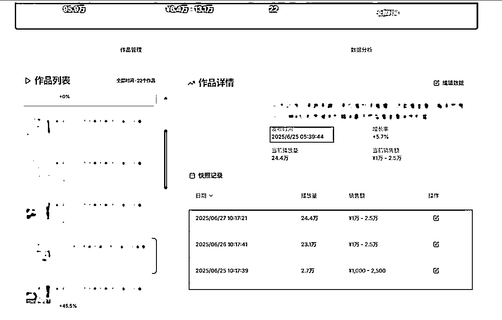

# (16 赞)AI 编程开发抖音达人数据快照平台经验

> 原文：[`www.yuque.com/for_lazy/zhoubao/vxxrfxhqh3brl0zv`](https://www.yuque.com/for_lazy/zhoubao/vxxrfxhqh3brl0zv)

## (16 赞)AI 编程开发抖音达人数据快照平台经验

作者： 涛涛

日期：2025-06-29

本篇文章：

1.分享利用 AI 编程工具，快速构建并上线一个实用工具网站的全流程经验

2.探讨如何为数据采集类业务设计直观的展示方案，特别是通过创建“作品快照”来清晰呈现增长趋势。

3.制作一些业务提效工具站，都可以参考这套思路去快速开发与部署

**快照工具的作用**

抖音短视频/直播带货这个赛道可以说是选品定生死

导入快照系统后，

运营就可以非常直观的

同行的作品涨幅情况

方便及时发现、跟进爆款拍摄脚本

全文链接🔗： [`vpbq24ngx4.feishu.cn/docx/CBwgdTihYoQCk7xsi9Uc4aq8nTf`](https://vpbq24ngx4.feishu.cn/docx/CBwgdTihYoQCk7xsi9Uc4aq8nTf)

* * *

评论区：

暂无评论