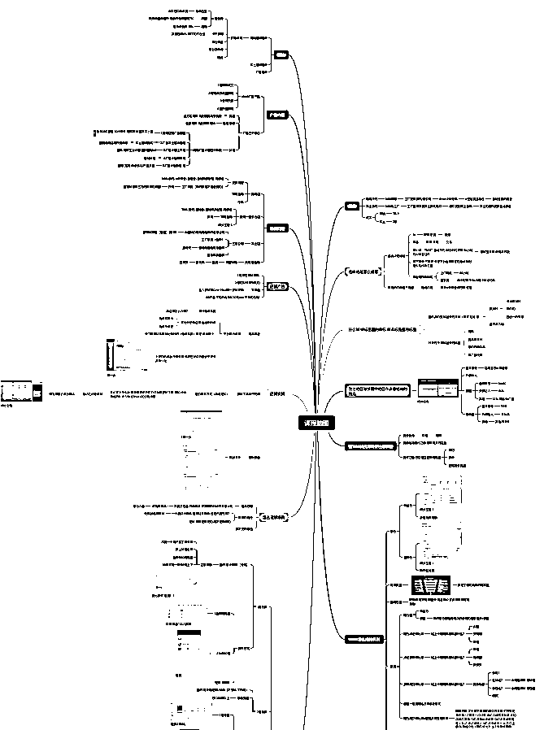
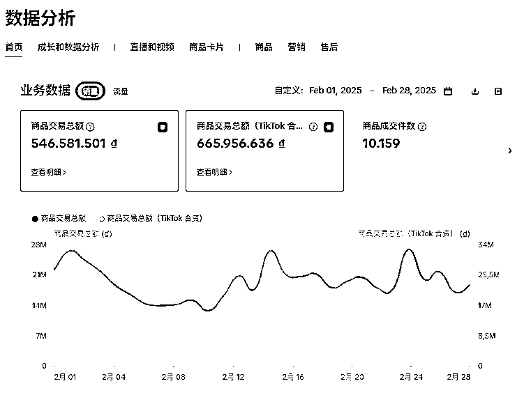
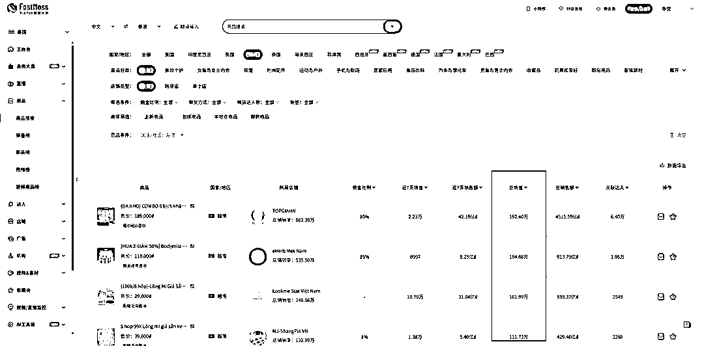
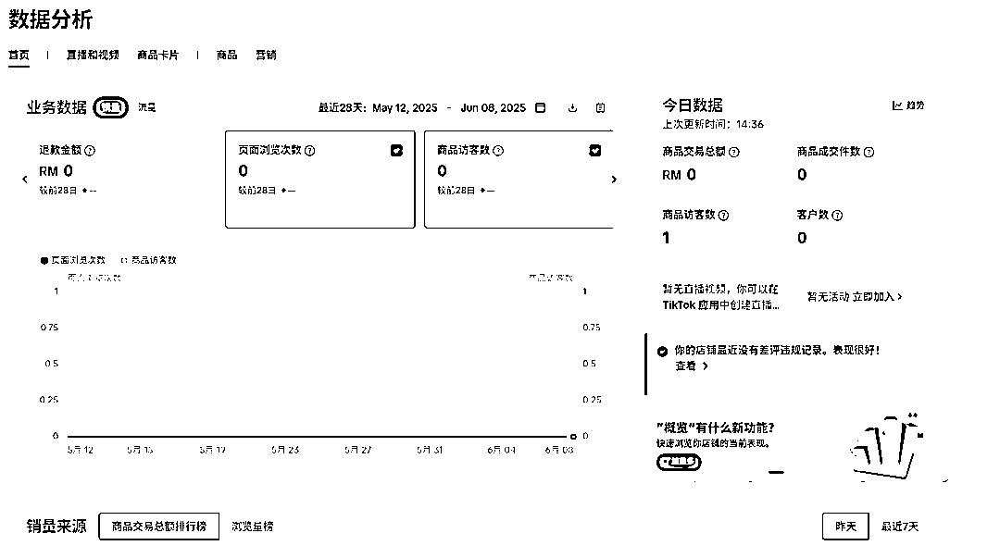
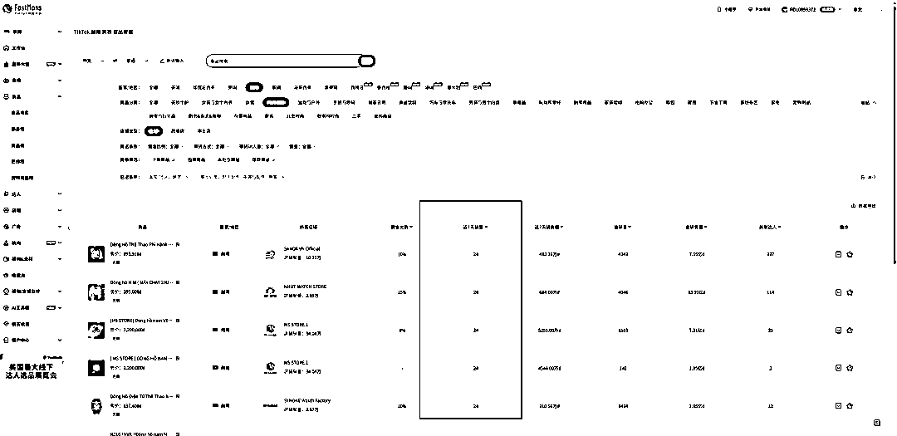
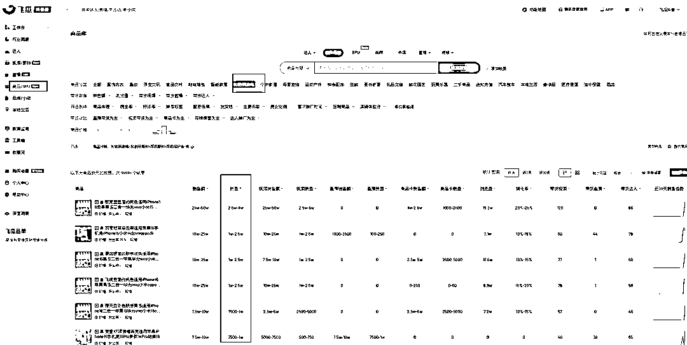

# (12 赞)TikTok 自然流商品卡四阶段操作指南

> 原文：[`www.yuque.com/for_lazy/zhoubao/hgfddgufp490v88g`](https://www.yuque.com/for_lazy/zhoubao/hgfddgufp490v88g)

## (12 赞)TikTok 自然流商品卡四阶段操作指南

作者： 大博跨境电商

日期：2025-06-28

**先发下内容颗粒度**

**在发下单店铺单地区的数据**

**  **

**接下来干活正文开始 不说废话**

首先，我每天收到最多的问题是：店铺没流量、店铺不出单、出单量太少、没有利润、怎么赚钱，甚至“地区哪个好”这种问题。

其实，我想强调的是，这些问题并不是根本性的问题，而是认知的问题。

按照问这种问题的意识频率，是解决不了这个问题的。

真正我们思考的是：我们去做店铺，我们的模式是什么？低价还是打品？低价分为几个阶段？打品分为几个阶段？每个阶段的目标是什么？以及关键动作是什么？不懂阶段标准化 SOP 的操作流程是什么？这些是核心。

那么今天我们主要讲一下自然流商品卡的模式与操作步骤与关键动作与效率指标是什么

# **TikTok 自然流商品卡的四个阶段**

第一个阶段 拉体验分 目标出 30 单

第二个阶段 跑量 目标 单天单店单地区做到 100 单

第三个阶段 利润期 目标 跨境店铺测品/跨境店铺盈利期

第四个阶段 放量期 目标 一品多仓本土备货放量/本土店铺备货盈利

# **一、拉分期关键操作 刚需品+目标 50%定价跟卖**

很多人认为 TikTok 店铺有权重，我不敢苟同。

tiktok 美国店铺卖得贵，都是因为开店铺资质问题。

而早些年天猫店、淘宝店铺，都是级别比较高的、有粉丝量的，哪个店铺卖过来货能跟存量粉对得上，是直接可以变现的。

但是 TikTok 没有，Tiktok 唯一有的只有商品链接权重，如果纯付费的情况下，是广告计划的权重；

如果是达人的话，也是常态化的达人分发效果；

如果商品卡的话，就是通过低价截流与搜索形成打起来的链接优势。

所以，先通过低价把链接跑起来，具体操作就是：FASTMOSS 拉刚需品，把所有累计销量高的品，跟他们 1:1 抄款不抄牌，低 50%的价格，直接快速拉到 30 单，把体验分过掉。

没有体验分之前，店铺基本上就是下列状态。

**1、FASTMOSS 趋势品跟卖视角**

**2、新店铺无体验分视角**

**方向对了 大量的重复操作就好了**

# **二、跑量期关键操作 趋势品+保本定价跟卖**

跑量期间 核心目标是 做到单地区单店铺 100 单

具体操作 将 FASTMOSS 页面筛选到 20+（基础会员上线）开始大量跟品 跟品核心保本价格抢量

很多人跟卖跟不出来 有以下几点核心原因

**1.上品没有质量标准、上的所有品要么是没有价格优势、要么是价格优势不明显**

**2.按照上品标准每天商品数量达到 30+ 持续保证效率**

**3.有些品类是定价跟品。比如家电、玩具等。有些品类是常规跟品、比如饰品、百货、家具日用。有些品类是常规+本土、比如箱包、或者其他类目重量较高的**

**4.商品数量不够量 是因为没有细分拆开具体二三级品类**

# **三、利润期关键操作 国内趋势+利润定价跟卖**

到了这个阶段，才是真正意义上盈利的。

但是，跟站内的品不可能盈利——因为爆款竞争不过，趋势款保本，没爆起来的也没竞争优势。

所以，必须到抖音飞瓜去跟卖。

在飞瓜做跟卖的时候，其实操作路径跟 Fastmoss 一致，只不过可跟范围变得更大了。

**1、飞瓜操作演示**

**2、另外一个就是定价**

其实关于定价，我们要清楚平均客单价是多少。

定价是个艺术活，在我看来，你是否能卖得出去货，跟你生产产品没有任何关系，但平均客单价决定了我们商品卡的定价。

所以，必须要把同类型的产品，按照销量排序前十的客单价拉出来作为参考定价。

但是，无需跟它持平或者低于这个价格 —— 原因是，这个是有供应链规模才能刺激出来的量，将它作为后续优化至大链接的价格标准才是重点，哪怕高了也没有问题。

而事实上，跨境商品卡就是这么在盈利的。

# **四、放量期关键操作 爆品控流速+本土备货**

**目标 跨境商品起链/本土商品链接起链**

当上架的商品小批量爆单后，我们一定会面临个问题：**就是被跟品。**

**这个时候我们就要尽快降低价格验证测试流速，降低完价格。**

**如果流速能够增长 30%以上，就没什么问题，可以开始一品多仓直接本土备货**

第一次打起来的链接建议一品多仓，摸透本土店铺的流程。

第二次的话 可以直接做本土备货，那么跨境流速测起来后，直接少批量。按照空派时间标准，千万不要断货，更不要大规模的备货。

大规模备货的条件是链接问题，不然很容易造成库存积压，这点需要注意。

* * *

评论区：

暂无评论