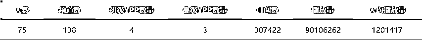

# (36 赞)YouTube 深海圈数月数据分享及三期报名信息

> 原文：[`www.yuque.com/for_lazy/zhoubao/mp4wotyhlwaipmot`](https://www.yuque.com/for_lazy/zhoubao/mp4wotyhlwaipmot)

## (36 赞)YouTube 深海圈数月数据分享及三期报名信息

作者： Gary 曹淦

日期：2025-07-01

大家好，我是 Gary 曹淦，和波妮一起担任 YouTube 生财深海圈总教练。

从 3 月 12 号深海圈正式启动到今天，过去了三个多月，宝剑锋从磨砺出，梅花香自苦寒来，有心的圈友也许会发现，每次我们做分享，似乎都有新的变化，那么废话少说，上数据，这是 1 月私教陪跑启动时、深海圈 4 月底和 6 月底采集的三次数据，今天就来聊聊我们这几个月都做了些什么，同时也分享下第三期报名的信息。

更好的阅读体验，请移步飞书：[`ncnmu5q1eqm9.feishu.cn/wiki/XMvlwhoRIi4tiGkZSJCcnlxRnXf`](https://ncnmu5q1eqm9.feishu.cn/wiki/XMvlwhoRIi4tiGkZSJCcnlxRnXf)

1.  **1 月 YouTube 私教陪跑（深海圈前身）摸底调查：**

1.  **4 月底 YouTube 深海圈问卷调查：**

 images.zsxq.com/FiedhLS6iQ7hmcghNyKkHEmr89H_) images.zsxq.com/Fl033gAHhCaUv41_1TCWTXokHXOL)

1.  **6 月底 YouTube 深海圈问卷调查：**

 images.zsxq.com/FnnJM5jjyos0KtZs1cGHOcBYLbFr) images.zsxq.com/FosHNtDiCZ73g8_rgNJcN_qoypZU)

* * *

评论区：

暂无评论