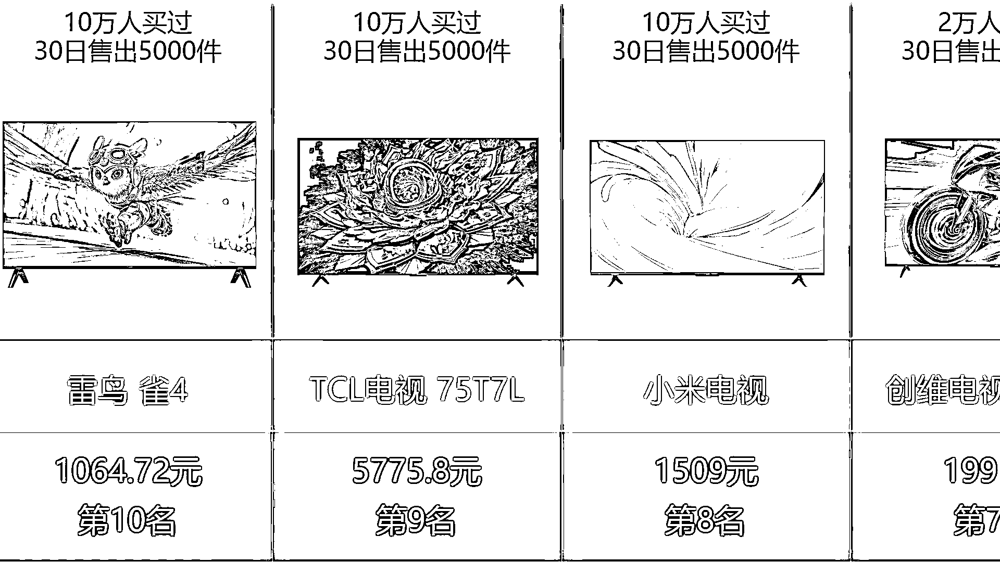

# (精华帖)(63 赞)B 站好物带货视频拆解与软件分享

> 原文：[`www.yuque.com/for_lazy/zhoubao/acggww6kxfm19cu8`](https://www.yuque.com/for_lazy/zhoubao/acggww6kxfm19cu8)

## (精华帖)(63 赞)B 站好物带货视频拆解与软件分享

作者： 郑王铭

日期：2025-06-30

上次写的 B 站好物带货一键生成软件加精了，之前主要是分享软件。

但是没有赶上亦仁老大的龙珠悬赏，这次拆解另一个 B 站好物带货视频，有好几个 UP 主连续上榜几个月的。

这次更重要的是视频的思路拆解，还有 AI 的提示词，还有通过 AI 生成一键生成软件的思路的分享。

这次分享后就是实战了，准备上 10 个号试一下最近分享的这两个软件，收入过万或者满一个月再来分享。

[`xvgn5q6nqg.feishu.cn/docx/ESSZdpOmPow4zMxGkhBcse02nIe`](https://xvgn5q6nqg.feishu.cn/docx/ESSZdpOmPow4zMxGkhBcse02nIe)

* * *

评论区：

执着的启明星 : 这个东西是不是做个 ppt 也行

郑王铭 : 可以试一下，感觉应该也可以，不太会用 PPT[呲牙]

木飞 : 你文档里提到的两个百万 up 主，这两个对标账号怎么找到的，是在推荐页随机刷的？

郑王铭 : b 站有百万带货排行榜，从里面找的

木飞 : 老哥，你好，再问一下，我在 b 站搜索了百万带货 up 主排行榜，没有出现榜单，那个入口在哪里的？[捂脸]

叶凌尘 : 需要 1000 粉，开通悬赏带货才能看到

木飞 : 好的👌，多谢[抱拳]