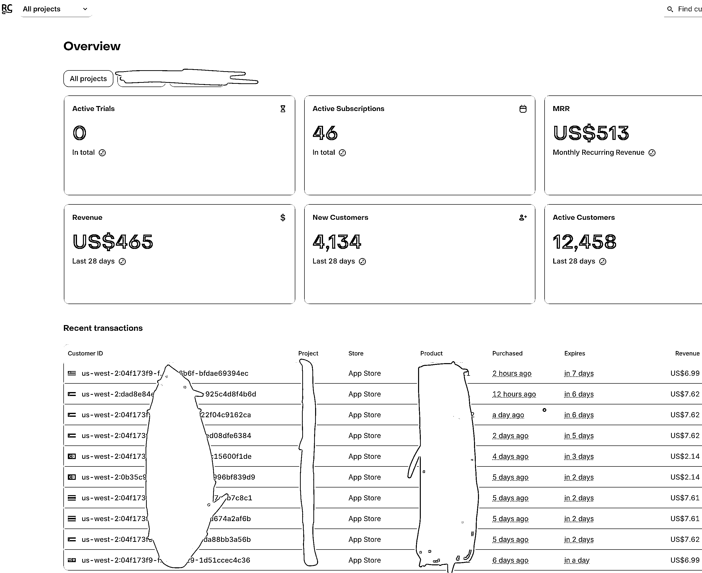

# (27 赞)AI App 开发 SOP：1 周上架 23 天赚$513

> 原文：[`www.yuque.com/for_lazy/zhoubao/xva0awgbspe3gv6m`](https://www.yuque.com/for_lazy/zhoubao/xva0awgbspe3gv6m)

## (27 赞)AI App 开发 SOP：1 周上架 23 天赚$513

作者： linyy

日期：2025-06-29

各位生财的圈友，大家好，我是 linyy。

这次 AI 航海，我给自己定了一个目标：一个多年不写代码的“客户端新手”，能否跑通 AI App 从 0 到 1 的全流程？

答案是肯定的。我用了一周时间上架了 2 个 App，并在随后的 20 多天，实现了$513 的月度经常性收入（MRR）。

话不多说，先上图看结果：

能取得这个结果，靠的不是什么高深的技术，而是我花最多精力去**构建一套可复制的产品生命周期流程和方法论。** 我坚信，对于想在 AI 领域搞钱的普通人来说，找到一套自己的系统化打法，远比单点地学习某个技术重要。

这套打法覆盖了从**用 AI 挖掘市场机会和需求、让 AI 辅助开发交付，到最后实现 0 成本获客增长** 的全链路。

接下来的文章，我将毫无保留地把这套 SOP 思路分享给你。它不是理论，而是我过去快一个月航海过程里，用真金白银和时间验证过的实战总结。希望我的经验，能帮你直接“抄作业”，在 AI
App 的路上走得更快、更稳。

详情请移步飞书：

[`qcnievo9yz2n.feishu.cn/docx/VUf7dfm74ohG0Vxk6Yecz0iinmh`](https://qcnievo9yz2n.feishu.cn/docx/VUf7dfm74ohG0Vxk6Yecz0iinmh)

* * *

评论区：

Jarvis : 火钳刘明

yb2543 : 先赞后看

烽火 : 干货