# 如何用Reddit挖掘需求、获取种子用户？

> 来源：[https://gwlxqear42r.feishu.cn/docx/FV63djydPoqVW0x7XQNcewuinLg](https://gwlxqear42r.feishu.cn/docx/FV63djydPoqVW0x7XQNcewuinLg)

在过去几个月，我花了很多时间泡在Reddit，尝试在此挖掘需求、验证产品和找种子用户，踩过不少坑、也学到了很多。同时我也看到很多圈友在吐槽Reddit封号、投入产出比低，所以我就写了这篇帖子，毫无保留地分享自己是怎么发挥Reddit的价值，并且附上一些真实的产品案例给大家参考。希望能对出海路上的圈友们有所帮助~

# 一、基础准备：社区生存法则

## 新手养号原则

*   新人期：注册后模拟真实用户行为（点赞/收藏/评论），至少3天再发贴。不要一注册账号就发帖，很容易被封号。而且我还踩过一个坑：多开谷歌浏览器建小号，结果导致登录小号就会被提示报错：We had a server error，评论发帖都没有karma，后来才知道多个养号要用指纹浏览器+纯净IP，否则会被判定账号异常。

*   Karma≠点赞数，算法权重参考互动质量。Karma是用来评估用户贡献和活跃度的一种方式，发帖和评论的Karma是分开独立计算的，分为Post Karma和Comment Karma，在个人账号界面可见具体数值。计算不是简单的点赞数加减，背后存在复杂的算法，以避免恶意刷票等行为。我的一篇热帖有近300+的点赞，但是只给我带来200左右的Post Karma。

*   Karma积累技巧：优先参与高流量、实时在线人数高的群组（如r/AskReddit、r/awww）。除此之外，我还会去一些女性用户多的群组发帖互动。这类群组里，情感生活分享类的帖子往往讨论热度很高，很多用户都会热情地分享自己的建议和共鸣，比较容易积累Karma。之前labubu很火的时候，我也会去r/labubu发帖蹭热度哈哈。

Karma查看路径如下图：

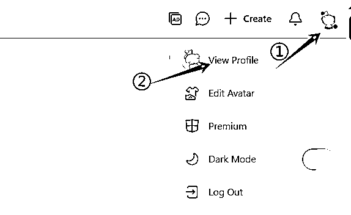

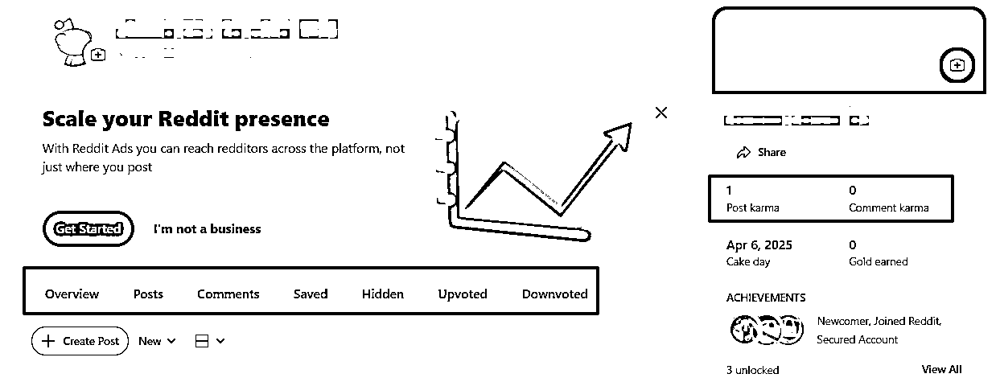

## 建立“活人感”

在Reddit上求生存，“活人感”很重要，用户普遍反感纯营销号。因为所有用户的发帖和评论记录都是公开可见的（除非手动删除或隐藏），有些群组版主甚至会溯源账号历史，如果你的账号全是推广贴，那么通常会禁止你在群组里发推广贴。具体规则可参考：Reddit 行为准则，一般来说每10次发帖中，只允许有1次是自我推销的内容。

我在这方面挺谨慎的，会日常穿插非产品相关、不同群组的真实互动。发了1条营销贴之后，我就会补上三四条非营销内容。因为我在逛各种群组的时候，发现很多人真的会点进去看其他用户的历史记录，来判断这是一个什么样的人。在Reddit上，把用户当人看是一个普遍共识。

## 尊重群组规则

群规在群组首页右侧的灰色栏里，各不相同。流量越大的群组，普遍规则越严格，会明令禁止营销贴即Self promotion，且不接受申诉。有些中小型群组就会宽松一些，例如允许发营销贴，但要先经得群主同意；每周单独开一个置顶帖子，允许成员在此贴下方评论推销介绍自己的产品。

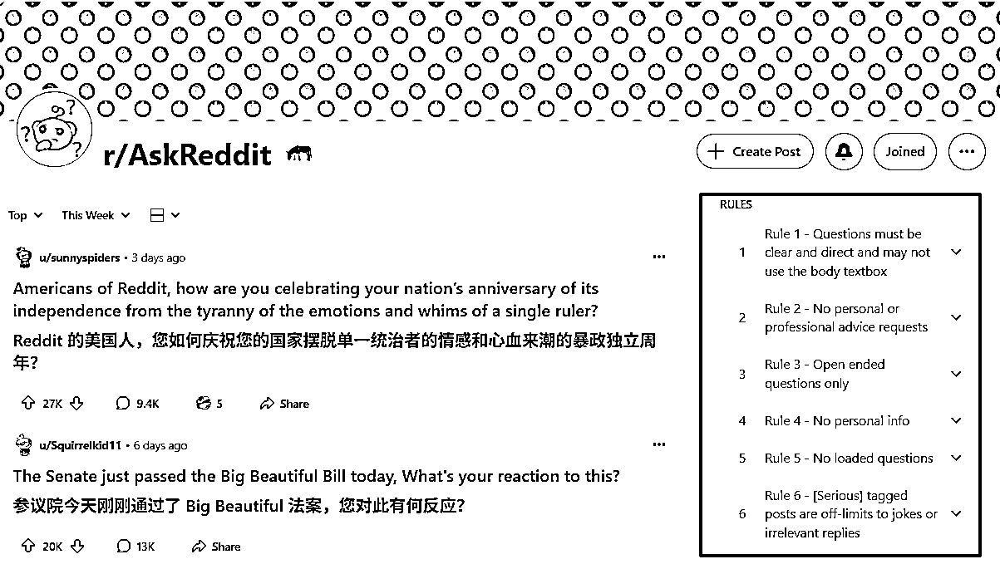

很多初来Reddit的朋友都会犯的错误是：未读版规直接发营销贴，被一键拉黑踢出群组和Discord。实不相瞒，我也犯过呜呜。大家千万不要心存侥幸，很多群组都设置了机器人，一旦检测到营销贴就会自动删除，没有商量余地，而且有些群组成员还会主动举报违规内容，维护群组规范，把群组当作自己家一样爱护。我们可以换位思考一下：如果有人来我们家门口贴牛皮癣小广告，我们会怎么做？

# 二、需求挖掘：预判价值与风险

我挖掘需求的方法，一是通过关键词，搭配使用semrush和ahrefs；二是通过人群，利用gummysearch等工具收集目标人群的高频议题和热点话题来挖掘需求。

## 关键词

我会先在semrush找词，ahrefs看kd竞争度，再来Reddit用关键词搜帖子，了解用户需求。这样做的好处是基于SEO数据驱动产品开发，避免踩坑：

在Reddit上可以重点关注：问题求助帖、吐槽抱怨帖、工具推荐这三类内容，我常用到的相关搜索词有：

如果你想做一个app，那在Reddit上搜"Best app for+人群"或者"is there an app for that+使用场景"，会出现很多相关度高的热帖，评论区都是海外用户的真实心声和需求。用对方法，灵感就能源源不断。

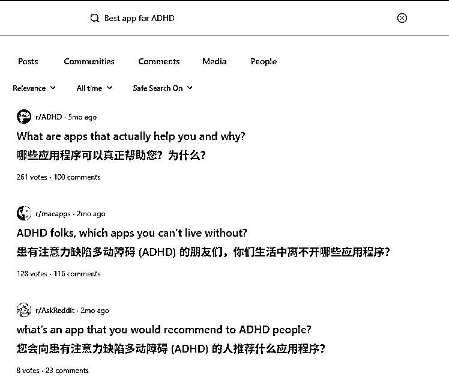

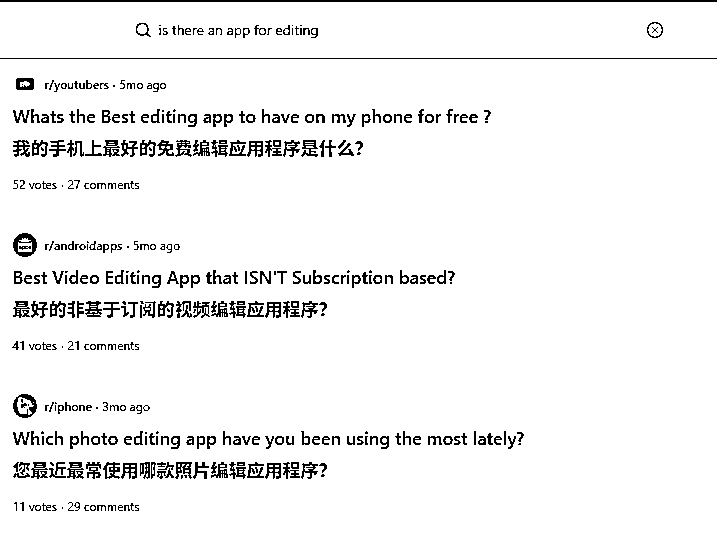

找词的方法推荐补充阅读哥飞老师的文章：

海外工具从需求挖掘到网站制作一篇文章让你搞懂

用一个公式来判断关键词是否值得做，让你选择关键词不再犹豫

利用Semrush找有一定搜索量且竞争小的关键词时容易遇到的一些陷阱

## 人群

这方面，我常用的工具是Gummysearch。它的使用价值在于，它将 Reddit 这个巨大混乱、但充满真实用户声音的金矿，变成了一个结构化、可搜索、能够主动发现商业机会的“情报数据库”。Curated Audiences 是官方团队预设的一组受众群。他们已经帮你完成了最繁琐的第一步：针对一个特定领域（比如宠物、AI、市场营销），找到了最相关、最活跃、最有价值的群组，并将它们组合成了一个“人群包”。

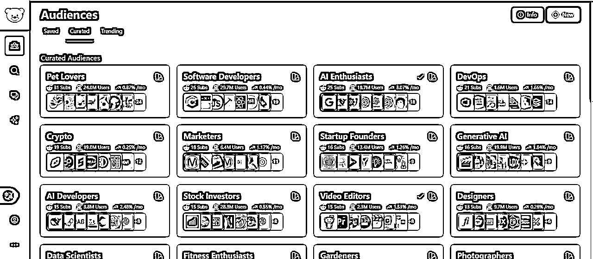

点击每个“人群包”进去看，会出现如下图所示的界面，以Ecommerce为例：

各个板块的中文解释（此处使用AI翻译解读）：

1.  顶部分类：电子商务 (Ecommerce)

1.  关键词搜索 (Keyword Search)

*   搜索框：你可以在这里输入任何关键词，比如某个品牌、产品或问题，工具就会在所有和“电子商务”相关的论坛里帮你找到相关的讨论。

*   快捷标签：搜索框里都是系统推荐的热门或常用搜索词，方便你快速开始。

1.  三大核心分析栏

第一栏：SubReddits (子论坛/版块) 这一栏列出了与分类主题最相关的Reddit社区。

第二栏：Themes (讨论主题) 这一栏非常有价值，它将所有杂乱的帖子按讨论的性质分类。让你能快速了解人们都在聊些什么。

*   Hot Discussions (热门讨论)：本周最火的帖子。

*   Top Content (顶级内容)：过去一个月里表现最好的内容。

*   Advice Requests (寻求建议)：用户在请求别人给出建议和指导。

*   Self-Promotion (自我推销)：用户在推广自己的产品、服务或店铺。

*   Solution Requests (寻求解决方案)：用户在寻找能解决特定问题的工具或方法。

*   Pain & Anger (痛点与抱怨)：用户在表达他们的沮丧、不满和遇到的困难。

第三栏：Topics (具体话题) 这是最细化的数据。它把讨论内容拆分成了具体的话题。例如Tariff关税话题这么火，那是不是可以尝试开发一个工具计算产品加税后的影响呢？事实上，我发现真的有独立开发者做了一个Chrome插件来显示产品在亚马逊的关税成本。这个产品还没完成，开发者只是发了一张MVP版本的截图，就在Reddit上得到1.7K点赞和数十条反馈建议。不仅验证了产品需求，还得到了真实用户的建议反馈。典型的“卖空气”案例！

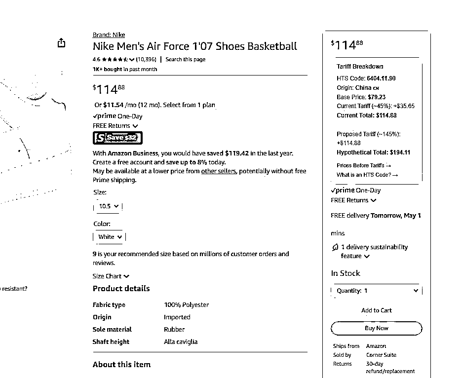

除此之外，我们也可以自定义目标受众群。我就建了一个SOLO Dev当作自己的独立开发灵感库，包含有r/IndieDev、r/SideProject、r/InternetIsBeautiful等等海外优秀开发者云集的群组。很多大佬会在其中分享自己的项目和推广经验，内容给我带来很大启发。而且有些群组允许营销贴，你的产品是骡子是马，发出来就知道了。

前段时间登上了ProductHunt日榜的Thiings，其开发者就在r/SideProject 发过帖收集反馈，并且分享了自己的开发过程。在这个群组里，开发者们彼此互帮互助，一起打造出面向世界的优秀产品！

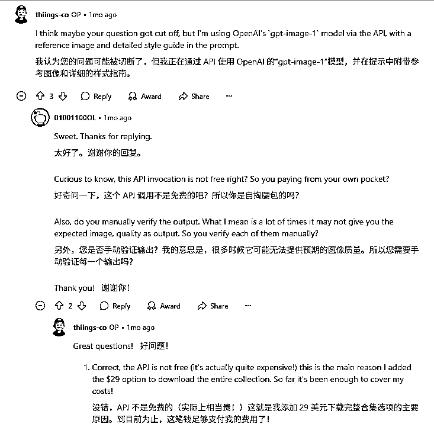

# 三、产品冷启动：精准获取种子用户

其实在第二步需求挖掘的过程中，我们通常会发现很多潜在目标用户。当我们开发好MVP版本的时候，前期收集的相关热帖和群组就可以派上用场了。有很多开发者就是在Reddit上找到了第一批种子用户，赚到了第一块美金：

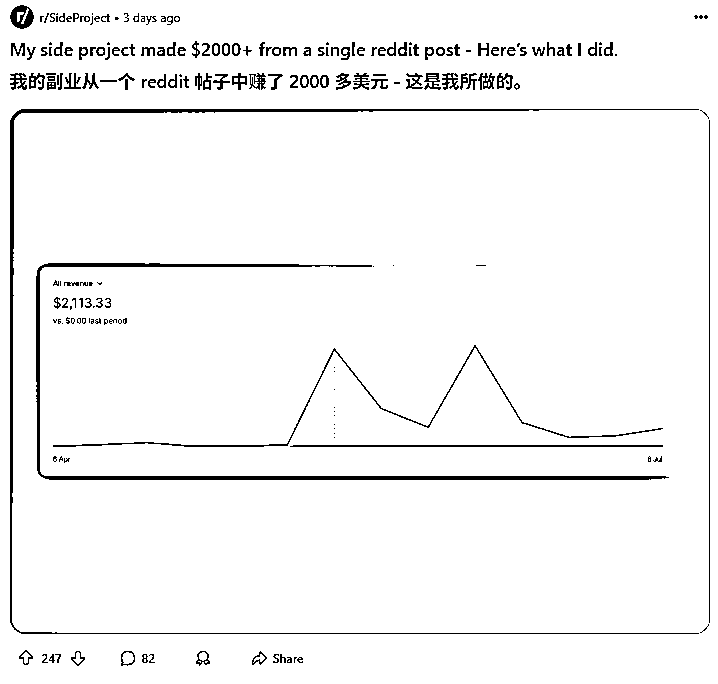

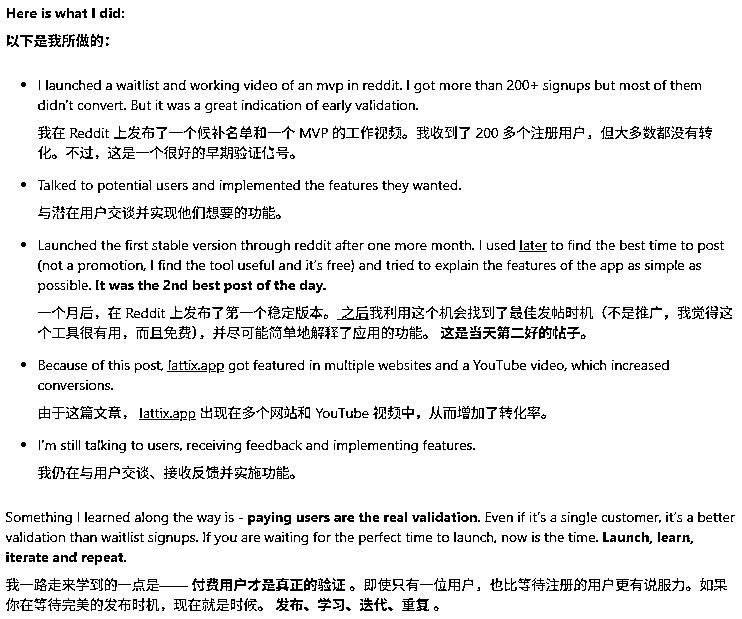

## 私信

首先，我们可以去产品相关的热帖下评论。因为有些用户会关闭私信权限防骚扰，所以为了保险起见，我一般都会在帖子下面评论，例如：“Hey there! I'm actually working on a similar product myself. Would it be okay if I sent you a direct message to learn more about user needs?（嘿！我正在开发类似的产品。我可以私信你，进一步了解用户需求吗？）” 。在征得对方的同意后，我再发私信给他。

如果想要节省这个步骤的时间，可以用RPA等自动化工具。我一般是人肉筛选，会认真看贴主个人界面的内容，去判断是否私信。如果用户近一周内在Reddit有发帖、Karma分值高于平均值，回复率会较高。之前我就遇到一个用户很认真地总结了他的产品需求点、介绍他使用竞品的体验，并且愿意提供开发方面的帮助。简直是神仙用户！

## 群组发帖

在Reddit上想要得到合规高曝光的唯一途径，就是群组发帖。只要找准目标用户，你的工具能满足用户需求，就能快速得到一波正反馈。我有一篇近700阅读量的帖子，就给我带来了近80个目标用户，转化率超10%，起码比哼哧哼哧搞SEO快多了，后续再观察Clarity等用户行为和数据，就能大概判断产品是否真需求，以及优化点。

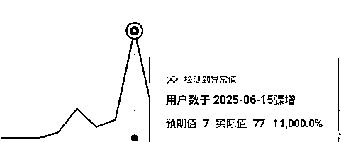

还记得我之前说的吗？想要发帖，就要先经得版主的同意。在群组首页的MODERATORS版块，点击Message Mods，你的消息会发送到该群组的Modmail。Modmail是一个所有拥有Modmail权限的版主都能看到的收件箱。版主们可以在其中讨论你的消息，并共同决定如何回复。这比你单独私信某个版主更有效率，因为你不知道哪个版主当前在线或负责哪个方面。这也是官方推荐的联系方式，适用于所有与群组相关的问题、建议或申诉。快的话，我当天就能得到版主的回复；慢的话，近一个月才得到回复，甚至有版主会用沉默来表达无声的拒绝 :)

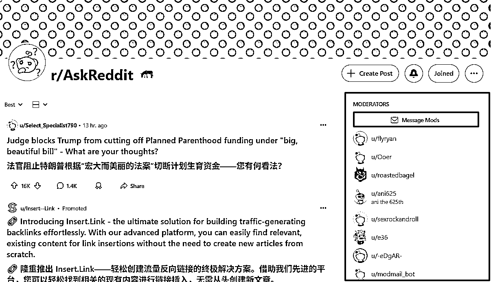

但是：怎么能得到版主的同意呢？在这里我附上一个有近50W用户的版主给我的回复，他能代表很多版主对于营销贴的态度：关键是你的产品能够给这个群组带来什么价值？

如果你成功征得了版主的同意，就可以认真写贴，安排发帖时间了。在这里，我推荐一个小工具可以帮助找到目标群组的合适发帖时间：Later for Reddit: Schedule posts to Reddit。可以用来查看特定群组的热帖趋势，以及热门标题的关键词，十分方便。

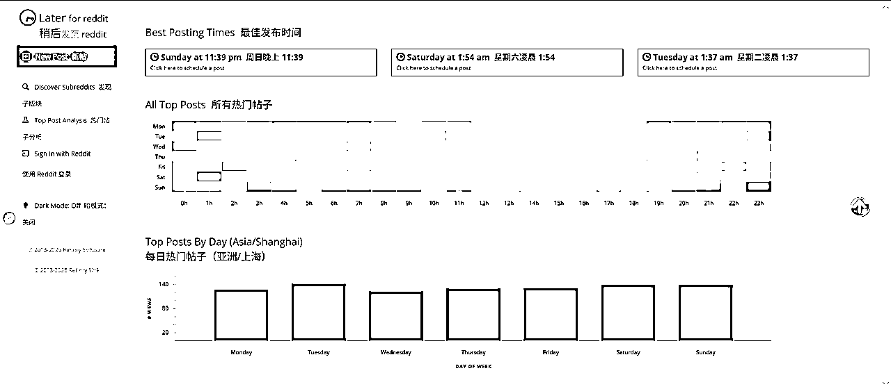

对我来说，Reddit是个宝藏。我在这里见证了无数优秀的产品诞生，也尝试用它助力我的产品开发，同时它也让我更了解海外市场和用户画像。希望大家也能在Reddit上挖到属于自己的宝藏！我们一起出海赚美金！冲呀！！！