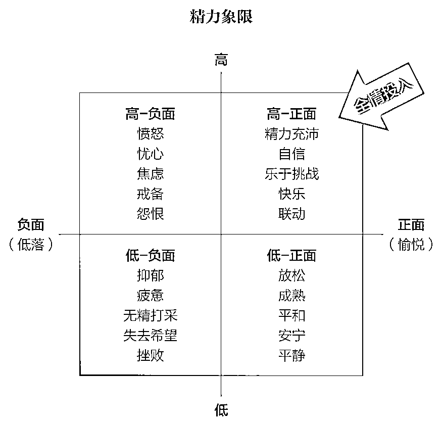
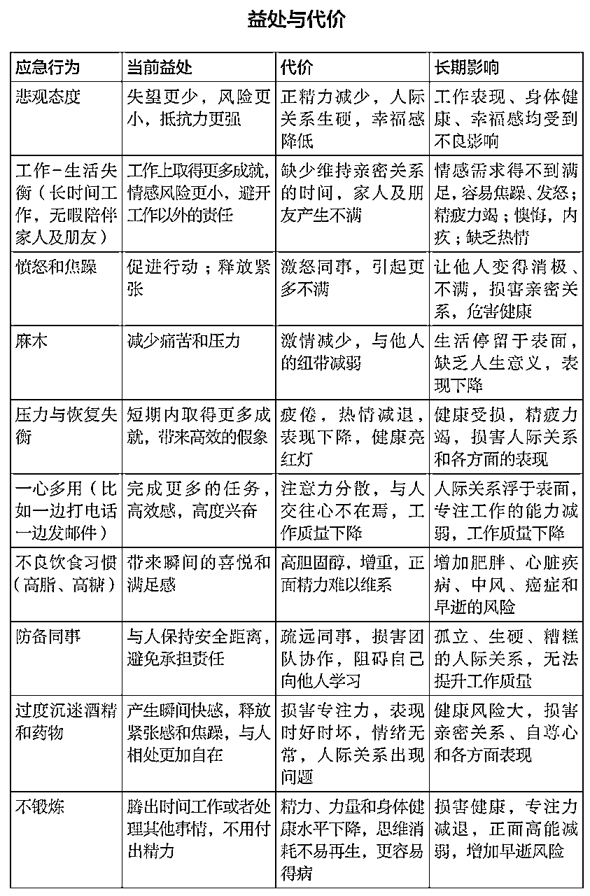

# 废柴自救指南——如何摆脱低精力，启动开挂人生

> 来源：[https://nmui3kskc0.feishu.cn/docx/BAMZd1pnJovZtnx82ubcso2onAg](https://nmui3kskc0.feishu.cn/docx/BAMZd1pnJovZtnx82ubcso2onAg)

大家好 ， 我是李子，东北95后自由职业/创业者，专注研究网赚项目。东北人居住杭州。

曾经我是一个体能、精力专注力都极差的人。我非常容易走神，也非常容易感到疲惫和乏累。

在我的赚钱生涯里，我发现我的最大卡点之一就是自己的精力不足，以至于进度过慢，执行力很弱。

在过去一年的时间里，我搜集了很多提高精力的方法并且努力实践尝试。受益颇深。不仅项目冲到年营业额500w的成绩，也成功减掉了50斤的肥肉。

今天来分享一下，我是如何管理、提高自己的精力的。

如果你也很容易疲惫，精力不足，又非常想提高精力赚更多钱钱，希望这篇文章能对你有帮助，记得动发财的小手点点赞鼓励我一下，也欢迎大家交流~~

后续我将出更多 如何提高专注力，如何工作进入心流等相关内容····欢迎关注！

# 一、管理精力，而非时间

如果你是一位创业者、自由职业者或正全力发展副业，你一定听过这句话：“时间是最宝贵的资源。”

但在高压与高变的环境下，你会发现——比时间更稀缺的，其实是精力。

时间人人平等，一天都是24小时。但不是每个人都能持续高效地产出。

为什么？因为真正决定你能否把时间用好、用出结果的，是你有没有足够的「精力」去支配它。

状态决定成果，不做精力管理，即使时间充足，也很容易：

⛔ 完不成计划

⛔ 疲惫，情绪状态差

⛔ 效率低，结果质量差

这些并不是懒惰，而是你正在透支身体能量系统，结果自然是产能低下、拖延加剧、压力感倍增。

精力倍增=单位时间效能的倍增≈时间倍增 因此 高精力 = 高回报

看了网上的那些成功大佬我们不难发现：真正能走远的创业者、自由职业者，往往不是最聪明或最努力的，而是最会管理自己能量的人。

# 二、什么是精力

如果把每个人的精力比作一个容器的话，那么每个人的容器容量将千差万别。

但好消息是，精力就像肌肉；提高精力，就像提高肌肉耐力，我们只要去有意识的锻炼它，容器会越来越大。

能力拓展=超量恢复系统=承受微超日常的增大压力+定期及时修正恢复精力

*   长期主义：为了长期的能力增长，接受短期压力带来的不适

*   我们需要系统性的增加适度压力，随后得到充分休息

*   准确评估压力等级，避免压力过大

| 如何理解精力 | 每件事都需要精力，精力是做事的能力，高效做事的基础（看一眼窗外都在花费精力） |
|  | 包括体能、情感、思维、意志四个方面，这四个方面独立且互相影响 |
|  | 精力是有限的，任何层面的精力都要管理，不可无限消耗和产出 |

全情投入和最佳表现只可能存在于“高-正面”的象限

精力和情绪直接挂钩，只有当我们拥有正面情绪+高精力时，才有能力对事情全情投入，使状态和效率最大化。

# 三、如何精力管理

## 1.核心：建立良好的仪式习惯

我们每个人，归根结底都是习惯的产物。大多数日常行为并非出于有意识的决策，而是源自潜意识和自动反应，这也使得真正的变革变得格外艰难。

形成非意识性的高精力习惯，也在节省这部分的精力消耗

⚠️ 假如你发现在某部分很难建立起好习惯时，正确的思路是拒绝批评自己“不自律”；而且要不断思考，找到更适合自己的“自律方式”。

## 2.工作：保持精力损耗与恢复的平衡

在精力管理中，过度消耗精力和过度恢复精力都会削弱我们的状态。必须不时更新精力以平衡消耗。

当消耗 ＞恢复，我们会陷入精力衰竭；

当恢复＞消耗，反而会让精力枯萎、意志迟钝。

### 2.1人体活动-休息的节律

实际上，精力的有效使用在于找到适度的张弛节奏。

我们的“活动-休息”模式遵从生理节奏，大约每24小时循环一次；

20世纪50年代初，研究员阿瑟林斯基和克莱特曼发现，睡眠有90～120分钟的周期，从浅层睡眠——大脑活动频繁和做梦的阶段，到深度睡眠——大脑静止并深层修复。这个过程称作“活跃-休整基础循环”(BRAC)。

到了70年代，进一步的研究表明，大脑清醒状态下也存在同样的90～120分钟的周期，即次昼夜节律。

### 2.2如何休息，更快恢复精力

一种可行的方式是采用“短跑模式”——在需要时全身心应对挑战，在间隙中进行碎片化、灵活的放松，而非长期持续地高压或完全的懒散。

同时，我们也应避免高度单线化的生活方式，让生活拥有多元的节奏与角色切换，才能真正保持精力的活力与韧性。

如何休息，更快恢复精力

*   大脑规律：最多90-120分钟要休息一会，再去全身心投入到工作状态

*   定期度假：深度放松

*   培养爱好：放空自己

*   深度呼吸：专注深呼吸1分钟，身体获得更多氧分同时激活身体，恢复精力

### 2.3如何工作，更好保持精力

如何工作，更好保持精力

*   提前规划：提前设定好第二天的任务和目标，更有助于提高专注度和增加精力

*   保持专注：日常将分心的事，降到最低（比如我工作时手机放到最远位置，电脑只打开需要的软件，给自己设定任务时间）

*   事务分开：注意力转换需要消耗精力，比如生活和工作分开，降低混乱，各自投入精力

*   设置节律：设置节律会减少目标转换的精力损耗，如果有条件，可以一天只专注做一类事情

*   了解自己：只有更了解自己在什么【时间】【地点】做什么类型的【事情】更有状态，才能最大程度发挥自己的精力。

比如我早上的时候最适合做无脑的工作，来进入工作状态，晚上最适合写创造性的东西和规划第二天工作。

## 3.饮食：控能稳定精力的营养策略

“你吃下去的，不只是热量，而是第二小时的专注力。”

很多创业者、副业党或自由职业者都有一个共同误区：只有饿了才吃，吃饱了才有力气继续冲。

但其实，大脑是个精细系统，它不喜欢「能量暴涨暴跌」——你的饮食方式，决定了你每天能否稳定输出、情绪稳定、头脑清晰。

### 3.1常见饮食误区⚠️

在饮食方面，我以前非常不注意，也特别容易吃外卖，零食等高油高糖的食物，结果吃多了就很容易犯困，身体也堵得慌。这些习惯对之后的工作、精力和整体状态都没有什么好处。血糖一升高，精力反而会变得更差。

### 3.2饮食关键原则

后来我看了一些精力管理的书，对自己的饮食进行了改革。

饮食关键原则：不是吃的多，而是吃的稳

*   28定律：8分吃健康食物，2分吃喜欢但可能很不健康的食物

*   吃早餐：更有精力

*   高营养低热量：每顿适量蛋白质、少量优质和碳水；保持血糖稳定

*   不饿也不撑：保持身体能量平衡

*   全天定期喝水：喝水很容易被忽略但真的非常重要，补充体内液体充足也非常有助于提高精力！

⚠️ 与高糖食物一样，咖啡因饮料如咖啡、茶和健怡可乐能瞬间提升精力，但由于咖啡因利尿，长期饮用依旧会导致缺水和疲倦。

每一个思考和决定都会花费精力，为了更节省精力，我一般在睡前的时间，规划好第二天的饮食，白天直接执行就好。

### 3.3提高精力参考补剂

另外，缺乏维生素也会让身体感到疲惫，建议大家去医院查一下维生素，看看自己是否缺乏某种维生素。

我也额外吃了一些补剂来提高自己的精力。

提高精力参考补剂

维生素D：维生素D是唯一一个很难靠食物补充，基本只能靠晒太阳获取的维生素。而现代人由于很少晒太阳，调查显示50%以上的人都缺乏维生素D。且它对精力、免疫力等健康的很多方面都相关，强烈建议大家可以去医院查一下维生素D是否缺乏。 如果你很难晒到太阳，强列建立定期补充维生素D.

鱼油：之前看到过一个文献说鱼油也有助于提高精力。我在吃，不确定作用。

枸杞原浆/人参原浆：朋友喝了说很有用，我也在喝，不确定作用。

中药：中医说我焦虑，睡不好，容易累，喝了中药身体状态好了果然精力感觉更强了!

除此之外，我也会选择性的，在特定时间和情景在吃其他补剂：例如熬夜之前或者之后吃辅酶Q10；生病的时候会吃vc，vb等；之前桥本甲状腺炎的时候会吃谷氨酰胺修复肠道和益生菌；补剂上我有很多受益之处，但每种补剂的补充都要因个人情况而已，深感身体调理是个大工程，因为和精力管理无关，就不多赘述了。

### 3.4功能医学

区别于传统医学的“生病-看医-吃药”，功能医学强调不同于对症治疗的根源性治疗。它会深入探讨引发症状的背后机制，更侧重于解决身体的亚健康问题。比如：

*   慢性炎症

*   荷尔蒙失衡

*   肠道菌群失调（Dysbiosis）

*   解毒功能障碍

*   营养缺乏

*   环境毒素负荷

*   压力与生活方式因素

我之前是有甲状腺桥本炎的，2个抗体指标都超出正常值。这个免疫类慢性疾病本身就没有药物医治且容易疲劳。

经过生活+功能医学的调理，我现在的抗体指标已经恢复正常。

功能医学特别适合以下情况：

*   慢性疲劳综合征

*   自身免疫性疾病（如桥本甲状腺炎、类风湿）

*   肠易激综合征（IBS）、SIBO

*   糖尿病前期、代谢综合征

*   不明原因的头痛、焦虑、失眠

*   过敏与食物不耐受

如果你对于以上某个症状深有感触，最优先推荐大家做的检测就是：“1食物过敏源”和“2食物不耐受源”。

长期吃自身过敏和不耐受的的食物会导致身体免疫力低下，也会容易疲劳。

功能医学在我国虽然属于新的医学领域，但已有资深医生深入研究，并正在践行和指导患者。

比如杭州邵逸夫医院的陈丽英医生——主任医师，浙大博导。大家可以去搜她的小红书，能看到更多有关功能医学的内容。

## 4.活动：激活身体的动能循环

“你以为你是在工作，其实你是在沉没。”

——长期久坐的创业者，脑力退化速度可能是常人的2–3倍。

买过运动手环的人都知道，里面会有一个久坐提醒。是因为久坐代价，不止是屁股疼。而是无论对我们的健康还是精力都大大损害。

### 4.1久坐的危害⚠️

世界卫生组织早已将“久坐”列为现代慢性疲劳与代谢疾病的高危因子。

### 4.2如何避免久坐

避免久坐

可以用手机app或运动手环设置定期提醒，60-90分钟一次

久坐提醒后，随意活动一下即可，比如站起来走一圈

大概休息1分钟左右，能快速消除疲惫，恢复精力

### 4.3运动是最值得投资的项目

另外，运动也是提高精力很重要的一环。

运动虽然短期来说，对于很多人都会觉得很累精力更少了，但本人亲身经历，非常明显的感受到通过长期的定期运动，自己身体精力状态带来的巨大改变！

因为运动之后分泌的内啡肽让大脑非常清醒和愉快，长期运动能改善脑内神经系统。

曾经的我可以说，是个极度讨厌运动的人，我也办了好几次健身房的卡最后都拖着没去。

但在去年我下定决定要改善自己的身体状态，提高精力。去了个私教馆断断续续坚持健身了大半年。当我坚持大半年后，发现自己对运动从极度讨厌到现在甚至有点习惯和喜欢了。

如果你真的超级讨厌运动，以下是建立运动习惯非常有效的方式：

一、找人监督

①可以办私教课，教练无形中就督促你（花钱买习惯，超级有效）

②朋友圈等公众平台公布自己的运动计划，让公众压力督促你

③给自己的朋友发钱，每天给朋友运动打卡返钱（超级有用，适用于一切事）

④找个靠谱的运动搭子，最好找本身就有运动习惯的搭子一起运动

二、最小成本的保持节律：

①找一个自己喜欢的运动方式开始

②时长和强度也无需太大（即使每天5分钟，也是个超棒的开始！）

③运动的地方最好在通勤附近，不要过远（在家跟直播/视频运动也是很好的方式）

④保持固定的时间节律

对于一个长期受益的新行为，一定要把建立习惯为第一目标，习惯大于一切。

运动不仅有益于身体健康， 间歇力量有氧运动也更有助于增大精力的容量和恢复效率。

在更深度的选择运动中，我发现不同的运动也对身心有不同的功效。

健身——增加肌肉抗衰。

拳击——锻炼反应能力。很适合创业者和锻炼勇猛特性的人。

游泳/跑步——增强心肺功能。运动过程中适合放空或深度思考。

跳舞——有研究显示跳舞可以增加愉快心情。

攀岩——有研究显示攀岩有助于降低杏仁核敏感度，提高情绪稳定性。很适合创业者。

养成习惯后，可以根据自己的目标，不定期去选择多种运动，身心的综合精力会得到很大提高！

## 5.睡眠：回报率最高的投资

“一天不睡觉，大脑反应会下降相当于醉酒状态。” ——《Why We Sleep》

对创业者、自由职业者来说，时间弹性大，但节律混乱常常是慢性毒药。很多人靠熬夜赶进度、凌晨突击工作，但真相是：睡眠不是成本，而是回报率最高的投资。

以前我是一个睡眠质量超级超级差的人，睡得晚，睡不着，醒来也感觉很疲惫。

长期睡不好，不只是“困”，而是精力彻底枯竭，创意下降，免疫力减弱，甚至记忆力衰退。

### 5.1 “隐性缺觉”的信号⚠️

### 5.2睡眠优化 2步法

有研究证明，大多数人睡眠7-8小时是最合理的状态，睡得过多或者过少死亡率增加1.5-2.5倍。

调整睡眠，先从调整睡眠时间节律开始！让身体自然养成了生物钟，也更有助于睡眠质量。

第一步：打造睡前黄金1小时，告诉身体，我要睡觉了。

*   避免亮光：关闭电子设备蓝光（最好关掉，退而其次是开启夜间护眼模式）

*   安静活动：阅读难懂的纸质书或做睡眠冥想（亲测超级有效）

*   放松身体：温热泡脚、拉伸或泡澡（可增加副交感神经活性）

*   低温环境：比体温略低的睡眠环境，更有助于入睡

⚠️ 尽量在睡前不要看和想令人激动、兴奋的能引起神经强烈活动的事情，容易越想越睡不着。

对于自由职业者的我，每天早上身体很容易没有苏醒，浑浑噩噩的状态。之后我发现起床的节律也非常重要。

第二步：建立起床仪式（节奏 > 时长）

*   固定时间：每天固定起床时间比固定睡觉时间更重要

*   窗帘漏光：窗帘微微漏光，早上眼睛感受到光后更容易唤醒身体，保持节律

*   拒绝暴睡：即使周末也尽量只晚起1小时以内，不要暴饮暴睡，容易打破晚上睡眠节律

*   外出见光：早起外出溜达让身体全身心的感受到阳光，刺激褪黑素下降，唤醒皮质醇节律

## 6.思绪：精力的隐形控制器

“一个不稳定的情绪，会拉垮一个本来就不多的精力系统。”

创业者、自由职业者的情绪状态高度绑定于工作成果与外部反馈，但我们往往忽视：“情绪状态”本身就是精力的一部分，而不是无关变量。

精力 = 生理能量 + 情绪能量 + 意志专注力

### 6.1情绪差对精力的危害⚠️

情绪不好 ≠ 玻璃心，而是你的神经系统正在经历 “内在失衡”。

### 6.2 如何调整情绪

思考会耗费巨大的精力。现实的乐观主义能够解决我们面临的绝大多数挑战！

调整心情

1.  语言暗示：改变自己的表达方式，比如将“心态不好”替换成“心态有待提高”

1.  积极交往：保持1-2个有深度关系，尽量和能带来正向心情的人交往，尽量避开带给自己负能量的人

1.  多看毛选：毛选的思想就是不畏难强者思想，适合每个创业者随时阅读，补充能量！（我花几块钱买了一个毛选语录卡牌，也非常不错！）

1.  身体先行：冷水洗脸/淋浴，可以刺激副交感神经调节心情；运动也超级有用（尤其推荐拳击和跑跳类）

1.  深度放松：按摩、冥想、都对调节心情有很大帮助、

1.  心理咨询：找到靠谱的心理咨询师，得到更自洽向上的自己，亲测非常有效。

### 6.2 如何调整思维

除此之外，我们的思想要有意识的增加正强化，减少负强化。

人的本能就是趋利避害的，任何一个你觉得没有好处但还一直在做的行为，其实都潜藏着某种巨大“收益”。

正强化：某特定行为为你赢得奖赏，增强重复该行为的概率。

比如：幻想成功场景，可以增加工作动力； 学习商业知识，可以增加成功几率；健身虽然过程很累，但长期受益；

我到底想要成为什么样的人？

我到底想要过什么样的生活？

我到底想拥有什么样的人生？

我想，这三个问题将贯穿我们的一生。落实到每一年每一天每一分，每一秒。

清楚这三个问题后，专注目标，减少内耗，也会减少很多精力的消耗，增加很多前进的动力。

负强化：任何能减轻痛苦、缓解焦虑、负罪感、无助感或挫败感的行为都能得到强化。

负强化的思想和行为，往往是短期受益，但长期来看，对我们的影响是明显有害的。

因此，我们要有意识的增加我们的正强化，减少我们的负强化。让正向思维变多，长期受益。

# 四、写在最后

最后，可将前面所有的“身体精力策略”整合成一个可执行、可追踪、可持续优化的闭环系统，适合创业者与自由职业者进行长期实践。

## 每周追踪指标建议

## 如何做能量系统的“微调”

每周复盘后，思考这两个问题：

哪一个维度对我精力的正面影响最大？

*   如：只要睡够，就不会焦虑，也能早起

哪一个维度是我最容易掉链子的？

*   如：外卖导致饮食不稳，影响下午效率

你只需要每周重点修一项短板，强化一项优势，精力系统就会稳步升级。

自由，不是随时能做什么，而是随时有精力去做你想做的事。

创业，不是燃烧自己照亮别人，而是找到自己的能量源，再点燃整个系统。

身体，是你所有人生可能性的地基。把它照顾好，是长期主义者的必修课。

有的人天生精力旺盛，而对于先天容易“疲惫乏力”的人来说，系统的呵护自己的精力就变得至关重要了。

此文献给所有和我一样容易“疲惫”“乏累”“精力不足”又非常想拥有充足精力，做更多事，赚更多钱，过更丰富人生的人。

感谢看到这里，如果对您有所帮助，记得点赞! 欢迎交流~~

我是李子，东北95后自由职业者/创业者，专注研究网赚项目。