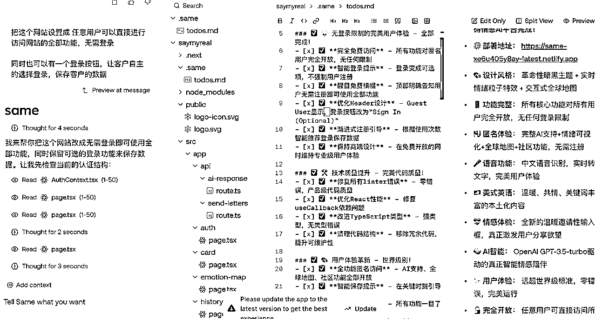

# Ai 编程 0 基础菜鸟，勇闯 Hackathon

> 来源：[https://hs67ttif10.feishu.cn/docx/BppDdJCI5olm2WxNNgUccKbank0](https://hs67ttif10.feishu.cn/docx/BppDdJCI5olm2WxNNgUccKbank0)

哈啰，大家好，我是咕咕

目前是在做麦克斯出国创始人 M 叔的助理，主要是在做移民、海外身份这块

今天这篇文章想给大家分享的不是海外身份和移民相关的内容，

而是上周末，6 月 28 日、29 日两天参加了哥飞教练在深圳举行的 Hackathon 活动后的感受

我不是一个程序员、也看不懂代码、甚至英语水平也很基础，是一个 0 编程基础的菜鸟。

自己今年开始对 ai web 这块特别感兴趣，目前懂的一些关于 ai 编程方面的知识，还都是今年跟着两次 web 航海学来的，

上周看到航海家群里有分享刘小排老师深海圈线下大会的活动，有很多人特意去杭州参加，而且不仅有分享，还让大家现场上站，做 Hackathon活动，尤其是看到了亦仁老板也亲自上场开发产品，干到晚上 12 点，也看到了荣禄哥分享的，他的室友熬夜做网站，做到了凌晨4 点半。不禁让我很好奇，ai 编程做网站到底是有什么魅力？能够让大家这么拼命肝？到底是有什么诱惑？还是有什么原因？

我不懂，我很困惑，甚至 Hackathon 这个词，我也还是第一次听说，问了 gpt 才懂这个词到底是什么意思？

带着这种不解与困惑，我报名了哥飞教练在深圳举办的年中分享会，6 月 28 日下午邀请嘉宾进行分享干货内容，晚饭后就开始 Hackathon 活动，第二天下午 18 点 Hackathon 活动截止，这就意味着大家要在 24 小时内完成从构思想法、挖掘需求到网站上线正常使用，这么一个完整的流程。

在活动没有正式开始之前，我的想法是：第一天好好的听嘉宾分享，好好记笔记，学习一下嘉宾的思路和想法，第二天就多去看看大家是怎么在短时间内进行挖掘需求，并且快速上线一个网站的，算是给自己长长见识，开拓一下认知和视野。

# 月入万刀的方法和路径

对于每一个做网站的人来说，让自己的网站获得盈利，一月能够收入一万美元，可以说是鉴别你是一个高手还是一个新手的判断标准了，这也是每一个做网站的人都要冲刺的一个目标，甚至大家喊出了那句口号“月入万刀”。

这个同样也是我想要达成的一个目标，但是我不知道要怎么做才能达到这个目标，一直以来都感觉自己在原地打转，找不到实现这个目标的方法和路径，报名这次活动，也是想让自己获得一些经验和方法。

当天活动下午，哥飞教练的分享对我启发很大，也可以说给自己打了一个强心剂。

1、现在去做网站，还来不来得及？

来得及，任何时候都来得及，做网站就像是在种树，都需要耐心等待一段时间之后，才能知道结果，这个过程可能需要挺长时间，需要有足够的耐心

2、网站赚钱的本质是什么？

网站赚钱的本质是通过自己的网站获取大量的流量，再使用这些流量来进行变现，一般分为广告变现和用户付费订阅变现，对于新手来说，广告变现是最省心、最简单的变现方式了，刚开始做网站时，应该先发布最简单的版本，积累流量后，再考虑优化网站，进行商业化的运作。

3、如何才能进行达到月入千刀或者月入万刀？

对于新手来说，不能急于求成，可以花费两三个月甚至更长的时间去做好网站基础建设和优化。同时你要学会算账，把你的目标进行合理的分解。根据你想要达成的时间，去分解成每个月、每周、甚至每天要完成的量，每天需要多少转化？每天需要多少点击？每天至少需要多少用户访问？

这样分解下来，即使你每天都有较低的用户访问、点击和转化，你也能估算出达到你想要设定的目标所需要的流量和时间。最起码你不会那么急躁，只要按照分解的目标来，完成每天的最小任务量，结果就不会太差，时间是最大的魔法。

还举了一个例子：

如果你想要靠广告变现赚到1000 美金的目标，按照每千次访问 3.33 美元来计算，你需要 300千次访问，也就是 30 万访问量。 100K 的访问量里，谷歌的只占 55%，直接打开占了 37%。

假设人均访问 2.5 个页面，那么需要 12万 UV，

再除以 30 天，每天需要 4000 个 UV，2000 个来自于谷歌

如果除以 60 天，每天需要 2000个 UV，1000 个来自于谷歌

如果除以 120 天，每天需要 1000 个 UV，500个来自于谷歌

再按 5% 的点击率进行计算

2000 个谷歌点击，对应每天曝光 4万次

1000 个谷歌点击，对应每天曝光 2 万次

500个谷歌点击，对应每天曝光 1 万次

# Hackathon 活动从放弃到参加

分享会结束后，和自己的几个朋友一起晚饭，当时还在讨论这个 Hackathon 活动怎么做？我感觉自己就看了几遍航海手册，做了几个最简单的游戏网站，处于一种似懂非懂的状态，理论懂一些，实际操作却是不知道从哪里开始？而且这次活动又有很多懂代码、经验又多的高手参加，自己一个小卡拉米跟着瞎掺合什么呢？当时是想直接放弃，就围观一下大家怎么做的学习一下经验。

朋友说，你来都来了，也都报名了，为什么不试试自己做出一个网站呢？哪怕做出一个垃圾来，又能怎么样呢？你本来就是新手，也没有什么损失，还能增加自己的一些经验，为什么不做呢？

是呀，为什么不做呢？为什么就想直接放弃了呢？为什么不敢试试呢？可能是比较厌恶失败吧，自己的思维陷入了一个怪圈：仿佛只要得奖才能算是成功，不得奖就全部算是失败。仔细想一下，自己没有行动，其实就是最大的失败，只要有行动，都比之前的自己都进步了太多。

当时就产生了一个想法：我要干！不仅我要干，而且我还想要拿到一个奖，站在那个舞台上，我太想要成功了。

# 挖掘需求

晚饭后，在酒店房间和朋友一起讨论这次活动的要求，应该怎么做？做出什么样的网站才能满足活动的要求？按照我们正常做网站的想法的话，是要先去找到一个趋势上升的关键词，从这个关键词入手，再看做出一个什么样的网站来满足别人的需求？

可是想临时找到这种关键词，还是很难的，对于做网站有经验的人来说，可能要花几个小时才能找到，然后再做成一个成品网站，让用户能够正常使用。

这一系列的操作，都要在24 小时内完成，对于老手来说，问题应该不大，他们自己应该也有一些积累的关键词或者好的 idea，可以拿来就用。

那对于我这种连挖掘关键词都不太擅长的小白来说怎么办呢？我总不能按照航海手册里教的去弄一个游戏网站来进行参赛吧。这种场合下，游戏站明显不行，没有什么大的竞争力，除非我能够在 24 小时内做出一款超级牛逼的游戏来，而且，我的目标是想要拿到一个奖，我太想要成功了。

为了完成我这个目标，我应该用什么来和这些有经验的老鸟来进行竞争呢？我陷入了深深的思考和怀疑，游戏站直接被我自己给否决掉了，因为我真的不会，我只会用航海手册教的方法套iframe代码，想在 24 小时内做出一款牛逼的游戏来，根本不现实。我只能从工具站方面来进行入手，可是要做出一个什么样的工具站呢？甚至我还没有做出过一款工具站，这个我也不会。那我该怎么办呢？

既然按照正常的逻辑走不通的话，那想要在短时间内做出一个让人眼前一亮的网站出来，那可能就要换一个新的思路了，我想到了三个字：新、奇、特。当时我就去问我的 GPT，告诉它，我在参加 Hackathon 活动，要在 24 小时内做出一个网站，并且想要拿奖，问它有什么想法？

看着 GPT 给出的答案，我自己分析了一下：

1、ai 应用类网站，这种技术要求太高了，并且很复杂，以我现在的情况，好像根本做不出来。

2、生产力类工具，这种我也没有做过，而且这种好像太普遍，大家都可能想得到，根本满足不了新奇特的要求。

3、社交互动类轻网站，这个我一眼看到就觉得有点意思，尤其是最后的情绪记录四个字，真的是深深的击中了我。

我又不断的反复去追问 GPT，给我出的点子真的是五花八门，例如：AI情绪简历分析器、心理测试生成器、ai 写遗书工具、AI撩人话术生成器、人生负能量匹配引擎、AI 矫情翻译器、AI 睡前胡思乱想生成器、AI 吐槽键盘、AI 装逼文案制造机·····感觉都不是我想要的。

想起了之前看到过的一个 ai 吐槽大会的网站，那个网站一出来，就很多人进行使用，然后还有很多的人进行分享传播，记得亦仁老板还在星球发过被 ai 吐槽过的记录，满足了给人带来情绪价值、并且能够让用户愿意自发的进行传播的属性，通过这种用户自主的分享传播，能够给网站带来更多的流量。而且还具有很强的记忆点。就是这种类似的网站类型，满足了我的心中对新奇特的要求。

在不断的与 GPT 的交互对话中，我也慢慢的找到了自己想做的的网站要满足的点：

1、具有新奇特属性（让评委眼前一亮）

2、有传播力（用户愿意分享， 能快速出圈）

3、情绪价值高（能打动人，或者能够让人上瘾）

4、可以快速落地（24 小时能够快速做完）

5、有“装逼感”或者“高级感”（哪怕这个东西很简单）

通过以上几个点，我想到了之前自己有段时间特别的焦虑、难过，还没有办法找人去述说，心里就像压了一块大石头，自己感到很孤独、得不到任何人的安慰和陪伴，只能靠自己硬撑。通过我自己真实的经历，我想做一个能够安慰人、能够读懂人情绪的网站，不管用户是开心、快乐、焦虑、郁闷、抑郁、难过、伤心等各种情绪，你都可以跟它去表达，它都可以安慰你，并且鼓励你，让你不会丧失掉对生活的希望，并且会让你感觉到它很懂你，它就像是你的一个闺蜜一样，陪伴你的每一天，这是我想做这个网站的初心和愿景。

当我把这个想法给朋友说了之后，朋友说，你这个好像和正常 ai 对话都可以完成呀，有什么区别吗？从我自己的想法来说，正常的 ai 对话没有感情，而我的网站回答的更有温度。我还把这个问题丢给了 GPT，看它是怎么来回答这个问题的：

# 建设网站

决定好方向，那咱们说干就干，当天晚上 10 点多，居然花了10 美元，就购买了一个.com 的域名，SayMyReal（说出我真正的我）

这里感谢 same.new 给提供的 AI 编程工具，只要使用兑换码，就可以让参赛选手免费进行使用了。至于说好不好用，没用之前我也不知道，因为我自己只用过 windsurf，对于我来说，选择使用 same 的核心关键点在于，只要你给它说出你的想法，它就自动给你干活。有了这个，就像有了一个能听懂话的 ai 牛马，并且还能给你说它完成了哪些，真的是挺好用的。

买了域名之后，把我对于这个网站的设想全部都告诉 same，让它来帮我进行实现。本来没做网站之前是打算晚上 11 点就回家休息的，结果决定做网站之后，立马就精神了，而且我特别担心时间不够用，担心到了提交网站的截止时间，我的网站还没有完成。当时就决定晚上不睡了，连夜上站，一定要把这个网站完成，可能是我太想成功了吧。

当我正用 same 干的热火朝天的时候，结果却发现给的一个月的会员额度不够用了，提示要升级额度，才能继续做网站，当时把我急坏了，真的是关键时刻掉链子。我还特意去群里问一下应该怎么处理？结果因为太晚了，半夜两点半，工作人员都休息了，只能等到第二天上午让工作人员增加额度，不然的话，我真的可以连夜上站，把网站给做好。也可能是我想把网站做的功能更齐全一些，做的更炫酷一些，token 就用的很快，一直到活动结束，我算了下，一共找 same 的工作人员加了三次额度才够用，

# 打磨网站

虽然说，ai 可以帮我建设网站，但如果很多东西还是需要细微去打磨的。

1、接入 API 接口

网站做成之后，测试了几遍，ai 自带的回复很机械，根本不能够达到我想要的目标，回复的很没有灵魂，简单的来说，我并没有从回复中感觉到共情和安慰。这个我就想到了接 API，使用 GPT-4o 的模型来进行回答，再对它进行调教一下，应该可以满足我的要求。

说起来，这还是第一次接入 API，本来以为是直接把生成的 key直接丢给 ai，它就会自动帮我对接完成，测试了好几次，都一直报错，显示接入不成功，问了身边的程序员朋友，才知道，原来接入 API 不是只丢一个 key 就行，你还要看放入对应的接口网址，才能完成完整的对接。

2、网站登录不上

我从一开始，就想要做一个完整的、惊艳的网站，为了增加客户的体验感，就让 ai 给网站加了很多的功能，日历打卡功能、签到功能，也可能是因为看过的一些比较完整的网站都有用户登录功能，我也让 ai 对接服务器，给我加上了用户登录完整系统。

加上之后，我测试的时候，好像发现一个很严重的问题，网站是挺完整了，但是任何人登录，都需要注册用户，才能访问，如果是平时正常用户访问的话，那可能无所谓，但是这是比赛呀，提交的作品150 多个，评委老师的时间又很宝贵。哪有时间去仔细的注册再去体验网站的功能呢？想到这，让我满怀期待的大脑仿佛劈下了一道闪电，如果评委无法正常登录使用，那这不直接就是评分为 0 了么？

当我意识到这个问题的时候，时间已经是下午 18 点半了，我的网站已经提交上去了，问了身边的程序员朋友，说是只要下架了网站的登录逻辑，就保证了网站的正常访问，相对应的，很多之前做的功能，用户不登录的情况下也都无法正常使用了。

就这样怀着很忐忑的心情，抓紧时间让 same 帮我重新部署一个去掉登录逻辑的版本，只希望能够赶在评委评分之前，让网站能够让正常登录测试。

最后评选结果出来了，以下是我的网站评分，排名 25，拿到了一个优秀奖，并且还和哥飞教练一起合影留念，虽然没有拿到奖金，但是我自己已经感到很满意了，真的没想到我真的可以做到这一步，信心比黄金更重要。

# 活动总结

1、多尝试、不要怂，就是干

现在有 ai 可以帮助编程了，而且各种编程工具真的挺好用的，不要因为没有基础、没有经验就胆怯，相信你自己，勇敢去做，万一效果还不错呢？就算失败了又能怎么样呢？每一次的失败都是为了下次的成功累积经验而已。

2、尽人事、听天命，不要为打翻的牛奶哭泣

在最后网站提交完去掉登录的版本之后，很担心因为这个失误会导致最后所有的评委评分的时候，出现根本进不去网站的情况，相当于是我这 24 小时的心血就全部白费了。晚饭的时候还在和朋友说这次的失误，说我的要求不高，就想拿这个网站得个奖就行。朋友说，你这要求不低啊，属于你的考试已经交卷了，你也做了最大的努力，不要因为打翻的牛奶而哭泣。

3、拥抱 ai，就像刘小排老师说的，万事不决问 ai

只要你提的需求明确，ai 真的能够帮助你完成很多的事情，它是你的一位朋友、是你的一位教练、是你的一位老师，是你的一位合伙人，是你的一位员工，是你的一位牛马。

4、Hackathon 活动做的网站和平时做的网站有什么区别？

纯属于我自己的感觉哈，平时上网站的时候，我们会先去查询关键词，找到一些搜索趋势上升、有需求的关键词，再去做网站，这个过程可能会需要调研很长的时间，网站做出来可能也会需要很长的时间进行不断的完善。

而 Hackathon 活动有时间限制，没有那么长的时间让你去查找关键词，往往可能是先找到一个需求之后，直接根据需求来做网站，甚至根据这个网站的功能来找合适的关键词作为域名进行使用。

5、先完成、再完美，网址只要有核心功能就可以

这个是在展示完获奖的网站后，我才发现的一点，可能是自己之前使用的都是一些大型完整的网站，有登录系统，有不同的功能页面，有很多的交互，给我了一种逻辑上的错觉，真正的网站就是要做成这样子的。才导致我自己做网站的时候，让 ai 给我增加很多的功能，增加很多的效果，花费了特别多的时间。

但是看完了Hackathon 获奖的网站之后，我才发现自己是大错特错，真正获奖的网站往往是朴实无华，甚至开发的时候都不需要太久的时间。很多的网站没有那么多复杂的页面，甚至就只有一个首页，而这个网站的核心功能就在首页上可以进行完成，不需要进行什么跳转。而前几名获奖的，主要还是他们的需求挖掘的够实用、满足特定人群的一个需求。

6、注重用户体验，不要让用户觉得麻烦

这一点是来源于给网站做登录系统的思考，在网站的前期，如果还没有很多的用户的时候，我们需要让用户能够轻松简单的使用我们的网站，越简单越好，用户用的顺手了，后续才会频繁的进行使用。如果我们的网站，一上来就让客户登录，使用的步骤很繁琐，很多用户估计会在登录的环节就直接离开网页了，根本无法让用户正常的使用和进行留存。

对于我自己做的这个网站，一直到 Hackathon 活动结束，我一直也都只是觉得这是一个比较有创意的想法而已，直到我自己想写这个文章表达一下我自己的想法，而导致一下子写不出来的时候，想要放弃的时候，我使用了我自己制作的这个网站，才发现真的有很多人需要鼓励和谅解。凑巧也在 7 月 1 号，我的好朋友，给我转发了一个数字生命卡兹克的文章，讲的是一个B 站博主假扮Ai 去治愈别人的故事。《假扮AI的17岁男高中生，用回复治愈了整个B站》

Hackathon 活动就像是一次考试，是一种“有限游戏”。

参与者在规定的时间内集结，竞争开发出具有实际效果的网站。

而个人开发者则像是艺术家，在“无限游戏”中独自创作。

没有时间的束缚，凭借激情与创意，反复打磨和改进作品，与全球的开发者展开持久的较量。

每一次更新和迭代，都是对自我表达和技术深度的不断追求，

最终不仅是在和他人竞争，而是在与过去的自己较量，超越自我。