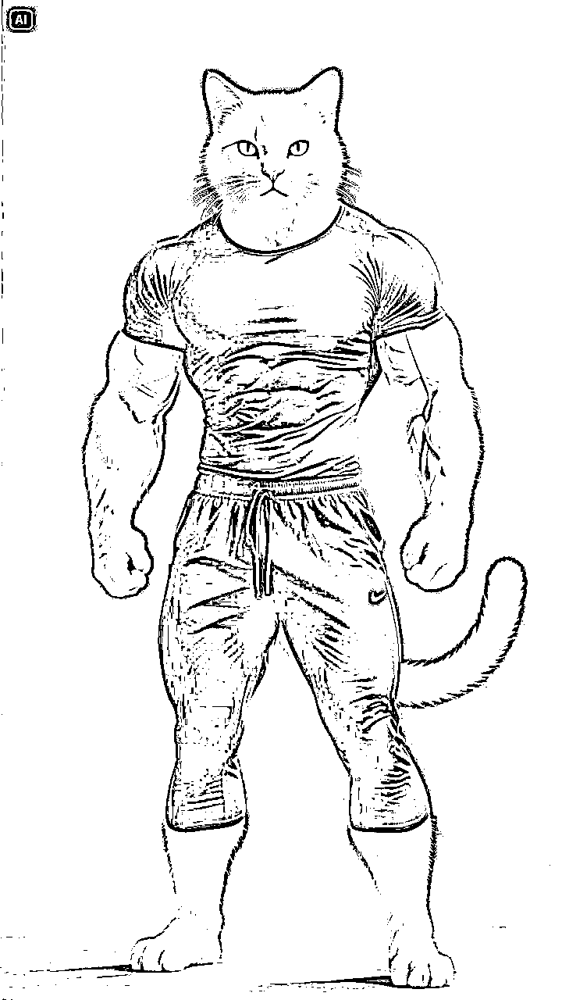
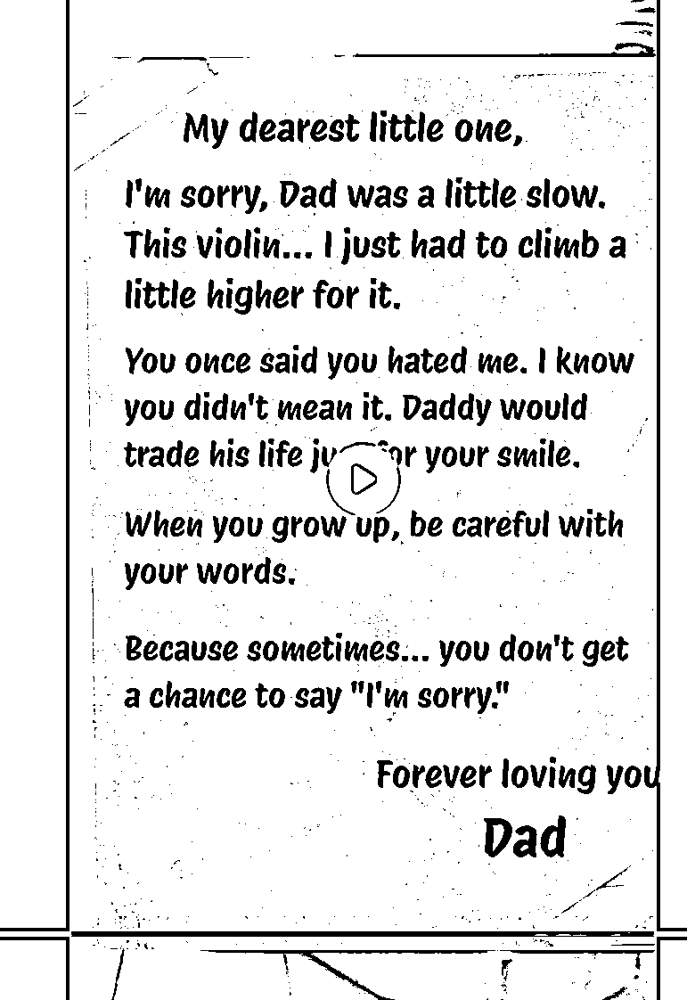

# [YouTube新人必读中级篇】如何在一个月内做出千万级别爆款shorts开通高级YPP

> 来源：[https://mcnr6xiwpsl7.feishu.cn/docx/CAYIdt3fJoBw8mxL8HJcJ4sEn60](https://mcnr6xiwpsl7.feishu.cn/docx/CAYIdt3fJoBw8mxL8HJcJ4sEn60)

hello，大家好，我是逸尘，YouTube新人，在航海结束的第二天，也是我的第二十三个作品，达到了千万级播放，截止目前，已经有了六千多万播放，五万多订阅。

之前写第一篇帖子：https://scys.com/articleDetail/xq_topic/5125442228188414本来想到百万级播放再发的，但是没拿到精华帖，当时觉得有点可惜，现在看来，当时做的确实不够好，因此写了这篇中级贴——如何从0-1做出百万级甚至千万级播放。这篇帖子是借鉴了上一篇帖子的部分内容，从而填补了更多缺漏，所以不需要回过去看上一篇。

# 一、前言

表面上我仅仅用了25天，做了23个视频，一条视频就达到了六千多万播放，看起来是不是很快？

但是你不知道的是我背后迭代了一个一级细分赛道，十五个以上的二级细分赛道，三级细分赛道就不用说了，基本上每个都是迭代后的作品。本篇帖子我先讲实操，再讲心得，望给诸君些许灵感。

本篇帖子必将穷尽我所知道的东西，不会有藏私，包括我的频道、对标频道、新的方法、具体处理（都会在帖子最后一起呈现）。

为什么我敢这么做？

1.说得残忍一些，我就算让你抄，你也大概率抄不出来（最后再讲）

2.我仅仅用了二十多天就迭代出了中级篇，那么我在此基础上继续成长积累的速率肯定是更快的，这些内容对我来说不值一提

3.如果有朋友能解决我的一些疑惑点，那我岂不是赚大了

4.我如果帮你开通了YPP，是不是得给我发个红包，这条纯开玩笑，请无视嘿嘿嘿😜

本篇帖子于我期末考试中忙里偷闲整理出来，如有不足，请大佬们多多斧正，小弟素来，闻过则喜。

# 一、找赛道

找赛道的时候有一个误区，就是先去学习自动化工具，我个人觉得是不明智的，首先是有技术门槛，会浪费大量时间；其次，你的目的是找一个合适的赛道，仅仅一个！就算你自动化爬取了几万个，你最终只选择一个，能懂我意思吧。（这种高级操作应该是YouTube方向战略官应该考虑的事）

万道同理，找赛道也就讲究一个“低量爆款”，“低量”也就是作品数量少（控制在30个以内），“爆款”，对于我来说，每个视频基本上得有千万级播放，甚至亿播

很简单的道理，如果一个对标账号只有一千万的体量，你去学他，最多也就是个百万级，如果他是亿级，你就可能达到千万级

至于怎么去找，我结合百家之长，总结了我自己的经验：

1.开几个号一起多刷shorts，找尽量感兴趣的视频，至少最后视频做完的那一刻你的心情是愉悦的，被视频内容给折服。

2.看标签，视频下方的标签挨个点进去看，是否同类爆款视频比较少，说明这是个蓝海赛道

3.刷到感兴趣的，订阅点赞，那么系统会给你推荐同类视频，如果你发现这一类视频最近都比较爆火，播放量很高，而且视频数量比较少，那么或许就是你对标的方向。几个号这样子操作，你就能拿到几条你比较感兴趣的赛道方向，最后择一最优进行决断

总结：同类少，订阅多，播放高，感兴趣

# 二.拆爆款

拆爆款必须借助Google ai studio这一神器：https://aistudio.google.com/

不熟悉界面的朋友们可以看我的上一篇帖子：https://scys.com/articleDetail/xq_topic/5125442228188414

要想成为一个合格的youtuber，你就得学会抄作业，如何做是重点，很多人败就败在了“抄”这一步，这一步其实是重中之重，必须十二分重视（我最开始就是不重视而走错方向，幸好得到我一位好朋友的及时提醒才悬崖勒马，我在帖子最后单独感谢）

下面开始拆解赛道的具体教学：

## 1.利用GAS进行对标频道的整体分析

GAS是能同时点击“+”上传十个视频，这一步非常好操作，直接复制对标频道的所有爆款视频的URL，然后Ctrl V粘贴到对话框。（记住，爆款视频一次性粘贴的越多越好，数据越多，GAS分析地就更全面，就能拆解地更为细致）

这一步注意了，“十个”视频，只是历史最多只能上传十个，但是如下图所示，你只需要在之后的对话中把多余的视频delete，你就可以继续上传视频分析了。（而且之前的记忆会保留），这一点真的屡试不爽。但切记，只能历史十个，要不然你就无法继续对话了，它会显示internal error（但其实你删掉多余的视频就可以继续用了）

下图，就是我拆解今天做的视频，也就是上述我发的第一个视频，我把对标账号的120w播放以上的视频全部丢给了GAS让它帮我分析。（一个对话大概20w Token）

通过这个操作，你就能指导这个爆款频道的内容大概讲了什么，如果需要制作，能通过什么方法制作。

GAS会事无巨细地告诉你。

通过上述操作，这一个对标频道讲的是什么内容，为什么爆火，采用了哪些技巧，大概就能知道个七七八八

## 2.揆诸己身，能胜任否？

你需要再次观看对标频道的爆款视频，观察它的每一个细节：内容、音效、BGM、转场、滤镜、特效，是否是以你自身的技术能完成的？如果不能，但是确实对这个频道很感兴趣，提供一解

把这个视频发给GAS，让它告诉你某一帧采用了什么技术，怎么完成，如果你看得懂GAS的分析，那么就代表你也可以完成，那么就能做。不要怕，所有能力都是从有到无，不会就学，关键在于敢于去做have a skin in the game。No what, no why, just how to do it！

## 3.微创新——做最小的手术（文生图分镜头创作）

我的初级篇的内容，就犯了一个要命的错误，我对对标视频进行了大概百分之八十以上的修改，仅仅保留了一些非爆款元素，这才导致了前期的踟蹰不前。

前面也说了，“抄”才是最大的学问，不要创新！不要创新！不要创新！

我的意思是指不要把你的天马行空的想象用在这里，只做最小的微创新，动最小的手术——只换人物主体（不要换的太离谱）或者就换一下服饰就好，背景也可以适当修改，但是不得影响视频的主要内容

具体操作如下：

### 1.分解

GAS输入对标爆款视频URL输入提示词：（这个提示词在前人的基础上我打磨了很久）

拆解这个视频的每一个分镜，给我生成能完美复刻的文生图提示词，图文生图描述词原则：

用连贯的自然语言描述画面内容(镜头【远景、近景、中景、特写等等】+主体+行为+环境等)

文生图描述词示例：(中景，一只白色的大胖猫，在躺椅上戴着墨镜，手拿酒杯躺着晒太阳，身上盖着浴巾，背景是大海。)

注意：每个镜头独立描述，因为我进行生图的时候是独立进行的，所以所有主角的提示词在每个镜头中保持一模一样，不得有一个字的不同；此外，具有相同环境的镜头对于环境的提示词必须保持一模一样。（比如在同一个房间里面，有两个镜头，那么这两个镜头对房间的描述词必须一模一样））

### 2.检查是否有遗漏的分镜

GAS不一定能一次性输入所有的分镜头，所以需要再次观看视频，检查是否有遗漏的分镜，如果有，通过截图或者关键帧捕获工具捕获，然后让GAS添加

### 3.微调人物细节（这一步看你做的视频）

我一般会给人物换个服饰啥的，或者直接换主体人物，这一步其实要看具体情况，不能一概而论。具体操作的时候把“（某个人物的描述词）”换为“（你想要的人物的描述词）”。

### 4.文生图细节补充

上述出来的文生图提示词其实还不够详细，也就是太过于简单，元素不够丰富，也就需要我们对文生图提示词进行优化

提示词如下：（这个根据自己的来调整，我只是举个例子）

你现在来帮我修改一些分镜的提示词。比如，我需要你帮我变动一下每个分镜的背景提示词进行微调（比如说，第一个镜头，背景是背景是模糊的、带有大片草坪的现代化别墅和绿树，你就可以给我增添一些别的不影响画面的事物，对整个画面进行微调，但不要影响故事的主体和主要内容展现，主要是为了避免抄袭的嫌疑。如果你没明白微调的含义，我再举一个例子，镜头10在一间被摧毁的现代化卧室里，你就可以对这个卧室里面的陈设以及颜色进行一下描述，来修改一下这些不是很重要的元素，使得整个画面的主要内容与对标视频相同，但是次要背景与对标视频不同，有效帮助我进行二创）

### 5.细节完善

这一步就更随自己的意了，就是哪个地方你觉得不好看，想换个颜色之类的，你就换就得了，描述得越精准越好。但是这一步也很重要，很多微创新就在这一步，某个颜色或许就是你的千万爆款甚至亿级爆款的钥匙。

特别注意景别设置，远景、近景、特写、仰拍、俯拍，都很关键

### 小结：

这一步看似不起眼，其实决定生死，一般我自己去操作，刚开始会花1-2个小时，静下心来，慢慢做，你若静心，花自盛开，每一次精心的雕刻都是伟大艺术品诞生不可或缺的步骤

# 三、文生图

这一步，也很重要，因为图片决定了观众对你的视频内容的直接感受，所以需要反复抽卡、打磨。一般也会花费1-2个小时

但是，效率至上，通过反复打磨提示词，让上述百分之八十的文生图提示词非常精准，生成出来的图片大多数一次过（生图的时候有细微修改）。

磨刀不误砍柴工，打磨好提示词再谈生图，效率翻一倍不止

## 1.抽卡

这一步一般有三种便捷方法（两种免费，一种付费）

### 1）豆包一次性出图

具体方法参考李澹归老师这篇帖子，我就不再赘述https://scys.com/articleDetail/xq_topic/1524488222818842

### 2）即梦批量出图

具体的方法还是李澹归老师的另一篇帖子，这里真的十分感谢李澹归老师让我节约了不少时间：https://scys.com/articleDetail/xq_topic/2852211242585521

具体的方法我就不再说了，就给大家几个小的注意的点（贴子里没写，读完帖子再来看我的注意事项）：

1.每次重新登陆都必须再次点击“添加账号”，然后才能用

2.有些图片生成出来时空白，这时候不用继续生成，因为你的即梦账号本身是生成了的，你去网页的即梦里面就能找到了

### 3）批量出图付费工具

需要付款，需要的圈友可以去试一试这一款Chrome插件，支持GPT/即梦/MJ等主流生图工具，自动操作，加速效率。

这是官方文档：https://www.yuque.com/autojourney/docs/pkil2i72vcqfweld

Chrome商店搜：AutoGPT

## 2.对抗顽劣的图片

虽说大部分图片都能生成，但是确实有一些图片就是某个角度不对，或者服饰、身体之类的不对，我的应对方法一般有几种：

#### 1）反复抽，字面意思

#### 2) 精修提示词

这个其实比较看个人感觉，就是仔细观察你的提示词，你觉得通过哪里能修改正确就该哪里，反复生成到成功为止

#### 3）更换不同的生图工具

gpt（sora）、豆包、即梦、runway、海螺、可灵、MJ都是你可以选择的，多去尝试

#### 4）截图法

把你想要复刻的图片截图（或者关键帧）下来，发给AI，然后加上提示词，这样成功率会大一些

## 3.去水印

注意：开通了即梦会员左上角仍然有“AI”的水印，所以去水印在所难免，我这里推荐三款去水印好用的免费工具，

如果不考虑质量的话，我直接推荐一款google商店的插件（720p，对我来说有点无法接受）

第二款和第三款画质没变：

第二款完全免费，第三款不知道是否完全免费（至少我现在用的次数它是免费的）。它们的缺点都是一次只能去水印一张图，所以可以同时用。

https://online.niuxuezhang.cn/online-photo-watermark-remover/detail/

https://www.arkthinker.com/zh/watermark-remover/

## 4.解决人物一致性问题

我其实不止用即梦生图，只是在山海经这个内容上，由于主体不具有一致性，所以我用即梦生图一点问题都没有。

但是往往很多视频（比如故事类的视频）是有较高的人物一致性要求的，所以我采用了以下方法来解决（在我尝试了很多工具之后，包括但不限于gpt、即梦、可灵、豆包、runway、vidu、智谱清言）

我直接说结论：

由于我没充MJ，所以以下内容均不是最佳答案（最佳答案就是充MJ，这就是AI和所有创作者公认的最好用的控制人物一致性的软件）

1.gpt

2.runway

只有这两个很不错。只需要先把你要当做主体的图片上传给他，比如一个猫爸爸和猫猫的视频，我就先上传给了gpt和runway。

然后告诉它们，使得图片中的角色作为以下文生图提示词中的主体，再给出相应的文生图提示词。就能比较顺利地生成了。

由于gpt（大概一个号生成不超过10张图）和runway（最高1080，一次消耗积分8【720p消耗5】）使用次数有限，所以想要白嫖，就得多开几个号。如果不差钱，就结合我上述推荐的Auto工具，直接猛猛干！

# 四、图生视频

## 1.图生视频提示词

这一步，其实有朋友是有误区的，包括之前的我也是，为了节约时间，在生图的时候就把已经生成好的图片结合图生视频提示词去生视频，这其实是错误的，因为这一步有个（隐藏）方法，可以提高视频生成的精准性。

假设我们现在已经得到所有的图片，我们就可以把这些图片再次导入Google ai studio（GAS）让它根据图片来生成图生视频提示词

* * *

因为这里我之前给过它提示词了，所以没有给详细提示词。我的图生视频提示词如下：（自我觉得比较好用，这个也是结合了浚哲老师的提示词描述方法，浚哲老师确实很厉害，建议大家去看下他的剪辑直播回放，他能把不起眼的即梦玩出花来）

你先给这些图片进行排序，然后根据故事内容给出最合适的用即梦图生视频的提示词（提示词要求如下：运镜方式【拉进、拉远、左推摇镜、环绕运镜、跟随运镜等等】+人物或主体的动作+人物的表情【所有的人物可以指动物主体】，所有的提示词都要连贯的用一句话输出，不要有非必要的形容词

* * *

## 2.图生视频

图生视频我主要充了即梦、智谱清言和可灵，豆包免费试用（一个账号每天10次），海螺更新了，效果嘎嘎好，每个账号送500积分（20个免费视频，速度快，效果大于等于可灵，无限google账号无限薅）

排名：海螺>可灵>即梦>智谱清言/豆包

即梦更新了pro模型（50积分一次，效果一般），不推荐使用

即梦的优点，生成音效功能最近是免费，一个视频三个音效，爽！

多用海螺，真的无敌，最近一直在薅羊毛

白嫖玩家也能玩！

# 五、剪辑

## 1.google ai studio助力剪辑

这一步不比我多说，就是看大家的剪辑功底的时候，但是，有一个但是！你只要擅用Google ai studio你就算是头猪，你也能学会高端的剪辑技巧，今天就给大家上一课。

就是大家看一下我刚开始的第三个视频末尾的回忆片段，我当时看到对标视频的这个片段的时候就觉得好高级，做不来，结果，我把视频丢到GAS，它马上就手把手教我用剪映把这个效果做出来了，由于当时的对话我没保留，就不好分享图片。但是，我想强调，只要你看到某个对标视频的效果，把它丢给GAS，它真的就能一步步纯小白都能懂地教你剪辑技巧

## 2.音效搭配

做动物视频的朋友们都知道，音效在故事里面至关重要（因为没有对话和字幕）。所以好的音效可以说决定了一个视频百分之三十的成败。

但是，思考搭配什么音效是一个比较困难的事情，老是在剪映的音效库里面搜索，却找不到称心如意的，那么这时候，有两个办法

### 1）GAS

把视频URL丢给他，让它分析给出合理的音效

然后，我们照着GAS给出的音效名字去剪映搜，就比较快捷了，一般都能找到合适的。

### 2）网站音效库

这个我更常用，打开爱给网网址：https://www.aigei.com/ 搜索想要的免费商用的音效，挨个试听，下载

### 3.剪辑细节

剪完了，不要感觉自我良好，先去找对标视频，看一下是否还有与它不一致的地方，尤其是转场、音效、色彩

# 六、反思-提升

是不是到这你就觉得完了？该上传视频了？其实不然。

你这时候应该把你的成品视频最后上传给GAS，让它对比对标账号的爆款视频对你的视频进行评价，找出不足，进行查漏补缺。

我的提示词：

* * *

除了最后一个猫咪的，封面上有2016/2021/2160的标志的视频是我自己做的。其他视频都是来自一个youtube的美国山海经频道的爆款视频（长视频最低120w播放以上）。我模仿的对标视频是这个频道。现在我想把我的视频上传到youtube上，但我自己感觉我的视频似乎不太吸引人，所以我想让你帮我分析一下我的视频和前面视频的差距。你可以参考以下内容进行分析：评价一个真正优秀的YouTube长视频，意味着要进行一次全方位的审视，这个过程始于其核心内容与叙事，即选题立意是否兼具价值性与新颖性，其结构是否拥有强劲的开篇吸引力和严谨的逻辑框架，并通过张弛有度的播放速度与节奏和自然的转场衔接，来呈现其经过深度研究后得出的、事实准确且观点极具说服力的信息。在此基础上，卓越的视觉呈现是必不可少的，它要求画质高清且画面稳定，构图与运镜富有目的性，光线运用专业且能烘托氛围；同时，剪辑不仅要保证流畅更能创造节奏感，并有效利用高质量的B-roll补充画面、精美的动画特效和统一的调色风格来强化信息与美感。与之并行的，是同样重要的听觉体验，这体现在人声的绝对清晰与整体音量的精妙平衡，创作者富有感染力的发音、语速、语气和情感表达，以及与内容贴合的背景音乐和功能性与适度性兼备的音效设计。最后，视频的专业高度则体现在对整体质感的打磨上，包括准确易读且经过精心设计的字幕，从片头到片尾都毫无瑕疵的细节完成度，最终让所有元素和谐共振，共同铸就一部真正经得起推敲的、完整的作品。

* * *

上面提示词中的后半部分，其实也是让genimi帮我生成的优质长视频必备元素（感兴趣也可以之后分享）

然后，GAS就给了我相应的修改建议：

太多了，就不一一呈现，反正，我又去剪映里面修改了一下。哈哈，然后又出了第二版成片，才上传的Youtube。

注意：这块导出视频的时候就选择480p、25fps就行了，因为只是进行视频的诊断， 不需要太高质量。这样可以加快上传速度，提高效率

# 七、上传视频

## 1.导出配置

按照我这个就行了，不需要太高的分辨率，对播放量没有任何影响

## 2.标题和说明的生成

### 1）GAS

标题其实能为视频增加曝光量，因为一个SEO优化友好的标题，观众能通过关键词搜索，从而得到更多曝光。

说明虽然不能增加曝光量，但是某种程度上能提高点赞量，因为如果在说明里面描述一下剧情，那么观众可能能更好地理解故事的内容，从而提高点赞率。

### 2）对标微创

找到对标视频它是怎么弄的，你就怎么弄，然后稍微可以丢给AI润色一下，但是不要改具体的内容（我一般是用的豆包插件，因为就在网页上很方便，具体操作，看我这篇帖子：https://scys.com/articleDetail/xq_topic/8852484828841522），然后把标签和表情符号也可以按照视频风格进行适当的微修改

### 3）发布时间和地区

我觉得设置IP成美国，可能比较好，因为刚开始的几万流量都是美国的，可能之后的美国观众会多一些；但是也有不好的地方，想要杀出美国观众的审美，是很难得，就看自己的抉择了

时间的话，多去尝试，每天换着不同时间发，或者几天换一次，看下啥时候发最好，最好不要预定，直接发。如果视频爆了不用担心这个问题了——啥时候发都有大量流量。

### 4）封面图

shorts其实不太注重，用手机版改缩略图的时候选取视频里面你觉得最精彩的一帧就可以了

# 八、小技巧

嘿嘿，我最喜欢分享小技巧了，之前分享过AI提效的小技巧，没拿精华有点遗憾，大家可以读一读啊：

https://scys.com/articleDetail/xq_topic/8852484828841522

## 1.YouTube下载：

这是一个YouTube对标视频页面，

点击上方的URL

删掉，ube，然后回车，神奇的事情发生了：

出现了这个界面，可以下载音频和视频。

但是美中不足，视频最高能480p，音频最高128kbit/s。但是如果付费的话最高能享受8K清晰度，包年9$一月，包月12$，更适合大佬玩家。如果只是想提取个音频啥的，倒是够了。

如果不追求过高清晰度，就使用这个网站：

https://tiqu.cc/还是比较好用的

本来还想写很多的，发现一部分已经融入在前面的内容里面了，比如去水印。

2.canva制作封面以及做内容

其实长视频的封面是需要打磨打磨的，比如我这个

就是我精心用canva打磨的，首先，我之前做视频的时候生成了16∶9的图片，然后可以使用即梦的扩图变成9∶16（记得加超清）。然后再咸鱼上买个canva的会员，一块钱。就能直接选择制作YouTube封面：

我觉得还是挺不错的。然后就是拼接上述生成的图片，这个很简单，拖动一下就好了。然后高清下载。

## 2.除了生成封面图，还能做视频内容

可以看到我最开始的熊猫最后一个回忆的片段有这样一个画面：

这封信其实也是canva做的，只需要找一个牛皮纸模版，然后修改一下，添加英文内容即可。做视频的时候弄关键帧就能做出视频中的效果

# 九、反思提升-数据分析

每一天都要仔细反思前一天的数据，手机端和电脑端都可以，看以下两个重要指标：

1.“继续观看”（很重要，跑到千万级别以上的都是75%以上的留存度我估计。然后看哪几秒下滑了，然后去优化内容）

2.热门地理位置（决定你的revenue，大爆款印度不可避免，不用刻意去规避）

3.“观看次数”，这个我就不多说了

就只需要研究这三个就好了，不断反思，总结，剖析自己的问题，进步！

# 十、YouTube认知篇

## 1.大局观

其实航海手册教的是具体的内容，而没有教你如何成为一名合格的YouTuber

想要了解一个正常频道的增长规则具体可以看这个视频：

https://www.youtube.com/watch?v=LAn78RHRLYI

大概就是有几个增长期，你要不停地更换细分赛道，不断去尝试，才有可能一次次突破，获得爆款，彻底起飞。（我自己的赛道，就有一个小爆发点，和一个大爆发点，我可能算是比较快的，我只有六位数和八位数的视频，一般人还要经历1-2个七位数的阶段）

总之：在持之以恒中不断突破创新

只有对自己的频道有一个具体的掌控，才能以此为根基，不断茁壮成长

## 2.不要盲目追求自动化

完全自动化的内容是不长久的，而且绝对不是优质视频，这就是一个慢性死亡的过程，我们可以在某个步骤提效，但绝对不能完全交给工作流，以后或许可以，现在绝对不行，一个真正的优质作品是需要注入情感的（细品）

## 3.坚持创新，不要墨守成规

先“守”到七八十分，然后再“破”（借助小排老师名言了哈），“守”就必须先进行像素级模仿，音效、BGM、转场、特效、字幕、字幕动画、滤镜……，“破”指的是微创新——颜色、服饰、背景……，做好这两点你就是一个千万级播放的大佬了

每一个作品做完之后，睡觉之前，反思每一个细节，也可以用电脑或者笔记本记录下来，对自己的情况做一个深度的剖析，敢于面对自己。有时候自己陷入了“假勤奋”而不自知，陷入了“假创新”亦不自知，那么解决办法就是深入思考每一个细节，思考它的作用，是否真正有价值？越深入，收获越大。但是这种反人性的任务就需要强大的内心了

## 4.不要自己蛮干，多去寻求帮助

不知道是否有很多人像我刚开始一样，就想凭借自己的“聪明才智”偷偷地把一个东西按照自己的想法做出来，然后出爆款震惊众人，我最初做Youtube就是这样的，但是这样就会掉入一个巨大的陷阱。

遇到卡点，明明有资源却不善用，是很蠢的，有那么多圈友，那么多的教练，那么多的朋友，别不好意思，去问他，他不理你，就换个人问，总会有好心人的，相信我！（但是我遇到的每一个圈友都给我细致耐心的解答，真的很感谢）

君子生非异也，善假于物也

## 5.不要限制资源认知

我刚开始仅仅只从生财里面找YouTube的相关内容，虽然生财里面确实沉淀着很多精华，但是外面仍然有很多卓越的YouTube创作者，他们的经验依旧可以汲取，YouTube频道上搜索那些讲解AI视频或者YouTube频道增长方法的中长视频，每天花半个小时去看一下，做好笔记，你会收益良多

YouTube的中长视频就是学习的宝藏库，类似B站，但有更多海外的干货

## 6.舍得投资

“我觉得没赚到钱之前就白嫖，赚到钱后才购买”，这句话真的很错误。如果你想通过这些付费工具获取收益，那么你就应该和它进行价值交换，不投资无收获

投资的好处：

1.初浅：图片、视频质量高，速度快，内容好

2.深层：越是付费，越是会激发我的动力，因为是saas制的，每天都会迫使我去做，因为我要榨干我的每一点投资，使用的时候也越会三思而后行（不舍得浪费），从而优化某个步骤

## 7.特别鸣谢（排名不分先后）

1.“远鹏”（生财编号143375）

我的盲目创新之路就是鹏哥帮我指正的，如果没有鹏哥，我可能在一条创作的路上越走越远，陷入无尽深渊。幸得鹏哥指点，返回正途。鹏哥也帮我修改过我的第一个小爆视频，真的十分感谢！！！❤️❤️❤️

2.“李玖玥”（生财编号145557）

李教练真的是一个热心肠的美女，我的一些YouTube的专业问题都是问的李教练，非常热心得给了我细致的解答，没有嫌我烦，真的是大好人❤️❤️❤️

3.“浚哲”（生财编号178416）

浚哲老师的图生视频的运镜方式以及一些剪辑的技巧确实给了我很大的启发，也为我的爆款视频奠定了根基，建议所有人看回放！！！❤️❤️❤️

4.“李澹归”(生财编号95052）

李澹归大佬的自动化确实十分牛逼，帮我节省了不少时间，特别感谢❤️❤️❤️

## 8.我的账号以及对标频道

我：https://www.youtube.com/@MeowStory1101

对标频道其实有很多，我就列举两个：

https://www.youtube.com/@SuperCatPapa

https://www.youtube.com/@Meow0786

说不定很多圈友和我抄的一样哈哈

这里我也解释一下最开始说不一定抄袭的了的原因，因为我的爆款视频我觉得顶天了就是几十万的播放量，再小爆一下，但是冲到了三千万以上，这绝对有运气成分。

还有就是我文章里面的这么多细节，你真的做视频的时候全部考虑到了吗，如果考虑到了，相信我，不是你的问题，坚持创作，相信时间的力量！如果没有考虑到，希望这些内容能促使你进步，不久之后开通YPP

# 十一、一些感想

其实这篇帖子应该结束了，但是写完了，我有一些话也想借这篇文章说一下，四个月前我真的就是一个只会打游戏、追剧的废物大学生。但是我在寒假的时候遇到了我的人生一个重要节点——生财有术

听完试听课后，我一点不带犹豫，我拿了三分之一的手上能支配的钱购买了门票。在此之前，我被狠狠割了两次（总计五位数），生财试听课的内容比我之前学到的都多，果断加入

然后，整个人就坐上了一辆快速高铁，如果非要我用可视化的内容作对比的话，我就简单对比一下吧（其实是我自己相对比哈哈😜）：

四个月前：

大家好，我是逸尘，今年十八，亏了五位数

是的，一片白纸

今天：

自我介绍：

【微信昵称】逸尘

【所在地区】重庆渝北

【自我介绍】06 西政在读，AI应用热爱者，web网站初级玩家，正在做YouTube，

第一次航海写web精华帖、第二次航海YouTube，一条视频突破高级YPP开通门槛（刚达成）

【精华主题】精华帖主题分享：如果做一个接入AI功能的站？如何做一个UI精美的站？ https://t.zsxq.com/yZ9kc

星球同名，中标4篇

当然，上述的图片内容纯属是我在做可视化图片的时候的小玩意儿，提供我自己情绪价值的，没啥参考意义。

我真正掌握的可比上述多了太多，我就不一一列举了

生财带给我太多，远远不止一张门票的价格。

我也在朋友圈立下了flag

再谈谈生财带给我的东西吧

## 1.广阔的认知

如果没遇到生财，我可能一辈子就是比较稳定的道路，一路走到黑。或许我的性格在某个节点会促使我改变，但是肯定没有现在这么快。虽然我还在原来的路上，但是有一只脚已经踩在了另一条路上了。

“生财大学”让我逐渐认知到社会的方方面面，销售、岩浆、写作、剪辑、运营、出海……我正在不断提升自己，让自己变成一个六边形战士

## 2.遇到志同道合的朋友们和贵人

在大学里面的时候，我经常觉得周边的人太蠢太天真，以前的我可能会因为某件事和他们争吵的不可开交，但现在，我只是一笑了之。只要人不犯我，我便不犯人。

我很庆幸，百分之九十九点九九的大学生都在“岗位”这个赛道上内卷的时候，我进入了另一条道路

过去经常感到孤单，周边没有人能理解我，包括父母

但是，加入到生财后，无论是生财的长辈（“羊羊羊”杨哥）还是生财的朋友们（我的偶像：“小易”等），我都能很愉快地和他们交流，感到孤独的时候，我就去骚扰下我偶像哈哈，别打我😭

贵人，嗯，准贵人吧，还没有彻底报上大腿。也就是杨涛“涛哥”，昨天去参加了涛哥和雪姨组办的生财线下，听涛哥讲了四个小时，我感觉我的认知面扩大了一百倍不止，生财是我的重要人生节点，涛哥就是我的另一个重要人生节点，昨天的我就在“还能这样？”“这么离谱”中度过

听君一席话，胜读十年书 不过如此

每天开始做沉思录，瑾遵涛哥教诲

## 3.更多的机会

举四个例子：

没有生财，就没有我第一次航海的web网站，就没有AI 编程，就没有我可能关注某个出海公众号（似乎是哥飞大佬）的可能性，就没有看见一篇关于全国最大黑客松比赛的可能，就没有我七月份去杭州参加黑客松，认识更多厉害的同辈人的可能，就没有重新彻底唤醒我的创造能力的可能

没有生财，就没有我结实到一位生财的西北政法大学的一位圈友的可能，就没有我认识到【何者法律科技社区】（全国最大法律科技社区）提前认识到很多法律行业的大佬的可能，更没有能和他们一起参加到法律AI共创内容的可能

没有生财，我就是一个彻彻底底的i人，线上唯唯诺诺，线下还是唯唯诺诺。有了生财，我锻炼了自己的表达能力、沟通能力，更有自信在别人面前讲话（相对不是很牛逼的人），如果是涛哥的线下聚会，昨天我还是怂了，争取下次不怂，去要个合照

没有生财，别人让我干一件事，我一般会说“我不太会啊”“我好像办不到”，现在，尤其是听了涛哥的线下讲话，“No what，no why，just how to do it”深深印入我的脑海。现在，别人找我会议里面发言一下，线下当众发言一下，我都是“好的，没问题”。涛哥昨天有一段话我印象特别深刻，亦仁大大去让涛哥演讲，涛哥“前有狼后有虎”——被另外两位大佬夹在中间，但是涛哥去完美地完成了。然后事后亦仁大大问涛哥会吗，涛哥说他不会但是他可以学（似乎是两件事，但是没关系，我给他串成了一个故事🤣🤣）

我之前也在这么做了，但是之后更要坚定——大佬叫我做一个什么事，管他会不会，我先答应下来，然后去学，我一个月开通高级YPP，难道学习能力很差吗？

两句话与诸君共勉

大鹏一日同风起，扶摇直上九万里

金鳞岂是池中物，一遇风云便化龙

太多太多想说，欢迎诸君来看我的朋友圈，今天开始日更沉思录了🔥

以涛哥的一段话来结尾：如果戎马一身，回头一看自己才二十多岁，是一件多么性感的事

就说这么多吧，我先去吃饭了，狂写三个小时，感觉越写越兴奋了哈哈。对了，如果对文章有不清楚的地方，欢迎链接我，我会详细给你解答。如果对你有帮助，别忘了给我点一个赞哦👍👍👍（星球里面点哦，感谢😘）