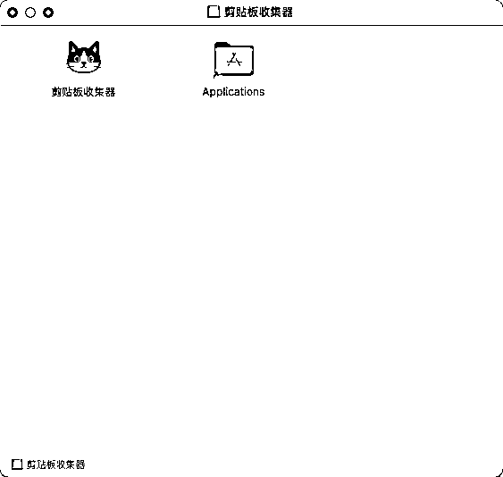
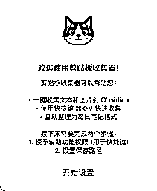
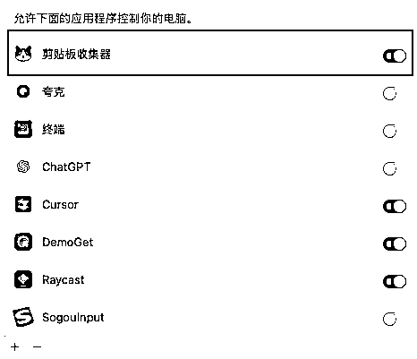
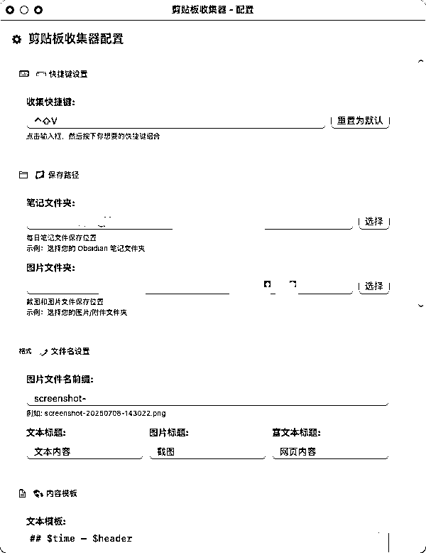

# [AI开发]一键保存素材到obsidian笔记

> 来源：[https://y9gfdw7i2i.feishu.cn/docx/CheodqFMPonyTExDUSDcuUsvnmb](https://y9gfdw7i2i.feishu.cn/docx/CheodqFMPonyTExDUSDcuUsvnmb)

为了节约几秒钟，我花了两晚开发工具。

和其他圈友一样，我每天要看大量的图文信息，经常会遇到一些想要保存的金句或者教程，但是我很讨厌“复制内容→切换到笔记软件→新建笔记保存→切换回内容”这么一个繁琐的流程。所以我想做一个小功能，可以一键直接保存我复制的内容。

起初，我想用苹果的捷径来实现类似的功能，但很快发现mac mini的捷径支持版本较旧，对微信聊天记录和富文本格式的支持非常有限。我就决定自己上手，指挥claude code开发了一个小工具，可以把我复制的内容直接保存到obsidian笔记。

* * *

## 是什么

ClipboardCollector的核心理念是 “不用切换，一键保存”：

### 1\. 操作简单：复制 + 快捷键

*   无需复杂步骤：还是一次复制，一次粘贴，就可以实现不切换应用，自动粘贴到指定的路径下。

*   保存的文件以 **日期命名**，当天的所有内容会整合在一个 .md 文件中，帮助用户轻松管理。

### 2\. 便于归档

*   想更高效地整理内容？可以借助 AI 工具（比如 gemini cli）将保存的内容进一步分类到相应的笔记文件中。

### 3\. 功能拓展的可能性

*   当前版本的 ClipboardCollector 支持单一快捷键保存，但我未来也计划加入多快捷键功能，每个快捷键对应不同主题和格式，实现分主题保存内容。

* * *

## 怎么用

用简单的截图来展示 ClipboardCollector 的使用体验：

step1：安装

还是常规的安装方法，打开dmg文件，把图标拖到文件夹里。

step2：配置信息

初次打开app，会直接跳出新手引导界面，照着操作即可。

这里面比较重要的是授予辅助功能权限，否则没办法触发快捷键。不用担心应用会搞什么其他的破坏，这个app根本没有联网功能和删除功能。按照引导来到这个界面，把后面的按钮点亮即可。

然后到快捷键和路径配置界面，配置好你想用的快捷键和想保存文件和图片的路径就可以了，下拉界面到最下方，选择保存即可。

需要说明的是，app初始是按照obsidian笔记的语法设计的，如果用普通的md阅读器阅读，文本可以照常阅读，但是图片是打不开的。

不过图片本身也是保存在了本地，找AI写一个语法转换的脚本就可以处理了。或者更简单的办法，安装obsidian即可。

* * *

## 如何体验？

ClipboardCollector 已开源，并提供免费下载使用，欢迎体验并分享你的意见。新手上路，还请轻喷：

*   项目地址：GitHub Release v2.3.5