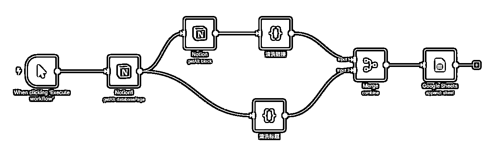

# 0-1 入门 n8n ，一文了解当下最火的自动化工作流平台

> 来源：[https://yneq2bf840.feishu.cn/docx/LYt1dbMq5o8nwDx2rQKciOfunjb](https://yneq2bf840.feishu.cn/docx/LYt1dbMq5o8nwDx2rQKciOfunjb)

近期在杭州SCAI内部做了个有关n8n工作流的简单分享，之前一直感觉这个工作流使用比较简单，但大家反馈还是有些问题存在的，所以整理了一下我对n8n的一些理解和认识发出来，希望对于不了解n8n的新手小白有一些帮助。

文章整体介绍了n8n是什么，n8n能做什么，n8n和竞争对手的比较优势，以及我整理的一些n8n学习资料和模板等等。

# n8n是什么

n8n是一个开源的低代码自动化工作流平台，我们一步步拆解下它的特点

*   开源：意味着可以本地部署、云端部署、同时使用基本免费，对标coze这种闭源平台具备更多的开发者进行社区建设，社区和共创氛围比较浓厚，很多bug可以在社区找到解决方法

*   低代码：基本不需要了解技术，部分代码节点通过AI可以把代码快速写出来

*   自动化：可以设置定时触发、自动处理、批量处理等，只要有API的功能全部都能集成到里面

*   工作流：流程化节点，重逻辑轻技术，只要理解业务逻辑就能快速实现业务流程设计

我对n8n的定义是一个可以实现高逻辑低代码的后端搭建平台。

简而言之所有批量自动化的机械式工作，乃至绝大多数AI应用的后端功能都可以通过n8n来完成，从我自己的使用体验来说，除了数据库外绝大多数的后端功能实现都是能用n8n来完成实现的，比如爬虫、生图、生视频、内容二创、内容上传、自动发邮件营销等等。

# n8n与竞争对手对比

n8n的核心对标产品包括dify、coze、Zapier、Make等，我们这里主要对比n8n和大家比较熟悉的国内产品coze。

coze是字节旗下的闭源智能体开发平台，主要优点在于部署后可以快速多平台发布，和国内平台的连接性更强，典型例子是各种小红书和抖音的内容二创智能体，也有比较丰富的插件库，配合与多维表格的强联通能力具备比较丰富的应用场景。

但coze的缺陷在于是个闭源平台，更新迭代和bug修复完全取决于字节的节奏（比如我在使用的时候遇到了coze内部的python库定义错误问题），同时coze不支持海外的各类模型，模型能力在一些领域相对比较差（当然有HTTP节点还是能用的就是没那么丝滑，包括类Agent能力等等）

n8n用下来我个人的感觉第一是界面用起来比较舒服、各种节点迭代和更新的速度很快，用例很多，各种功能只要掌握逻辑和API节点布置都能快速复刻出来，能够组合的想象空间更大，和外部程序的对接也更加丝滑。

|  | 后端能力 | 数据库对接 | 开源性 | 部署上线速度 |
| n8n | ☆☆，可作为API或者MCP融入任何其他程序，可部署配合任何开源项目一起运行 | ☆☆，存在飞书多维表格、google sheet、notion等节点，包括各种向量数据库的API也支持链接 | ☆☆，开源、可以本地或云端部署做业务后端，社区活跃度高项目用例丰富 | ☆，仅能作为后端功能使用，无前端界面 |
| coze | ☆，可以作为API，但是比较复杂，同时可拓展性低 | ☆，和飞书多维表格对接极其丝滑，其他数据库理论上通过API也能连接，但看到的用例比较少 | ☆，闭源，能力严重依赖字节，但对99%的用户来说没什么影响 | ☆☆，可以快速上线智能体和小程序，包括前端界面 |

在前期使用的话我认为coze和n8n没什么本质区别，但是n8n的上限是更高的，使用体验的话我个人感觉n8n也更加舒服和丝滑，我用n8n做程序后端基本全流程都非常通畅，用coze的话需要跑好几个流程、火山引擎、火山方舟、飞书开放平台、coze等等，搞得比较麻烦

我目前有一些依托coze的工作流，因为和多维表格有非常好的联动所以还在使用，但后续我预计也都会搬运到n8n上面（n8n在6月更新了飞书和微信公众号的节点，对国内的支持也变得更好了）

# n8n的使用案例介绍

这部分我主要介绍一些n8n的使用案例，有一些是我自用的，有一些是我从老外那里扒过来的觉得比较有价值的模板，大家可以基于此了解一下n8n可以完成哪些任务

## 3.1 基础用例——简单API请求与异步轮询

使用场景：AI web网站的API套壳和存储

一个简单的api调用和返回webhook响应的工作流，节点释义如下（全部用大白话解释，后同）：

*   webhook：接受程序的http请求调用n8n工作流，是开始触发节点

*   replicate生成图片：Http request节点，调用API生成图片

*   检测图片是否生成：Http request节点，异步轮询检查任务是否完成

*   检查返回的状态：if节点，进行条件判断

*   格式转换：Http request节点，生成的视频进行格式转换便于永久储存

*   Cloudflare r2：s3存储桶节点，储存视频到 cloudflare 云储存中

## 3.2 基础用例——复杂API请求与异步轮询

使用场景：AI web网站的API套壳和存储，可以用于一些相对复杂的套壳场景

这是我认为n8n比较强的地方，复杂API请求与响应的逻辑很清楚。对于小白来说你只要清楚了上面那个简单API请求的流程，就可以快速复刻出来这个相对复杂版本的。

完美匹配n8n的特点，重逻辑轻代码实现复杂业务流程，核心节点和上一个工作流完全相同，新增了几个数据处理的节点，节点释义如下：

*   Switch：条件筛选节点

*   Set：信息储存和传递

*   Merge：信息合并

*   Code：可以输入代码进行特定任务处理（全部可以让AI写，我一行代码都没写过）

这些节点的用法也很简单，遵循一个万能公式即可：

问AI（在n8n中实现X功能需要什么节点？）-> 找到节点 -> 截图问AI（如何配置这个节点？）-> 执行测试 -> 如果报错，粘贴错误日志问AI（分析并解决这个错误）

## 3.3 基础用例——自动化触发&写作功能

使用场景：是我在手机看到一篇不错的公众号文章/博客文章，转发给我的手机，然后可以自动化二创一篇公众号文章储存到我的google sheet/飞书/notion中

分为四部分（3/4可以合并到一个工作流中，但我目前还没集成到一起）：

*   手机转发文章给黑猩猩随手记，信息储存到notion中（这是其他开发者开发的微信客服机器人，免费的可以直接用，也可以自己搭建一个）

*   手动将notion表格的内容复刻到新表中（我自己测试黑猩猩的notion表格无法触发，应该是可以加到自动化流程里的，但是对我没更多的提效作用，我就手动贴一下）

*   自动化工作流 1 触发，从notion中将信息同步到google sheets中

*   自动化工作流 2 触发，n8n基于google sheets中的内容进行自动化二创

核心节点释义如下：

*   When clicking：触发节点Trigger，我这里的测试工作流都是使用的手动点击触发，换成对应的notion/google sheet trigger可以检测到新的内容增加/更新来对应根据那一行的内容

*   Agent：起到类似agent的作用，其中chat model起到大脑作用（主要是国外模型，国内只有Deepseek，需要用官方api key），可以加多个辅助节点，比如记忆储存、网页搜索、固定输出格式等等

*   Tavily：网络搜索节点，需额外下载，实现搜索指定网页和延伸搜索的效果，我这里主要用定向搜索功能投喂固定参考文章，也可以下载perplexity节点等等

## 3.4 复杂用例——微信公众号信息监控&筛选

使用场景：对指定微信公众号进行监控，每天定时爬取它更新的内容。

这个工作流的核心节点是配置公众号爬取的API，依此类推小红书、抖音、TiKtok、X、YouTube都有对应的爬虫，有的是官方的、有的是非官方、有的是API、有的是开源项目，但无一例外都是可以在n8n实现的，你可以通过n8n搭建一个专属于你自己的信息筛选平台。

参考代码如下（来自公众号“袋鼠帝AI客栈”）：

## 3.5 复杂用例——简单AI视频自动化生成&上传

使用场景：自动化生成视频并自动化上传、

大家可以看到这个相对复杂工作流的所有节点我们上面都见过，这个工作流的核心思路如下：

*   每日定时触发一次

*   AI自动生成视频创意，输出环境prompt、创意idea、视频prompt、字幕等

*   信息储存

*   AI使用生成的提示词生成视频

*   视频存储和自动化分发

这个场景基本可以完成60分视频的批量大规模生成，后续可以将更多的精力放到提示词优化，对标筛选和选题上面，中间还可以在每一个环节加入人工干预来优化内容输出的质量，从大规模输出60分视频达到高效输出80乃至90分的视频。

同时海外的社交媒体平台（YouTube/TikTok/X/Facebook）大多提供官方API，可以实现内容的自动发布。国内的小红书、公众号等也有非官方的解决方案，大家可以网络上自行搜索。

理论上，你可以搭建一个从选题、创作到分发的全自动化内容工厂。

参考代码如下（来自n8n官方模板）：

## 3.6 复杂用例——复杂AI视频自动化生成&上传

我目前搭建的自动化视频生成和剪辑工作流是使用Coze+飞书多维表格+本地ffmpeg完成的，后续会考虑把这一整套流程都搬到n8n上面（因为Coze之前充了些钱，想先都用掉，所以用coze做的测试）

n8n后续实现可行性分析：

*   内容批量生成：前面几个工作流可以实现批量提示词生成、批量图片生成、批量音频生成、批量字幕生成、批量AI短视频生成，那么后续唯一需要补足的就是剪辑的部分了，这块自动化剪辑基本都在使用ffmpeg（一个开源库，剪映就是在它的基础上做的）

*   集成剪辑：我目前的工作流是在飞书多维表格里面批量生成字幕、音频、图片，然后通过飞书多维表格的API导出数据到本地，本地ffmpeg脚本批量处理剪辑后通过API将视频上传到云储存库，然后将对应的云储存链接自动保存到飞书对应的列，整个过程人工操作的环节有两步，喂初始文案+本地手动启动脚本

*   n8n在线剪辑：部署n8n的同时可以部署其他Github开源项目（比如ffmpeg），然后在n8n中进行调用，这样的话就可以实现一个在线视频设计、生成、剪辑、上传的一体化流程，可以用来做为视频处理工具的后端

*   当然，这里面还涉及很多内容质量、技术细节相关的问题，这里仅展示可行性，而且是小白完全在一段时间内学习可以完成的可行性，不涉及很复杂的技术细节。

## 3.7 复杂用例——企业端线索获取

使用场景：B端用户获取线索

这是一个爬虫、信息搜集、信息处理、信息筛选的典型案例，核心节点为Scrape（信息抓取）、Crawl（信息爬虫），来爬取指定关键词类目的公司信息并完成初步整理

可以看到这个用例对应的节点也非常简单，只有2个核心节点是新节点，其他节点在上面都出现过，实际上只要搞清楚业务逻辑，询问AI你对应的业务需求可以通过哪个节点或者哪些节点组合完成，就可以快速在n8n上完成搭建，实现高逻辑低技术的节点流程化实现。

纵观X、YouTube上面的n8n博主，本质就是用几个新的官方节点或社区节点（开发者贡献）组合出来一个新的业务功能，本质逻辑完全是没有变化的，一通百通。

用好n8n的核心不在于节点或者平台本身，还是在于你本身的业务逻辑。

# n8n 如何使用

## 4.1 n8n部署方式

n8n有四种主要使用方式，官网使用、云托管、本地部署、云端部署，下面依次介绍：

*   官网使用：注册后可免费试用14天，后续需付费最少24刀/月（可以多换邮箱去薅）

*   云托管：一些云端部署平台帮你把n8n部署好了，购买可以直接使用，最低5美元，个别平台可白嫖（需要Github注册满半年）

*   本地部署：需要一点容器知识，用docker部署在本地，需要暴露公网供程序使用

*   云端部署：需要一点服务器知识，自己购买服务器，部署开源的n8n，主要花费为服务器费用

我比较推荐的方法是大家先去官网试用，14天后觉得合适可以切换到云托管平台，对于新手小白来说并发量完全足够了，后续用户量上去了可以考虑购买服务器在云端部署。

云托管平台一般每个月5美元的服务器已经足够了，用户量大再额外付费，clawcloud还有每月5美元的羊毛可以薅（适用于Github注册超过半年的用户，四舍五入就是免费）

## 4.2 AI赋能n8n搭建

n8n的本质是json文件，所以我们可以看到很多n8n模板都可以通过json文件下载和导入

AI可以很好的理解json文件，同时也可以快速赋能完成n8n搭建，通过vibe coding的方式搭建n8n的工作流是可行的，比如用cursor、claude来搭建n8n的json文件，然后一键导入到n8n中直接就能完成初始节点构建

但我本人不是很建议这种方式，本身n8n已经是一个极简的低代码平台了，搭建节点的过程也是加深业务理解、完善业务建设的过程，使用AI搭建工作流提高的效率并没有那么显著，除非你的流程已经非常熟悉，对n8n中的节点也熟悉度很高，那么是可以的，不然我还是建议从头到尾自己亲手搭建。

# n8n学习资料参考

## 5.1 生财n8n相关帖子

## 5.2 其他n8n学习资料

n8n自动化剪辑思路：

https://poe.com/chat/loh4ox79tpg1rg5num

n8n+飞书自动化：

https://mp.weixin.qq.com/s/NpXu6lNRhhYd5JUyhH7X0g

袋鼠帝AI客栈n8n合集：

https://mp.weixin.qq.com/mp/appmsgalbum?__biz=MzkwMzE4NjU5NA==&action=getalbum&album_id=3931445404583133190&scene=126&sessionid=408581405#wechat_redirect

YouTube n8n博主：

https://www.youtube.com/@AI-GPTWorkshop

n8n官方模板库：

Github开源n8n模板库：