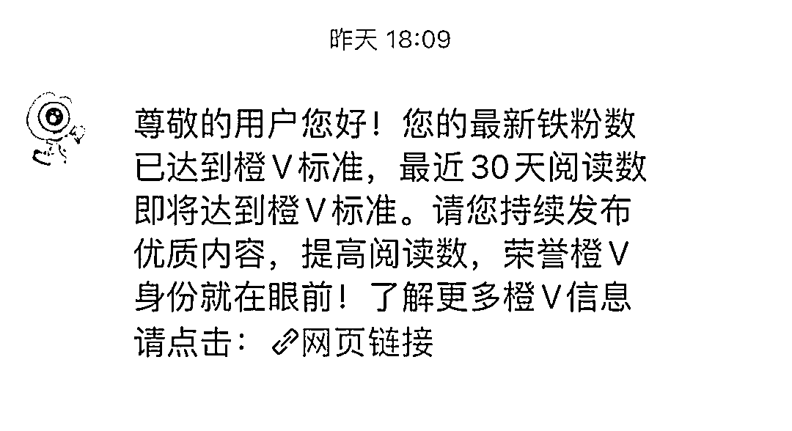

# 如何快速拿到微博优质创作计划的资格？

> 来源：[https://gd7vhxq16l.feishu.cn/docx/Uj7hdsoMEo9vPXxhf81cmuWRnJf](https://gd7vhxq16l.feishu.cn/docx/Uj7hdsoMEo9vPXxhf81cmuWRnJf)

hello，大家好，我是亦小亮，看到最近大家对微博优质创作计划热情高涨，我今天来分享一下，希望能帮到大家。

因为大家都知道我做公众号做了剧评和娱乐两个领域，所以做这个项目对于我来说就是顺手的事情。

做这个事情之前先看你是素人还是大V，如果是大V的话就不用太麻烦用到以下方法啦。

直接点上面报名微博寻星计划，想必生财很多大佬都有抖音、小红书账号，直接复制印钱就是了。

而像我们这些小米虾，还是老老实实做下面这些吧。

好了，正文开始：

首先其实这个项目，我称之为微博流量主收益，哈哈。

就像公众号流量主收益一样，只是每个平台对对收益算法不同而已。

废话不多说，开讲。

我们想要拿到赚这个钱的资格，就像公众号必须是500粉以上粉丝，但是微博这个资格要比公众号复杂一点，但是也不是不能轻松搞定。

我目前3个号（一个老号，两个新号），今天昨天才拿到两个号的资格，反正还没赚到钱，之前没拿到资格的时候，还不敢发这篇文章，哈哈。

目前这个资格我们从官网看看就是4个。

我们来逐一分析：

第一：已认证黄V

第二：粉丝量大于1000

第三：铁粉数大于100

第四：近30天阅读量大于30万。

从我做了两个星期多来的经验：

难度分别是黄V>阅读量>粉丝数>铁粉数，这是我个人经验哦，因为有时候黄V里面的要求是这个资格的迭代。

# 如何快速认证黄V？

1、先开通SVIP月卡。这个是微博名为规定的。有点像公众号花钱买500粉的感觉。

2、进行实名认证，用真人头像认证能秒过。点击名字，再点击编辑资料，然后点击头像认证，更换为真人高清头像，提交即可。

3、这里有一个问题，之前一直困扰我，就是我申请黄V时选的是兴趣领域，申请怎么一直通不过。

然而一个号用真人头像认证，一下子就通过了。最后才知道兴趣认证不仅涉及昵称、发博领域质量，还得等1-3天审核，太浪费时间了，如果想快速升橙V，这个办法建议直接放弃。

其实，用真人头像认证通过后，头像后期还能更换，也可以继续做兴趣认证。

我的一个号是直接头像升橙V ，第二个号就慢慢来，不同号，不同垂直领域。

当然，直接兴趣认证的话，要比较慢一点，适合不急，慢慢养号。

# 如何快速达到30万阅读量？

### 一、转发：

1、新人有流量扶持，但原创内容流量少，转发更容易起量，适合冲热搜转发。

2、转发内容选择：

优先选择热搜榜、文娱、社会榜前10的内容，直接点开热搜榜，看一些上升趋势的话题，比如大媒体发布的、正能量的、明星相关的热帖，以及突发热点。

切记：要避免转发政治类和负面内容，还有一些追星行为。

3、转发技巧：

转发时带上话题，当然也可以带上超话，先根据这个热点附上你的核心观点，然后用AI帮你润色，再转化成自己的语言，保持正能量。

4、平台用户活跃时间主要集中在

早上8：00-10：00

中午的11：30-14:00

晚上19:00-22：00

所以在这个时间段内发文效果更好，一天根据热搜情况，转发10条以上，尽量在早中晚流量高峰期前半小时发布。

5、这个跟公众号流量主文章获得的推荐概率有异曲同工之妙，有一点区别就是不会随意出池，只要正确时间正确操作追到热搜就OK 了。

### 二、把文章转发到微博群里：

我之前升橙心切，什么群都加，流量虽然起的快，但是跟后面的收益没有太多影响，这里建议还是要找相关领域的群加，这样的流量和铁粉才是收益的根本。

### 三、原创

升橙V以后的路，还是要靠原创，很多几万粉丝、10天升橙V，甚至5天的，最后的收益只有几毛，因为你是新号，你快速的跳过了最初阶段，当然得在以后的路补上。

所以，建议，内容这块保证垂直的情况下，再考虑流量，我第二个号就是尽量找垂直热点，每天一到两万阅读量，很稳，不像第一个号，没经验，什么热搜都转发，虽然有时候两条就能达到30万阅读，但是其它维度还落后着，一样升不了橙V。即使升橙V通过了，最后没收益，这样的操作意义不大。

不能什么热搜内容都发，一定保持垂直，这下你就会说，那我选择的余地就不多了，没事，咱们不急，热搜内容只是快速达到阅读量的一个方法。

第二个就是超话，每个领域的大V都有超话，你带上他就行了，第三，标签，这个跟公众号合集类似。

# 如何快速达成千粉目标？

目前我的方法就是3个：

第一，就是陶美丽说的用财字打头，成为财家班成员，快速涨粉，说个比较伤心的事情，我2022年报了村西边的微博课程，当时没坚持几天，就去做知乎好物了，我看了以前的老号关注的同期学员都已经是万粉账号，甚至百万啦，真的是当时没重视，不过现在就开始补，哈哈。

第二个，就是在同领域大V发的微博下，回复高质量评论。

第三，快速关注人，尤其简介上带有互关互赞字样的账号。

# 怎样高效完成100个铁粉目标？

微博为什么要设定，并且强调这个铁粉数呢：大概是在铁粉中获得更多曝光，有助于收获更多优质流量。

微博官方是这样介绍铁粉的：

铁粉提升小贴士

铁粉是反映粉丝和博主亲密度的产品，粉丝对博主30天内互动大于等于3天，则当天自动成为其铁粉，并展示铁粉标识。

自己的铁粉怎样才能多起来呢，

1、发博活跃起来，让粉丝可以经常看到自己，增加粉丝粘性(Tips：多发布视频可显著提升铁粉，观看二30秒也算互动哦~）

2、多发布有吸引力且粉丝可以参与讨论的优质内容，让粉丝同自己互动起来

3、多主动和粉丝进行互动交流，比如多回复粉丝评论和私信、定期发放宠粉福利等。

对于互动，官方是这样解释的，不限于点赞和评论。

铁粉等级是这样的，挺有意思的。

这个我们素人真的前期只能做好3点：

### 一、勤发微博

转发也行，当然能自己开宣传最好，也可以转发一篇，根据这个内容原创一篇，微博发多了，别人过来也会选择感兴趣的内容点赞，同时，每天都能点赞不同内容，要不然怎么达成3天的互动呢。

### 二、私信打招呼是积累铁粉最快的办法

多去关注简介带互助互赞的人，前期就靠这些人撑着。

关注以后，私信回复他们，帮助点赞互关。

别人能为什么天天给你点赞，还不是你也在点赞他们的内容。

1、设置快捷菜单，方便对方打卡，日常多进行转评赞，并且去对方主页回评，以此加强互动。

2、优先回复他人主动发来的新消息，不用理会已发送的内容。

3、打招呼时，可直接使用快捷菜单；若没有快捷菜单，可粘贴招呼语或发表情。

4、很多人不回复没关系，我们的目标是找到能互动的铁粉。

连续发三天消息，如果对方一条都不回，小火花也不亮，就从私聊列表中删除，只保留活跃的粉丝。

总之，只要样本基数足够大，就能达成目标。

### 三、抱团取暖

比如财家班

其实，我们可以建立一个生财班。

好了。㊗️大家早日收到这个消息。

