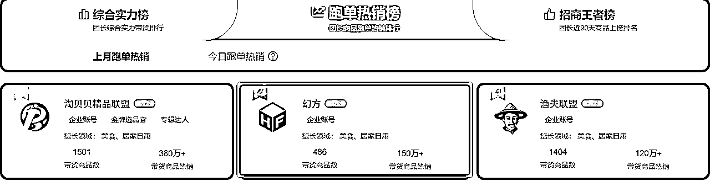

# B站好货思维延伸----被羞辱过后的反思

> 来源：[https://htw0q56th7.feishu.cn/docx/Dxk3dBaWXoUwrfxBfQqczwOQn6f](https://htw0q56th7.feishu.cn/docx/Dxk3dBaWXoUwrfxBfQqczwOQn6f)

回复了亦仁的评论之后，隔了一夜便后悔了，因为如果选择分享，便是与对生财的某一些精华帖所质疑，这种质疑也仅仅是主观意识，并非说完全得到了一个正确的答案而来挑战“权威”。

原超级标链接地址：https://wx.zsxq.com/group/1824528822/topic/8852421112888122

不可否认，我对B站好物这条风向标持绝对的赞成意见，正如亦仁所说“现在，机会来到了B站，B站开放了电商跳转口，还鼓励你成交。评论区挂蓝链、视频悬浮按钮直跳淘宝京东，意味着:平台允许你把流量带走，只要你能卖出货。”，平台只要对外是鼓励的态度，那么此项目绝对是可以做的，只是，它真的有我们想象的那么容易实现，或者说我们是否可以精益求精。

我在此贴上面看到的信息大致是B站现在可以带货（很早就开放了悬赏带货，只是最近我们大家一起把重心目光放在了这里，并且让更多的人看到了这个机会），以及是蓝链直接跳转到淘宝或者京东，那么我们赚取到的则是淘宝联盟或者京东联盟的返佣收益，在这之间，B站并不去抽佣，推广的产品全部都是我们自己自主选择的，或者根据官方为我们提供的一些良好的品，这也是传统的带货方式，并无特殊的观念，但是结合AI时代，以及现在AI剪辑视频，或者利用混剪等各种自动化让生产视频的效率提到了更高，我们矩阵化可以去打通这条链路，去吃下这个项目。

结合接触AI以来，我更坚信AI能够对于这个项目的赋能以及项目的可行性，但是我没有想着能够去把这个项目做好，反而第一时间想到的是我是否能做一个B站的好货带货榜单，第一时间，我和圈友@叶凌尘建联，询问相关事宜，第一次沟通并不融洽，不过后面还是进行了友好的交谈。得知现在官方是有自己的榜单的，不过我没1000粉所以看不到榜单提供的价值，以及结合这段时间的一些帖子看到的选品思路等等，我更是认为如果“野马数据”能够给大家挖掘一些优质的确实容易卖的品的话，那岂不是又增加了一份含金量。

# 开始请教业内人士

于是，我带上了我的想法去到了楼下公司去讨论。也就是图中红框内好单库综合排名这家公司，最开始也是在这大哥的邀请下我们来到了郑州，前面几年我们团队是只做国学这一个基本盘，所有的业务也都是围绕国学来开展的，从没去开展国学之外的业务，现在也开了公司，也去学习传统淘宝招商这个项目，旧饭继续捡着吃。

我把我的想法告诉了大哥之后，大哥给我们进行了一个“商业化”的梳理，直接pass掉了我做数据榜单的想法。

## 大致沟通缩减如下：

1.  如果你做的这个榜单有意义的情况下，你能让多少人看到你的野马数据？

1.  如果你做的这个榜单有意义的情况下，淘宝京东B站得有多垃圾或者多看不上这个板块的业务从而不自己宣发？

1.  如果你做的这个榜单有意义的情况下，你的网站是要发展VIP还是发展代理还是发展什么去盈利？

1.  如果你做的这个榜单有意义的情况下，那么相比较你其他的业务，你对他所付出的精力相比较别的业务是否合适？

1.  如果你做的这个榜单有意义的情况下，任何人都可以快速复刻你。

1.  那么请问你，做这个榜单的意义何在？

## 我大致的回答如下：

1.  我不知道有多少人能够看到这个网站，但是正如我起名时，选择“野马数据”，足以证明我一开始便不是想只做小红书一块儿的业务，所以我只是想要填充网站的内容，以显价值型。

1.  据我所知淘宝联盟，京东B站等都是有自己的榜单的，但是他们的榜单的品目并不优质。

1.  我宁可选择为爱发电，我现在想要的是证明公司的开发价值，而非去盈利，目前小红书的数据下我也没想过靠数据去盈利。

1.  相比较其他的业务，这个东西可能只会耗费我10天以内的功夫，从而可以搁置自动化运行，我不认为有没有什么值得不值得，毕竟我并不是大公司，需要权衡很多，取舍很多。

1.  人外有人，天外有天，这是常有的事情，如果因为这个而担忧，那我不如回庙里喝清茶。

1.  现在目标不够明朗，当初可能也只是想证明一下。

所以，最终，我被大哥的思维以及各位大佬的思维打败了，因为我们开了一个线上会议，这个线上会议人员是上图我没有列举全的，其实榜单头部这些一多半都是我们的朋友，所以这次的回忆是完全站在了淘客的角度去聊了这个事情。

实话说淘客我十年前就做过，淘宝的拼多多的招商也都涉猎过，但是没有深耕下去，也没有在上面赚到什么大钱，具体我不太了解，这次被他们好好上了一课，就正如他们所言，我们所看到的一些内容在他们眼中，如同持仓上亿股票的人，去看炒股拿了20W本金进去的人赚到了一笔钱的人的姿态，我们没有把这个项目给细分化。

如何细分，便是“生财朋友圈”这张图所给我讲解的内容。

# 我文笔不佳，大致拆分详聊一下，对于我来讲是醍醐灌顶，对于新手而言，或许也是一个思维的提升。

*   其中一个做社群的朋友，在不到两年的时间，用传统社群买粉买量投流等所有传统的方式，靠传统的淘客社群赚到了一个多小目标，现在几乎是躺平的状态，没事就是找我们喝喝茶，给我们说人生多无趣，在他眼中，我们现在所做的事情，无非是以传统的社群模式变成了自媒体时代的众创模式，以前是他们自己想办法开群然后去卖货，现在是B站成为了他们的角色，帮助淘宝联盟、京粉联盟去卖货，我们要做的只能是顺应趋势。

*   其中一个做招商的朋友，曾是人数破千的淘宝招商团长公司，在他眼中，谁能帮助他把招来的商品给卖出去，才是本事，否则只能依靠传统的社群或者好单库，大淘客等导购平台。

*   其中一个做精推的朋友，表达的核心是，现在我们即使自己上手选品，如果和他们的公司员工共同去操盘这个项目的情况下，一定是碾压我们的存在，原因无他，选品定生死，他们做精推，所以只选择大牌或者爆款，以及非常有价值有自然流量的，无所不用其极搞定对方与其合作。

*   其中一个做躺赚的朋友，倒是没有交谈太多，也是表示如果只是如此粗糙选品，不知道B站做这件事的意义在哪（当然这个后面再分析）

总结来说，他们也认准B站能做，且对于他们的业务也能够放大，他们去年尝试过B站带货黑神话悟空这波热度下的ps5，一条视频卖爆了几百台，属于是超出公司认知下的事情，但是这是现象级的，运营短视频对于他们而言是不擅长的，所以他们是非常愿意去做短视频的，只是他们也没有太好的方法去下手，如若真的可以借助AI去生成带货的视频，让所有人可以无痛去制作视频的情况下，那么这件事情就好玩的多了，因为可能某一条视频爆了上百上千万的播放，便能够带来巨大的收益。

此处交谈内容：

“大” 假设为我。

A、B、C、D、E则为生财的所有参与B站项目的人。

如若我能组成这么一个班子去做这个事情，这个事情将是不可估量的级别，我来提供选品内容文案，ABCDE负责制作发布视频。

此时我提问：

为什么人家要听我的愿意去相信我选择的品。

大哥回答：

第一：那是你的人格魅力去做到的，人家为什么选择你的品是你的事情。

第二：如果是我在做这件事情，我的品一定比他们自己选择的品要牛要容易卖，给他们几天试错的时间，拿咱们提供的品和他们自己找的品来比较销售难易程度以及利润一定会选择我们。

此处交谈内容：

大哥问：此处左侧1K是说假设我们有1000个人，无论是创业粉，宝妈粉还是任何人，只要想通过B站好货参与进来的人，如果他们都很优秀，也都执行下去了，你能够保证他们是实现右侧月入3K?5K？还是1W?，

我回答：

我都保证不了，生财有术的航海也不能保证每个人都能够赚到钱，以及还会有人不能够上岸，这完全靠个人，就像我在有的航海能够拿到成绩有的航海并不能拿到成绩一样。

此处交谈内容：

大哥问：那请问你是缺项目吗？你要选择这个项目？

我回答：我说了我只是想要简单的做一个数据网站去填充展现价值型。

再问：那你是不是要赚钱？

我回答：是的。

复问：那想要做B站好货的是不是大多都是缺项目的想要赚钱的？

我回答：大概是（因为我个人并不关注项目本身，我更多是关注项目所涉及的“铲子”类的玩法）。

追问：那不就得了，你就想办法让他们能够赚到钱不就好了嘛？即使赚不到3K,你让他们平均能赚到这个数也是你的本事，当然，这是我们在给我们自己设置压力。

此处交谈内容：

我们是否能让这一千个人能够做出来300W的销售额？这是我们要考虑的事情。下面我们聊如何实现它。

此处交谈内容：

大哥问：现在我们来聊如何实现这一千人实现300W的销售额，按照现实的角度而言，这不好实现，但是如果你说AI是可以生成视频的并且大量去输出视频，你只需要教会这些人去使用AI，去制作视频，然后去卖品就好了，他们卖品卖的不好，你再提供你的数据榜单给他们，他们尝试之后感觉，诶，确实好用，是否会依赖你？

我回答：我想这个肯定会的。

大哥讲：那么如果是我做这个东西，我会先买一千个创业粉，做一个小的社群，哪怕是免费带项目，免费培训出资教他们，给他们分为三个赛道，X为3C数码，Y为服装，Z为百货。我会测三种不同的类目去看最终哪一种比较好，然后再结合AI生产视频的工具，最终再让这个事情去放大。

# 总结：

所以我们需要重交付，如何让用户可以无痛生产视频或者我们给用户提供视频，让用户可以尝到收益，那么我们的目的就达到了。

可能很多小白不知道淘客的玩法，普通的淘客可能只是接触到的就是淘宝返利这一种，而还有一种就是招商团长，他们分佣商品的销售额，也就是说，如果我们提供的品目，是我们招商来的，那么我们额外有这份收入，返利则给到用户自己独吃。

其实再往下去一块一块的截图也没什么意义，因为在内行的眼中，可能这对话没一点营养，如同昨天和叶凌尘我们电话沟通一分钟不到，他就能预判这场对话的所有内容，而在外行眼中可能比较独特一点。

# 那么咱们再来聊一点其他内容，假借B站的名义去分享一下。

我曾问大哥：你一直在强调咱们自己的手上的品好出，那么好单库，大淘客人家拿不到这些信息？人家为什么不能做这件事情。

大哥回答：你见这些导购平台他们是分享各大团长的商品，而他们自己有做吗？而为什么有的团长出单很迅猛，有的团长出单则是不怎么样，这里面有很大的学问，就是文案怎么去写，我们做精推要去把一个商品所有的细节给揉的非常的细，让用户可以感觉到是真心利己的存在，所以文案是至关重要的。而至于一些帖子的选品逻辑，我认为是完全错误的，第一点，里面所提到的所有的导购平台，他们的数据都不切实，有刷榜的可能，也有买量的可能，我们如果严格按照这种选品逻辑的情况下，得到的榜单数据不一定真实（这点我确实昨天得到过印证）。这些导购平台五块钱十块钱就能发布一条商品，招商专业玩躺赚的就挂在上面，出单互利，不出便罢，这种商品能有什么质量？只有数量可言。再有就是社群的维护度，你的社群你要知道你的粉丝群体是什么样子的，所以你要推荐给他合适的商品，如同你若是要做视频，那么你也要挑选好自己的赛道，去确认好自己的人群，否则再优质的品你也不一定能够带得动。还有我们手上有很多高佣定向的品，他们自己玩只能拿到平台结算的收益，高佣定向线下给我们结算的收益，如果我们也分润给用户，你说用户是否会带我们的品？

实质一问一答的回答大致记忆起来这么多，主要是讨论的过程比较多。

# 分享一下我们的部分讨论：

### 这个东西为什么未来量值会很大？

因为自媒体的传播力是非常庞大的，某一条视频带货链接可能顶发一年的作品。

### 普通人是否可以做？

普通人很适合做，无痛去尝试一下新项目，打通一下项目逻辑，未尝不可，无非就是一个刷千粉的钱。

### 这个东西能做多久？

并不看好，因为可能B站现在是在要内容的建设，以及搭建自己的电商，所以先让电商气氛给活跃起来，而我们现在看到的大多的作品一张图两张图拼凑去动起来的账号，虽然也能出货，未来一定是官方会给抛弃掉的，这个拭目以待，只是我们大多普通人可以做多久是多久。

### AI是否可以生成视频？

这不好说，目前我们都没有找到好的方式去生成优质的视频，而普通的图片变视频这个已然成熟，但是效果并不会长久利好。目前普通人能在短视频上面拿到效果可能还需要等待AI再成熟，咨询了几个做AI的朋友，现在AI视频效果方面想让众人皆可用的话，还需要一大段时间或许才可以，当然这是我们妄自菲薄的猜想。

### 这个东西如何最大利益化？

一：放单方，团长角色：合理利用好做此项目者，去替自己剪辑视频带货种草，让自己的招商服务费更上一层楼。

二：接单方，UP主即大众：我想大多数人可能都是初次做淘客，淘客若是做5W的交易额才能升级最高权限，佣金会最高，如果拿不到最高收益的话，这是白白浪费掉的钱，可以加入别人的系统，如果冻宝盒，花生日记这类平台便是嫁接系统，使用他们的高级账号拿到更高的收益。

三：服务商，可以自己开发一个系统，类同第二点，让自己的用户绑定在自己的下面，可以吃淘客的收益，同时，现在团长的账号已经不开放了，也可以开放团长账号同样的玩法去收取服务费佣金。

四：做优质的UP主，接商单，吃广告费，当然这个过程可能漫长而痛苦。

简言之，B站就是视频带货形式，知乎就是文字带货，这个一开始亦仁已经讲过了，所以这个东西，就是冷饭硬吃了，至于谁能在这个阶段做到差异化，谁便能快速拿到成绩。

# 结尾

好了，我给这篇就是定义给小白分享点心得项目逻辑经验，大佬无视，唯恐得讽。

至少，正如亦仁说的“有碰撞也是好事”，至少这次的碰撞带给我了一些新思路，不知道是否能给诸君带来什么样子的感悟。